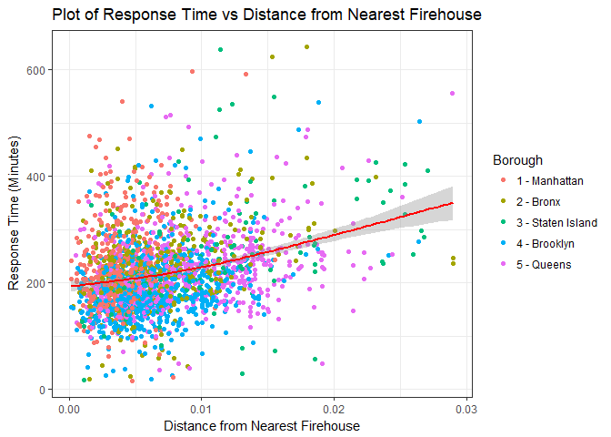

#1. Location of Severe Fires

In the leaflet map below I have provided the location of severe incidents within New York City. In the pop-up information, you can see details about the incident, date, time and duration.

<!--html_preserve-->

<script type="application/json" data-for="htmlwidget-141a824922de44b3ebee">{"x":{"options":{"crs":{"crsClass":"L.CRS.EPSG3857","code":null,"proj4def":null,"projectedBounds":null,"options":{}}},"calls":[{"method":"addProviderTiles","args":["Stamen.TonerLite",null,null,{"errorTileUrl":"","noWrap":false,"zIndex":null,"unloadInvisibleTiles":null,"updateWhenIdle":null,"detectRetina":false,"reuseTiles":false}]},{"method":"addCircles","args":[[40.7896311,40.6537806,40.8376726,40.75533,40.7475915,40.713269,40.8145029,40.6255401,40.8365982,40.5741456,40.7530101,40.6909905,40.693022,40.830181,40.6846619,40.8228961,40.8253285,40.7161881,40.5778906,40.6271013,40.6915487,40.6277816,40.8547742,40.8376726,40.83306,40.8068287,40.6785715,40.683317,40.680294,40.8272518,40.7609205,40.6909686,40.6157166,40.66307,40.7087988,40.6431272,40.7120711,40.8520482,40.6580404,40.6891808,40.892043,40.650969,40.6688844,40.611838,40.7747911,40.629294,40.7123586,40.6325086,40.7518389,40.6938168,40.6785162,40.7792193,40.696354,40.8640865,40.6440977,40.6497724,40.6256834,40.6656761,40.6586479,40.7074026,40.7124464,40.767267,40.7995653,40.7293961,40.798945,40.8341233,40.7482299,40.684389,40.8750651,40.6760051,40.7005923,40.6125807,40.8312965,40.5898361,40.697747,40.8736964,40.7601572,40.8515529,40.678848,40.6440977,40.6981779,40.6832555,40.5977813,40.689161,40.6375197,40.7600597,40.6127771,40.767267,40.6675125,40.6911099,40.8343783,40.6022332,40.6824413,40.7232838,40.7362842,40.8200893,40.8463347,40.6532915,40.7972632,40.694572,40.5898389,40.6462579,40.6468818,40.6965612,40.7672719,40.7667646,40.8802474,40.694746,40.711801,40.681758,40.7021768,40.5987408,40.8272518,40.8956007,40.8252681,40.5925568,40.8660651,40.68221,40.593487,40.7736925,40.7176171,40.6192922,40.6341186,null,40.6695654,40.6644738,40.763368,40.704881,40.7428947,40.8360928,40.69195,40.828552,40.765359,40.6083482,40.6233405,40.664997,40.662835,40.6978113,40.6821237,40.7756059,40.680385,40.7133423,40.8310945,40.5954985,40.6115795,40.6764516,40.675037,40.8411102,40.8259061,40.6250008,40.7660942,40.6813005,40.767267,40.6997926,40.7477997,40.5890391,40.7157032,40.7370037,40.6902272,40.6429175,40.7412434,40.695845,40.7183857,40.8245652,40.6947808,40.75533,40.8283767,40.6263234,40.5689688,40.7064678,40.8445717,40.6288924,40.6234886,40.6798838,40.6331944,40.6580404,40.8062714,40.6331944,40.7507757,40.6366274,40.618243,40.6624144,40.8376036,40.8263483,40.6385162,40.7178006,40.8444033,40.8706786,40.6697368,40.8443458,40.8878455,40.6975765,40.7908156,40.6159856,40.8681819,40.6817799,40.6536517,40.6879578,40.5936492,40.8339028,40.7591376,40.8864651,40.808055,40.6879475,40.7416224,40.830575,40.8696771,40.6799111,40.6911099,40.628564,40.6698156,40.712734,40.8402557,40.8714368,40.6323294,null,40.720046,40.6263679,40.6719316,40.8252492,40.7494974,40.7027385,40.7005923,40.7988378,40.7403608,40.726162,40.8624708,40.8043683,40.623915,40.8231519,40.620722,40.6644957,40.67763,40.7851039,40.8415353,40.6762072,40.797988,40.6709946,40.759637,40.6323136,40.6656761,40.7175758,40.6736824,40.8652023,40.7149319,40.7704844,40.7512121,40.6664226,40.6878827,40.8785105,40.7431861,40.8003236,40.731623,40.6672244,40.6414276,40.7320289,40.8789858,40.6903067,40.6775066,40.7190683,40.764625,40.5955409,40.8852213,40.7217896,40.664997,40.6673735,40.890244,40.7620774,40.766016,40.6386713,40.643285,40.794316,40.7334788,40.8272518,40.8450485,40.6759771,40.7240626,40.7206075,40.7426633,40.7817204,40.6795789,40.69541,40.645458,40.617534,40.8514876,40.6644957,40.7883666,40.6492793,40.7152154,40.7859096,40.678758,40.7458025,40.647344,40.6155781,40.6498807,40.79725,40.7148199,40.690334,40.79935,40.6715889,40.7589541,40.8322246,40.745063,40.8161056,40.7381375,40.5954985,40.7597616,40.8167638,40.7385115,40.6639572,40.7709869,40.7838194,40.679317,40.7636563,40.7896311,40.6735749,40.6166187,40.5885832,40.7040377,40.752913,40.8684188,40.5834881,40.7294057,40.692968,40.8514876,40.7432938,40.6714824,40.6696857,40.6289688,40.8459533,40.697053,40.6733229,40.8262866,40.703688,40.682232,40.6431288,40.8650373,40.6959468,40.5351171,40.6602674,40.7654129,40.7019871,40.6715773,40.6792777,40.5754975,40.5839354,40.603877,40.7390042,40.7047981,40.7004948,40.7498942,40.7678433,40.7564494,40.8339028,40.6027214,40.6032709,40.8789203,40.5859899,40.6859721,40.6706614,40.7144349,40.705253,40.7737724,40.810014,40.8272518,40.669217,40.70689,40.6142588,40.6325086,40.8395224,40.728672,40.728672,40.6945993,40.8424821,40.773813,40.7678433,40.7641402,40.6654891,40.690405,40.6699273,40.6294744,40.6672244,40.7942847,40.675828,40.8578912,40.67087,40.685806,40.7936179,40.6431272,40.765359,40.688928,40.7367202,40.7090269,40.686619,40.6468818,40.705534,40.6826611,40.7037981,40.7584332,40.8299163,40.8603573,40.7123672,40.8624708,40.7621935,40.8610395,40.7250728,40.647905,40.7320289,40.5986499,40.708944,40.711757,40.7352956,40.7088212,40.6257285,40.828552,40.8525255,40.5955794,40.7954774,40.6763835,40.8519846,40.7175486,40.831622,40.6318492,40.6387292,40.697801,40.8296624,40.7504266,40.6487614,40.6674677,40.6589793,40.8231982,40.8517966,40.695139,40.645106,40.767267,40.7306517,40.7507095,40.6975388,40.6764563,40.7245847,40.6504055,40.8465512,40.699736,40.8641484,40.798945,40.6254938,40.7641402,40.7305359,40.6810973,40.7697512,40.7747911,40.834184,40.6537806,40.664827,40.680236,40.6911686,40.6995541,40.7311286,40.7275967,40.704876,40.655555,40.8129648,40.828552,40.6761071,40.654427,40.6689702,40.6761749,40.5449269,40.8145502,40.618243,40.630023,40.6806645,40.6710418,40.7722387,null,40.8179282,40.688535,40.6412196,40.7812786,40.7915751,40.6368996,40.7654129,40.7654129,40.684358,40.6043649,40.7469705,null,40.7314293,40.6976238,40.750294,40.7457829,40.5938867,40.8488503,40.8448026,40.6979208,40.7658305,40.7271055,40.639854,40.7427209,40.6682201,40.7076534,40.5971315,40.559889,40.6832555,40.6913821,40.8084815,40.7523188,40.5487711,40.6263234,40.6935602,40.6953611,40.7015019,40.813845,40.8939239,40.7250601,40.8798952,40.614782,40.699808,40.7272605,40.8211329,40.6329817,40.750276,40.7994739,40.6887901,40.7517421,40.8425918,40.6982354,40.6045554,40.8561652,40.6644869,40.7398435,40.8531747,40.8430514,40.7906046,40.6439853,40.6634371,40.848957,40.7272842,40.6745504,40.6385162,40.6883972,40.798781,40.8721708,40.7869987,40.8871345,40.6675125,40.8084815,40.8206448,40.8180736,40.7020844,40.7875785,40.7464661,40.7988378,40.6717858,40.7857376,40.8156548,40.6674798,40.6663616,40.6551346,40.8312965,null,40.7947798,40.7473337,40.6472084,40.6930761,40.8098689,40.6498807,40.6320152,40.5822632,40.7378448,40.6333991,40.705413,40.8457618,40.6815494,40.6638578,40.747196,40.5643669,40.6768203,40.7717443,40.7623502,40.6117127,40.5504971,40.5765475,40.8157688,40.7024398,40.6698261,40.5826684,40.6486479,40.6690587,40.7001484,40.605946,40.8486926,40.713269,40.6717858,40.869135,40.8514908,40.5883873,40.6012563,40.6385162,40.7041269,40.68024,40.5558469,40.6099786,40.7501752,40.5971315,40.6947925,40.6698261,40.8482605,40.79935,40.8222748,40.671774,40.69394,40.6488379,40.7507757,40.7055303,40.849323,40.6352975,40.7173989,40.8303174,40.7988378,40.743778,40.738445,40.6424793,40.646738,40.6941104,40.6541536,40.7073943,40.7462516,40.763368,40.7092667,40.729446,40.7293685,40.8469612,40.8743665,40.6617965,40.6493774,40.857538,40.6261768,40.7169701,40.8344303,40.733398,40.6686015,40.8256843,40.70303,40.7173109,40.8111677,40.7376317,40.6556633,40.6430688,40.8182115,40.7641402,40.8421711,40.8253285,40.6389001,40.7235068,40.702313,40.8516539,40.6643667,40.752857,40.8369441,40.8339028,40.7250728,40.8395224,40.8365951,40.7584332,40.7636234,40.5878084,40.8023095,40.8253285,40.8253285,40.8404447,40.6989682,40.6208557,40.6704332,40.6779802,40.7058722,40.766016,40.6808089,40.6879475,40.831137,40.8096932,40.657945,40.747243,40.6647137,40.5950465,40.6329817,40.6736824,40.8283767,40.8030321,40.6276706,40.6576614,40.847287,40.6360225,40.8272518,40.593149,40.697053,40.6775334,40.858386,40.6795789,40.7927713,40.7259303,40.745952,null,40.6639572,40.6643667,40.6941331,40.7792193,40.831622,40.6794385,40.8029919,40.8258196,40.7679183,40.7263608,40.7153245,40.806408,40.8241559,40.6708734,40.742261,40.8150973,40.6690558,40.673916,40.712734,40.5643721,40.6233405,40.5558534,40.6886668,40.7123906,40.592559,40.663069,40.7654129,40.6797237,40.786213,40.8557533,40.6785162,40.680569,40.8885459,null,40.6072025,40.6973197,40.6081078,40.62206,40.6423101,40.8285133,40.8870855,40.7280972,40.8387288,40.6598588,40.8489321,40.8895068,40.7657168,40.6870006,40.8224895,40.708214,40.5930865,40.7520899,40.760861,40.6148089,40.7412434,40.7362903,40.8166377,40.608797,40.74655,40.703543,40.8472474,40.9179949,40.8285133,40.8285133,40.828641,40.8523427,40.8145502,40.7634937,40.6720265,40.6598384,40.8477599,40.6441019,40.7046077,40.7487467,40.7095145,40.672837,40.672667,40.6490992,40.7656661,40.643285,40.5485488,40.5870827,40.8743242,40.8595729,40.6988892,40.8145029,40.838928,40.8841897,40.766016,40.670589,40.706237,40.7345398,40.688535,40.7329588,40.7032599,40.6046529,40.8714368,40.683771,40.6211937,40.8087289,40.6407044,40.7714126,40.6914285,40.6232075,40.8977024,40.7024398,40.8600348,40.7242841,40.8387288,40.5444206,40.714069,40.6730326,40.7669761,40.6691924,40.8159328,40.6723159,40.633516,40.699801,40.5794801,40.7370037,40.5998457,40.7472355,40.5826684,40.7383645,40.6806645,40.8487726,40.604486,40.5825499,40.6333453,40.6134788,40.7128658,40.7280054,40.752381,40.7115017,40.680294,40.7656661,40.8236587,40.7718639,40.5906398,40.6227937,40.8741761,40.6467217,40.5700062,40.8743665,40.7011587,42.9807764,40.692902,40.8056135,40.763368,40.6653055,40.684001,40.622585,40.8382585,40.587104,40.824944,40.767267,40.6648752,40.7278553,40.6028516,40.7994169,40.695289,40.8260012,null,40.7417814,40.7432937,40.72866,40.8182385,40.8118668,40.7747911,40.7362278,40.7117748,40.7120711,40.6462657,40.8451638,40.6900255,40.6902493,40.699819,40.790896,40.7657168,40.6720828,40.6374242,40.6933574,40.7040438,40.6752022,40.7261938,40.7019274,40.6688844,40.718648,40.8435424,40.8703483,40.6980091,40.6443876,40.8426459,40.7646961,40.6900255,40.7246172,40.6624144,40.7353898,40.7157032,40.682584,40.637755,40.8517966,40.7360172,40.6782401,40.7168029,40.8289769,40.8624708,40.8707745,40.8593361,40.6255924,40.652109,40.703747,40.8317579,40.7041208,40.7631584,40.7743404,40.7765182,40.749791,40.6997926,40.729446,40.8344303,40.8261291,40.718941,40.7194779,40.6607154,40.6342269,40.7100676,40.6372235,40.7136408,40.683154,40.6300412,40.830575,40.7609205,40.6257285,40.7010602,40.8163934,40.6362546,40.8275641,40.6074203,40.714295,40.7185365,40.7781416,40.8451505,40.7184121,40.7161881,40.8489876,40.6681067,40.7524816,40.7184892,40.740787,40.7789217,40.5837297,40.8411102,40.8697672,40.7608261,40.8627963,40.8298737,40.8538777,40.6879475,40.7609205,40.6872234,40.6955795,40.8203177,40.8516688,40.7665848,40.6916468,40.6904832,40.857538,40.4520226,40.6432112,40.7320369,40.8428815,40.692889,40.790896,40.67921,40.713269,40.664827,40.8456993,40.794316,40.7328809,40.6644957,40.7869151,40.6109061,40.618113,40.8273936,40.6768991,40.6710418,40.8115224,40.6321936,40.6886668,40.8134276,40.5839688,40.820536,40.6848064,40.8739816,40.7384705,40.8053365,40.8231982,40.6150916,40.7422562,40.7534898,40.748801,40.7849942,40.7329221,40.6216239,40.686323,40.8376726,40.7432937,40.870562,40.7064935,40.7164701,40.7804359,40.7581416,40.7273161,40.7126574,40.7209004,40.713269,40.6093424,40.6909905,40.6551008,40.6768236,40.6759771,40.5792193,40.7267622,40.7050871,40.7507757,40.7118647,40.9206623,40.7301456,40.7789952,40.8305358,40.6769442,40.6390582,40.646738,40.683038,40.715766,40.767532,40.8272518,40.833213,40.6864673,40.7543987,40.897626,40.596324,40.6301639,40.68024,40.6647137,40.8231295,40.7261134,40.6921695,40.7101324,40.828296,40.7275248,40.7772491,40.8341233,40.6461399,40.7248137,40.5857119,40.7032286,40.765874,40.6727524,40.7634937,40.830181,40.7599095,40.6955497,40.631034,40.644514,40.6353312,40.6112501,40.7076534,40.6461346,40.7538674,40.790998,40.6366274,40.8216621,40.8663153,40.7174081,40.677303,40.7066508,40.8267557,40.6094882,40.6749963,40.8432448,40.8652468,40.5610776,40.6796276,40.7757218,40.8415353,40.6356541,40.7507095,40.59973,40.706758,40.6063299,40.7075969,40.6835961,40.7115017,40.6706903,40.8139962,40.6564949,40.682308,40.8446428,40.7054161,40.7092667,40.7751216,40.5525017,40.6598217,40.5952746,40.8176818,40.636097,40.8268321,40.747765,40.8106086,40.7240626,40.539421,40.7048245,40.7328746,40.6739875,40.6646102,40.699736,40.8496021,40.8373589,40.7837168,40.7293685,40.7146301,40.8477319,40.7497177,40.6713087,40.8376726,40.6638578,40.8376726,40.7583563,40.6350203,40.8520482,40.7540642,40.641745,40.7060006,40.7313474,40.70968,40.6064816,40.8555207,40.6796276,40.6387292,40.8663153,40.8001992,40.6168401,40.6234544,40.762107,40.8406087,40.7023572,40.701404,40.729446,40.681211,40.8278208,40.8259447,40.6389508,40.6772872,40.6333453,40.605069,40.6766472,40.7132956,40.8221704,40.6321887,40.8669013,40.6879475,40.7267125,40.6768203,40.8672693,40.8154643,40.5780091,40.8504173,40.7752992,40.871423,40.7527625,40.6416829,40.7554039,40.7550402,40.5552269,40.858386,40.8290247,40.684001,40.704825,40.6885626,40.6706903,40.627833,40.6107365,40.818462,40.7554773,40.8122959,40.8320331,40.589285,40.6959468,40.767532,40.695956,40.7124318,40.7362278,40.8349665,40.683154,40.7486451,40.7749409,40.67301,40.7032959,40.8241065,40.8277784,40.7506175,40.7095639,40.7335212,40.7208775,40.838014,40.689354,40.6981779,40.7187073,40.8438329,40.7405375,40.8182115,40.6333101,40.8044031,40.5792193,40.764077,40.8557533,40.6973134,40.7396527,40.682077,40.6512331,40.6516145,40.6674798,40.8377179,40.6204,40.673916,40.7588646,40.603877,40.6770756,40.6189018,40.7779595,40.6320152,40.6267789,40.6663103,40.8023095,40.7579032,40.663818,40.7161,40.8432448,40.7320289,40.6630258,40.6568598,40.834009,40.8392298,40.680312,40.8392298,40.8264347,40.7896311,40.6303834,40.7736925,40.6462657,40.8459533,40.7770587,40.7145257,40.7131237,40.7852539,40.6996768,40.587976,40.6134331,40.8560877,40.840195,40.7152403,40.7059678,40.7339528,40.6735145,40.6597606,40.6389001,40.620131,40.652192,40.7299553,40.690405,40.6044395,40.69538,40.8268321,40.9035599,40.6411325,40.6064568,40.7591565,40.8661734,40.708542,40.5457563,40.6064568,40.7284627,40.6897086,40.6643667,40.6501766,40.6267789,40.8119081,40.5741456,40.7326097,40.6536036,40.8461516,40.8408568,40.7563257,40.6191944,40.6914285,40.733016,40.6369565,40.7230614,40.571728,40.7736925,40.8239304,40.7374733,40.7163828,40.6753358,40.8799393,40.6063299,40.7583563,40.7116977,40.7736711,40.6841283,40.6374784,40.7292376,40.7217267,40.6846619,40.8704351,40.6748242,40.6064568,40.7010204,40.8129648,40.6655332,40.5748797,40.6061616,40.7169131,40.7168212,40.773813,40.6874929,40.6874929,40.6784022,40.7022571,40.618585,40.7782237,40.830503,40.8883378,40.6761024,40.7263496,40.6287633,40.6360425,40.6685763,40.7279634,40.8989352,40.7135157,40.7779595,40.6751974,40.7628454,40.6840453,40.6867667,40.740787,40.629385,40.7390042,40.7601784,40.7235064,40.7019274,40.5806558,40.688245,40.6122987,40.6956898,40.7040202,40.7030717,40.580723,40.6913821,40.7255879,40.8068287,40.7033756,40.6586479,40.706597,40.6888543,40.713655,40.84147,40.8428815,40.798945,40.7025075,40.6508471,40.7908156,40.6323644,40.7608224,40.7591565,40.7802844,40.6490992,40.5926796,40.5560714,40.683742,40.8663153,40.6648458,40.7616323,40.7293685,40.646738,40.6885626,40.8684188,40.635318,40.618644,40.6287633,40.7804471,40.6485533,40.810843,40.6659664,40.6208304,40.6368786,40.6359604,40.6193242,40.6331944,40.7349548,40.6701536,40.6522995,40.6780731,40.6441151,40.8842045,40.703115,40.669543,40.7772491,40.7437594,40.6955795,40.8395224,40.7453976,40.708127,40.8557565,40.7110193,40.6334757,40.6574649,40.8637976,40.8287372,40.6978195,40.7002225,40.7331191,40.7145257,40.679097,40.6689702,40.6562894,40.6760371,40.6072025,40.700187,40.8200893,40.7096559,40.8030321,40.6392915,40.8409932,40.6597606,40.8245652,40.8043683,40.6502296,40.68323,40.8929633,40.7281603,40.7634937,40.6785162,40.831624,40.6706903,40.8312965,40.5955794,40.7197594,40.6720265,40.7458918,40.8275641,40.8130561,40.7927713,40.6471387,40.5497768,40.7020412,40.6635409,40.7482299,40.7326097,40.7361492,40.6411723,40.7024398,40.7653898,40.8884724,40.7466763,40.7082657,40.6516145,40.85277,40.8784403,40.704881,40.6223666,40.8478503,40.5451312,40.701553,40.8287552,40.8285984,40.744031,40.8531747,40.7348847,40.7073943,40.5010869,40.8741761,40.8107804,40.6481094,40.6296178,40.6420002,40.8353918,40.6680968,40.7890023,40.8259021,40.6337817,40.6468818,40.6609752,40.7101325,40.7233958,40.6255401,40.6580417,40.773813,40.7559092,40.667653,40.57654,40.7507757,40.5673593,40.7075969,40.5625625,40.7258739,40.806408,40.752857,40.625115,40.7191315,40.7624101,40.70823,40.7534898,40.8253285,40.7187442,40.7583563,40.8273936,40.6696791,40.8025058,40.6960035,40.8003236,40.7288781,40.6508249,40.7293961,40.7184755,40.6202587,40.699028,40.7262313,40.7589541,40.7777048,40.8362532,40.702705,40.7365564,40.6078381,40.8157958,40.7815475,40.7143082,40.6022332,40.8770007,40.846506,40.6078078,40.7092667,null,40.7992319,40.7190145,40.6512331,40.8140898,40.5552269,40.6705445,40.8167638,40.8455046,40.680294,40.7355638,40.6431272,40.8626711,null,40.6866976,40.6382714,40.7501276,40.7104657,40.6458021,40.6315493,40.654196,40.5507875,40.702259,40.695956,40.699736,40.7739746,40.7326097,40.605069,40.6695654,40.6562187,40.616488,40.6313073,40.7665848,40.6374784,40.6349248,40.6420339,40.7638942,40.6685356,40.7271043,40.7167367,40.7233561,40.602048,40.6221837,40.7053865,40.7002048,40.6485533,40.69321,40.5826684,40.7638942,40.6261555,40.7381375,40.7583563,40.7608924,40.7386908,40.8275641,40.752857,40.709534,40.8134932,40.608797,40.6681067,40.530183,40.8852213,40.813727,40.678694,40.699736,40.7171876,40.7149514,40.7128658,40.8277062,40.6785113,40.7608924,40.790998,40.7597616,40.7352119,40.5973925,40.6664226,40.7817476,40.6923953,40.6044712,40.8341875,40.753474,40.6263679,40.7367202,40.8584228,40.8842749,40.7145257,40.5961147,40.743688,40.8915118,40.8626711,40.6797237,40.70908,40.6320152,40.6959468,40.6006927,40.7255915,40.700169,40.6752372,40.643285,40.8209947,40.8054183,40.608797,40.7048055,40.618243,40.7616404,40.8228961,40.7126587,40.7742944,40.7630596,40.6159856,40.6639572,40.618243,40.8627253,40.5987408,40.767532,40.5987408,40.6424292,40.605946,40.6785162,40.7403608,40.865449,40.706237,40.6427988,40.5952418,40.6888543,40.621032,40.6466888,40.6332284,40.7462516,40.5741456,40.674757,40.7132217,40.7200386,40.6256834,40.6751974,40.6823907,40.5765475,40.8268321,40.7938457,40.7580838,40.7560558,null,40.8526857,40.6190599,40.7559092,40.6690587,40.5489726,40.8341875,40.7143082,40.7396689,40.6447554,null,40.6808948,40.593149,40.8441394,40.8488465,40.626886,40.60032,40.7654129,40.6255401,40.6913821,40.7608261,40.618794,40.8044031,40.8075129,40.8180594,40.712734,40.6431288,40.7155738,null,40.8203235,40.5583359,40.711801,40.7405375,40.6891808,40.8196006,40.688535,40.7896482,40.8628472,40.63581,40.8558189,40.8332882,40.7705947,40.6981779,40.6329817,40.683086,40.6695262,40.5953639,40.8127206,40.8362187,40.8681819,40.692831,40.6659664,40.637755,40.6325086,40.7490692,40.6675125,40.8360928,40.5814726,40.6316525,40.8313939,40.650706,40.6608871,40.6301015,40.70621,40.8241559,40.8217268,40.6318701,40.8552648,40.6956898,40.7267977,40.8256524,40.8283281,40.7082522,40.8584038,40.8313035,40.8341233,40.5643669,40.5390227,40.7065725,40.6879827,40.7778563,40.629006,40.5899815,40.6653055,40.6447554,40.7082284,40.6775066,40.6630185,40.5935963,40.6093424,40.7458471,40.7781416,40.5961734,40.7717443,40.7739133,40.6028314,40.6012266,40.8727853,40.6743731,40.7410705,40.6709946,40.6413111,40.8310945,40.6082574,40.6664954,40.6498807,40.6885422,40.6823907,40.7045598,40.5992839,40.810843,40.660826,40.83363,40.8111677,40.699736,40.8684188,40.6096202,40.676449,40.79725,40.6726018,40.7683708,40.6516145,40.808055,40.760861,40.7069436,40.6609752,40.7169291,40.6345952,40.713269,40.7808121,40.7679106,40.7531456,40.7642415,40.7675028,40.5874526,40.8341233,40.6301639,40.695791,40.7120892,40.693823,40.612487,40.6316969,40.7625684,40.77818,40.6027499,40.7745134,40.8068287,40.7371882,40.7115017,null,40.692902,40.6773215,40.6447451,40.7308661,40.7529668,40.8461516,40.8446428,40.8663153,40.7355638,40.748484,40.809098,40.695587,40.6905434,40.824889,40.6420002,40.6879475,40.629735,40.6826611,40.5935637,40.6755331,40.759478,40.666259,40.6536517,40.6233405,40.6792777,40.8452162,40.8272518,40.835502,40.7658562,40.766016,40.6221146,40.6870422,40.7615144,40.670001,40.6708992,null,40.8259021,40.7942847,40.8672693,40.682914,40.7239497,40.7532711,40.703234,40.7101325,40.608309,40.6616371,40.7285977,40.7620774,40.8511229,40.745156,40.6416461,40.618254,40.6762072,40.7378077,40.7262882,40.689161,40.8158845,40.6496021,40.7410673,40.7851039,40.7113899,40.6726114,40.7204318,40.6655332,40.6889575,40.6516145,40.6221146,40.8714368,40.692346,40.7005049,40.6738334,40.6042819,40.7213974,40.6996768,40.7305597,40.6799111,40.8092586,40.7299748,40.695719,40.708127,40.6146394,40.6516546,40.7095639,40.7168847,40.6255924,40.6738334,40.7987854,40.7278553,40.7406196,40.6553516,40.6229985,40.6165191,40.8667868,40.752913,40.7190145,40.777504,40.6784022,40.899206,40.8451638,40.7607892,40.681521,40.63496,40.8751735,40.619249,40.8824932,40.8172698,40.7292376,40.6863928,40.691737,40.6522995,40.750276,40.6629444,40.6720669,40.8244569,40.683751,40.7082375,40.8849782,40.7339528,40.6300412,40.7536531,40.6461346,40.7875785,40.6685763,40.6062222,40.6016326,40.8211329,40.6532915,40.6639572,40.8426459,40.8377179,40.6691924,40.712798,40.613613,40.7789085,40.8516539,40.72441,40.7641748,40.6245355,40.7916801,40.6387181,40.5520911,40.5520911,40.6340272,40.8659738,40.6502296,40.6609752,40.537285,40.7804359,40.5569742,40.6263519,40.700548,40.7230124,40.8884769,40.6624144,40.6654891,40.5910174,40.7576055,40.7404792,40.7168847,40.8939239,40.9206623,40.684668,40.7421612,40.7602267,40.6405477,40.7432937,40.6934375,40.658504,40.8211329,40.7280054,40.6687934,40.8377728,40.5992839,40.6255401,40.754091,40.8328527,40.8650996,40.731644,40.6423101,40.8241065,40.7636234,40.5782396,40.7548147,40.8272518,40.6430097,40.733398,40.8520482,40.7040202,40.6727437,40.6102789,40.5984009,40.688245,40.6242551,40.8268559,40.7653068,40.7000492,40.7272456,40.6817799,40.7096644,40.5946224,40.7271055,40.7064761,40.8023804,40.7524986,40.8780219,40.8145029,40.7088522,40.6640832,40.6127771,40.7352119,40.8484295,40.6013708,40.689354,40.875393,40.672818,40.7123672,40.7503043,40.8654142,40.7439539,40.8882255,40.6839015,40.8433825,40.6995541,40.6537806,40.6313026,40.693573,40.6941104,40.693161,40.6190599,40.6250705,40.7164701,40.6793184,40.705046,40.8068287,40.696376,40.7175758,40.5545781,40.6941661,40.6654394,40.7340911,40.7069168,40.6287633,40.618553,40.6046104,40.8320331,40.6262732,40.7178343,40.6682201,40.8115341,40.6287633,40.8401202,40.6851356,40.5761121,40.6915487,40.769164,40.730722,40.8904293,40.6955501,40.681521,40.7450136,40.5103735,40.681842,40.7890023,40.6749963,40.8738176,40.757517,40.9035599,40.5940322,40.8073044,40.6191944,40.6502893,40.75814,40.7922522,40.7114079,40.8660651,40.7267125,40.7167288,40.6988381,40.8000771,40.8672693,40.620299,40.5285001,40.7205088,40.70303,40.7507757,40.6763001,40.6954644,40.8470225,40.6738334,40.722338,40.7436253,40.6631068,40.7058634,40.662835,40.7770587,40.6496021,40.6331944,40.7355362,40.7458762,40.7153934,40.6321887,40.6580404,40.9055337,40.6866044,40.7140602,40.6786643,40.6493774,40.6516145,40.824283,40.7581251,40.8551175,40.7454534,40.7253112,40.9055337,40.790998,40.6123951,40.753474,40.7628658,40.630336,40.760446,40.6793184,40.762801,40.6720828,40.69691,40.7593502,40.6622426,40.5914496,40.8272518,40.6316969,40.806408,40.7500842,40.6675125,40.6928842,40.6237545,40.7608224,40.643152,40.7628658,40.580222,40.6127252,40.7588061,40.6474779,40.8182385,40.7792665,40.5959518,40.8421837,40.6620054,40.8301514,40.7096559,40.7646896,40.626711,40.6287633,40.6368996,40.815846,40.6426696,40.6644957,40.6951507,40.6586479,40.8006353,40.7124464,40.7099525,40.6072025,40.8843959,40.6709931,40.7988378,40.6523754,40.7545714,40.6357624,40.6407044,40.680294,40.848957,40.6280227,40.722181,40.6100814,40.7660682,40.7685007,40.6646417,40.6155986,40.6424292,40.6989682,40.7301735,40.6904108,40.899455,40.7457167,40.6324248,40.8663153,40.7868424,40.7146555,40.8529008,40.6213905,40.8774778,40.8342393,40.5938517,40.8339028,40.641745,40.6086933,40.7238572,40.7588061,40.852119,40.5525375,40.7750344,40.763524,40.7915751,40.6766939,40.8295571,40.6731881,40.7315386,40.744009,40.8663153,40.6741919,40.5808716,40.6728948,40.8171409,40.6236767,40.783266,40.6768236,40.8175144,40.8216621,40.7728489,40.7006937,40.712734,40.830181,40.6487614,40.790998,40.8477319,40.8654374,40.704082,40.734791,40.6785162,40.832374,40.655555,40.6537806,40.6768236,40.6102703,40.7295445,40.6306844,40.6708734,40.628564,40.7361492,40.6340272,40.6545334,40.6611692,40.6674061,40.6917829,40.6852363,40.7001484,40.7707671,40.6639572,40.6745829,40.798945,40.790896,40.7187073,40.7646405,40.7493631,40.767267,40.7048245,40.701487,40.8075129,40.859157,40.6690242,40.5267669,40.8885497,40.802373,40.8284364,40.7540172,40.7649838,40.628263,40.8447807,40.6257285,40.8416518,40.744009,40.5868744,40.8471956,40.7436253,null,40.6946376,40.6328349,40.6343884,40.6874929,40.608797,40.6697915,40.754707,40.6395331,40.694968,40.7598871,40.8401258,40.7773266,40.6244003,40.8286684,40.6955795,40.663189,40.6629444,40.831622,40.75533,40.7115625,40.8290547,40.7584749],[-73.94006,-73.956165,-73.8654793,-73.991177,-73.9980082,-73.962081,-73.9554427,-74.0925066,-73.9431735,-73.9891318,-73.8773249,-73.9351495,-73.916257,-73.86406,-73.9790047,-73.9509114,-73.9438167,-73.9865604,-73.9609477,-73.932626,-73.9367547,-74.1211208,-73.8504053,-73.8654793,-73.848147,-73.9174895,-73.9162994,-73.7774044,-73.7545931,-73.9386949,-73.9886647,-73.8143855,-73.9091408,-73.8946201,-73.852385,-73.9054201,-73.7764355,-73.9224459,-73.8901334,-73.9095042,-73.858116,-73.976976,-73.8931265,-74.1384478,-73.9089965,-74.028678,-73.8917096,-74.1374066,-73.9946789,-73.7860061,-73.9639049,-73.9809561,-73.9406945,-73.8924176,-73.9668924,-73.9233941,-74.0301806,-73.8932513,-73.923936,-73.9599578,-73.7398097,-73.9841435,-73.9657474,-73.9980108,-73.9423635,-73.9166594,-73.8634053,-73.986564,-73.8847428,-73.7761177,-73.9428911,-73.9357927,-73.8817387,-73.9296076,-73.754669,-73.9040198,-73.8194193,-73.8620863,-73.866083,-73.9668924,-73.9869842,-73.9845664,-73.7835231,-73.992623,-74.0842046,-73.8233077,-73.939683,-73.9841435,-73.8642554,-73.9169362,-73.8906495,-73.7541611,-73.8804866,-73.9825451,-73.9181725,-73.8561946,-73.8608071,-73.9387889,-73.940519,-73.9561384,-73.8045878,-73.9308123,-73.949147,-73.8280562,-73.9210862,-73.9388098,-73.8549625,-73.785671,-73.942228,-73.816943,-73.8163559,-73.7660256,-73.9386949,-73.8389915,-73.8566642,-73.9879849,-73.9224986,-73.9057905,-73.943484,-73.9456902,-73.8117522,-73.9483698,-73.945864,null,-73.8831719,-73.9051748,-73.95924,-73.944389,-73.8828342,-73.9159082,-73.730665,-73.9422999,-73.9875868,-74.0905372,-73.9559516,-73.9881325,-73.9261458,-73.908023,-73.864994,-73.80379,-73.7578529,-74.0129181,-73.9070236,-73.7782169,-73.9945951,-73.9741058,-73.8699132,-73.9398447,-73.9393239,-74.0304542,-73.9077028,-73.9556916,-73.9841435,-73.7785755,-73.9029142,-73.9445784,-73.9858054,-73.8249982,-73.9072915,-74.083768,-73.8694985,-73.908799,-73.9928301,-73.9480977,-73.8477376,-73.991177,-73.9028321,-74.0328637,-74.1339733,-73.9607713,-73.9153079,-74.118532,-74.0851262,-73.8078643,-73.995162,-73.8901334,-73.9201784,-73.995162,-73.9744533,-74.0241926,-73.9840732,-73.9098626,-73.9275652,-73.9146987,-74.0099788,-73.9852709,-73.8829191,-73.9182743,-73.9874678,-73.9011339,-73.855372,-73.9496477,-73.9764719,-74.0814171,-73.8887972,-73.9238936,-73.933049,-73.9419305,-74.1001259,-73.908766,-73.9902683,-73.8510567,-73.929314,-73.825011,-73.99375,-73.9415003,-73.8850215,-73.9141379,-73.9169362,-74.028976,-73.9841189,-73.9890414,-73.8877444,-73.867155,-74.0942439,null,-73.9553481,-74.0298737,-73.9141333,-73.94761,-73.7755853,-73.744143,-73.9428911,-73.9538699,-73.8973652,-73.8214161,-73.9224251,-73.9353288,-74.00726,-73.8948779,-74.020296,-73.9769418,-73.894388,-73.9769031,-73.8807245,-74.0069476,-73.961981,-73.9847943,-73.8823053,-74.1603606,-73.8932513,-73.7524538,-74.0043837,-73.8238286,-73.8166315,-73.7401518,-73.7630287,-73.9368983,-73.9072304,-73.8710001,-73.778728,-73.9322644,-73.856597,-73.9224614,-74.086807,-73.8158011,-73.8616449,-73.9682473,-73.9470022,-74.0064401,-73.871773,-73.7582909,-73.8793521,-73.9998669,-73.9881325,-73.98781,-73.860298,-73.9186877,-73.9852394,-74.0745703,-73.8924971,-73.96276,-73.9974473,-73.9386949,-73.9130614,-73.8949325,-73.7967066,-73.9047847,-73.9320841,-73.9490041,-73.9783093,-73.741002,-74.006368,-74.0807883,-73.9144786,-73.9769418,-73.9745459,-73.9436024,-73.8066231,-73.7844452,-73.813461,-73.8854808,-74.007988,-74.0337281,-73.9340916,-73.968038,-73.9980331,-73.9920503,-73.9474324,-73.88019,-73.8428948,-73.9445251,-73.9786216,-73.9142894,-74.0060301,-73.7782169,-73.9898077,-73.8647469,-73.9844382,-73.9102483,-73.986982,-73.9799099,-73.787288,-73.8808847,-73.94006,-73.952937,-74.1004474,-74.1463682,-74.0115969,-73.9061839,-73.8925258,-73.9708328,-73.7873784,-73.825103,-73.9144786,-73.9001059,-73.9475632,-73.882362,-74.1371852,-73.8986402,-73.75733,-73.7757158,-73.925671,-73.885026,-73.89486,-73.9506703,-73.9269562,-73.9376266,-74.2383854,-73.8682244,-73.889979,-73.8099833,-73.7517409,-73.955294,-73.9910583,-73.9484803,-73.995429,-73.7337013,-73.9618598,-73.7441142,-73.8549676,-73.7731953,-73.8587667,-73.908766,-74.0025837,-73.9960724,-73.8750607,-73.81657,-73.9266708,-73.7480597,-73.759986,-73.925335,-73.9120261,-73.804705,-73.9386949,-73.9846192,-73.759894,-73.9688702,-74.1374066,-73.8833435,-73.9984634,-73.9984634,-73.9750276,-73.8875485,-73.9561806,-73.7731953,-73.9866172,-73.7523447,-73.805741,-73.8806939,-73.9444744,-73.9224614,-73.951114,-73.9165529,-73.8910777,-73.781422,-73.832577,-73.9494987,-73.9054201,-73.9875868,-73.836346,-73.9857331,-73.7578318,-73.869155,-73.949147,-73.738038,-73.9100217,-73.8234535,-73.9688967,-73.8984806,-73.9015992,-73.9849007,-73.9224251,-73.9936126,-73.8309465,-73.9812178,-74.007405,-73.8158011,-73.978934,-73.941759,-73.7956319,-73.987819,-73.8004512,-73.9276178,-73.9422999,-73.9000091,-73.7645918,-73.965616,-73.85177,-73.9101781,-73.9993157,-73.847812,-74.152217,-74.0133644,-73.8081373,-73.94437,-73.9691367,-73.9349125,-73.9395878,-73.7272481,-73.8894936,-73.9092138,-73.740136,-74.010319,-73.9841435,-73.9830602,-73.9176667,-73.8877695,-73.9585526,-73.8503228,-73.9253925,-73.9015238,-73.9096327,-73.8985704,-73.9423635,-73.9585374,-73.9866172,-74.0017279,-73.808211,-73.9605925,-73.9089965,-73.878572,-73.956165,-73.767003,-73.750831,-73.8636772,-73.8324548,-73.91812,-73.9852947,-73.955704,-73.8840548,-73.9498725,-73.9422999,-73.8488327,-73.7367681,-73.906674,-73.9513004,-74.1485346,-73.886497,-73.9840732,-74.02838,-73.9496252,-73.9392515,-73.9259369,null,-73.9381524,-73.9434948,-73.9644311,-73.9779421,-73.9446725,-73.9110521,-73.889979,-73.889979,-73.832112,-74.1667368,-73.7571222,null,-73.738295,-73.9849705,-73.9967693,-73.9996309,-73.7963187,-73.9083114,-73.8609559,-73.8406704,-73.9819269,-73.9467217,-74.0121899,-73.9845919,-73.9871039,-74.0117945,-73.952211,-74.1069421,-73.9845664,-73.9253448,-73.9448985,-73.739344,-74.1874717,-74.0328637,-73.9649995,-73.7940565,-73.9859472,-73.8021306,-73.8497765,-73.8048103,-73.8805823,-73.9106038,-73.768584,-73.8532226,-73.9088655,-73.9978155,-73.8187618,-73.9553784,-73.9835656,-73.9707907,-73.8523022,-73.9029918,-73.7418829,-73.8975291,-73.8959198,-74.000602,-73.9056095,-73.8828574,-73.946429,-74.0114771,-73.8975741,-73.8904375,-73.993628,-73.8036154,-74.0099788,-73.9511754,-73.9379413,-73.8631858,-73.8091359,-73.8557585,-73.8642554,-73.9448985,-73.9177149,-73.9253907,-74.0126306,-73.9788249,-73.9439002,-73.9538699,-73.9054393,-73.9764445,-73.9062439,-73.9562295,-73.9522086,-73.9163354,-73.8817387,null,-73.9766245,-73.8693524,-73.9557204,-73.9091696,-73.9030954,-73.9340916,-73.941755,-73.8208159,-73.8761959,-73.9109175,-73.73413,-73.8798454,-73.8622574,-73.9517458,-73.86032,-74.1319105,-73.900047,-73.9632455,-73.9151518,-74.1607133,-74.1750834,-73.9999077,-73.8171714,-73.9871631,-73.8867682,-74.0842712,-73.9223355,-73.9366628,-73.912192,-74.0004772,-73.9032682,-73.962081,-73.9054393,-73.865281,-73.9391197,-73.9505275,-73.9993631,-74.0099788,-73.9099238,-73.946749,-74.2016273,-73.9624499,-73.8952934,-73.952211,-73.8477427,-73.8867682,-73.9097514,-73.9474324,-73.8424933,-73.9364146,-73.858108,-73.9330007,-73.9744533,-73.9636908,-73.8594304,-73.9156034,-73.7589493,-73.8717897,-73.9538699,-73.8862069,-73.878235,-73.900729,-73.909434,-73.960156,-73.9499329,-73.968393,-74.0015494,-73.95924,-73.7754397,-73.8610772,-73.8477683,-73.918635,-73.863791,-73.766833,-73.9055537,-73.9096246,-73.9218433,-73.9418146,-73.9266205,-73.87507,-73.7451,-73.8991314,-73.9038982,-73.8492715,-73.9614732,-73.9851673,-73.9598737,-73.9516563,-73.8541532,-73.9866172,-73.9429382,-73.9438167,-74.0167625,-73.9811917,-73.784775,-73.9156201,-73.9074554,-73.9929789,-73.9271227,-73.908766,-73.9812178,-73.8833435,-73.9393254,-73.9688967,-73.9636868,-74.1923175,-73.9532967,-73.9438167,-73.9438167,-73.9403262,-73.944096,-73.9036911,-73.9281875,-73.7840498,-73.9653437,-73.9852394,-73.8748741,-73.825011,-73.9174546,-73.9253951,-73.9368599,-73.8310566,-73.899803,-73.7845305,-73.9978155,-74.0043837,-73.9028321,-73.936328,-74.0832664,-73.9532225,-73.8993097,-74.1443499,-73.9386949,-73.925472,-73.75733,-73.9637207,-73.8906237,-73.9783093,-73.97133,-73.8164878,-73.998009,null,-73.9102483,-73.9074554,-73.9057844,-73.9809561,-73.847812,-73.8682313,-73.9638477,-73.9157313,-73.9284808,-73.983319,-73.8008252,-73.9186323,-73.891913,-73.91979,-73.890698,-73.9194287,-73.87667,-73.873115,-73.9890414,-74.1159703,-73.9559516,-74.1346215,-73.9619203,-73.8037852,-73.9715673,-73.985893,-73.889979,-74.0101098,-73.9496313,-73.8854348,-73.9639049,-73.892328,-73.8549785,null,-73.8208033,-73.7620707,-73.7541296,-73.967572,-74.0132276,-73.8801113,-73.9041614,-73.9864832,-73.9270824,-73.8313889,-73.9422581,-73.8452362,-73.9761894,-73.8283597,-73.8110266,-73.959679,-73.7982003,-73.8818841,-73.9668663,-74.0799652,-73.8694985,-73.9371233,-73.9428531,-74.1536392,-73.864903,-73.922331,-73.9368648,-73.8956178,-73.8801113,-73.8801113,-73.853429,-73.8644105,-73.886497,-73.9889648,-73.8605755,-73.91878,-73.895621,-73.9565748,-73.8101685,-73.7085711,-73.9433319,-73.7483755,-73.77737,-73.9464782,-73.8374283,-73.8924971,-74.1577963,-73.8138691,-73.8245523,-73.8874273,-73.796048,-73.9554427,-73.87623,-73.8336069,-73.9852394,-73.9476457,-73.9641218,-73.8106947,-73.9434948,-73.801258,-73.8901156,-73.9465472,-73.867155,-73.9262221,-74.0290066,-73.8849627,-73.9523828,-73.8178092,-73.8126799,-73.9571409,-73.872719,-73.9871631,-73.9086178,-73.898448,-73.9270824,-74.1739916,-73.9900165,-73.9057506,-73.9168932,-73.8856896,-73.9431183,-73.8930328,-74.026951,-73.746775,-73.9419211,-73.8249982,-73.9682156,-73.9991249,-74.0842712,-73.9820398,-73.9496252,-73.8939852,-73.9749052,-73.9636141,-74.0947318,-74.1030323,-73.8014838,-73.8481715,-73.9742534,-73.7909874,-73.7545931,-73.8374283,-73.8938913,-73.9576012,-73.94975,-74.1652396,-73.8258419,-73.9081822,-73.8644731,-73.863791,-73.8052658,-78.8653985,-73.805504,-73.9255888,-73.95924,-73.9931399,-73.950299,-73.962796,-73.8365619,-74.091681,-73.820508,-73.9841435,-73.7834447,-73.9761186,-73.9629869,-73.9374899,-73.943388,-73.9005191,null,-73.9823575,-73.9211468,-73.9095655,-73.9168002,-73.8954395,-73.9089965,-73.722525,-73.9997,-73.7764355,-73.8965501,-73.9075203,-73.9304732,-73.9481901,-73.9848612,-73.9451536,-73.9761894,-73.9419418,-73.8972198,-73.9341197,-73.8964732,-73.9194087,-73.9586676,-73.881,-73.8931265,-73.7955234,-73.8432577,-73.8555654,-73.744023,-73.8797637,-73.9104556,-73.7261973,-73.9304732,-73.8910095,-73.9098626,-73.7597707,-73.9858054,-73.788854,-74.007206,-73.9092138,-73.997813,-73.9405515,-73.8200282,-73.8764098,-73.9224251,-73.8944343,-73.8552809,-73.9314961,-74.017381,-73.954442,-73.8180132,-73.9158559,-73.7861669,-73.8431696,-73.9528276,-73.9084766,-73.7785755,-73.8610772,-73.9266205,-73.8218713,-73.956535,-73.9863391,-73.9466908,-74.0847179,-73.7843173,-74.0185115,-73.796534,-73.9792436,-73.982368,-73.9415003,-73.9886647,-73.9276178,-73.9465648,-73.9483483,-74.0794912,-73.8671927,-74.1175832,-73.9939834,-73.9477009,-73.9544957,-73.8851481,-73.9882771,-73.9865604,-73.8503429,-73.7339739,-73.756081,-73.9223613,-73.7134989,-73.8223106,-73.9605921,-73.9398447,-73.8415662,-73.8039109,-73.9084559,-73.8552757,-73.9147369,-73.825011,-73.9886647,-73.8275399,-73.9327595,-73.9399316,-73.9160001,-73.9846419,-73.9239143,-73.9878747,-73.9096246,-74.8161585,-73.903066,-74.0024827,-73.8785713,-73.753752,-73.9451536,-73.9280339,-73.962081,-73.767003,-73.8894105,-73.96276,-73.7994597,-73.9769418,-73.9775615,-74.0090295,-73.959107,-73.9251143,-73.9359257,-73.9392515,-73.9034522,-73.9389225,-73.9619203,-73.88524,-74.0871212,-73.8470898,-73.7313459,-73.9027462,-73.8737046,-73.9356786,-73.8894936,-73.9643849,-73.8531958,-73.9729575,-73.750442,-73.9151081,-73.800377,-74.0886167,-73.9744535,-73.8654793,-73.9211468,-73.8449961,-73.7847092,-73.9570296,-73.949897,-73.8165257,-74.0071492,-73.7638008,-73.995751,-73.962081,-74.006085,-73.9351495,-73.9346418,-73.8683964,-73.8949325,-73.9819464,-73.8487465,-73.7741562,-73.9744533,-73.7996071,-73.787364,-74.0058883,-73.7822193,-73.9032431,-73.7541352,-73.955985,-73.909434,-73.926095,-73.7377386,-73.8270488,-73.9386949,-73.8994401,-73.8158142,-73.9732125,-73.85624,-74.0671162,-74.0007419,-73.946749,-73.899803,-73.9505135,-73.9984096,-73.9824974,-73.8408388,-73.861717,-73.9978625,-73.9824378,-73.9166594,-73.9327156,-74.0111217,-73.8088963,-73.8071528,-73.9573957,-73.7693911,-73.9889648,-73.86406,-73.8316067,-73.7438898,-73.9094074,-73.7473579,-74.1253614,-74.1341889,-74.0117945,-73.9591952,-73.8720535,-73.9421653,-74.0241926,-73.861132,-73.8927783,-73.9339369,-73.80456,-73.7392285,-73.9375027,-74.0842439,-73.808538,-73.9391899,-73.8679186,-74.1613512,-73.9356355,-73.9338854,-73.8807245,-74.0768859,-73.9176667,-73.9691316,-73.941399,-73.9964726,-73.8165963,-73.8268178,-73.7909874,-73.8907167,-73.909835,-73.9530996,-73.925946,-73.93872,-73.9022465,-73.7754397,-73.8474545,-74.1542458,-73.9264759,-74.1042493,-73.898521,-74.0010439,-73.9415319,-73.982957,-73.8534618,-73.7967066,-74.1652642,-73.812774,-73.9563918,-73.8010598,-73.8950177,-73.9096327,-73.9326296,-73.8876616,-73.9141864,-73.8477683,-74.0096768,-73.9162128,-73.9973251,-73.7828401,-73.8654793,-73.9517458,-73.8654793,-73.9903747,-74.1382819,-73.9224459,-73.9152771,-74.013814,-74.008801,-73.9825664,-74.010962,-73.7552298,-73.8406395,-73.9356355,-74.0133644,-73.8927783,-73.9650421,-74.0349011,-73.9549182,-73.9274975,-73.8296706,-73.8187541,-73.918572,-73.8610772,-73.922406,-73.9259438,-73.8859034,-73.9880308,-73.7716985,-74.0947318,-73.942771,-73.9181996,-73.958356,-73.9521101,-74.1167513,-73.8500285,-73.825011,-73.8986573,-73.900047,-73.8692022,-73.904374,-73.9530931,-73.8569959,-73.9536403,-73.866145,-73.9751147,-74.0805481,-73.9794756,-73.9708212,-74.1120594,-73.8906237,-73.9448489,-73.950299,-73.924586,-73.9301862,-73.8907167,-74.029275,-74.1440399,-73.9433135,-73.8246999,-73.909427,-73.9159057,-73.9319934,-73.9376266,-73.8270488,-73.742734,-73.7481101,-73.722525,-73.9190264,-73.9792436,-73.9707525,-73.8135847,-73.8133274,-74.00625,-73.8210246,-73.9457596,-73.9871896,-73.7911422,-73.7976207,-73.986555,-73.868236,-73.936321,-73.9869842,-73.9908008,-73.8879061,-73.759221,-73.8541532,-74.1616495,-73.9372212,-73.9819464,-73.8670503,-73.8854348,-73.9322753,-73.7921397,-73.777614,-74.0106468,-73.9333061,-73.9562295,-73.9399956,-73.960486,-73.873115,-73.8168597,-73.995429,-73.793166,-73.9002097,-73.9880174,-73.941755,-73.946878,-73.7796281,-73.9532967,-73.8604253,-73.9111661,-73.79374,-73.9391899,-73.8158011,-73.9400108,-73.8851687,-73.84098,-73.8666681,-73.83713,-73.8666681,-73.9405896,-73.94006,-73.943491,-73.9456902,-73.8965501,-73.8986402,-73.9890502,-73.9443863,-73.7674396,-73.8411689,-73.8111353,-73.7947956,-73.971261,-73.8861202,-73.8305555,-74.0054243,-73.9421261,-73.9546438,-73.8758792,-73.9199635,-74.0167625,-73.985693,-73.732086,-73.9880663,-73.805741,-74.1337851,-73.830581,-73.9415319,-73.8548211,-73.9046734,-73.9745974,-73.9670062,-73.88731,-73.927407,-74.1788737,-73.9745974,-74.0053451,-73.8034796,-73.9074554,-73.9291978,-73.946878,-73.9101925,-73.9891318,-73.9876848,-74.0032573,-73.8418832,-73.9397731,-73.9699991,-74.1066624,-73.8126799,-73.9935743,-74.0832479,-73.9115834,-74.0907441,-73.9456902,-73.8948616,-73.9198446,-74.0012118,-73.7337986,-73.8662446,-73.9964726,-73.9903747,-73.8170316,-73.9837235,-73.8156274,-73.9931614,-73.9771539,-73.9848505,-73.9790047,-73.8432277,-73.8936743,-73.9745974,-73.9481277,-73.9498725,-73.9370026,-73.9941892,-73.9051746,-73.7417196,-73.9977594,-73.9561806,-73.9329582,-73.9329582,-73.9486606,-73.7489872,-73.9424109,-73.9041558,-73.861619,-73.8517116,-73.7458197,-73.8229783,-73.9182572,-73.9125377,-73.9868078,-73.9881305,-73.897094,-73.9886069,-73.9880174,-73.8734214,-73.9389158,-73.8467911,-73.8291877,-73.7134989,-74.13033,-73.7337013,-73.967329,-73.9792916,-73.881,-74.1343856,-73.8239836,-74.0341134,-73.967345,-73.9397347,-73.9569864,-73.958303,-73.9253448,-73.989893,-73.9174895,-73.8126296,-73.923936,-73.943086,-73.8466225,-73.8196712,-73.7863905,-73.8785713,-73.9423635,-73.956354,-73.9485975,-73.9764719,-73.9952509,-73.8307509,-73.9670062,-73.9514614,-73.9464782,-74.0802896,-74.2006578,-73.7695642,-73.8927783,-73.8988837,-73.9101826,-73.8477683,-73.909434,-73.9301862,-73.8925258,-74.023235,-73.974866,-73.9182572,-73.7849674,-73.9240781,-73.95068,-73.9020319,-74.0818995,-74.1163111,-74.1214836,-73.9206184,-73.995162,-73.8997711,-73.9821898,-73.9401333,-73.9441766,-73.8774771,-73.8660899,-73.92158,-73.911662,-73.9824378,-73.706747,-73.9327595,-73.8833435,-73.9794201,-73.9111765,-73.9316556,-73.7942482,-74.1634122,-73.9445257,-73.9025314,-73.9101751,-73.8956825,-73.8086661,-73.9758174,-73.9443863,-73.798215,-73.906674,-73.9357175,-73.8720675,-73.8208033,-73.9908136,-73.8561946,-73.9963521,-73.936328,-73.984101,-73.8307544,-73.9199635,-73.9480977,-73.9353288,-73.9282622,-73.907126,-73.861014,-73.739311,-73.9889648,-73.9639049,-73.867258,-73.8907167,-73.8817387,-73.7645918,-73.8436824,-73.8605755,-73.9869224,-73.8671927,-73.9081702,-73.97133,-74.0046192,-74.1397897,-73.8886348,-73.9335647,-73.8634053,-73.9876848,-73.9790623,-73.9857061,-73.9871631,-73.9857026,-73.8303507,-73.8748906,-73.9551147,-73.9333061,-73.892167,-73.8803897,-73.944389,-73.9647787,-73.8903989,-74.1666178,-73.8771045,-73.8772968,-73.8791716,-73.858681,-73.9056095,-73.8066038,-73.968393,-74.2516134,-73.8258419,-73.9525943,-74.0107685,-73.9424768,-73.8988312,-73.9178637,-73.9735839,-73.9740865,-73.8887809,-74.1230263,-73.949147,-73.889199,-73.9445168,-73.9340362,-74.0925066,-73.920597,-73.9561806,-73.9944915,-73.885297,-73.9572673,-73.9744533,-74.0990361,-73.8165963,-73.9139053,-73.9416896,-73.9186323,-73.9929789,-74.0807339,-73.8520791,-73.7951972,-73.94164,-73.9729575,-73.9438167,-73.7779405,-73.9903747,-73.9251143,-73.7498377,-73.9088066,-73.9464199,-73.9322644,-73.8220439,-73.94909,-73.9980108,-74.0021904,-73.9417836,-73.916223,-73.9317814,-73.8428948,-73.9183219,-73.853219,-73.9500199,-74.0058348,-73.9619154,-73.9389112,-73.9583152,-73.7819783,-73.7541611,-73.8991768,-73.8856209,-73.759194,-73.7754397,null,-73.9558284,-74.0008184,-74.0106468,-73.9020286,-74.1120594,-73.8208667,-73.8647469,-73.9029302,-73.7545931,-73.7165515,-73.9054201,-73.9076505,null,-73.9268351,-74.1350888,-73.9461276,-73.7372871,-73.9601883,-73.9957317,-73.9220305,-74.1501518,-73.920075,-73.742734,-73.9096327,-73.9310472,-73.9876848,-73.942771,-73.8831719,-73.9187743,-74.022815,-74.1552634,-73.9846419,-73.9931614,-73.994962,-74.0877116,-73.9149929,-73.7419254,-73.8631165,-73.9589105,-73.9957261,-73.9480171,-73.9038005,-73.938755,-73.9538913,-73.9240781,-73.971872,-74.0842712,-73.9149929,-73.9819445,-74.0060301,-73.9903747,-73.9085946,-73.8046086,-73.8671927,-73.9929789,-73.964027,-73.9588772,-74.1536392,-73.7339739,-74.1862199,-73.8793521,-73.9595814,-74.013527,-73.9096327,-73.9801753,-74.0096945,-73.8014838,-73.9114894,-73.9970691,-73.9085946,-73.9421653,-73.9898077,-73.8738251,-74.1622274,-73.9368983,-73.9510075,-73.7314507,-73.9087335,-73.9095987,-73.992528,-74.0298737,-73.9857331,-73.8556336,-73.8624273,-73.9443863,-73.7766028,-73.8870833,-73.836454,-73.9076505,-74.0101098,-73.957488,-73.941755,-73.9376266,-73.9603651,-73.8996058,-73.909204,-73.8008646,-73.8924971,-73.8958907,-73.9656807,-74.1536392,-73.7727391,-73.9840732,-73.9884489,-73.9509114,-73.9900231,-73.9832222,-73.8379593,-74.0814171,-73.9102483,-73.9840732,-73.9022948,-73.7660256,-73.8270488,-73.7660256,-73.9617419,-74.0004772,-73.9639049,-73.8973652,-73.866342,-73.9641218,-73.9794365,-73.7637309,-73.8466225,-74.010257,-73.9541271,-74.1652068,-74.0015494,-73.9891318,-73.9110633,-73.7357705,-73.7575102,-74.0301806,-73.8734214,-73.8766171,-73.9999077,-73.9415319,-73.9440652,-73.9241548,-73.9616049,null,-73.9191233,-74.0348057,-73.9944915,-73.9366628,-74.1801811,-73.9095987,-73.7819783,-73.8517331,-74.0142628,null,-73.8713531,-73.925472,-73.8203651,-73.9320295,-73.945877,-73.9428862,-73.889979,-74.0925066,-73.9253448,-73.8039109,-74.012584,-73.9372212,-73.9170241,-73.8621871,-73.9890414,-73.9506703,-74.0093595,null,-73.9228924,-74.1175218,-73.942228,-73.759221,-73.9095042,-73.9217582,-73.9434948,-73.9717387,-73.8472741,-73.9017542,-73.8826742,-73.9140965,-73.9585348,-73.9869842,-73.9978155,-73.854148,-73.788894,-73.8009353,-73.9019618,-73.9073341,-73.8887972,-73.79516,-73.9020319,-74.007206,-74.1374066,-73.9969217,-73.8642554,-73.9159082,-73.9757493,-74.1467554,-73.8681616,-74.00449,-73.9094681,-73.9712955,-73.939598,-73.891913,-73.8210105,-74.075993,-73.8922573,-73.967345,-73.7857489,-73.8813605,-73.9509245,-73.7486147,-73.892996,-73.9290391,-73.9166594,-74.1319105,-74.2348102,-73.8065597,-73.8052879,-73.7506781,-73.991212,-73.9556725,-73.9931399,-74.0142628,-74.0065358,-73.9470022,-73.839801,-73.7766513,-74.006085,-74.0018474,-73.9544957,-73.7757824,-73.9632455,-73.9842913,-73.7657504,-73.9131273,-73.8634266,-73.843092,-73.9997129,-73.9847943,-73.7781391,-73.9070236,-73.7492286,-73.7694337,-73.9340916,-73.8229309,-73.8766171,-73.9165969,-73.9780191,-73.95068,-73.9506442,-73.9261465,-73.9614732,-73.9096327,-73.8925258,-73.74895,-73.864537,-73.968038,-73.9627541,-73.9821294,-73.9333061,-73.929314,-73.9668663,-73.8753751,-73.889199,-74.0091299,-74.1819311,-73.962081,-73.9274086,-73.9813036,-73.8726024,-73.7753371,-73.9030605,-73.8120701,-73.9166594,-74.0007419,-73.759278,-73.9884895,-73.9431,-74.1663941,-74.1622558,-73.949366,-73.956546,-73.9639138,-73.9158084,-73.9174895,-73.9056081,-73.7909874,null,-73.805504,-73.807595,-74.0991567,-73.8605118,-73.8605253,-73.8418832,-73.93872,-73.8927783,-73.7165515,-73.860989,-73.9526499,-73.920767,-73.8239196,-73.9114049,-73.8988312,-73.825011,-73.940538,-73.9100217,-73.9286448,-73.8173588,-73.866012,-73.876953,-73.933049,-73.9559516,-73.955294,-73.8212543,-73.9386949,-73.8846664,-73.9632002,-73.9852394,-73.8261492,-73.8580115,-73.883592,-73.778586,-73.9531942,null,-73.8887809,-73.951114,-73.8692022,-73.946727,-73.8386716,-73.9749084,-73.7362094,-73.9445168,-73.7551537,-73.9647487,-73.9876718,-73.9186877,-73.8443778,-73.8732963,-73.9780257,-74.02636,-74.0069476,-73.8783059,-73.9803296,-73.992623,-73.855145,-73.9679311,-73.9978679,-73.9769031,-73.9827281,-73.9190887,-73.9998628,-73.9370026,-73.7620478,-73.9333061,-73.8261492,-73.867155,-73.804688,-73.7811834,-73.9083822,-74.1227489,-73.9837535,-73.8111353,-73.8905585,-73.9141379,-73.9474577,-73.726885,-73.753759,-73.9111765,-73.9367995,-74.0045464,-73.7911422,-74.0107864,-73.9314961,-73.9083822,-73.9658493,-73.9761186,-73.7213241,-73.8308366,-73.9590505,-74.141602,-73.9084389,-73.9061839,-74.0008184,-73.9549428,-73.9486606,-73.865092,-73.9075203,-73.9734963,-73.8923275,-73.892354,-73.8375024,-73.970936,-73.8802141,-73.9424014,-73.9771539,-73.7824434,-73.914002,-73.9401333,-73.8187618,-73.953778,-73.9905279,-73.9497648,-73.8397945,-73.843987,-73.8620357,-73.9546438,-73.982368,-73.8629677,-73.9591952,-73.9788249,-73.9868078,-73.7597779,-73.9518433,-73.9088655,-73.9387889,-73.9102483,-73.9104556,-73.9399956,-73.8856896,-73.9586624,-73.9119031,-73.9582618,-73.9156201,-73.9958677,-73.9847444,-74.077031,-73.8398577,-74.1687633,-74.114892,-74.114892,-73.9502225,-73.9200805,-73.9282622,-73.889199,-74.1505721,-73.949897,-74.1043011,-73.9190132,-73.917068,-74.0050623,-73.9100416,-73.9098626,-73.7523447,-73.8906091,-73.7708644,-74.0001448,-74.0107864,-73.8497765,-73.787364,-73.964033,-73.9870435,-73.8118521,-73.9556779,-73.9211468,-73.9967044,-73.844548,-73.9088655,-73.8481715,-73.8775764,-73.9420692,-73.9780191,-74.0925066,-73.992079,-73.8744441,-73.9218805,-74.0060051,-74.0132276,-73.8210246,-73.9636868,-73.9521495,-73.9758316,-73.9386949,-73.963828,-73.87507,-73.9224459,-73.9397347,-73.8720436,-74.183492,-73.9601849,-73.8239836,-74.1382653,-73.9225509,-73.9638425,-73.7413534,-74.0006983,-73.9238936,-74.0048258,-74.0702163,-73.9467217,-74.0082297,-73.9525956,-73.8269005,-73.832023,-73.9554427,-73.8596335,-73.8881241,-73.939683,-73.8738251,-73.9060276,-73.9764678,-73.936321,-73.8733905,-73.781826,-73.9849007,-73.8095799,-73.8529114,-73.8574583,-73.8332194,-73.9609365,-73.9049591,-73.8324548,-73.956165,-73.999565,-73.922748,-73.960156,-73.8091556,-74.0348057,-74.0736698,-73.9570296,-73.7478869,-73.903031,-73.9174895,-73.789004,-73.7524538,-74.1706409,-73.7862636,-73.8190077,-74.0084927,-73.8618987,-73.9182572,-74.080001,-73.9982719,-73.9159057,-74.1169076,-73.7515977,-73.9871039,-73.9426533,-73.9182572,-73.8887858,-73.8205948,-74.1905191,-73.9367547,-73.9962592,-73.880061,-73.903948,-73.7856609,-73.8923275,-73.7866227,-74.2496876,-73.783577,-73.9740865,-73.808538,-73.8186586,-73.9689605,-73.8548211,-74.0947051,-73.9542245,-74.1066624,-73.9273025,-73.9937104,-73.9462817,-73.796432,-73.9224986,-73.8986573,-73.9438923,-73.914072,-73.9371189,-73.8692022,-73.9614276,-74.1583158,-73.9051991,-73.9038982,-73.9744533,-73.8081024,-73.734883,-73.8980633,-73.9083822,-73.8098604,-73.6580927,-73.915875,-73.8317036,-73.9261458,-73.9890502,-73.9679311,-73.995162,-73.986602,-73.9121398,-74.0026315,-74.1167513,-73.8901334,-73.9002214,-73.973511,-73.7947411,-73.7717716,-73.9055537,-73.9333061,-73.8242494,-73.9891415,-73.892836,-73.9814397,-73.7496537,-73.9002214,-73.9421653,-74.0659469,-73.992528,-73.9894109,-73.993413,-73.9050667,-73.7478869,-73.965671,-73.9419418,-73.78701,-73.9198034,-73.8771981,-74.0929217,-73.9386949,-74.1622558,-73.9186323,-73.8352436,-73.8642554,-73.9210812,-73.9341323,-73.8307509,-73.975467,-73.9894109,-73.957523,-74.0850018,-73.872541,-73.9704907,-73.9168002,-73.9151287,-73.7389265,-73.9096429,-73.9126937,-73.8918607,-73.9963521,-73.9643068,-74.00435,-73.9182572,-73.9110521,-73.952868,-73.9086747,-73.9769418,-73.97422,-73.923936,-73.9543231,-73.7398097,-73.9280086,-73.8208033,-73.8523717,-73.8737632,-73.9538699,-73.8913823,-73.9716804,-73.9948506,-73.9523828,-73.7545931,-73.8904375,-74.0763857,-74.0066904,-74.0073163,-73.977029,-73.8937881,-73.9370796,-74.0248288,-73.9617419,-73.944096,-73.9944561,-73.813223,-73.8725896,-73.9781195,-73.9983981,-73.8927783,-73.9452772,-73.8429015,-73.9327519,-74.0801616,-73.8425883,-73.8739309,-73.7591081,-73.908766,-74.013814,-74.0243203,-73.9173028,-73.872541,-73.849422,-74.1995509,-73.9665424,-73.9870734,-73.9446725,-73.996828,-73.8687206,-73.8142346,-73.8261657,-73.999422,-73.8927783,-73.8620833,-74.1619244,-73.9782437,-73.947877,-73.9254354,-73.9507404,-73.8683964,-73.9529521,-73.861132,-73.7391109,-73.7832084,-73.9890414,-73.86406,-73.9349125,-73.9421653,-73.9162128,-73.8538268,-73.738118,-73.7201577,-73.9639049,-73.8926669,-73.8840548,-73.956165,-73.8683964,-74.0017501,-73.8985441,-73.9454015,-73.91979,-74.028976,-73.9790623,-73.9502225,-73.8768171,-73.9183129,-73.9861278,-73.9412407,-73.7607673,-73.912192,-73.923291,-73.9102483,-73.7560793,-73.9423635,-73.9451536,-73.9908008,-73.9322383,-73.9193699,-73.9841435,-73.812774,-73.349799,-73.9170241,-73.9275303,-73.7707948,-74.1682465,-73.8322822,-73.964301,-73.8810511,-73.9483979,-73.7668941,-73.999149,-73.9084777,-73.9276178,-73.8722181,-73.999422,-73.9569745,-73.8317639,-73.6580927,null,-73.9807197,-74.0059408,-74.0917326,-73.9329582,-74.1536392,-73.8924047,-73.991633,-74.1194925,-73.808341,-73.7247821,-73.8870326,-73.9862967,-74.0802696,-73.8782345,-73.9327595,-73.9372943,-73.953778,-73.847812,-73.991177,-73.9447527,-73.874445,-73.8221195],10,null,null,{"lineCap":null,"lineJoin":null,"clickable":true,"pointerEvents":null,"className":"","stroke":true,"color":"orange","weight":5,"opacity":0.5,"fill":true,"fillColor":"orange","fillOpacity":0.2,"dashArray":null},["Incident: Fire, other   Date: 01/01/2015   Time:  12:03:05 AM   Duration: 0 h  31 m   59 s  ","Incident: Commercial Compactor fire, confined to rubbish   Date: 01/01/2015   Time:  12:05:10 AM   Duration: 1 h  17 m   22 s  ","Incident: Building fire   Date: 01/01/2015   Time:  01:06:28 AM   Duration: 2 h  14 m   59 s  ","Incident: Building fire   Date: 01/01/2015   Time:  04:51:50 AM   Duration: 0 h  49 m   28 s  ","Incident: Fire, other   Date: 01/01/2015   Time:  08:37:18 AM   Duration: 1 h  38 m   18 s  ","Incident: Fire, other   Date: 01/01/2015   Time:  09:04:34 AM   Duration: 1 h  2 m   47 s  ","Incident: Commercial Compactor fire, confined to rubbish   Date: 01/01/2015   Time:  12:58:33 PM   Duration: 1 h  3 m   12 s  ","Incident: Building fire   Date: 01/01/2015   Time:  02:26:47 PM   Duration: 1 h  40 m   45 s  ","Incident: Building fire   Date: 01/01/2015   Time:  04:24:36 PM   Duration: 3 h  9 m   38 s  ","Incident: Commercial Compactor fire, confined to rubbish   Date: 01/01/2015   Time:  05:00:31 PM   Duration: 0 h  52 m   43 s  ","Incident: Building fire   Date: 01/01/2015   Time:  05:48:23 PM   Duration: 2 h  7 m   29 s  ","Incident: Building fire   Date: 01/02/2015   Time:  01:22:25 AM   Duration: 1 h  5 m   49 s  ","Incident: Building fire   Date: 01/02/2015   Time:  07:35:52 AM   Duration: 2 h  10 m   43 s  ","Incident: Building fire   Date: 01/02/2015   Time:  09:07:54 AM   Duration: 2 h  17 m   4 s  ","Incident: Passenger vehicle fire   Date: 01/02/2015   Time:  11:28:27 AM   Duration: 1 h  20 m   55 s  ","Incident: Building fire   Date: 01/02/2015   Time:  05:11:50 PM   Duration: 2 h  54 m   11 s  ","Incident: Building fire   Date: 01/02/2015   Time:  06:41:28 PM   Duration: 2 h  36 m   13 s  ","Incident: Building fire   Date: 01/02/2015   Time:  09:00:42 PM   Duration: 2 h  7 m   51 s  ","Incident: Extrication, rescue, other   Date: 01/02/2015   Time:  11:20:51 PM   Duration: 1 h  11 m   25 s  ","Incident: Building fire   Date: 01/03/2015   Time:  03:40:12 PM   Duration: 1 h  33 m   12 s  ","Incident: Building fire   Date: 01/03/2015   Time:  11:05:29 PM   Duration: 1 h  10 m   33 s  ","Incident: Building fire   Date: 01/03/2015   Time:  11:19:38 PM   Duration: 1 h  15 m   15 s  ","Incident: Building fire   Date: 01/04/2015   Time:  07:03:07 AM   Duration: 3 h  23 m   17 s  ","Incident: Building fire   Date: 01/04/2015   Time:  11:11:46 AM   Duration: 0 h  47 m   33 s  ","Incident: Building fire   Date: 01/04/2015   Time:  11:56:18 AM   Duration: 4 h  19 m   47 s  ","Incident: Building fire   Date: 01/04/2015   Time:  08:34:35 PM   Duration: 2 h  23 m   6 s  ","Incident: Building fire   Date: 01/05/2015   Time:  02:41:27 AM   Duration: 0 h  42 m   35 s  ","Incident: Building fire   Date: 01/05/2015   Time:  03:39:45 AM   Duration: 3 h  37 m   1 s  ","Incident: Mobile property (vehicle) fire, other   Date: 01/05/2015   Time:  04:25:39 AM   Duration: 1 h  0 m   4 s  ","Incident: Commercial Compactor fire, confined to rubbish   Date: 01/05/2015   Time:  08:22:55 AM   Duration: 2 h  39 m   2 s  ","Incident: Building fire   Date: 01/05/2015   Time:  09:48:06 AM   Duration: 2 h  12 m   16 s  ","Incident: Building fire   Date: 01/05/2015   Time:  10:20:03 AM   Duration: 0 h  51 m   56 s  ","Incident: Building fire   Date: 01/05/2015   Time:  03:52:45 PM   Duration: 0 h  47 m   47 s  ","Incident: Building fire   Date: 01/06/2015   Time:  12:08:49 AM   Duration: 2 h  16 m   24 s  ","Incident: Building fire   Date: 01/06/2015   Time:  01:32:43 AM   Duration: 0 h  44 m   15 s  ","Incident: Building fire   Date: 01/06/2015   Time:  09:43:23 AM   Duration: 2 h  57 m   6 s  ","Incident: Building fire   Date: 01/06/2015   Time:  12:26:22 PM   Duration: 1 h  52 m   8 s  ","Incident: Building fire   Date: 01/06/2015   Time:  01:28:46 PM   Duration: 1 h  48 m   28 s  ","Incident: Building fire   Date: 01/06/2015   Time:  01:43:29 PM   Duration: 0 h  59 m   46 s  ","Incident: Building fire   Date: 01/06/2015   Time:  04:53:18 PM   Duration: 2 h  12 m   32 s  ","Incident: Building fire   Date: 01/06/2015   Time:  07:27:18 PM   Duration: 2 h  58 m   56 s  ","Incident: Building fire   Date: 01/06/2015   Time:  09:22:45 PM   Duration: 2 h  24 m   12 s  ","Incident: Building fire   Date: 01/06/2015   Time:  10:21:19 PM   Duration: 2 h  4 m   52 s  ","Incident: Fire, other   Date: 01/06/2015   Time:  10:29:00 PM   Duration: 1 h  41 m   47 s  ","Incident: Fire, other   Date: 01/07/2015   Time:  10:48:43 AM   Duration: 2 h  21 m   5 s  ","Incident: Building fire   Date: 01/07/2015   Time:  11:13:14 AM   Duration: 1 h  44 m   1 s  ","Incident: Building fire   Date: 01/07/2015   Time:  12:02:25 PM   Duration: 2 h  32 m   57 s  ","Incident: Building fire   Date: 01/07/2015   Time:  05:00:45 PM   Duration: 2 h  35 m   47 s  ","Incident: Smoke scare, odor of smoke   Date: 01/07/2015   Time:  05:21:08 PM   Duration: 2 h  45 m   35 s  ","Incident: Building fire   Date: 01/07/2015   Time:  05:40:18 PM   Duration: 0 h  45 m   42 s  ","Incident: Building fire   Date: 01/07/2015   Time:  07:48:39 PM   Duration: 1 h  21 m   26 s  ","Incident: Building fire   Date: 01/08/2015   Time:  04:45:22 AM   Duration: 1 h  49 m   34 s  ","Incident: Building fire   Date: 01/08/2015   Time:  04:48:35 AM   Duration: 1 h  4 m   53 s  ","Incident: Fire, other   Date: 01/08/2015   Time:  04:57:13 AM   Duration: 2 h  13 m   51 s  ","Incident: Building fire   Date: 01/08/2015   Time:  11:09:26 AM   Duration: 2 h  48 m   8 s  ","Incident: Building fire   Date: 01/08/2015   Time:  04:07:14 PM   Duration: 2 h  19 m   54 s  ","Incident: Building fire   Date: 01/08/2015   Time:  04:35:30 PM   Duration: 1 h  47 m   1 s  ","Incident: Building fire   Date: 01/08/2015   Time:  08:54:04 PM   Duration: 1 h  24 m   50 s  ","Incident: Building fire   Date: 01/09/2015   Time:  05:35:16 AM   Duration: 2 h  12 m   29 s  ","Incident: Building fire   Date: 01/09/2015   Time:  08:57:28 AM   Duration: 0 h  54 m   34 s  ","Incident: Building fire   Date: 01/09/2015   Time:  12:36:14 PM   Duration: 2 h  18 m   21 s  ","Incident: Building fire   Date: 01/09/2015   Time:  02:38:32 PM   Duration: 2 h  1 m   26 s  ","Incident: Building fire   Date: 01/09/2015   Time:  03:17:10 PM   Duration: 2 h  30 m   18 s  ","Incident: Building fire   Date: 01/09/2015   Time:  06:09:44 PM   Duration: 0 h  49 m   50 s  ","Incident: Building fire   Date: 01/10/2015   Time:  01:12:02 AM   Duration: 12 h  46 m   50 s  ","Incident: Building fire   Date: 01/10/2015   Time:  06:03:43 AM   Duration: 2 h  47 m   22 s  ","Incident: Building fire   Date: 01/10/2015   Time:  09:00:37 AM   Duration: 2 h  31 m   49 s  ","Incident: Building fire   Date: 01/10/2015   Time:  12:30:47 PM   Duration: 1 h  27 m   24 s  ","Incident: Building fire   Date: 01/10/2015   Time:  02:55:31 PM   Duration: 2 h  3 m   48 s  ","Incident: Building fire   Date: 01/10/2015   Time:  05:16:50 PM   Duration: 2 h  15 m   9 s  ","Incident: Building fire   Date: 01/10/2015   Time:  06:55:56 PM   Duration: 0 h  32 m   39 s  ","Incident: Building fire   Date: 01/10/2015   Time:  07:09:00 PM   Duration: 2 h  32 m   31 s  ","Incident: Building fire   Date: 01/10/2015   Time:  09:30:46 PM   Duration: 2 h  1 m   25 s  ","Incident: Water vehicle fire   Date: 01/11/2015   Time:  10:21:03 AM   Duration: 2 h  36 m   9 s  ","Incident: Building fire   Date: 01/11/2015   Time:  12:31:49 PM   Duration: 4 h  34 m   2 s  ","Incident: Fire, other   Date: 01/11/2015   Time:  06:19:10 PM   Duration: 2 h  0 m   57 s  ","Incident: Building fire   Date: 01/11/2015   Time:  09:58:36 PM   Duration: 0 h  29 m   13 s  ","Incident: Building fire   Date: 01/11/2015   Time:  11:28:59 PM   Duration: 1 h  31 m   5 s  ","Incident: Building fire   Date: 01/12/2015   Time:  12:26:33 AM   Duration: 2 h  41 m   27 s  ","Incident: Building fire   Date: 01/12/2015   Time:  12:45:30 AM   Duration: 1 h  19 m   30 s  ","Incident: Building fire   Date: 01/12/2015   Time:  07:45:37 AM   Duration: 1 h  44 m   45 s  ","Incident: Commercial Compactor fire, confined to rubbish   Date: 01/12/2015   Time:  10:42:00 AM   Duration: 0 h  24 m   20 s  ","Incident: Sprinkler activation, no fire - unintentional   Date: 01/12/2015   Time:  11:15:03 AM   Duration: 1 h  7 m   56 s  ","Incident: Building fire   Date: 01/12/2015   Time:  12:27:09 PM   Duration: 1 h  23 m   6 s  ","Incident: Building fire   Date: 01/12/2015   Time:  01:09:08 PM   Duration: 1 h  33 m   8 s  ","Incident: Building fire   Date: 01/12/2015   Time:  03:03:30 PM   Duration: 1 h  29 m   55 s  ","Incident: Building fire   Date: 01/12/2015   Time:  03:31:37 PM   Duration: 1 h  30 m   31 s  ","Incident: Building fire   Date: 01/12/2015   Time:  03:31:58 PM   Duration: 1 h  0 m   37 s  ","Incident: Building fire   Date: 01/12/2015   Time:  05:02:53 PM   Duration: 2 h  13 m   20 s  ","Incident: Confined space rescue   Date: 01/12/2015   Time:  09:29:44 PM   Duration: 1 h  9 m   12 s  ","Incident: Building fire   Date: 01/13/2015   Time:  06:25:40 AM   Duration: 2 h  36 m   41 s  ","Incident: Building fire   Date: 01/13/2015   Time:  07:57:33 AM   Duration: 1 h  34 m   59 s  ","Incident: Building fire   Date: 01/13/2015   Time:  08:49:06 AM   Duration: 1 h  57 m   41 s  ","Incident: Building fire   Date: 01/13/2015   Time:  10:48:16 AM   Duration: 2 h  15 m   59 s  ","Incident: Building fire   Date: 01/13/2015   Time:  11:42:02 AM   Duration: 2 h  25 m   2 s  ","Incident: Building fire   Date: 01/13/2015   Time:  01:04:52 PM   Duration: 2 h  6 m   27 s  ","Incident: Building fire   Date: 01/13/2015   Time:  01:50:27 PM   Duration: 1 h  32 m   39 s  ","Incident: Building fire   Date: 01/13/2015   Time:  05:37:42 PM   Duration: 2 h  14 m   43 s  ","Incident: Commercial Compactor fire, confined to rubbish   Date: 01/13/2015   Time:  05:39:07 PM   Duration: 1 h  50 m   11 s  ","Incident: Building fire   Date: 01/13/2015   Time:  07:30:09 PM   Duration: 0 h  50 m   48 s  ","Incident: Commercial Compactor fire, confined to rubbish   Date: 01/13/2015   Time:  08:13:53 PM   Duration: 0 h  58 m   17 s  ","Incident: Building fire   Date: 01/13/2015   Time:  09:51:12 PM   Duration: 2 h  3 m   38 s  ","Incident: Building fire   Date: 01/14/2015   Time:  04:46:42 AM   Duration: 1 h  7 m   27 s  ","Incident: Road freight or transport vehicle fire   Date: 01/14/2015   Time:  09:43:27 AM   Duration: 1 h  18 m   21 s  ","Incident: Building fire   Date: 01/14/2015   Time:  10:18:02 AM   Duration: 1 h  42 m   53 s  ","Incident: Building fire   Date: 01/14/2015   Time:  08:57:50 PM   Duration: 3 h  8 m   59 s  ","Incident: Building fire   Date: 01/14/2015   Time:  09:12:32 PM   Duration: 2 h  44 m   34 s  ","Incident: Building fire   Date: 01/14/2015   Time:  10:19:56 PM   Duration: 1 h  5 m   16 s  ","Incident: Building fire   Date: 01/15/2015   Time:  08:25:21 AM   Duration: 2 h  34 m   11 s  ","Incident: Building fire   Date: 01/15/2015   Time:  01:56:14 PM   Duration: 3 h  4 m   56 s  ","Incident: Fire, other   Date: 01/15/2015   Time:  07:36:59 PM   Duration: 0 h  27 m   38 s  ","Incident: Building fire   Date: 01/15/2015   Time:  09:49:14 PM   Duration: 1 h  47 m   57 s  ","Incident: Commercial Compactor fire, confined to rubbish   Date: 01/16/2015   Time:  03:27:55 AM   Duration: 2 h  13 m   5 s  ","Incident: Building fire   Date: 01/16/2015   Time:  11:02:34 AM   Duration: 2 h  29 m   59 s  ","Incident: Building fire   Date: 01/16/2015   Time:  11:32:58 AM   Duration: 1 h  10 m   5 s  ","Incident: Brush or brush-and-grass mixture fire   Date: 01/16/2015   Time:  12:41:17 PM   Duration: 1 h  47 m   4 s  ","Incident: Building fire   Date: 01/16/2015   Time:  02:49:17 PM   Duration: 3 h  25 m   33 s  ","Incident: Fires in structure other than in a building   Date: 01/16/2015   Time:  05:35:53 PM   Duration: 1 h  29 m   34 s  ","Incident: Brush or brush-and-grass mixture fire   Date: 01/16/2015   Time:  06:22:49 PM   Duration: 2 h  50 m   36 s  ","Incident: Building fire   Date: 01/16/2015   Time:  09:33:43 PM   Duration: 1 h  27 m   3 s  ","Incident: Building fire   Date: 01/17/2015   Time:  01:02:34 AM   Duration: 2 h  37 m   49 s  ","Incident: Building fire   Date: 01/17/2015   Time:  03:55:20 AM   Duration: 2 h  40 m   30 s  ","Incident: Building fire   Date: 01/17/2015   Time:  05:37:15 AM   Duration: 2 h  14 m   32 s  ","Incident: Building fire   Date: 01/17/2015   Time:  09:46:04 AM   Duration: 1 h  21 m   37 s  ","Incident: Building fire   Date: 01/17/2015   Time:  11:26:52 AM   Duration: 1 h  30 m   34 s  ","Incident: Building fire   Date: 01/17/2015   Time:  12:47:59 PM   Duration: 1 h  4 m   7 s  ","Incident: Building fire   Date: 01/17/2015   Time:  01:17:24 PM   Duration: 1 h  13 m   31 s  ","Incident: Building fire   Date: 01/17/2015   Time:  01:57:05 PM   Duration: 2 h  4 m   36 s  ","Incident: Fire, other   Date: 01/17/2015   Time:  04:51:27 PM   Duration: 0 h  54 m   37 s  ","Incident: Building fire   Date: 01/17/2015   Time:  05:06:02 PM   Duration: 1 h  1 m   19 s  ","Incident: Building fire   Date: 01/17/2015   Time:  08:25:51 PM   Duration: 1 h  55 m   5 s  ","Incident: Building fire   Date: 01/17/2015   Time:  10:42:43 PM   Duration: 2 h  19 m   46 s  ","Incident: Building fire   Date: 01/18/2015   Time:  06:52:17 AM   Duration: 1 h  39 m   12 s  ","Incident: Motor vehicle accident with injuries   Date: 01/18/2015   Time:  07:15:57 AM   Duration: 1 h  52 m   59 s  ","Incident: Building fire   Date: 01/18/2015   Time:  06:11:38 PM   Duration: 1 h  48 m   55 s  ","Incident: Building fire   Date: 01/18/2015   Time:  09:41:00 PM   Duration: 0 h  58 m   42 s  ","Incident: Building fire   Date: 01/18/2015   Time:  10:58:58 PM   Duration: 2 h  8 m   54 s  ","Incident: Building fire   Date: 01/19/2015   Time:  12:39:30 AM   Duration: 1 h  43 m   8 s  ","Incident: Building fire   Date: 01/19/2015   Time:  11:59:03 AM   Duration: 1 h  11 m   2 s  ","Incident: Building fire   Date: 01/19/2015   Time:  01:22:06 PM   Duration: 1 h  16 m   58 s  ","Incident: Building fire   Date: 01/19/2015   Time:  10:53:37 PM   Duration: 0 h  39 m   13 s  ","Incident: Building fire   Date: 01/20/2015   Time:  12:26:33 AM   Duration: 0 h  42 m   9 s  ","Incident: Building fire   Date: 01/20/2015   Time:  04:30:22 AM   Duration: 4 h  35 m   31 s  ","Incident: Building fire   Date: 01/20/2015   Time:  11:11:28 AM   Duration: 2 h  36 m   29 s  ","Incident: Building fire   Date: 01/20/2015   Time:  11:38:39 AM   Duration: 2 h  8 m   34 s  ","Incident: Building fire   Date: 01/20/2015   Time:  05:31:13 PM   Duration: 2 h  11 m   13 s  ","Incident: Fire, other   Date: 01/20/2015   Time:  06:05:56 PM   Duration: 0 h  44 m   49 s  ","Incident: Building fire   Date: 01/20/2015   Time:  06:22:07 PM   Duration: 2 h  15 m   38 s  ","Incident: Fire, other   Date: 01/20/2015   Time:  07:47:51 PM   Duration: 0 h  51 m   28 s  ","Incident: Fire, other   Date: 01/20/2015   Time:  07:56:50 PM   Duration: 0 h  59 m   19 s  ","Incident: Building fire   Date: 01/20/2015   Time:  08:07:51 PM   Duration: 0 h  48 m   43 s  ","Incident: Building fire   Date: 01/20/2015   Time:  11:55:51 PM   Duration: 2 h  7 m   28 s  ","Incident: Building fire   Date: 01/21/2015   Time:  02:31:40 AM   Duration: 1 h  29 m   23 s  ","Incident: Building fire   Date: 01/21/2015   Time:  03:21:54 AM   Duration: 1 h  12 m   41 s  ","Incident: Building fire   Date: 01/21/2015   Time:  08:46:07 AM   Duration: 1 h  49 m   41 s  ","Incident: Building fire   Date: 01/21/2015   Time:  10:48:24 AM   Duration: 2 h  9 m   21 s  ","Incident: Trench/below-grade rescue   Date: 01/21/2015   Time:  04:07:37 PM   Duration: 2 h  27 m   59 s  ","Incident: Building fire   Date: 01/21/2015   Time:  07:58:01 PM   Duration: 1 h  18 m   34 s  ","Incident: Building fire   Date: 01/21/2015   Time:  09:07:10 PM   Duration: 1 h  49 m   33 s  ","Incident: Building fire   Date: 01/21/2015   Time:  11:36:57 PM   Duration: 1 h  33 m   21 s  ","Incident: Building fire   Date: 01/22/2015   Time:  03:22:24 PM   Duration: 2 h  37 m   16 s  ","Incident: Building fire   Date: 01/22/2015   Time:  04:06:11 PM   Duration: 1 h  17 m   2 s  ","Incident: Building fire   Date: 01/22/2015   Time:  09:22:35 PM   Duration: 2 h  1 m   0 s  ","Incident: Building fire   Date: 01/23/2015   Time:  03:17:39 AM   Duration: 2 h  42 m   26 s  ","Incident: Building fire   Date: 01/23/2015   Time:  09:07:29 AM   Duration: 1 h  19 m   29 s  ","Incident: Building fire   Date: 01/23/2015   Time:  12:56:52 PM   Duration: 0 h  54 m   44 s  ","Incident: Building fire   Date: 01/23/2015   Time:  01:17:29 PM   Duration: 1 h  46 m   4 s  ","Incident: Building fire   Date: 01/23/2015   Time:  02:45:02 PM   Duration: 2 h  23 m   40 s  ","Incident: Building fire   Date: 01/23/2015   Time:  04:44:43 PM   Duration: 2 h  55 m   30 s  ","Incident: Building fire   Date: 01/23/2015   Time:  09:41:54 PM   Duration: 2 h  34 m   58 s  ","Incident: Building fire   Date: 01/24/2015   Time:  11:38:39 AM   Duration: 1 h  18 m   4 s  ","Incident: Building fire   Date: 01/24/2015   Time:  12:20:19 PM   Duration: 0 h  39 m   43 s  ","Incident: Building fire   Date: 01/24/2015   Time:  12:57:17 PM   Duration: 3 h  2 m   35 s  ","Incident: Building fire   Date: 01/24/2015   Time:  02:07:11 PM   Duration: 1 h  10 m   21 s  ","Incident: Building fire   Date: 01/25/2015   Time:  01:32:28 AM   Duration: 2 h  16 m   1 s  ","Incident: Building fire   Date: 01/25/2015   Time:  04:09:37 AM   Duration: 1 h  37 m   10 s  ","Incident: Building fire   Date: 01/25/2015   Time:  04:52:47 AM   Duration: 1 h  25 m   0 s  ","Incident: Building fire   Date: 01/25/2015   Time:  06:08:32 AM   Duration: 2 h  59 m   26 s  ","Incident: Building fire   Date: 01/25/2015   Time:  02:35:00 PM   Duration: 2 h  2 m   11 s  ","Incident: Building fire   Date: 01/25/2015   Time:  03:27:20 PM   Duration: 2 h  7 m   8 s  ","Incident: Building fire   Date: 01/26/2015   Time:  05:05:30 AM   Duration: 1 h  29 m   3 s  ","Incident: Trash or rubbish fire, contained   Date: 01/26/2015   Time:  06:37:04 AM   Duration: 0 h  38 m   35 s  ","Incident: Building fire   Date: 01/26/2015   Time:  01:36:44 PM   Duration: 2 h  21 m   44 s  ","Incident: Building fire   Date: 01/26/2015   Time:  08:35:25 PM   Duration: 2 h  45 m   14 s  ","Incident: Building fire   Date: 01/26/2015   Time:  09:56:37 PM   Duration: 1 h  37 m   8 s  ","Incident: Building fire   Date: 01/26/2015   Time:  10:49:17 PM   Duration: 1 h  12 m   24 s  ","Incident: Building fire   Date: 01/27/2015   Time:  10:48:50 AM   Duration: 3 h  7 m   54 s  ","Incident: Building fire   Date: 01/27/2015   Time:  12:50:27 PM   Duration: 3 h  6 m   39 s  ","Incident: Fires in structure other than in a building   Date: 01/27/2015   Time:  01:22:22 PM   Duration: 1 h  49 m   41 s  ","Incident: Building fire   Date: 01/27/2015   Time:  02:02:49 PM   Duration: 1 h  11 m   4 s  ","Incident: Building fire   Date: 01/27/2015   Time:  05:15:26 PM   Duration: 3 h  1 m   58 s  ","Incident: Building fire   Date: 01/28/2015   Time:  03:50:58 AM   Duration: 2 h  11 m   20 s  ","Incident: Building fire   Date: 01/28/2015   Time:  08:10:38 AM   Duration: 2 h  11 m   10 s  ","Incident: Building fire   Date: 01/28/2015   Time:  09:47:24 AM   Duration: 1 h  50 m   12 s  ","Incident: Building fire   Date: 01/28/2015   Time:  12:05:41 PM   Duration: 2 h  25 m   58 s  ","Incident: Building fire   Date: 01/28/2015   Time:  01:44:21 PM   Duration: 0 h  28 m   32 s  ","Incident: Building fire   Date: 01/28/2015   Time:  02:54:13 PM   Duration: 0 h  48 m   17 s  ","Incident: Building fire   Date: 01/28/2015   Time:  08:35:50 PM   Duration: 1 h  7 m   37 s  ","Incident: Building fire   Date: 01/28/2015   Time:  11:16:17 PM   Duration: 1 h  28 m   51 s  ","Incident: Building fire   Date: 01/28/2015   Time:  11:19:05 PM   Duration: 2 h  31 m   7 s  ","Incident: Building fire   Date: 01/29/2015   Time:  01:52:12 AM   Duration: 2 h  9 m   57 s  ","Incident: Building fire   Date: 01/29/2015   Time:  05:09:49 AM   Duration: 2 h  3 m   11 s  ","Incident: Mobile property (vehicle) fire, other   Date: 01/29/2015   Time:  05:13:04 AM   Duration: 3 h  24 m   5 s  ","Incident: Building fire   Date: 01/29/2015   Time:  06:02:23 AM   Duration: 1 h  18 m   22 s  ","Incident: Fires in structure other than in a building   Date: 01/29/2015   Time:  08:51:01 AM   Duration: 1 h  3 m   46 s  ","Incident: Building fire   Date: 01/29/2015   Time:  07:29:23 PM   Duration: 1 h  50 m   2 s  ","Incident: Building fire   Date: 01/30/2015   Time:  12:01:38 AM   Duration: 3 h  13 m   58 s  ","Incident: Building fire   Date: 01/30/2015   Time:  08:11:38 AM   Duration: 1 h  2 m   37 s  ","Incident: Fire, other   Date: 01/30/2015   Time:  01:17:12 PM   Duration: 1 h  42 m   15 s  ","Incident: Building fire   Date: 01/30/2015   Time:  03:20:58 PM   Duration: 1 h  32 m   11 s  ","Incident: Building fire   Date: 01/30/2015   Time:  04:31:25 PM   Duration: 1 h  54 m   19 s  ","Incident: Building fire   Date: 01/30/2015   Time:  06:47:05 PM   Duration: 1 h  26 m   59 s  ","Incident: Building fire   Date: 01/30/2015   Time:  10:29:48 PM   Duration: 1 h  0 m   50 s  ","Incident: Building fire   Date: 01/31/2015   Time:  12:58:38 AM   Duration: 1 h  30 m   33 s  ","Incident: Building fire   Date: 01/31/2015   Time:  02:42:44 AM   Duration: 1 h  49 m   34 s  ","Incident: Heat from short circuit (wiring), defective/worn   Date: 01/31/2015   Time:  03:30:24 AM   Duration: 1 h  10 m   40 s  ","Incident: Building fire   Date: 01/31/2015   Time:  04:29:01 AM   Duration: 1 h  22 m   22 s  ","Incident: Dispatched & canceled en route   Date: 01/31/2015   Time:  10:25:43 AM   Duration: 2 h  13 m   18 s  ","Incident: Building fire   Date: 01/31/2015   Time:  10:46:52 AM   Duration: 1 h  16 m   2 s  ","Incident: Building fire   Date: 01/31/2015   Time:  12:58:08 PM   Duration: 2 h  34 m   59 s  ","Incident: Building fire   Date: 01/31/2015   Time:  04:54:43 PM   Duration: 2 h  21 m   51 s  ","Incident: Building fire   Date: 01/31/2015   Time:  06:45:29 PM   Duration: 0 h  59 m   45 s  ","Incident: Building fire   Date: 01/31/2015   Time:  08:13:18 PM   Duration: 0 h  36 m   20 s  ","Incident: Building fire   Date: 02/01/2015   Time:  12:34:40 AM   Duration: 0 h  59 m   10 s  ","Incident: Building fire   Date: 02/01/2015   Time:  03:35:56 AM   Duration: 1 h  33 m   45 s  ","Incident: Building fire   Date: 02/01/2015   Time:  09:14:21 AM   Duration: 1 h  53 m   13 s  ","Incident: Building fire   Date: 02/01/2015   Time:  11:41:57 AM   Duration: 1 h  45 m   1 s  ","Incident: Building fire   Date: 02/01/2015   Time:  04:17:23 PM   Duration: 2 h  59 m   35 s  ","Incident: Building fire   Date: 02/01/2015   Time:  04:43:52 PM   Duration: 1 h  50 m   55 s  ","Incident: Outside rubbish, trash or waste fire   Date: 02/01/2015   Time:  07:55:06 PM   Duration: 1 h  28 m   43 s  ","Incident: Building fire   Date: 02/01/2015   Time:  09:11:21 PM   Duration: 0 h  30 m   48 s  ","Incident: Overpressure rupture, explosion, overheat other   Date: 02/02/2015   Time:  11:20:01 AM   Duration: 3 h  13 m   48 s  ","Incident: Building fire   Date: 02/02/2015   Time:  03:58:50 PM   Duration: 2 h  11 m   1 s  ","Incident: Fires in structure other than in a building   Date: 02/02/2015   Time:  05:08:06 PM   Duration: 1 h  11 m   37 s  ","Incident: Fire, other   Date: 02/02/2015   Time:  07:51:10 PM   Duration: 1 h  56 m   6 s  ","Incident: Building fire   Date: 02/03/2015   Time:  12:39:12 AM   Duration: 2 h  19 m   21 s  ","Incident: Building fire   Date: 02/03/2015   Time:  03:13:37 AM   Duration: 3 h  0 m   44 s  ","Incident: Fires in structure other than in a building   Date: 02/03/2015   Time:  04:18:21 AM   Duration: 5 h  17 m   47 s  ","Incident: Building fire   Date: 02/03/2015   Time:  10:34:20 AM   Duration: 3 h  1 m   20 s  ","Incident: Building fire   Date: 02/03/2015   Time:  01:48:20 PM   Duration: 0 h  54 m   28 s  ","Incident: Building fire   Date: 02/03/2015   Time:  03:12:42 PM   Duration: 3 h  0 m   24 s  ","Incident: Building fire   Date: 02/03/2015   Time:  04:12:19 PM   Duration: 2 h  20 m   27 s  ","Incident: Building fire   Date: 02/03/2015   Time:  09:40:15 PM   Duration: 1 h  2 m   12 s  ","Incident: Building fire   Date: 02/04/2015   Time:  01:01:29 AM   Duration: 1 h  22 m   53 s  ","Incident: Building fire   Date: 02/04/2015   Time:  02:07:14 AM   Duration: 2 h  0 m   37 s  ","Incident: Building fire   Date: 02/04/2015   Time:  11:42:29 AM   Duration: 1 h  11 m   18 s  ","Incident: Building fire   Date: 02/04/2015   Time:  12:37:47 PM   Duration: 0 h  39 m   22 s  ","Incident: Building fire   Date: 02/04/2015   Time:  02:03:38 PM   Duration: 1 h  40 m   29 s  ","Incident: Building fire   Date: 02/04/2015   Time:  03:32:44 PM   Duration: 1 h  1 m   16 s  ","Incident: Building fire   Date: 02/04/2015   Time:  10:09:27 PM   Duration: 2 h  9 m   59 s  ","Incident: Building fire   Date: 02/05/2015   Time:  12:50:32 PM   Duration: 118 h  58 m   55 s  ","Incident: Building fire   Date: 02/05/2015   Time:  01:52:23 PM   Duration: 2 h  33 m   11 s  ","Incident: Building fire   Date: 02/05/2015   Time:  02:47:53 PM   Duration: 2 h  10 m   59 s  ","Incident: Building fire   Date: 02/05/2015   Time:  04:39:33 PM   Duration: 0 h  39 m   59 s  ","Incident: Incinerator overload or malfunction, fire confined   Date: 02/05/2015   Time:  05:37:39 PM   Duration: 0 h  24 m   1 s  ","Incident: Building fire   Date: 02/05/2015   Time:  07:06:43 PM   Duration: 1 h  44 m   28 s  ","Incident: Building fire   Date: 02/05/2015   Time:  07:59:37 PM   Duration: 0 h  41 m   17 s  ","Incident: Building fire   Date: 02/05/2015   Time:  11:56:04 PM   Duration: 1 h  50 m   44 s  ","Incident: Fire, other   Date: 02/06/2015   Time:  10:45:07 AM   Duration: 0 h  42 m   19 s  ","Incident: Building fire   Date: 02/06/2015   Time:  11:03:42 AM   Duration: 2 h  25 m   2 s  ","Incident: Building fire   Date: 02/06/2015   Time:  11:10:12 AM   Duration: 2 h  21 m   43 s  ","Incident: Gas leak (natural gas or LPG)   Date: 02/06/2015   Time:  01:11:54 PM   Duration: 1 h  15 m   44 s  ","Incident: Fire, other   Date: 02/06/2015   Time:  02:41:53 PM   Duration: 3 h  20 m   8 s  ","Incident: Building fire   Date: 02/06/2015   Time:  06:44:04 PM   Duration: 2 h  9 m   58 s  ","Incident: Building fire   Date: 02/06/2015   Time:  09:51:10 PM   Duration: 1 h  32 m   46 s  ","Incident: Building fire   Date: 02/07/2015   Time:  12:23:47 PM   Duration: 2 h  1 m   20 s  ","Incident: Building fire   Date: 02/07/2015   Time:  02:21:21 PM   Duration: 2 h  52 m   39 s  ","Incident: Building fire   Date: 02/07/2015   Time:  05:26:39 PM   Duration: 2 h  31 m   49 s  ","Incident: Building fire   Date: 02/07/2015   Time:  06:50:33 PM   Duration: 1 h  8 m   6 s  ","Incident: Building fire   Date: 02/07/2015   Time:  10:53:27 PM   Duration: 2 h  24 m   42 s  ","Incident: Commercial Compactor fire, confined to rubbish   Date: 02/08/2015   Time:  08:13:43 AM   Duration: 0 h  57 m   57 s  ","Incident: Building fire   Date: 02/08/2015   Time:  11:53:42 AM   Duration: 0 h  42 m   51 s  ","Incident: Building fire   Date: 02/08/2015   Time:  01:19:10 PM   Duration: 1 h  50 m   8 s  ","Incident: Commercial Compactor fire, confined to rubbish   Date: 02/08/2015   Time:  08:21:09 PM   Duration: 0 h  59 m   7 s  ","Incident: Building fire   Date: 02/09/2015   Time:  03:41:59 AM   Duration: 2 h  28 m   39 s  ","Incident: Trash or rubbish fire, contained   Date: 02/09/2015   Time:  09:25:26 AM   Duration: 0 h  32 m   46 s  ","Incident: Chemical spill or leak   Date: 02/09/2015   Time:  10:33:35 AM   Duration: 4 h  18 m   15 s  ","Incident: Fire, other   Date: 02/09/2015   Time:  01:59:53 PM   Duration: 1 h  22 m   58 s  ","Incident: Building fire   Date: 02/09/2015   Time:  04:19:20 PM   Duration: 2 h  27 m   6 s  ","Incident: Building fire   Date: 02/09/2015   Time:  04:37:28 PM   Duration: 1 h  29 m   10 s  ","Incident: Building fire   Date: 02/09/2015   Time:  05:27:25 PM   Duration: 0 h  55 m   6 s  ","Incident: Building fire   Date: 02/09/2015   Time:  07:01:01 PM   Duration: 1 h  13 m   6 s  ","Incident: Overpressure rupture, explosion, overheat other   Date: 02/09/2015   Time:  10:19:26 PM   Duration: 1 h  59 m   8 s  ","Incident: Building fire   Date: 02/10/2015   Time:  12:11:39 AM   Duration: 1 h  1 m   0 s  ","Incident: Building fire   Date: 02/10/2015   Time:  12:45:13 AM   Duration: 1 h  50 m   3 s  ","Incident: Building fire   Date: 02/10/2015   Time:  11:35:35 AM   Duration: 2 h  30 m   5 s  ","Incident: Building fire   Date: 02/10/2015   Time:  03:23:21 PM   Duration: 1 h  27 m   46 s  ","Incident: Building fire   Date: 02/10/2015   Time:  04:01:56 PM   Duration: 1 h  52 m   23 s  ","Incident: Building fire   Date: 02/10/2015   Time:  06:34:31 PM   Duration: 1 h  45 m   19 s  ","Incident: Building fire   Date: 02/11/2015   Time:  07:18:43 AM   Duration: 1 h  39 m   39 s  ","Incident: Building fire   Date: 02/11/2015   Time:  01:01:09 PM   Duration: 1 h  40 m   38 s  ","Incident: Building fire   Date: 02/11/2015   Time:  03:04:55 PM   Duration: 2 h  23 m   22 s  ","Incident: Arcing, shorted electrical equipment   Date: 02/11/2015   Time:  04:38:25 PM   Duration: 1 h  25 m   30 s  ","Incident: Building fire   Date: 02/11/2015   Time:  07:27:23 PM   Duration: 1 h  33 m   32 s  ","Incident: Building fire   Date: 02/11/2015   Time:  08:09:46 PM   Duration: 1 h  45 m   53 s  ","Incident: Building fire   Date: 02/11/2015   Time:  10:03:48 PM   Duration: 1 h  4 m   23 s  ","Incident: Building fire   Date: 02/12/2015   Time:  12:36:00 AM   Duration: 1 h  46 m   44 s  ","Incident: Building fire   Date: 02/12/2015   Time:  03:41:29 AM   Duration: 2 h  59 m   27 s  ","Incident: Fire, other   Date: 02/12/2015   Time:  05:50:36 AM   Duration: 1 h  58 m   20 s  ","Incident: Building fire   Date: 02/12/2015   Time:  05:50:37 AM   Duration: 0 h  56 m   16 s  ","Incident: Building fire   Date: 02/12/2015   Time:  08:37:10 AM   Duration: 2 h  40 m   47 s  ","Incident: Building fire   Date: 02/12/2015   Time:  09:59:47 AM   Duration: 1 h  45 m   26 s  ","Incident: Gas leak (natural gas or LPG)   Date: 02/12/2015   Time:  05:28:38 PM   Duration: 1 h  23 m   33 s  ","Incident: Building fire   Date: 02/12/2015   Time:  06:00:13 PM   Duration: 0 h  49 m   53 s  ","Incident: Building fire   Date: 02/12/2015   Time:  09:23:24 PM   Duration: 1 h  58 m   58 s  ","Incident: Fires in structure other than in a building   Date: 02/13/2015   Time:  03:18:43 AM   Duration: 1 h  23 m   45 s  ","Incident: Building fire   Date: 02/13/2015   Time:  07:12:28 AM   Duration: 0 h  34 m   13 s  ","Incident: Building fire   Date: 02/13/2015   Time:  07:18:13 PM   Duration: 1 h  29 m   45 s  ","Incident: Building fire   Date: 02/13/2015   Time:  08:37:14 PM   Duration: 1 h  59 m   30 s  ","Incident: Building fire   Date: 02/13/2015   Time:  11:27:41 PM   Duration: 1 h  32 m   3 s  ","Incident: Building fire   Date: 02/13/2015   Time:  11:40:15 PM   Duration: 1 h  12 m   33 s  ","Incident: Building fire   Date: 02/14/2015   Time:  03:12:13 AM   Duration: 2 h  37 m   11 s  ","Incident: Building fire   Date: 02/14/2015   Time:  05:40:44 AM   Duration: 4 h  16 m   32 s  ","Incident: Building fire   Date: 02/14/2015   Time:  07:55:29 AM   Duration: 2 h  18 m   53 s  ","Incident: Fire, other   Date: 02/14/2015   Time:  08:52:31 AM   Duration: 2 h  1 m   53 s  ","Incident: Building fire   Date: 02/14/2015   Time:  11:47:50 AM   Duration: 0 h  43 m   46 s  ","Incident: Building fire   Date: 02/14/2015   Time:  01:11:29 PM   Duration: 1 h  30 m   33 s  ","Incident: Building fire   Date: 02/14/2015   Time:  03:00:58 PM   Duration: 3 h  14 m   49 s  ","Incident: Building fire   Date: 02/14/2015   Time:  10:25:53 PM   Duration: 1 h  59 m   24 s  ","Incident: Building fire   Date: 02/15/2015   Time:  02:41:24 AM   Duration: 2 h  25 m   9 s  ","Incident: Building fire   Date: 02/15/2015   Time:  03:32:04 AM   Duration: 2 h  8 m   10 s  ","Incident: Building fire   Date: 02/15/2015   Time:  09:26:02 AM   Duration: 2 h  5 m   19 s  ","Incident: Building fire   Date: 02/15/2015   Time:  11:54:34 AM   Duration: 2 h  26 m   54 s  ","Incident: Building fire   Date: 02/15/2015   Time:  02:38:29 PM   Duration: 0 h  46 m   23 s  ","Incident: Building fire   Date: 02/15/2015   Time:  06:02:29 PM   Duration: 0 h  57 m   2 s  ","Incident: Building fire   Date: 02/15/2015   Time:  08:58:56 PM   Duration: 1 h  48 m   23 s  ","Incident: Building fire   Date: 02/16/2015   Time:  01:47:59 AM   Duration: 1 h  11 m   43 s  ","Incident: Building fire   Date: 02/16/2015   Time:  02:03:37 AM   Duration: 1 h  4 m   56 s  ","Incident: Building fire   Date: 02/16/2015   Time:  03:45:19 AM   Duration: 0 h  44 m   9 s  ","Incident: Fire, other   Date: 02/16/2015   Time:  06:25:49 AM   Duration: 0 h  42 m   19 s  ","Incident: Building fire   Date: 02/16/2015   Time:  07:36:48 AM   Duration: 2 h  0 m   8 s  ","Incident: Building fire   Date: 02/16/2015   Time:  08:50:36 AM   Duration: 2 h  2 m   54 s  ","Incident: Building fire   Date: 02/16/2015   Time:  08:53:12 AM   Duration: 2 h  5 m   13 s  ","Incident: Building fire   Date: 02/16/2015   Time:  09:34:11 AM   Duration: 0 h  53 m   46 s  ","Incident: Building fire   Date: 02/16/2015   Time:  10:08:26 AM   Duration: 1 h  5 m   1 s  ","Incident: Building fire   Date: 02/16/2015   Time:  11:21:55 AM   Duration: 1 h  23 m   59 s  ","Incident: Building fire   Date: 02/16/2015   Time:  11:49:08 AM   Duration: 3 h  23 m   49 s  ","Incident: Building fire   Date: 02/16/2015   Time:  12:13:56 PM   Duration: 1 h  21 m   25 s  ","Incident: Fires in structure other than in a building   Date: 02/16/2015   Time:  12:21:51 PM   Duration: 2 h  50 m   15 s  ","Incident: Fire, other   Date: 02/16/2015   Time:  12:55:28 PM   Duration: 0 h  47 m   54 s  ","Incident: Fire, other   Date: 02/16/2015   Time:  01:11:29 PM   Duration: 1 h  25 m   18 s  ","Incident: Building fire   Date: 02/16/2015   Time:  01:41:03 PM   Duration: 2 h  25 m   49 s  ","Incident: Building fire   Date: 02/16/2015   Time:  08:16:18 PM   Duration: 0 h  54 m   41 s  ","Incident: Building fire   Date: 02/16/2015   Time:  10:04:15 PM   Duration: 1 h  9 m   31 s  ","Incident: Commercial Compactor fire, confined to rubbish   Date: 02/17/2015   Time:  02:26:43 AM   Duration: 1 h  31 m   0 s  ","Incident: Building fire   Date: 02/17/2015   Time:  04:16:49 AM   Duration: 2 h  45 m   18 s  ","Incident: Building fire   Date: 02/17/2015   Time:  07:16:21 AM   Duration: 3 h  26 m   8 s  ","Incident: Building fire   Date: 02/17/2015   Time:  07:41:48 AM   Duration: 2 h  25 m   18 s  ","Incident: Building fire   Date: 02/17/2015   Time:  08:13:17 AM   Duration: 1 h  39 m   20 s  ","Incident: Building fire   Date: 02/17/2015   Time:  09:00:34 AM   Duration: 1 h  51 m   32 s  ","Incident: Fire, other   Date: 02/17/2015   Time:  09:15:55 AM   Duration: 1 h  51 m   35 s  ","Incident: Building fire   Date: 02/17/2015   Time:  10:39:11 AM   Duration: 3 h  10 m   2 s  ","Incident: Fire, other   Date: 02/17/2015   Time:  02:09:31 PM   Duration: 1 h  1 m   20 s  ","Incident: Fire, other   Date: 02/17/2015   Time:  02:50:06 PM   Duration: 2 h  29 m   52 s  ","Incident: Building fire   Date: 02/17/2015   Time:  03:14:24 PM   Duration: 1 h  6 m   49 s  ","Incident: Building fire   Date: 02/17/2015   Time:  11:38:07 PM   Duration: 1 h  23 m   14 s  ","Incident: Building fire   Date: 02/18/2015   Time:  12:27:47 AM   Duration: 3 h  9 m   9 s  ","Incident: Building fire   Date: 02/18/2015   Time:  03:23:31 AM   Duration: 2 h  23 m   1 s  ","Incident: Building fire   Date: 02/18/2015   Time:  10:37:34 AM   Duration: 1 h  8 m   2 s  ","Incident: Building fire   Date: 02/18/2015   Time:  10:40:42 AM   Duration: 2 h  53 m   6 s  ","Incident: Building fire   Date: 02/18/2015   Time:  12:15:01 PM   Duration: 1 h  18 m   43 s  ","Incident: Building fire   Date: 02/18/2015   Time:  12:33:27 PM   Duration: 0 h  31 m   55 s  ","Incident: Building fire   Date: 02/18/2015   Time:  02:33:45 PM   Duration: 1 h  38 m   59 s  ","Incident: Building fire   Date: 02/18/2015   Time:  03:08:34 PM   Duration: 2 h  56 m   13 s  ","Incident: Commercial Compactor fire, confined to rubbish   Date: 02/18/2015   Time:  07:31:50 PM   Duration: 2 h  9 m   30 s  ","Incident: Fire, other   Date: 02/18/2015   Time:  07:54:27 PM   Duration: 1 h  36 m   28 s  ","Incident: Fire, other   Date: 02/19/2015   Time:  01:17:29 AM   Duration: 1 h  34 m   45 s  ","Incident: Building fire   Date: 02/19/2015   Time:  01:20:12 AM   Duration: 1 h  19 m   46 s  ","Incident: Building fire   Date: 02/19/2015   Time:  01:22:14 AM   Duration: 1 h  33 m   34 s  ","Incident: Building fire   Date: 02/19/2015   Time:  05:39:30 AM   Duration: 3 h  3 m   31 s  ","Incident: Building fire   Date: 02/19/2015   Time:  06:20:46 AM   Duration: 1 h  32 m   49 s  ","Incident: Building fire   Date: 02/19/2015   Time:  08:32:03 AM   Duration: 3 h  37 m   4 s  ","Incident: Building fire   Date: 02/19/2015   Time:  10:10:06 AM   Duration: 1 h  46 m   26 s  ","Incident: Building fire   Date: 02/19/2015   Time:  10:12:17 AM   Duration: 2 h  2 m   31 s  ","Incident: Building fire   Date: 02/19/2015   Time:  11:38:53 AM   Duration: 4 h  3 m   0 s  ","Incident: Fire, other   Date: 02/19/2015   Time:  01:21:41 PM   Duration: 0 h  35 m   40 s  ","Incident: Building fire   Date: 02/19/2015   Time:  01:38:09 PM   Duration: 2 h  13 m   47 s  ","Incident: Building fire   Date: 02/19/2015   Time:  02:45:01 PM   Duration: 0 h  54 m   16 s  ","Incident: Building fire   Date: 02/19/2015   Time:  06:04:30 PM   Duration: 1 h  42 m   11 s  ","Incident: Building fire   Date: 02/19/2015   Time:  09:01:02 PM   Duration: 1 h  59 m   18 s  ","Incident: Fire, other   Date: 02/20/2015   Time:  03:03:54 AM   Duration: 0 h  47 m   23 s  ","Incident: Building fire   Date: 02/20/2015   Time:  08:05:27 AM   Duration: 1 h  14 m   45 s  ","Incident: Building fire   Date: 02/20/2015   Time:  09:29:27 AM   Duration: 1 h  18 m   45 s  ","Incident: Building fire   Date: 02/20/2015   Time:  10:15:52 AM   Duration: 2 h  18 m   35 s  ","Incident: Building fire   Date: 02/20/2015   Time:  10:43:58 AM   Duration: 2 h  30 m   53 s  ","Incident: Building fire   Date: 02/20/2015   Time:  02:44:00 PM   Duration: 1 h  57 m   50 s  ","Incident: Building fire   Date: 02/20/2015   Time:  05:42:20 PM   Duration: 1 h  25 m   47 s  ","Incident: Explosion (no fire), other   Date: 02/20/2015   Time:  05:43:01 PM   Duration: 2 h  8 m   34 s  ","Incident: Building fire   Date: 02/20/2015   Time:  07:46:23 PM   Duration: 2 h  15 m   55 s  ","Incident: Building fire   Date: 02/20/2015   Time:  09:23:38 PM   Duration: 2 h  9 m   45 s  ","Incident: Building fire   Date: 02/20/2015   Time:  09:43:40 PM   Duration: 1 h  42 m   12 s  ","Incident: Building fire   Date: 02/20/2015   Time:  11:10:57 PM   Duration: 1 h  14 m   16 s  ","Incident: Building fire   Date: 02/20/2015   Time:  11:23:09 PM   Duration: 2 h  45 m   20 s  ","Incident: Building fire   Date: 02/21/2015   Time:  02:13:39 AM   Duration: 1 h  21 m   33 s  ","Incident: Fire, other   Date: 02/21/2015   Time:  02:48:55 AM   Duration: 2 h  14 m   57 s  ","Incident: Building fire   Date: 02/21/2015   Time:  03:53:48 AM   Duration: 1 h  30 m   22 s  ","Incident: Building fire   Date: 02/21/2015   Time:  11:50:02 AM   Duration: 0 h  39 m   6 s  ","Incident: Building fire   Date: 02/21/2015   Time:  01:53:52 PM   Duration: 0 h  58 m   22 s  ","Incident: Fires in structure other than in a building   Date: 02/21/2015   Time:  04:30:48 PM   Duration: 1 h  46 m   40 s  ","Incident: Building fire   Date: 02/21/2015   Time:  04:33:13 PM   Duration: 2 h  18 m   19 s  ","Incident: Building fire   Date: 02/21/2015   Time:  05:53:38 PM   Duration: 1 h  4 m   54 s  ","Incident: Building fire   Date: 02/21/2015   Time:  06:28:06 PM   Duration: 1 h  50 m   52 s  ","Incident: Fire, other   Date: 02/21/2015   Time:  07:58:17 PM   Duration: 1 h  24 m   52 s  ","Incident: Building fire   Date: 02/22/2015   Time:  09:44:58 AM   Duration: 3 h  2 m   37 s  ","Incident: Building fire   Date: 02/22/2015   Time:  10:51:38 AM   Duration: 2 h  56 m   16 s  ","Incident: Building fire   Date: 02/22/2015   Time:  03:58:59 PM   Duration: 1 h  3 m   28 s  ","Incident: Heat from short circuit (wiring), defective/worn   Date: 02/22/2015   Time:  06:48:13 PM   Duration: 13 h  17 m   32 s  ","Incident: Building fire   Date: 02/22/2015   Time:  07:00:46 PM   Duration: 2 h  37 m   27 s  ","Incident: Fire, other   Date: 02/22/2015   Time:  07:24:23 PM   Duration: 1 h  40 m   49 s  ","Incident: Fires in structure other than in a building   Date: 02/22/2015   Time:  10:17:55 PM   Duration: 2 h  22 m   4 s  ","Incident: Building fire   Date: 02/22/2015   Time:  11:43:03 PM   Duration: 1 h  33 m   11 s  ","Incident: Building fire   Date: 02/23/2015   Time:  12:06:59 AM   Duration: 3 h  3 m   9 s  ","Incident: Building fire   Date: 02/23/2015   Time:  02:01:01 AM   Duration: 1 h  24 m   0 s  ","Incident: Building fire   Date: 02/23/2015   Time:  04:24:15 AM   Duration: 2 h  23 m   1 s  ","Incident: Building fire   Date: 02/23/2015   Time:  08:15:18 AM   Duration: 2 h  43 m   50 s  ","Incident: Building fire   Date: 02/23/2015   Time:  11:01:56 AM   Duration: 0 h  45 m   45 s  ","Incident: Building fire   Date: 02/23/2015   Time:  02:34:52 PM   Duration: 1 h  53 m   0 s  ","Incident: Commercial Compactor fire, confined to rubbish   Date: 02/23/2015   Time:  02:51:50 PM   Duration: 1 h  38 m   39 s  ","Incident: Building fire   Date: 02/23/2015   Time:  03:18:40 PM   Duration: 0 h  58 m   42 s  ","Incident: Building fire   Date: 02/23/2015   Time:  03:20:26 PM   Duration: 2 h  46 m   47 s  ","Incident: Building fire   Date: 02/23/2015   Time:  04:42:50 PM   Duration: 2 h  41 m   37 s  ","Incident: Fire, other   Date: 02/23/2015   Time:  06:52:16 PM   Duration: 1 h  14 m   48 s  ","Incident: Building fire   Date: 02/24/2015   Time:  07:17:43 AM   Duration: 3 h  48 m   23 s  ","Incident: Fires in structure other than in a building   Date: 02/24/2015   Time:  07:45:18 AM   Duration: 2 h  9 m   4 s  ","Incident: Building fire   Date: 02/24/2015   Time:  08:11:28 AM   Duration: 2 h  5 m   41 s  ","Incident: Building fire   Date: 02/24/2015   Time:  10:39:31 AM   Duration: 2 h  51 m   21 s  ","Incident: Building fire   Date: 02/24/2015   Time:  01:18:46 PM   Duration: 2 h  35 m   39 s  ","Incident: Fires in structure other than in a building   Date: 02/24/2015   Time:  03:15:07 PM   Duration: 0 h  54 m   32 s  ","Incident: Building fire   Date: 02/24/2015   Time:  04:16:16 PM   Duration: 2 h  7 m   3 s  ","Incident: Building fire   Date: 02/24/2015   Time:  05:18:31 PM   Duration: 0 h  45 m   38 s  ","Incident: Building fire   Date: 02/24/2015   Time:  06:08:32 PM   Duration: 3 h  33 m   34 s  ","Incident: Building fire   Date: 02/24/2015   Time:  07:40:33 PM   Duration: 3 h  9 m   55 s  ","Incident: Building fire   Date: 02/24/2015   Time:  09:04:28 PM   Duration: 2 h  37 m   41 s  ","Incident: Building fire   Date: 02/25/2015   Time:  10:27:32 AM   Duration: 2 h  45 m   21 s  ","Incident: Building or structure weakened or collapsed   Date: 02/25/2015   Time:  02:32:35 PM   Duration: 4 h  56 m   24 s  ","Incident: Fire, other   Date: 02/25/2015   Time:  02:51:12 PM   Duration: 1 h  33 m   58 s  ","Incident: Building fire   Date: 02/25/2015   Time:  05:11:32 PM   Duration: 2 h  33 m   58 s  ","Incident: Building fire   Date: 02/25/2015   Time:  07:07:41 PM   Duration: 0 h  56 m   26 s  ","Incident: Building fire   Date: 02/26/2015   Time:  01:32:48 AM   Duration: 2 h  57 m   19 s  ","Incident: Building fire   Date: 02/26/2015   Time:  05:09:03 AM   Duration: 1 h  32 m   9 s  ","Incident: Building fire   Date: 02/26/2015   Time:  07:00:48 AM   Duration: 2 h  30 m   19 s  ","Incident: Building fire   Date: 02/26/2015   Time:  08:59:27 AM   Duration: 3 h  37 m   8 s  ","Incident: Building fire   Date: 02/26/2015   Time:  12:00:42 PM   Duration: 2 h  1 m   51 s  ","Incident: Building fire   Date: 02/26/2015   Time:  03:21:27 PM   Duration: 1 h  51 m   52 s  ","Incident: Building fire   Date: 02/26/2015   Time:  09:08:49 PM   Duration: 2 h  5 m   29 s  ","Incident: Building fire   Date: 02/26/2015   Time:  10:22:03 PM   Duration: 2 h  23 m   34 s  ","Incident: Building fire   Date: 02/26/2015   Time:  11:11:44 PM   Duration: 2 h  18 m   52 s  ","Incident: Building fire   Date: 02/27/2015   Time:  09:13:20 AM   Duration: 1 h  33 m   3 s  ","Incident: Fires in structure other than in a building   Date: 02/27/2015   Time:  10:11:51 AM   Duration: 2 h  22 m   18 s  ","Incident: Fire, other   Date: 02/27/2015   Time:  04:20:01 PM   Duration: 1 h  58 m   57 s  ","Incident: Building fire   Date: 02/27/2015   Time:  07:38:04 PM   Duration: 2 h  6 m   18 s  ","Incident: Building fire   Date: 02/28/2015   Time:  10:48:24 AM   Duration: 3 h  1 m   46 s  ","Incident: Building fire   Date: 02/28/2015   Time:  10:55:29 AM   Duration: 2 h  6 m   0 s  ","Incident: Building fire   Date: 02/28/2015   Time:  11:37:53 AM   Duration: 0 h  27 m   54 s  ","Incident: Building fire   Date: 02/28/2015   Time:  12:18:23 PM   Duration: 1 h  14 m   33 s  ","Incident: Fires in structure other than in a building   Date: 02/28/2015   Time:  12:57:46 PM   Duration: 1 h  16 m   39 s  ","Incident: Building fire   Date: 02/28/2015   Time:  02:02:47 PM   Duration: 1 h  7 m   33 s  ","Incident: Fire, other   Date: 02/28/2015   Time:  02:31:26 PM   Duration: 1 h  16 m   35 s  ","Incident: Building fire   Date: 02/28/2015   Time:  06:52:14 PM   Duration: 1 h  37 m   10 s  ","Incident: Building fire   Date: 02/28/2015   Time:  08:38:57 PM   Duration: 0 h  35 m   42 s  ","Incident: Commercial Compactor fire, confined to rubbish   Date: 02/28/2015   Time:  08:45:28 PM   Duration: 1 h  12 m   9 s  ","Incident: Commercial Compactor fire, confined to rubbish   Date: 02/28/2015   Time:  09:55:59 PM   Duration: 1 h  2 m   40 s  ","Incident: Commercial Compactor fire, confined to rubbish   Date: 02/28/2015   Time:  10:41:10 PM   Duration: 2 h  5 m   24 s  ","Incident: Building fire   Date: 02/28/2015   Time:  10:41:45 PM   Duration: 1 h  32 m   33 s  ","Incident: Building fire   Date: 02/28/2015   Time:  11:05:46 PM   Duration: 2 h  23 m   46 s  ","Incident: Building fire   Date: 02/28/2015   Time:  11:45:51 PM   Duration: 1 h  15 m   16 s  ","Incident: Commercial Compactor fire, confined to rubbish   Date: 03/01/2015   Time:  02:59:03 AM   Duration: 0 h  46 m   52 s  ","Incident: Building fire   Date: 03/01/2015   Time:  07:11:55 AM   Duration: 1 h  5 m   57 s  ","Incident: Building fire   Date: 03/01/2015   Time:  02:25:32 PM   Duration: 2 h  24 m   1 s  ","Incident: Building fire   Date: 03/01/2015   Time:  03:25:23 PM   Duration: 0 h  55 m   34 s  ","Incident: Building fire   Date: 03/01/2015   Time:  08:00:55 PM   Duration: 4 h  0 m   20 s  ","Incident: Building fire   Date: 03/02/2015   Time:  12:28:32 AM   Duration: 0 h  53 m   2 s  ","Incident: Commercial Compactor fire, confined to rubbish   Date: 03/02/2015   Time:  07:56:40 AM   Duration: 1 h  5 m   18 s  ","Incident: Arcing, shorted electrical equipment   Date: 03/02/2015   Time:  10:20:05 AM   Duration: 1 h  36 m   20 s  ","Incident: Building fire   Date: 03/02/2015   Time:  12:22:45 PM   Duration: 1 h  8 m   0 s  ","Incident: Building fire   Date: 03/02/2015   Time:  01:31:40 PM   Duration: 2 h  14 m   35 s  ","Incident: Building fire   Date: 03/02/2015   Time:  03:05:32 PM   Duration: 2 h  47 m   47 s  ","Incident: Building fire   Date: 03/02/2015   Time:  04:57:05 PM   Duration: 0 h  30 m   58 s  ","Incident: Building fire   Date: 03/02/2015   Time:  05:54:09 PM   Duration: 2 h  19 m   27 s  ","Incident: Building fire   Date: 03/02/2015   Time:  05:56:07 PM   Duration: 2 h  54 m   3 s  ","Incident: Building fire   Date: 03/02/2015   Time:  08:47:02 PM   Duration: 0 h  47 m   32 s  ","Incident: Building fire   Date: 03/03/2015   Time:  08:02:57 AM   Duration: 1 h  19 m   51 s  ","Incident: Trash or rubbish fire, contained   Date: 03/03/2015   Time:  09:21:16 AM   Duration: 2 h  18 m   3 s  ","Incident: Building fire   Date: 03/03/2015   Time:  11:08:22 AM   Duration: 1 h  41 m   15 s  ","Incident: Building fire   Date: 03/03/2015   Time:  03:55:31 PM   Duration: 0 h  45 m   28 s  ","Incident: Building fire   Date: 03/04/2015   Time:  12:21:15 AM   Duration: 1 h  34 m   59 s  ","Incident: Building fire   Date: 03/04/2015   Time:  02:20:07 AM   Duration: 1 h  12 m   43 s  ","Incident: Building fire   Date: 03/04/2015   Time:  07:54:38 AM   Duration: 2 h  2 m   53 s  ","Incident: Fire, other   Date: 03/04/2015   Time:  10:02:06 AM   Duration: 1 h  56 m   25 s  ","Incident: Building fire   Date: 03/04/2015   Time:  03:00:31 PM   Duration: 3 h  10 m   57 s  ","Incident: Fires in structure other than in a building   Date: 03/04/2015   Time:  03:46:51 PM   Duration: 2 h  41 m   5 s  ","Incident: Building fire   Date: 03/04/2015   Time:  06:28:07 PM   Duration: 3 h  11 m   49 s  ","Incident: Building fire   Date: 03/04/2015   Time:  06:59:29 PM   Duration: 1 h  41 m   0 s  ","Incident: Building fire   Date: 03/04/2015   Time:  07:44:58 PM   Duration: 14 h  19 m   42 s  ","Incident: Building fire   Date: 03/04/2015   Time:  11:52:33 PM   Duration: 2 h  58 m   49 s  ","Incident: Building fire   Date: 03/05/2015   Time:  12:14:04 AM   Duration: 1 h  55 m   48 s  ","Incident: Overpressure rupture, explosion, overheat other   Date: 03/05/2015   Time:  02:43:56 AM   Duration: 3 h  41 m   33 s  ","Incident: Overpressure rupture, explosion, overheat other   Date: 03/05/2015   Time:  03:39:17 PM   Duration: 1 h  18 m   12 s  ","Incident: Carbon monoxide incident   Date: 03/05/2015   Time:  03:43:07 PM   Duration: 3 h  9 m   56 s  ","Incident: Fires in structure other than in a building   Date: 03/05/2015   Time:  05:37:23 PM   Duration: 2 h  54 m   9 s  ","Incident: Arcing, shorted electrical equipment   Date: 03/05/2015   Time:  06:03:22 PM   Duration: 2 h  35 m   8 s  ","Incident: Building fire   Date: 03/05/2015   Time:  06:53:00 PM   Duration: 2 h  16 m   56 s  ","Incident: Building fire   Date: 03/05/2015   Time:  08:23:16 PM   Duration: 2 h  2 m   3 s  ","Incident: Fires in structure other than in a building   Date: 03/05/2015   Time:  08:44:09 PM   Duration: 13 h  45 m   19 s  ","Incident: Overpressure rupture, explosion, overheat other   Date: 03/05/2015   Time:  09:49:15 PM   Duration: 3 h  53 m   51 s  ","Incident: Building fire   Date: 03/06/2015   Time:  12:25:51 AM   Duration: 2 h  7 m   21 s  ","Incident: Building fire   Date: 03/06/2015   Time:  07:58:12 PM   Duration: 3 h  13 m   46 s  ","Incident: Building fire   Date: 03/07/2015   Time:  03:07:36 AM   Duration: 1 h  29 m   23 s  ","Incident: Building fire   Date: 03/07/2015   Time:  08:05:18 AM   Duration: 2 h  2 m   23 s  ","Incident: Fires in structure other than in a building   Date: 03/07/2015   Time:  10:16:47 AM   Duration: 0 h  51 m   32 s  ","Incident: Building fire   Date: 03/07/2015   Time:  11:34:22 AM   Duration: 1 h  12 m   6 s  ","Incident: Cooking fire, confined to container   Date: 03/07/2015   Time:  05:38:33 PM   Duration: 0 h  40 m   20 s  ","Incident: Building fire   Date: 03/07/2015   Time:  09:49:58 PM   Duration: 1 h  55 m   16 s  ","Incident: Building fire   Date: 03/07/2015   Time:  11:49:03 PM   Duration: 2 h  22 m   32 s  ","Incident: Fire, other   Date: 03/08/2015   Time:  07:49:24 AM   Duration: 1 h  11 m   44 s  ","Incident: Fires in structure other than in a building   Date: 03/08/2015   Time:  01:51:26 PM   Duration: 2 h  30 m   14 s  ","Incident: Fires in structure other than in a building   Date: 03/08/2015   Time:  05:17:21 PM   Duration: 1 h  58 m   10 s  ","Incident: Building fire   Date: 03/08/2015   Time:  06:34:42 PM   Duration: 0 h  51 m   40 s  ","Incident: Building fire   Date: 03/08/2015   Time:  10:26:01 PM   Duration: 1 h  18 m   51 s  ","Incident: Building fire   Date: 03/08/2015   Time:  10:28:10 PM   Duration: 3 h  6 m   7 s  ","Incident: Overpressure rupture, explosion, overheat other   Date: 03/08/2015   Time:  10:40:23 PM   Duration: 1 h  50 m   33 s  ","Incident: Building fire   Date: 03/09/2015   Time:  09:02:08 AM   Duration: 2 h  32 m   21 s  ","Incident: Trash or rubbish fire, contained   Date: 03/09/2015   Time:  10:10:10 AM   Duration: 1 h  36 m   17 s  ","Incident: Fire, other   Date: 03/09/2015   Time:  11:34:24 AM   Duration: 1 h  32 m   15 s  ","Incident: Fire, other   Date: 03/09/2015   Time:  02:11:58 PM   Duration: 1 h  5 m   45 s  ","Incident: Building fire   Date: 03/09/2015   Time:  02:12:29 PM   Duration: 2 h  15 m   38 s  ","Incident: Fires in structure other than in a building   Date: 03/09/2015   Time:  03:06:39 PM   Duration: 4 h  23 m   13 s  ","Incident: Building fire   Date: 03/09/2015   Time:  04:52:51 PM   Duration: 1 h  29 m   29 s  ","Incident: Building fire   Date: 03/09/2015   Time:  06:29:50 PM   Duration: 3 h  56 m   38 s  ","Incident: Commercial Compactor fire, confined to rubbish   Date: 03/09/2015   Time:  09:04:00 PM   Duration: 0 h  38 m   13 s  ","Incident: Building fire   Date: 03/10/2015   Time:  01:05:42 AM   Duration: 0 h  49 m   57 s  ","Incident: Building fire   Date: 03/10/2015   Time:  02:49:27 AM   Duration: 3 h  24 m   37 s  ","Incident: Building fire   Date: 03/10/2015   Time:  11:30:07 AM   Duration: 2 h  57 m   43 s  ","Incident: Building fire   Date: 03/10/2015   Time:  01:11:33 PM   Duration: 3 h  6 m   9 s  ","Incident: Building fire   Date: 03/10/2015   Time:  01:21:39 PM   Duration: 2 h  49 m   45 s  ","Incident: Building fire   Date: 03/10/2015   Time:  04:43:05 PM   Duration: 1 h  36 m   48 s  ","Incident: Building fire   Date: 03/10/2015   Time:  05:40:56 PM   Duration: 1 h  46 m   36 s  ","Incident: Fire, other   Date: 03/11/2015   Time:  12:06:21 AM   Duration: 1 h  23 m   23 s  ","Incident: Building fire   Date: 03/11/2015   Time:  02:43:50 AM   Duration: 0 h  46 m   46 s  ","Incident: Fires in structure other than in a building   Date: 03/11/2015   Time:  08:08:38 AM   Duration: 3 h  4 m   31 s  ","Incident: Building fire   Date: 03/11/2015   Time:  08:45:46 AM   Duration: 1 h  38 m   10 s  ","Incident: Building fire   Date: 03/11/2015   Time:  10:25:28 AM   Duration: 2 h  26 m   44 s  ","Incident: Building fire   Date: 03/11/2015   Time:  11:58:09 AM   Duration: 2 h  19 m   22 s  ","Incident: Fuel burner/boiler malfunction, fire confined   Date: 03/11/2015   Time:  02:41:26 PM   Duration: 0 h  52 m   36 s  ","Incident: Building fire   Date: 03/11/2015   Time:  04:57:40 PM   Duration: 5 h  7 m   39 s  ","Incident: Incinerator overload or malfunction, fire confined   Date: 03/11/2015   Time:  05:16:54 PM   Duration: 1 h  7 m   50 s  ","Incident: Building fire   Date: 03/11/2015   Time:  06:09:23 PM   Duration: 3 h  7 m   6 s  ","Incident: Building fire   Date: 03/11/2015   Time:  08:12:47 PM   Duration: 0 h  50 m   55 s  ","Incident: Trash or rubbish fire, contained   Date: 03/11/2015   Time:  09:55:12 PM   Duration: 0 h  34 m   9 s  ","Incident: Rescue, EMS incident, other   Date: 03/12/2015   Time:  06:41:19 AM   Duration: 1 h  26 m   29 s  ","Incident: Building fire   Date: 03/12/2015   Time:  09:14:53 AM   Duration: 2 h  38 m   48 s  ","Incident: Building fire   Date: 03/12/2015   Time:  04:21:06 PM   Duration: 2 h  33 m   14 s  ","Incident: Building fire   Date: 03/12/2015   Time:  04:50:44 PM   Duration: 1 h  30 m   52 s  ","Incident: Chimney or flue fire, confined to chimney or flue   Date: 03/12/2015   Time:  07:05:02 PM   Duration: 0 h  37 m   31 s  ","Incident: Building fire   Date: 03/12/2015   Time:  08:25:30 PM   Duration: 1 h  35 m   56 s  ","Incident: Building fire   Date: 03/13/2015   Time:  12:01:11 AM   Duration: 1 h  16 m   12 s  ","Incident: Building fire   Date: 03/13/2015   Time:  06:02:48 AM   Duration: 1 h  55 m   58 s  ","Incident: Building fire   Date: 03/13/2015   Time:  09:27:32 AM   Duration: 1 h  52 m   44 s  ","Incident: Fire, other   Date: 03/13/2015   Time:  11:32:16 AM   Duration: 1 h  4 m   19 s  ","Incident: Trash or rubbish fire, contained   Date: 03/13/2015   Time:  04:56:18 PM   Duration: 1 h  42 m   58 s  ","Incident: Building fire   Date: 03/13/2015   Time:  08:23:08 PM   Duration: 1 h  3 m   47 s  ","Incident: Building fire   Date: 03/13/2015   Time:  10:26:33 PM   Duration: 2 h  25 m   8 s  ","Incident: Building fire   Date: 03/14/2015   Time:  12:12:14 AM   Duration: 2 h  9 m   28 s  ","Incident: Cooking fire, confined to container   Date: 03/14/2015   Time:  03:19:42 AM   Duration: 0 h  59 m   11 s  ","Incident: Building fire   Date: 03/14/2015   Time:  09:22:21 AM   Duration: 1 h  27 m   26 s  ","Incident: Building fire   Date: 03/14/2015   Time:  10:02:51 AM   Duration: 2 h  38 m   19 s  ","Incident: Building fire   Date: 03/14/2015   Time:  10:46:35 AM   Duration: 1 h  21 m   11 s  ","Incident: Building fire   Date: 03/14/2015   Time:  12:02:06 PM   Duration: 2 h  2 m   47 s  ","Incident: Building fire   Date: 03/14/2015   Time:  01:36:52 PM   Duration: 2 h  24 m   39 s  ","Incident: Building fire   Date: 03/14/2015   Time:  03:47:23 PM   Duration: 1 h  52 m   40 s  ","Incident: Building fire   Date: 03/14/2015   Time:  04:39:40 PM   Duration: 1 h  14 m   18 s  ","Incident: Building fire   Date: 03/14/2015   Time:  07:43:55 PM   Duration: 1 h  33 m   20 s  ","Incident: Building fire   Date: 03/15/2015   Time:  07:46:34 AM   Duration: 1 h  24 m   40 s  ","Incident: Building fire   Date: 03/15/2015   Time:  02:50:34 PM   Duration: 0 h  51 m   44 s  ","Incident: Fire, other   Date: 03/15/2015   Time:  07:56:20 PM   Duration: 0 h  56 m   41 s  ","Incident: Building fire   Date: 03/15/2015   Time:  11:53:25 PM   Duration: 2 h  8 m   27 s  ","Incident: Building fire   Date: 03/16/2015   Time:  06:07:05 AM   Duration: 2 h  12 m   33 s  ","Incident: Building fire   Date: 03/17/2015   Time:  06:00:51 AM   Duration: 1 h  19 m   41 s  ","Incident: Building fire   Date: 03/17/2015   Time:  04:33:59 PM   Duration: 3 h  20 m   26 s  ","Incident: Building or structure weakened or collapsed   Date: 03/17/2015   Time:  06:18:13 PM   Duration: 2 h  19 m   20 s  ","Incident: Building fire   Date: 03/17/2015   Time:  08:46:10 PM   Duration: 1 h  22 m   53 s  ","Incident: Building fire   Date: 03/17/2015   Time:  10:42:19 PM   Duration: 2 h  26 m   7 s  ","Incident: Fire, other   Date: 03/17/2015   Time:  11:04:58 PM   Duration: 1 h  0 m   21 s  ","Incident: Building fire   Date: 03/18/2015   Time:  02:19:24 AM   Duration: 1 h  11 m   37 s  ","Incident: Water vehicle fire   Date: 03/18/2015   Time:  11:09:51 AM   Duration: 27 h  56 m   5 s  ","Incident: Building fire   Date: 03/18/2015   Time:  11:23:07 AM   Duration: 1 h  17 m   16 s  ","Incident: Fires in structure other than in a building   Date: 03/18/2015   Time:  12:17:23 PM   Duration: 1 h  57 m   5 s  ","Incident: Building fire   Date: 03/18/2015   Time:  02:01:16 PM   Duration: 0 h  49 m   47 s  ","Incident: Building fire   Date: 03/18/2015   Time:  02:01:26 PM   Duration: 2 h  5 m   57 s  ","Incident: Arcing, shorted electrical equipment   Date: 03/18/2015   Time:  03:46:20 PM   Duration: 2 h  0 m   49 s  ","Incident: Building fire   Date: 03/18/2015   Time:  07:37:09 PM   Duration: 3 h  37 m   14 s  ","Incident: Building fire   Date: 03/19/2015   Time:  04:09:38 AM   Duration: 3 h  9 m   11 s  ","Incident: Building fire   Date: 03/19/2015   Time:  07:43:44 AM   Duration: 8 h  47 m   17 s  ","Incident: Commercial Compactor fire, confined to rubbish   Date: 03/19/2015   Time:  08:42:08 AM   Duration: 0 h  55 m   52 s  ","Incident: Building fire   Date: 03/19/2015   Time:  09:33:41 AM   Duration: 1 h  34 m   50 s  ","Incident: Building fire   Date: 03/19/2015   Time:  11:37:17 AM   Duration: 1 h  37 m   54 s  ","Incident: Building fire   Date: 03/19/2015   Time:  01:12:33 PM   Duration: 0 h  47 m   4 s  ","Incident: Building fire   Date: 03/19/2015   Time:  02:44:11 PM   Duration: 1 h  50 m   6 s  ","Incident: Building fire   Date: 03/19/2015   Time:  11:10:55 PM   Duration: 1 h  22 m   8 s  ","Incident: Outside rubbish, trash or waste fire   Date: 03/19/2015   Time:  11:18:53 PM   Duration: 0 h  38 m   58 s  ","Incident: Building fire   Date: 03/20/2015   Time:  04:49:48 AM   Duration: 6 h  15 m   35 s  ","Incident: Extrication of victim(s) from vehicle   Date: 03/20/2015   Time:  04:51:39 AM   Duration: 2 h  6 m   38 s  ","Incident: Building fire   Date: 03/20/2015   Time:  11:05:05 AM   Duration: 2 h  49 m   57 s  ","Incident: Building fire   Date: 03/20/2015   Time:  03:34:00 PM   Duration: 2 h  37 m   47 s  ","Incident: Building fire   Date: 03/20/2015   Time:  04:46:35 PM   Duration: 2 h  20 m   41 s  ","Incident: Building fire   Date: 03/20/2015   Time:  07:24:10 PM   Duration: 1 h  45 m   46 s  ","Incident: Building fire   Date: 03/21/2015   Time:  05:25:22 PM   Duration: 1 h  59 m   47 s  ","Incident: Building fire   Date: 03/21/2015   Time:  10:38:57 PM   Duration: 2 h  4 m   59 s  ","Incident: Cooking fire, confined to container   Date: 03/22/2015   Time:  05:01:58 AM   Duration: 0 h  34 m   18 s  ","Incident: Building fire   Date: 03/22/2015   Time:  07:51:17 AM   Duration: 3 h  45 m   34 s  ","Incident: Building fire   Date: 03/22/2015   Time:  12:46:12 PM   Duration: 0 h  44 m   17 s  ","Incident: Building fire   Date: 03/22/2015   Time:  02:48:05 PM   Duration: 1 h  54 m   54 s  ","Incident: Fire, other   Date: 03/22/2015   Time:  05:58:43 PM   Duration: 1 h  4 m   50 s  ","Incident: Building fire   Date: 03/22/2015   Time:  06:28:36 PM   Duration: 1 h  9 m   41 s  ","Incident: Commercial Compactor fire, confined to rubbish   Date: 03/22/2015   Time:  07:58:26 PM   Duration: 0 h  45 m   15 s  ","Incident: Building fire   Date: 03/22/2015   Time:  08:13:42 PM   Duration: 0 h  42 m   43 s  ","Incident: Building fire   Date: 03/22/2015   Time:  08:44:01 PM   Duration: 1 h  50 m   39 s  ","Incident: Building fire   Date: 03/23/2015   Time:  02:10:29 AM   Duration: 2 h  19 m   0 s  ","Incident: Building fire   Date: 03/23/2015   Time:  06:43:10 AM   Duration: 2 h  15 m   46 s  ","Incident: Building fire   Date: 03/23/2015   Time:  09:25:33 PM   Duration: 2 h  47 m   47 s  ","Incident: Building fire   Date: 03/23/2015   Time:  10:29:17 PM   Duration: 1 h  3 m   20 s  ","Incident: Building fire   Date: 03/23/2015   Time:  10:32:37 PM   Duration: 1 h  39 m   38 s  ","Incident: Building fire   Date: 03/23/2015   Time:  11:21:58 PM   Duration: 1 h  19 m   29 s  ","Incident: Building fire   Date: 03/24/2015   Time:  01:11:44 AM   Duration: 0 h  52 m   51 s  ","Incident: Building fire   Date: 03/24/2015   Time:  07:11:46 AM   Duration: 1 h  3 m   29 s  ","Incident: Commercial Compactor fire, confined to rubbish   Date: 03/24/2015   Time:  08:01:14 AM   Duration: 1 h  8 m   3 s  ","Incident: Chimney or flue fire, confined to chimney or flue   Date: 03/24/2015   Time:  10:53:27 AM   Duration: 1 h  40 m   2 s  ","Incident: Building fire   Date: 03/24/2015   Time:  11:29:57 AM   Duration: 1 h  7 m   37 s  ","Incident: Building fire   Date: 03/24/2015   Time:  08:16:13 PM   Duration: 0 h  44 m   11 s  ","Incident: Building fire   Date: 03/24/2015   Time:  10:31:43 PM   Duration: 0 h  50 m   36 s  ","Incident: Building fire   Date: 03/25/2015   Time:  03:25:38 AM   Duration: 0 h  59 m   27 s  ","Incident: Building fire   Date: 03/25/2015   Time:  08:40:39 AM   Duration: 1 h  8 m   7 s  ","Incident: Building fire   Date: 03/25/2015   Time:  11:52:31 AM   Duration: 3 h  17 m   51 s  ","Incident: Building fire   Date: 03/25/2015   Time:  01:05:57 PM   Duration: 1 h  20 m   50 s  ","Incident: Building fire   Date: 03/25/2015   Time:  05:04:35 PM   Duration: 1 h  53 m   0 s  ","Incident: Building fire   Date: 03/25/2015   Time:  05:10:33 PM   Duration: 1 h  31 m   47 s  ","Incident: Fire, other   Date: 03/25/2015   Time:  10:15:32 PM   Duration: 2 h  1 m   58 s  ","Incident: Building fire   Date: 03/26/2015   Time:  01:18:31 AM   Duration: 2 h  30 m   0 s  ","Incident: Building fire   Date: 03/26/2015   Time:  01:34:30 AM   Duration: 0 h  43 m   42 s  ","Incident: Building fire   Date: 03/26/2015   Time:  08:44:18 AM   Duration: 2 h  30 m   24 s  ","Incident: Commercial Compactor fire, confined to rubbish   Date: 03/26/2015   Time:  12:49:56 PM   Duration: 1 h  31 m   39 s  ","Incident: Building fire   Date: 03/26/2015   Time:  05:02:18 PM   Duration: 1 h  58 m   10 s  ","Incident: Building fire   Date: 03/27/2015   Time:  01:10:36 AM   Duration: 1 h  11 m   8 s  ","Incident: Fire, other   Date: 03/27/2015   Time:  10:56:15 AM   Duration: 1 h  46 m   21 s  ","Incident: Fires in structure other than in a building   Date: 03/27/2015   Time:  11:21:30 AM   Duration: 4 h  26 m   9 s  ","Incident: Rescue, EMS incident, other   Date: 03/27/2015   Time:  05:23:26 PM   Duration: 0 h  52 m   1 s  ","Incident: Building fire   Date: 03/27/2015   Time:  06:29:22 PM   Duration: 0 h  56 m   47 s  ","Incident: Building fire   Date: 03/27/2015   Time:  09:46:39 PM   Duration: 1 h  29 m   24 s  ","Incident: Building fire   Date: 03/28/2015   Time:  09:15:56 AM   Duration: 2 h  47 m   49 s  ","Incident: Building fire   Date: 03/28/2015   Time:  06:51:02 PM   Duration: 1 h  34 m   41 s  ","Incident: Building fire   Date: 03/28/2015   Time:  07:08:29 PM   Duration: 0 h  39 m   16 s  ","Incident: Building fire   Date: 03/28/2015   Time:  07:12:16 PM   Duration: 1 h  50 m   15 s  ","Incident: Building fire   Date: 03/29/2015   Time:  01:40:20 AM   Duration: 1 h  50 m   52 s  ","Incident: Building fire   Date: 03/29/2015   Time:  04:13:56 AM   Duration: 1 h  18 m   19 s  ","Incident: Building fire   Date: 03/29/2015   Time:  09:39:41 AM   Duration: 1 h  54 m   39 s  ","Incident: Building fire   Date: 03/29/2015   Time:  11:38:03 AM   Duration: 0 h  43 m   42 s  ","Incident: Building fire   Date: 03/29/2015   Time:  01:18:31 PM   Duration: 2 h  38 m   50 s  ","Incident: Building fire   Date: 03/29/2015   Time:  01:42:57 PM   Duration: 2 h  3 m   44 s  ","Incident: Building fire   Date: 03/29/2015   Time:  03:52:04 PM   Duration: 2 h  23 m   21 s  ","Incident: Building fire   Date: 03/29/2015   Time:  05:07:23 PM   Duration: 1 h  34 m   42 s  ","Incident: Building fire   Date: 03/29/2015   Time:  06:24:07 PM   Duration: 4 h  41 m   3 s  ","Incident: Building fire   Date: 03/29/2015   Time:  06:25:29 PM   Duration: 1 h  26 m   53 s  ","Incident: Fire, other   Date: 03/29/2015   Time:  11:11:24 PM   Duration: 0 h  37 m   54 s  ","Incident: Building fire   Date: 03/30/2015   Time:  04:22:19 AM   Duration: 2 h  19 m   23 s  ","Incident: 740A - Unnecessary alarm/construction activities   Date: 03/30/2015   Time:  01:27:53 PM   Duration: 1 h  43 m   26 s  ","Incident: Building fire   Date: 03/30/2015   Time:  02:46:48 PM   Duration: 1 h  48 m   14 s  ","Incident: Brush or brush-and-grass mixture fire   Date: 03/30/2015   Time:  06:14:21 PM   Duration: 2 h  33 m   8 s  ","Incident: Building fire   Date: 03/30/2015   Time:  10:35:11 PM   Duration: 1 h  4 m   12 s  ","Incident: Building fire   Date: 03/31/2015   Time:  10:55:45 AM   Duration: 0 h  50 m   2 s  ","Incident: Building fire   Date: 03/31/2015   Time:  11:44:22 AM   Duration: 1 h  15 m   20 s  ","Incident: Trash or rubbish fire, contained   Date: 03/31/2015   Time:  01:05:24 PM   Duration: 2 h  23 m   14 s  ","Incident: Building fire   Date: 03/31/2015   Time:  01:46:58 PM   Duration: 1 h  5 m   26 s  ","Incident: Building fire   Date: 03/31/2015   Time:  03:34:38 PM   Duration: 0 h  36 m   30 s  ","Incident: Building fire   Date: 03/31/2015   Time:  03:43:56 PM   Duration: 1 h  3 m   55 s  ","Incident: Building fire   Date: 03/31/2015   Time:  07:02:35 PM   Duration: 1 h  0 m   38 s  ","Incident: Fire, other   Date: 03/31/2015   Time:  10:47:01 PM   Duration: 0 h  45 m   9 s  ","Incident: Building fire   Date: 04/01/2015   Time:  12:32:32 AM   Duration: 1 h  3 m   42 s  ","Incident: Building fire   Date: 04/01/2015   Time:  12:45:59 AM   Duration: 1 h  38 m   45 s  ","Incident: Building fire   Date: 04/01/2015   Time:  01:17:08 AM   Duration: 2 h  39 m   38 s  ","Incident: Building fire   Date: 04/01/2015   Time:  01:56:55 AM   Duration: 1 h  35 m   41 s  ","Incident: Building fire   Date: 04/01/2015   Time:  03:36:01 AM   Duration: 2 h  10 m   43 s  ","Incident: Building fire   Date: 04/01/2015   Time:  06:15:53 AM   Duration: 1 h  47 m   45 s  ","Incident: Building fire   Date: 04/01/2015   Time:  09:13:20 AM   Duration: 2 h  22 m   46 s  ","Incident: Building fire   Date: 04/01/2015   Time:  09:24:09 AM   Duration: 0 h  54 m   31 s  ","Incident: Fire, other   Date: 04/01/2015   Time:  11:29:32 AM   Duration: 1 h  6 m   13 s  ","Incident: Building fire   Date: 04/01/2015   Time:  07:21:04 PM   Duration: 2 h  17 m   53 s  ","Incident: Building fire   Date: 04/01/2015   Time:  08:29:14 PM   Duration: 1 h  9 m   39 s  ","Incident: Building fire   Date: 04/02/2015   Time:  07:00:31 AM   Duration: 2 h  11 m   14 s  ","Incident: Building fire   Date: 04/02/2015   Time:  08:04:16 AM   Duration: 2 h  24 m   41 s  ","Incident: Outside rubbish, trash or waste fire   Date: 04/02/2015   Time:  12:45:47 PM   Duration: 0 h  35 m   23 s  ","Incident: Outside rubbish, trash or waste fire   Date: 04/02/2015   Time:  03:08:31 PM   Duration: 1 h  5 m   12 s  ","Incident: Building fire   Date: 04/02/2015   Time:  04:45:14 PM   Duration: 2 h  13 m   56 s  ","Incident: Brush or brush-and-grass mixture fire   Date: 04/02/2015   Time:  09:10:25 PM   Duration: 0 h  44 m   32 s  ","Incident: Building fire   Date: 04/02/2015   Time:  09:35:15 PM   Duration: 2 h  7 m   52 s  ","Incident: Grass fire   Date: 04/02/2015   Time:  11:20:52 PM   Duration: 1 h  48 m   50 s  ","Incident: Fire, other   Date: 04/03/2015   Time:  12:39:04 AM   Duration: 0 h  40 m   25 s  ","Incident: Building fire   Date: 04/03/2015   Time:  07:36:04 AM   Duration: 1 h  16 m   30 s  ","Incident: Building fire   Date: 04/03/2015   Time:  08:21:02 AM   Duration: 1 h  23 m   7 s  ","Incident: Building fire   Date: 04/03/2015   Time:  10:10:34 AM   Duration: 1 h  57 m   27 s  ","Incident: Building fire   Date: 04/03/2015   Time:  10:58:36 AM   Duration: 1 h  7 m   49 s  ","Incident: Building fire   Date: 04/03/2015   Time:  02:12:09 PM   Duration: 1 h  26 m   16 s  ","Incident: Building or structure weakened or collapsed   Date: 04/03/2015   Time:  02:34:37 PM   Duration: 1 h  50 m   56 s  ","Incident: Building fire   Date: 04/03/2015   Time:  08:24:00 PM   Duration: 0 h  55 m   12 s  ","Incident: Building fire   Date: 04/03/2015   Time:  10:44:11 PM   Duration: 1 h  48 m   51 s  ","Incident: Building fire   Date: 04/04/2015   Time:  12:40:58 AM   Duration: 1 h  31 m   33 s  ","Incident: Building fire   Date: 04/04/2015   Time:  12:42:10 AM   Duration: 0 h  57 m   53 s  ","Incident: Building fire   Date: 04/04/2015   Time:  03:11:16 AM   Duration: 1 h  25 m   10 s  ","Incident: Building fire   Date: 04/04/2015   Time:  03:38:44 AM   Duration: 1 h  47 m   4 s  ","Incident: Building fire   Date: 04/04/2015   Time:  11:45:29 AM   Duration: 0 h  57 m   54 s  ","Incident: Building fire   Date: 04/04/2015   Time:  02:05:52 PM   Duration: 1 h  24 m   30 s  ","Incident: Building fire   Date: 04/04/2015   Time:  03:20:18 PM   Duration: 2 h  43 m   44 s  ","Incident: Building fire   Date: 04/04/2015   Time:  04:53:09 PM   Duration: 2 h  19 m   26 s  ","Incident: Building fire   Date: 04/04/2015   Time:  09:38:52 PM   Duration: 0 h  41 m   52 s  ","Incident: Passenger vehicle fire   Date: 04/05/2015   Time:  04:27:27 AM   Duration: 1 h  22 m   9 s  ","Incident: Building fire   Date: 04/05/2015   Time:  11:46:32 AM   Duration: 2 h  7 m   19 s  ","Incident: Building fire   Date: 04/05/2015   Time:  11:58:00 AM   Duration: 1 h  49 m   15 s  ","Incident: Building fire   Date: 04/05/2015   Time:  12:39:17 PM   Duration: 2 h  3 m   45 s  ","Incident: Outside rubbish, trash or waste fire   Date: 04/05/2015   Time:  04:16:54 PM   Duration: 1 h  5 m   58 s  ","Incident: Building fire   Date: 04/05/2015   Time:  07:54:26 PM   Duration: 2 h  40 m   11 s  ","Incident: Building fire   Date: 04/05/2015   Time:  09:31:52 PM   Duration: 0 h  50 m   37 s  ","Incident: Building fire   Date: 04/06/2015   Time:  01:32:01 AM   Duration: 1 h  40 m   29 s  ","Incident: Building fire   Date: 04/06/2015   Time:  06:34:47 AM   Duration: 1 h  59 m   26 s  ","Incident: Building fire   Date: 04/06/2015   Time:  11:14:42 AM   Duration: 0 h  53 m   46 s  ","Incident: Building fire   Date: 04/06/2015   Time:  01:52:15 PM   Duration: 2 h  37 m   14 s  ","Incident: Building fire   Date: 04/06/2015   Time:  02:50:59 PM   Duration: 1 h  40 m   22 s  ","Incident: Fire, other   Date: 04/06/2015   Time:  04:47:14 PM   Duration: 1 h  23 m   29 s  ","Incident: Building fire   Date: 04/06/2015   Time:  05:34:14 PM   Duration: 1 h  45 m   49 s  ","Incident: Building fire   Date: 04/06/2015   Time:  08:10:59 PM   Duration: 1 h  40 m   11 s  ","Incident: Brush or brush-and-grass mixture fire   Date: 04/06/2015   Time:  08:20:56 PM   Duration: 1 h  57 m   27 s  ","Incident: Building fire   Date: 04/06/2015   Time:  08:42:52 PM   Duration: 1 h  0 m   43 s  ","Incident: Building fire   Date: 04/07/2015   Time:  12:29:37 AM   Duration: 1 h  57 m   17 s  ","Incident: Building fire   Date: 04/07/2015   Time:  03:03:16 AM   Duration: 1 h  52 m   51 s  ","Incident: Building fire   Date: 04/07/2015   Time:  05:30:50 AM   Duration: 2 h  49 m   12 s  ","Incident: Commercial Compactor fire, confined to rubbish   Date: 04/07/2015   Time:  09:55:00 AM   Duration: 1 h  20 m   57 s  ","Incident: Building fire   Date: 04/07/2015   Time:  08:15:52 PM   Duration: 1 h  23 m   50 s  ","Incident: Fires in structure other than in a building   Date: 04/07/2015   Time:  11:34:15 PM   Duration: 2 h  48 m   14 s  ","Incident: Building fire   Date: 04/08/2015   Time:  05:41:07 AM   Duration: 3 h  25 m   54 s  ","Incident: Building fire   Date: 04/08/2015   Time:  06:11:10 AM   Duration: 1 h  34 m   14 s  ","Incident: Building fire   Date: 04/08/2015   Time:  12:10:45 PM   Duration: 0 h  56 m   16 s  ","Incident: Building fire   Date: 04/08/2015   Time:  01:53:54 PM   Duration: 2 h  5 m   18 s  ","Incident: Building fire   Date: 04/08/2015   Time:  02:28:55 PM   Duration: 1 h  56 m   38 s  ","Incident: Building fire   Date: 04/08/2015   Time:  04:12:47 PM   Duration: 0 h  41 m   24 s  ","Incident: Building fire   Date: 04/09/2015   Time:  08:22:36 AM   Duration: 2 h  12 m   45 s  ","Incident: Building fire   Date: 04/09/2015   Time:  03:53:59 PM   Duration: 2 h  13 m   3 s  ","Incident: Building fire   Date: 04/09/2015   Time:  09:02:50 PM   Duration: 1 h  8 m   27 s  ","Incident: Building fire   Date: 04/09/2015   Time:  09:03:02 PM   Duration: 2 h  37 m   26 s  ","Incident: Building fire   Date: 04/10/2015   Time:  03:39:32 AM   Duration: 1 h  42 m   5 s  ","Incident: Motor vehicle accident with injuries   Date: 04/10/2015   Time:  03:39:48 PM   Duration: 2 h  40 m   40 s  ","Incident: Building fire   Date: 04/10/2015   Time:  11:42:24 PM   Duration: 1 h  55 m   4 s  ","Incident: Building fire   Date: 04/11/2015   Time:  11:42:44 AM   Duration: 3 h  34 m   30 s  ","Incident: Building fire   Date: 04/11/2015   Time:  01:11:23 PM   Duration: 1 h  48 m   55 s  ","Incident: Building fire   Date: 04/11/2015   Time:  03:07:37 PM   Duration: 1 h  40 m   12 s  ","Incident: Outside rubbish, trash or waste fire   Date: 04/11/2015   Time:  06:57:42 PM   Duration: 0 h  28 m   40 s  ","Incident: Building fire   Date: 04/12/2015   Time:  12:36:56 AM   Duration: 1 h  5 m   54 s  ","Incident: Building fire   Date: 04/12/2015   Time:  08:09:49 AM   Duration: 2 h  1 m   30 s  ","Incident: Building fire   Date: 04/12/2015   Time:  10:04:52 AM   Duration: 1 h  29 m   56 s  ","Incident: Building fire   Date: 04/12/2015   Time:  12:04:41 PM   Duration: 0 h  51 m   28 s  ","Incident: Building fire   Date: 04/12/2015   Time:  02:23:24 PM   Duration: 3 h  6 m   27 s  ","Incident: Building fire   Date: 04/12/2015   Time:  07:12:14 PM   Duration: 2 h  24 m   36 s  ","Incident: Building fire   Date: 04/12/2015   Time:  09:05:25 PM   Duration: 1 h  56 m   46 s  ","Incident: Extrication of victim(s) from vehicle   Date: 04/13/2015   Time:  03:06:59 AM   Duration: 0 h  55 m   14 s  ","Incident: Fire, other   Date: 04/13/2015   Time:  04:55:34 AM   Duration: 1 h  25 m   55 s  ","Incident: Building fire   Date: 04/13/2015   Time:  10:06:05 AM   Duration: 2 h  20 m   30 s  ","Incident: Building fire   Date: 04/13/2015   Time:  11:32:28 AM   Duration: 2 h  43 m   53 s  ","Incident: Brush or brush-and-grass mixture fire   Date: 04/13/2015   Time:  06:52:07 PM   Duration: 1 h  13 m   40 s  ","Incident: Building fire   Date: 04/13/2015   Time:  10:58:05 PM   Duration: 2 h  33 m   58 s  ","Incident: Building fire   Date: 04/14/2015   Time:  01:18:45 AM   Duration: 2 h  5 m   57 s  ","Incident: Building fire   Date: 04/14/2015   Time:  04:29:03 AM   Duration: 1 h  12 m   51 s  ","Incident: Building fire   Date: 04/14/2015   Time:  11:40:11 AM   Duration: 3 h  8 m   49 s  ","Incident: Building fire   Date: 04/14/2015   Time:  11:53:56 AM   Duration: 2 h  54 m   8 s  ","Incident: Fire, other   Date: 04/14/2015   Time:  02:39:27 PM   Duration: 0 h  43 m   31 s  ","Incident: Building fire   Date: 04/14/2015   Time:  04:02:10 PM   Duration: 1 h  7 m   14 s  ","Incident: Building fire   Date: 04/14/2015   Time:  04:08:29 PM   Duration: 2 h  49 m   21 s  ","Incident: Building fire   Date: 04/14/2015   Time:  04:54:48 PM   Duration: 2 h  6 m   28 s  ","Incident: Building fire   Date: 04/14/2015   Time:  06:44:46 PM   Duration: 2 h  4 m   34 s  ","Incident: Building fire   Date: 04/14/2015   Time:  08:10:07 PM   Duration: 2 h  19 m   18 s  ","Incident: Building fire   Date: 04/15/2015   Time:  10:36:08 AM   Duration: 2 h  8 m   30 s  ","Incident: Building fire   Date: 04/15/2015   Time:  02:47:45 PM   Duration: 0 h  34 m   10 s  ","Incident: Building fire   Date: 04/15/2015   Time:  07:33:56 PM   Duration: 2 h  33 m   22 s  ","Incident: Building fire   Date: 04/15/2015   Time:  08:39:52 PM   Duration: 1 h  7 m   52 s  ","Incident: Building fire   Date: 04/15/2015   Time:  10:01:29 PM   Duration: 1 h  26 m   28 s  ","Incident: Commercial Compactor fire, confined to rubbish   Date: 04/16/2015   Time:  01:00:46 AM   Duration: 1 h  5 m   38 s  ","Incident: Building fire   Date: 04/16/2015   Time:  07:23:10 AM   Duration: 0 h  54 m   16 s  ","Incident: Fire, other   Date: 04/16/2015   Time:  08:42:23 AM   Duration: 0 h  31 m   53 s  ","Incident: Building fire   Date: 04/16/2015   Time:  11:05:32 AM   Duration: 2 h  19 m   41 s  ","Incident: Arcing, shorted electrical equipment   Date: 04/17/2015   Time:  01:08:07 AM   Duration: 2 h  22 m   19 s  ","Incident: Building fire   Date: 04/17/2015   Time:  03:00:58 AM   Duration: 3 h  49 m   45 s  ","Incident: Fire, other   Date: 04/17/2015   Time:  01:50:13 PM   Duration: 1 h  36 m   19 s  ","Incident: Building fire   Date: 04/17/2015   Time:  07:28:27 PM   Duration: 2 h  18 m   10 s  ","Incident: Building fire   Date: 04/17/2015   Time:  11:14:15 PM   Duration: 2 h  17 m   22 s  ","Incident: Building fire   Date: 04/18/2015   Time:  01:35:15 AM   Duration: 2 h  26 m   36 s  ","Incident: Building fire   Date: 04/18/2015   Time:  07:31:57 AM   Duration: 2 h  22 m   13 s  ","Incident: Building fire   Date: 04/18/2015   Time:  10:15:15 AM   Duration: 1 h  24 m   42 s  ","Incident: Building fire   Date: 04/18/2015   Time:  11:42:55 AM   Duration: 1 h  53 m   12 s  ","Incident: Building fire   Date: 04/18/2015   Time:  12:01:53 PM   Duration: 1 h  29 m   9 s  ","Incident: Building fire   Date: 04/18/2015   Time:  12:41:01 PM   Duration: 1 h  33 m   35 s  ","Incident: Brush or brush-and-grass mixture fire   Date: 04/18/2015   Time:  01:02:38 PM   Duration: 2 h  39 m   13 s  ","Incident: Brush or brush-and-grass mixture fire   Date: 04/18/2015   Time:  02:14:35 PM   Duration: 2 h  0 m   19 s  ","Incident: Building fire   Date: 04/18/2015   Time:  05:44:03 PM   Duration: 1 h  58 m   20 s  ","Incident: Building fire   Date: 04/18/2015   Time:  06:25:57 PM   Duration: 2 h  55 m   16 s  ","Incident: Building fire   Date: 04/18/2015   Time:  09:22:23 PM   Duration: 1 h  2 m   14 s  ","Incident: Fire, other   Date: 04/18/2015   Time:  09:38:17 PM   Duration: 1 h  14 m   59 s  ","Incident: Building fire   Date: 04/18/2015   Time:  11:58:20 PM   Duration: 2 h  48 m   57 s  ","Incident: Building fire   Date: 04/19/2015   Time:  12:14:45 AM   Duration: 1 h  53 m   12 s  ","Incident: Building fire   Date: 04/19/2015   Time:  10:18:24 AM   Duration: 1 h  44 m   44 s  ","Incident: Building fire   Date: 04/19/2015   Time:  01:31:32 PM   Duration: 1 h  56 m   14 s  ","Incident: Building fire   Date: 04/19/2015   Time:  03:45:56 PM   Duration: 1 h  40 m   47 s  ","Incident: Brush or brush-and-grass mixture fire   Date: 04/19/2015   Time:  04:47:45 PM   Duration: 3 h  27 m   40 s  ","Incident: Fire, other   Date: 04/19/2015   Time:  04:59:22 PM   Duration: 1 h  18 m   37 s  ","Incident: Building fire   Date: 04/19/2015   Time:  05:08:25 PM   Duration: 3 h  21 m   42 s  ","Incident: Building fire   Date: 04/19/2015   Time:  07:55:51 PM   Duration: 1 h  23 m   24 s  ","Incident: Trash or rubbish fire, contained   Date: 04/19/2015   Time:  10:57:00 PM   Duration: 1 h  8 m   42 s  ","Incident: Fire, other   Date: 04/19/2015   Time:  11:55:03 PM   Duration: 1 h  15 m   15 s  ","Incident: Building fire   Date: 04/20/2015   Time:  10:35:14 AM   Duration: 2 h  17 m   15 s  ","Incident: Building fire   Date: 04/20/2015   Time:  03:58:06 PM   Duration: 2 h  22 m   17 s  ","Incident: Building fire   Date: 04/20/2015   Time:  08:27:36 PM   Duration: 1 h  46 m   19 s  ","Incident: Building fire   Date: 04/20/2015   Time:  08:33:10 PM   Duration: 1 h  3 m   18 s  ","Incident: Building fire   Date: 04/21/2015   Time:  02:34:56 AM   Duration: 2 h  35 m   15 s  ","Incident: Building fire   Date: 04/21/2015   Time:  05:18:40 AM   Duration: 2 h  25 m   33 s  ","Incident: Building fire   Date: 04/21/2015   Time:  11:12:05 AM   Duration: 1 h  49 m   37 s  ","Incident: Building fire   Date: 04/21/2015   Time:  12:11:51 PM   Duration: 2 h  25 m   20 s  ","Incident: Building fire   Date: 04/22/2015   Time:  05:35:17 AM   Duration: 2 h  5 m   17 s  ","Incident: Building fire   Date: 04/22/2015   Time:  08:45:55 AM   Duration: 2 h  13 m   21 s  ","Incident: Building fire   Date: 04/22/2015   Time:  09:45:58 AM   Duration: 1 h  44 m   6 s  ","Incident: Fire, other   Date: 04/22/2015   Time:  05:55:42 PM   Duration: 1 h  43 m   55 s  ","Incident: Building fire   Date: 04/22/2015   Time:  06:54:21 PM   Duration: 2 h  19 m   17 s  ","Incident: Building fire   Date: 04/22/2015   Time:  09:00:51 PM   Duration: 0 h  50 m   15 s  ","Incident: Building fire   Date: 04/23/2015   Time:  12:00:45 AM   Duration: 1 h  42 m   46 s  ","Incident: Building fire   Date: 04/23/2015   Time:  10:34:19 AM   Duration: 1 h  5 m   31 s  ","Incident: Trash or rubbish fire, contained   Date: 04/23/2015   Time:  06:42:58 PM   Duration: 0 h  29 m   37 s  ","Incident: Oil or other combustible liquid spill   Date: 04/23/2015   Time:  07:56:40 PM   Duration: 2 h  27 m   46 s  ","Incident: Building fire   Date: 04/23/2015   Time:  08:32:29 PM   Duration: 1 h  29 m   11 s  ","Incident: Building fire   Date: 04/24/2015   Time:  03:08:45 AM   Duration: 1 h  28 m   6 s  ","Incident: Gas leak (natural gas or LPG)   Date: 04/24/2015   Time:  10:14:23 AM   Duration: 1 h  31 m   55 s  ","Incident: Building fire   Date: 04/24/2015   Time:  11:05:40 AM   Duration: 3 h  2 m   1 s  ","Incident: Extrication, rescue, other   Date: 04/24/2015   Time:  11:44:15 AM   Duration: 2 h  18 m   35 s  ","Incident: Building fire   Date: 04/25/2015   Time:  12:27:18 AM   Duration: 1 h  0 m   8 s  ","Incident: Building fire   Date: 04/25/2015   Time:  12:30:45 AM   Duration: 1 h  52 m   23 s  ","Incident: Building fire   Date: 04/25/2015   Time:  02:48:19 AM   Duration: 2 h  17 m   13 s  ","Incident: Building fire   Date: 04/25/2015   Time:  05:32:25 AM   Duration: 2 h  7 m   53 s  ","Incident: Building fire   Date: 04/25/2015   Time:  09:48:51 AM   Duration: 2 h  3 m   46 s  ","Incident: Building fire   Date: 04/25/2015   Time:  12:21:47 PM   Duration: 2 h  48 m   6 s  ","Incident: Brush or brush-and-grass mixture fire   Date: 04/25/2015   Time:  02:01:24 PM   Duration: 2 h  17 m   14 s  ","Incident: Fires in structure other than in a building   Date: 04/25/2015   Time:  03:56:56 PM   Duration: 2 h  8 m   48 s  ","Incident: Building fire   Date: 04/25/2015   Time:  06:00:38 PM   Duration: 0 h  54 m   13 s  ","Incident: Brush or brush-and-grass mixture fire   Date: 04/25/2015   Time:  07:21:09 PM   Duration: 1 h  17 m   47 s  ","Incident: Building fire   Date: 04/25/2015   Time:  09:49:29 PM   Duration: 1 h  44 m   22 s  ","Incident: Fire, other   Date: 04/25/2015   Time:  10:32:07 PM   Duration: 0 h  30 m   2 s  ","Incident: Fire, other   Date: 04/25/2015   Time:  10:47:32 PM   Duration: 2 h  5 m   13 s  ","Incident: Building fire   Date: 04/26/2015   Time:  02:39:17 AM   Duration: 1 h  25 m   48 s  ","Incident: Building fire   Date: 04/26/2015   Time:  02:55:07 AM   Duration: 2 h  17 m   6 s  ","Incident: Building fire   Date: 04/26/2015   Time:  02:56:08 AM   Duration: 1 h  46 m   53 s  ","Incident: Fire, other   Date: 04/26/2015   Time:  07:20:04 AM   Duration: 1 h  25 m   15 s  ","Incident: Building fire   Date: 04/26/2015   Time:  10:37:04 AM   Duration: 0 h  47 m   52 s  ","Incident: Building fire   Date: 04/26/2015   Time:  11:46:01 AM   Duration: 1 h  48 m   24 s  ","Incident: Building fire   Date: 04/26/2015   Time:  01:48:50 PM   Duration: 0 h  28 m   30 s  ","Incident: Building fire   Date: 04/26/2015   Time:  03:35:10 PM   Duration: 1 h  0 m   40 s  ","Incident: Building fire   Date: 04/26/2015   Time:  06:07:58 PM   Duration: 3 h  18 m   51 s  ","Incident: Building fire   Date: 04/26/2015   Time:  07:39:45 PM   Duration: 0 h  52 m   23 s  ","Incident: Outside rubbish, trash or waste fire   Date: 04/26/2015   Time:  10:23:57 PM   Duration: 0 h  37 m   48 s  ","Incident: Building fire   Date: 04/27/2015   Time:  01:25:30 AM   Duration: 0 h  46 m   24 s  ","Incident: Building fire   Date: 04/27/2015   Time:  04:02:15 AM   Duration: 1 h  54 m   37 s  ","Incident: Building fire   Date: 04/27/2015   Time:  12:45:04 PM   Duration: 1 h  56 m   0 s  ","Incident: Building fire   Date: 04/28/2015   Time:  12:02:58 PM   Duration: 2 h  7 m   2 s  ","Incident: Building fire   Date: 04/28/2015   Time:  12:08:02 PM   Duration: 1 h  37 m   58 s  ","Incident: Building fire   Date: 04/28/2015   Time:  01:54:43 PM   Duration: 2 h  45 m   13 s  ","Incident: Building fire   Date: 04/28/2015   Time:  05:07:54 PM   Duration: 2 h  26 m   54 s  ","Incident: Building fire   Date: 04/28/2015   Time:  05:48:39 PM   Duration: 1 h  37 m   24 s  ","Incident: Fire, other   Date: 04/28/2015   Time:  08:15:57 PM   Duration: 1 h  33 m   48 s  ","Incident: Building fire   Date: 04/28/2015   Time:  09:50:17 PM   Duration: 2 h  39 m   14 s  ","Incident: Rail vehicle fire   Date: 04/29/2015   Time:  09:14:46 AM   Duration: 2 h  46 m   59 s  ","Incident: Building fire   Date: 04/29/2015   Time:  11:23:31 AM   Duration: 2 h  28 m   4 s  ","Incident: Brush or brush-and-grass mixture fire   Date: 04/29/2015   Time:  01:45:08 PM   Duration: 1 h  50 m   20 s  ","Incident: Building fire   Date: 04/29/2015   Time:  02:27:17 PM   Duration: 1 h  16 m   53 s  ","Incident: Fire, other   Date: 04/29/2015   Time:  05:01:10 PM   Duration: 2 h  43 m   13 s  ","Incident: Fire, other   Date: 04/29/2015   Time:  10:13:00 PM   Duration: 0 h  52 m   6 s  ","Incident: Building fire   Date: 04/29/2015   Time:  10:50:50 PM   Duration: 2 h  5 m   9 s  ","Incident: Building fire   Date: 04/30/2015   Time:  03:18:08 AM   Duration: 2 h  33 m   43 s  ","Incident: Building fire   Date: 04/30/2015   Time:  03:42:01 AM   Duration: 1 h  59 m   5 s  ","Incident: Building fire   Date: 04/30/2015   Time:  08:27:40 AM   Duration: 0 h  33 m   14 s  ","Incident: Building fire   Date: 04/30/2015   Time:  08:29:13 AM   Duration: 3 h  19 m   47 s  ","Incident: Fires in structure other than in a building   Date: 04/30/2015   Time:  09:29:47 AM   Duration: 2 h  35 m   45 s  ","Incident: Trash or rubbish fire, contained   Date: 04/30/2015   Time:  12:19:56 PM   Duration: 1 h  15 m   46 s  ","Incident: Building fire   Date: 04/30/2015   Time:  02:29:05 PM   Duration: 0 h  41 m   31 s  ","Incident: Building fire   Date: 04/30/2015   Time:  02:51:09 PM   Duration: 1 h  6 m   13 s  ","Incident: Building fire   Date: 04/30/2015   Time:  05:59:48 PM   Duration: 1 h  21 m   24 s  ","Incident: Trench/below-grade rescue   Date: 05/01/2015   Time:  08:59:19 AM   Duration: 2 h  36 m   45 s  ","Incident: Trash or rubbish fire, contained   Date: 05/01/2015   Time:  10:10:33 AM   Duration: 2 h  9 m   10 s  ","Incident: Building fire   Date: 05/01/2015   Time:  10:18:41 AM   Duration: 2 h  4 m   54 s  ","Incident: Fire, other   Date: 05/01/2015   Time:  01:24:28 PM   Duration: 1 h  41 m   33 s  ","Incident: Building fire   Date: 05/01/2015   Time:  02:01:15 PM   Duration: 2 h  38 m   53 s  ","Incident: Building fire   Date: 05/01/2015   Time:  03:36:04 PM   Duration: 1 h  9 m   15 s  ","Incident: Building fire   Date: 05/01/2015   Time:  09:47:40 PM   Duration: 2 h  21 m   55 s  ","Incident: Building fire   Date: 05/01/2015   Time:  10:56:59 PM   Duration: 2 h  23 m   56 s  ","Incident: Passenger vehicle fire   Date: 05/02/2015   Time:  05:40:09 AM   Duration: 0 h  36 m   54 s  ","Incident: Building fire   Date: 05/02/2015   Time:  08:12:21 AM   Duration: 2 h  32 m   11 s  ","Incident: Passenger vehicle fire   Date: 05/02/2015   Time:  10:48:25 AM   Duration: 1 h  55 m   31 s  ","Incident: Building fire   Date: 05/02/2015   Time:  02:47:24 PM   Duration: 2 h  41 m   19 s  ","Incident: Building fire   Date: 05/02/2015   Time:  06:06:20 PM   Duration: 1 h  15 m   34 s  ","Incident: Building fire   Date: 05/02/2015   Time:  08:22:28 PM   Duration: 0 h  34 m   43 s  ","Incident: Building fire   Date: 05/02/2015   Time:  10:37:00 PM   Duration: 2 h  48 m   7 s  ","Incident: Chimney or flue fire, confined to chimney or flue   Date: 05/02/2015   Time:  10:56:23 PM   Duration: 0 h  51 m   50 s  ","Incident: Building fire   Date: 05/03/2015   Time:  12:48:33 AM   Duration: 2 h  8 m   35 s  ","Incident: Building fire   Date: 05/03/2015   Time:  02:03:17 AM   Duration: 2 h  0 m   1 s  ","Incident: Passenger vehicle fire   Date: 05/03/2015   Time:  10:32:11 AM   Duration: 1 h  52 m   22 s  ","Incident: Building fire   Date: 05/03/2015   Time:  11:09:07 AM   Duration: 1 h  21 m   9 s  ","Incident: Fires in structure other than in a building   Date: 05/03/2015   Time:  01:03:11 PM   Duration: 0 h  49 m   11 s  ","Incident: Brush or brush-and-grass mixture fire   Date: 05/03/2015   Time:  06:08:51 PM   Duration: 2 h  22 m   4 s  ","Incident: Building fire   Date: 05/04/2015   Time:  12:18:31 AM   Duration: 0 h  34 m   21 s  ","Incident: Building fire   Date: 05/04/2015   Time:  06:54:40 AM   Duration: 2 h  51 m   28 s  ","Incident: Fires in structure other than in a building   Date: 05/04/2015   Time:  07:36:08 AM   Duration: 2 h  37 m   13 s  ","Incident: Building fire   Date: 05/04/2015   Time:  03:09:18 PM   Duration: 2 h  4 m   45 s  ","Incident: Outside rubbish, trash or waste fire   Date: 05/04/2015   Time:  03:11:35 PM   Duration: 0 h  37 m   46 s  ","Incident: Scaffold Incident   Date: 05/04/2015   Time:  03:57:03 PM   Duration: 1 h  26 m   4 s  ","Incident: Building fire   Date: 05/04/2015   Time:  06:22:58 PM   Duration: 1 h  29 m   9 s  ","Incident: Building fire   Date: 05/04/2015   Time:  07:00:27 PM   Duration: 3 h  4 m   19 s  ","Incident: Building fire   Date: 05/05/2015   Time:  01:07:50 AM   Duration: 3 h  16 m   54 s  ","Incident: Building fire   Date: 05/05/2015   Time:  03:42:10 PM   Duration: 2 h  31 m   26 s  ","Incident: Building fire   Date: 05/05/2015   Time:  05:19:17 PM   Duration: 2 h  6 m   2 s  ","Incident: Building fire   Date: 05/05/2015   Time:  06:51:26 PM   Duration: 2 h  41 m   57 s  ","Incident: Gas leak (natural gas or LPG)   Date: 05/05/2015   Time:  08:07:48 PM   Duration: 3 h  38 m   19 s  ","Incident: Building fire   Date: 05/05/2015   Time:  09:11:33 PM   Duration: 0 h  29 m   29 s  ","Incident: Building fire   Date: 05/06/2015   Time:  01:56:07 AM   Duration: 1 h  14 m   12 s  ","Incident: Building fire   Date: 05/06/2015   Time:  03:46:07 AM   Duration: 2 h  0 m   29 s  ","Incident: Building fire   Date: 05/06/2015   Time:  04:33:50 AM   Duration: 2 h  33 m   34 s  ","Incident: Building fire   Date: 05/06/2015   Time:  10:26:06 AM   Duration: 1 h  37 m   0 s  ","Incident: Building fire   Date: 05/06/2015   Time:  11:08:40 AM   Duration: 2 h  2 m   54 s  ","Incident: Building fire   Date: 05/06/2015   Time:  01:04:53 PM   Duration: 1 h  16 m   34 s  ","Incident: Building fire   Date: 05/06/2015   Time:  01:20:50 PM   Duration: 0 h  44 m   7 s  ","Incident: Building fire   Date: 05/06/2015   Time:  03:02:43 PM   Duration: 0 h  42 m   29 s  ","Incident: Building fire   Date: 05/06/2015   Time:  04:34:12 PM   Duration: 2 h  56 m   35 s  ","Incident: Building fire   Date: 05/06/2015   Time:  04:55:25 PM   Duration: 1 h  52 m   2 s  ","Incident: Building fire   Date: 05/06/2015   Time:  08:16:30 PM   Duration: 1 h  3 m   49 s  ","Incident: Fires in structure other than in a building   Date: 05/06/2015   Time:  11:00:00 PM   Duration: 1 h  40 m   46 s  ","Incident: Building fire   Date: 05/07/2015   Time:  08:28:13 AM   Duration: 3 h  4 m   43 s  ","Incident: Building fire   Date: 05/07/2015   Time:  08:37:52 AM   Duration: 0 h  43 m   26 s  ","Incident: Fire, other   Date: 05/07/2015   Time:  11:42:40 AM   Duration: 0 h  55 m   15 s  ","Incident: Building fire   Date: 05/07/2015   Time:  01:03:20 PM   Duration: 1 h  21 m   31 s  ","Incident: HazMat release investigation w/no HazMat   Date: 05/07/2015   Time:  02:39:56 PM   Duration: 1 h  33 m   23 s  ","Incident: Building fire   Date: 05/08/2015   Time:  10:48:32 AM   Duration: 1 h  28 m   39 s  ","Incident: Building fire   Date: 05/08/2015   Time:  11:37:52 AM   Duration: 3 h  11 m   18 s  ","Incident: Building fire   Date: 05/08/2015   Time:  12:18:10 PM   Duration: 1 h  33 m   13 s  ","Incident: Building or structure weakened or collapsed   Date: 05/08/2015   Time:  01:31:22 PM   Duration: 0 h  55 m   16 s  ","Incident: Building fire   Date: 05/08/2015   Time:  02:16:10 PM   Duration: 3 h  9 m   59 s  ","Incident: Fire, other   Date: 05/08/2015   Time:  02:58:23 PM   Duration: 1 h  53 m   16 s  ","Incident: Building fire   Date: 05/08/2015   Time:  04:54:16 PM   Duration: 2 h  58 m   22 s  ","Incident: Building fire   Date: 05/08/2015   Time:  07:43:30 PM   Duration: 1 h  31 m   25 s  ","Incident: Building fire   Date: 05/08/2015   Time:  09:08:27 PM   Duration: 2 h  5 m   31 s  ","Incident: Building fire   Date: 05/08/2015   Time:  09:21:32 PM   Duration: 2 h  29 m   8 s  ","Incident: Building fire   Date: 05/09/2015   Time:  01:33:37 AM   Duration: 1 h  21 m   0 s  ","Incident: Building fire   Date: 05/09/2015   Time:  12:37:16 PM   Duration: 0 h  50 m   42 s  ","Incident: Fire, other   Date: 05/09/2015   Time:  03:35:10 PM   Duration: 2 h  49 m   5 s  ","Incident: Building fire   Date: 05/09/2015   Time:  09:10:36 PM   Duration: 2 h  7 m   33 s  ","Incident: Building fire   Date: 05/09/2015   Time:  09:21:40 PM   Duration: 2 h  16 m   7 s  ","Incident: Building fire   Date: 05/09/2015   Time:  09:45:14 PM   Duration: 2 h  20 m   21 s  ","Incident: Building fire   Date: 05/09/2015   Time:  10:43:18 PM   Duration: 2 h  7 m   20 s  ","Incident: Building fire   Date: 05/10/2015   Time:  05:35:24 AM   Duration: 1 h  30 m   19 s  ","Incident: Fires in structure other than in a building   Date: 05/10/2015   Time:  12:01:53 PM   Duration: 0 h  39 m   42 s  ","Incident: Building fire   Date: 05/10/2015   Time:  01:11:38 PM   Duration: 2 h  6 m   16 s  ","Incident: Building fire   Date: 05/10/2015   Time:  02:40:22 PM   Duration: 1 h  11 m   23 s  ","Incident: Building fire   Date: 05/10/2015   Time:  07:03:37 PM   Duration: 3 h  5 m   41 s  ","Incident: Building fire   Date: 05/10/2015   Time:  09:41:21 PM   Duration: 2 h  2 m   51 s  ","Incident: Building fire   Date: 05/10/2015   Time:  11:39:46 PM   Duration: 1 h  49 m   10 s  ","Incident: Building fire   Date: 05/11/2015   Time:  04:12:11 AM   Duration: 1 h  22 m   52 s  ","Incident: Building fire   Date: 05/11/2015   Time:  10:49:34 AM   Duration: 2 h  13 m   56 s  ","Incident: Fire, other   Date: 05/11/2015   Time:  12:05:15 PM   Duration: 4 h  57 m   52 s  ","Incident: Building fire   Date: 05/11/2015   Time:  01:50:44 PM   Duration: 2 h  14 m   54 s  ","Incident: Building fire   Date: 05/11/2015   Time:  03:17:54 PM   Duration: 0 h  55 m   57 s  ","Incident: Building fire   Date: 05/11/2015   Time:  04:33:54 PM   Duration: 1 h  30 m   48 s  ","Incident: Building fire   Date: 05/11/2015   Time:  04:42:11 PM   Duration: 1 h  53 m   57 s  ","Incident: Building fire   Date: 05/11/2015   Time:  05:45:27 PM   Duration: 1 h  13 m   43 s  ","Incident: Building fire   Date: 05/11/2015   Time:  10:15:53 PM   Duration: 1 h  31 m   32 s  ","Incident: Fire, other   Date: 05/11/2015   Time:  11:48:27 PM   Duration: 0 h  35 m   25 s  ","Incident: Building fire   Date: 05/12/2015   Time:  08:30:30 AM   Duration: 1 h  51 m   19 s  ","Incident: Building fire   Date: 05/12/2015   Time:  08:52:13 AM   Duration: 2 h  18 m   7 s  ","Incident: Building fire   Date: 05/12/2015   Time:  12:34:43 PM   Duration: 2 h  8 m   34 s  ","Incident: Building fire   Date: 05/12/2015   Time:  12:59:39 PM   Duration: 3 h  22 m   36 s  ","Incident: Building fire   Date: 05/12/2015   Time:  02:09:10 PM   Duration: 2 h  2 m   38 s  ","Incident: Building fire   Date: 05/12/2015   Time:  04:29:24 PM   Duration: 2 h  51 m   22 s  ","Incident: Building fire   Date: 05/13/2015   Time:  12:38:14 AM   Duration: 1 h  38 m   47 s  ","Incident: Building fire   Date: 05/13/2015   Time:  01:51:54 AM   Duration: 2 h  52 m   13 s  ","Incident: Building fire   Date: 05/13/2015   Time:  03:03:15 AM   Duration: 1 h  56 m   6 s  ","Incident: Rescue, EMS incident, other   Date: 05/13/2015   Time:  10:09:22 AM   Duration: 1 h  24 m   54 s  ","Incident: Building fire   Date: 05/13/2015   Time:  10:49:14 AM   Duration: 1 h  11 m   45 s  ","Incident: Building fire   Date: 05/13/2015   Time:  11:53:04 AM   Duration: 3 h  57 m   41 s  ","Incident: Brush or brush-and-grass mixture fire   Date: 05/13/2015   Time:  12:20:57 PM   Duration: 2 h  26 m   34 s  ","Incident: Brush or brush-and-grass mixture fire   Date: 05/13/2015   Time:  12:30:16 PM   Duration: 1 h  10 m   13 s  ","Incident: Building fire   Date: 05/13/2015   Time:  01:26:44 PM   Duration: 2 h  46 m   43 s  ","Incident: Building fire   Date: 05/13/2015   Time:  01:30:01 PM   Duration: 1 h  13 m   55 s  ","Incident: Building fire   Date: 05/13/2015   Time:  05:06:30 PM   Duration: 2 h  20 m   21 s  ","Incident: Building fire   Date: 05/13/2015   Time:  08:50:22 PM   Duration: 1 h  44 m   53 s  ","Incident: Building fire   Date: 05/13/2015   Time:  09:44:15 PM   Duration: 1 h  34 m   21 s  ","Incident: Building fire   Date: 05/14/2015   Time:  03:06:55 AM   Duration: 2 h  16 m   24 s  ","Incident: Building fire   Date: 05/14/2015   Time:  12:57:49 PM   Duration: 2 h  22 m   8 s  ","Incident: Brush or brush-and-grass mixture fire   Date: 05/14/2015   Time:  01:54:32 PM   Duration: 2 h  21 m   48 s  ","Incident: Building fire   Date: 05/14/2015   Time:  04:10:04 PM   Duration: 3 h  8 m   7 s  ","Incident: Building fire   Date: 05/15/2015   Time:  02:11:46 AM   Duration: 2 h  47 m   39 s  ","Incident: Building fire   Date: 05/15/2015   Time:  04:26:03 AM   Duration: 2 h  6 m   7 s  ","Incident: Building fire   Date: 05/15/2015   Time:  06:10:42 AM   Duration: 1 h  28 m   53 s  ","Incident: Building fire   Date: 05/15/2015   Time:  09:46:45 AM   Duration: 2 h  58 m   35 s  ","Incident: Building fire   Date: 05/15/2015   Time:  09:55:34 AM   Duration: 2 h  42 m   56 s  ","Incident: Building fire   Date: 05/15/2015   Time:  11:35:03 AM   Duration: 1 h  51 m   40 s  ","Incident: Building fire   Date: 05/15/2015   Time:  01:39:11 PM   Duration: 2 h  10 m   8 s  ","Incident: Fire, other   Date: 05/15/2015   Time:  03:19:12 PM   Duration: 0 h  56 m   40 s  ","Incident: Brush or brush-and-grass mixture fire   Date: 05/15/2015   Time:  09:39:51 PM   Duration: 2 h  22 m   20 s  ","Incident: Building fire   Date: 05/16/2015   Time:  07:50:23 AM   Duration: 2 h  26 m   45 s  ","Incident: Building fire   Date: 05/16/2015   Time:  08:15:38 PM   Duration: 1 h  36 m   4 s  ","Incident: Outside equipment fire   Date: 05/16/2015   Time:  08:49:36 PM   Duration: 4 h  15 m   11 s  ","Incident: Building fire   Date: 05/17/2015   Time:  08:05:43 AM   Duration: 0 h  45 m   58 s  ","Incident: Fire, other   Date: 05/17/2015   Time:  09:58:36 AM   Duration: 3 h  42 m   58 s  ","Incident: Building fire   Date: 05/17/2015   Time:  10:13:18 AM   Duration: 2 h  26 m   18 s  ","Incident: Building fire   Date: 05/17/2015   Time:  12:38:01 PM   Duration: 1 h  11 m   36 s  ","Incident: Building fire   Date: 05/17/2015   Time:  06:51:57 PM   Duration: 1 h  25 m   8 s  ","Incident: Building fire   Date: 05/17/2015   Time:  10:23:43 PM   Duration: 2 h  55 m   54 s  ","Incident: Building fire   Date: 05/17/2015   Time:  11:01:31 PM   Duration: 1 h  59 m   40 s  ","Incident: Passenger vehicle fire   Date: 05/18/2015   Time:  09:34:56 AM   Duration: 1 h  14 m   17 s  ","Incident: Fires in structure other than in a building   Date: 05/18/2015   Time:  09:37:44 AM   Duration: 1 h  38 m   29 s  ","Incident: Building fire   Date: 05/18/2015   Time:  12:04:10 PM   Duration: 2 h  48 m   2 s  ","Incident: Building fire   Date: 05/18/2015   Time:  03:00:24 PM   Duration: 2 h  26 m   35 s  ","Incident: Building fire   Date: 05/18/2015   Time:  03:14:08 PM   Duration: 1 h  55 m   57 s  ","Incident: Building fire   Date: 05/18/2015   Time:  04:38:29 PM   Duration: 2 h  21 m   18 s  ","Incident: Building fire   Date: 05/19/2015   Time:  12:56:30 AM   Duration: 1 h  13 m   44 s  ","Incident: Building fire   Date: 05/19/2015   Time:  01:27:13 PM   Duration: 1 h  48 m   40 s  ","Incident: Building fire   Date: 05/20/2015   Time:  02:35:05 AM   Duration: 0 h  44 m   9 s  ","Incident: Fires in structure other than in a building   Date: 05/20/2015   Time:  10:16:11 AM   Duration: 1 h  33 m   8 s  ","Incident: Building fire   Date: 05/20/2015   Time:  01:46:36 PM   Duration: 2 h  55 m   58 s  ","Incident: Building fire   Date: 05/20/2015   Time:  04:18:39 PM   Duration: 2 h  58 m   23 s  ","Incident: Building fire   Date: 05/20/2015   Time:  08:14:59 PM   Duration: 2 h  14 m   45 s  ","Incident: Rescue, EMS incident, other   Date: 05/21/2015   Time:  07:47:40 AM   Duration: 1 h  27 m   45 s  ","Incident: Gas leak (natural gas or LPG)   Date: 05/21/2015   Time:  10:40:59 AM   Duration: 1 h  13 m   47 s  ","Incident: Building fire   Date: 05/21/2015   Time:  11:57:21 AM   Duration: 2 h  5 m   40 s  ","Incident: Building fire   Date: 05/21/2015   Time:  01:25:23 PM   Duration: 2 h  52 m   12 s  ","Incident: Fire, other   Date: 05/21/2015   Time:  05:42:21 PM   Duration: 1 h  13 m   1 s  ","Incident: Building fire   Date: 05/22/2015   Time:  12:33:31 AM   Duration: 2 h  26 m   56 s  ","Incident: Building fire   Date: 05/22/2015   Time:  12:46:17 AM   Duration: 3 h  37 m   51 s  ","Incident: Building fire   Date: 05/22/2015   Time:  03:59:30 AM   Duration: 1 h  23 m   24 s  ","Incident: Building fire   Date: 05/22/2015   Time:  04:37:39 AM   Duration: 2 h  8 m   22 s  ","Incident: Building fire   Date: 05/22/2015   Time:  05:43:09 AM   Duration: 1 h  48 m   13 s  ","Incident: Building fire   Date: 05/22/2015   Time:  06:21:35 AM   Duration: 3 h  7 m   51 s  ","Incident: Fires in structure other than in a building   Date: 05/22/2015   Time:  07:27:14 AM   Duration: 5 h  33 m   45 s  ","Incident: Building fire   Date: 05/22/2015   Time:  12:46:46 PM   Duration: 2 h  31 m   13 s  ","Incident: Building fire   Date: 05/22/2015   Time:  01:32:54 PM   Duration: 2 h  52 m   5 s  ","Incident: Building fire   Date: 05/22/2015   Time:  01:50:21 PM   Duration: 2 h  9 m   0 s  ","Incident: Building fire   Date: 05/22/2015   Time:  05:04:56 PM   Duration: 1 h  33 m   9 s  ","Incident: Building fire   Date: 05/22/2015   Time:  06:38:18 PM   Duration: 2 h  14 m   11 s  ","Incident: Building fire   Date: 05/22/2015   Time:  08:41:45 PM   Duration: 0 h  52 m   51 s  ","Incident: Building fire   Date: 05/22/2015   Time:  11:01:02 PM   Duration: 3 h  2 m   21 s  ","Incident: Outside rubbish, trash or waste fire   Date: 05/23/2015   Time:  12:37:12 AM   Duration: 0 h  33 m   11 s  ","Incident: Building fire   Date: 05/23/2015   Time:  01:44:01 AM   Duration: 1 h  43 m   54 s  ","Incident: Building fire   Date: 05/23/2015   Time:  01:54:39 AM   Duration: 2 h  5 m   16 s  ","Incident: Building fire   Date: 05/23/2015   Time:  03:16:42 AM   Duration: 1 h  17 m   37 s  ","Incident: Medical assist, assist EMS crew   Date: 05/23/2015   Time:  07:05:28 AM   Duration: 0 h  44 m   4 s  ","Incident: Brush or brush-and-grass mixture fire   Date: 05/23/2015   Time:  04:13:05 PM   Duration: 2 h  21 m   12 s  ","Incident: Fire, other   Date: 05/23/2015   Time:  06:17:22 PM   Duration: 1 h  1 m   11 s  ","Incident: Building fire   Date: 05/23/2015   Time:  07:38:50 PM   Duration: 1 h  43 m   44 s  ","Incident: Building fire   Date: 05/23/2015   Time:  08:00:35 PM   Duration: 2 h  44 m   27 s  ","Incident: Building fire   Date: 05/23/2015   Time:  08:44:15 PM   Duration: 3 h  8 m   38 s  ","Incident: Fire, other   Date: 05/23/2015   Time:  10:44:23 PM   Duration: 0 h  49 m   42 s  ","Incident: Fires in structure other than in a building   Date: 05/23/2015   Time:  10:50:13 PM   Duration: 1 h  6 m   34 s  ","Incident: Building fire   Date: 05/24/2015   Time:  01:01:01 AM   Duration: 1 h  23 m   25 s  ","Incident: Building fire   Date: 05/24/2015   Time:  03:42:41 AM   Duration: 2 h  26 m   25 s  ","Incident: Building fire   Date: 05/24/2015   Time:  05:17:01 AM   Duration: 3 h  11 m   23 s  ","Incident: Building fire   Date: 05/24/2015   Time:  10:46:53 AM   Duration: 0 h  53 m   21 s  ","Incident: Commercial Compactor fire, confined to rubbish   Date: 05/24/2015   Time:  11:28:25 AM   Duration: 0 h  45 m   52 s  ","Incident: Building fire   Date: 05/24/2015   Time:  04:10:10 PM   Duration: 0 h  51 m   36 s  ","Incident: Building fire   Date: 05/24/2015   Time:  04:23:39 PM   Duration: 2 h  2 m   43 s  ","Incident: Building fire   Date: 05/24/2015   Time:  04:49:59 PM   Duration: 1 h  17 m   22 s  ","Incident: Building fire   Date: 05/24/2015   Time:  05:08:37 PM   Duration: 1 h  31 m   41 s  ","Incident: Brush or brush-and-grass mixture fire   Date: 05/24/2015   Time:  05:15:12 PM   Duration: 1 h  33 m   59 s  ","Incident: Fire, other   Date: 05/24/2015   Time:  05:37:43 PM   Duration: 0 h  41 m   35 s  ","Incident: Fires in structure other than in a building   Date: 05/24/2015   Time:  05:47:17 PM   Duration: 0 h  36 m   6 s  ","Incident: Building fire   Date: 05/24/2015   Time:  06:15:14 PM   Duration: 2 h  0 m   38 s  ","Incident: Building fire   Date: 05/24/2015   Time:  06:20:01 PM   Duration: 1 h  31 m   54 s  ","Incident: Fire, other   Date: 05/25/2015   Time:  12:08:25 AM   Duration: 0 h  43 m   39 s  ","Incident: Building fire   Date: 05/25/2015   Time:  02:15:49 AM   Duration: 1 h  15 m   17 s  ","Incident: Building fire   Date: 05/25/2015   Time:  07:03:45 AM   Duration: 1 h  9 m   8 s  ","Incident: Gas leak (natural gas or LPG)   Date: 05/25/2015   Time:  07:40:59 AM   Duration: 2 h  57 m   32 s  ","Incident: Fire, other   Date: 05/25/2015   Time:  09:01:38 AM   Duration: 2 h  38 m   11 s  ","Incident: Trash or rubbish fire, contained   Date: 05/25/2015   Time:  02:14:44 PM   Duration: 2 h  9 m   20 s  ","Incident: Building fire   Date: 05/25/2015   Time:  02:16:08 PM   Duration: 1 h  24 m   47 s  ","Incident: Building fire   Date: 05/25/2015   Time:  06:25:49 PM   Duration: 1 h  40 m   54 s  ","Incident: Building fire   Date: 05/25/2015   Time:  07:52:57 PM   Duration: 2 h  32 m   34 s  ","Incident: Brush or brush-and-grass mixture fire   Date: 05/25/2015   Time:  08:52:40 PM   Duration: 1 h  31 m   32 s  ","Incident: Extrication of victim(s) from vehicle   Date: 05/26/2015   Time:  07:17:38 AM   Duration: 1 h  38 m   58 s  ","Incident: Building fire   Date: 05/26/2015   Time:  10:36:46 AM   Duration: 2 h  39 m   6 s  ","Incident: Brush or brush-and-grass mixture fire   Date: 05/26/2015   Time:  04:25:34 PM   Duration: 2 h  17 m   11 s  ","Incident: Fire, other   Date: 05/26/2015   Time:  10:09:49 PM   Duration: 0 h  58 m   9 s  ","Incident: Building fire   Date: 05/26/2015   Time:  11:17:13 PM   Duration: 1 h  5 m   54 s  ","Incident: Building fire   Date: 05/27/2015   Time:  03:20:14 PM   Duration: 2 h  39 m   12 s  ","Incident: Building fire   Date: 05/27/2015   Time:  04:28:22 PM   Duration: 2 h  34 m   18 s  ","Incident: Building fire   Date: 05/27/2015   Time:  05:07:07 PM   Duration: 2 h  17 m   49 s  ","Incident: Building fire   Date: 05/27/2015   Time:  07:22:30 PM   Duration: 3 h  1 m   50 s  ","Incident: Building fire   Date: 05/27/2015   Time:  10:22:31 PM   Duration: 0 h  35 m   39 s  ","Incident: Building fire   Date: 05/27/2015   Time:  10:31:27 PM   Duration: 0 h  47 m   51 s  ","Incident: Building fire   Date: 05/28/2015   Time:  02:54:23 AM   Duration: 0 h  48 m   5 s  ","Incident: Building fire   Date: 05/28/2015   Time:  03:09:33 AM   Duration: 0 h  51 m   41 s  ","Incident: Building fire   Date: 05/28/2015   Time:  07:24:04 AM   Duration: 2 h  10 m   0 s  ","Incident: Building fire   Date: 05/28/2015   Time:  10:20:07 AM   Duration: 1 h  44 m   1 s  ","Incident: Building fire   Date: 05/28/2015   Time:  01:51:10 PM   Duration: 1 h  15 m   58 s  ","Incident: Building fire   Date: 05/28/2015   Time:  02:14:40 PM   Duration: 2 h  42 m   11 s  ","Incident: Building fire   Date: 05/29/2015   Time:  10:10:35 AM   Duration: 2 h  30 m   57 s  ","Incident: Building fire   Date: 05/29/2015   Time:  03:53:14 PM   Duration: 0 h  55 m   24 s  ","Incident: Brush or brush-and-grass mixture fire   Date: 05/29/2015   Time:  03:53:17 PM   Duration: 1 h  50 m   47 s  ","Incident: Outside rubbish fire, other   Date: 05/29/2015   Time:  05:35:13 PM   Duration: 2 h  8 m   37 s  ","Incident: Building fire   Date: 05/29/2015   Time:  07:53:28 PM   Duration: 0 h  50 m   58 s  ","Incident: Building fire   Date: 05/29/2015   Time:  11:33:48 PM   Duration: 2 h  14 m   51 s  ","Incident: Building fire   Date: 05/30/2015   Time:  05:29:56 AM   Duration: 1 h  5 m   22 s  ","Incident: Building fire   Date: 05/30/2015   Time:  11:50:29 AM   Duration: 1 h  31 m   18 s  ","Incident: Brush or brush-and-grass mixture fire   Date: 05/30/2015   Time:  09:38:00 PM   Duration: 2 h  36 m   8 s  ","Incident: Building fire   Date: 05/30/2015   Time:  11:47:19 PM   Duration: 3 h  11 m   53 s  ","Incident: Building fire   Date: 05/31/2015   Time:  03:10:16 AM   Duration: 1 h  27 m   21 s  ","Incident: Building fire   Date: 05/31/2015   Time:  09:42:43 AM   Duration: 2 h  53 m   31 s  ","Incident: Rescue, EMS incident, other   Date: 05/31/2015   Time:  10:43:42 AM   Duration: 14 h  55 m   46 s  ","Incident: Building fire   Date: 05/31/2015   Time:  12:45:40 PM   Duration: 1 h  41 m   38 s  ","Incident: Passenger vehicle fire   Date: 05/31/2015   Time:  04:16:36 PM   Duration: 0 h  42 m   24 s  ","Incident: Building fire   Date: 05/31/2015   Time:  08:35:33 PM   Duration: 2 h  54 m   36 s  ","Incident: Building fire   Date: 05/31/2015   Time:  08:38:17 PM   Duration: 0 h  53 m   43 s  ","Incident: Building fire   Date: 06/01/2015   Time:  05:08:19 AM   Duration: 1 h  32 m   13 s  ","Incident: Building fire   Date: 06/01/2015   Time:  10:43:17 AM   Duration: 2 h  14 m   59 s  ","Incident: Building fire   Date: 06/01/2015   Time:  12:32:34 PM   Duration: 0 h  50 m   36 s  ","Incident: Building fire   Date: 06/01/2015   Time:  12:33:00 PM   Duration: 1 h  46 m   55 s  ","Incident: Building fire   Date: 06/01/2015   Time:  03:04:39 PM   Duration: 1 h  44 m   33 s  ","Incident: Building fire   Date: 06/01/2015   Time:  11:36:11 PM   Duration: 2 h  45 m   54 s  ","Incident: Building fire   Date: 06/02/2015   Time:  01:17:02 AM   Duration: 1 h  33 m   20 s  ","Incident: Building fire   Date: 06/02/2015   Time:  03:42:55 AM   Duration: 1 h  21 m   24 s  ","Incident: Building fire   Date: 06/02/2015   Time:  09:49:11 AM   Duration: 1 h  37 m   9 s  ","Incident: Building fire   Date: 06/02/2015   Time:  11:37:45 AM   Duration: 2 h  21 m   6 s  ","Incident: Building fire   Date: 06/03/2015   Time:  03:29:16 AM   Duration: 2 h  20 m   27 s  ","Incident: Building fire   Date: 06/03/2015   Time:  05:08:19 AM   Duration: 1 h  26 m   15 s  ","Incident: Building fire   Date: 06/03/2015   Time:  05:40:54 AM   Duration: 2 h  54 m   44 s  ","Incident: Building fire   Date: 06/03/2015   Time:  08:02:42 AM   Duration: 3 h  24 m   32 s  ","Incident: Building fire   Date: 06/03/2015   Time:  10:43:04 AM   Duration: 3 h  45 m   51 s  ","Incident: Building fire   Date: 06/03/2015   Time:  11:06:15 AM   Duration: 2 h  31 m   23 s  ","Incident: Building fire   Date: 06/03/2015   Time:  03:50:43 PM   Duration: 2 h  34 m   5 s  ","Incident: Building fire   Date: 06/03/2015   Time:  04:02:32 PM   Duration: 2 h  4 m   34 s  ","Incident: Building fire   Date: 06/03/2015   Time:  05:35:03 PM   Duration: 2 h  20 m   2 s  ","Incident: Building fire   Date: 06/03/2015   Time:  08:26:06 PM   Duration: 0 h  58 m   35 s  ","Incident: Gas leak (natural gas or LPG)   Date: 06/03/2015   Time:  08:36:55 PM   Duration: 2 h  23 m   53 s  ","Incident: Building fire   Date: 06/03/2015   Time:  11:11:59 PM   Duration: 1 h  48 m   23 s  ","Incident: Building fire   Date: 06/03/2015   Time:  11:12:01 PM   Duration: 2 h  21 m   27 s  ","Incident: Building fire   Date: 06/05/2015   Time:  02:39:53 AM   Duration: 1 h  33 m   57 s  ","Incident: Building fire   Date: 06/06/2015   Time:  12:08:46 AM   Duration: 2 h  11 m   52 s  ","Incident: Building fire   Date: 06/06/2015   Time:  11:01:24 AM   Duration: 1 h  12 m   3 s  ","Incident: Building fire   Date: 06/06/2015   Time:  12:25:30 PM   Duration: 2 h  13 m   8 s  ","Incident: Building fire   Date: 06/06/2015   Time:  02:22:51 PM   Duration: 1 h  37 m   39 s  ","Incident: Fire, other   Date: 06/06/2015   Time:  06:58:07 PM   Duration: 2 h  6 m   42 s  ","Incident: Building fire   Date: 06/06/2015   Time:  10:16:49 PM   Duration: 1 h  10 m   28 s  ","Incident: Building fire   Date: 06/06/2015   Time:  11:43:11 PM   Duration: 1 h  6 m   23 s  ","Incident: Building fire   Date: 06/07/2015   Time:  07:09:15 AM   Duration: 1 h  8 m   3 s  ","Incident: Building fire   Date: 06/07/2015   Time:  08:47:57 AM   Duration: 2 h  32 m   18 s  ","Incident: Building fire   Date: 06/07/2015   Time:  12:14:19 PM   Duration: 1 h  4 m   40 s  ","Incident: Fire, other   Date: 06/07/2015   Time:  06:25:21 PM   Duration: 0 h  50 m   7 s  ","Incident: Water or steam leak   Date: 06/07/2015   Time:  06:53:48 PM   Duration: 2 h  40 m   43 s  ","Incident: Building fire   Date: 06/07/2015   Time:  07:14:56 PM   Duration: 2 h  19 m   16 s  ","Incident: Rescue, EMS incident, other   Date: 06/07/2015   Time:  07:19:42 PM   Duration: 2 h  25 m   43 s  ","Incident: Building fire   Date: 06/07/2015   Time:  11:47:09 PM   Duration: 3 h  0 m   43 s  ","Incident: Building fire   Date: 06/08/2015   Time:  05:53:06 AM   Duration: 2 h  42 m   49 s  ","Incident: Building fire   Date: 06/08/2015   Time:  11:16:03 AM   Duration: 1 h  46 m   3 s  ","Incident: Building fire   Date: 06/08/2015   Time:  03:54:58 PM   Duration: 1 h  1 m   27 s  ","Incident: Building fire   Date: 06/08/2015   Time:  05:22:25 PM   Duration: 1 h  47 m   54 s  ","Incident: Building fire   Date: 06/09/2015   Time:  06:31:58 AM   Duration: 1 h  41 m   53 s  ","Incident: Gas leak (natural gas or LPG)   Date: 06/09/2015   Time:  10:39:12 AM   Duration: 1 h  3 m   39 s  ","Incident: Building fire   Date: 06/09/2015   Time:  01:07:28 PM   Duration: 2 h  8 m   33 s  ","Incident: Building fire   Date: 06/09/2015   Time:  03:12:59 PM   Duration: 1 h  28 m   8 s  ","Incident: Building fire   Date: 06/10/2015   Time:  03:53:17 AM   Duration: 1 h  36 m   28 s  ","Incident: Building fire   Date: 06/10/2015   Time:  08:50:11 AM   Duration: 1 h  31 m   44 s  ","Incident: Building fire   Date: 06/10/2015   Time:  02:36:08 PM   Duration: 2 h  25 m   32 s  ","Incident: Building fire   Date: 06/10/2015   Time:  04:56:16 PM   Duration: 2 h  17 m   59 s  ","Incident: Building fire   Date: 06/10/2015   Time:  06:14:35 PM   Duration: 1 h  39 m   56 s  ","Incident: Trash or rubbish fire, contained   Date: 06/10/2015   Time:  06:16:10 PM   Duration: 0 h  29 m   27 s  ","Incident: Building fire   Date: 06/10/2015   Time:  07:22:43 PM   Duration: 0 h  56 m   23 s  ","Incident: Building fire   Date: 06/11/2015   Time:  01:29:46 AM   Duration: 2 h  42 m   18 s  ","Incident: Building fire   Date: 06/11/2015   Time:  01:51:21 AM   Duration: 1 h  11 m   31 s  ","Incident: Building fire   Date: 06/11/2015   Time:  08:08:08 PM   Duration: 1 h  48 m   21 s  ","Incident: Building fire   Date: 06/11/2015   Time:  08:11:46 PM   Duration: 3 h  25 m   44 s  ","Incident: Building fire   Date: 06/12/2015   Time:  05:44:42 AM   Duration: 2 h  34 m   41 s  ","Incident: Fires in structure other than in a building   Date: 06/12/2015   Time:  07:08:04 AM   Duration: 3 h  46 m   8 s  ","Incident: Building fire   Date: 06/12/2015   Time:  03:43:52 PM   Duration: 2 h  55 m   46 s  ","Incident: Building fire   Date: 06/12/2015   Time:  06:22:27 PM   Duration: 2 h  41 m   21 s  ","Incident: Fires in structure other than in a building   Date: 06/12/2015   Time:  08:09:41 PM   Duration: 4 h  51 m   4 s  ","Incident: Building fire   Date: 06/13/2015   Time:  12:09:35 AM   Duration: 2 h  6 m   56 s  ","Incident: Building fire   Date: 06/13/2015   Time:  02:51:26 PM   Duration: 1 h  20 m   9 s  ","Incident: Building fire   Date: 06/13/2015   Time:  03:25:37 PM   Duration: 2 h  32 m   44 s  ","Incident: Building fire   Date: 06/13/2015   Time:  03:51:04 PM   Duration: 3 h  25 m   22 s  ","Incident: Building fire   Date: 06/13/2015   Time:  10:18:46 PM   Duration: 1 h  48 m   19 s  ","Incident: Building fire   Date: 06/14/2015   Time:  12:58:28 AM   Duration: 3 h  16 m   55 s  ","Incident: Building fire   Date: 06/14/2015   Time:  03:00:40 PM   Duration: 1 h  0 m   13 s  ","Incident: Trash or rubbish fire, contained   Date: 06/14/2015   Time:  05:42:47 PM   Duration: 1 h  1 m   5 s  ","Incident: Fire, other   Date: 06/14/2015   Time:  05:55:41 PM   Duration: 1 h  19 m   31 s  ","Incident: Building fire   Date: 06/14/2015   Time:  09:30:46 PM   Duration: 1 h  43 m   33 s  ","Incident: Building fire   Date: 06/14/2015   Time:  10:12:29 PM   Duration: 2 h  16 m   43 s  ","Incident: Building fire   Date: 06/15/2015   Time:  03:03:23 AM   Duration: 1 h  49 m   4 s  ","Incident: Building fire   Date: 06/15/2015   Time:  05:50:52 AM   Duration: 2 h  35 m   55 s  ","Incident: Fires in structure other than in a building   Date: 06/15/2015   Time:  02:14:52 PM   Duration: 4 h  17 m   0 s  ","Incident: Building fire   Date: 06/15/2015   Time:  03:03:48 PM   Duration: 2 h  1 m   1 s  ","Incident: Building fire   Date: 06/16/2015   Time:  08:21:08 PM   Duration: 1 h  29 m   35 s  ","Incident: Building fire   Date: 06/16/2015   Time:  11:07:16 PM   Duration: 2 h  4 m   53 s  ","Incident: Building fire   Date: 06/17/2015   Time:  12:31:41 AM   Duration: 2 h  29 m   29 s  ","Incident: Incinerator overload or malfunction, fire confined   Date: 06/17/2015   Time:  01:05:12 PM   Duration: 5 h  22 m   46 s  ","Incident: Building fire   Date: 06/17/2015   Time:  02:33:53 PM   Duration: 1 h  43 m   53 s  ","Incident: Building fire   Date: 06/17/2015   Time:  08:36:30 PM   Duration: 1 h  55 m   52 s  ","Incident: Building fire   Date: 06/18/2015   Time:  02:16:01 AM   Duration: 1 h  0 m   5 s  ","Incident: Water vehicle fire   Date: 06/18/2015   Time:  07:47:58 AM   Duration: 2 h  40 m   33 s  ","Incident: Building fire   Date: 06/18/2015   Time:  12:24:24 PM   Duration: 3 h  6 m   48 s  ","Incident: Building fire   Date: 06/18/2015   Time:  03:04:19 PM   Duration: 2 h  19 m   47 s  ","Incident: Fires in structure other than in a building   Date: 06/18/2015   Time:  04:04:18 PM   Duration: 1 h  3 m   27 s  ","Incident: Building fire   Date: 06/18/2015   Time:  05:02:11 PM   Duration: 2 h  45 m   44 s  ","Incident: Building fire   Date: 06/18/2015   Time:  07:39:10 PM   Duration: 1 h  21 m   1 s  ","Incident: Building fire   Date: 06/18/2015   Time:  11:52:27 PM   Duration: 3 h  47 m   24 s  ","Incident: Building fire   Date: 06/19/2015   Time:  12:23:54 AM   Duration: 2 h  39 m   2 s  ","Incident: Building fire   Date: 06/19/2015   Time:  02:08:25 AM   Duration: 1 h  10 m   24 s  ","Incident: Building fire   Date: 06/19/2015   Time:  06:36:44 AM   Duration: 0 h  41 m   45 s  ","Incident: Building fire   Date: 06/19/2015   Time:  01:50:53 PM   Duration: 1 h  48 m   49 s  ","Incident: Building fire   Date: 06/19/2015   Time:  05:52:31 PM   Duration: 1 h  29 m   40 s  ","Incident: Building fire   Date: 06/19/2015   Time:  06:17:19 PM   Duration: 1 h  46 m   57 s  ","Incident: Building fire   Date: 06/19/2015   Time:  09:23:02 PM   Duration: 3 h  55 m   19 s  ","Incident: Building fire   Date: 06/20/2015   Time:  04:40:27 AM   Duration: 1 h  32 m   41 s  ","Incident: Extrication of victim(s) from vehicle   Date: 06/20/2015   Time:  02:15:59 PM   Duration: 2 h  52 m   42 s  ","Incident: Building fire   Date: 06/20/2015   Time:  04:02:52 PM   Duration: 2 h  5 m   57 s  ","Incident: Building fire   Date: 06/21/2015   Time:  01:54:55 PM   Duration: 2 h  19 m   47 s  ","Incident: Building fire   Date: 06/21/2015   Time:  02:24:38 PM   Duration: 2 h  16 m   0 s  ","Incident: Trash or rubbish fire, contained   Date: 06/21/2015   Time:  05:06:57 PM   Duration: 0 h  59 m   49 s  ","Incident: Building fire   Date: 06/21/2015   Time:  05:22:27 PM   Duration: 1 h  26 m   12 s  ","Incident: Building fire   Date: 06/22/2015   Time:  11:31:07 AM   Duration: 1 h  8 m   50 s  ","Incident: Building fire   Date: 06/22/2015   Time:  01:38:56 PM   Duration: 2 h  44 m   32 s  ","Incident: Building fire   Date: 06/22/2015   Time:  04:18:53 PM   Duration: 2 h  14 m   53 s  ","Incident: Fire, other   Date: 06/22/2015   Time:  11:12:40 PM   Duration: 0 h  52 m   27 s  ","Incident: Building fire   Date: 06/23/2015   Time:  03:39:42 AM   Duration: 2 h  37 m   48 s  ","Incident: Building fire   Date: 06/23/2015   Time:  02:26:31 PM   Duration: 1 h  34 m   24 s  ","Incident: Building fire   Date: 06/23/2015   Time:  05:56:07 PM   Duration: 2 h  1 m   58 s  ","Incident: Building fire   Date: 06/23/2015   Time:  07:37:36 PM   Duration: 3 h  43 m   45 s  ","Incident: Overpressure rupture, explosion, overheat other   Date: 06/23/2015   Time:  08:55:10 PM   Duration: 0 h  27 m   50 s  ","Incident: Building fire   Date: 06/23/2015   Time:  10:31:12 PM   Duration: 1 h  26 m   43 s  ","Incident: Building fire   Date: 06/24/2015   Time:  01:34:17 AM   Duration: 1 h  10 m   3 s  ","Incident: Building fire   Date: 06/24/2015   Time:  10:43:00 AM   Duration: 2 h  46 m   24 s  ","Incident: Building fire   Date: 06/24/2015   Time:  11:25:37 AM   Duration: 1 h  56 m   3 s  ","Incident: Building fire   Date: 06/24/2015   Time:  01:19:01 PM   Duration: 2 h  7 m   39 s  ","Incident: Building fire   Date: 06/25/2015   Time:  12:42:57 AM   Duration: 2 h  31 m   37 s  ","Incident: Building fire   Date: 06/25/2015   Time:  08:30:25 AM   Duration: 3 h  10 m   45 s  ","Incident: Fires in structure other than in a building   Date: 06/25/2015   Time:  10:31:51 AM   Duration: 3 h  25 m   40 s  ","Incident: Building fire   Date: 06/25/2015   Time:  12:50:41 PM   Duration: 1 h  0 m   5 s  ","Incident: Building fire   Date: 06/25/2015   Time:  02:06:10 PM   Duration: 1 h  29 m   28 s  ","Incident: Building fire   Date: 06/25/2015   Time:  04:37:09 PM   Duration: 2 h  9 m   45 s  ","Incident: Fire, other   Date: 06/25/2015   Time:  08:22:30 PM   Duration: 1 h  1 m   32 s  ","Incident: Fire, other   Date: 06/25/2015   Time:  08:47:45 PM   Duration: 0 h  37 m   47 s  ","Incident: Building fire   Date: 06/26/2015   Time:  08:32:46 AM   Duration: 2 h  9 m   52 s  ","Incident: Building fire   Date: 06/26/2015   Time:  02:46:42 PM   Duration: 0 h  58 m   49 s  ","Incident: Building fire   Date: 06/26/2015   Time:  03:29:29 PM   Duration: 2 h  39 m   51 s  ","Incident: Electrical  wiring/equipment problem, other   Date: 06/26/2015   Time:  04:30:56 PM   Duration: 1 h  39 m   15 s  ","Incident: Fuel burner/boiler malfunction, fire confined   Date: 06/26/2015   Time:  06:09:25 PM   Duration: 2 h  2 m   28 s  ","Incident: Building fire   Date: 06/26/2015   Time:  09:46:00 PM   Duration: 3 h  20 m   12 s  ","Incident: Building fire   Date: 06/26/2015   Time:  10:29:27 PM   Duration: 2 h  27 m   0 s  ","Incident: Building fire   Date: 06/26/2015   Time:  10:30:20 PM   Duration: 1 h  23 m   11 s  ","Incident: Building fire   Date: 06/27/2015   Time:  03:42:40 AM   Duration: 1 h  38 m   1 s  ","Incident: Building fire   Date: 06/27/2015   Time:  10:03:14 AM   Duration: 2 h  12 m   24 s  ","Incident: Building fire   Date: 06/27/2015   Time:  10:50:53 AM   Duration: 2 h  3 m   39 s  ","Incident: Building fire   Date: 06/27/2015   Time:  12:21:15 PM   Duration: 2 h  36 m   10 s  ","Incident: Building fire   Date: 06/27/2015   Time:  02:04:05 PM   Duration: 0 h  50 m   18 s  ","Incident: Building fire   Date: 06/27/2015   Time:  04:45:26 PM   Duration: 1 h  5 m   29 s  ","Incident: Building fire   Date: 06/28/2015   Time:  09:57:45 AM   Duration: 1 h  55 m   3 s  ","Incident: Biological hazard, confirmed or suspected   Date: 06/28/2015   Time:  10:24:19 AM   Duration: 2 h  7 m   30 s  ","Incident: Building fire   Date: 06/28/2015   Time:  10:56:33 AM   Duration: 1 h  44 m   9 s  ","Incident: Building fire   Date: 06/28/2015   Time:  11:10:31 AM   Duration: 1 h  6 m   33 s  ","Incident: Building fire   Date: 06/28/2015   Time:  12:03:36 PM   Duration: 1 h  1 m   43 s  ","Incident: Building fire   Date: 06/30/2015   Time:  08:11:09 AM   Duration: 3 h  12 m   47 s  ","Incident: Fire, other   Date: 06/30/2015   Time:  10:51:42 PM   Duration: 1 h  16 m   24 s  ","Incident: Building fire   Date: 07/01/2015   Time:  06:06:44 AM   Duration: 0 h  46 m   20 s  ","Incident: Building fire   Date: 07/01/2015   Time:  03:00:42 PM   Duration: 2 h  32 m   46 s  ","Incident: Fire, other   Date: 07/01/2015   Time:  08:55:45 PM   Duration: 0 h  39 m   0 s  ","Incident: Building fire   Date: 07/02/2015   Time:  05:56:52 AM   Duration: 3 h  13 m   11 s  ","Incident: Building fire   Date: 07/02/2015   Time:  11:20:31 AM   Duration: 1 h  22 m   12 s  ","Incident: Building fire   Date: 07/02/2015   Time:  05:02:12 PM   Duration: 2 h  12 m   25 s  ","Incident: Building fire   Date: 07/02/2015   Time:  06:04:17 PM   Duration: 2 h  58 m   54 s  ","Incident: Building fire   Date: 07/02/2015   Time:  08:09:28 PM   Duration: 2 h  19 m   7 s  ","Incident: Building fire   Date: 07/03/2015   Time:  08:52:30 AM   Duration: 1 h  39 m   55 s  ","Incident: Building fire   Date: 07/03/2015   Time:  02:30:07 PM   Duration: 4 h  0 m   51 s  ","Incident: Building fire   Date: 07/03/2015   Time:  05:01:36 PM   Duration: 0 h  34 m   54 s  ","Incident: Building fire   Date: 07/03/2015   Time:  07:34:52 PM   Duration: 1 h  22 m   9 s  ","Incident: Building fire   Date: 07/03/2015   Time:  09:36:22 PM   Duration: 1 h  39 m   28 s  ","Incident: Building fire   Date: 07/04/2015   Time:  01:23:54 AM   Duration: 0 h  57 m   58 s  ","Incident: Building fire   Date: 07/04/2015   Time:  04:17:27 PM   Duration: 1 h  28 m   36 s  ","Incident: Building fire   Date: 07/04/2015   Time:  07:39:49 PM   Duration: 2 h  44 m   51 s  ","Incident: Building fire   Date: 07/04/2015   Time:  09:45:29 PM   Duration: 3 h  0 m   44 s  ","Incident: Building fire   Date: 07/04/2015   Time:  09:49:57 PM   Duration: 1 h  7 m   44 s  ","Incident: Building fire   Date: 07/05/2015   Time:  03:23:05 AM   Duration: 1 h  48 m   52 s  ","Incident: Building fire   Date: 07/05/2015   Time:  11:11:07 AM   Duration: 1 h  59 m   22 s  ","Incident: Building fire   Date: 07/05/2015   Time:  03:55:01 PM   Duration: 1 h  45 m   8 s  ","Incident: Building fire   Date: 07/05/2015   Time:  04:45:39 PM   Duration: 2 h  41 m   6 s  ","Incident: Brush or brush-and-grass mixture fire   Date: 07/05/2015   Time:  05:24:53 PM   Duration: 0 h  33 m   17 s  ","Incident: Building fire   Date: 07/05/2015   Time:  10:29:08 PM   Duration: 2 h  12 m   52 s  ","Incident: Building fire   Date: 07/06/2015   Time:  01:46:00 AM   Duration: 2 h  26 m   8 s  ","Incident: Building fire   Date: 07/06/2015   Time:  08:42:16 AM   Duration: 3 h  19 m   19 s  ","Incident: Building fire   Date: 07/06/2015   Time:  10:12:11 AM   Duration: 1 h  28 m   57 s  ","Incident: Building fire   Date: 07/06/2015   Time:  03:00:27 PM   Duration: 1 h  39 m   22 s  ","Incident: Fires in structure other than in a building   Date: 07/06/2015   Time:  03:30:19 PM   Duration: 0 h  55 m   59 s  ","Incident: Building fire   Date: 07/06/2015   Time:  05:06:13 PM   Duration: 3 h  14 m   26 s  ","Incident: Rescue, EMS incident, other   Date: 07/06/2015   Time:  06:22:44 PM   Duration: 2 h  7 m   35 s  ","Incident: Building fire   Date: 07/06/2015   Time:  11:00:52 PM   Duration: 2 h  43 m   59 s  ","Incident: Building fire   Date: 07/07/2015   Time:  01:13:42 AM   Duration: 3 h  12 m   3 s  ","Incident: Power line down   Date: 07/07/2015   Time:  08:39:43 AM   Duration: 2 h  11 m   44 s  ","Incident: Building fire   Date: 07/07/2015   Time:  08:26:07 PM   Duration: 1 h  30 m   15 s  ","Incident: Building fire   Date: 07/07/2015   Time:  10:33:26 PM   Duration: 0 h  33 m   17 s  ","Incident: Road freight or transport vehicle fire   Date: 07/08/2015   Time:  12:38:57 AM   Duration: 2 h  49 m   21 s  ","Incident: Fire in mobile prop. used as a fixed struc., other   Date: 07/08/2015   Time:  04:34:51 AM   Duration: 1 h  5 m   5 s  ","Incident: Building fire   Date: 07/08/2015   Time:  02:13:03 PM   Duration: 2 h  46 m   13 s  ","Incident: Outside rubbish, trash or waste fire   Date: 07/08/2015   Time:  03:44:44 PM   Duration: 2 h  19 m   24 s  ","Incident: Building fire   Date: 07/08/2015   Time:  03:58:03 PM   Duration: 2 h  1 m   52 s  ","Incident: Building fire   Date: 07/08/2015   Time:  04:30:45 PM   Duration: 3 h  11 m   59 s  ","Incident: Building fire   Date: 07/08/2015   Time:  05:20:06 PM   Duration: 1 h  42 m   1 s  ","Incident: Building fire   Date: 07/08/2015   Time:  11:00:59 PM   Duration: 1 h  56 m   46 s  ","Incident: Building fire   Date: 07/09/2015   Time:  08:51:16 AM   Duration: 5 h  46 m   16 s  ","Incident: Building fire   Date: 07/09/2015   Time:  08:08:01 PM   Duration: 2 h  10 m   50 s  ","Incident: Power line down   Date: 07/09/2015   Time:  09:17:00 PM   Duration: 2 h  20 m   16 s  ","Incident: Building fire   Date: 07/10/2015   Time:  02:54:28 AM   Duration: 3 h  4 m   0 s  ","Incident: Building fire   Date: 07/10/2015   Time:  07:11:05 AM   Duration: 1 h  52 m   55 s  ","Incident: Building fire   Date: 07/10/2015   Time:  10:59:23 AM   Duration: 2 h  44 m   16 s  ","Incident: Building fire   Date: 07/10/2015   Time:  09:54:26 PM   Duration: 1 h  48 m   40 s  ","Incident: Fires in structure other than in a building   Date: 07/11/2015   Time:  04:12:22 AM   Duration: 1 h  19 m   20 s  ","Incident: Building fire   Date: 07/11/2015   Time:  10:40:49 AM   Duration: 1 h  54 m   25 s  ","Incident: Building fire   Date: 07/11/2015   Time:  12:10:56 PM   Duration: 1 h  14 m   22 s  ","Incident: Building fire   Date: 07/11/2015   Time:  12:19:18 PM   Duration: 0 h  43 m   22 s  ","Incident: Building fire   Date: 07/11/2015   Time:  04:19:09 PM   Duration: 2 h  21 m   30 s  ","Incident: Fire, other   Date: 07/11/2015   Time:  11:12:45 PM   Duration: 1 h  49 m   48 s  ","Incident: Building fire   Date: 07/11/2015   Time:  11:36:32 PM   Duration: 1 h  36 m   35 s  ","Incident: Building fire   Date: 07/12/2015   Time:  12:31:06 AM   Duration: 0 h  52 m   3 s  ","Incident: Building fire   Date: 07/12/2015   Time:  03:57:02 AM   Duration: 1 h  39 m   28 s  ","Incident: Water vehicle fire   Date: 07/12/2015   Time:  07:58:06 AM   Duration: 1 h  54 m   37 s  ","Incident: Building fire   Date: 07/12/2015   Time:  08:25:45 PM   Duration: 0 h  39 m   16 s  ","Incident: Building fire   Date: 07/12/2015   Time:  08:59:20 PM   Duration: 1 h  54 m   50 s  ","Incident: Fire, other   Date: 07/12/2015   Time:  10:25:25 PM   Duration: 0 h  59 m   38 s  ","Incident: Building fire   Date: 07/13/2015   Time:  12:25:11 PM   Duration: 1 h  52 m   43 s  ","Incident: Building fire   Date: 07/13/2015   Time:  01:22:44 PM   Duration: 2 h  7 m   33 s  ","Incident: Building fire   Date: 07/13/2015   Time:  09:23:57 PM   Duration: 1 h  5 m   18 s  ","Incident: Arcing, shorted electrical equipment   Date: 07/14/2015   Time:  12:55:21 AM   Duration: 1 h  13 m   35 s  ","Incident: Building fire   Date: 07/14/2015   Time:  02:19:30 AM   Duration: 1 h  49 m   54 s  ","Incident: Fires in structure other than in a building   Date: 07/14/2015   Time:  02:52:45 PM   Duration: 1 h  37 m   37 s  ","Incident: Building fire   Date: 07/15/2015   Time:  04:17:42 PM   Duration: 2 h  33 m   8 s  ","Incident: Building fire   Date: 07/15/2015   Time:  05:32:25 PM   Duration: 1 h  35 m   2 s  ","Incident: Building fire   Date: 07/15/2015   Time:  05:51:22 PM   Duration: 1 h  51 m   5 s  ","Incident: Building or structure weakened or collapsed   Date: 07/16/2015   Time:  09:54:35 AM   Duration: 10 h  2 m   48 s  ","Incident: Building fire   Date: 07/16/2015   Time:  11:27:49 AM   Duration: 1 h  1 m   15 s  ","Incident: Building fire   Date: 07/16/2015   Time:  12:48:44 PM   Duration: 0 h  41 m   42 s  ","Incident: Building fire   Date: 07/16/2015   Time:  01:39:33 PM   Duration: 2 h  34 m   16 s  ","Incident: Trash or rubbish fire, contained   Date: 07/16/2015   Time:  07:44:55 PM   Duration: 1 h  37 m   28 s  ","Incident: Arcing, shorted electrical equipment   Date: 07/17/2015   Time:  11:16:01 AM   Duration: 1 h  49 m   35 s  ","Incident: Building fire   Date: 07/17/2015   Time:  11:52:55 AM   Duration: 2 h  3 m   8 s  ","Incident: Building fire   Date: 07/17/2015   Time:  11:39:40 PM   Duration: 4 h  8 m   3 s  ","Incident: Building fire   Date: 07/18/2015   Time:  12:03:25 AM   Duration: 0 h  34 m   6 s  ","Incident: Building fire   Date: 07/18/2015   Time:  05:12:40 AM   Duration: 1 h  28 m   35 s  ","Incident: Building fire   Date: 07/18/2015   Time:  02:42:36 PM   Duration: 0 h  57 m   12 s  ","Incident: Fire, other   Date: 07/18/2015   Time:  05:33:52 PM   Duration: 3 h  0 m   42 s  ","Incident: Building fire   Date: 07/18/2015   Time:  08:12:26 PM   Duration: 3 h  4 m   29 s  ","Incident: Building fire   Date: 07/18/2015   Time:  10:35:25 PM   Duration: 1 h  34 m   59 s  ","Incident: Building fire   Date: 07/18/2015   Time:  11:53:34 PM   Duration: 1 h  44 m   6 s  ","Incident: Carbon monoxide incident   Date: 07/19/2015   Time:  12:42:24 PM   Duration: 2 h  30 m   44 s  ","Incident: Building fire   Date: 07/19/2015   Time:  01:01:50 PM   Duration: 3 h  47 m   17 s  ","Incident: Building fire   Date: 07/19/2015   Time:  02:20:08 PM   Duration: 1 h  17 m   8 s  ","Incident: Fire, other   Date: 07/19/2015   Time:  03:22:00 PM   Duration: 5 h  48 m   14 s  ","Incident: Building fire   Date: 07/19/2015   Time:  03:23:41 PM   Duration: 2 h  57 m   57 s  ","Incident: Fire, other   Date: 07/19/2015   Time:  10:54:11 PM   Duration: 1 h  50 m   44 s  ","Incident: Arcing, shorted electrical equipment   Date: 07/19/2015   Time:  11:22:56 PM   Duration: 1 h  27 m   52 s  ","Incident: Building fire   Date: 07/20/2015   Time:  10:05:58 AM   Duration: 2 h  14 m   13 s  ","Incident: Building fire   Date: 07/20/2015   Time:  12:21:27 PM   Duration: 1 h  21 m   55 s  ","Incident: Building fire   Date: 07/20/2015   Time:  02:58:39 PM   Duration: 3 h  6 m   54 s  ","Incident: Building fire   Date: 07/20/2015   Time:  03:00:58 PM   Duration: 1 h  4 m   31 s  ","Incident: Building fire   Date: 07/20/2015   Time:  06:35:36 PM   Duration: 1 h  16 m   21 s  ","Incident: Building fire   Date: 07/20/2015   Time:  09:21:48 PM   Duration: 2 h  12 m   4 s  ","Incident: Building fire   Date: 07/20/2015   Time:  09:40:37 PM   Duration: 2 h  15 m   46 s  ","Incident: Building fire   Date: 07/21/2015   Time:  02:52:37 AM   Duration: 1 h  28 m   12 s  ","Incident: Building fire   Date: 07/21/2015   Time:  04:35:27 AM   Duration: 0 h  55 m   50 s  ","Incident: Building fire   Date: 07/21/2015   Time:  04:06:49 PM   Duration: 1 h  39 m   20 s  ","Incident: Building fire   Date: 07/22/2015   Time:  02:23:36 AM   Duration: 1 h  39 m   6 s  ","Incident: Building fire   Date: 07/22/2015   Time:  03:03:08 AM   Duration: 2 h  26 m   14 s  ","Incident: Fire, other   Date: 07/22/2015   Time:  04:10:46 PM   Duration: 0 h  33 m   21 s  ","Incident: Building fire   Date: 07/22/2015   Time:  08:51:47 PM   Duration: 2 h  57 m   55 s  ","Incident: Building fire   Date: 07/22/2015   Time:  10:37:51 PM   Duration: 0 h  29 m   17 s  ","Incident: Fire, other   Date: 07/23/2015   Time:  03:04:23 AM   Duration: 1 h  7 m   31 s  ","Incident: Building fire   Date: 07/23/2015   Time:  11:08:58 AM   Duration: 3 h  3 m   2 s  ","Incident: Building fire   Date: 07/23/2015   Time:  01:58:33 PM   Duration: 2 h  5 m   45 s  ","Incident: Fire, other   Date: 07/23/2015   Time:  03:26:44 PM   Duration: 2 h  43 m   30 s  ","Incident: Building fire   Date: 07/23/2015   Time:  06:51:21 PM   Duration: 3 h  9 m   43 s  ","Incident: Building fire   Date: 07/23/2015   Time:  09:11:30 PM   Duration: 1 h  49 m   9 s  ","Incident: Building fire   Date: 07/24/2015   Time:  12:24:16 AM   Duration: 1 h  7 m   14 s  ","Incident: Building fire   Date: 07/24/2015   Time:  10:10:15 AM   Duration: 1 h  36 m   54 s  ","Incident: Brush or brush-and-grass mixture fire   Date: 07/24/2015   Time:  08:54:25 PM   Duration: 2 h  33 m   8 s  ","Incident: Building fire   Date: 07/24/2015   Time:  11:35:21 PM   Duration: 1 h  4 m   41 s  ","Incident: Building fire   Date: 07/25/2015   Time:  02:26:54 PM   Duration: 1 h  50 m   18 s  ","Incident: Building fire   Date: 07/25/2015   Time:  03:34:31 PM   Duration: 1 h  14 m   58 s  ","Incident: Building fire   Date: 07/25/2015   Time:  08:51:32 PM   Duration: 2 h  8 m   20 s  ","Incident: Fire, other   Date: 07/25/2015   Time:  11:12:40 PM   Duration: 1 h  16 m   20 s  ","Incident: Building fire   Date: 07/25/2015   Time:  11:12:42 PM   Duration: 1 h  41 m   43 s  ","Incident: Building fire   Date: 07/26/2015   Time:  03:41:25 AM   Duration: 1 h  4 m   36 s  ","Incident: Building fire   Date: 07/26/2015   Time:  04:24:40 AM   Duration: 2 h  32 m   33 s  ","Incident: Building fire   Date: 07/26/2015   Time:  02:01:54 PM   Duration: 0 h  56 m   9 s  ","Incident: Building fire   Date: 07/27/2015   Time:  02:27:20 AM   Duration: 2 h  41 m   31 s  ","Incident: Building fire   Date: 07/27/2015   Time:  09:28:24 AM   Duration: 2 h  37 m   17 s  ","Incident: Brush or brush-and-grass mixture fire   Date: 07/27/2015   Time:  03:15:11 PM   Duration: 2 h  6 m   33 s  ","Incident: Building fire   Date: 07/27/2015   Time:  05:30:23 PM   Duration: 2 h  35 m   6 s  ","Incident: Fire, other   Date: 07/27/2015   Time:  08:15:08 PM   Duration: 1 h  35 m   20 s  ","Incident: Building fire   Date: 07/27/2015   Time:  09:46:58 PM   Duration: 1 h  21 m   40 s  ","Incident: Commercial Compactor fire, confined to rubbish   Date: 07/27/2015   Time:  11:30:51 PM   Duration: 0 h  45 m   12 s  ","Incident: Building fire   Date: 07/28/2015   Time:  04:28:51 PM   Duration: 0 h  49 m   39 s  ","Incident: Building fire   Date: 07/28/2015   Time:  06:20:18 PM   Duration: 1 h  22 m   26 s  ","Incident: Building fire   Date: 07/28/2015   Time:  06:34:17 PM   Duration: 3 h  21 m   21 s  ","Incident: Building fire   Date: 07/28/2015   Time:  06:40:03 PM   Duration: 1 h  35 m   16 s  ","Incident: Building fire   Date: 07/28/2015   Time:  08:20:55 PM   Duration: 1 h  8 m   39 s  ","Incident: Overpressure rupture, explosion, overheat other   Date: 07/28/2015   Time:  10:26:24 PM   Duration: 1 h  30 m   47 s  ","Incident: Building fire   Date: 07/29/2015   Time:  02:31:08 AM   Duration: 1 h  34 m   8 s  ","Incident: Building fire   Date: 07/29/2015   Time:  09:09:27 AM   Duration: 2 h  40 m   56 s  ","Incident: Building fire   Date: 07/29/2015   Time:  11:13:27 AM   Duration: 1 h  40 m   45 s  ","Incident: Building fire   Date: 07/29/2015   Time:  04:35:31 PM   Duration: 2 h  54 m   27 s  ","Incident: Fires in structure other than in a building   Date: 07/29/2015   Time:  04:36:27 PM   Duration: 0 h  49 m   23 s  ","Incident: Building fire   Date: 07/29/2015   Time:  04:58:33 PM   Duration: 1 h  53 m   41 s  ","Incident: Building fire   Date: 07/29/2015   Time:  06:15:34 PM   Duration: 2 h  1 m   3 s  ","Incident: Building fire   Date: 07/29/2015   Time:  11:46:44 PM   Duration: 1 h  44 m   32 s  ","Incident: Building fire   Date: 07/30/2015   Time:  01:08:31 AM   Duration: 1 h  24 m   13 s  ","Incident: Building fire   Date: 07/30/2015   Time:  03:12:37 AM   Duration: 0 h  50 m   2 s  ","Incident: Building fire   Date: 07/30/2015   Time:  04:03:52 AM   Duration: 1 h  44 m   44 s  ","Incident: Fire, other   Date: 07/30/2015   Time:  04:19:55 AM   Duration: 1 h  14 m   14 s  ","Incident: Fires in structure other than in a building   Date: 07/30/2015   Time:  05:51:37 AM   Duration: 2 h  47 m   58 s  ","Incident: Building fire   Date: 07/30/2015   Time:  12:22:49 PM   Duration: 2 h  47 m   14 s  ","Incident: Building fire   Date: 07/30/2015   Time:  01:54:15 PM   Duration: 2 h  1 m   8 s  ","Incident: Building fire   Date: 07/30/2015   Time:  04:09:20 PM   Duration: 1 h  50 m   51 s  ","Incident: Building fire   Date: 07/30/2015   Time:  08:30:57 PM   Duration: 3 h  15 m   38 s  ","Incident: Building fire   Date: 07/31/2015   Time:  12:31:27 AM   Duration: 2 h  22 m   21 s  ","Incident: Building fire   Date: 07/31/2015   Time:  04:34:42 AM   Duration: 1 h  42 m   14 s  ","Incident: Building fire   Date: 07/31/2015   Time:  04:36:08 PM   Duration: 0 h  38 m   29 s  ","Incident: Building fire   Date: 07/31/2015   Time:  05:13:10 PM   Duration: 2 h  5 m   25 s  ","Incident: Building fire   Date: 07/31/2015   Time:  11:11:45 PM   Duration: 1 h  21 m   19 s  ","Incident: Building fire   Date: 08/01/2015   Time:  12:34:09 AM   Duration: 1 h  9 m   5 s  ","Incident: Building fire   Date: 08/01/2015   Time:  03:00:36 AM   Duration: 1 h  44 m   38 s  ","Incident: Fire, other   Date: 08/01/2015   Time:  05:20:34 PM   Duration: 1 h  34 m   23 s  ","Incident: Building fire   Date: 08/01/2015   Time:  06:28:38 PM   Duration: 1 h  35 m   11 s  ","Incident: Rescue, EMS incident, other   Date: 08/01/2015   Time:  07:08:30 PM   Duration: 1 h  44 m   15 s  ","Incident: Fire, other   Date: 08/01/2015   Time:  09:46:02 PM   Duration: 0 h  49 m   3 s  ","Incident: Building fire   Date: 08/01/2015   Time:  10:16:27 PM   Duration: 1 h  56 m   33 s  ","Incident: Building fire   Date: 08/02/2015   Time:  03:14:11 AM   Duration: 2 h  38 m   25 s  ","Incident: Building fire   Date: 08/02/2015   Time:  05:49:17 AM   Duration: 3 h  46 m   57 s  ","Incident: Building fire   Date: 08/02/2015   Time:  08:18:52 AM   Duration: 2 h  25 m   53 s  ","Incident: Building fire   Date: 08/02/2015   Time:  09:20:06 AM   Duration: 1 h  54 m   16 s  ","Incident: Building fire   Date: 08/02/2015   Time:  12:33:41 PM   Duration: 2 h  27 m   22 s  ","Incident: Building fire   Date: 08/02/2015   Time:  01:09:22 PM   Duration: 2 h  11 m   28 s  ","Incident: Building fire   Date: 08/02/2015   Time:  02:01:44 PM   Duration: 2 h  36 m   5 s  ","Incident: Building fire   Date: 08/02/2015   Time:  04:26:02 PM   Duration: 2 h  40 m   26 s  ","Incident: Building fire   Date: 08/02/2015   Time:  05:56:27 PM   Duration: 2 h  7 m   36 s  ","Incident: Building fire   Date: 08/02/2015   Time:  07:46:30 PM   Duration: 2 h  39 m   20 s  ","Incident: Building fire   Date: 08/03/2015   Time:  09:19:13 AM   Duration: 2 h  14 m   7 s  ","Incident: Building fire   Date: 08/03/2015   Time:  11:23:04 AM   Duration: 2 h  0 m   0 s  ","Incident: Building fire   Date: 08/03/2015   Time:  01:34:29 PM   Duration: 1 h  52 m   59 s  ","Incident: Building fire   Date: 08/03/2015   Time:  01:52:31 PM   Duration: 3 h  4 m   28 s  ","Incident: Building fire   Date: 08/03/2015   Time:  09:54:56 PM   Duration: 1 h  40 m   18 s  ","Incident: Building fire   Date: 08/03/2015   Time:  10:16:09 PM   Duration: 2 h  53 m   34 s  ","Incident: Building fire   Date: 08/04/2015   Time:  02:27:40 AM   Duration: 1 h  51 m   5 s  ","Incident: Fire, other   Date: 08/04/2015   Time:  03:12:28 AM   Duration: 1 h  9 m   26 s  ","Incident: Building fire   Date: 08/04/2015   Time:  04:42:50 AM   Duration: 1 h  8 m   51 s  ","Incident: Fires in structure other than in a building   Date: 08/04/2015   Time:  12:14:30 PM   Duration: 1 h  54 m   34 s  ","Incident: Building fire   Date: 08/04/2015   Time:  02:46:30 PM   Duration: 1 h  56 m   29 s  ","Incident: Building fire   Date: 08/04/2015   Time:  06:12:29 PM   Duration: 2 h  1 m   35 s  ","Incident: Building fire   Date: 08/05/2015   Time:  01:44:06 PM   Duration: 0 h  44 m   33 s  ","Incident: Building fire   Date: 08/05/2015   Time:  02:03:51 PM   Duration: 3 h  56 m   9 s  ","Incident: Building fire   Date: 08/05/2015   Time:  04:39:21 PM   Duration: 1 h  33 m   15 s  ","Incident: Building fire   Date: 08/05/2015   Time:  07:16:13 PM   Duration: 3 h  43 m   4 s  ","Incident: Building fire   Date: 08/05/2015   Time:  11:16:17 PM   Duration: 1 h  38 m   57 s  ","Incident: Building fire   Date: 08/06/2015   Time:  04:38:22 AM   Duration: 0 h  54 m   32 s  ","Incident: Scaffold Incident   Date: 08/06/2015   Time:  09:22:38 AM   Duration: 0 h  57 m   50 s  ","Incident: Fires in structure other than in a building   Date: 08/06/2015   Time:  03:43:17 PM   Duration: 4 h  15 m   43 s  ","Incident: Building fire   Date: 08/07/2015   Time:  12:11:45 AM   Duration: 1 h  13 m   14 s  ","Incident: Building fire   Date: 08/07/2015   Time:  02:04:44 AM   Duration: 1 h  57 m   30 s  ","Incident: Building fire   Date: 08/07/2015   Time:  04:42:36 PM   Duration: 1 h  20 m   2 s  ","Incident: Building fire   Date: 08/07/2015   Time:  08:53:20 PM   Duration: 2 h  4 m   25 s  ","Incident: Building fire   Date: 08/08/2015   Time:  09:31:19 AM   Duration: 1 h  51 m   7 s  ","Incident: Building fire   Date: 08/08/2015   Time:  11:44:31 AM   Duration: 0 h  39 m   57 s  ","Incident: Fires in structure other than in a building   Date: 08/08/2015   Time:  04:36:16 PM   Duration: 1 h  56 m   35 s  ","Incident: Building fire   Date: 08/09/2015   Time:  10:35:38 AM   Duration: 1 h  52 m   26 s  ","Incident: Building fire   Date: 08/09/2015   Time:  01:45:22 PM   Duration: 2 h  9 m   50 s  ","Incident: Building fire   Date: 08/09/2015   Time:  04:41:18 PM   Duration: 2 h  5 m   57 s  ","Incident: Building fire   Date: 08/09/2015   Time:  06:53:51 PM   Duration: 2 h  3 m   29 s  ","Incident: Fire, other   Date: 08/09/2015   Time:  09:26:23 PM   Duration: 1 h  27 m   11 s  ","Incident: Building fire   Date: 08/10/2015   Time:  09:56:39 PM   Duration: 1 h  57 m   14 s  ","Incident: Brush or brush-and-grass mixture fire   Date: 08/11/2015   Time:  12:41:01 AM   Duration: 1 h  31 m   21 s  ","Incident: Building fire   Date: 08/11/2015   Time:  05:45:28 AM   Duration: 2 h  3 m   22 s  ","Incident: Building fire   Date: 08/11/2015   Time:  12:34:26 PM   Duration: 4 h  8 m   4 s  ","Incident: Building fire   Date: 08/11/2015   Time:  02:57:58 PM   Duration: 1 h  46 m   54 s  ","Incident: Fires in structure other than in a building   Date: 08/11/2015   Time:  10:50:18 PM   Duration: 1 h  41 m   17 s  ","Incident: Building fire   Date: 08/11/2015   Time:  11:41:31 PM   Duration: 2 h  23 m   53 s  ","Incident: Fires in structure other than in a building   Date: 08/12/2015   Time:  12:27:23 AM   Duration: 2 h  1 m   56 s  ","Incident: Brush or brush-and-grass mixture fire   Date: 08/12/2015   Time:  12:15:48 PM   Duration: 2 h  37 m   14 s  ","Incident: Building fire   Date: 08/12/2015   Time:  01:02:52 PM   Duration: 2 h  27 m   5 s  ","Incident: Building fire   Date: 08/12/2015   Time:  02:18:46 PM   Duration: 2 h  0 m   58 s  ","Incident: Gas leak (natural gas or LPG)   Date: 08/12/2015   Time:  02:25:18 PM   Duration: 0 h  40 m   3 s  ","Incident: Confined space rescue   Date: 08/12/2015   Time:  09:16:19 PM   Duration: 2 h  55 m   16 s  ","Incident: Building fire   Date: 08/12/2015   Time:  11:55:19 PM   Duration: 2 h  6 m   54 s  ","Incident: Building fire   Date: 08/13/2015   Time:  02:22:57 AM   Duration: 1 h  48 m   9 s  ","Incident: Building fire   Date: 08/13/2015   Time:  07:34:57 AM   Duration: 1 h  44 m   5 s  ","Incident: Building fire   Date: 08/13/2015   Time:  07:26:19 PM   Duration: 2 h  40 m   21 s  ","Incident: Building fire   Date: 08/14/2015   Time:  07:48:57 AM   Duration: 3 h  34 m   22 s  ","Incident: Building fire   Date: 08/14/2015   Time:  09:26:12 AM   Duration: 1 h  25 m   21 s  ","Incident: Building fire   Date: 08/14/2015   Time:  10:37:25 AM   Duration: 2 h  0 m   36 s  ","Incident: Building fire   Date: 08/14/2015   Time:  03:56:14 PM   Duration: 1 h  52 m   56 s  ","Incident: Building fire   Date: 08/14/2015   Time:  03:58:28 PM   Duration: 1 h  10 m   26 s  ","Incident: Fire, other   Date: 08/14/2015   Time:  05:32:25 PM   Duration: 2 h  3 m   11 s  ","Incident: Building fire   Date: 08/14/2015   Time:  06:42:09 PM   Duration: 1 h  38 m   8 s  ","Incident: Building fire   Date: 08/14/2015   Time:  08:57:13 PM   Duration: 1 h  48 m   59 s  ","Incident: Fire, other   Date: 08/14/2015   Time:  09:21:28 PM   Duration: 0 h  55 m   45 s  ","Incident: Gas leak (natural gas or LPG)   Date: 08/15/2015   Time:  09:37:02 AM   Duration: 1 h  16 m   49 s  ","Incident: Fire, other   Date: 08/15/2015   Time:  05:40:00 PM   Duration: 1 h  20 m   52 s  ","Incident: Building fire   Date: 08/15/2015   Time:  08:29:07 PM   Duration: 1 h  55 m   59 s  ","Incident: Building fire   Date: 08/15/2015   Time:  08:30:15 PM   Duration: 2 h  46 m   21 s  ","Incident: Fire, other   Date: 08/16/2015   Time:  07:23:46 PM   Duration: 1 h  12 m   39 s  ","Incident: Building fire   Date: 08/16/2015   Time:  07:32:45 PM   Duration: 1 h  37 m   41 s  ","Incident: Building fire   Date: 08/16/2015   Time:  07:58:29 PM   Duration: 2 h  9 m   57 s  ","Incident: Trash or rubbish fire, contained   Date: 08/16/2015   Time:  08:39:12 PM   Duration: 0 h  46 m   11 s  ","Incident: Building fire   Date: 08/16/2015   Time:  08:59:54 PM   Duration: 2 h  55 m   44 s  ","Incident: Building fire   Date: 08/16/2015   Time:  11:18:41 PM   Duration: 3 h  1 m   7 s  ","Incident: Building fire   Date: 08/17/2015   Time:  11:59:39 AM   Duration: 1 h  8 m   36 s  ","Incident: Building fire   Date: 08/17/2015   Time:  09:27:30 PM   Duration: 2 h  4 m   4 s  ","Incident: Building fire   Date: 08/17/2015   Time:  09:53:19 PM   Duration: 1 h  35 m   28 s  ","Incident: Building fire   Date: 08/18/2015   Time:  12:38:46 AM   Duration: 1 h  11 m   22 s  ","Incident: Building fire   Date: 08/18/2015   Time:  03:42:48 AM   Duration: 1 h  51 m   32 s  ","Incident: Building fire   Date: 08/18/2015   Time:  08:18:03 AM   Duration: 2 h  56 m   49 s  ","Incident: Building fire   Date: 08/18/2015   Time:  11:30:45 AM   Duration: 2 h  0 m   32 s  ","Incident: Building fire   Date: 08/18/2015   Time:  04:52:22 PM   Duration: 1 h  37 m   17 s  ","Incident: Building fire   Date: 08/18/2015   Time:  05:58:29 PM   Duration: 3 h  22 m   48 s  ","Incident: Fire, other   Date: 08/18/2015   Time:  09:42:15 PM   Duration: 2 h  26 m   37 s  ","Incident: Trash or rubbish fire, contained   Date: 08/19/2015   Time:  05:20:04 AM   Duration: 1 h  39 m   39 s  ","Incident: Building fire   Date: 08/19/2015   Time:  09:18:58 AM   Duration: 1 h  16 m   46 s  ","Incident: Hazardous condition, other   Date: 08/19/2015   Time:  11:59:33 AM   Duration: 1 h  13 m   19 s  ","Incident: Building fire   Date: 08/19/2015   Time:  02:12:06 PM   Duration: 2 h  13 m   27 s  ","Incident: Extrication, rescue, other   Date: 08/19/2015   Time:  04:12:57 PM   Duration: 1 h  5 m   2 s  ","Incident: Water or steam leak   Date: 08/19/2015   Time:  05:56:01 PM   Duration: 2 h  5 m   12 s  ","Incident: Building fire   Date: 08/19/2015   Time:  08:19:03 PM   Duration: 2 h  0 m   27 s  ","Incident: Rescue, EMS incident, other   Date: 08/19/2015   Time:  10:25:14 PM   Duration: 1 h  22 m   23 s  ","Incident: Fire, other   Date: 08/20/2015   Time:  12:51:54 AM   Duration: 1 h  0 m   53 s  ","Incident: Building fire   Date: 08/20/2015   Time:  03:28:19 PM   Duration: 2 h  55 m   35 s  ","Incident: Building fire   Date: 08/20/2015   Time:  07:16:24 PM   Duration: 0 h  57 m   1 s  ","Incident: Building fire   Date: 08/20/2015   Time:  11:46:31 PM   Duration: 1 h  50 m   53 s  ","Incident: Building fire   Date: 08/21/2015   Time:  08:15:17 PM   Duration: 2 h  34 m   13 s  ","Incident: Building fire   Date: 08/21/2015   Time:  09:07:51 PM   Duration: 1 h  1 m   52 s  ","Incident: Building fire   Date: 08/21/2015   Time:  11:14:01 PM   Duration: 2 h  59 m   21 s  ","Incident: Fire, other   Date: 08/22/2015   Time:  12:29:06 AM   Duration: 0 h  49 m   59 s  ","Incident: Building fire   Date: 08/22/2015   Time:  10:49:45 PM   Duration: 1 h  17 m   43 s  ","Incident: Building fire   Date: 08/22/2015   Time:  11:59:17 PM   Duration: 1 h  10 m   36 s  ","Incident: Building fire   Date: 08/23/2015   Time:  06:33:57 AM   Duration: 0 h  57 m   23 s  ","Incident: Building fire   Date: 08/23/2015   Time:  01:06:21 PM   Duration: 5 h  10 m   2 s  ","Incident: Building fire   Date: 08/23/2015   Time:  08:23:30 PM   Duration: 2 h  10 m   25 s  ","Incident: Building fire   Date: 08/23/2015   Time:  09:18:15 PM   Duration: 2 h  38 m   15 s  ","Incident: Building fire   Date: 08/23/2015   Time:  10:19:25 PM   Duration: 1 h  58 m   7 s  ","Incident: Building fire   Date: 08/23/2015   Time:  11:51:16 PM   Duration: 1 h  3 m   22 s  ","Incident: Building fire   Date: 08/24/2015   Time:  01:13:15 AM   Duration: 2 h  35 m   13 s  ","Incident: Building fire   Date: 08/24/2015   Time:  03:36:21 AM   Duration: 2 h  56 m   18 s  ","Incident: Trash or rubbish fire, contained   Date: 08/24/2015   Time:  07:48:11 AM   Duration: 0 h  59 m   6 s  ","Incident: Fire, other   Date: 08/24/2015   Time:  09:52:38 AM   Duration: 1 h  37 m   23 s  ","Incident: Building fire   Date: 08/24/2015   Time:  10:44:49 AM   Duration: 2 h  16 m   45 s  ","Incident: Building fire   Date: 08/24/2015   Time:  12:34:33 PM   Duration: 1 h  55 m   20 s  ","Incident: Building fire   Date: 08/24/2015   Time:  12:51:54 PM   Duration: 1 h  26 m   36 s  ","Incident: Building fire   Date: 08/24/2015   Time:  05:15:35 PM   Duration: 2 h  1 m   8 s  ","Incident: Building fire   Date: 08/24/2015   Time:  06:55:43 PM   Duration: 3 h  9 m   24 s  ","Incident: Building fire   Date: 08/24/2015   Time:  07:29:15 PM   Duration: 1 h  37 m   55 s  ","Incident: Building fire   Date: 08/24/2015   Time:  08:34:39 PM   Duration: 1 h  36 m   14 s  ","Incident: Building fire   Date: 08/25/2015   Time:  05:21:46 AM   Duration: 0 h  29 m   46 s  ","Incident: Building fire   Date: 08/25/2015   Time:  09:43:07 AM   Duration: 1 h  7 m   29 s  ","Incident: Building fire   Date: 08/25/2015   Time:  10:03:29 AM   Duration: 2 h  33 m   43 s  ","Incident: Building fire   Date: 08/25/2015   Time:  11:15:40 AM   Duration: 1 h  34 m   36 s  ","Incident: Building fire   Date: 08/25/2015   Time:  04:43:53 PM   Duration: 1 h  38 m   5 s  ","Incident: Passenger vehicle fire   Date: 08/25/2015   Time:  06:39:22 PM   Duration: 1 h  28 m   38 s  ","Incident: Building fire   Date: 08/25/2015   Time:  07:49:07 PM   Duration: 2 h  23 m   16 s  ","Incident: Building fire   Date: 08/25/2015   Time:  08:25:45 PM   Duration: 0 h  34 m   58 s  ","Incident: Fire, other   Date: 08/25/2015   Time:  08:56:31 PM   Duration: 0 h  56 m   51 s  ","Incident: Building fire   Date: 08/25/2015   Time:  09:11:24 PM   Duration: 1 h  37 m   13 s  ","Incident: Building fire   Date: 08/25/2015   Time:  09:12:04 PM   Duration: 1 h  23 m   15 s  ","Incident: Fire, other   Date: 08/26/2015   Time:  09:36:46 AM   Duration: 0 h  39 m   43 s  ","Incident: Building fire   Date: 08/26/2015   Time:  03:46:40 PM   Duration: 1 h  32 m   57 s  ","Incident: Commercial Compactor fire, confined to rubbish   Date: 08/26/2015   Time:  11:51:28 PM   Duration: 0 h  36 m   6 s  ","Incident: Building fire   Date: 08/27/2015   Time:  07:56:03 AM   Duration: 2 h  55 m   5 s  ","Incident: Building fire   Date: 08/27/2015   Time:  03:41:43 PM   Duration: 2 h  35 m   10 s  ","Incident: Fire, other   Date: 08/27/2015   Time:  04:49:54 PM   Duration: 0 h  34 m   3 s  ","Incident: Building fire   Date: 08/27/2015   Time:  06:17:18 PM   Duration: 1 h  45 m   47 s  ","Incident: Building fire   Date: 08/27/2015   Time:  11:03:10 PM   Duration: 1 h  34 m   38 s  ","Incident: Building fire   Date: 08/28/2015   Time:  01:58:27 AM   Duration: 2 h  19 m   28 s  ","Incident: Building or structure weakened or collapsed   Date: 08/28/2015   Time:  09:46:58 AM   Duration: 4 h  21 m   19 s  ","Incident: Building fire   Date: 08/28/2015   Time:  11:42:24 AM   Duration: 1 h  30 m   10 s  ","Incident: Building fire   Date: 08/28/2015   Time:  12:45:18 PM   Duration: 3 h  30 m   32 s  ","Incident: Building fire   Date: 08/28/2015   Time:  04:14:25 PM   Duration: 2 h  20 m   32 s  ","Incident: Building fire   Date: 08/28/2015   Time:  10:23:38 PM   Duration: 0 h  37 m   54 s  ","Incident: Building fire   Date: 08/29/2015   Time:  12:26:16 AM   Duration: 2 h  59 m   47 s  ","Incident: Building fire   Date: 08/29/2015   Time:  02:43:21 PM   Duration: 3 h  5 m   38 s  ","Incident: Building fire   Date: 08/29/2015   Time:  10:07:20 PM   Duration: 2 h  7 m   45 s  ","Incident: Water & ice-related rescue, other   Date: 08/30/2015   Time:  12:07:19 AM   Duration: 1 h  0 m   2 s  ","Incident: Building fire   Date: 08/30/2015   Time:  09:03:51 AM   Duration: 2 h  27 m   27 s  ","Incident: Building fire   Date: 08/30/2015   Time:  10:04:58 PM   Duration: 1 h  21 m   0 s  ","Incident: Water vehicle fire   Date: 08/31/2015   Time:  12:18:12 AM   Duration: 1 h  32 m   58 s  ","Incident: Building fire   Date: 08/31/2015   Time:  04:09:39 PM   Duration: 1 h  54 m   34 s  ","Incident: Fire, other   Date: 08/31/2015   Time:  04:40:37 PM   Duration: 1 h  33 m   2 s  ","Incident: Building fire   Date: 08/31/2015   Time:  04:43:32 PM   Duration: 0 h  31 m   12 s  ","Incident: Building fire   Date: 08/31/2015   Time:  07:42:08 PM   Duration: 1 h  7 m   37 s  ","Incident: Brush or brush-and-grass mixture fire   Date: 08/31/2015   Time:  09:42:43 PM   Duration: 0 h  54 m   27 s  ","Incident: Building fire   Date: 08/31/2015   Time:  09:51:54 PM   Duration: 2 h  35 m   58 s  ","Incident: Building fire   Date: 09/01/2015   Time:  08:09:15 AM   Duration: 1 h  55 m   34 s  ","Incident: Building fire   Date: 09/01/2015   Time:  01:23:35 PM   Duration: 2 h  30 m   30 s  ","Incident: Building fire   Date: 09/01/2015   Time:  04:23:53 PM   Duration: 4 h  15 m   41 s  ","Incident: Building fire   Date: 09/01/2015   Time:  06:07:03 PM   Duration: 2 h  0 m   39 s  ","Incident: Building fire   Date: 09/01/2015   Time:  08:33:30 PM   Duration: 1 h  35 m   29 s  ","Incident: Building fire   Date: 09/02/2015   Time:  06:05:10 AM   Duration: 1 h  27 m   24 s  ","Incident: Building fire   Date: 09/02/2015   Time:  10:03:42 PM   Duration: 1 h  6 m   22 s  ","Incident: Building fire   Date: 09/02/2015   Time:  11:11:55 PM   Duration: 2 h  55 m   31 s  ","Incident: Building fire   Date: 09/03/2015   Time:  02:51:00 AM   Duration: 6 h  11 m   23 s  ","Incident: Building fire   Date: 09/03/2015   Time:  03:11:31 AM   Duration: 1 h  17 m   59 s  ","Incident: Building fire   Date: 09/03/2015   Time:  06:58:23 AM   Duration: 2 h  10 m   36 s  ","Incident: Building fire   Date: 09/03/2015   Time:  09:11:10 AM   Duration: 5 h  29 m   38 s  ","Incident: Water evacuation   Date: 09/03/2015   Time:  09:31:01 AM   Duration: 2 h  27 m   19 s  ","Incident: Chemical spill or leak   Date: 09/03/2015   Time:  10:38:48 AM   Duration: 2 h  4 m   49 s  ","Incident: Building fire   Date: 09/03/2015   Time:  11:13:10 AM   Duration: 1 h  14 m   48 s  ","Incident: Building or structure weakened or collapsed   Date: 09/03/2015   Time:  11:37:24 AM   Duration: 2 h  59 m   36 s  ","Incident: Building fire   Date: 09/03/2015   Time:  05:42:17 PM   Duration: 3 h  44 m   38 s  ","Incident: Building fire   Date: 09/03/2015   Time:  05:55:44 PM   Duration: 4 h  40 m   16 s  ","Incident: Building fire   Date: 09/03/2015   Time:  08:48:48 PM   Duration: 2 h  6 m   22 s  ","Incident: Building fire   Date: 09/03/2015   Time:  09:37:13 PM   Duration: 4 h  0 m   9 s  ","Incident: Building fire   Date: 09/03/2015   Time:  09:59:33 PM   Duration: 1 h  43 m   15 s  ","Incident: Building fire   Date: 09/03/2015   Time:  10:00:44 PM   Duration: 3 h  0 m   41 s  ","Incident: Fuel burner/boiler malfunction, fire confined   Date: 09/03/2015   Time:  11:49:13 PM   Duration: 2 h  22 m   23 s  ","Incident: Building fire   Date: 09/04/2015   Time:  03:06:20 AM   Duration: 1 h  16 m   35 s  ","Incident: Building fire   Date: 09/04/2015   Time:  07:46:44 AM   Duration: 1 h  40 m   1 s  ","Incident: Hazardous condition, other   Date: 09/04/2015   Time:  09:54:53 AM   Duration: 2 h  58 m   22 s  ","Incident: Building fire   Date: 09/04/2015   Time:  11:32:14 AM   Duration: 1 h  12 m   16 s  ","Incident: Building fire   Date: 09/04/2015   Time:  05:44:51 PM   Duration: 2 h  25 m   43 s  ","Incident: Building fire   Date: 09/04/2015   Time:  06:39:33 PM   Duration: 3 h  1 m   6 s  ","Incident: Building fire   Date: 09/05/2015   Time:  11:04:56 AM   Duration: 2 h  52 m   59 s  ","Incident: Building fire   Date: 09/05/2015   Time:  02:38:11 PM   Duration: 2 h  32 m   18 s  ","Incident: Overpressure rupture, explosion, overheat other   Date: 09/05/2015   Time:  03:01:46 PM   Duration: 5 h  0 m   46 s  ","Incident: Building fire   Date: 09/05/2015   Time:  05:03:47 PM   Duration: 2 h  20 m   47 s  ","Incident: Building fire   Date: 09/05/2015   Time:  06:31:00 PM   Duration: 1 h  37 m   27 s  ","Incident: Building fire   Date: 09/05/2015   Time:  09:53:29 PM   Duration: 1 h  27 m   17 s  ","Incident: Building fire   Date: 09/05/2015   Time:  11:03:38 PM   Duration: 1 h  48 m   40 s  ","Incident: Building fire   Date: 09/06/2015   Time:  03:13:51 AM   Duration: 1 h  40 m   15 s  ","Incident: Building fire   Date: 09/06/2015   Time:  11:46:34 AM   Duration: 1 h  30 m   38 s  ","Incident: Building fire   Date: 09/06/2015   Time:  12:24:24 PM   Duration: 2 h  39 m   14 s  ","Incident: Building fire   Date: 09/06/2015   Time:  01:34:20 PM   Duration: 1 h  21 m   16 s  ","Incident: Building fire   Date: 09/06/2015   Time:  03:00:20 PM   Duration: 2 h  37 m   15 s  ","Incident: Building fire   Date: 09/06/2015   Time:  03:39:17 PM   Duration: 1 h  2 m   5 s  ","Incident: Building fire   Date: 09/06/2015   Time:  04:41:48 PM   Duration: 1 h  19 m   27 s  ","Incident: Building fire   Date: 09/06/2015   Time:  06:19:45 PM   Duration: 1 h  47 m   50 s  ","Incident: Building fire   Date: 09/06/2015   Time:  06:42:05 PM   Duration: 1 h  25 m   16 s  ","Incident: Chemical spill or leak   Date: 09/06/2015   Time:  11:26:40 PM   Duration: 1 h  21 m   21 s  ","Incident: Building fire   Date: 09/06/2015   Time:  11:42:22 PM   Duration: 1 h  0 m   43 s  ","Incident: Passenger vehicle fire   Date: 09/07/2015   Time:  02:04:43 AM   Duration: 0 h  50 m   50 s  ","Incident: Fire, other   Date: 09/07/2015   Time:  03:28:44 PM   Duration: 1 h  8 m   49 s  ","Incident: Building fire   Date: 09/07/2015   Time:  07:47:17 PM   Duration: 0 h  28 m   6 s  ","Incident: Building fire   Date: 09/07/2015   Time:  11:39:05 PM   Duration: 2 h  50 m   52 s  ","Incident: Building fire   Date: 09/08/2015   Time:  12:39:32 AM   Duration: 2 h  3 m   6 s  ","Incident: Building fire   Date: 09/08/2015   Time:  08:28:16 AM   Duration: 1 h  27 m   13 s  ","Incident: Building fire   Date: 09/08/2015   Time:  11:31:49 AM   Duration: 2 h  13 m   37 s  ","Incident: Building fire   Date: 09/08/2015   Time:  01:29:05 PM   Duration: 1 h  39 m   11 s  ","Incident: Building fire   Date: 09/08/2015   Time:  02:48:33 PM   Duration: 2 h  4 m   8 s  ","Incident: Building fire   Date: 09/09/2015   Time:  06:27:54 AM   Duration: 3 h  29 m   43 s  ","Incident: Building fire   Date: 09/09/2015   Time:  07:18:52 AM   Duration: 2 h  34 m   43 s  ","Incident: Building fire   Date: 09/09/2015   Time:  08:24:25 AM   Duration: 2 h  32 m   18 s  ","Incident: Building fire   Date: 09/09/2015   Time:  10:51:16 AM   Duration: 3 h  31 m   54 s  ","Incident: Building fire   Date: 09/09/2015   Time:  04:25:03 PM   Duration: 1 h  39 m   10 s  ","Incident: Building fire   Date: 09/09/2015   Time:  05:25:00 PM   Duration: 1 h  0 m   45 s  ","Incident: Fires in structure other than in a building   Date: 09/09/2015   Time:  05:43:37 PM   Duration: 3 h  40 m   40 s  ","Incident: Building fire   Date: 09/09/2015   Time:  06:35:24 PM   Duration: 2 h  37 m   23 s  ","Incident: Building fire   Date: 09/09/2015   Time:  07:52:45 PM   Duration: 2 h  23 m   44 s  ","Incident: Building fire   Date: 09/09/2015   Time:  10:00:57 PM   Duration: 2 h  14 m   29 s  ","Incident: Building fire   Date: 09/09/2015   Time:  07:52:45 PM   Duration: 2 h  16 m   4 s  ","Incident: Building fire   Date: 09/10/2015   Time:  04:01:07 AM   Duration: 2 h  21 m   21 s  ","Incident: Building fire   Date: 09/10/2015   Time:  06:50:29 AM   Duration: 1 h  22 m   26 s  ","Incident: Building fire   Date: 09/10/2015   Time:  08:30:36 AM   Duration: 1 h  45 m   38 s  ","Incident: Motor vehicle accident with injuries   Date: 09/10/2015   Time:  09:21:24 AM   Duration: 1 h  20 m   52 s  ","Incident: Fire, other   Date: 09/10/2015   Time:  11:32:12 AM   Duration: 1 h  27 m   42 s  ","Incident: Building fire   Date: 09/11/2015   Time:  02:09:20 PM   Duration: 1 h  8 m   19 s  ","Incident: Building fire   Date: 09/11/2015   Time:  09:08:28 PM   Duration: 2 h  22 m   14 s  ","Incident: Building fire   Date: 09/12/2015   Time:  04:41:24 AM   Duration: 2 h  50 m   23 s  ","Incident: Mobile property (vehicle) fire, other   Date: 09/12/2015   Time:  09:11:34 AM   Duration: 1 h  57 m   49 s  ","Incident: Fire, other   Date: 09/12/2015   Time:  04:27:54 PM   Duration: 0 h  53 m   12 s  ","Incident: Building fire   Date: 09/12/2015   Time:  09:10:02 PM   Duration: 1 h  36 m   20 s  ","Incident: Building fire   Date: 09/13/2015   Time:  12:07:12 AM   Duration: 2 h  47 m   24 s  ","Incident: Building fire   Date: 09/13/2015   Time:  10:04:27 AM   Duration: 2 h  5 m   1 s  ","Incident: Building fire   Date: 09/13/2015   Time:  12:20:49 PM   Duration: 1 h  33 m   51 s  ","Incident: Building fire   Date: 09/14/2015   Time:  06:09:59 AM   Duration: 2 h  59 m   18 s  ","Incident: Building fire   Date: 09/14/2015   Time:  01:14:08 PM   Duration: 1 h  45 m   0 s  ","Incident: Building fire   Date: 09/14/2015   Time:  01:26:35 PM   Duration: 2 h  33 m   59 s  ","Incident: Building fire   Date: 09/14/2015   Time:  03:14:02 PM   Duration: 2 h  36 m   55 s  ","Incident: Building fire   Date: 09/14/2015   Time:  03:52:22 PM   Duration: 3 h  31 m   4 s  ","Incident: Outside rubbish, trash or waste fire   Date: 09/14/2015   Time:  08:00:59 PM   Duration: 1 h  40 m   12 s  ","Incident: Building fire   Date: 09/14/2015   Time:  11:03:41 PM   Duration: 1 h  29 m   24 s  ","Incident: Building fire   Date: 09/15/2015   Time:  12:28:35 AM   Duration: 3 h  0 m   15 s  ","Incident: Fire, other   Date: 09/15/2015   Time:  10:45:01 AM   Duration: 2 h  52 m   30 s  ","Incident: Building fire   Date: 09/15/2015   Time:  11:04:32 AM   Duration: 2 h  13 m   28 s  ","Incident: Building fire   Date: 09/15/2015   Time:  02:03:28 PM   Duration: 3 h  8 m   22 s  ","Incident: Outside rubbish, trash or waste fire   Date: 09/15/2015   Time:  04:41:19 PM   Duration: 1 h  49 m   41 s  ","Incident: Building fire   Date: 09/15/2015   Time:  09:50:05 PM   Duration: 2 h  32 m   2 s  ","Incident: Building fire   Date: 09/15/2015   Time:  10:18:47 PM   Duration: 2 h  10 m   23 s  ","Incident: Building fire   Date: 09/16/2015   Time:  10:51:47 AM   Duration: 3 h  27 m   34 s  ","Incident: Building fire   Date: 09/16/2015   Time:  12:29:08 PM   Duration: 2 h  56 m   44 s  ","Incident: Fire, other   Date: 09/17/2015   Time:  10:02:35 AM   Duration: 1 h  38 m   39 s  ","Incident: Building fire   Date: 09/17/2015   Time:  03:50:25 PM   Duration: 2 h  15 m   20 s  ","Incident: Building fire   Date: 09/17/2015   Time:  05:16:55 PM   Duration: 2 h  52 m   4 s  ","Incident: Building fire   Date: 09/17/2015   Time:  06:17:17 PM   Duration: 1 h  52 m   15 s  ","Incident: Building fire   Date: 09/17/2015   Time:  08:15:10 PM   Duration: 0 h  59 m   34 s  ","Incident: Power line down   Date: 09/18/2015   Time:  12:14:21 PM   Duration: 4 h  6 m   38 s  ","Incident: Building fire   Date: 09/18/2015   Time:  01:26:17 PM   Duration: 1 h  26 m   48 s  ","Incident: Brush or brush-and-grass mixture fire   Date: 09/18/2015   Time:  02:08:16 PM   Duration: 2 h  32 m   13 s  ","Incident: Building fire   Date: 09/18/2015   Time:  02:15:07 PM   Duration: 2 h  29 m   28 s  ","Incident: Brush or brush-and-grass mixture fire   Date: 09/18/2015   Time:  02:40:16 PM   Duration: 2 h  9 m   46 s  ","Incident: Building fire   Date: 09/18/2015   Time:  06:58:44 PM   Duration: 0 h  51 m   23 s  ","Incident: Building fire   Date: 09/19/2015   Time:  10:21:17 AM   Duration: 1 h  40 m   32 s  ","Incident: Fire, other   Date: 09/19/2015   Time:  05:25:56 PM   Duration: 1 h  26 m   21 s  ","Incident: Building fire   Date: 09/19/2015   Time:  07:25:47 PM   Duration: 1 h  42 m   12 s  ","Incident: Building fire   Date: 09/19/2015   Time:  10:35:07 PM   Duration: 1 h  4 m   41 s  ","Incident: Building fire   Date: 09/19/2015   Time:  10:37:39 PM   Duration: 1 h  53 m   17 s  ","Incident: Fire, other   Date: 09/20/2015   Time:  03:08:17 AM   Duration: 1 h  14 m   2 s  ","Incident: Extrication, rescue, other   Date: 09/20/2015   Time:  04:51:37 AM   Duration: 1 h  40 m   50 s  ","Incident: Building fire   Date: 09/20/2015   Time:  06:44:12 AM   Duration: 2 h  4 m   35 s  ","Incident: Building fire   Date: 09/20/2015   Time:  07:29:29 AM   Duration: 2 h  4 m   17 s  ","Incident: Building fire   Date: 09/20/2015   Time:  02:32:49 PM   Duration: 1 h  40 m   18 s  ","Incident: Building fire   Date: 09/20/2015   Time:  03:21:25 PM   Duration: 1 h  35 m   40 s  ","Incident: Building fire   Date: 09/20/2015   Time:  05:05:27 PM   Duration: 1 h  43 m   58 s  ","Incident: Fire, other   Date: 09/20/2015   Time:  06:27:21 PM   Duration: 0 h  47 m   28 s  ","Incident: Commercial Compactor fire, confined to rubbish   Date: 09/20/2015   Time:  06:40:19 PM   Duration: 1 h  13 m   13 s  ","Incident: Building fire   Date: 09/20/2015   Time:  11:06:54 PM   Duration: 2 h  32 m   3 s  ","Incident: Building fire   Date: 09/21/2015   Time:  05:51:51 AM   Duration: 1 h  7 m   43 s  ","Incident: Building fire   Date: 09/21/2015   Time:  08:45:14 AM   Duration: 1 h  18 m   43 s  ","Incident: Building fire   Date: 09/21/2015   Time:  01:05:19 PM   Duration: 0 h  35 m   40 s  ","Incident: Building fire   Date: 09/21/2015   Time:  02:23:14 PM   Duration: 4 h  1 m   59 s  ","Incident: Building fire   Date: 09/21/2015   Time:  09:03:42 PM   Duration: 1 h  14 m   6 s  ","Incident: Water & ice-related rescue, other   Date: 09/22/2015   Time:  01:08:13 PM   Duration: 1 h  37 m   25 s  ","Incident: Building fire   Date: 09/22/2015   Time:  01:08:37 PM   Duration: 1 h  58 m   26 s  ","Incident: Building fire   Date: 09/22/2015   Time:  06:16:14 PM   Duration: 1 h  17 m   52 s  ","Incident: Building fire   Date: 09/22/2015   Time:  07:04:59 PM   Duration: 1 h  39 m   32 s  ","Incident: Building fire   Date: 09/23/2015   Time:  12:04:18 AM   Duration: 1 h  23 m   42 s  ","Incident: Building fire   Date: 09/23/2015   Time:  06:15:55 AM   Duration: 1 h  14 m   29 s  ","Incident: Building fire   Date: 09/23/2015   Time:  09:39:04 AM   Duration: 2 h  26 m   35 s  ","Incident: Building or structure weakened or collapsed   Date: 09/23/2015   Time:  12:10:33 PM   Duration: 3 h  18 m   37 s  ","Incident: Building fire   Date: 09/23/2015   Time:  01:16:39 PM   Duration: 2 h  0 m   34 s  ","Incident: Building fire   Date: 09/23/2015   Time:  04:17:23 PM   Duration: 1 h  52 m   0 s  ","Incident: Building fire   Date: 09/24/2015   Time:  02:37:08 AM   Duration: 1 h  38 m   52 s  ","Incident: Building fire   Date: 09/24/2015   Time:  05:48:58 AM   Duration: 2 h  7 m   19 s  ","Incident: Building fire   Date: 09/24/2015   Time:  06:04:59 AM   Duration: 1 h  45 m   29 s  ","Incident: Building fire   Date: 09/24/2015   Time:  12:48:51 PM   Duration: 1 h  14 m   47 s  ","Incident: Building fire   Date: 09/24/2015   Time:  03:57:52 PM   Duration: 1 h  8 m   25 s  ","Incident: Building fire   Date: 09/24/2015   Time:  04:33:30 PM   Duration: 1 h  59 m   24 s  ","Incident: Building fire   Date: 09/24/2015   Time:  06:15:21 PM   Duration: 2 h  31 m   1 s  ","Incident: Building fire   Date: 09/24/2015   Time:  06:23:38 PM   Duration: 0 h  43 m   58 s  ","Incident: Outside rubbish, trash or waste fire   Date: 09/24/2015   Time:  06:35:49 PM   Duration: 1 h  49 m   20 s  ","Incident: Building fire   Date: 09/24/2015   Time:  09:41:53 PM   Duration: 3 h  39 m   33 s  ","Incident: Building fire   Date: 09/24/2015   Time:  11:20:31 PM   Duration: 1 h  43 m   24 s  ","Incident: Fire, other   Date: 09/25/2015   Time:  02:25:44 AM   Duration: 1 h  40 m   31 s  ","Incident: Building fire   Date: 09/25/2015   Time:  07:24:02 AM   Duration: 1 h  30 m   34 s  ","Incident: Building fire   Date: 09/25/2015   Time:  01:59:25 PM   Duration: 2 h  35 m   48 s  ","Incident: Building fire   Date: 09/25/2015   Time:  03:23:09 PM   Duration: 0 h  51 m   59 s  ","Incident: Rescue, EMS incident, other   Date: 09/25/2015   Time:  06:04:04 PM   Duration: 1 h  40 m   47 s  ","Incident: Building fire   Date: 09/25/2015   Time:  06:58:03 PM   Duration: 2 h  15 m   35 s  ","Incident: Building fire   Date: 09/25/2015   Time:  10:36:21 PM   Duration: 1 h  47 m   16 s  ","Incident: Building fire   Date: 09/26/2015   Time:  08:02:16 AM   Duration: 1 h  19 m   21 s  ","Incident: Building fire   Date: 09/26/2015   Time:  08:51:02 AM   Duration: 1 h  6 m   8 s  ","Incident: Building fire   Date: 09/26/2015   Time:  12:58:02 PM   Duration: 1 h  14 m   5 s  ","Incident: Building fire   Date: 09/26/2015   Time:  03:31:29 PM   Duration: 3 h  17 m   43 s  ","Incident: Building fire   Date: 09/26/2015   Time:  06:11:03 PM   Duration: 3 h  20 m   36 s  ","Incident: Chimney or flue fire, confined to chimney or flue   Date: 09/26/2015   Time:  08:48:52 PM   Duration: 1 h  28 m   41 s  ","Incident: Building fire   Date: 09/27/2015   Time:  04:40:51 AM   Duration: 2 h  15 m   50 s  ","Incident: Building fire   Date: 09/27/2015   Time:  05:21:53 AM   Duration: 3 h  6 m   11 s  ","Incident: Building fire   Date: 09/27/2015   Time:  07:18:57 AM   Duration: 3 h  37 m   31 s  ","Incident: Building fire   Date: 09/27/2015   Time:  01:06:49 PM   Duration: 1 h  39 m   25 s  ","Incident: Building fire   Date: 09/27/2015   Time:  01:07:27 PM   Duration: 2 h  16 m   37 s  ","Incident: Building fire   Date: 09/29/2015   Time:  08:21:11 AM   Duration: 2 h  41 m   7 s  ","Incident: Passenger vehicle fire   Date: 09/29/2015   Time:  08:56:28 AM   Duration: 2 h  2 m   17 s  ","Incident: Building fire   Date: 09/29/2015   Time:  10:37:53 AM   Duration: 4 h  23 m   52 s  ","Incident: Fires in structure other than in a building   Date: 09/29/2015   Time:  03:19:21 PM   Duration: 0 h  56 m   29 s  ","Incident: Building fire   Date: 09/29/2015   Time:  07:15:09 PM   Duration: 2 h  53 m   8 s  ","Incident: Building fire   Date: 09/29/2015   Time:  07:51:01 PM   Duration: 1 h  55 m   35 s  ","Incident: Fires in structure other than in a building   Date: 09/29/2015   Time:  09:44:07 PM   Duration: 2 h  42 m   32 s  ","Incident: Building fire   Date: 09/30/2015   Time:  02:48:52 AM   Duration: 1 h  56 m   57 s  ","Incident: Building fire   Date: 09/30/2015   Time:  05:44:00 AM   Duration: 3 h  35 m   10 s  ","Incident: Building fire   Date: 09/30/2015   Time:  09:56:18 AM   Duration: 0 h  57 m   18 s  ","Incident: Building fire   Date: 09/30/2015   Time:  07:39:48 PM   Duration: 1 h  59 m   40 s  ","Incident: Building fire   Date: 10/01/2015   Time:  02:13:06 AM   Duration: 1 h  54 m   54 s  ","Incident: Trash or rubbish fire, contained   Date: 10/01/2015   Time:  09:31:15 AM   Duration: 1 h  40 m   27 s  ","Incident: Gas leak (natural gas or LPG)   Date: 10/01/2015   Time:  09:39:45 AM   Duration: 3 h  9 m   33 s  ","Incident: Building fire   Date: 10/02/2015   Time:  02:26:24 AM   Duration: 1 h  5 m   31 s  ","Incident: Building fire   Date: 10/02/2015   Time:  02:46:31 AM   Duration: 2 h  30 m   45 s  ","Incident: Building fire   Date: 10/02/2015   Time:  04:21:25 AM   Duration: 1 h  36 m   32 s  ","Incident: Building fire   Date: 10/02/2015   Time:  08:23:12 AM   Duration: 1 h  48 m   1 s  ","Incident: Building fire   Date: 10/02/2015   Time:  12:46:22 PM   Duration: 2 h  35 m   6 s  ","Incident: Building fire   Date: 10/02/2015   Time:  01:19:14 PM   Duration: 2 h  36 m   54 s  ","Incident: Building fire   Date: 10/02/2015   Time:  07:28:05 PM   Duration: 0 h  47 m   39 s  ","Incident: Rescue, EMS incident, other   Date: 10/02/2015   Time:  07:45:34 PM   Duration: 2 h  10 m   48 s  ","Incident: Building fire   Date: 10/02/2015   Time:  09:25:48 PM   Duration: 2 h  12 m   52 s  ","Incident: Building fire   Date: 10/03/2015   Time:  05:10:10 AM   Duration: 1 h  35 m   25 s  ","Incident: Building fire   Date: 10/03/2015   Time:  07:26:24 AM   Duration: 1 h  2 m   8 s  ","Incident: Building fire   Date: 10/03/2015   Time:  09:41:34 AM   Duration: 1 h  19 m   20 s  ","Incident: Passenger vehicle fire   Date: 10/03/2015   Time:  09:50:15 AM   Duration: 2 h  24 m   52 s  ","Incident: Building fire   Date: 10/03/2015   Time:  10:42:34 AM   Duration: 1 h  33 m   21 s  ","Incident: Building fire   Date: 10/03/2015   Time:  04:10:03 PM   Duration: 2 h  7 m   27 s  ","Incident: Extrication of victim(s) from vehicle   Date: 10/03/2015   Time:  09:35:49 PM   Duration: 1 h  18 m   30 s  ","Incident: Building fire   Date: 10/04/2015   Time:  05:19:17 AM   Duration: 1 h  55 m   50 s  ","Incident: Building fire   Date: 10/04/2015   Time:  08:56:46 AM   Duration: 1 h  34 m   28 s  ","Incident: Fire, other   Date: 10/04/2015   Time:  11:52:01 AM   Duration: 0 h  43 m   16 s  ","Incident: Building fire   Date: 10/04/2015   Time:  05:06:09 PM   Duration: 1 h  0 m   3 s  ","Incident: Building fire   Date: 10/04/2015   Time:  05:52:21 PM   Duration: 2 h  32 m   47 s  ","Incident: Commercial Compactor fire, confined to rubbish   Date: 10/04/2015   Time:  10:42:38 PM   Duration: 0 h  52 m   13 s  ","Incident: Building fire   Date: 10/05/2015   Time:  11:37:13 AM   Duration: 2 h  52 m   50 s  ","Incident: Building fire   Date: 10/05/2015   Time:  06:09:13 PM   Duration: 3 h  12 m   49 s  ","Incident: Fires in structure other than in a building   Date: 10/05/2015   Time:  09:34:55 PM   Duration: 1 h  8 m   21 s  ","Incident: Bomb scare - no bomb   Date: 10/06/2015   Time:  12:47:56 PM   Duration: 1 h  36 m   39 s  ","Incident: Building fire   Date: 10/06/2015   Time:  01:49:43 PM   Duration: 2 h  23 m   58 s  ","Incident: Building fire   Date: 10/06/2015   Time:  03:17:56 PM   Duration: 2 h  28 m   55 s  ","Incident: Commercial Compactor fire, confined to rubbish   Date: 10/06/2015   Time:  06:11:29 PM   Duration: 1 h  2 m   20 s  ","Incident: Building fire   Date: 10/06/2015   Time:  07:23:37 PM   Duration: 3 h  20 m   53 s  ","Incident: Building fire   Date: 10/06/2015   Time:  08:33:36 PM   Duration: 1 h  6 m   24 s  ","Incident: Building fire   Date: 10/06/2015   Time:  11:27:47 PM   Duration: 1 h  25 m   59 s  ","Incident: Building fire   Date: 10/07/2015   Time:  02:59:55 PM   Duration: 1 h  45 m   40 s  ","Incident: Building fire   Date: 10/07/2015   Time:  09:14:29 PM   Duration: 2 h  0 m   38 s  ","Incident: Building fire   Date: 10/08/2015   Time:  07:41:51 PM   Duration: 2 h  58 m   32 s  ","Incident: Fire, other   Date: 10/09/2015   Time:  01:00:17 AM   Duration: 0 h  53 m   1 s  ","Incident: Building fire   Date: 10/09/2015   Time:  07:03:32 AM   Duration: 4 h  10 m   11 s  ","Incident: Building fire   Date: 10/09/2015   Time:  10:57:01 AM   Duration: 1 h  27 m   2 s  ","Incident: Motor vehicle accident with injuries   Date: 10/09/2015   Time:  02:18:09 PM   Duration: 1 h  53 m   36 s  ","Incident: Building fire   Date: 10/09/2015   Time:  03:38:44 PM   Duration: 0 h  54 m   26 s  ","Incident: Vehicle accident, general cleanup   Date: 10/09/2015   Time:  07:59:42 PM   Duration: 2 h  54 m   4 s  ","Incident: Building fire   Date: 10/10/2015   Time:  01:56:10 PM   Duration: 1 h  48 m   48 s  ","Incident: Building fire   Date: 10/10/2015   Time:  04:13:43 PM   Duration: 2 h  38 m   46 s  ","Incident: Fire, other   Date: 10/10/2015   Time:  04:55:21 PM   Duration: 1 h  35 m   25 s  ","Incident: Building fire   Date: 10/10/2015   Time:  06:51:25 PM   Duration: 0 h  32 m   18 s  ","Incident: Building fire   Date: 10/11/2015   Time:  12:05:51 PM   Duration: 1 h  30 m   23 s  ","Incident: Building fire   Date: 10/11/2015   Time:  12:16:32 PM   Duration: 2 h  22 m   11 s  ","Incident: Fire, other   Date: 10/11/2015   Time:  01:32:29 PM   Duration: 0 h  59 m   29 s  ","Incident: Building fire   Date: 10/11/2015   Time:  01:43:43 PM   Duration: 1 h  38 m   20 s  ","Incident: Building fire   Date: 10/11/2015   Time:  03:38:12 PM   Duration: 2 h  23 m   57 s  ","Incident: Building fire   Date: 10/11/2015   Time:  04:45:09 PM   Duration: 1 h  44 m   58 s  ","Incident: Building fire   Date: 10/11/2015   Time:  09:57:42 PM   Duration: 2 h  1 m   58 s  ","Incident: Building fire   Date: 10/11/2015   Time:  11:52:43 PM   Duration: 2 h  7 m   25 s  ","Incident: Building fire   Date: 10/12/2015   Time:  03:46:23 AM   Duration: 1 h  40 m   4 s  ","Incident: Building fire   Date: 10/12/2015   Time:  05:17:33 AM   Duration: 2 h  38 m   15 s  ","Incident: Building fire   Date: 10/12/2015   Time:  05:38:57 AM   Duration: 1 h  21 m   22 s  ","Incident: Building fire   Date: 10/12/2015   Time:  02:24:40 PM   Duration: 1 h  55 m   44 s  ","Incident: Motor vehicle/pedestrian accident (MV Ped)   Date: 10/12/2015   Time:  03:20:01 PM   Duration: 5 h  26 m   30 s  ","Incident: Building fire   Date: 10/12/2015   Time:  05:01:41 PM   Duration: 1 h  37 m   19 s  ","Incident: Building fire   Date: 10/12/2015   Time:  06:14:39 PM   Duration: 1 h  27 m   41 s  ","Incident: Special outside fire, other   Date: 10/12/2015   Time:  10:38:56 PM   Duration: 0 h  42 m   23 s  ","Incident: Building fire   Date: 10/12/2015   Time:  11:27:56 PM   Duration: 2 h  0 m   40 s  ","Incident: Gas leak (natural gas or LPG)   Date: 10/12/2015   Time:  11:34:18 PM   Duration: 0 h  12 m   47 s  ","Incident: Carbon monoxide incident   Date: 10/13/2015   Time:  10:54:47 AM   Duration: 2 h  22 m   50 s  ","Incident: Fires in structure other than in a building   Date: 10/14/2015   Time:  10:45:10 PM   Duration: 1 h  34 m   40 s  ","Incident: Building fire   Date: 10/14/2015   Time:  10:59:57 PM   Duration: 1 h  3 m   15 s  ","Incident: Passenger vehicle fire   Date: 10/15/2015   Time:  09:17:14 AM   Duration: 1 h  43 m   33 s  ","Incident: Building fire   Date: 10/15/2015   Time:  10:10:01 AM   Duration: 3 h  20 m   11 s  ","Incident: Building fire   Date: 10/15/2015   Time:  10:10:03 AM   Duration: 1 h  37 m   39 s  ","Incident: Building fire   Date: 10/15/2015   Time:  11:13:15 AM   Duration: 3 h  49 m   55 s  ","Incident: Building fire   Date: 10/15/2015   Time:  04:47:21 PM   Duration: 2 h  23 m   17 s  ","Incident: Building fire   Date: 10/15/2015   Time:  08:14:32 PM   Duration: 3 h  53 m   12 s  ","Incident: Fire, other   Date: 10/15/2015   Time:  08:21:43 PM   Duration: 1 h  54 m   52 s  ","Incident: Building fire   Date: 10/16/2015   Time:  01:03:09 AM   Duration: 1 h  44 m   13 s  ","Incident: Building fire   Date: 10/16/2015   Time:  08:36:04 AM   Duration: 2 h  32 m   57 s  ","Incident: Building fire   Date: 10/16/2015   Time:  09:53:16 AM   Duration: 2 h  38 m   8 s  ","Incident: Building fire   Date: 10/16/2015   Time:  02:56:49 PM   Duration: 1 h  47 m   49 s  ","Incident: Building fire   Date: 10/17/2015   Time:  12:03:04 AM   Duration: 0 h  45 m   35 s  ","Incident: Fire, other   Date: 10/17/2015   Time:  02:14:39 PM   Duration: 0 h  33 m   25 s  ","Incident: Building fire   Date: 10/17/2015   Time:  03:58:07 PM   Duration: 2 h  33 m   39 s  ","Incident: Building fire   Date: 10/18/2015   Time:  05:55:33 AM   Duration: 2 h  58 m   43 s  ","Incident: Building fire   Date: 10/18/2015   Time:  01:17:22 PM   Duration: 2 h  26 m   29 s  ","Incident: Building fire   Date: 10/19/2015   Time:  12:15:07 AM   Duration: 0 h  52 m   7 s  ","Incident: Building fire   Date: 10/19/2015   Time:  02:30:19 PM   Duration: 1 h  1 m   13 s  ","Incident: Building fire   Date: 10/19/2015   Time:  03:14:36 PM   Duration: 1 h  56 m   6 s  ","Incident: Building fire   Date: 10/19/2015   Time:  04:34:23 PM   Duration: 1 h  31 m   35 s  ","Incident: Building fire   Date: 10/19/2015   Time:  06:07:35 PM   Duration: 1 h  56 m   13 s  ","Incident: Building fire   Date: 10/19/2015   Time:  07:56:56 PM   Duration: 1 h  17 m   48 s  ","Incident: Fuel burner/boiler malfunction, fire confined   Date: 10/19/2015   Time:  08:46:51 PM   Duration: 0 h  36 m   53 s  ","Incident: Building fire   Date: 10/19/2015   Time:  09:30:33 PM   Duration: 1 h  56 m   21 s  ","Incident: Building fire   Date: 10/20/2015   Time:  12:12:37 AM   Duration: 1 h  19 m   27 s  ","Incident: Building fire   Date: 10/20/2015   Time:  03:02:10 AM   Duration: 1 h  51 m   18 s  ","Incident: Building fire   Date: 10/20/2015   Time:  09:32:37 AM   Duration: 1 h  57 m   26 s  ","Incident: Building fire   Date: 10/20/2015   Time:  11:11:36 AM   Duration: 1 h  38 m   36 s  ","Incident: Building fire   Date: 10/20/2015   Time:  01:12:05 PM   Duration: 1 h  32 m   47 s  ","Incident: Building fire   Date: 10/20/2015   Time:  01:18:25 PM   Duration: 1 h  6 m   43 s  ","Incident: Passenger vehicle fire   Date: 10/20/2015   Time:  04:59:21 PM   Duration: 2 h  1 m   32 s  ","Incident: Chimney or flue fire, confined to chimney or flue   Date: 10/20/2015   Time:  06:16:45 PM   Duration: 1 h  10 m   0 s  ","Incident: Fires in structure other than in a building   Date: 10/20/2015   Time:  07:20:24 PM   Duration: 2 h  25 m   8 s  ","Incident: Building fire   Date: 10/20/2015   Time:  09:37:03 PM   Duration: 2 h  12 m   34 s  ","Incident: Building fire   Date: 10/20/2015   Time:  09:43:15 PM   Duration: 3 h  32 m   25 s  ","Incident: Building fire   Date: 10/20/2015   Time:  10:27:21 PM   Duration: 2 h  58 m   39 s  ","Incident: Person in distress, other   Date: 10/21/2015   Time:  10:14:22 AM   Duration: 1 h  59 m   21 s  ","Incident: Building fire   Date: 10/21/2015   Time:  10:36:46 AM   Duration: 1 h  36 m   8 s  ","Incident: Building fire   Date: 10/21/2015   Time:  01:30:51 PM   Duration: 1 h  34 m   51 s  ","Incident: Brush or brush-and-grass mixture fire   Date: 10/21/2015   Time:  04:39:58 PM   Duration: 0 h  32 m   27 s  ","Incident: Chemical spill or leak   Date: 10/21/2015   Time:  07:17:45 PM   Duration: 6 h  47 m   22 s  ","Incident: Trash or rubbish fire, contained   Date: 10/22/2015   Time:  02:08:34 AM   Duration: 1 h  7 m   40 s  ","Incident: Building fire   Date: 10/22/2015   Time:  02:29:53 AM   Duration: 3 h  6 m   10 s  ","Incident: Building fire   Date: 10/22/2015   Time:  02:08:53 PM   Duration: 10 h  11 m   0 s  ","Incident: Building fire   Date: 10/22/2015   Time:  02:46:49 PM   Duration: 2 h  0 m   3 s  ","Incident: Building fire   Date: 10/22/2015   Time:  04:05:20 PM   Duration: 2 h  8 m   15 s  ","Incident: Building fire   Date: 10/22/2015   Time:  06:57:04 PM   Duration: 1 h  43 m   56 s  ","Incident: Commercial Compactor fire, confined to rubbish   Date: 10/23/2015   Time:  02:37:35 AM   Duration: 0 h  43 m   6 s  ","Incident: Water or steam leak   Date: 10/23/2015   Time:  08:03:15 AM   Duration: 9 h  36 m   9 s  ","Incident: Building fire   Date: 10/23/2015   Time:  09:38:03 PM   Duration: 1 h  43 m   54 s  ","Incident: Building fire   Date: 10/23/2015   Time:  10:00:06 PM   Duration: 0 h  56 m   50 s  ","Incident: Building fire   Date: 10/24/2015   Time:  01:04:43 AM   Duration: 1 h  55 m   58 s  ","Incident: Fire, other   Date: 10/24/2015   Time:  03:17:39 AM   Duration: 1 h  24 m   38 s  ","Incident: Building fire   Date: 10/24/2015   Time:  05:13:52 PM   Duration: 1 h  32 m   22 s  ","Incident: Fuel burner/boiler malfunction, fire confined   Date: 10/24/2015   Time:  05:23:04 PM   Duration: 0 h  55 m   32 s  ","Incident: Building fire   Date: 10/24/2015   Time:  06:21:43 PM   Duration: 2 h  50 m   56 s  ","Incident: Building fire   Date: 10/24/2015   Time:  07:45:30 PM   Duration: 1 h  58 m   59 s  ","Incident: Building fire   Date: 10/24/2015   Time:  11:24:32 PM   Duration: 8 h  43 m   37 s  ","Incident: Building fire   Date: 10/25/2015   Time:  02:00:37 AM   Duration: 0 h  46 m   44 s  ","Incident: Building fire   Date: 10/25/2015   Time:  03:24:27 AM   Duration: 2 h  15 m   33 s  ","Incident: Building fire   Date: 10/25/2015   Time:  06:44:08 AM   Duration: 0 h  58 m   36 s  ","Incident: Building fire   Date: 10/25/2015   Time:  07:32:43 AM   Duration: 1 h  54 m   28 s  ","Incident: Building fire   Date: 10/25/2015   Time:  11:11:33 AM   Duration: 0 h  50 m   23 s  ","Incident: Building fire   Date: 10/25/2015   Time:  12:03:06 PM   Duration: 1 h  29 m   27 s  ","Incident: Building fire   Date: 10/25/2015   Time:  04:21:20 PM   Duration: 0 h  48 m   35 s  ","Incident: Building fire   Date: 10/25/2015   Time:  09:51:36 PM   Duration: 1 h  53 m   35 s  ","Incident: Building fire   Date: 10/26/2015   Time:  12:20:34 AM   Duration: 1 h  0 m   59 s  ","Incident: Building fire   Date: 10/26/2015   Time:  08:59:28 AM   Duration: 2 h  4 m   20 s  ","Incident: Rescue, EMS incident, other   Date: 10/26/2015   Time:  09:50:59 AM   Duration: 0 h  52 m   31 s  ","Incident: Gas leak (natural gas or LPG)   Date: 10/26/2015   Time:  10:22:30 AM   Duration: 4 h  31 m   48 s  ","Incident: Building fire   Date: 10/26/2015   Time:  11:26:31 AM   Duration: 1 h  22 m   24 s  ","Incident: Brush or brush-and-grass mixture fire   Date: 10/26/2015   Time:  04:22:01 PM   Duration: 1 h  35 m   25 s  ","Incident: Building fire   Date: 10/26/2015   Time:  08:11:56 PM   Duration: 2 h  19 m   13 s  ","Incident: Building fire   Date: 10/27/2015   Time:  02:02:10 AM   Duration: 2 h  7 m   33 s  ","Incident: Fires in structure other than in a building   Date: 10/27/2015   Time:  08:38:09 AM   Duration: 2 h  2 m   48 s  ","Incident: Building fire   Date: 10/27/2015   Time:  09:56:40 AM   Duration: 3 h  0 m   53 s  ","Incident: Building fire   Date: 10/27/2015   Time:  02:04:50 PM   Duration: 1 h  20 m   58 s  ","Incident: Building fire   Date: 10/27/2015   Time:  03:39:06 PM   Duration: 0 h  28 m   21 s  ","Incident: Building fire   Date: 10/27/2015   Time:  05:35:08 PM   Duration: 2 h  41 m   45 s  ","Incident: Building fire   Date: 10/27/2015   Time:  11:13:04 PM   Duration: 2 h  9 m   5 s  ","Incident: Fire, other   Date: 10/27/2015   Time:  11:34:22 PM   Duration: 1 h  46 m   33 s  ","Incident: Building fire   Date: 10/28/2015   Time:  02:53:27 AM   Duration: 3 h  26 m   12 s  ","Incident: Building fire   Date: 10/28/2015   Time:  07:32:00 AM   Duration: 0 h  51 m   37 s  ","Incident: Building fire   Date: 10/28/2015   Time:  05:01:59 PM   Duration: 1 h  31 m   55 s  ","Incident: Building fire   Date: 10/28/2015   Time:  05:14:41 PM   Duration: 1 h  17 m   31 s  ","Incident: Building fire   Date: 10/28/2015   Time:  05:22:07 PM   Duration: 2 h  17 m   9 s  ","Incident: Building fire   Date: 10/29/2015   Time:  05:09:59 AM   Duration: 1 h  27 m   9 s  ","Incident: Gas leak (natural gas or LPG)   Date: 10/29/2015   Time:  09:53:40 AM   Duration: 5 h  44 m   32 s  ","Incident: Rescue, EMS incident, other   Date: 10/29/2015   Time:  10:03:41 AM   Duration: 2 h  12 m   32 s  ","Incident: Building fire   Date: 10/29/2015   Time:  01:51:01 PM   Duration: 1 h  58 m   25 s  ","Incident: Water or steam leak   Date: 10/29/2015   Time:  02:57:19 PM   Duration: 2 h  20 m   40 s  ","Incident: Building fire   Date: 10/29/2015   Time:  03:10:31 PM   Duration: 1 h  57 m   51 s  ","Incident: Building fire   Date: 10/29/2015   Time:  07:32:50 PM   Duration: 2 h  25 m   28 s  ","Incident: Building fire   Date: 10/29/2015   Time:  08:08:29 PM   Duration: 2 h  58 m   21 s  ","Incident: Building fire   Date: 10/29/2015   Time:  08:59:05 PM   Duration: 1 h  13 m   58 s  ","Incident: Building fire   Date: 10/30/2015   Time:  07:52:15 AM   Duration: 1 h  13 m   36 s  ","Incident: Fire, other   Date: 10/30/2015   Time:  10:13:23 AM   Duration: 1 h  5 m   32 s  ","Incident: Building fire   Date: 10/30/2015   Time:  01:15:53 PM   Duration: 1 h  12 m   5 s  ","Incident: Fire, other   Date: 10/30/2015   Time:  05:37:07 PM   Duration: 1 h  13 m   53 s  ","Incident: Building fire   Date: 10/30/2015   Time:  06:50:20 PM   Duration: 3 h  31 m   25 s  ","Incident: Building fire   Date: 10/30/2015   Time:  11:30:16 PM   Duration: 2 h  2 m   46 s  ","Incident: Building fire   Date: 10/31/2015   Time:  12:09:30 AM   Duration: 2 h  9 m   12 s  ","Incident: Fire, other   Date: 10/31/2015   Time:  12:23:48 AM   Duration: 1 h  11 m   44 s  ","Incident: Trash or rubbish fire, contained   Date: 10/31/2015   Time:  02:29:11 AM   Duration: 1 h  10 m   34 s  ","Incident: Building fire   Date: 10/31/2015   Time:  09:46:35 AM   Duration: 2 h  25 m   28 s  ","Incident: Building fire   Date: 10/31/2015   Time:  11:00:53 AM   Duration: 1 h  53 m   20 s  ","Incident: Building fire   Date: 10/31/2015   Time:  11:18:32 AM   Duration: 2 h  31 m   16 s  ","Incident: Building fire   Date: 10/31/2015   Time:  02:17:10 PM   Duration: 1 h  20 m   53 s  ","Incident: Building fire   Date: 10/31/2015   Time:  11:42:03 PM   Duration: 2 h  46 m   7 s  ","Incident: Fire, other   Date: 11/01/2015   Time:  02:05:21 AM   Duration: 0 h  31 m   28 s  ","Incident: Building fire   Date: 11/01/2015   Time:  02:43:12 AM   Duration: 0 h  59 m   39 s  ","Incident: Building fire   Date: 11/01/2015   Time:  03:52:20 AM   Duration: 2 h  5 m   53 s  ","Incident: Building fire   Date: 11/01/2015   Time:  05:31:56 AM   Duration: 1 h  25 m   33 s  ","Incident: Building fire   Date: 11/01/2015   Time:  12:31:20 PM   Duration: 1 h  4 m   7 s  ","Incident: Building fire   Date: 11/01/2015   Time:  04:40:12 PM   Duration: 1 h  46 m   34 s  ","Incident: Building fire   Date: 11/01/2015   Time:  06:17:15 PM   Duration: 2 h  42 m   27 s  ","Incident: Building or structure weakened or collapsed   Date: 11/02/2015   Time:  07:23:27 AM   Duration: 2 h  3 m   23 s  ","Incident: Building fire   Date: 11/02/2015   Time:  03:30:23 PM   Duration: 2 h  18 m   59 s  ","Incident: Building fire   Date: 11/02/2015   Time:  06:57:49 PM   Duration: 0 h  56 m   34 s  ","Incident: Building fire   Date: 11/02/2015   Time:  08:13:59 PM   Duration: 0 h  51 m   39 s  ","Incident: Building fire   Date: 11/03/2015   Time:  03:13:32 AM   Duration: 2 h  53 m   31 s  ","Incident: Building fire   Date: 11/03/2015   Time:  02:27:11 PM   Duration: 0 h  59 m   58 s  ","Incident: Building fire   Date: 11/03/2015   Time:  04:14:03 PM   Duration: 1 h  51 m   11 s  ","Incident: Building fire   Date: 11/03/2015   Time:  07:50:03 PM   Duration: 1 h  33 m   18 s  ","Incident: Building fire   Date: 11/04/2015   Time:  10:06:46 AM   Duration: 2 h  7 m   7 s  ","Incident: Building fire   Date: 11/04/2015   Time:  12:41:46 PM   Duration: 1 h  30 m   1 s  ","Incident: Building fire   Date: 11/04/2015   Time:  04:01:24 PM   Duration: 0 h  50 m   25 s  ","Incident: Building fire   Date: 11/04/2015   Time:  07:06:49 PM   Duration: 1 h  56 m   57 s  ","Incident: Building fire   Date: 11/04/2015   Time:  08:00:28 PM   Duration: 1 h  29 m   58 s  ","Incident: Building fire   Date: 11/04/2015   Time:  09:53:19 PM   Duration: 1 h  44 m   46 s  ","Incident: Building fire   Date: 11/05/2015   Time:  02:13:43 AM   Duration: 2 h  37 m   59 s  ","Incident: Fires in structure other than in a building   Date: 11/05/2015   Time:  08:36:51 AM   Duration: 2 h  59 m   11 s  ","Incident: Fire in motor home, camper, recreational vehicle   Date: 11/05/2015   Time:  09:38:08 AM   Duration: 0 h  43 m   56 s  ","Incident: Building fire   Date: 11/05/2015   Time:  10:54:15 AM   Duration: 1 h  44 m   12 s  ","Incident: Building fire   Date: 11/05/2015   Time:  12:57:35 PM   Duration: 2 h  4 m   28 s  ","Incident: Building fire   Date: 11/05/2015   Time:  05:26:21 PM   Duration: 1 h  28 m   15 s  ","Incident: Building fire   Date: 11/05/2015   Time:  09:43:53 PM   Duration: 1 h  42 m   14 s  ","Incident: Building fire   Date: 11/06/2015   Time:  05:31:33 AM   Duration: 1 h  0 m   48 s  ","Incident: Building fire   Date: 11/06/2015   Time:  12:05:30 PM   Duration: 3 h  28 m   15 s  ","Incident: Building fire   Date: 11/06/2015   Time:  12:44:51 PM   Duration: 1 h  18 m   18 s  ","Incident: Building fire   Date: 11/06/2015   Time:  01:49:22 PM   Duration: 1 h  14 m   25 s  ","Incident: Fire, other   Date: 11/06/2015   Time:  02:23:31 PM   Duration: 1 h  31 m   56 s  ","Incident: Building fire   Date: 11/06/2015   Time:  04:50:41 PM   Duration: 2 h  20 m   31 s  ","Incident: Building fire   Date: 11/06/2015   Time:  05:09:24 PM   Duration: 1 h  40 m   2 s  ","Incident: Building fire   Date: 11/07/2015   Time:  02:21:48 AM   Duration: 3 h  2 m   9 s  ","Incident: Fire, other   Date: 11/07/2015   Time:  03:11:06 AM   Duration: 0 h  56 m   0 s  ","Incident: Building fire   Date: 11/07/2015   Time:  09:14:34 AM   Duration: 2 h  18 m   37 s  ","Incident: Building fire   Date: 11/07/2015   Time:  09:57:16 AM   Duration: 3 h  15 m   47 s  ","Incident: Building fire   Date: 11/07/2015   Time:  12:16:58 PM   Duration: 0 h  41 m   55 s  ","Incident: Building fire   Date: 11/07/2015   Time:  01:28:40 PM   Duration: 1 h  34 m   23 s  ","Incident: Refrigeration leak   Date: 11/07/2015   Time:  02:00:11 PM   Duration: 2 h  45 m   28 s  ","Incident: Fire, other   Date: 11/07/2015   Time:  03:36:02 PM   Duration: 2 h  5 m   42 s  ","Incident: Building fire   Date: 11/07/2015   Time:  05:16:01 PM   Duration: 1 h  47 m   21 s  ","Incident: Building fire   Date: 11/08/2015   Time:  03:03:50 AM   Duration: 1 h  44 m   56 s  ","Incident: Building fire   Date: 11/08/2015   Time:  12:54:23 PM   Duration: 0 h  36 m   51 s  ","Incident: Building fire   Date: 11/08/2015   Time:  11:24:27 PM   Duration: 0 h  40 m   20 s  ","Incident: Building fire   Date: 11/09/2015   Time:  04:03:18 AM   Duration: 0 h  59 m   17 s  ","Incident: Fires in structure other than in a building   Date: 11/09/2015   Time:  06:01:35 AM   Duration: 6 h  45 m   36 s  ","Incident: Building fire   Date: 11/09/2015   Time:  10:24:03 AM   Duration: 2 h  26 m   57 s  ","Incident: Motor vehicle accident with injuries   Date: 11/09/2015   Time:  05:27:35 PM   Duration: 1 h  14 m   58 s  ","Incident: Building fire   Date: 11/09/2015   Time:  06:40:48 PM   Duration: 1 h  35 m   4 s  ","Incident: Building fire   Date: 11/09/2015   Time:  09:17:32 PM   Duration: 1 h  47 m   56 s  ","Incident: Building fire   Date: 11/10/2015   Time:  04:06:34 AM   Duration: 2 h  7 m   16 s  ","Incident: Building fire   Date: 11/10/2015   Time:  04:35:14 AM   Duration: 2 h  58 m   48 s  ","Incident: Building fire   Date: 11/10/2015   Time:  08:01:25 PM   Duration: 2 h  44 m   45 s  ","Incident: Building fire   Date: 11/12/2015   Time:  06:13:31 AM   Duration: 3 h  19 m   9 s  ","Incident: Building fire   Date: 11/12/2015   Time:  09:32:32 AM   Duration: 3 h  10 m   48 s  ","Incident: Fire, other   Date: 11/12/2015   Time:  04:22:28 PM   Duration: 3 h  53 m   9 s  ","Incident: Building fire   Date: 11/12/2015   Time:  06:57:14 PM   Duration: 2 h  52 m   29 s  ","Incident: Smoke scare, odor of smoke   Date: 11/13/2015   Time:  08:35:47 AM   Duration: 1 h  36 m   19 s  ","Incident: Building fire   Date: 11/13/2015   Time:  09:34:14 AM   Duration: 0 h  38 m   21 s  ","Incident: Building fire   Date: 11/13/2015   Time:  10:36:27 AM   Duration: 1 h  49 m   47 s  ","Incident: Building fire   Date: 11/13/2015   Time:  10:56:24 AM   Duration: 2 h  25 m   40 s  ","Incident: Power line down   Date: 11/13/2015   Time:  11:28:31 AM   Duration: 3 h  9 m   49 s  ","Incident: Brush or brush-and-grass mixture fire   Date: 11/13/2015   Time:  12:50:37 PM   Duration: 1 h  4 m   23 s  ","Incident: Building fire   Date: 11/13/2015   Time:  05:30:41 PM   Duration: 2 h  36 m   53 s  ","Incident: Building fire   Date: 11/13/2015   Time:  05:33:05 PM   Duration: 1 h  49 m   50 s  ","Incident: Building fire   Date: 11/13/2015   Time:  07:49:30 PM   Duration: 2 h  26 m   4 s  ","Incident: Building fire   Date: 11/13/2015   Time:  09:24:10 PM   Duration: 2 h  1 m   38 s  ","Incident: Building fire   Date: 11/13/2015   Time:  09:37:07 PM   Duration: 2 h  20 m   39 s  ","Incident: Fire, other   Date: 11/14/2015   Time:  12:27:39 AM   Duration: 2 h  3 m   10 s  ","Incident: Commercial Compactor fire, confined to rubbish   Date: 11/14/2015   Time:  12:30:57 AM   Duration: 1 h  14 m   12 s  ","Incident: Building fire   Date: 11/14/2015   Time:  07:26:44 AM   Duration: 1 h  56 m   37 s  ","Incident: Building fire   Date: 11/14/2015   Time:  11:47:07 AM   Duration: 1 h  36 m   13 s  ","Incident: Brush or brush-and-grass mixture fire   Date: 11/14/2015   Time:  02:48:39 PM   Duration: 0 h  48 m   33 s  ","Incident: Building fire   Date: 11/14/2015   Time:  03:41:45 PM   Duration: 1 h  1 m   33 s  ","Incident: Building fire   Date: 11/14/2015   Time:  04:58:33 PM   Duration: 0 h  52 m   49 s  ","Incident: Building fire   Date: 11/14/2015   Time:  05:35:42 PM   Duration: 1 h  5 m   22 s  ","Incident: Building fire   Date: 11/14/2015   Time:  07:20:30 PM   Duration: 2 h  33 m   49 s  ","Incident: Fire, other   Date: 11/14/2015   Time:  08:54:48 PM   Duration: 1 h  2 m   23 s  ","Incident: Building fire   Date: 11/14/2015   Time:  11:29:27 PM   Duration: 1 h  35 m   12 s  ","Incident: Building fire   Date: 11/15/2015   Time:  05:05:01 PM   Duration: 1 h  38 m   45 s  ","Incident: Building fire   Date: 11/15/2015   Time:  08:39:34 PM   Duration: 0 h  48 m   18 s  ","Incident: Building fire   Date: 11/16/2015   Time:  01:58:09 AM   Duration: 2 h  11 m   40 s  ","Incident: Gas leak (natural gas or LPG)   Date: 11/16/2015   Time:  07:49:55 AM   Duration: 1 h  28 m   48 s  ","Incident: Fire, other   Date: 11/16/2015   Time:  08:56:42 AM   Duration: 2 h  12 m   45 s  ","Incident: Hazardous condition, other   Date: 11/16/2015   Time:  01:54:05 PM   Duration: 2 h  44 m   22 s  ","Incident: Building fire   Date: 11/16/2015   Time:  01:56:55 PM   Duration: 4 h  6 m   49 s  ","Incident: Brush or brush-and-grass mixture fire   Date: 11/16/2015   Time:  03:10:55 PM   Duration: 0 h  38 m   23 s  ","Incident: Fire, other   Date: 11/16/2015   Time:  05:50:06 PM   Duration: 3 h  21 m   51 s  ","Incident: Building fire   Date: 11/16/2015   Time:  05:51:06 PM   Duration: 2 h  1 m   58 s  ","Incident: Building fire   Date: 11/16/2015   Time:  07:29:40 PM   Duration: 1 h  0 m   8 s  ","Incident: Building fire   Date: 11/16/2015   Time:  08:37:43 PM   Duration: 1 h  32 m   54 s  ","Incident: Fire, other   Date: 11/16/2015   Time:  11:54:16 PM   Duration: 0 h  50 m   46 s  ","Incident: Building fire   Date: 11/17/2015   Time:  12:01:39 AM   Duration: 1 h  41 m   7 s  ","Incident: Building fire   Date: 11/17/2015   Time:  01:22:51 AM   Duration: 1 h  18 m   16 s  ","Incident: Building fire   Date: 11/17/2015   Time:  09:12:06 AM   Duration: 1 h  11 m   18 s  ","Incident: Building fire   Date: 11/17/2015   Time:  10:00:44 AM   Duration: 1 h  48 m   50 s  ","Incident: Building fire   Date: 11/17/2015   Time:  11:08:35 AM   Duration: 2 h  8 m   15 s  ","Incident: Building fire   Date: 11/17/2015   Time:  01:35:44 PM   Duration: 1 h  29 m   29 s  ","Incident: Building fire   Date: 11/17/2015   Time:  07:49:15 PM   Duration: 1 h  50 m   57 s  ","Incident: Building fire   Date: 11/17/2015   Time:  08:39:12 PM   Duration: 1 h  50 m   8 s  ","Incident: Building fire   Date: 11/17/2015   Time:  08:40:38 PM   Duration: 2 h  32 m   3 s  ","Incident: Building fire   Date: 11/17/2015   Time:  09:31:40 PM   Duration: 2 h  23 m   19 s  ","Incident: Building fire   Date: 11/17/2015   Time:  10:10:57 PM   Duration: 1 h  41 m   3 s  ","Incident: Trench/below-grade rescue   Date: 11/18/2015   Time:  11:20:16 AM   Duration: 1 h  44 m   36 s  ","Incident: Building fire   Date: 11/18/2015   Time:  06:49:16 PM   Duration: 2 h  42 m   25 s  ","Incident: Fire, other   Date: 11/19/2015   Time:  02:41:30 PM   Duration: 1 h  21 m   53 s  ","Incident: Building fire   Date: 11/19/2015   Time:  05:31:07 PM   Duration: 1 h  8 m   8 s  ","Incident: Building fire   Date: 11/20/2015   Time:  12:38:44 AM   Duration: 3 h  6 m   27 s  ","Incident: Building fire   Date: 11/20/2015   Time:  11:39:52 AM   Duration: 2 h  35 m   52 s  ","Incident: Building fire   Date: 11/20/2015   Time:  12:23:09 PM   Duration: 3 h  0 m   46 s  ","Incident: Motor vehicle accident with injuries   Date: 11/20/2015   Time:  03:08:15 PM   Duration: 0 h  41 m   0 s  ","Incident: Building fire   Date: 11/20/2015   Time:  04:54:10 PM   Duration: 2 h  13 m   2 s  ","Incident: Trash or rubbish fire, contained   Date: 11/20/2015   Time:  08:17:10 PM   Duration: 0 h  45 m   9 s  ","Incident: Building fire   Date: 11/21/2015   Time:  03:56:28 AM   Duration: 1 h  10 m   55 s  ","Incident: Building fire   Date: 11/21/2015   Time:  10:01:38 AM   Duration: 1 h  35 m   20 s  ","Incident: Building fire   Date: 11/21/2015   Time:  11:32:12 AM   Duration: 2 h  15 m   49 s  ","Incident: Building fire   Date: 11/21/2015   Time:  11:36:10 AM   Duration: 2 h  52 m   50 s  ","Incident: Building fire   Date: 11/21/2015   Time:  11:48:42 AM   Duration: 1 h  53 m   58 s  ","Incident: Building fire   Date: 11/21/2015   Time:  04:26:15 PM   Duration: 0 h  52 m   37 s  ","Incident: Building fire   Date: 11/22/2015   Time:  01:11:14 AM   Duration: 1 h  28 m   31 s  ","Incident: Building fire   Date: 11/22/2015   Time:  03:09:34 AM   Duration: 2 h  21 m   28 s  ","Incident: Extrication of victim(s) from vehicle   Date: 11/22/2015   Time:  03:21:27 AM   Duration: 0 h  54 m   16 s  ","Incident: Building fire   Date: 11/22/2015   Time:  10:25:15 AM   Duration: 0 h  33 m   20 s  ","Incident: Building fire   Date: 11/22/2015   Time:  10:28:55 AM   Duration: 2 h  23 m   33 s  ","Incident: Building fire   Date: 11/22/2015   Time:  05:23:45 PM   Duration: 2 h  44 m   5 s  ","Incident: Building fire   Date: 11/22/2015   Time:  09:11:34 PM   Duration: 1 h  40 m   12 s  ","Incident: Building fire   Date: 11/22/2015   Time:  09:43:46 PM   Duration: 1 h  58 m   25 s  ","Incident: Building fire   Date: 11/22/2015   Time:  10:27:19 PM   Duration: 1 h  34 m   6 s  ","Incident: Forest, woods or wildland fire   Date: 11/22/2015   Time:  11:34:51 PM   Duration: 0 h  36 m   37 s  ","Incident: Building fire   Date: 11/23/2015   Time:  05:04:41 PM   Duration: 1 h  55 m   7 s  ","Incident: Building fire   Date: 11/23/2015   Time:  09:26:35 PM   Duration: 0 h  41 m   1 s  ","Incident: Building fire   Date: 11/23/2015   Time:  09:56:43 PM   Duration: 2 h  11 m   13 s  ","Incident: Building fire   Date: 11/23/2015   Time:  10:24:32 PM   Duration: 1 h  36 m   48 s  ","Incident: Building fire   Date: 11/24/2015   Time:  07:19:33 AM   Duration: 1 h  7 m   59 s  ","Incident: Building fire   Date: 11/24/2015   Time:  09:57:53 AM   Duration: 2 h  32 m   54 s  ","Incident: Motor vehicle accident with injuries   Date: 11/24/2015   Time:  01:24:37 PM   Duration: 1 h  38 m   25 s  ","Incident: Building fire   Date: 11/24/2015   Time:  01:48:53 PM   Duration: 0 h  38 m   21 s  ","Incident: Building fire   Date: 11/24/2015   Time:  02:36:35 PM   Duration: 1 h  30 m   21 s  ","Incident: Building fire   Date: 11/24/2015   Time:  08:36:12 PM   Duration: 2 h  41 m   16 s  ","Incident: Building fire   Date: 11/24/2015   Time:  08:42:58 PM   Duration: 2 h  7 m   1 s  ","Incident: Building fire   Date: 11/24/2015   Time:  09:06:57 PM   Duration: 0 h  55 m   52 s  ","Incident: Building fire   Date: 11/24/2015   Time:  11:18:32 PM   Duration: 0 h  42 m   49 s  ","Incident: Building fire   Date: 11/25/2015   Time:  10:56:08 AM   Duration: 2 h  8 m   53 s  ","Incident: Building fire   Date: 11/25/2015   Time:  03:45:33 PM   Duration: 2 h  22 m   33 s  ","Incident: Building fire   Date: 11/25/2015   Time:  03:49:31 PM   Duration: 1 h  47 m   53 s  ","Incident: Building fire   Date: 11/26/2015   Time:  01:11:29 AM   Duration: 2 h  50 m   22 s  ","Incident: Building fire   Date: 11/26/2015   Time:  08:45:50 AM   Duration: 1 h  30 m   29 s  ","Incident: Extrication of victim(s) from vehicle   Date: 11/26/2015   Time:  10:41:38 AM   Duration: 1 h  7 m   13 s  ","Incident: Trash or rubbish fire, contained   Date: 11/26/2015   Time:  10:47:02 AM   Duration: 1 h  31 m   44 s  ","Incident: Building fire   Date: 11/26/2015   Time:  01:15:32 PM   Duration: 0 h  40 m   20 s  ","Incident: Building fire   Date: 11/26/2015   Time:  02:48:35 PM   Duration: 1 h  3 m   1 s  ","Incident: Building fire   Date: 11/26/2015   Time:  03:08:09 PM   Duration: 2 h  1 m   25 s  ","Incident: Trash or rubbish fire, contained   Date: 11/26/2015   Time:  06:05:24 PM   Duration: 0 h  39 m   52 s  ","Incident: Building fire   Date: 11/26/2015   Time:  06:53:56 PM   Duration: 1 h  27 m   9 s  ","Incident: Building fire   Date: 11/26/2015   Time:  07:32:26 PM   Duration: 3 h  14 m   6 s  ","Incident: Building fire   Date: 11/27/2015   Time:  09:32:13 AM   Duration: 1 h  45 m   37 s  ","Incident: Fire, other   Date: 11/27/2015   Time:  12:46:20 PM   Duration: 0 h  47 m   46 s  ","Incident: Building fire   Date: 11/27/2015   Time:  03:50:01 PM   Duration: 2 h  3 m   46 s  ","Incident: Building fire   Date: 11/27/2015   Time:  05:59:01 PM   Duration: 2 h  22 m   44 s  ","Incident: Building fire   Date: 11/27/2015   Time:  10:42:28 PM   Duration: 1 h  40 m   18 s  ","Incident: Building fire   Date: 11/28/2015   Time:  02:19:57 AM   Duration: 1 h  2 m   28 s  ","Incident: Building fire   Date: 11/28/2015   Time:  03:47:36 AM   Duration: 2 h  48 m   57 s  ","Incident: Building fire   Date: 11/28/2015   Time:  05:41:11 AM   Duration: 1 h  0 m   5 s  ","Incident: Building fire   Date: 11/28/2015   Time:  09:23:04 AM   Duration: 3 h  22 m   2 s  ","Incident: Chimney or flue fire, confined to chimney or flue   Date: 11/28/2015   Time:  07:54:16 PM   Duration: 2 h  6 m   19 s  ","Incident: Building fire   Date: 11/28/2015   Time:  08:40:14 PM   Duration: 1 h  45 m   50 s  ","Incident: Building fire   Date: 11/29/2015   Time:  02:50:23 AM   Duration: 2 h  11 m   10 s  ","Incident: Building fire   Date: 11/29/2015   Time:  04:29:25 AM   Duration: 3 h  12 m   21 s  ","Incident: Building fire   Date: 11/29/2015   Time:  05:19:18 PM   Duration: 1 h  49 m   15 s  ","Incident: Building fire   Date: 11/29/2015   Time:  06:55:39 PM   Duration: 1 h  46 m   33 s  ","Incident: Building fire   Date: 11/30/2015   Time:  10:24:11 AM   Duration: 1 h  17 m   56 s  ","Incident: Building fire   Date: 11/30/2015   Time:  12:20:41 PM   Duration: 2 h  25 m   17 s  ","Incident: Building fire   Date: 11/30/2015   Time:  01:23:04 PM   Duration: 0 h  43 m   42 s  ","Incident: Building fire   Date: 11/30/2015   Time:  04:00:05 PM   Duration: 3 h  17 m   42 s  ","Incident: Building fire   Date: 11/30/2015   Time:  05:24:09 PM   Duration: 3 h  2 m   43 s  ","Incident: Building fire   Date: 11/30/2015   Time:  06:06:40 PM   Duration: 2 h  16 m   34 s  ","Incident: Fire, other   Date: 11/30/2015   Time:  06:33:58 PM   Duration: 0 h  48 m   48 s  ","Incident: Building fire   Date: 11/30/2015   Time:  07:13:12 PM   Duration: 1 h  35 m   6 s  ","Incident: Building fire   Date: 11/30/2015   Time:  07:27:50 PM   Duration: 2 h  37 m   4 s  ","Incident: Trash or rubbish fire, contained   Date: 11/30/2015   Time:  09:38:57 PM   Duration: 0 h  57 m   50 s  ","Incident: Building fire   Date: 11/30/2015   Time:  11:54:48 PM   Duration: 0 h  55 m   59 s  ","Incident: Building fire   Date: 12/01/2015   Time:  03:58:03 PM   Duration: 2 h  15 m   41 s  ","Incident: Fires in structure other than in a building   Date: 12/01/2015   Time:  05:18:48 PM   Duration: 2 h  28 m   3 s  ","Incident: Motor vehicle accident with no injuries.   Date: 12/01/2015   Time:  06:43:39 PM   Duration: 3 h  22 m   5 s  ","Incident: Building fire   Date: 12/01/2015   Time:  11:18:20 PM   Duration: 1 h  44 m   7 s  ","Incident: Building fire   Date: 12/02/2015   Time:  09:33:14 AM   Duration: 2 h  6 m   30 s  ","Incident: Gas leak (natural gas or LPG)   Date: 12/02/2015   Time:  11:49:37 AM   Duration: 1 h  15 m   12 s  ","Incident: Fire, other   Date: 12/02/2015   Time:  12:51:31 PM   Duration: 0 h  38 m   44 s  ","Incident: Building fire   Date: 12/02/2015   Time:  12:59:11 PM   Duration: 1 h  24 m   59 s  ","Incident: Building fire   Date: 12/02/2015   Time:  03:13:21 PM   Duration: 1 h  2 m   35 s  ","Incident: Building fire   Date: 12/02/2015   Time:  03:24:48 PM   Duration: 1 h  5 m   22 s  ","Incident: Extrication of victim(s) from vehicle   Date: 12/02/2015   Time:  04:04:34 PM   Duration: 0 h  56 m   32 s  ","Incident: Building fire   Date: 12/02/2015   Time:  04:42:31 PM   Duration: 1 h  30 m   30 s  ","Incident: Building fire   Date: 12/02/2015   Time:  04:51:03 PM   Duration: 2 h  49 m   42 s  ","Incident: Building fire   Date: 12/02/2015   Time:  11:27:38 PM   Duration: 1 h  57 m   4 s  ","Incident: Building fire   Date: 12/03/2015   Time:  03:49:18 AM   Duration: 1 h  30 m   47 s  ","Incident: Building fire   Date: 12/03/2015   Time:  07:51:00 AM   Duration: 3 h  54 m   54 s  ","Incident: Fire, other   Date: 12/03/2015   Time:  08:10:45 AM   Duration: 2 h  56 m   24 s  ","Incident: Building fire   Date: 12/03/2015   Time:  10:15:33 AM   Duration: 0 h  46 m   15 s  ","Incident: Fire, other   Date: 12/03/2015   Time:  01:43:27 PM   Duration: 1 h  27 m   3 s  ","Incident: Building fire   Date: 12/04/2015   Time:  02:42:13 AM   Duration: 1 h  1 m   50 s  ","Incident: Building fire   Date: 12/04/2015   Time:  08:08:05 AM   Duration: 2 h  27 m   28 s  ","Incident: Building fire   Date: 12/04/2015   Time:  11:01:13 AM   Duration: 1 h  52 m   53 s  ","Incident: Fires in structure other than in a building   Date: 12/04/2015   Time:  04:34:10 PM   Duration: 1 h  56 m   8 s  ","Incident: Building fire   Date: 12/04/2015   Time:  06:23:50 PM   Duration: 0 h  54 m   1 s  ","Incident: Building fire   Date: 12/04/2015   Time:  06:50:16 PM   Duration: 1 h  0 m   46 s  ","Incident: Fires in structure other than in a building   Date: 12/04/2015   Time:  11:27:51 PM   Duration: 1 h  5 m   4 s  ","Incident: Building fire   Date: 12/04/2015   Time:  11:55:13 PM   Duration: 1 h  3 m   59 s  ","Incident: Trash or rubbish fire, contained   Date: 12/05/2015   Time:  12:34:52 AM   Duration: 0 h  42 m   16 s  ","Incident: Building fire   Date: 12/05/2015   Time:  07:11:02 AM   Duration: 1 h  32 m   44 s  ","Incident: Commercial Compactor fire, confined to rubbish   Date: 12/05/2015   Time:  11:34:43 AM   Duration: 2 h  3 m   33 s  ","Incident: Commercial Compactor fire, confined to rubbish   Date: 12/05/2015   Time:  01:21:11 PM   Duration: 0 h  59 m   38 s  ","Incident: Building fire   Date: 12/05/2015   Time:  02:37:54 PM   Duration: 1 h  40 m   19 s  ","Incident: Building fire   Date: 12/05/2015   Time:  03:57:55 PM   Duration: 2 h  28 m   19 s  ","Incident: Building fire   Date: 12/05/2015   Time:  07:08:43 PM   Duration: 1 h  30 m   48 s  ","Incident: Building fire   Date: 12/05/2015   Time:  10:59:06 PM   Duration: 0 h  29 m   22 s  ","Incident: Building fire   Date: 12/06/2015   Time:  02:31:43 AM   Duration: 1 h  54 m   52 s  ","Incident: Building fire   Date: 12/06/2015   Time:  05:47:21 AM   Duration: 3 h  13 m   18 s  ","Incident: Building fire   Date: 12/06/2015   Time:  10:03:26 AM   Duration: 1 h  38 m   2 s  ","Incident: Building fire   Date: 12/06/2015   Time:  10:22:21 AM   Duration: 2 h  28 m   15 s  ","Incident: Building fire   Date: 12/06/2015   Time:  12:00:55 PM   Duration: 1 h  35 m   6 s  ","Incident: Building fire   Date: 12/06/2015   Time:  07:47:33 PM   Duration: 1 h  51 m   18 s  ","Incident: Building fire   Date: 12/07/2015   Time:  12:44:59 AM   Duration: 1 h  12 m   32 s  ","Incident: Building fire   Date: 12/07/2015   Time:  03:10:17 AM   Duration: 0 h  51 m   33 s  ","Incident: Building fire   Date: 12/07/2015   Time:  07:25:15 AM   Duration: 3 h  17 m   15 s  ","Incident: Building fire   Date: 12/07/2015   Time:  01:47:04 PM   Duration: 2 h  14 m   19 s  ","Incident: Fire, other   Date: 12/07/2015   Time:  03:49:26 PM   Duration: 0 h  56 m   48 s  ","Incident: Building fire   Date: 12/07/2015   Time:  05:04:05 PM   Duration: 1 h  31 m   0 s  ","Incident: Building fire   Date: 12/07/2015   Time:  07:14:12 PM   Duration: 1 h  52 m   35 s  ","Incident: Building fire   Date: 12/07/2015   Time:  07:50:46 PM   Duration: 1 h  1 m   56 s  ","Incident: Commercial Compactor fire, confined to rubbish   Date: 12/07/2015   Time:  08:20:58 PM   Duration: 1 h  3 m   59 s  ","Incident: Building or structure weakened or collapsed   Date: 12/07/2015   Time:  09:55:39 PM   Duration: 4 h  34 m   2 s  ","Incident: Building fire   Date: 12/07/2015   Time:  10:52:39 PM   Duration: 1 h  30 m   35 s  ","Incident: Fire, other   Date: 12/08/2015   Time:  06:54:17 AM   Duration: 0 h  37 m   6 s  ","Incident: Building fire   Date: 12/08/2015   Time:  09:14:53 AM   Duration: 2 h  54 m   45 s  ","Incident: Building fire   Date: 12/08/2015   Time:  09:31:19 AM   Duration: 3 h  42 m   42 s  ","Incident: Building fire   Date: 12/08/2015   Time:  01:51:12 PM   Duration: 1 h  48 m   35 s  ","Incident: Building fire   Date: 12/08/2015   Time:  06:49:50 PM   Duration: 1 h  37 m   45 s  ","Incident: Building fire   Date: 12/09/2015   Time:  09:28:42 AM   Duration: 2 h  29 m   49 s  ","Incident: Building fire   Date: 12/09/2015   Time:  11:19:35 AM   Duration: 0 h  57 m   26 s  ","Incident: Building fire   Date: 12/09/2015   Time:  11:33:51 AM   Duration: 1 h  58 m   44 s  ","Incident: Building fire   Date: 12/09/2015   Time:  03:55:11 PM   Duration: 1 h  11 m   0 s  ","Incident: Fire, other   Date: 12/09/2015   Time:  08:36:04 PM   Duration: 1 h  55 m   21 s  ","Incident: Gas leak (natural gas or LPG)   Date: 12/10/2015   Time:  10:00:36 AM   Duration: 2 h  18 m   55 s  ","Incident: Building fire   Date: 12/10/2015   Time:  11:11:46 AM   Duration: 2 h  21 m   12 s  ","Incident: Fire, other   Date: 12/11/2015   Time:  10:08:51 AM   Duration: 4 h  19 m   57 s  ","Incident: Fire, other   Date: 12/11/2015   Time:  11:11:12 AM   Duration: 1 h  10 m   23 s  ","Incident: Fire, other   Date: 12/11/2015   Time:  01:38:22 PM   Duration: 0 h  59 m   33 s  ","Incident: Trash or rubbish fire, contained   Date: 12/11/2015   Time:  02:05:00 PM   Duration: 1 h  20 m   30 s  ","Incident: Building fire   Date: 12/11/2015   Time:  05:15:19 PM   Duration: 3 h  4 m   55 s  ","Incident: Fire, other   Date: 12/11/2015   Time:  09:43:08 PM   Duration: 2 h  6 m   28 s  ","Incident: Building fire   Date: 12/12/2015   Time:  03:40:36 AM   Duration: 4 h  22 m   28 s  ","Incident: Building fire   Date: 12/12/2015   Time:  10:11:51 AM   Duration: 1 h  14 m   38 s  ","Incident: Building fire   Date: 12/12/2015   Time:  10:13:14 AM   Duration: 3 h  4 m   28 s  ","Incident: Building fire   Date: 12/12/2015   Time:  01:41:54 PM   Duration: 1 h  35 m   36 s  ","Incident: Fire, other   Date: 12/12/2015   Time:  01:48:54 PM   Duration: 0 h  46 m   42 s  ","Incident: Building fire   Date: 12/12/2015   Time:  06:19:23 PM   Duration: 1 h  30 m   22 s  ","Incident: Building fire   Date: 12/12/2015   Time:  08:21:27 PM   Duration: 1 h  32 m   57 s  ","Incident: Building fire   Date: 12/12/2015   Time:  10:01:45 PM   Duration: 0 h  46 m   2 s  ","Incident: Building fire   Date: 12/13/2015   Time:  01:59:39 AM   Duration: 0 h  51 m   50 s  ","Incident: Building fire   Date: 12/13/2015   Time:  02:19:50 AM   Duration: 0 h  54 m   23 s  ","Incident: Building fire   Date: 12/13/2015   Time:  08:59:15 AM   Duration: 1 h  19 m   14 s  ","Incident: Building fire   Date: 12/13/2015   Time:  05:31:14 PM   Duration: 1 h  36 m   47 s  ","Incident: Outside rubbish fire, other   Date: 12/13/2015   Time:  05:31:30 PM   Duration: 1 h  17 m   32 s  ","Incident: Brush or brush-and-grass mixture fire   Date: 12/13/2015   Time:  05:38:26 PM   Duration: 1 h  2 m   13 s  ","Incident: Building fire   Date: 12/13/2015   Time:  06:09:58 PM   Duration: 2 h  0 m   2 s  ","Incident: Building fire   Date: 12/13/2015   Time:  06:20:18 PM   Duration: 1 h  9 m   30 s  ","Incident: Building fire   Date: 12/13/2015   Time:  10:04:47 PM   Duration: 2 h  22 m   27 s  ","Incident: Building fire   Date: 12/14/2015   Time:  12:45:25 AM   Duration: 2 h  17 m   20 s  ","Incident: Hazardous condition, other   Date: 12/14/2015   Time:  10:02:43 AM   Duration: 1 h  11 m   28 s  ","Incident: Building fire   Date: 12/14/2015   Time:  10:22:07 AM   Duration: 1 h  51 m   31 s  ","Incident: Building fire   Date: 12/14/2015   Time:  02:13:22 PM   Duration: 1 h  52 m   20 s  ","Incident: Building fire   Date: 12/15/2015   Time:  02:00:55 PM   Duration: 1 h  58 m   19 s  ","Incident: Building fire   Date: 12/15/2015   Time:  02:40:02 PM   Duration: 2 h  22 m   27 s  ","Incident: Building fire   Date: 12/15/2015   Time:  03:26:51 PM   Duration: 1 h  0 m   6 s  ","Incident: Building fire   Date: 12/15/2015   Time:  03:43:23 PM   Duration: 1 h  12 m   59 s  ","Incident: Building fire   Date: 12/15/2015   Time:  11:24:19 PM   Duration: 1 h  41 m   38 s  ","Incident: Building fire   Date: 12/15/2015   Time:  11:51:39 PM   Duration: 1 h  39 m   48 s  ","Incident: Special outside fire, other   Date: 12/16/2015   Time:  08:25:24 AM   Duration: 3 h  53 m   22 s  ","Incident: Building fire   Date: 12/16/2015   Time:  11:23:38 AM   Duration: 1 h  33 m   11 s  ","Incident: Building fire   Date: 12/16/2015   Time:  12:10:00 PM   Duration: 2 h  16 m   46 s  ","Incident: Building fire   Date: 12/16/2015   Time:  12:15:42 PM   Duration: 1 h  40 m   10 s  ","Incident: Brush or brush-and-grass mixture fire   Date: 12/16/2015   Time:  02:53:58 PM   Duration: 1 h  46 m   30 s  ","Incident: Building fire   Date: 12/16/2015   Time:  04:32:43 PM   Duration: 2 h  31 m   13 s  ","Incident: Commercial Compactor fire, confined to rubbish   Date: 12/16/2015   Time:  05:13:34 PM   Duration: 0 h  33 m   44 s  ","Incident: Building fire   Date: 12/16/2015   Time:  05:22:20 PM   Duration: 2 h  7 m   11 s  ","Incident: Building fire   Date: 12/16/2015   Time:  05:24:10 PM   Duration: 5 h  29 m   41 s  ","Incident: Building fire   Date: 12/17/2015   Time:  05:01:14 AM   Duration: 1 h  37 m   48 s  ","Incident: Building fire   Date: 12/17/2015   Time:  04:42:18 PM   Duration: 1 h  49 m   23 s  ","Incident: Fire, other   Date: 12/18/2015   Time:  01:53:49 AM   Duration: 2 h  29 m   44 s  ","Incident: Building fire   Date: 12/18/2015   Time:  10:06:49 AM   Duration: 2 h  23 m   22 s  ","Incident: Building fire   Date: 12/18/2015   Time:  09:26:55 PM   Duration: 1 h  16 m   32 s  ","Incident: Building fire   Date: 12/18/2015   Time:  11:37:15 PM   Duration: 1 h  17 m   21 s  ","Incident: Building fire   Date: 12/19/2015   Time:  04:30:50 AM   Duration: 1 h  0 m   55 s  ","Incident: Building fire   Date: 12/19/2015   Time:  09:07:44 AM   Duration: 1 h  9 m   40 s  ","Incident: Building fire   Date: 12/19/2015   Time:  10:16:15 AM   Duration: 2 h  44 m   12 s  ","Incident: Building fire   Date: 12/19/2015   Time:  12:03:20 PM   Duration: 2 h  34 m   10 s  ","Incident: Building fire   Date: 12/19/2015   Time:  06:08:45 PM   Duration: 0 h  54 m   3 s  ","Incident: Building fire   Date: 12/19/2015   Time:  06:18:00 PM   Duration: 1 h  0 m   38 s  ","Incident: Building fire   Date: 12/20/2015   Time:  02:14:40 AM   Duration: 2 h  34 m   6 s  ","Incident: Building fire   Date: 12/20/2015   Time:  04:54:39 AM   Duration: 2 h  12 m   32 s  ","Incident: Building fire   Date: 12/20/2015   Time:  06:25:58 AM   Duration: 1 h  50 m   55 s  ","Incident: Building fire   Date: 12/20/2015   Time:  07:30:48 AM   Duration: 1 h  41 m   12 s  ","Incident: Building fire   Date: 12/20/2015   Time:  08:45:32 AM   Duration: 2 h  40 m   1 s  ","Incident: Building fire   Date: 12/20/2015   Time:  12:31:20 PM   Duration: 0 h  50 m   19 s  ","Incident: Commercial Compactor fire, confined to rubbish   Date: 12/20/2015   Time:  02:28:16 PM   Duration: 0 h  38 m   30 s  ","Incident: Building fire   Date: 12/20/2015   Time:  02:49:38 PM   Duration: 1 h  20 m   59 s  ","Incident: Building fire   Date: 12/20/2015   Time:  10:57:42 PM   Duration: 2 h  18 m   50 s  ","Incident: Building fire   Date: 12/21/2015   Time:  03:07:00 AM   Duration: 0 h  50 m   12 s  ","Incident: Building fire   Date: 12/21/2015   Time:  07:13:25 AM   Duration: 2 h  38 m   26 s  ","Incident: Building fire   Date: 12/21/2015   Time:  07:51:41 AM   Duration: 0 h  54 m   51 s  ","Incident: Building fire   Date: 12/21/2015   Time:  08:05:50 AM   Duration: 3 h  24 m   25 s  ","Incident: Commercial Compactor fire, confined to rubbish   Date: 12/21/2015   Time:  12:43:34 PM   Duration: 0 h  39 m   7 s  ","Incident: Trash or rubbish fire, contained   Date: 12/21/2015   Time:  02:28:08 PM   Duration: 0 h  23 m   52 s  ","Incident: Building fire   Date: 12/21/2015   Time:  02:44:09 PM   Duration: 2 h  1 m   47 s  ","Incident: Building fire   Date: 12/21/2015   Time:  05:56:53 PM   Duration: 1 h  32 m   19 s  ","Incident: Building fire   Date: 12/21/2015   Time:  06:02:57 PM   Duration: 1 h  54 m   59 s  ","Incident: Building fire   Date: 12/21/2015   Time:  10:15:58 PM   Duration: 0 h  39 m   28 s  ","Incident: Building fire   Date: 12/21/2015   Time:  11:34:16 PM   Duration: 1 h  39 m   19 s  ","Incident: Building fire   Date: 12/22/2015   Time:  01:34:11 AM   Duration: 2 h  22 m   20 s  ","Incident: Building fire   Date: 12/22/2015   Time:  11:46:35 AM   Duration: 3 h  16 m   0 s  ","Incident: Building fire   Date: 12/22/2015   Time:  03:36:08 PM   Duration: 1 h  39 m   55 s  ","Incident: Building fire   Date: 12/22/2015   Time:  04:27:08 PM   Duration: 2 h  27 m   6 s  ","Incident: Building fire   Date: 12/22/2015   Time:  06:33:34 PM   Duration: 0 h  54 m   24 s  ","Incident: Building fire   Date: 12/22/2015   Time:  10:39:55 PM   Duration: 0 h  43 m   4 s  ","Incident: Building fire   Date: 12/23/2015   Time:  05:30:12 PM   Duration: 1 h  8 m   55 s  ","Incident: Electrical  wiring/equipment problem, other   Date: 12/23/2015   Time:  07:21:03 PM   Duration: 0 h  38 m   1 s  ","Incident: Building fire   Date: 12/23/2015   Time:  08:49:28 PM   Duration: 2 h  38 m   48 s  ","Incident: Building fire   Date: 12/23/2015   Time:  11:03:20 PM   Duration: 1 h  40 m   37 s  ","Incident: Building fire   Date: 12/24/2015   Time:  04:19:10 AM   Duration: 2 h  0 m   56 s  ","Incident: Building fire   Date: 12/24/2015   Time:  05:39:15 AM   Duration: 2 h  13 m   0 s  ","Incident: Building fire   Date: 12/24/2015   Time:  03:42:34 PM   Duration: 1 h  28 m   4 s  ","Incident: Building fire   Date: 12/24/2015   Time:  04:46:21 PM   Duration: 2 h  23 m   11 s  ","Incident: Building fire   Date: 12/24/2015   Time:  05:20:55 PM   Duration: 2 h  4 m   6 s  ","Incident: Building fire   Date: 12/24/2015   Time:  06:17:05 PM   Duration: 1 h  37 m   12 s  ","Incident: Building fire   Date: 12/24/2015   Time:  06:50:25 PM   Duration: 1 h  19 m   7 s  ","Incident: Cooking fire, confined to container   Date: 12/25/2015   Time:  03:58:35 AM   Duration: 0 h  46 m   59 s  ","Incident: Building fire   Date: 12/25/2015   Time:  07:54:18 PM   Duration: 2 h  21 m   39 s  ","Incident: Building fire   Date: 12/25/2015   Time:  11:38:25 PM   Duration: 1 h  55 m   15 s  ","Incident: Building fire   Date: 12/26/2015   Time:  06:26:59 AM   Duration: 1 h  35 m   18 s  ","Incident: Building fire   Date: 12/26/2015   Time:  07:21:23 AM   Duration: 2 h  44 m   20 s  ","Incident: Building fire   Date: 12/26/2015   Time:  01:09:18 PM   Duration: 1 h  14 m   21 s  ","Incident: Building fire   Date: 12/26/2015   Time:  01:39:01 PM   Duration: 1 h  0 m   9 s  ","Incident: Building fire   Date: 12/26/2015   Time:  05:10:09 PM   Duration: 2 h  15 m   34 s  ","Incident: Building fire   Date: 12/26/2015   Time:  07:00:00 PM   Duration: 1 h  19 m   30 s  ","Incident: Building fire   Date: 12/27/2015   Time:  04:37:25 AM   Duration: 2 h  3 m   31 s  ","Incident: Building fire   Date: 12/27/2015   Time:  11:18:44 AM   Duration: 0 h  39 m   1 s  ","Incident: Building fire   Date: 12/27/2015   Time:  03:24:35 PM   Duration: 2 h  14 m   12 s  ","Incident: Fire, other   Date: 12/27/2015   Time:  04:10:22 PM   Duration: 2 h  51 m   10 s  ","Incident: Building fire   Date: 12/28/2015   Time:  03:26:03 AM   Duration: 2 h  1 m   19 s  ","Incident: Building fire   Date: 12/28/2015   Time:  07:56:18 AM   Duration: 1 h  23 m   46 s  ","Incident: Building fire   Date: 12/28/2015   Time:  12:33:44 PM   Duration: 3 h  18 m   0 s  ","Incident: Building fire   Date: 12/28/2015   Time:  02:01:33 PM   Duration: 2 h  49 m   39 s  ","Incident: Building fire   Date: 12/28/2015   Time:  02:11:16 PM   Duration: 1 h  32 m   29 s  ","Incident: Building fire   Date: 12/28/2015   Time:  02:13:50 PM   Duration: 2 h  53 m   30 s  ","Incident: Building fire   Date: 12/28/2015   Time:  02:13:52 PM   Duration: 0 h  42 m   43 s  ","Incident: Fire, other   Date: 12/28/2015   Time:  02:41:20 PM   Duration: 0 h  46 m   15 s  ","Incident: Building fire   Date: 12/28/2015   Time:  04:37:05 PM   Duration: 0 h  53 m   33 s  ","Incident: Fire, other   Date: 12/28/2015   Time:  05:15:26 PM   Duration: 0 h  49 m   31 s  ","Incident: Building fire   Date: 12/28/2015   Time:  10:32:43 PM   Duration: 0 h  59 m   59 s  ","Incident: Building fire   Date: 12/29/2015   Time:  12:29:11 AM   Duration: 1 h  39 m   27 s  ","Incident: Road freight or transport vehicle fire   Date: 12/29/2015   Time:  12:39:59 AM   Duration: 1 h  16 m   26 s  ","Incident: Building fire   Date: 12/29/2015   Time:  06:58:01 AM   Duration: 2 h  17 m   45 s  ","Incident: Building fire   Date: 12/29/2015   Time:  09:48:19 AM   Duration: 2 h  30 m   45 s  ","Incident: Road freight or transport vehicle fire   Date: 12/29/2015   Time:  09:58:24 AM   Duration: 1 h  56 m   32 s  ","Incident: Building fire   Date: 12/29/2015   Time:  11:53:35 AM   Duration: 1 h  15 m   58 s  ","Incident: Fire, other   Date: 12/29/2015   Time:  12:06:24 PM   Duration: 0 h  57 m   51 s  ","Incident: Building fire   Date: 12/29/2015   Time:  04:42:14 PM   Duration: 2 h  18 m   23 s  ","Incident: Building fire   Date: 12/29/2015   Time:  06:03:23 PM   Duration: 1 h  21 m   37 s  ","Incident: Building fire   Date: 12/29/2015   Time:  11:54:39 PM   Duration: 0 h  40 m   33 s  ","Incident: Building fire   Date: 12/30/2015   Time:  12:07:06 AM   Duration: 1 h  44 m   39 s  ","Incident: Building fire   Date: 12/30/2015   Time:  07:20:01 AM   Duration: 2 h  3 m   45 s  ","Incident: Building fire   Date: 12/30/2015   Time:  10:23:50 AM   Duration: 2 h  1 m   27 s  ","Incident: Building fire   Date: 12/30/2015   Time:  03:35:33 PM   Duration: 1 h  44 m   22 s  ","Incident: Building fire   Date: 12/30/2015   Time:  05:08:30 PM   Duration: 2 h  4 m   2 s  ","Incident: Building fire   Date: 12/30/2015   Time:  06:18:38 PM   Duration: 0 h  58 m   36 s  ","Incident: Building fire   Date: 12/30/2015   Time:  07:41:00 PM   Duration: 2 h  17 m   28 s  ","Incident: Building fire   Date: 12/30/2015   Time:  10:59:08 PM   Duration: 1 h  17 m   56 s  ","Incident: Building fire   Date: 12/31/2015   Time:  10:09:03 PM   Duration: 2 h  2 m   5 s  "],null,null,null,null,null]}],"limits":{"lat":[40.4520226,42.9807764],"lng":[-78.8653985,-73.349799]},"setView":[[40.7128,-74.006],11,[]]},"evals":[],"jsHooks":[]}</script><!--/html_preserve-->

# 2. Layers and Clusters

## a) Color by Type of Property

In the leaflet map below I have provided details about the type of property that was affected in each incident, including its general type (e.g. 'commercial', 'residential') and specific use (e.g. 'multilevel residence').

<!--html_preserve-->

<script type="application/json" data-for="htmlwidget-c22224319b70b36864b6">{"x":{"options":{"crs":{"crsClass":"L.CRS.EPSG3857","code":null,"proj4def":null,"projectedBounds":null,"options":{}}},"calls":[{"method":"addProviderTiles","args":["Stamen.TonerLite",null,null,{"errorTileUrl":"","noWrap":false,"zIndex":null,"unloadInvisibleTiles":null,"updateWhenIdle":null,"detectRetina":false,"reuseTiles":false}]},{"method":"addCircles","args":[[40.7896311,40.6537806,40.8376726,40.75533,40.7475915,40.713269,40.8145029,40.6255401,40.8365982,40.5741456,40.7530101,40.6909905,40.693022,40.830181,40.6846619,40.8228961,40.8253285,40.7161881,40.5778906,40.6271013,40.6915487,40.6277816,40.8547742,40.8376726,40.83306,40.8068287,40.6785715,40.683317,40.680294,40.8272518,40.7609205,40.6909686,40.6157166,40.66307,40.7087988,40.6431272,40.7120711,40.8520482,40.6580404,40.6891808,40.892043,40.650969,40.6688844,40.611838,40.7747911,40.629294,40.7123586,40.6325086,40.7518389,40.6938168,40.6785162,40.7792193,40.696354,40.8640865,40.6440977,40.6497724,40.6256834,40.6656761,40.6586479,40.7074026,40.7124464,40.767267,40.7995653,40.7293961,40.798945,40.8341233,40.7482299,40.684389,40.8750651,40.6760051,40.7005923,40.6125807,40.8312965,40.5898361,40.697747,40.8736964,40.7601572,40.8515529,40.678848,40.6440977,40.6981779,40.6832555,40.5977813,40.689161,40.6375197,40.7600597,40.6127771,40.767267,40.6675125,40.6911099,40.8343783,40.6022332,40.6824413,40.7232838,40.7362842,40.8200893,40.8463347,40.6532915,40.7972632,40.694572,40.5898389,40.6462579,40.6468818,40.6965612,40.7672719,40.7667646,40.8802474,40.694746,40.711801,40.681758,40.7021768,40.5987408,40.8272518,40.8956007,40.8252681,40.5925568,40.8660651,40.68221,40.593487,40.7736925,40.7176171,40.6192922,40.6341186,null,40.6695654,40.6644738,40.763368,40.704881,40.7428947,40.8360928,40.69195,40.828552,40.765359,40.6083482,40.6233405,40.664997,40.662835,40.6978113,40.6821237,40.7756059,40.680385,40.7133423,40.8310945,40.5954985,40.6115795,40.6764516,40.675037,40.8411102,40.8259061,40.6250008,40.7660942,40.6813005,40.767267,40.6997926,40.7477997,40.5890391,40.7157032,40.7370037,40.6902272,40.6429175,40.7412434,40.695845,40.7183857,40.8245652,40.6947808,40.75533,40.8283767,40.6263234,40.5689688,40.7064678,40.8445717,40.6288924,40.6234886,40.6798838,40.6331944,40.6580404,40.8062714,40.6331944,40.7507757,40.6366274,40.618243,40.6624144,40.8376036,40.8263483,40.6385162,40.7178006,40.8444033,40.8706786,40.6697368,40.8443458,40.8878455,40.6975765,40.7908156,40.6159856,40.8681819,40.6817799,40.6536517,40.6879578,40.5936492,40.8339028,40.7591376,40.8864651,40.808055,40.6879475,40.7416224,40.830575,40.8696771,40.6799111,40.6911099,40.628564,40.6698156,40.712734,40.8402557,40.8714368,40.6323294,null,40.720046,40.6263679,40.6719316,40.8252492,40.7494974,40.7027385,40.7005923,40.7988378,40.7403608,40.726162,40.8624708,40.8043683,40.623915,40.8231519,40.620722,40.6644957,40.67763,40.7851039,40.8415353,40.6762072,40.797988,40.6709946,40.759637,40.6323136,40.6656761,40.7175758,40.6736824,40.8652023,40.7149319,40.7704844,40.7512121,40.6664226,40.6878827,40.8785105,40.7431861,40.8003236,40.731623,40.6672244,40.6414276,40.7320289,40.8789858,40.6903067,40.6775066,40.7190683,40.764625,40.5955409,40.8852213,40.7217896,40.664997,40.6673735,40.890244,40.7620774,40.766016,40.6386713,40.643285,40.794316,40.7334788,40.8272518,40.8450485,40.6759771,40.7240626,40.7206075,40.7426633,40.7817204,40.6795789,40.69541,40.645458,40.617534,40.8514876,40.6644957,40.7883666,40.6492793,40.7152154,40.7859096,40.678758,40.7458025,40.647344,40.6155781,40.6498807,40.79725,40.7148199,40.690334,40.79935,40.6715889,40.7589541,40.8322246,40.745063,40.8161056,40.7381375,40.5954985,40.7597616,40.8167638,40.7385115,40.6639572,40.7709869,40.7838194,40.679317,40.7636563,40.7896311,40.6735749,40.6166187,40.5885832,40.7040377,40.752913,40.8684188,40.5834881,40.7294057,40.692968,40.8514876,40.7432938,40.6714824,40.6696857,40.6289688,40.8459533,40.697053,40.6733229,40.8262866,40.703688,40.682232,40.6431288,40.8650373,40.6959468,40.5351171,40.6602674,40.7654129,40.7019871,40.6715773,40.6792777,40.5754975,40.5839354,40.603877,40.7390042,40.7047981,40.7004948,40.7498942,40.7678433,40.7564494,40.8339028,40.6027214,40.6032709,40.8789203,40.5859899,40.6859721,40.6706614,40.7144349,40.705253,40.7737724,40.810014,40.8272518,40.669217,40.70689,40.6142588,40.6325086,40.8395224,40.728672,40.728672,40.6945993,40.8424821,40.773813,40.7678433,40.7641402,40.6654891,40.690405,40.6699273,40.6294744,40.6672244,40.7942847,40.675828,40.8578912,40.67087,40.685806,40.7936179,40.6431272,40.765359,40.688928,40.7367202,40.7090269,40.686619,40.6468818,40.705534,40.6826611,40.7037981,40.7584332,40.8299163,40.8603573,40.7123672,40.8624708,40.7621935,40.8610395,40.7250728,40.647905,40.7320289,40.5986499,40.708944,40.711757,40.7352956,40.7088212,40.6257285,40.828552,40.8525255,40.5955794,40.7954774,40.6763835,40.8519846,40.7175486,40.831622,40.6318492,40.6387292,40.697801,40.8296624,40.7504266,40.6487614,40.6674677,40.6589793,40.8231982,40.8517966,40.695139,40.645106,40.767267,40.7306517,40.7507095,40.6975388,40.6764563,40.7245847,40.6504055,40.8465512,40.699736,40.8641484,40.798945,40.6254938,40.7641402,40.7305359,40.6810973,40.7697512,40.7747911,40.834184,40.6537806,40.664827,40.680236,40.6911686,40.6995541,40.7311286,40.7275967,40.704876,40.655555,40.8129648,40.828552,40.6761071,40.654427,40.6689702,40.6761749,40.5449269,40.8145502,40.618243,40.630023,40.6806645,40.6710418,40.7722387,null,40.8179282,40.688535,40.6412196,40.7812786,40.7915751,40.6368996,40.7654129,40.7654129,40.684358,40.6043649,40.7469705,null,40.7314293,40.6976238,40.750294,40.7457829,40.5938867,40.8488503,40.8448026,40.6979208,40.7658305,40.7271055,40.639854,40.7427209,40.6682201,40.7076534,40.5971315,40.559889,40.6832555,40.6913821,40.8084815,40.7523188,40.5487711,40.6263234,40.6935602,40.6953611,40.7015019,40.813845,40.8939239,40.7250601,40.8798952,40.614782,40.699808,40.7272605,40.8211329,40.6329817,40.750276,40.7994739,40.6887901,40.7517421,40.8425918,40.6982354,40.6045554,40.8561652,40.6644869,40.7398435,40.8531747,40.8430514,40.7906046,40.6439853,40.6634371,40.848957,40.7272842,40.6745504,40.6385162,40.6883972,40.798781,40.8721708,40.7869987,40.8871345,40.6675125,40.8084815,40.8206448,40.8180736,40.7020844,40.7875785,40.7464661,40.7988378,40.6717858,40.7857376,40.8156548,40.6674798,40.6663616,40.6551346,40.8312965,null,40.7947798,40.7473337,40.6472084,40.6930761,40.8098689,40.6498807,40.6320152,40.5822632,40.7378448,40.6333991,40.705413,40.8457618,40.6815494,40.6638578,40.747196,40.5643669,40.6768203,40.7717443,40.7623502,40.6117127,40.5504971,40.5765475,40.8157688,40.7024398,40.6698261,40.5826684,40.6486479,40.6690587,40.7001484,40.605946,40.8486926,40.713269,40.6717858,40.869135,40.8514908,40.5883873,40.6012563,40.6385162,40.7041269,40.68024,40.5558469,40.6099786,40.7501752,40.5971315,40.6947925,40.6698261,40.8482605,40.79935,40.8222748,40.671774,40.69394,40.6488379,40.7507757,40.7055303,40.849323,40.6352975,40.7173989,40.8303174,40.7988378,40.743778,40.738445,40.6424793,40.646738,40.6941104,40.6541536,40.7073943,40.7462516,40.763368,40.7092667,40.729446,40.7293685,40.8469612,40.8743665,40.6617965,40.6493774,40.857538,40.6261768,40.7169701,40.8344303,40.733398,40.6686015,40.8256843,40.70303,40.7173109,40.8111677,40.7376317,40.6556633,40.6430688,40.8182115,40.7641402,40.8421711,40.8253285,40.6389001,40.7235068,40.702313,40.8516539,40.6643667,40.752857,40.8369441,40.8339028,40.7250728,40.8395224,40.8365951,40.7584332,40.7636234,40.5878084,40.8023095,40.8253285,40.8253285,40.8404447,40.6989682,40.6208557,40.6704332,40.6779802,40.7058722,40.766016,40.6808089,40.6879475,40.831137,40.8096932,40.657945,40.747243,40.6647137,40.5950465,40.6329817,40.6736824,40.8283767,40.8030321,40.6276706,40.6576614,40.847287,40.6360225,40.8272518,40.593149,40.697053,40.6775334,40.858386,40.6795789,40.7927713,40.7259303,40.745952,null,40.6639572,40.6643667,40.6941331,40.7792193,40.831622,40.6794385,40.8029919,40.8258196,40.7679183,40.7263608,40.7153245,40.806408,40.8241559,40.6708734,40.742261,40.8150973,40.6690558,40.673916,40.712734,40.5643721,40.6233405,40.5558534,40.6886668,40.7123906,40.592559,40.663069,40.7654129,40.6797237,40.786213,40.8557533,40.6785162,40.680569,40.8885459,null,40.6072025,40.6973197,40.6081078,40.62206,40.6423101,40.8285133,40.8870855,40.7280972,40.8387288,40.6598588,40.8489321,40.8895068,40.7657168,40.6870006,40.8224895,40.708214,40.5930865,40.7520899,40.760861,40.6148089,40.7412434,40.7362903,40.8166377,40.608797,40.74655,40.703543,40.8472474,40.9179949,40.8285133,40.8285133,40.828641,40.8523427,40.8145502,40.7634937,40.6720265,40.6598384,40.8477599,40.6441019,40.7046077,40.7487467,40.7095145,40.672837,40.672667,40.6490992,40.7656661,40.643285,40.5485488,40.5870827,40.8743242,40.8595729,40.6988892,40.8145029,40.838928,40.8841897,40.766016,40.670589,40.706237,40.7345398,40.688535,40.7329588,40.7032599,40.6046529,40.8714368,40.683771,40.6211937,40.8087289,40.6407044,40.7714126,40.6914285,40.6232075,40.8977024,40.7024398,40.8600348,40.7242841,40.8387288,40.5444206,40.714069,40.6730326,40.7669761,40.6691924,40.8159328,40.6723159,40.633516,40.699801,40.5794801,40.7370037,40.5998457,40.7472355,40.5826684,40.7383645,40.6806645,40.8487726,40.604486,40.5825499,40.6333453,40.6134788,40.7128658,40.7280054,40.752381,40.7115017,40.680294,40.7656661,40.8236587,40.7718639,40.5906398,40.6227937,40.8741761,40.6467217,40.5700062,40.8743665,40.7011587,42.9807764,40.692902,40.8056135,40.763368,40.6653055,40.684001,40.622585,40.8382585,40.587104,40.824944,40.767267,40.6648752,40.7278553,40.6028516,40.7994169,40.695289,40.8260012,null,40.7417814,40.7432937,40.72866,40.8182385,40.8118668,40.7747911,40.7362278,40.7117748,40.7120711,40.6462657,40.8451638,40.6900255,40.6902493,40.699819,40.790896,40.7657168,40.6720828,40.6374242,40.6933574,40.7040438,40.6752022,40.7261938,40.7019274,40.6688844,40.718648,40.8435424,40.8703483,40.6980091,40.6443876,40.8426459,40.7646961,40.6900255,40.7246172,40.6624144,40.7353898,40.7157032,40.682584,40.637755,40.8517966,40.7360172,40.6782401,40.7168029,40.8289769,40.8624708,40.8707745,40.8593361,40.6255924,40.652109,40.703747,40.8317579,40.7041208,40.7631584,40.7743404,40.7765182,40.749791,40.6997926,40.729446,40.8344303,40.8261291,40.718941,40.7194779,40.6607154,40.6342269,40.7100676,40.6372235,40.7136408,40.683154,40.6300412,40.830575,40.7609205,40.6257285,40.7010602,40.8163934,40.6362546,40.8275641,40.6074203,40.714295,40.7185365,40.7781416,40.8451505,40.7184121,40.7161881,40.8489876,40.6681067,40.7524816,40.7184892,40.740787,40.7789217,40.5837297,40.8411102,40.8697672,40.7608261,40.8627963,40.8298737,40.8538777,40.6879475,40.7609205,40.6872234,40.6955795,40.8203177,40.8516688,40.7665848,40.6916468,40.6904832,40.857538,40.4520226,40.6432112,40.7320369,40.8428815,40.692889,40.790896,40.67921,40.713269,40.664827,40.8456993,40.794316,40.7328809,40.6644957,40.7869151,40.6109061,40.618113,40.8273936,40.6768991,40.6710418,40.8115224,40.6321936,40.6886668,40.8134276,40.5839688,40.820536,40.6848064,40.8739816,40.7384705,40.8053365,40.8231982,40.6150916,40.7422562,40.7534898,40.748801,40.7849942,40.7329221,40.6216239,40.686323,40.8376726,40.7432937,40.870562,40.7064935,40.7164701,40.7804359,40.7581416,40.7273161,40.7126574,40.7209004,40.713269,40.6093424,40.6909905,40.6551008,40.6768236,40.6759771,40.5792193,40.7267622,40.7050871,40.7507757,40.7118647,40.9206623,40.7301456,40.7789952,40.8305358,40.6769442,40.6390582,40.646738,40.683038,40.715766,40.767532,40.8272518,40.833213,40.6864673,40.7543987,40.897626,40.596324,40.6301639,40.68024,40.6647137,40.8231295,40.7261134,40.6921695,40.7101324,40.828296,40.7275248,40.7772491,40.8341233,40.6461399,40.7248137,40.5857119,40.7032286,40.765874,40.6727524,40.7634937,40.830181,40.7599095,40.6955497,40.631034,40.644514,40.6353312,40.6112501,40.7076534,40.6461346,40.7538674,40.790998,40.6366274,40.8216621,40.8663153,40.7174081,40.677303,40.7066508,40.8267557,40.6094882,40.6749963,40.8432448,40.8652468,40.5610776,40.6796276,40.7757218,40.8415353,40.6356541,40.7507095,40.59973,40.706758,40.6063299,40.7075969,40.6835961,40.7115017,40.6706903,40.8139962,40.6564949,40.682308,40.8446428,40.7054161,40.7092667,40.7751216,40.5525017,40.6598217,40.5952746,40.8176818,40.636097,40.8268321,40.747765,40.8106086,40.7240626,40.539421,40.7048245,40.7328746,40.6739875,40.6646102,40.699736,40.8496021,40.8373589,40.7837168,40.7293685,40.7146301,40.8477319,40.7497177,40.6713087,40.8376726,40.6638578,40.8376726,40.7583563,40.6350203,40.8520482,40.7540642,40.641745,40.7060006,40.7313474,40.70968,40.6064816,40.8555207,40.6796276,40.6387292,40.8663153,40.8001992,40.6168401,40.6234544,40.762107,40.8406087,40.7023572,40.701404,40.729446,40.681211,40.8278208,40.8259447,40.6389508,40.6772872,40.6333453,40.605069,40.6766472,40.7132956,40.8221704,40.6321887,40.8669013,40.6879475,40.7267125,40.6768203,40.8672693,40.8154643,40.5780091,40.8504173,40.7752992,40.871423,40.7527625,40.6416829,40.7554039,40.7550402,40.5552269,40.858386,40.8290247,40.684001,40.704825,40.6885626,40.6706903,40.627833,40.6107365,40.818462,40.7554773,40.8122959,40.8320331,40.589285,40.6959468,40.767532,40.695956,40.7124318,40.7362278,40.8349665,40.683154,40.7486451,40.7749409,40.67301,40.7032959,40.8241065,40.8277784,40.7506175,40.7095639,40.7335212,40.7208775,40.838014,40.689354,40.6981779,40.7187073,40.8438329,40.7405375,40.8182115,40.6333101,40.8044031,40.5792193,40.764077,40.8557533,40.6973134,40.7396527,40.682077,40.6512331,40.6516145,40.6674798,40.8377179,40.6204,40.673916,40.7588646,40.603877,40.6770756,40.6189018,40.7779595,40.6320152,40.6267789,40.6663103,40.8023095,40.7579032,40.663818,40.7161,40.8432448,40.7320289,40.6630258,40.6568598,40.834009,40.8392298,40.680312,40.8392298,40.8264347,40.7896311,40.6303834,40.7736925,40.6462657,40.8459533,40.7770587,40.7145257,40.7131237,40.7852539,40.6996768,40.587976,40.6134331,40.8560877,40.840195,40.7152403,40.7059678,40.7339528,40.6735145,40.6597606,40.6389001,40.620131,40.652192,40.7299553,40.690405,40.6044395,40.69538,40.8268321,40.9035599,40.6411325,40.6064568,40.7591565,40.8661734,40.708542,40.5457563,40.6064568,40.7284627,40.6897086,40.6643667,40.6501766,40.6267789,40.8119081,40.5741456,40.7326097,40.6536036,40.8461516,40.8408568,40.7563257,40.6191944,40.6914285,40.733016,40.6369565,40.7230614,40.571728,40.7736925,40.8239304,40.7374733,40.7163828,40.6753358,40.8799393,40.6063299,40.7583563,40.7116977,40.7736711,40.6841283,40.6374784,40.7292376,40.7217267,40.6846619,40.8704351,40.6748242,40.6064568,40.7010204,40.8129648,40.6655332,40.5748797,40.6061616,40.7169131,40.7168212,40.773813,40.6874929,40.6874929,40.6784022,40.7022571,40.618585,40.7782237,40.830503,40.8883378,40.6761024,40.7263496,40.6287633,40.6360425,40.6685763,40.7279634,40.8989352,40.7135157,40.7779595,40.6751974,40.7628454,40.6840453,40.6867667,40.740787,40.629385,40.7390042,40.7601784,40.7235064,40.7019274,40.5806558,40.688245,40.6122987,40.6956898,40.7040202,40.7030717,40.580723,40.6913821,40.7255879,40.8068287,40.7033756,40.6586479,40.706597,40.6888543,40.713655,40.84147,40.8428815,40.798945,40.7025075,40.6508471,40.7908156,40.6323644,40.7608224,40.7591565,40.7802844,40.6490992,40.5926796,40.5560714,40.683742,40.8663153,40.6648458,40.7616323,40.7293685,40.646738,40.6885626,40.8684188,40.635318,40.618644,40.6287633,40.7804471,40.6485533,40.810843,40.6659664,40.6208304,40.6368786,40.6359604,40.6193242,40.6331944,40.7349548,40.6701536,40.6522995,40.6780731,40.6441151,40.8842045,40.703115,40.669543,40.7772491,40.7437594,40.6955795,40.8395224,40.7453976,40.708127,40.8557565,40.7110193,40.6334757,40.6574649,40.8637976,40.8287372,40.6978195,40.7002225,40.7331191,40.7145257,40.679097,40.6689702,40.6562894,40.6760371,40.6072025,40.700187,40.8200893,40.7096559,40.8030321,40.6392915,40.8409932,40.6597606,40.8245652,40.8043683,40.6502296,40.68323,40.8929633,40.7281603,40.7634937,40.6785162,40.831624,40.6706903,40.8312965,40.5955794,40.7197594,40.6720265,40.7458918,40.8275641,40.8130561,40.7927713,40.6471387,40.5497768,40.7020412,40.6635409,40.7482299,40.7326097,40.7361492,40.6411723,40.7024398,40.7653898,40.8884724,40.7466763,40.7082657,40.6516145,40.85277,40.8784403,40.704881,40.6223666,40.8478503,40.5451312,40.701553,40.8287552,40.8285984,40.744031,40.8531747,40.7348847,40.7073943,40.5010869,40.8741761,40.8107804,40.6481094,40.6296178,40.6420002,40.8353918,40.6680968,40.7890023,40.8259021,40.6337817,40.6468818,40.6609752,40.7101325,40.7233958,40.6255401,40.6580417,40.773813,40.7559092,40.667653,40.57654,40.7507757,40.5673593,40.7075969,40.5625625,40.7258739,40.806408,40.752857,40.625115,40.7191315,40.7624101,40.70823,40.7534898,40.8253285,40.7187442,40.7583563,40.8273936,40.6696791,40.8025058,40.6960035,40.8003236,40.7288781,40.6508249,40.7293961,40.7184755,40.6202587,40.699028,40.7262313,40.7589541,40.7777048,40.8362532,40.702705,40.7365564,40.6078381,40.8157958,40.7815475,40.7143082,40.6022332,40.8770007,40.846506,40.6078078,40.7092667,null,40.7992319,40.7190145,40.6512331,40.8140898,40.5552269,40.6705445,40.8167638,40.8455046,40.680294,40.7355638,40.6431272,40.8626711,null,40.6866976,40.6382714,40.7501276,40.7104657,40.6458021,40.6315493,40.654196,40.5507875,40.702259,40.695956,40.699736,40.7739746,40.7326097,40.605069,40.6695654,40.6562187,40.616488,40.6313073,40.7665848,40.6374784,40.6349248,40.6420339,40.7638942,40.6685356,40.7271043,40.7167367,40.7233561,40.602048,40.6221837,40.7053865,40.7002048,40.6485533,40.69321,40.5826684,40.7638942,40.6261555,40.7381375,40.7583563,40.7608924,40.7386908,40.8275641,40.752857,40.709534,40.8134932,40.608797,40.6681067,40.530183,40.8852213,40.813727,40.678694,40.699736,40.7171876,40.7149514,40.7128658,40.8277062,40.6785113,40.7608924,40.790998,40.7597616,40.7352119,40.5973925,40.6664226,40.7817476,40.6923953,40.6044712,40.8341875,40.753474,40.6263679,40.7367202,40.8584228,40.8842749,40.7145257,40.5961147,40.743688,40.8915118,40.8626711,40.6797237,40.70908,40.6320152,40.6959468,40.6006927,40.7255915,40.700169,40.6752372,40.643285,40.8209947,40.8054183,40.608797,40.7048055,40.618243,40.7616404,40.8228961,40.7126587,40.7742944,40.7630596,40.6159856,40.6639572,40.618243,40.8627253,40.5987408,40.767532,40.5987408,40.6424292,40.605946,40.6785162,40.7403608,40.865449,40.706237,40.6427988,40.5952418,40.6888543,40.621032,40.6466888,40.6332284,40.7462516,40.5741456,40.674757,40.7132217,40.7200386,40.6256834,40.6751974,40.6823907,40.5765475,40.8268321,40.7938457,40.7580838,40.7560558,null,40.8526857,40.6190599,40.7559092,40.6690587,40.5489726,40.8341875,40.7143082,40.7396689,40.6447554,null,40.6808948,40.593149,40.8441394,40.8488465,40.626886,40.60032,40.7654129,40.6255401,40.6913821,40.7608261,40.618794,40.8044031,40.8075129,40.8180594,40.712734,40.6431288,40.7155738,null,40.8203235,40.5583359,40.711801,40.7405375,40.6891808,40.8196006,40.688535,40.7896482,40.8628472,40.63581,40.8558189,40.8332882,40.7705947,40.6981779,40.6329817,40.683086,40.6695262,40.5953639,40.8127206,40.8362187,40.8681819,40.692831,40.6659664,40.637755,40.6325086,40.7490692,40.6675125,40.8360928,40.5814726,40.6316525,40.8313939,40.650706,40.6608871,40.6301015,40.70621,40.8241559,40.8217268,40.6318701,40.8552648,40.6956898,40.7267977,40.8256524,40.8283281,40.7082522,40.8584038,40.8313035,40.8341233,40.5643669,40.5390227,40.7065725,40.6879827,40.7778563,40.629006,40.5899815,40.6653055,40.6447554,40.7082284,40.6775066,40.6630185,40.5935963,40.6093424,40.7458471,40.7781416,40.5961734,40.7717443,40.7739133,40.6028314,40.6012266,40.8727853,40.6743731,40.7410705,40.6709946,40.6413111,40.8310945,40.6082574,40.6664954,40.6498807,40.6885422,40.6823907,40.7045598,40.5992839,40.810843,40.660826,40.83363,40.8111677,40.699736,40.8684188,40.6096202,40.676449,40.79725,40.6726018,40.7683708,40.6516145,40.808055,40.760861,40.7069436,40.6609752,40.7169291,40.6345952,40.713269,40.7808121,40.7679106,40.7531456,40.7642415,40.7675028,40.5874526,40.8341233,40.6301639,40.695791,40.7120892,40.693823,40.612487,40.6316969,40.7625684,40.77818,40.6027499,40.7745134,40.8068287,40.7371882,40.7115017,null,40.692902,40.6773215,40.6447451,40.7308661,40.7529668,40.8461516,40.8446428,40.8663153,40.7355638,40.748484,40.809098,40.695587,40.6905434,40.824889,40.6420002,40.6879475,40.629735,40.6826611,40.5935637,40.6755331,40.759478,40.666259,40.6536517,40.6233405,40.6792777,40.8452162,40.8272518,40.835502,40.7658562,40.766016,40.6221146,40.6870422,40.7615144,40.670001,40.6708992,null,40.8259021,40.7942847,40.8672693,40.682914,40.7239497,40.7532711,40.703234,40.7101325,40.608309,40.6616371,40.7285977,40.7620774,40.8511229,40.745156,40.6416461,40.618254,40.6762072,40.7378077,40.7262882,40.689161,40.8158845,40.6496021,40.7410673,40.7851039,40.7113899,40.6726114,40.7204318,40.6655332,40.6889575,40.6516145,40.6221146,40.8714368,40.692346,40.7005049,40.6738334,40.6042819,40.7213974,40.6996768,40.7305597,40.6799111,40.8092586,40.7299748,40.695719,40.708127,40.6146394,40.6516546,40.7095639,40.7168847,40.6255924,40.6738334,40.7987854,40.7278553,40.7406196,40.6553516,40.6229985,40.6165191,40.8667868,40.752913,40.7190145,40.777504,40.6784022,40.899206,40.8451638,40.7607892,40.681521,40.63496,40.8751735,40.619249,40.8824932,40.8172698,40.7292376,40.6863928,40.691737,40.6522995,40.750276,40.6629444,40.6720669,40.8244569,40.683751,40.7082375,40.8849782,40.7339528,40.6300412,40.7536531,40.6461346,40.7875785,40.6685763,40.6062222,40.6016326,40.8211329,40.6532915,40.6639572,40.8426459,40.8377179,40.6691924,40.712798,40.613613,40.7789085,40.8516539,40.72441,40.7641748,40.6245355,40.7916801,40.6387181,40.5520911,40.5520911,40.6340272,40.8659738,40.6502296,40.6609752,40.537285,40.7804359,40.5569742,40.6263519,40.700548,40.7230124,40.8884769,40.6624144,40.6654891,40.5910174,40.7576055,40.7404792,40.7168847,40.8939239,40.9206623,40.684668,40.7421612,40.7602267,40.6405477,40.7432937,40.6934375,40.658504,40.8211329,40.7280054,40.6687934,40.8377728,40.5992839,40.6255401,40.754091,40.8328527,40.8650996,40.731644,40.6423101,40.8241065,40.7636234,40.5782396,40.7548147,40.8272518,40.6430097,40.733398,40.8520482,40.7040202,40.6727437,40.6102789,40.5984009,40.688245,40.6242551,40.8268559,40.7653068,40.7000492,40.7272456,40.6817799,40.7096644,40.5946224,40.7271055,40.7064761,40.8023804,40.7524986,40.8780219,40.8145029,40.7088522,40.6640832,40.6127771,40.7352119,40.8484295,40.6013708,40.689354,40.875393,40.672818,40.7123672,40.7503043,40.8654142,40.7439539,40.8882255,40.6839015,40.8433825,40.6995541,40.6537806,40.6313026,40.693573,40.6941104,40.693161,40.6190599,40.6250705,40.7164701,40.6793184,40.705046,40.8068287,40.696376,40.7175758,40.5545781,40.6941661,40.6654394,40.7340911,40.7069168,40.6287633,40.618553,40.6046104,40.8320331,40.6262732,40.7178343,40.6682201,40.8115341,40.6287633,40.8401202,40.6851356,40.5761121,40.6915487,40.769164,40.730722,40.8904293,40.6955501,40.681521,40.7450136,40.5103735,40.681842,40.7890023,40.6749963,40.8738176,40.757517,40.9035599,40.5940322,40.8073044,40.6191944,40.6502893,40.75814,40.7922522,40.7114079,40.8660651,40.7267125,40.7167288,40.6988381,40.8000771,40.8672693,40.620299,40.5285001,40.7205088,40.70303,40.7507757,40.6763001,40.6954644,40.8470225,40.6738334,40.722338,40.7436253,40.6631068,40.7058634,40.662835,40.7770587,40.6496021,40.6331944,40.7355362,40.7458762,40.7153934,40.6321887,40.6580404,40.9055337,40.6866044,40.7140602,40.6786643,40.6493774,40.6516145,40.824283,40.7581251,40.8551175,40.7454534,40.7253112,40.9055337,40.790998,40.6123951,40.753474,40.7628658,40.630336,40.760446,40.6793184,40.762801,40.6720828,40.69691,40.7593502,40.6622426,40.5914496,40.8272518,40.6316969,40.806408,40.7500842,40.6675125,40.6928842,40.6237545,40.7608224,40.643152,40.7628658,40.580222,40.6127252,40.7588061,40.6474779,40.8182385,40.7792665,40.5959518,40.8421837,40.6620054,40.8301514,40.7096559,40.7646896,40.626711,40.6287633,40.6368996,40.815846,40.6426696,40.6644957,40.6951507,40.6586479,40.8006353,40.7124464,40.7099525,40.6072025,40.8843959,40.6709931,40.7988378,40.6523754,40.7545714,40.6357624,40.6407044,40.680294,40.848957,40.6280227,40.722181,40.6100814,40.7660682,40.7685007,40.6646417,40.6155986,40.6424292,40.6989682,40.7301735,40.6904108,40.899455,40.7457167,40.6324248,40.8663153,40.7868424,40.7146555,40.8529008,40.6213905,40.8774778,40.8342393,40.5938517,40.8339028,40.641745,40.6086933,40.7238572,40.7588061,40.852119,40.5525375,40.7750344,40.763524,40.7915751,40.6766939,40.8295571,40.6731881,40.7315386,40.744009,40.8663153,40.6741919,40.5808716,40.6728948,40.8171409,40.6236767,40.783266,40.6768236,40.8175144,40.8216621,40.7728489,40.7006937,40.712734,40.830181,40.6487614,40.790998,40.8477319,40.8654374,40.704082,40.734791,40.6785162,40.832374,40.655555,40.6537806,40.6768236,40.6102703,40.7295445,40.6306844,40.6708734,40.628564,40.7361492,40.6340272,40.6545334,40.6611692,40.6674061,40.6917829,40.6852363,40.7001484,40.7707671,40.6639572,40.6745829,40.798945,40.790896,40.7187073,40.7646405,40.7493631,40.767267,40.7048245,40.701487,40.8075129,40.859157,40.6690242,40.5267669,40.8885497,40.802373,40.8284364,40.7540172,40.7649838,40.628263,40.8447807,40.6257285,40.8416518,40.744009,40.5868744,40.8471956,40.7436253,null,40.6946376,40.6328349,40.6343884,40.6874929,40.608797,40.6697915,40.754707,40.6395331,40.694968,40.7598871,40.8401258,40.7773266,40.6244003,40.8286684,40.6955795,40.663189,40.6629444,40.831622,40.75533,40.7115625,40.8290547,40.7584749],[-73.94006,-73.956165,-73.8654793,-73.991177,-73.9980082,-73.962081,-73.9554427,-74.0925066,-73.9431735,-73.9891318,-73.8773249,-73.9351495,-73.916257,-73.86406,-73.9790047,-73.9509114,-73.9438167,-73.9865604,-73.9609477,-73.932626,-73.9367547,-74.1211208,-73.8504053,-73.8654793,-73.848147,-73.9174895,-73.9162994,-73.7774044,-73.7545931,-73.9386949,-73.9886647,-73.8143855,-73.9091408,-73.8946201,-73.852385,-73.9054201,-73.7764355,-73.9224459,-73.8901334,-73.9095042,-73.858116,-73.976976,-73.8931265,-74.1384478,-73.9089965,-74.028678,-73.8917096,-74.1374066,-73.9946789,-73.7860061,-73.9639049,-73.9809561,-73.9406945,-73.8924176,-73.9668924,-73.9233941,-74.0301806,-73.8932513,-73.923936,-73.9599578,-73.7398097,-73.9841435,-73.9657474,-73.9980108,-73.9423635,-73.9166594,-73.8634053,-73.986564,-73.8847428,-73.7761177,-73.9428911,-73.9357927,-73.8817387,-73.9296076,-73.754669,-73.9040198,-73.8194193,-73.8620863,-73.866083,-73.9668924,-73.9869842,-73.9845664,-73.7835231,-73.992623,-74.0842046,-73.8233077,-73.939683,-73.9841435,-73.8642554,-73.9169362,-73.8906495,-73.7541611,-73.8804866,-73.9825451,-73.9181725,-73.8561946,-73.8608071,-73.9387889,-73.940519,-73.9561384,-73.8045878,-73.9308123,-73.949147,-73.8280562,-73.9210862,-73.9388098,-73.8549625,-73.785671,-73.942228,-73.816943,-73.8163559,-73.7660256,-73.9386949,-73.8389915,-73.8566642,-73.9879849,-73.9224986,-73.9057905,-73.943484,-73.9456902,-73.8117522,-73.9483698,-73.945864,null,-73.8831719,-73.9051748,-73.95924,-73.944389,-73.8828342,-73.9159082,-73.730665,-73.9422999,-73.9875868,-74.0905372,-73.9559516,-73.9881325,-73.9261458,-73.908023,-73.864994,-73.80379,-73.7578529,-74.0129181,-73.9070236,-73.7782169,-73.9945951,-73.9741058,-73.8699132,-73.9398447,-73.9393239,-74.0304542,-73.9077028,-73.9556916,-73.9841435,-73.7785755,-73.9029142,-73.9445784,-73.9858054,-73.8249982,-73.9072915,-74.083768,-73.8694985,-73.908799,-73.9928301,-73.9480977,-73.8477376,-73.991177,-73.9028321,-74.0328637,-74.1339733,-73.9607713,-73.9153079,-74.118532,-74.0851262,-73.8078643,-73.995162,-73.8901334,-73.9201784,-73.995162,-73.9744533,-74.0241926,-73.9840732,-73.9098626,-73.9275652,-73.9146987,-74.0099788,-73.9852709,-73.8829191,-73.9182743,-73.9874678,-73.9011339,-73.855372,-73.9496477,-73.9764719,-74.0814171,-73.8887972,-73.9238936,-73.933049,-73.9419305,-74.1001259,-73.908766,-73.9902683,-73.8510567,-73.929314,-73.825011,-73.99375,-73.9415003,-73.8850215,-73.9141379,-73.9169362,-74.028976,-73.9841189,-73.9890414,-73.8877444,-73.867155,-74.0942439,null,-73.9553481,-74.0298737,-73.9141333,-73.94761,-73.7755853,-73.744143,-73.9428911,-73.9538699,-73.8973652,-73.8214161,-73.9224251,-73.9353288,-74.00726,-73.8948779,-74.020296,-73.9769418,-73.894388,-73.9769031,-73.8807245,-74.0069476,-73.961981,-73.9847943,-73.8823053,-74.1603606,-73.8932513,-73.7524538,-74.0043837,-73.8238286,-73.8166315,-73.7401518,-73.7630287,-73.9368983,-73.9072304,-73.8710001,-73.778728,-73.9322644,-73.856597,-73.9224614,-74.086807,-73.8158011,-73.8616449,-73.9682473,-73.9470022,-74.0064401,-73.871773,-73.7582909,-73.8793521,-73.9998669,-73.9881325,-73.98781,-73.860298,-73.9186877,-73.9852394,-74.0745703,-73.8924971,-73.96276,-73.9974473,-73.9386949,-73.9130614,-73.8949325,-73.7967066,-73.9047847,-73.9320841,-73.9490041,-73.9783093,-73.741002,-74.006368,-74.0807883,-73.9144786,-73.9769418,-73.9745459,-73.9436024,-73.8066231,-73.7844452,-73.813461,-73.8854808,-74.007988,-74.0337281,-73.9340916,-73.968038,-73.9980331,-73.9920503,-73.9474324,-73.88019,-73.8428948,-73.9445251,-73.9786216,-73.9142894,-74.0060301,-73.7782169,-73.9898077,-73.8647469,-73.9844382,-73.9102483,-73.986982,-73.9799099,-73.787288,-73.8808847,-73.94006,-73.952937,-74.1004474,-74.1463682,-74.0115969,-73.9061839,-73.8925258,-73.9708328,-73.7873784,-73.825103,-73.9144786,-73.9001059,-73.9475632,-73.882362,-74.1371852,-73.8986402,-73.75733,-73.7757158,-73.925671,-73.885026,-73.89486,-73.9506703,-73.9269562,-73.9376266,-74.2383854,-73.8682244,-73.889979,-73.8099833,-73.7517409,-73.955294,-73.9910583,-73.9484803,-73.995429,-73.7337013,-73.9618598,-73.7441142,-73.8549676,-73.7731953,-73.8587667,-73.908766,-74.0025837,-73.9960724,-73.8750607,-73.81657,-73.9266708,-73.7480597,-73.759986,-73.925335,-73.9120261,-73.804705,-73.9386949,-73.9846192,-73.759894,-73.9688702,-74.1374066,-73.8833435,-73.9984634,-73.9984634,-73.9750276,-73.8875485,-73.9561806,-73.7731953,-73.9866172,-73.7523447,-73.805741,-73.8806939,-73.9444744,-73.9224614,-73.951114,-73.9165529,-73.8910777,-73.781422,-73.832577,-73.9494987,-73.9054201,-73.9875868,-73.836346,-73.9857331,-73.7578318,-73.869155,-73.949147,-73.738038,-73.9100217,-73.8234535,-73.9688967,-73.8984806,-73.9015992,-73.9849007,-73.9224251,-73.9936126,-73.8309465,-73.9812178,-74.007405,-73.8158011,-73.978934,-73.941759,-73.7956319,-73.987819,-73.8004512,-73.9276178,-73.9422999,-73.9000091,-73.7645918,-73.965616,-73.85177,-73.9101781,-73.9993157,-73.847812,-74.152217,-74.0133644,-73.8081373,-73.94437,-73.9691367,-73.9349125,-73.9395878,-73.7272481,-73.8894936,-73.9092138,-73.740136,-74.010319,-73.9841435,-73.9830602,-73.9176667,-73.8877695,-73.9585526,-73.8503228,-73.9253925,-73.9015238,-73.9096327,-73.8985704,-73.9423635,-73.9585374,-73.9866172,-74.0017279,-73.808211,-73.9605925,-73.9089965,-73.878572,-73.956165,-73.767003,-73.750831,-73.8636772,-73.8324548,-73.91812,-73.9852947,-73.955704,-73.8840548,-73.9498725,-73.9422999,-73.8488327,-73.7367681,-73.906674,-73.9513004,-74.1485346,-73.886497,-73.9840732,-74.02838,-73.9496252,-73.9392515,-73.9259369,null,-73.9381524,-73.9434948,-73.9644311,-73.9779421,-73.9446725,-73.9110521,-73.889979,-73.889979,-73.832112,-74.1667368,-73.7571222,null,-73.738295,-73.9849705,-73.9967693,-73.9996309,-73.7963187,-73.9083114,-73.8609559,-73.8406704,-73.9819269,-73.9467217,-74.0121899,-73.9845919,-73.9871039,-74.0117945,-73.952211,-74.1069421,-73.9845664,-73.9253448,-73.9448985,-73.739344,-74.1874717,-74.0328637,-73.9649995,-73.7940565,-73.9859472,-73.8021306,-73.8497765,-73.8048103,-73.8805823,-73.9106038,-73.768584,-73.8532226,-73.9088655,-73.9978155,-73.8187618,-73.9553784,-73.9835656,-73.9707907,-73.8523022,-73.9029918,-73.7418829,-73.8975291,-73.8959198,-74.000602,-73.9056095,-73.8828574,-73.946429,-74.0114771,-73.8975741,-73.8904375,-73.993628,-73.8036154,-74.0099788,-73.9511754,-73.9379413,-73.8631858,-73.8091359,-73.8557585,-73.8642554,-73.9448985,-73.9177149,-73.9253907,-74.0126306,-73.9788249,-73.9439002,-73.9538699,-73.9054393,-73.9764445,-73.9062439,-73.9562295,-73.9522086,-73.9163354,-73.8817387,null,-73.9766245,-73.8693524,-73.9557204,-73.9091696,-73.9030954,-73.9340916,-73.941755,-73.8208159,-73.8761959,-73.9109175,-73.73413,-73.8798454,-73.8622574,-73.9517458,-73.86032,-74.1319105,-73.900047,-73.9632455,-73.9151518,-74.1607133,-74.1750834,-73.9999077,-73.8171714,-73.9871631,-73.8867682,-74.0842712,-73.9223355,-73.9366628,-73.912192,-74.0004772,-73.9032682,-73.962081,-73.9054393,-73.865281,-73.9391197,-73.9505275,-73.9993631,-74.0099788,-73.9099238,-73.946749,-74.2016273,-73.9624499,-73.8952934,-73.952211,-73.8477427,-73.8867682,-73.9097514,-73.9474324,-73.8424933,-73.9364146,-73.858108,-73.9330007,-73.9744533,-73.9636908,-73.8594304,-73.9156034,-73.7589493,-73.8717897,-73.9538699,-73.8862069,-73.878235,-73.900729,-73.909434,-73.960156,-73.9499329,-73.968393,-74.0015494,-73.95924,-73.7754397,-73.8610772,-73.8477683,-73.918635,-73.863791,-73.766833,-73.9055537,-73.9096246,-73.9218433,-73.9418146,-73.9266205,-73.87507,-73.7451,-73.8991314,-73.9038982,-73.8492715,-73.9614732,-73.9851673,-73.9598737,-73.9516563,-73.8541532,-73.9866172,-73.9429382,-73.9438167,-74.0167625,-73.9811917,-73.784775,-73.9156201,-73.9074554,-73.9929789,-73.9271227,-73.908766,-73.9812178,-73.8833435,-73.9393254,-73.9688967,-73.9636868,-74.1923175,-73.9532967,-73.9438167,-73.9438167,-73.9403262,-73.944096,-73.9036911,-73.9281875,-73.7840498,-73.9653437,-73.9852394,-73.8748741,-73.825011,-73.9174546,-73.9253951,-73.9368599,-73.8310566,-73.899803,-73.7845305,-73.9978155,-74.0043837,-73.9028321,-73.936328,-74.0832664,-73.9532225,-73.8993097,-74.1443499,-73.9386949,-73.925472,-73.75733,-73.9637207,-73.8906237,-73.9783093,-73.97133,-73.8164878,-73.998009,null,-73.9102483,-73.9074554,-73.9057844,-73.9809561,-73.847812,-73.8682313,-73.9638477,-73.9157313,-73.9284808,-73.983319,-73.8008252,-73.9186323,-73.891913,-73.91979,-73.890698,-73.9194287,-73.87667,-73.873115,-73.9890414,-74.1159703,-73.9559516,-74.1346215,-73.9619203,-73.8037852,-73.9715673,-73.985893,-73.889979,-74.0101098,-73.9496313,-73.8854348,-73.9639049,-73.892328,-73.8549785,null,-73.8208033,-73.7620707,-73.7541296,-73.967572,-74.0132276,-73.8801113,-73.9041614,-73.9864832,-73.9270824,-73.8313889,-73.9422581,-73.8452362,-73.9761894,-73.8283597,-73.8110266,-73.959679,-73.7982003,-73.8818841,-73.9668663,-74.0799652,-73.8694985,-73.9371233,-73.9428531,-74.1536392,-73.864903,-73.922331,-73.9368648,-73.8956178,-73.8801113,-73.8801113,-73.853429,-73.8644105,-73.886497,-73.9889648,-73.8605755,-73.91878,-73.895621,-73.9565748,-73.8101685,-73.7085711,-73.9433319,-73.7483755,-73.77737,-73.9464782,-73.8374283,-73.8924971,-74.1577963,-73.8138691,-73.8245523,-73.8874273,-73.796048,-73.9554427,-73.87623,-73.8336069,-73.9852394,-73.9476457,-73.9641218,-73.8106947,-73.9434948,-73.801258,-73.8901156,-73.9465472,-73.867155,-73.9262221,-74.0290066,-73.8849627,-73.9523828,-73.8178092,-73.8126799,-73.9571409,-73.872719,-73.9871631,-73.9086178,-73.898448,-73.9270824,-74.1739916,-73.9900165,-73.9057506,-73.9168932,-73.8856896,-73.9431183,-73.8930328,-74.026951,-73.746775,-73.9419211,-73.8249982,-73.9682156,-73.9991249,-74.0842712,-73.9820398,-73.9496252,-73.8939852,-73.9749052,-73.9636141,-74.0947318,-74.1030323,-73.8014838,-73.8481715,-73.9742534,-73.7909874,-73.7545931,-73.8374283,-73.8938913,-73.9576012,-73.94975,-74.1652396,-73.8258419,-73.9081822,-73.8644731,-73.863791,-73.8052658,-78.8653985,-73.805504,-73.9255888,-73.95924,-73.9931399,-73.950299,-73.962796,-73.8365619,-74.091681,-73.820508,-73.9841435,-73.7834447,-73.9761186,-73.9629869,-73.9374899,-73.943388,-73.9005191,null,-73.9823575,-73.9211468,-73.9095655,-73.9168002,-73.8954395,-73.9089965,-73.722525,-73.9997,-73.7764355,-73.8965501,-73.9075203,-73.9304732,-73.9481901,-73.9848612,-73.9451536,-73.9761894,-73.9419418,-73.8972198,-73.9341197,-73.8964732,-73.9194087,-73.9586676,-73.881,-73.8931265,-73.7955234,-73.8432577,-73.8555654,-73.744023,-73.8797637,-73.9104556,-73.7261973,-73.9304732,-73.8910095,-73.9098626,-73.7597707,-73.9858054,-73.788854,-74.007206,-73.9092138,-73.997813,-73.9405515,-73.8200282,-73.8764098,-73.9224251,-73.8944343,-73.8552809,-73.9314961,-74.017381,-73.954442,-73.8180132,-73.9158559,-73.7861669,-73.8431696,-73.9528276,-73.9084766,-73.7785755,-73.8610772,-73.9266205,-73.8218713,-73.956535,-73.9863391,-73.9466908,-74.0847179,-73.7843173,-74.0185115,-73.796534,-73.9792436,-73.982368,-73.9415003,-73.9886647,-73.9276178,-73.9465648,-73.9483483,-74.0794912,-73.8671927,-74.1175832,-73.9939834,-73.9477009,-73.9544957,-73.8851481,-73.9882771,-73.9865604,-73.8503429,-73.7339739,-73.756081,-73.9223613,-73.7134989,-73.8223106,-73.9605921,-73.9398447,-73.8415662,-73.8039109,-73.9084559,-73.8552757,-73.9147369,-73.825011,-73.9886647,-73.8275399,-73.9327595,-73.9399316,-73.9160001,-73.9846419,-73.9239143,-73.9878747,-73.9096246,-74.8161585,-73.903066,-74.0024827,-73.8785713,-73.753752,-73.9451536,-73.9280339,-73.962081,-73.767003,-73.8894105,-73.96276,-73.7994597,-73.9769418,-73.9775615,-74.0090295,-73.959107,-73.9251143,-73.9359257,-73.9392515,-73.9034522,-73.9389225,-73.9619203,-73.88524,-74.0871212,-73.8470898,-73.7313459,-73.9027462,-73.8737046,-73.9356786,-73.8894936,-73.9643849,-73.8531958,-73.9729575,-73.750442,-73.9151081,-73.800377,-74.0886167,-73.9744535,-73.8654793,-73.9211468,-73.8449961,-73.7847092,-73.9570296,-73.949897,-73.8165257,-74.0071492,-73.7638008,-73.995751,-73.962081,-74.006085,-73.9351495,-73.9346418,-73.8683964,-73.8949325,-73.9819464,-73.8487465,-73.7741562,-73.9744533,-73.7996071,-73.787364,-74.0058883,-73.7822193,-73.9032431,-73.7541352,-73.955985,-73.909434,-73.926095,-73.7377386,-73.8270488,-73.9386949,-73.8994401,-73.8158142,-73.9732125,-73.85624,-74.0671162,-74.0007419,-73.946749,-73.899803,-73.9505135,-73.9984096,-73.9824974,-73.8408388,-73.861717,-73.9978625,-73.9824378,-73.9166594,-73.9327156,-74.0111217,-73.8088963,-73.8071528,-73.9573957,-73.7693911,-73.9889648,-73.86406,-73.8316067,-73.7438898,-73.9094074,-73.7473579,-74.1253614,-74.1341889,-74.0117945,-73.9591952,-73.8720535,-73.9421653,-74.0241926,-73.861132,-73.8927783,-73.9339369,-73.80456,-73.7392285,-73.9375027,-74.0842439,-73.808538,-73.9391899,-73.8679186,-74.1613512,-73.9356355,-73.9338854,-73.8807245,-74.0768859,-73.9176667,-73.9691316,-73.941399,-73.9964726,-73.8165963,-73.8268178,-73.7909874,-73.8907167,-73.909835,-73.9530996,-73.925946,-73.93872,-73.9022465,-73.7754397,-73.8474545,-74.1542458,-73.9264759,-74.1042493,-73.898521,-74.0010439,-73.9415319,-73.982957,-73.8534618,-73.7967066,-74.1652642,-73.812774,-73.9563918,-73.8010598,-73.8950177,-73.9096327,-73.9326296,-73.8876616,-73.9141864,-73.8477683,-74.0096768,-73.9162128,-73.9973251,-73.7828401,-73.8654793,-73.9517458,-73.8654793,-73.9903747,-74.1382819,-73.9224459,-73.9152771,-74.013814,-74.008801,-73.9825664,-74.010962,-73.7552298,-73.8406395,-73.9356355,-74.0133644,-73.8927783,-73.9650421,-74.0349011,-73.9549182,-73.9274975,-73.8296706,-73.8187541,-73.918572,-73.8610772,-73.922406,-73.9259438,-73.8859034,-73.9880308,-73.7716985,-74.0947318,-73.942771,-73.9181996,-73.958356,-73.9521101,-74.1167513,-73.8500285,-73.825011,-73.8986573,-73.900047,-73.8692022,-73.904374,-73.9530931,-73.8569959,-73.9536403,-73.866145,-73.9751147,-74.0805481,-73.9794756,-73.9708212,-74.1120594,-73.8906237,-73.9448489,-73.950299,-73.924586,-73.9301862,-73.8907167,-74.029275,-74.1440399,-73.9433135,-73.8246999,-73.909427,-73.9159057,-73.9319934,-73.9376266,-73.8270488,-73.742734,-73.7481101,-73.722525,-73.9190264,-73.9792436,-73.9707525,-73.8135847,-73.8133274,-74.00625,-73.8210246,-73.9457596,-73.9871896,-73.7911422,-73.7976207,-73.986555,-73.868236,-73.936321,-73.9869842,-73.9908008,-73.8879061,-73.759221,-73.8541532,-74.1616495,-73.9372212,-73.9819464,-73.8670503,-73.8854348,-73.9322753,-73.7921397,-73.777614,-74.0106468,-73.9333061,-73.9562295,-73.9399956,-73.960486,-73.873115,-73.8168597,-73.995429,-73.793166,-73.9002097,-73.9880174,-73.941755,-73.946878,-73.7796281,-73.9532967,-73.8604253,-73.9111661,-73.79374,-73.9391899,-73.8158011,-73.9400108,-73.8851687,-73.84098,-73.8666681,-73.83713,-73.8666681,-73.9405896,-73.94006,-73.943491,-73.9456902,-73.8965501,-73.8986402,-73.9890502,-73.9443863,-73.7674396,-73.8411689,-73.8111353,-73.7947956,-73.971261,-73.8861202,-73.8305555,-74.0054243,-73.9421261,-73.9546438,-73.8758792,-73.9199635,-74.0167625,-73.985693,-73.732086,-73.9880663,-73.805741,-74.1337851,-73.830581,-73.9415319,-73.8548211,-73.9046734,-73.9745974,-73.9670062,-73.88731,-73.927407,-74.1788737,-73.9745974,-74.0053451,-73.8034796,-73.9074554,-73.9291978,-73.946878,-73.9101925,-73.9891318,-73.9876848,-74.0032573,-73.8418832,-73.9397731,-73.9699991,-74.1066624,-73.8126799,-73.9935743,-74.0832479,-73.9115834,-74.0907441,-73.9456902,-73.8948616,-73.9198446,-74.0012118,-73.7337986,-73.8662446,-73.9964726,-73.9903747,-73.8170316,-73.9837235,-73.8156274,-73.9931614,-73.9771539,-73.9848505,-73.9790047,-73.8432277,-73.8936743,-73.9745974,-73.9481277,-73.9498725,-73.9370026,-73.9941892,-73.9051746,-73.7417196,-73.9977594,-73.9561806,-73.9329582,-73.9329582,-73.9486606,-73.7489872,-73.9424109,-73.9041558,-73.861619,-73.8517116,-73.7458197,-73.8229783,-73.9182572,-73.9125377,-73.9868078,-73.9881305,-73.897094,-73.9886069,-73.9880174,-73.8734214,-73.9389158,-73.8467911,-73.8291877,-73.7134989,-74.13033,-73.7337013,-73.967329,-73.9792916,-73.881,-74.1343856,-73.8239836,-74.0341134,-73.967345,-73.9397347,-73.9569864,-73.958303,-73.9253448,-73.989893,-73.9174895,-73.8126296,-73.923936,-73.943086,-73.8466225,-73.8196712,-73.7863905,-73.8785713,-73.9423635,-73.956354,-73.9485975,-73.9764719,-73.9952509,-73.8307509,-73.9670062,-73.9514614,-73.9464782,-74.0802896,-74.2006578,-73.7695642,-73.8927783,-73.8988837,-73.9101826,-73.8477683,-73.909434,-73.9301862,-73.8925258,-74.023235,-73.974866,-73.9182572,-73.7849674,-73.9240781,-73.95068,-73.9020319,-74.0818995,-74.1163111,-74.1214836,-73.9206184,-73.995162,-73.8997711,-73.9821898,-73.9401333,-73.9441766,-73.8774771,-73.8660899,-73.92158,-73.911662,-73.9824378,-73.706747,-73.9327595,-73.8833435,-73.9794201,-73.9111765,-73.9316556,-73.7942482,-74.1634122,-73.9445257,-73.9025314,-73.9101751,-73.8956825,-73.8086661,-73.9758174,-73.9443863,-73.798215,-73.906674,-73.9357175,-73.8720675,-73.8208033,-73.9908136,-73.8561946,-73.9963521,-73.936328,-73.984101,-73.8307544,-73.9199635,-73.9480977,-73.9353288,-73.9282622,-73.907126,-73.861014,-73.739311,-73.9889648,-73.9639049,-73.867258,-73.8907167,-73.8817387,-73.7645918,-73.8436824,-73.8605755,-73.9869224,-73.8671927,-73.9081702,-73.97133,-74.0046192,-74.1397897,-73.8886348,-73.9335647,-73.8634053,-73.9876848,-73.9790623,-73.9857061,-73.9871631,-73.9857026,-73.8303507,-73.8748906,-73.9551147,-73.9333061,-73.892167,-73.8803897,-73.944389,-73.9647787,-73.8903989,-74.1666178,-73.8771045,-73.8772968,-73.8791716,-73.858681,-73.9056095,-73.8066038,-73.968393,-74.2516134,-73.8258419,-73.9525943,-74.0107685,-73.9424768,-73.8988312,-73.9178637,-73.9735839,-73.9740865,-73.8887809,-74.1230263,-73.949147,-73.889199,-73.9445168,-73.9340362,-74.0925066,-73.920597,-73.9561806,-73.9944915,-73.885297,-73.9572673,-73.9744533,-74.0990361,-73.8165963,-73.9139053,-73.9416896,-73.9186323,-73.9929789,-74.0807339,-73.8520791,-73.7951972,-73.94164,-73.9729575,-73.9438167,-73.7779405,-73.9903747,-73.9251143,-73.7498377,-73.9088066,-73.9464199,-73.9322644,-73.8220439,-73.94909,-73.9980108,-74.0021904,-73.9417836,-73.916223,-73.9317814,-73.8428948,-73.9183219,-73.853219,-73.9500199,-74.0058348,-73.9619154,-73.9389112,-73.9583152,-73.7819783,-73.7541611,-73.8991768,-73.8856209,-73.759194,-73.7754397,null,-73.9558284,-74.0008184,-74.0106468,-73.9020286,-74.1120594,-73.8208667,-73.8647469,-73.9029302,-73.7545931,-73.7165515,-73.9054201,-73.9076505,null,-73.9268351,-74.1350888,-73.9461276,-73.7372871,-73.9601883,-73.9957317,-73.9220305,-74.1501518,-73.920075,-73.742734,-73.9096327,-73.9310472,-73.9876848,-73.942771,-73.8831719,-73.9187743,-74.022815,-74.1552634,-73.9846419,-73.9931614,-73.994962,-74.0877116,-73.9149929,-73.7419254,-73.8631165,-73.9589105,-73.9957261,-73.9480171,-73.9038005,-73.938755,-73.9538913,-73.9240781,-73.971872,-74.0842712,-73.9149929,-73.9819445,-74.0060301,-73.9903747,-73.9085946,-73.8046086,-73.8671927,-73.9929789,-73.964027,-73.9588772,-74.1536392,-73.7339739,-74.1862199,-73.8793521,-73.9595814,-74.013527,-73.9096327,-73.9801753,-74.0096945,-73.8014838,-73.9114894,-73.9970691,-73.9085946,-73.9421653,-73.9898077,-73.8738251,-74.1622274,-73.9368983,-73.9510075,-73.7314507,-73.9087335,-73.9095987,-73.992528,-74.0298737,-73.9857331,-73.8556336,-73.8624273,-73.9443863,-73.7766028,-73.8870833,-73.836454,-73.9076505,-74.0101098,-73.957488,-73.941755,-73.9376266,-73.9603651,-73.8996058,-73.909204,-73.8008646,-73.8924971,-73.8958907,-73.9656807,-74.1536392,-73.7727391,-73.9840732,-73.9884489,-73.9509114,-73.9900231,-73.9832222,-73.8379593,-74.0814171,-73.9102483,-73.9840732,-73.9022948,-73.7660256,-73.8270488,-73.7660256,-73.9617419,-74.0004772,-73.9639049,-73.8973652,-73.866342,-73.9641218,-73.9794365,-73.7637309,-73.8466225,-74.010257,-73.9541271,-74.1652068,-74.0015494,-73.9891318,-73.9110633,-73.7357705,-73.7575102,-74.0301806,-73.8734214,-73.8766171,-73.9999077,-73.9415319,-73.9440652,-73.9241548,-73.9616049,null,-73.9191233,-74.0348057,-73.9944915,-73.9366628,-74.1801811,-73.9095987,-73.7819783,-73.8517331,-74.0142628,null,-73.8713531,-73.925472,-73.8203651,-73.9320295,-73.945877,-73.9428862,-73.889979,-74.0925066,-73.9253448,-73.8039109,-74.012584,-73.9372212,-73.9170241,-73.8621871,-73.9890414,-73.9506703,-74.0093595,null,-73.9228924,-74.1175218,-73.942228,-73.759221,-73.9095042,-73.9217582,-73.9434948,-73.9717387,-73.8472741,-73.9017542,-73.8826742,-73.9140965,-73.9585348,-73.9869842,-73.9978155,-73.854148,-73.788894,-73.8009353,-73.9019618,-73.9073341,-73.8887972,-73.79516,-73.9020319,-74.007206,-74.1374066,-73.9969217,-73.8642554,-73.9159082,-73.9757493,-74.1467554,-73.8681616,-74.00449,-73.9094681,-73.9712955,-73.939598,-73.891913,-73.8210105,-74.075993,-73.8922573,-73.967345,-73.7857489,-73.8813605,-73.9509245,-73.7486147,-73.892996,-73.9290391,-73.9166594,-74.1319105,-74.2348102,-73.8065597,-73.8052879,-73.7506781,-73.991212,-73.9556725,-73.9931399,-74.0142628,-74.0065358,-73.9470022,-73.839801,-73.7766513,-74.006085,-74.0018474,-73.9544957,-73.7757824,-73.9632455,-73.9842913,-73.7657504,-73.9131273,-73.8634266,-73.843092,-73.9997129,-73.9847943,-73.7781391,-73.9070236,-73.7492286,-73.7694337,-73.9340916,-73.8229309,-73.8766171,-73.9165969,-73.9780191,-73.95068,-73.9506442,-73.9261465,-73.9614732,-73.9096327,-73.8925258,-73.74895,-73.864537,-73.968038,-73.9627541,-73.9821294,-73.9333061,-73.929314,-73.9668663,-73.8753751,-73.889199,-74.0091299,-74.1819311,-73.962081,-73.9274086,-73.9813036,-73.8726024,-73.7753371,-73.9030605,-73.8120701,-73.9166594,-74.0007419,-73.759278,-73.9884895,-73.9431,-74.1663941,-74.1622558,-73.949366,-73.956546,-73.9639138,-73.9158084,-73.9174895,-73.9056081,-73.7909874,null,-73.805504,-73.807595,-74.0991567,-73.8605118,-73.8605253,-73.8418832,-73.93872,-73.8927783,-73.7165515,-73.860989,-73.9526499,-73.920767,-73.8239196,-73.9114049,-73.8988312,-73.825011,-73.940538,-73.9100217,-73.9286448,-73.8173588,-73.866012,-73.876953,-73.933049,-73.9559516,-73.955294,-73.8212543,-73.9386949,-73.8846664,-73.9632002,-73.9852394,-73.8261492,-73.8580115,-73.883592,-73.778586,-73.9531942,null,-73.8887809,-73.951114,-73.8692022,-73.946727,-73.8386716,-73.9749084,-73.7362094,-73.9445168,-73.7551537,-73.9647487,-73.9876718,-73.9186877,-73.8443778,-73.8732963,-73.9780257,-74.02636,-74.0069476,-73.8783059,-73.9803296,-73.992623,-73.855145,-73.9679311,-73.9978679,-73.9769031,-73.9827281,-73.9190887,-73.9998628,-73.9370026,-73.7620478,-73.9333061,-73.8261492,-73.867155,-73.804688,-73.7811834,-73.9083822,-74.1227489,-73.9837535,-73.8111353,-73.8905585,-73.9141379,-73.9474577,-73.726885,-73.753759,-73.9111765,-73.9367995,-74.0045464,-73.7911422,-74.0107864,-73.9314961,-73.9083822,-73.9658493,-73.9761186,-73.7213241,-73.8308366,-73.9590505,-74.141602,-73.9084389,-73.9061839,-74.0008184,-73.9549428,-73.9486606,-73.865092,-73.9075203,-73.9734963,-73.8923275,-73.892354,-73.8375024,-73.970936,-73.8802141,-73.9424014,-73.9771539,-73.7824434,-73.914002,-73.9401333,-73.8187618,-73.953778,-73.9905279,-73.9497648,-73.8397945,-73.843987,-73.8620357,-73.9546438,-73.982368,-73.8629677,-73.9591952,-73.9788249,-73.9868078,-73.7597779,-73.9518433,-73.9088655,-73.9387889,-73.9102483,-73.9104556,-73.9399956,-73.8856896,-73.9586624,-73.9119031,-73.9582618,-73.9156201,-73.9958677,-73.9847444,-74.077031,-73.8398577,-74.1687633,-74.114892,-74.114892,-73.9502225,-73.9200805,-73.9282622,-73.889199,-74.1505721,-73.949897,-74.1043011,-73.9190132,-73.917068,-74.0050623,-73.9100416,-73.9098626,-73.7523447,-73.8906091,-73.7708644,-74.0001448,-74.0107864,-73.8497765,-73.787364,-73.964033,-73.9870435,-73.8118521,-73.9556779,-73.9211468,-73.9967044,-73.844548,-73.9088655,-73.8481715,-73.8775764,-73.9420692,-73.9780191,-74.0925066,-73.992079,-73.8744441,-73.9218805,-74.0060051,-74.0132276,-73.8210246,-73.9636868,-73.9521495,-73.9758316,-73.9386949,-73.963828,-73.87507,-73.9224459,-73.9397347,-73.8720436,-74.183492,-73.9601849,-73.8239836,-74.1382653,-73.9225509,-73.9638425,-73.7413534,-74.0006983,-73.9238936,-74.0048258,-74.0702163,-73.9467217,-74.0082297,-73.9525956,-73.8269005,-73.832023,-73.9554427,-73.8596335,-73.8881241,-73.939683,-73.8738251,-73.9060276,-73.9764678,-73.936321,-73.8733905,-73.781826,-73.9849007,-73.8095799,-73.8529114,-73.8574583,-73.8332194,-73.9609365,-73.9049591,-73.8324548,-73.956165,-73.999565,-73.922748,-73.960156,-73.8091556,-74.0348057,-74.0736698,-73.9570296,-73.7478869,-73.903031,-73.9174895,-73.789004,-73.7524538,-74.1706409,-73.7862636,-73.8190077,-74.0084927,-73.8618987,-73.9182572,-74.080001,-73.9982719,-73.9159057,-74.1169076,-73.7515977,-73.9871039,-73.9426533,-73.9182572,-73.8887858,-73.8205948,-74.1905191,-73.9367547,-73.9962592,-73.880061,-73.903948,-73.7856609,-73.8923275,-73.7866227,-74.2496876,-73.783577,-73.9740865,-73.808538,-73.8186586,-73.9689605,-73.8548211,-74.0947051,-73.9542245,-74.1066624,-73.9273025,-73.9937104,-73.9462817,-73.796432,-73.9224986,-73.8986573,-73.9438923,-73.914072,-73.9371189,-73.8692022,-73.9614276,-74.1583158,-73.9051991,-73.9038982,-73.9744533,-73.8081024,-73.734883,-73.8980633,-73.9083822,-73.8098604,-73.6580927,-73.915875,-73.8317036,-73.9261458,-73.9890502,-73.9679311,-73.995162,-73.986602,-73.9121398,-74.0026315,-74.1167513,-73.8901334,-73.9002214,-73.973511,-73.7947411,-73.7717716,-73.9055537,-73.9333061,-73.8242494,-73.9891415,-73.892836,-73.9814397,-73.7496537,-73.9002214,-73.9421653,-74.0659469,-73.992528,-73.9894109,-73.993413,-73.9050667,-73.7478869,-73.965671,-73.9419418,-73.78701,-73.9198034,-73.8771981,-74.0929217,-73.9386949,-74.1622558,-73.9186323,-73.8352436,-73.8642554,-73.9210812,-73.9341323,-73.8307509,-73.975467,-73.9894109,-73.957523,-74.0850018,-73.872541,-73.9704907,-73.9168002,-73.9151287,-73.7389265,-73.9096429,-73.9126937,-73.8918607,-73.9963521,-73.9643068,-74.00435,-73.9182572,-73.9110521,-73.952868,-73.9086747,-73.9769418,-73.97422,-73.923936,-73.9543231,-73.7398097,-73.9280086,-73.8208033,-73.8523717,-73.8737632,-73.9538699,-73.8913823,-73.9716804,-73.9948506,-73.9523828,-73.7545931,-73.8904375,-74.0763857,-74.0066904,-74.0073163,-73.977029,-73.8937881,-73.9370796,-74.0248288,-73.9617419,-73.944096,-73.9944561,-73.813223,-73.8725896,-73.9781195,-73.9983981,-73.8927783,-73.9452772,-73.8429015,-73.9327519,-74.0801616,-73.8425883,-73.8739309,-73.7591081,-73.908766,-74.013814,-74.0243203,-73.9173028,-73.872541,-73.849422,-74.1995509,-73.9665424,-73.9870734,-73.9446725,-73.996828,-73.8687206,-73.8142346,-73.8261657,-73.999422,-73.8927783,-73.8620833,-74.1619244,-73.9782437,-73.947877,-73.9254354,-73.9507404,-73.8683964,-73.9529521,-73.861132,-73.7391109,-73.7832084,-73.9890414,-73.86406,-73.9349125,-73.9421653,-73.9162128,-73.8538268,-73.738118,-73.7201577,-73.9639049,-73.8926669,-73.8840548,-73.956165,-73.8683964,-74.0017501,-73.8985441,-73.9454015,-73.91979,-74.028976,-73.9790623,-73.9502225,-73.8768171,-73.9183129,-73.9861278,-73.9412407,-73.7607673,-73.912192,-73.923291,-73.9102483,-73.7560793,-73.9423635,-73.9451536,-73.9908008,-73.9322383,-73.9193699,-73.9841435,-73.812774,-73.349799,-73.9170241,-73.9275303,-73.7707948,-74.1682465,-73.8322822,-73.964301,-73.8810511,-73.9483979,-73.7668941,-73.999149,-73.9084777,-73.9276178,-73.8722181,-73.999422,-73.9569745,-73.8317639,-73.6580927,null,-73.9807197,-74.0059408,-74.0917326,-73.9329582,-74.1536392,-73.8924047,-73.991633,-74.1194925,-73.808341,-73.7247821,-73.8870326,-73.9862967,-74.0802696,-73.8782345,-73.9327595,-73.9372943,-73.953778,-73.847812,-73.991177,-73.9447527,-73.874445,-73.8221195],10,null,null,{"lineCap":null,"lineJoin":null,"clickable":true,"pointerEvents":null,"className":"","stroke":true,"color":["#D8675E","#D8675E","#D8675E","#6578A6","#D8675E","#D8675E","#D8675E","#D8675E","#D8675E","#D8675E","#D8675E","#D8675E","#FFBA17","#D8675E","#999999","#D8675E","#D8675E","#FFBA17","#6578A6","#D8675E","#D8675E","#D8675E","#D8675E","#FFBA17","#D8675E","#D8675E","#D8675E","#D8675E","#999999","#D8675E","#D8675E","#D8675E","#D8675E","#D8675E","#D8675E","#FFBA17","#D8675E","#D8675E","#FFBA17","#D8675E","#FFBA17","#D8675E","#D8675E","#B95F4A","#D8675E","#D8675E","#999999","#D8675E","#6578A6","#D8675E","#999999","#6578A6","#D8675E","#D8675E","#D8675E","#D8675E","#D8675E","#D8675E","#D8675E","#D8675E","#D8675E","#D8675E","#D8675E","#D8675E","#D8675E","#FFBA17","#D8675E","#D8675E","#D8675E","#D8675E","#D8675E","#D8675E","#D8675E","#ED85BB","#D8675E","#D8675E","#D8675E","#D8675E","#D8675E","#D8675E","#E41A1C","#D8675E","#D8675E","#6578A6","#D8675E","#D8675E","#D8675E","#999999","#D8675E","#D8675E","#D8675E","#FFBA17","#D8675E","#D8675E","#D8675E","#D8675E","#D8675E","#D8675E","#D8675E","#FFBA17","#D8675E","#D8675E","#D8675E","#999999","#D8675E","#FFBA17","#D8675E","#D8675E","#D8675E","#D8675E","#8B7488","#D8675E","#D8675E","#D8675E","#D8675E","#999999","#D8675E","#ED85BB","#E3C532","#D8675E","#D8675E","#FFBA17","#D8675E","#6578A6","#D8675E","#FFBA17","#D8675E","#D8675E","#6578A6","#D8675E","#D8675E","#D8675E","#D8675E","#999999","#D8675E","#D8675E","#6578A6","#D8675E","#D8675E","#D8675E","#FFBA17","#FFBA17","#D8675E","#D8675E","#D8675E","#D8675E","#FFBA17","#FFBA17","#D8675E","#D8675E","#D8675E","#D8675E","#D8675E","#D8675E","#D8675E","#D8675E","#D8675E","#6578A6","#FFBA17","#D8675E","#D8675E","#D8675E","#D8675E","#D8675E","#D8675E","#D8675E","#D8675E","#D8675E","#D8675E","#D8675E","#D8675E","#6578A6","#FFBA17","#D8675E","#6578A6","#D8675E","#D8675E","#6578A6","#FFBA17","#D8675E","#D8675E","#D8675E","#D8675E","#D8675E","#D8675E","#6578A6","#D8675E","#D8675E","#D8675E","#D8675E","#D8675E","#D8675E","#D8675E","#D8675E","#D8675E","#D8675E","#D8675E","#D8675E","#D8675E","#D8675E","#FFBA17","#D8675E","#B95F4A","#D8675E","#FFBA17","#D8675E","#FFBA17","#D8675E","#D8675E","#D8675E","#D8675E","#D8675E","#D8675E","#D8675E","#D8675E","#6578A6","#ED85BB","#808080","#FFBA17","#D8675E","#D8675E","#D8675E","#D8675E","#D8675E","#FFBA17","#D8675E","#D8675E","#D8675E","#D8675E","#D8675E","#D8675E","#999999","#D8675E","#808080","#D8675E","#FFBA17","#D8675E","#999999","#D8675E","#D8675E","#D8675E","#D8675E","#E41A1C","#D8675E","#D8675E","#D8675E","#D8675E","#D8675E","#D8675E","#D8675E","#D8675E","#D8675E","#D8675E","#D8675E","#D8675E","#D8675E","#D8675E","#D8675E","#D8675E","#D8675E","#D8675E","#999999","#ED85BB","#D8675E","#D8675E","#ED85BB","#D8675E","#D8675E","#D8675E","#D8675E","#D8675E","#D8675E","#D8675E","#D8675E","#D8675E","#ED85BB","#E3C532","#FFBA17","#B95F4A","#D8675E","#FFBA17","#D8675E","#999999","#D8675E","#FFBA17","#D8675E","#D8675E","#D8675E","#D8675E","#D8675E","#D8675E","#D8675E","#D8675E","#D8675E","#D8675E","#D8675E","#FFBA17","#D8675E","#D8675E","#D8675E","#D8675E","#D8675E","#999999","#D8675E","#D8675E","#ED85BB","#FFBA17","#D8675E","#D8675E","#D8675E","#D8675E","#D8675E","#D8675E","#D8675E","#D8675E","#D8675E","#D8675E","#D8675E","#D8675E","#D8675E","#D8675E","#D8675E","#D8675E","#D8675E","#D8675E","#D8675E","#D8675E","#D8675E","#D8675E","#D8675E","#D8675E","#FFBA17","#D8675E","#D8675E","#D8675E","#D8675E","#D8675E","#D8675E","#ED85BB","#FFBA17","#FFBA17","#8B7488","#D8675E","#D8675E","#D8675E","#D8675E","#D8675E","#8B7488","#D8675E","#D8675E","#6578A6","#6578A6","#D8675E","#D8675E","#D8675E","#6578A6","#D8675E","#D8675E","#D8675E","#D8675E","#D8675E","#D8675E","#FFBA17","#D8675E","#D8675E","#D8675E","#D8675E","#D8675E","#FFBA17","#FFBA17","#6578A6","#FFBA17","#D8675E","#D8675E","#D8675E","#FFBA17","#D8675E","#FFBA17","#D8675E","#D8675E","#D8675E","#D8675E","#53A466","#D8675E","#D8675E","#D8675E","#D8675E","#E3C532","#D8675E","#6578A6","#D8675E","#6578A6","#D8675E","#D8675E","#FFBA17","#D8675E","#FFBA17","#D8675E","#999999","#D8675E","#D8675E","#D8675E","#D8675E","#D8675E","#D8675E","#6578A6","#6578A6","#D8675E","#999999","#999999","#D8675E","#D8675E","#D8675E","#FFBA17","#D8675E","#D8675E","#D8675E","#D8675E","#D8675E","#D8675E","#6578A6","#D8675E","#D8675E","#999999","#D8675E","#D8675E","#D8675E","#ED85BB","#D8675E","#D8675E","#53A466","#FFBA17","#D8675E","#D8675E","#808080","#D8675E","#FFBA17","#FFBA17","#D8675E","#D8675E","#D8675E","#FFBA17","#D8675E","#D8675E","#D8675E","#6578A6","#D8675E","#FFBA17","#999999","#D8675E","#D8675E","#D8675E","#D8675E","#D8675E","#D8675E","#ED85BB","#FFBA17","#999999","#D8675E","#D8675E","#D8675E","#D8675E","#D8675E","#D8675E","#D8675E","#D8675E","#D8675E","#D8675E","#D8675E","#D8675E","#D8675E","#FFBA17","#D8675E","#999999","#D8675E","#D8675E","#D8675E","#D8675E","#D8675E","#D8675E","#D8675E","#D8675E","#D8675E","#D8675E","#D8675E","#D8675E","#ED85BB","#D8675E","#D8675E","#D8675E","#999999","#D8675E","#D8675E","#D8675E","#D8675E","#FFBA17","#999999","#FFBA17","#FFBA17","#999999","#6578A6","#FFBA17","#D8675E","#999999","#999999","#D8675E","#D8675E","#D8675E","#D8675E","#ED85BB","#D8675E","#D8675E","#D8675E","#D8675E","#FFBA17","#999999","#D8675E","#D8675E","#D8675E","#D8675E","#999999","#D8675E","#D8675E","#999999","#FFBA17","#FFBA17","#999999","#D8675E","#D8675E","#D8675E","#FFBA17","#FFBA17","#D8675E","#D8675E","#D8675E","#D8675E","#D8675E","#FFBA17","#ED85BB","#999999","#D8675E","#D8675E","#D8675E","#D8675E","#D8675E","#D8675E","#D8675E","#D8675E","#D8675E","#ED85BB","#D8675E","#FFBA17","#D8675E","#D8675E","#FFBA17","#D8675E","#D8675E","#53A466","#FFBA17","#999999","#D8675E","#D8675E","#D8675E","#D8675E","#D8675E","#D8675E","#D8675E","#D8675E","#D8675E","#D8675E","#D8675E","#D8675E","#D8675E","#D8675E","#FFBA17","#53A466","#FFBA17","#D8675E","#D8675E","#D8675E","#D8675E","#D8675E","#D8675E","#D8675E","#ED85BB","#D8675E","#ED85BB","#D8675E","#D8675E","#D8675E","#D8675E","#D8675E","#D8675E","#D8675E","#D8675E","#D8675E","#D8675E","#D8675E","#FFBA17","#D8675E","#D8675E","#999999","#D8675E","#D8675E","#D8675E","#D8675E","#D8675E","#D8675E","#D8675E","#D8675E","#D8675E","#D8675E","#D8675E","#6578A6","#D8675E","#D8675E","#D8675E","#D8675E","#D8675E","#D8675E","#D8675E","#D8675E","#ED85BB","#D8675E","#D8675E","#D8675E","#6578A6","#D8675E","#D8675E","#FFBA17","#FFBA17","#6578A6","#D8675E","#D8675E","#D8675E","#D8675E","#D8675E","#D8675E","#D8675E","#D8675E","#D8675E","#D8675E","#D8675E","#999999","#999999","#6578A6","#D8675E","#D8675E","#D8675E","#D8675E","#6578A6","#6578A6","#D8675E","#D8675E","#6578A6","#D8675E","#D8675E","#D8675E","#FFBA17","#D8675E","#FFBA17","#D8675E","#D8675E","#D8675E","#808080","#D8675E","#999999","#D8675E","#D8675E","#D8675E","#6578A6","#D8675E","#D8675E","#D8675E","#ED85BB","#D8675E","#D8675E","#D8675E","#D8675E","#D8675E","#D8675E","#D8675E","#D8675E","#D8675E","#D8675E","#D8675E","#D8675E","#D8675E","#D8675E","#999999","#999999","#ED85BB","#D8675E","#D8675E","#999999","#D8675E","#FFBA17","#D8675E","#D8675E","#D8675E","#D8675E","#D8675E","#D8675E","#D8675E","#D8675E","#D8675E","#D8675E","#D8675E","#D8675E","#D8675E","#D8675E","#D8675E","#D8675E","#999999","#D8675E","#FFBA17","#D8675E","#999999","#D8675E","#D8675E","#D8675E","#D8675E","#D8675E","#D8675E","#D8675E","#D8675E","#D8675E","#D8675E","#999999","#6578A6","#ED85BB","#D8675E","#D8675E","#D8675E","#6578A6","#999999","#D8675E","#D8675E","#D8675E","#D8675E","#D8675E","#D8675E","#D8675E","#FFBA17","#D8675E","#D8675E","#D8675E","#808080","#D8675E","#FFBA17","#D8675E","#D8675E","#D8675E","#D8675E","#D8675E","#D8675E","#D8675E","#D8675E","#ED85BB","#D8675E","#FFBA17","#D8675E","#D8675E","#D8675E","#999999","#D8675E","#D8675E","#ED85BB","#D8675E","#D8675E","#D8675E","#D8675E","#D8675E","#D8675E","#D8675E","#D8675E","#D8675E","#D8675E","#D8675E","#D8675E","#D8675E","#D8675E","#D8675E","#D8675E","#D8675E","#E3C532","#FFBA17","#B95F4A","#D8675E","#D8675E","#FFBA17","#D8675E","#D8675E","#D8675E","#D8675E","#D8675E","#999999","#999999","#D8675E","#D8675E","#D8675E","#D8675E","#ED85BB","#D8675E","#D8675E","#FFBA17","#D8675E","#999999","#999999","#D8675E","#D8675E","#D8675E","#D8675E","#D8675E","#D8675E","#ED85BB","#D8675E","#D8675E","#D8675E","#D8675E","#D8675E","#D8675E","#D8675E","#D8675E","#D8675E","#D8675E","#6578A6","#D8675E","#D8675E","#FFBA17","#999999","#808080","#D8675E","#999999","#D8675E","#808080","#D8675E","#FFBA17","#ED85BB","#D8675E","#D8675E","#D8675E","#999999","#999999","#D8675E","#999999","#D8675E","#D8675E","#FFBA17","#D8675E","#D8675E","#D8675E","#B95F4A","#D8675E","#D8675E","#D8675E","#D8675E","#D8675E","#D8675E","#D8675E","#D8675E","#D8675E","#D8675E","#D8675E","#D8675E","#D8675E","#D8675E","#6578A6","#D8675E","#FFBA17","#999999","#D8675E","#999999","#D8675E","#D8675E","#FFBA17","#D8675E","#D8675E","#D8675E","#D8675E","#D8675E","#FFBA17","#D8675E","#FFBA17","#D8675E","#D8675E","#D8675E","#D8675E","#E41A1C","#D8675E","#D8675E","#FFBA17","#D8675E","#D8675E","#999999","#D8675E","#999999","#D8675E","#D8675E","#D8675E","#D8675E","#D8675E","#D8675E","#D8675E","#FFBA17","#D8675E","#D8675E","#999999","#D8675E","#D8675E","#FFBA17","#D8675E","#D8675E","#999999","#E41A1C","#D8675E","#6578A6","#D8675E","#D8675E","#D8675E","#999999","#FFBA17","#D8675E","#D8675E","#D8675E","#FFBA17","#D8675E","#D8675E","#D8675E","#D8675E","#D8675E","#D8675E","#D8675E","#D8675E","#6578A6","#D8675E","#FFBA17","#D8675E","#53A466","#D8675E","#D8675E","#D8675E","#D8675E","#D8675E","#D8675E","#D8675E","#D8675E","#FFBA17","#6578A6","#6578A6","#999999","#999999","#D8675E","#D8675E","#6578A6","#53A466","#D8675E","#999999","#FFBA17","#D8675E","#D8675E","#D8675E","#FFBA17","#D8675E","#8B7488","#999999","#D8675E","#6578A6","#D8675E","#D8675E","#D8675E","#D8675E","#D8675E","#D8675E","#D8675E","#D8675E","#D8675E","#6578A6","#53A466","#D8675E","#D8675E","#D8675E","#808080","#D8675E","#D8675E","#999999","#999999","#D8675E","#D8675E","#D8675E","#D8675E","#D8675E","#D8675E","#D8675E","#999999","#D8675E","#D8675E","#D8675E","#D8675E","#D8675E","#D8675E","#D8675E","#D8675E","#D8675E","#999999","#D8675E","#D8675E","#53A466","#D8675E","#999999","#FFBA17","#D8675E","#D8675E","#D8675E","#D8675E","#999999","#999999","#D8675E","#D8675E","#D8675E","#D8675E","#D8675E","#D8675E","#D8675E","#FFBA17","#D8675E","#D8675E","#D8675E","#6578A6","#53A466","#D8675E","#D8675E","#D8675E","#D8675E","#D8675E","#8B7488","#D8675E","#808080","#6578A6","#999999","#D8675E","#D8675E","#D8675E","#D8675E","#D8675E","#D8675E","#D8675E","#D8675E","#D8675E","#D8675E","#D8675E","#999999","#999999","#D8675E","#D8675E","#D8675E","#D8675E","#D8675E","#ED85BB","#D8675E","#D8675E","#6578A6","#D8675E","#D8675E","#D8675E","#FFBA17","#D8675E","#D8675E","#999999","#D8675E","#D8675E","#FFBA17","#D8675E","#D8675E","#D8675E","#D8675E","#D8675E","#D8675E","#999999","#D8675E","#ED85BB","#D8675E","#999999","#999999","#D8675E","#6578A6","#D8675E","#D8675E","#ED85BB","#D8675E","#D8675E","#FFBA17","#D8675E","#D8675E","#D8675E","#D8675E","#D8675E","#D8675E","#D8675E","#D8675E","#D8675E","#D8675E","#E3C532","#D8675E","#D8675E","#D8675E","#D8675E","#D8675E","#E3C532","#FFBA17","#FFBA17","#D8675E","#808080","#D8675E","#999999","#D8675E","#D8675E","#FFBA17","#D8675E","#D8675E","#6578A6","#D8675E","#D8675E","#D8675E","#D8675E","#D8675E","#D8675E","#FFBA17","#D8675E","#FFBA17","#D8675E","#FFBA17","#6578A6","#D8675E","#D8675E","#D8675E","#D8675E","#FFBA17","#D8675E","#FFBA17","#D8675E","#FFBA17","#D8675E","#D8675E","#D8675E","#D8675E","#D8675E","#D8675E","#D8675E","#D8675E","#D8675E","#D8675E","#FFBA17","#D8675E","#999999","#FFBA17","#D8675E","#D8675E","#8B7488","#999999","#FFBA17","#999999","#D8675E","#D8675E","#D8675E","#ED85BB","#D8675E","#FFBA17","#D8675E","#D8675E","#D8675E","#D8675E","#D8675E","#D8675E","#FFBA17","#FFBA17","#999999","#6578A6","#D8675E","#999999","#D8675E","#D8675E","#D8675E","#D8675E","#D8675E","#D8675E","#D8675E","#D8675E","#999999","#D8675E","#D8675E","#FFBA17","#D8675E","#999999","#D8675E","#D8675E","#D8675E","#D8675E","#53A466","#D8675E","#D8675E","#ED85BB","#ED85BB","#D8675E","#D8675E","#ED85BB","#D8675E","#D8675E","#53A466","#D8675E","#D8675E","#6578A6","#D8675E","#FFBA17","#D8675E","#D8675E","#D8675E","#999999","#6578A6","#D8675E","#D8675E","#D8675E","#6578A6","#D8675E","#ED85BB","#FFBA17","#D8675E","#D8675E","#D8675E","#D8675E","#808080","#999999","#D8675E","#D8675E","#D8675E","#D8675E","#D8675E","#D8675E","#D8675E","#999999","#FFBA17","#D8675E","#D8675E","#D8675E","#D8675E","#D8675E","#FFBA17","#D8675E","#D8675E","#D8675E","#D8675E","#D8675E","#D8675E","#D8675E","#FFBA17","#D8675E","#D8675E","#D8675E","#D8675E","#D8675E","#6578A6","#D8675E","#D8675E","#D8675E","#D8675E","#FFBA17","#D8675E","#D8675E","#D8675E","#D8675E","#D8675E","#D8675E","#D8675E","#D8675E","#D8675E","#D8675E","#D8675E","#D8675E","#D8675E","#D8675E","#D8675E","#D8675E","#D8675E","#FFBA17","#D8675E","#FFBA17","#FFBA17","#D8675E","#D8675E","#D8675E","#D8675E","#D8675E","#D8675E","#D8675E","#ED85BB","#8B7488","#6578A6","#FFBA17","#D8675E","#999999","#D8675E","#D8675E","#999999","#999999","#53A466","#999999","#D8675E","#FFBA17","#D8675E","#D8675E","#D8675E","#D8675E","#999999","#D8675E","#D8675E","#D8675E","#D8675E","#999999","#D8675E","#D8675E","#D8675E","#D8675E","#D8675E","#D8675E","#D8675E","#D8675E","#ED85BB","#D8675E","#D8675E","#D8675E","#D8675E","#D8675E","#D8675E","#FFBA17","#ED85BB","#FFBA17","#D8675E","#D8675E","#D8675E","#999999","#FFBA17","#D8675E","#D8675E","#D8675E","#999999","#D8675E","#D8675E","#D8675E","#D8675E","#D8675E","#999999","#D8675E","#D8675E","#8B7488","#D8675E","#D8675E","#D8675E","#999999","#FFBA17","#D8675E","#999999","#D8675E","#D8675E","#D8675E","#FFBA17","#D8675E","#D8675E","#D8675E","#D8675E","#999999","#D8675E","#D8675E","#D8675E","#D8675E","#D8675E","#D8675E","#999999","#D8675E","#D8675E","#FFBA17","#D8675E","#D8675E","#D8675E","#D8675E","#999999","#FFBA17","#D8675E","#D8675E","#FFBA17","#FFBA17","#D8675E","#D8675E","#D8675E","#ED85BB","#FFBA17","#6578A6","#999999","#D8675E","#D8675E","#D8675E","#D8675E","#D8675E","#D8675E","#6578A6","#D8675E","#D8675E","#999999","#D8675E","#D8675E","#D8675E","#D8675E","#D8675E","#D8675E","#D8675E","#D8675E","#D8675E","#D8675E","#D8675E","#999999","#999999","#D8675E","#D8675E","#D8675E","#D8675E","#D8675E","#D8675E","#FFBA17","#D8675E","#D8675E","#FFBA17","#D8675E","#8B7488","#D8675E","#808080","#999999","#D8675E","#D8675E","#D8675E","#D8675E","#D8675E","#D8675E","#D8675E","#ED85BB","#B95F4A","#D8675E","#D8675E","#D8675E","#D8675E","#D8675E","#D8675E","#D8675E","#FFBA17","#D8675E","#E41A1C","#D8675E","#D8675E","#D8675E","#D8675E","#D8675E","#B95F4A","#D8675E","#D8675E","#D8675E","#D8675E","#D8675E","#999999","#FFBA17","#6578A6","#FFBA17","#D8675E","#D8675E","#D8675E","#D8675E","#D8675E","#D8675E","#D8675E","#D8675E","#D8675E","#D8675E","#999999","#FFBA17","#D8675E","#D8675E","#D8675E","#D8675E","#999999","#999999","#D8675E","#D8675E","#999999","#999999","#D8675E","#D8675E","#D8675E","#D8675E","#FFBA17","#D8675E","#D8675E","#D8675E","#D8675E","#D8675E","#D8675E","#D8675E","#D8675E","#999999","#D8675E","#D8675E","#D8675E","#E41A1C","#D8675E","#D8675E","#D8675E","#D8675E","#FFBA17","#D8675E","#D8675E","#ED85BB","#D8675E","#FFBA17","#D8675E","#D8675E","#D8675E","#D8675E","#D8675E","#999999","#D8675E","#D8675E","#D8675E","#999999","#999999","#D8675E","#6578A6","#999999","#ED85BB","#FFBA17","#ED85BB","#D8675E","#D8675E","#D8675E","#999999","#D8675E","#D8675E","#D8675E","#D8675E","#D8675E","#D8675E","#D8675E","#D8675E","#D8675E","#FFBA17","#D8675E","#FFBA17","#D8675E","#D8675E","#D8675E","#D8675E","#D8675E","#ED85BB","#D8675E","#D8675E","#D8675E","#FFBA17","#D8675E","#D8675E","#999999","#6578A6","#D8675E","#D8675E","#D8675E","#D8675E","#8B7488","#D8675E","#D8675E","#D8675E","#D8675E","#D8675E","#D8675E","#D8675E","#D8675E","#D8675E","#D8675E","#6578A6","#D8675E","#D8675E","#D8675E","#D8675E","#FFBA17","#999999","#D8675E","#D8675E","#6578A6","#D8675E","#999999","#D8675E","#D8675E","#999999","#6578A6","#D8675E","#D8675E","#D8675E","#D8675E","#D8675E","#D8675E","#FFBA17","#FFBA17","#D8675E","#6578A6","#D8675E","#D8675E","#999999","#53A466","#D8675E","#999999","#D8675E","#D8675E","#D8675E","#D8675E","#D8675E","#D8675E","#D8675E","#D8675E","#D8675E","#53A466","#D8675E","#D8675E","#D8675E","#D8675E","#D8675E","#999999","#D8675E","#999999","#D8675E","#D8675E","#D8675E","#E41A1C","#D8675E","#ED85BB","#D8675E","#6578A6","#D8675E","#D8675E","#D8675E","#D8675E","#D8675E","#999999","#D8675E","#D8675E","#D8675E","#D8675E","#6578A6","#D8675E","#D8675E","#D8675E","#FFBA17","#FFBA17","#D8675E","#FFBA17","#D8675E","#D8675E","#999999","#D8675E","#D8675E","#D8675E","#D8675E","#D8675E","#D8675E","#D8675E","#FFBA17","#D8675E","#6578A6","#FFBA17","#D8675E","#ED85BB","#D8675E","#D8675E","#D8675E","#FFBA17","#D8675E","#FFBA17","#D8675E","#D8675E","#D8675E","#B95F4A","#999999","#D8675E","#D8675E","#53A466","#D8675E","#D8675E","#999999","#D8675E","#D8675E","#D8675E","#D8675E","#D8675E","#D8675E","#D8675E","#D8675E","#D8675E","#999999","#D8675E","#999999","#D8675E","#999999","#D8675E","#FFBA17","#6578A6","#D8675E","#D8675E","#FFBA17","#D8675E","#6578A6","#FFBA17","#D8675E","#D8675E","#D8675E","#D8675E","#6578A6","#D8675E","#D8675E","#FFBA17","#FFBA17","#D8675E","#D8675E","#D8675E","#999999","#D8675E","#D8675E","#D8675E","#D8675E","#D8675E","#999999","#D8675E","#D8675E","#D8675E","#D8675E","#FFBA17","#D8675E","#D8675E","#FFBA17","#D8675E","#6578A6","#FFBA17","#FFBA17","#D8675E","#D8675E","#999999","#D8675E","#D8675E","#D8675E","#53A466","#D8675E","#D8675E","#D8675E","#D8675E","#FFBA17","#D8675E","#D8675E","#D8675E","#D8675E","#D8675E","#ED85BB","#D8675E","#D8675E","#D8675E","#FFBA17","#FFBA17","#FFBA17","#D8675E","#D8675E","#999999","#D8675E","#FFBA17","#D8675E","#D8675E","#D8675E","#D8675E","#999999","#D8675E","#D8675E","#D8675E","#D8675E","#D8675E","#FFBA17","#D8675E","#E3C532","#D8675E","#FFBA17","#D8675E","#E41A1C","#999999","#D8675E","#D8675E","#D8675E","#D8675E","#D8675E","#D8675E","#D8675E","#D8675E","#D8675E","#D8675E","#D8675E","#FFBA17","#D8675E","#D8675E","#D8675E","#D8675E","#D8675E","#FFBA17","#FFBA17","#D8675E","#D8675E","#FFBA17","#999999","#D8675E","#D8675E","#ED85BB","#D8675E","#999999","#D8675E","#D8675E","#D8675E","#FFBA17","#D8675E","#D8675E","#D8675E","#D8675E","#D8675E","#D8675E","#D8675E","#D8675E","#D8675E","#D8675E","#D8675E","#D8675E","#999999","#D8675E","#D8675E","#999999","#D8675E","#D8675E","#6578A6","#6578A6","#D8675E","#999999","#D8675E","#D8675E","#D8675E","#D8675E","#D8675E","#999999","#FFBA17","#D8675E","#D8675E","#D8675E","#D8675E","#FFBA17","#D8675E","#D8675E","#D8675E","#D8675E","#D8675E","#D8675E","#6578A6","#D8675E","#D8675E","#D8675E","#D8675E","#D8675E","#D8675E","#D8675E","#D8675E","#D8675E","#D8675E","#999999","#D8675E","#999999","#D8675E","#D8675E","#8B7488","#999999","#D8675E","#D8675E","#999999","#6578A6","#D8675E","#6578A6","#D8675E","#D8675E","#D8675E","#D8675E","#D8675E","#999999","#D8675E","#D8675E","#D8675E","#D8675E","#FFBA17","#D8675E","#D8675E","#D8675E","#D8675E","#D8675E","#D8675E","#FFBA17","#D8675E","#D8675E","#ED85BB","#D8675E","#D8675E","#8B7488","#D8675E","#808080","#999999","#D8675E","#999999","#D8675E","#ED85BB","#999999","#6578A6","#B95F4A","#D8675E","#D8675E","#D8675E","#D8675E","#D8675E","#999999","#D8675E","#D8675E","#ED85BB","#D8675E","#D8675E","#808080","#D8675E","#999999","#FFBA17","#D8675E","#D8675E","#D8675E","#D8675E","#D8675E","#D8675E","#D8675E","#D8675E","#D8675E","#D8675E","#D8675E","#D8675E","#D8675E","#FFBA17","#D8675E","#FFBA17","#53A466","#D8675E","#6578A6","#D8675E","#D8675E","#D8675E","#FFBA17","#D8675E","#53A466","#D8675E","#D8675E","#D8675E","#D8675E","#8B7488","#D8675E","#D8675E","#D8675E","#D8675E","#D8675E","#D8675E","#D8675E","#D8675E","#FFBA17","#D8675E","#999999","#D8675E","#D8675E","#D8675E","#D8675E","#D8675E","#FFBA17","#ED85BB","#D8675E","#6578A6","#D8675E","#999999","#D8675E","#D8675E","#FFBA17","#D8675E","#D8675E","#FFBA17","#6578A6","#D8675E","#D8675E","#FFBA17","#D8675E","#D8675E","#D8675E","#999999","#D8675E","#999999","#6578A6","#D8675E","#D8675E","#D8675E","#D8675E","#D8675E","#D8675E","#999999","#D8675E","#808080","#D8675E","#D8675E","#D8675E","#999999","#999999","#D8675E","#D8675E","#FFBA17","#D8675E","#D8675E","#D8675E","#D8675E","#D8675E","#D8675E","#999999","#D8675E","#D8675E","#FFBA17","#D8675E","#D8675E","#D8675E","#D8675E","#D8675E","#D8675E","#999999","#D8675E","#D8675E","#D8675E","#999999","#D8675E","#D8675E","#FFBA17","#D8675E","#D8675E","#D8675E","#D8675E","#D8675E","#D8675E","#D8675E","#D8675E","#D8675E","#D8675E","#D8675E","#D8675E","#D8675E","#E3C532","#D8675E","#6578A6","#FFBA17","#D8675E","#D8675E","#D8675E","#999999","#D8675E","#999999","#D8675E","#D8675E","#D8675E","#D8675E","#D8675E","#D8675E","#D8675E","#D8675E","#999999","#6578A6","#D8675E","#FFBA17","#D8675E","#D8675E","#D8675E","#999999","#D8675E","#6578A6","#D8675E","#D8675E","#D8675E","#D8675E","#999999","#D8675E","#999999","#D8675E","#D8675E","#D8675E","#D8675E","#D8675E","#D8675E","#D8675E","#D8675E","#D8675E","#999999","#D8675E","#D8675E","#ED85BB","#D8675E","#FFBA17","#D8675E","#8B7488","#D8675E","#D8675E","#D8675E","#D8675E","#D8675E","#D8675E","#D8675E","#D8675E","#D8675E","#D8675E","#D8675E","#D8675E","#FFBA17","#D8675E","#D8675E","#FFBA17","#D8675E","#FFBA17","#FFBA17","#D8675E","#D8675E","#D8675E","#D8675E","#D8675E","#FFBA17","#D8675E","#D8675E","#D8675E","#D8675E","#D8675E","#D8675E","#999999","#8B7488","#D8675E","#D8675E","#6578A6","#999999","#FFBA17","#D8675E","#D8675E","#D8675E","#D8675E","#E3C532","#D8675E","#53A466","#D8675E","#FFBA17","#D8675E","#999999","#FFBA17","#FFBA17","#ED85BB","#6578A6","#E3C532","#D8675E","#D8675E","#D8675E","#D8675E","#FFBA17","#D8675E","#D8675E","#D8675E","#E3C532","#D8675E","#D8675E","#D8675E","#D8675E","#ED85BB","#D8675E","#D8675E","#D8675E","#D8675E","#D8675E","#D8675E","#D8675E","#D8675E","#D8675E","#D8675E","#FFBA17","#D8675E","#D8675E","#D8675E","#D8675E","#D8675E","#D8675E","#D8675E","#D8675E","#999999","#999999","#D8675E","#FFBA17","#D8675E","#ED85BB","#D8675E","#D8675E","#D8675E","#FFBA17","#D8675E","#FFBA17","#999999","#D8675E","#FFBA17","#D8675E","#D8675E","#D8675E","#D8675E","#D8675E","#D8675E","#999999","#E3C532","#D8675E","#D8675E","#D8675E","#D8675E","#999999","#D8675E","#D8675E","#D8675E","#D8675E","#D8675E","#6578A6","#D8675E","#D8675E","#999999","#D8675E","#D8675E","#D8675E","#999999","#D8675E","#D8675E","#FFBA17","#D8675E","#D8675E","#D8675E","#D8675E","#D8675E","#D8675E","#D8675E","#D8675E","#D8675E","#D8675E","#D8675E","#D8675E","#D8675E","#D8675E","#D8675E","#D8675E","#D8675E","#D8675E","#D8675E","#D8675E","#D8675E","#D8675E","#D8675E","#D8675E","#D8675E","#D8675E","#D8675E","#D8675E","#D8675E","#D8675E","#D8675E","#D8675E","#D8675E","#D8675E","#8B7488","#D8675E","#D8675E","#D8675E","#999999","#D8675E","#FFBA17","#E41A1C","#D8675E","#D8675E","#FFBA17","#FFBA17","#D8675E","#D8675E","#D8675E","#D8675E","#D8675E","#D8675E","#D8675E","#FFBA17","#D8675E","#D8675E","#D8675E","#D8675E","#D8675E","#D8675E","#D8675E","#D8675E","#FFBA17","#D8675E","#FFBA17","#D8675E","#D8675E","#D8675E","#D8675E","#FFBA17","#FFBA17","#D8675E","#FFBA17","#D8675E","#D8675E","#999999","#D8675E","#D8675E","#E3C532","#53A466","#D8675E","#D8675E","#8B7488","#D8675E","#D8675E","#FFBA17","#D8675E","#D8675E","#D8675E","#6578A6","#D8675E","#D8675E","#D8675E"],"weight":5,"opacity":0.5,"fill":true,"fillColor":["#D8675E","#D8675E","#D8675E","#6578A6","#D8675E","#D8675E","#D8675E","#D8675E","#D8675E","#D8675E","#D8675E","#D8675E","#FFBA17","#D8675E","#999999","#D8675E","#D8675E","#FFBA17","#6578A6","#D8675E","#D8675E","#D8675E","#D8675E","#FFBA17","#D8675E","#D8675E","#D8675E","#D8675E","#999999","#D8675E","#D8675E","#D8675E","#D8675E","#D8675E","#D8675E","#FFBA17","#D8675E","#D8675E","#FFBA17","#D8675E","#FFBA17","#D8675E","#D8675E","#B95F4A","#D8675E","#D8675E","#999999","#D8675E","#6578A6","#D8675E","#999999","#6578A6","#D8675E","#D8675E","#D8675E","#D8675E","#D8675E","#D8675E","#D8675E","#D8675E","#D8675E","#D8675E","#D8675E","#D8675E","#D8675E","#FFBA17","#D8675E","#D8675E","#D8675E","#D8675E","#D8675E","#D8675E","#D8675E","#ED85BB","#D8675E","#D8675E","#D8675E","#D8675E","#D8675E","#D8675E","#E41A1C","#D8675E","#D8675E","#6578A6","#D8675E","#D8675E","#D8675E","#999999","#D8675E","#D8675E","#D8675E","#FFBA17","#D8675E","#D8675E","#D8675E","#D8675E","#D8675E","#D8675E","#D8675E","#FFBA17","#D8675E","#D8675E","#D8675E","#999999","#D8675E","#FFBA17","#D8675E","#D8675E","#D8675E","#D8675E","#8B7488","#D8675E","#D8675E","#D8675E","#D8675E","#999999","#D8675E","#ED85BB","#E3C532","#D8675E","#D8675E","#FFBA17","#D8675E","#6578A6","#D8675E","#FFBA17","#D8675E","#D8675E","#6578A6","#D8675E","#D8675E","#D8675E","#D8675E","#999999","#D8675E","#D8675E","#6578A6","#D8675E","#D8675E","#D8675E","#FFBA17","#FFBA17","#D8675E","#D8675E","#D8675E","#D8675E","#FFBA17","#FFBA17","#D8675E","#D8675E","#D8675E","#D8675E","#D8675E","#D8675E","#D8675E","#D8675E","#D8675E","#6578A6","#FFBA17","#D8675E","#D8675E","#D8675E","#D8675E","#D8675E","#D8675E","#D8675E","#D8675E","#D8675E","#D8675E","#D8675E","#D8675E","#6578A6","#FFBA17","#D8675E","#6578A6","#D8675E","#D8675E","#6578A6","#FFBA17","#D8675E","#D8675E","#D8675E","#D8675E","#D8675E","#D8675E","#6578A6","#D8675E","#D8675E","#D8675E","#D8675E","#D8675E","#D8675E","#D8675E","#D8675E","#D8675E","#D8675E","#D8675E","#D8675E","#D8675E","#D8675E","#FFBA17","#D8675E","#B95F4A","#D8675E","#FFBA17","#D8675E","#FFBA17","#D8675E","#D8675E","#D8675E","#D8675E","#D8675E","#D8675E","#D8675E","#D8675E","#6578A6","#ED85BB","#808080","#FFBA17","#D8675E","#D8675E","#D8675E","#D8675E","#D8675E","#FFBA17","#D8675E","#D8675E","#D8675E","#D8675E","#D8675E","#D8675E","#999999","#D8675E","#808080","#D8675E","#FFBA17","#D8675E","#999999","#D8675E","#D8675E","#D8675E","#D8675E","#E41A1C","#D8675E","#D8675E","#D8675E","#D8675E","#D8675E","#D8675E","#D8675E","#D8675E","#D8675E","#D8675E","#D8675E","#D8675E","#D8675E","#D8675E","#D8675E","#D8675E","#D8675E","#D8675E","#999999","#ED85BB","#D8675E","#D8675E","#ED85BB","#D8675E","#D8675E","#D8675E","#D8675E","#D8675E","#D8675E","#D8675E","#D8675E","#D8675E","#ED85BB","#E3C532","#FFBA17","#B95F4A","#D8675E","#FFBA17","#D8675E","#999999","#D8675E","#FFBA17","#D8675E","#D8675E","#D8675E","#D8675E","#D8675E","#D8675E","#D8675E","#D8675E","#D8675E","#D8675E","#D8675E","#FFBA17","#D8675E","#D8675E","#D8675E","#D8675E","#D8675E","#999999","#D8675E","#D8675E","#ED85BB","#FFBA17","#D8675E","#D8675E","#D8675E","#D8675E","#D8675E","#D8675E","#D8675E","#D8675E","#D8675E","#D8675E","#D8675E","#D8675E","#D8675E","#D8675E","#D8675E","#D8675E","#D8675E","#D8675E","#D8675E","#D8675E","#D8675E","#D8675E","#D8675E","#D8675E","#FFBA17","#D8675E","#D8675E","#D8675E","#D8675E","#D8675E","#D8675E","#ED85BB","#FFBA17","#FFBA17","#8B7488","#D8675E","#D8675E","#D8675E","#D8675E","#D8675E","#8B7488","#D8675E","#D8675E","#6578A6","#6578A6","#D8675E","#D8675E","#D8675E","#6578A6","#D8675E","#D8675E","#D8675E","#D8675E","#D8675E","#D8675E","#FFBA17","#D8675E","#D8675E","#D8675E","#D8675E","#D8675E","#FFBA17","#FFBA17","#6578A6","#FFBA17","#D8675E","#D8675E","#D8675E","#FFBA17","#D8675E","#FFBA17","#D8675E","#D8675E","#D8675E","#D8675E","#53A466","#D8675E","#D8675E","#D8675E","#D8675E","#E3C532","#D8675E","#6578A6","#D8675E","#6578A6","#D8675E","#D8675E","#FFBA17","#D8675E","#FFBA17","#D8675E","#999999","#D8675E","#D8675E","#D8675E","#D8675E","#D8675E","#D8675E","#6578A6","#6578A6","#D8675E","#999999","#999999","#D8675E","#D8675E","#D8675E","#FFBA17","#D8675E","#D8675E","#D8675E","#D8675E","#D8675E","#D8675E","#6578A6","#D8675E","#D8675E","#999999","#D8675E","#D8675E","#D8675E","#ED85BB","#D8675E","#D8675E","#53A466","#FFBA17","#D8675E","#D8675E","#808080","#D8675E","#FFBA17","#FFBA17","#D8675E","#D8675E","#D8675E","#FFBA17","#D8675E","#D8675E","#D8675E","#6578A6","#D8675E","#FFBA17","#999999","#D8675E","#D8675E","#D8675E","#D8675E","#D8675E","#D8675E","#ED85BB","#FFBA17","#999999","#D8675E","#D8675E","#D8675E","#D8675E","#D8675E","#D8675E","#D8675E","#D8675E","#D8675E","#D8675E","#D8675E","#D8675E","#D8675E","#FFBA17","#D8675E","#999999","#D8675E","#D8675E","#D8675E","#D8675E","#D8675E","#D8675E","#D8675E","#D8675E","#D8675E","#D8675E","#D8675E","#D8675E","#ED85BB","#D8675E","#D8675E","#D8675E","#999999","#D8675E","#D8675E","#D8675E","#D8675E","#FFBA17","#999999","#FFBA17","#FFBA17","#999999","#6578A6","#FFBA17","#D8675E","#999999","#999999","#D8675E","#D8675E","#D8675E","#D8675E","#ED85BB","#D8675E","#D8675E","#D8675E","#D8675E","#FFBA17","#999999","#D8675E","#D8675E","#D8675E","#D8675E","#999999","#D8675E","#D8675E","#999999","#FFBA17","#FFBA17","#999999","#D8675E","#D8675E","#D8675E","#FFBA17","#FFBA17","#D8675E","#D8675E","#D8675E","#D8675E","#D8675E","#FFBA17","#ED85BB","#999999","#D8675E","#D8675E","#D8675E","#D8675E","#D8675E","#D8675E","#D8675E","#D8675E","#D8675E","#ED85BB","#D8675E","#FFBA17","#D8675E","#D8675E","#FFBA17","#D8675E","#D8675E","#53A466","#FFBA17","#999999","#D8675E","#D8675E","#D8675E","#D8675E","#D8675E","#D8675E","#D8675E","#D8675E","#D8675E","#D8675E","#D8675E","#D8675E","#D8675E","#D8675E","#FFBA17","#53A466","#FFBA17","#D8675E","#D8675E","#D8675E","#D8675E","#D8675E","#D8675E","#D8675E","#ED85BB","#D8675E","#ED85BB","#D8675E","#D8675E","#D8675E","#D8675E","#D8675E","#D8675E","#D8675E","#D8675E","#D8675E","#D8675E","#D8675E","#FFBA17","#D8675E","#D8675E","#999999","#D8675E","#D8675E","#D8675E","#D8675E","#D8675E","#D8675E","#D8675E","#D8675E","#D8675E","#D8675E","#D8675E","#6578A6","#D8675E","#D8675E","#D8675E","#D8675E","#D8675E","#D8675E","#D8675E","#D8675E","#ED85BB","#D8675E","#D8675E","#D8675E","#6578A6","#D8675E","#D8675E","#FFBA17","#FFBA17","#6578A6","#D8675E","#D8675E","#D8675E","#D8675E","#D8675E","#D8675E","#D8675E","#D8675E","#D8675E","#D8675E","#D8675E","#999999","#999999","#6578A6","#D8675E","#D8675E","#D8675E","#D8675E","#6578A6","#6578A6","#D8675E","#D8675E","#6578A6","#D8675E","#D8675E","#D8675E","#FFBA17","#D8675E","#FFBA17","#D8675E","#D8675E","#D8675E","#808080","#D8675E","#999999","#D8675E","#D8675E","#D8675E","#6578A6","#D8675E","#D8675E","#D8675E","#ED85BB","#D8675E","#D8675E","#D8675E","#D8675E","#D8675E","#D8675E","#D8675E","#D8675E","#D8675E","#D8675E","#D8675E","#D8675E","#D8675E","#D8675E","#999999","#999999","#ED85BB","#D8675E","#D8675E","#999999","#D8675E","#FFBA17","#D8675E","#D8675E","#D8675E","#D8675E","#D8675E","#D8675E","#D8675E","#D8675E","#D8675E","#D8675E","#D8675E","#D8675E","#D8675E","#D8675E","#D8675E","#D8675E","#999999","#D8675E","#FFBA17","#D8675E","#999999","#D8675E","#D8675E","#D8675E","#D8675E","#D8675E","#D8675E","#D8675E","#D8675E","#D8675E","#D8675E","#999999","#6578A6","#ED85BB","#D8675E","#D8675E","#D8675E","#6578A6","#999999","#D8675E","#D8675E","#D8675E","#D8675E","#D8675E","#D8675E","#D8675E","#FFBA17","#D8675E","#D8675E","#D8675E","#808080","#D8675E","#FFBA17","#D8675E","#D8675E","#D8675E","#D8675E","#D8675E","#D8675E","#D8675E","#D8675E","#ED85BB","#D8675E","#FFBA17","#D8675E","#D8675E","#D8675E","#999999","#D8675E","#D8675E","#ED85BB","#D8675E","#D8675E","#D8675E","#D8675E","#D8675E","#D8675E","#D8675E","#D8675E","#D8675E","#D8675E","#D8675E","#D8675E","#D8675E","#D8675E","#D8675E","#D8675E","#D8675E","#E3C532","#FFBA17","#B95F4A","#D8675E","#D8675E","#FFBA17","#D8675E","#D8675E","#D8675E","#D8675E","#D8675E","#999999","#999999","#D8675E","#D8675E","#D8675E","#D8675E","#ED85BB","#D8675E","#D8675E","#FFBA17","#D8675E","#999999","#999999","#D8675E","#D8675E","#D8675E","#D8675E","#D8675E","#D8675E","#ED85BB","#D8675E","#D8675E","#D8675E","#D8675E","#D8675E","#D8675E","#D8675E","#D8675E","#D8675E","#D8675E","#6578A6","#D8675E","#D8675E","#FFBA17","#999999","#808080","#D8675E","#999999","#D8675E","#808080","#D8675E","#FFBA17","#ED85BB","#D8675E","#D8675E","#D8675E","#999999","#999999","#D8675E","#999999","#D8675E","#D8675E","#FFBA17","#D8675E","#D8675E","#D8675E","#B95F4A","#D8675E","#D8675E","#D8675E","#D8675E","#D8675E","#D8675E","#D8675E","#D8675E","#D8675E","#D8675E","#D8675E","#D8675E","#D8675E","#D8675E","#6578A6","#D8675E","#FFBA17","#999999","#D8675E","#999999","#D8675E","#D8675E","#FFBA17","#D8675E","#D8675E","#D8675E","#D8675E","#D8675E","#FFBA17","#D8675E","#FFBA17","#D8675E","#D8675E","#D8675E","#D8675E","#E41A1C","#D8675E","#D8675E","#FFBA17","#D8675E","#D8675E","#999999","#D8675E","#999999","#D8675E","#D8675E","#D8675E","#D8675E","#D8675E","#D8675E","#D8675E","#FFBA17","#D8675E","#D8675E","#999999","#D8675E","#D8675E","#FFBA17","#D8675E","#D8675E","#999999","#E41A1C","#D8675E","#6578A6","#D8675E","#D8675E","#D8675E","#999999","#FFBA17","#D8675E","#D8675E","#D8675E","#FFBA17","#D8675E","#D8675E","#D8675E","#D8675E","#D8675E","#D8675E","#D8675E","#D8675E","#6578A6","#D8675E","#FFBA17","#D8675E","#53A466","#D8675E","#D8675E","#D8675E","#D8675E","#D8675E","#D8675E","#D8675E","#D8675E","#FFBA17","#6578A6","#6578A6","#999999","#999999","#D8675E","#D8675E","#6578A6","#53A466","#D8675E","#999999","#FFBA17","#D8675E","#D8675E","#D8675E","#FFBA17","#D8675E","#8B7488","#999999","#D8675E","#6578A6","#D8675E","#D8675E","#D8675E","#D8675E","#D8675E","#D8675E","#D8675E","#D8675E","#D8675E","#6578A6","#53A466","#D8675E","#D8675E","#D8675E","#808080","#D8675E","#D8675E","#999999","#999999","#D8675E","#D8675E","#D8675E","#D8675E","#D8675E","#D8675E","#D8675E","#999999","#D8675E","#D8675E","#D8675E","#D8675E","#D8675E","#D8675E","#D8675E","#D8675E","#D8675E","#999999","#D8675E","#D8675E","#53A466","#D8675E","#999999","#FFBA17","#D8675E","#D8675E","#D8675E","#D8675E","#999999","#999999","#D8675E","#D8675E","#D8675E","#D8675E","#D8675E","#D8675E","#D8675E","#FFBA17","#D8675E","#D8675E","#D8675E","#6578A6","#53A466","#D8675E","#D8675E","#D8675E","#D8675E","#D8675E","#8B7488","#D8675E","#808080","#6578A6","#999999","#D8675E","#D8675E","#D8675E","#D8675E","#D8675E","#D8675E","#D8675E","#D8675E","#D8675E","#D8675E","#D8675E","#999999","#999999","#D8675E","#D8675E","#D8675E","#D8675E","#D8675E","#ED85BB","#D8675E","#D8675E","#6578A6","#D8675E","#D8675E","#D8675E","#FFBA17","#D8675E","#D8675E","#999999","#D8675E","#D8675E","#FFBA17","#D8675E","#D8675E","#D8675E","#D8675E","#D8675E","#D8675E","#999999","#D8675E","#ED85BB","#D8675E","#999999","#999999","#D8675E","#6578A6","#D8675E","#D8675E","#ED85BB","#D8675E","#D8675E","#FFBA17","#D8675E","#D8675E","#D8675E","#D8675E","#D8675E","#D8675E","#D8675E","#D8675E","#D8675E","#D8675E","#E3C532","#D8675E","#D8675E","#D8675E","#D8675E","#D8675E","#E3C532","#FFBA17","#FFBA17","#D8675E","#808080","#D8675E","#999999","#D8675E","#D8675E","#FFBA17","#D8675E","#D8675E","#6578A6","#D8675E","#D8675E","#D8675E","#D8675E","#D8675E","#D8675E","#FFBA17","#D8675E","#FFBA17","#D8675E","#FFBA17","#6578A6","#D8675E","#D8675E","#D8675E","#D8675E","#FFBA17","#D8675E","#FFBA17","#D8675E","#FFBA17","#D8675E","#D8675E","#D8675E","#D8675E","#D8675E","#D8675E","#D8675E","#D8675E","#D8675E","#D8675E","#FFBA17","#D8675E","#999999","#FFBA17","#D8675E","#D8675E","#8B7488","#999999","#FFBA17","#999999","#D8675E","#D8675E","#D8675E","#ED85BB","#D8675E","#FFBA17","#D8675E","#D8675E","#D8675E","#D8675E","#D8675E","#D8675E","#FFBA17","#FFBA17","#999999","#6578A6","#D8675E","#999999","#D8675E","#D8675E","#D8675E","#D8675E","#D8675E","#D8675E","#D8675E","#D8675E","#999999","#D8675E","#D8675E","#FFBA17","#D8675E","#999999","#D8675E","#D8675E","#D8675E","#D8675E","#53A466","#D8675E","#D8675E","#ED85BB","#ED85BB","#D8675E","#D8675E","#ED85BB","#D8675E","#D8675E","#53A466","#D8675E","#D8675E","#6578A6","#D8675E","#FFBA17","#D8675E","#D8675E","#D8675E","#999999","#6578A6","#D8675E","#D8675E","#D8675E","#6578A6","#D8675E","#ED85BB","#FFBA17","#D8675E","#D8675E","#D8675E","#D8675E","#808080","#999999","#D8675E","#D8675E","#D8675E","#D8675E","#D8675E","#D8675E","#D8675E","#999999","#FFBA17","#D8675E","#D8675E","#D8675E","#D8675E","#D8675E","#FFBA17","#D8675E","#D8675E","#D8675E","#D8675E","#D8675E","#D8675E","#D8675E","#FFBA17","#D8675E","#D8675E","#D8675E","#D8675E","#D8675E","#6578A6","#D8675E","#D8675E","#D8675E","#D8675E","#FFBA17","#D8675E","#D8675E","#D8675E","#D8675E","#D8675E","#D8675E","#D8675E","#D8675E","#D8675E","#D8675E","#D8675E","#D8675E","#D8675E","#D8675E","#D8675E","#D8675E","#D8675E","#FFBA17","#D8675E","#FFBA17","#FFBA17","#D8675E","#D8675E","#D8675E","#D8675E","#D8675E","#D8675E","#D8675E","#ED85BB","#8B7488","#6578A6","#FFBA17","#D8675E","#999999","#D8675E","#D8675E","#999999","#999999","#53A466","#999999","#D8675E","#FFBA17","#D8675E","#D8675E","#D8675E","#D8675E","#999999","#D8675E","#D8675E","#D8675E","#D8675E","#999999","#D8675E","#D8675E","#D8675E","#D8675E","#D8675E","#D8675E","#D8675E","#D8675E","#ED85BB","#D8675E","#D8675E","#D8675E","#D8675E","#D8675E","#D8675E","#FFBA17","#ED85BB","#FFBA17","#D8675E","#D8675E","#D8675E","#999999","#FFBA17","#D8675E","#D8675E","#D8675E","#999999","#D8675E","#D8675E","#D8675E","#D8675E","#D8675E","#999999","#D8675E","#D8675E","#8B7488","#D8675E","#D8675E","#D8675E","#999999","#FFBA17","#D8675E","#999999","#D8675E","#D8675E","#D8675E","#FFBA17","#D8675E","#D8675E","#D8675E","#D8675E","#999999","#D8675E","#D8675E","#D8675E","#D8675E","#D8675E","#D8675E","#999999","#D8675E","#D8675E","#FFBA17","#D8675E","#D8675E","#D8675E","#D8675E","#999999","#FFBA17","#D8675E","#D8675E","#FFBA17","#FFBA17","#D8675E","#D8675E","#D8675E","#ED85BB","#FFBA17","#6578A6","#999999","#D8675E","#D8675E","#D8675E","#D8675E","#D8675E","#D8675E","#6578A6","#D8675E","#D8675E","#999999","#D8675E","#D8675E","#D8675E","#D8675E","#D8675E","#D8675E","#D8675E","#D8675E","#D8675E","#D8675E","#D8675E","#999999","#999999","#D8675E","#D8675E","#D8675E","#D8675E","#D8675E","#D8675E","#FFBA17","#D8675E","#D8675E","#FFBA17","#D8675E","#8B7488","#D8675E","#808080","#999999","#D8675E","#D8675E","#D8675E","#D8675E","#D8675E","#D8675E","#D8675E","#ED85BB","#B95F4A","#D8675E","#D8675E","#D8675E","#D8675E","#D8675E","#D8675E","#D8675E","#FFBA17","#D8675E","#E41A1C","#D8675E","#D8675E","#D8675E","#D8675E","#D8675E","#B95F4A","#D8675E","#D8675E","#D8675E","#D8675E","#D8675E","#999999","#FFBA17","#6578A6","#FFBA17","#D8675E","#D8675E","#D8675E","#D8675E","#D8675E","#D8675E","#D8675E","#D8675E","#D8675E","#D8675E","#999999","#FFBA17","#D8675E","#D8675E","#D8675E","#D8675E","#999999","#999999","#D8675E","#D8675E","#999999","#999999","#D8675E","#D8675E","#D8675E","#D8675E","#FFBA17","#D8675E","#D8675E","#D8675E","#D8675E","#D8675E","#D8675E","#D8675E","#D8675E","#999999","#D8675E","#D8675E","#D8675E","#E41A1C","#D8675E","#D8675E","#D8675E","#D8675E","#FFBA17","#D8675E","#D8675E","#ED85BB","#D8675E","#FFBA17","#D8675E","#D8675E","#D8675E","#D8675E","#D8675E","#999999","#D8675E","#D8675E","#D8675E","#999999","#999999","#D8675E","#6578A6","#999999","#ED85BB","#FFBA17","#ED85BB","#D8675E","#D8675E","#D8675E","#999999","#D8675E","#D8675E","#D8675E","#D8675E","#D8675E","#D8675E","#D8675E","#D8675E","#D8675E","#FFBA17","#D8675E","#FFBA17","#D8675E","#D8675E","#D8675E","#D8675E","#D8675E","#ED85BB","#D8675E","#D8675E","#D8675E","#FFBA17","#D8675E","#D8675E","#999999","#6578A6","#D8675E","#D8675E","#D8675E","#D8675E","#8B7488","#D8675E","#D8675E","#D8675E","#D8675E","#D8675E","#D8675E","#D8675E","#D8675E","#D8675E","#D8675E","#6578A6","#D8675E","#D8675E","#D8675E","#D8675E","#FFBA17","#999999","#D8675E","#D8675E","#6578A6","#D8675E","#999999","#D8675E","#D8675E","#999999","#6578A6","#D8675E","#D8675E","#D8675E","#D8675E","#D8675E","#D8675E","#FFBA17","#FFBA17","#D8675E","#6578A6","#D8675E","#D8675E","#999999","#53A466","#D8675E","#999999","#D8675E","#D8675E","#D8675E","#D8675E","#D8675E","#D8675E","#D8675E","#D8675E","#D8675E","#53A466","#D8675E","#D8675E","#D8675E","#D8675E","#D8675E","#999999","#D8675E","#999999","#D8675E","#D8675E","#D8675E","#E41A1C","#D8675E","#ED85BB","#D8675E","#6578A6","#D8675E","#D8675E","#D8675E","#D8675E","#D8675E","#999999","#D8675E","#D8675E","#D8675E","#D8675E","#6578A6","#D8675E","#D8675E","#D8675E","#FFBA17","#FFBA17","#D8675E","#FFBA17","#D8675E","#D8675E","#999999","#D8675E","#D8675E","#D8675E","#D8675E","#D8675E","#D8675E","#D8675E","#FFBA17","#D8675E","#6578A6","#FFBA17","#D8675E","#ED85BB","#D8675E","#D8675E","#D8675E","#FFBA17","#D8675E","#FFBA17","#D8675E","#D8675E","#D8675E","#B95F4A","#999999","#D8675E","#D8675E","#53A466","#D8675E","#D8675E","#999999","#D8675E","#D8675E","#D8675E","#D8675E","#D8675E","#D8675E","#D8675E","#D8675E","#D8675E","#999999","#D8675E","#999999","#D8675E","#999999","#D8675E","#FFBA17","#6578A6","#D8675E","#D8675E","#FFBA17","#D8675E","#6578A6","#FFBA17","#D8675E","#D8675E","#D8675E","#D8675E","#6578A6","#D8675E","#D8675E","#FFBA17","#FFBA17","#D8675E","#D8675E","#D8675E","#999999","#D8675E","#D8675E","#D8675E","#D8675E","#D8675E","#999999","#D8675E","#D8675E","#D8675E","#D8675E","#FFBA17","#D8675E","#D8675E","#FFBA17","#D8675E","#6578A6","#FFBA17","#FFBA17","#D8675E","#D8675E","#999999","#D8675E","#D8675E","#D8675E","#53A466","#D8675E","#D8675E","#D8675E","#D8675E","#FFBA17","#D8675E","#D8675E","#D8675E","#D8675E","#D8675E","#ED85BB","#D8675E","#D8675E","#D8675E","#FFBA17","#FFBA17","#FFBA17","#D8675E","#D8675E","#999999","#D8675E","#FFBA17","#D8675E","#D8675E","#D8675E","#D8675E","#999999","#D8675E","#D8675E","#D8675E","#D8675E","#D8675E","#FFBA17","#D8675E","#E3C532","#D8675E","#FFBA17","#D8675E","#E41A1C","#999999","#D8675E","#D8675E","#D8675E","#D8675E","#D8675E","#D8675E","#D8675E","#D8675E","#D8675E","#D8675E","#D8675E","#FFBA17","#D8675E","#D8675E","#D8675E","#D8675E","#D8675E","#FFBA17","#FFBA17","#D8675E","#D8675E","#FFBA17","#999999","#D8675E","#D8675E","#ED85BB","#D8675E","#999999","#D8675E","#D8675E","#D8675E","#FFBA17","#D8675E","#D8675E","#D8675E","#D8675E","#D8675E","#D8675E","#D8675E","#D8675E","#D8675E","#D8675E","#D8675E","#D8675E","#999999","#D8675E","#D8675E","#999999","#D8675E","#D8675E","#6578A6","#6578A6","#D8675E","#999999","#D8675E","#D8675E","#D8675E","#D8675E","#D8675E","#999999","#FFBA17","#D8675E","#D8675E","#D8675E","#D8675E","#FFBA17","#D8675E","#D8675E","#D8675E","#D8675E","#D8675E","#D8675E","#6578A6","#D8675E","#D8675E","#D8675E","#D8675E","#D8675E","#D8675E","#D8675E","#D8675E","#D8675E","#D8675E","#999999","#D8675E","#999999","#D8675E","#D8675E","#8B7488","#999999","#D8675E","#D8675E","#999999","#6578A6","#D8675E","#6578A6","#D8675E","#D8675E","#D8675E","#D8675E","#D8675E","#999999","#D8675E","#D8675E","#D8675E","#D8675E","#FFBA17","#D8675E","#D8675E","#D8675E","#D8675E","#D8675E","#D8675E","#FFBA17","#D8675E","#D8675E","#ED85BB","#D8675E","#D8675E","#8B7488","#D8675E","#808080","#999999","#D8675E","#999999","#D8675E","#ED85BB","#999999","#6578A6","#B95F4A","#D8675E","#D8675E","#D8675E","#D8675E","#D8675E","#999999","#D8675E","#D8675E","#ED85BB","#D8675E","#D8675E","#808080","#D8675E","#999999","#FFBA17","#D8675E","#D8675E","#D8675E","#D8675E","#D8675E","#D8675E","#D8675E","#D8675E","#D8675E","#D8675E","#D8675E","#D8675E","#D8675E","#FFBA17","#D8675E","#FFBA17","#53A466","#D8675E","#6578A6","#D8675E","#D8675E","#D8675E","#FFBA17","#D8675E","#53A466","#D8675E","#D8675E","#D8675E","#D8675E","#8B7488","#D8675E","#D8675E","#D8675E","#D8675E","#D8675E","#D8675E","#D8675E","#D8675E","#FFBA17","#D8675E","#999999","#D8675E","#D8675E","#D8675E","#D8675E","#D8675E","#FFBA17","#ED85BB","#D8675E","#6578A6","#D8675E","#999999","#D8675E","#D8675E","#FFBA17","#D8675E","#D8675E","#FFBA17","#6578A6","#D8675E","#D8675E","#FFBA17","#D8675E","#D8675E","#D8675E","#999999","#D8675E","#999999","#6578A6","#D8675E","#D8675E","#D8675E","#D8675E","#D8675E","#D8675E","#999999","#D8675E","#808080","#D8675E","#D8675E","#D8675E","#999999","#999999","#D8675E","#D8675E","#FFBA17","#D8675E","#D8675E","#D8675E","#D8675E","#D8675E","#D8675E","#999999","#D8675E","#D8675E","#FFBA17","#D8675E","#D8675E","#D8675E","#D8675E","#D8675E","#D8675E","#999999","#D8675E","#D8675E","#D8675E","#999999","#D8675E","#D8675E","#FFBA17","#D8675E","#D8675E","#D8675E","#D8675E","#D8675E","#D8675E","#D8675E","#D8675E","#D8675E","#D8675E","#D8675E","#D8675E","#D8675E","#E3C532","#D8675E","#6578A6","#FFBA17","#D8675E","#D8675E","#D8675E","#999999","#D8675E","#999999","#D8675E","#D8675E","#D8675E","#D8675E","#D8675E","#D8675E","#D8675E","#D8675E","#999999","#6578A6","#D8675E","#FFBA17","#D8675E","#D8675E","#D8675E","#999999","#D8675E","#6578A6","#D8675E","#D8675E","#D8675E","#D8675E","#999999","#D8675E","#999999","#D8675E","#D8675E","#D8675E","#D8675E","#D8675E","#D8675E","#D8675E","#D8675E","#D8675E","#999999","#D8675E","#D8675E","#ED85BB","#D8675E","#FFBA17","#D8675E","#8B7488","#D8675E","#D8675E","#D8675E","#D8675E","#D8675E","#D8675E","#D8675E","#D8675E","#D8675E","#D8675E","#D8675E","#D8675E","#FFBA17","#D8675E","#D8675E","#FFBA17","#D8675E","#FFBA17","#FFBA17","#D8675E","#D8675E","#D8675E","#D8675E","#D8675E","#FFBA17","#D8675E","#D8675E","#D8675E","#D8675E","#D8675E","#D8675E","#999999","#8B7488","#D8675E","#D8675E","#6578A6","#999999","#FFBA17","#D8675E","#D8675E","#D8675E","#D8675E","#E3C532","#D8675E","#53A466","#D8675E","#FFBA17","#D8675E","#999999","#FFBA17","#FFBA17","#ED85BB","#6578A6","#E3C532","#D8675E","#D8675E","#D8675E","#D8675E","#FFBA17","#D8675E","#D8675E","#D8675E","#E3C532","#D8675E","#D8675E","#D8675E","#D8675E","#ED85BB","#D8675E","#D8675E","#D8675E","#D8675E","#D8675E","#D8675E","#D8675E","#D8675E","#D8675E","#D8675E","#FFBA17","#D8675E","#D8675E","#D8675E","#D8675E","#D8675E","#D8675E","#D8675E","#D8675E","#999999","#999999","#D8675E","#FFBA17","#D8675E","#ED85BB","#D8675E","#D8675E","#D8675E","#FFBA17","#D8675E","#FFBA17","#999999","#D8675E","#FFBA17","#D8675E","#D8675E","#D8675E","#D8675E","#D8675E","#D8675E","#999999","#E3C532","#D8675E","#D8675E","#D8675E","#D8675E","#999999","#D8675E","#D8675E","#D8675E","#D8675E","#D8675E","#6578A6","#D8675E","#D8675E","#999999","#D8675E","#D8675E","#D8675E","#999999","#D8675E","#D8675E","#FFBA17","#D8675E","#D8675E","#D8675E","#D8675E","#D8675E","#D8675E","#D8675E","#D8675E","#D8675E","#D8675E","#D8675E","#D8675E","#D8675E","#D8675E","#D8675E","#D8675E","#D8675E","#D8675E","#D8675E","#D8675E","#D8675E","#D8675E","#D8675E","#D8675E","#D8675E","#D8675E","#D8675E","#D8675E","#D8675E","#D8675E","#D8675E","#D8675E","#D8675E","#D8675E","#8B7488","#D8675E","#D8675E","#D8675E","#999999","#D8675E","#FFBA17","#E41A1C","#D8675E","#D8675E","#FFBA17","#FFBA17","#D8675E","#D8675E","#D8675E","#D8675E","#D8675E","#D8675E","#D8675E","#FFBA17","#D8675E","#D8675E","#D8675E","#D8675E","#D8675E","#D8675E","#D8675E","#D8675E","#FFBA17","#D8675E","#FFBA17","#D8675E","#D8675E","#D8675E","#D8675E","#FFBA17","#FFBA17","#D8675E","#FFBA17","#D8675E","#D8675E","#999999","#D8675E","#D8675E","#E3C532","#53A466","#D8675E","#D8675E","#8B7488","#D8675E","#D8675E","#FFBA17","#D8675E","#D8675E","#D8675E","#6578A6","#D8675E","#D8675E","#D8675E"],"fillOpacity":0.2,"dashArray":null},["Property Type: Residential   Property Use: Multifamily dwelling  ","Property Type: Residential   Property Use: Multifamily dwelling  ","Property Type: Residential   Property Use: Multifamily dwelling  ","Property Type: Entertainment   Property Use: Bar or nightclub  ","Property Type: Residential   Property Use: Multifamily dwelling  ","Property Type: Residential   Property Use: Multifamily dwelling  ","Property Type: Residential   Property Use: Multifamily dwelling  ","Property Type: Residential   Property Use: Multifamily dwelling  ","Property Type: Residential   Property Use: Multifamily dwelling  ","Property Type: Residential   Property Use: Multifamily dwelling  ","Property Type: Residential   Property Use: Multifamily dwelling  ","Property Type: Residential   Property Use: Multifamily dwelling  ","Property Type: Commercial   Property Use: Mercantile, business, other  ","Property Type: Residential   Property Use: 1 or 2 family dwelling  ","Property Type: Open Space   Property Use: Vehicle parking area  ","Property Type: Residential   Property Use: Multifamily dwelling  ","Property Type: Residential   Property Use: Multifamily dwelling  ","Property Type: Commercial   Property Use: Mercantile, business, other  ","Property Type: Entertainment   Property Use: Rapid transit station  ","Property Type: Residential   Property Use: 1 or 2 family dwelling  ","Property Type: Residential   Property Use: Multifamily dwelling  ","Property Type: Residential   Property Use: Multifamily dwelling  ","Property Type: Residential   Property Use: 1 or 2 family dwelling  ","Property Type: Commercial   Property Use: Mercantile, business, other  ","Property Type: Residential   Property Use: 1 or 2 family dwelling  ","Property Type: Residential   Property Use: 1 or 2 family dwelling  ","Property Type: Residential   Property Use: Multifamily dwelling  ","Property Type: Residential   Property Use: 1 or 2 family dwelling  ","Property Type: Open Space   Property Use: Outside or special property, other  ","Property Type: Residential   Property Use: Multifamily dwelling  ","Property Type: Residential   Property Use: Hotel/motel, commercial  ","Property Type: Residential   Property Use: 1 or 2 family dwelling  ","Property Type: Residential   Property Use: 1 or 2 family dwelling  ","Property Type: Residential   Property Use: Multifamily dwelling  ","Property Type: Residential   Property Use: 1 or 2 family dwelling  ","Property Type: Commercial   Property Use: Mercantile, business, other  ","Property Type: Residential   Property Use: 1 or 2 family dwelling  ","Property Type: Residential   Property Use: Multifamily dwelling  ","Property Type: Commercial   Property Use: Mercantile, business, other  ","Property Type: Residential   Property Use: 1 or 2 family dwelling  ","Property Type: Commercial   Property Use: Food and beverage sales, grocery store  ","Property Type: Residential   Property Use: Multifamily dwelling  ","Property Type: Residential   Property Use: Multifamily dwelling  ","Property Type: Industrial   Property Use: Manufacturing, processing  ","Property Type: Residential   Property Use: Multifamily dwelling  ","Property Type: Residential   Property Use: Multifamily dwelling  ","Property Type: Open Space   Property Use: Outside or special property, other  ","Property Type: Residential   Property Use: Multifamily dwelling  ","Property Type: Entertainment   Property Use: Restaurant or cafeteria  ","Property Type: Residential   Property Use: 1 or 2 family dwelling  ","Property Type: Open Space   Property Use: Outside or special property, other  ","Property Type: Entertainment   Property Use: Eating, drinking places, other  ","Property Type: Residential   Property Use: Multifamily dwelling  ","Property Type: Residential   Property Use: Multifamily dwelling  ","Property Type: Residential   Property Use: 1 or 2 family dwelling  ","Property Type: Residential   Property Use: 1 or 2 family dwelling  ","Property Type: Residential   Property Use: 1 or 2 family dwelling  ","Property Type: Residential   Property Use: Multifamily dwelling  ","Property Type: Residential   Property Use: Multifamily dwelling  ","Property Type: Residential   Property Use: Multifamily dwelling  ","Property Type: Residential   Property Use: 1 or 2 family dwelling  ","Property Type: Residential   Property Use: Multifamily dwelling  ","Property Type: Residential   Property Use: Multifamily dwelling  ","Property Type: Residential   Property Use: Multifamily dwelling  ","Property Type: Residential   Property Use: Multifamily dwelling  ","Property Type: Commercial   Property Use: Food and beverage sales, grocery store  ","Property Type: Residential   Property Use: 1 or 2 family dwelling  ","Property Type: Residential   Property Use: Multifamily dwelling  ","Property Type: Residential   Property Use: Multifamily dwelling  ","Property Type: Residential   Property Use: 1 or 2 family dwelling  ","Property Type: Residential   Property Use: Multifamily dwelling  ","Property Type: Residential   Property Use: 1 or 2 family dwelling  ","Property Type: Residential   Property Use: Multifamily dwelling  ","Property Type: Storage   Property Use: Dock, marina, pier, wharf  ","Property Type: Residential   Property Use: 1 or 2 family dwelling  ","Property Type: Residential   Property Use: 1 or 2 family dwelling  ","Property Type: Residential   Property Use: Multifamily dwelling  ","Property Type: Residential   Property Use: Multifamily dwelling  ","Property Type: Residential   Property Use: Multifamily dwelling  ","Property Type: Residential   Property Use: 1 or 2 family dwelling  ","Property Type: Other   Property Use: Property Use, other  ","Property Type: Residential   Property Use: Multifamily dwelling  ","Property Type: Residential   Property Use: Multifamily dwelling  ","Property Type: Entertainment   Property Use: Restaurant or cafeteria  ","Property Type: Residential   Property Use: 1 or 2 family dwelling  ","Property Type: Residential   Property Use: 1 or 2 family dwelling  ","Property Type: Residential   Property Use: 1 or 2 family dwelling  ","Property Type: Open Space   Property Use: Residential street, road or residential driveway  ","Property Type: Residential   Property Use: Multifamily dwelling  ","Property Type: Residential   Property Use: Multifamily dwelling  ","Property Type: Residential   Property Use: 1 or 2 family dwelling  ","Property Type: Commercial   Property Use: Mercantile, business, other  ","Property Type: Residential   Property Use: 1 or 2 family dwelling  ","Property Type: Residential   Property Use: Multifamily dwelling  ","Property Type: Residential   Property Use: Multifamily dwelling  ","Property Type: Residential   Property Use: Multifamily dwelling  ","Property Type: Residential   Property Use: Multifamily dwelling  ","Property Type: Residential   Property Use: 1 or 2 family dwelling  ","Property Type: Residential   Property Use: Multifamily dwelling  ","Property Type: Commercial   Property Use: Mercantile, business, other  ","Property Type: Residential   Property Use: Multifamily dwelling  ","Property Type: Residential   Property Use: 1 or 2 family dwelling  ","Property Type: Residential   Property Use: Multifamily dwelling  ","Property Type: Open Space   Property Use: Outside or special property, other  ","Property Type: Residential   Property Use: Multifamily dwelling  ","Property Type: Commercial   Property Use: Food and beverage sales, grocery store  ","Property Type: Residential   Property Use: 1 or 2 family dwelling  ","Property Type: Residential   Property Use: 1 or 2 family dwelling  ","Property Type: Residential   Property Use: Multifamily dwelling  ","Property Type: Residential   Property Use: 1 or 2 family dwelling  ","Property Type: Public Services   Property Use: Alcohol or substance abuse recovery center  ","Property Type: Residential   Property Use: Multifamily dwelling  ","Property Type: Residential   Property Use: 1 or 2 family dwelling  ","Property Type: Residential   Property Use: 1 or 2 family dwelling  ","Property Type: Residential   Property Use: Multifamily dwelling  ","Property Type: Open Space   Property Use: Open land or field  ","Property Type: Residential   Property Use: Multifamily dwelling  ","Property Type: Storage   Property Use: Residential or self-storage units  ","Property Type: Infrastructure   Property Use: Forest, timberland, woodland  ","Property Type: Residential   Property Use: Multifamily dwelling  ","Property Type: Residential   Property Use: Multifamily dwelling  ","Property Type: Commercial   Property Use: Mercantile, business, other  ","Property Type: Residential   Property Use: 1 or 2 family dwelling  ","Property Type: Entertainment   Property Use: Bar or nightclub  ","Property Type: Residential   Property Use: 1 or 2 family dwelling  ","Property Type: Commercial   Property Use: Laundry, dry cleaning  ","Property Type: Residential   Property Use: Multifamily dwelling  ","Property Type: Residential   Property Use: Multifamily dwelling  ","Property Type: Entertainment   Property Use: Restaurant or cafeteria  ","Property Type: Residential   Property Use: Multifamily dwelling  ","Property Type: Residential   Property Use: 1 or 2 family dwelling  ","Property Type: Residential   Property Use: Multifamily dwelling  ","Property Type: Residential   Property Use: Multifamily dwelling  ","Property Type: Open Space   Property Use: Street, other  ","Property Type: Residential   Property Use: Multifamily dwelling  ","Property Type: Residential   Property Use: 1 or 2 family dwelling  ","Property Type: Entertainment   Property Use: Church, mosque, synagogue, temple, chapel  ","Property Type: Residential   Property Use: 1 or 2 family dwelling  ","Property Type: Residential   Property Use: 1 or 2 family dwelling  ","Property Type: Residential   Property Use: 1 or 2 family dwelling  ","Property Type: Commercial   Property Use: Business office  ","Property Type: Commercial   Property Use: Business office  ","Property Type: Residential   Property Use: Multifamily dwelling  ","Property Type: Residential   Property Use: 1 or 2 family dwelling  ","Property Type: Residential   Property Use: 1 or 2 family dwelling  ","Property Type: Residential   Property Use: Multifamily dwelling  ","Property Type: Commercial   Property Use: Laundry, dry cleaning  ","Property Type: Commercial   Property Use: Business office  ","Property Type: Residential   Property Use: 1 or 2 family dwelling  ","Property Type: Residential   Property Use: Multifamily dwelling  ","Property Type: Residential   Property Use: 1 or 2 family dwelling  ","Property Type: Residential   Property Use: Multifamily dwelling  ","Property Type: Residential   Property Use: Multifamily dwelling  ","Property Type: Residential   Property Use: 1 or 2 family dwelling  ","Property Type: Residential   Property Use: Multifamily dwelling  ","Property Type: Residential   Property Use: Multifamily dwelling  ","Property Type: Residential   Property Use: Multifamily dwelling  ","Property Type: Entertainment   Property Use: Studio/theater, other  ","Property Type: Commercial   Property Use: Business office  ","Property Type: Residential   Property Use: 1 or 2 family dwelling  ","Property Type: Residential   Property Use: 1 or 2 family dwelling  ","Property Type: Residential   Property Use: 1 or 2 family dwelling  ","Property Type: Residential   Property Use: Multifamily dwelling  ","Property Type: Residential   Property Use: Multifamily dwelling  ","Property Type: Residential   Property Use: 1 or 2 family dwelling  ","Property Type: Residential   Property Use: Hotel/motel, commercial  ","Property Type: Residential   Property Use: 1 or 2 family dwelling  ","Property Type: Residential   Property Use: Multifamily dwelling  ","Property Type: Residential   Property Use: 1 or 2 family dwelling  ","Property Type: Residential   Property Use: Multifamily dwelling  ","Property Type: Residential   Property Use: Multifamily dwelling  ","Property Type: Entertainment   Property Use: Restaurant or cafeteria  ","Property Type: Commercial   Property Use: Motor vehicle or boat sales, services, repair  ","Property Type: Residential   Property Use: 1 or 2 family dwelling  ","Property Type: Entertainment   Property Use: Bar or nightclub  ","Property Type: Residential   Property Use: Multifamily dwelling  ","Property Type: Residential   Property Use: Multifamily dwelling  ","Property Type: Entertainment   Property Use: Bar or nightclub  ","Property Type: Commercial   Property Use: Business office  ","Property Type: Residential   Property Use: Multifamily dwelling  ","Property Type: Residential   Property Use: 1 or 2 family dwelling  ","Property Type: Residential   Property Use: Multifamily dwelling  ","Property Type: Residential   Property Use: 1 or 2 family dwelling  ","Property Type: Residential   Property Use: Multifamily dwelling  ","Property Type: Residential   Property Use: 1 or 2 family dwelling  ","Property Type: Entertainment   Property Use: Bar or nightclub  ","Property Type: Residential   Property Use: Multifamily dwelling  ","Property Type: Residential   Property Use: Multifamily dwelling  ","Property Type: Residential   Property Use: Multifamily dwelling  ","Property Type: Residential   Property Use: Multifamily dwelling  ","Property Type: Residential   Property Use: Multifamily dwelling  ","Property Type: Residential   Property Use: Multifamily dwelling  ","Property Type: Residential   Property Use: Multifamily dwelling  ","Property Type: Residential   Property Use: Multifamily dwelling  ","Property Type: Residential   Property Use: Multifamily dwelling  ","Property Type: Residential   Property Use: Multifamily dwelling  ","Property Type: Residential   Property Use: Multifamily dwelling  ","Property Type: Residential   Property Use: Multifamily dwelling  ","Property Type: Residential   Property Use: Multifamily dwelling  ","Property Type: Residential   Property Use: Multifamily dwelling  ","Property Type: Commercial   Property Use: Business office  ","Property Type: Residential   Property Use: 1 or 2 family dwelling  ","Property Type: Industrial   Property Use: Manufacturing, processing  ","Property Type: Residential   Property Use: 1 or 2 family dwelling  ","Property Type: Commercial   Property Use: Business office  ","Property Type: Residential   Property Use: Multifamily dwelling  ","Property Type: Commercial   Property Use: Mercantile, business, other  ","Property Type: Residential   Property Use: 1 or 2 family dwelling  ","Property Type: Residential   Property Use: Multifamily dwelling  ","Property Type: Residential   Property Use: 1 or 2 family dwelling  ","Property Type: Residential   Property Use: 1 or 2 family dwelling  ","Property Type: Residential   Property Use: Multifamily dwelling  ","Property Type: Residential   Property Use: 1 or 2 family dwelling  ","Property Type: Residential   Property Use: Multifamily dwelling  ","Property Type: Residential   Property Use: 1 or 2 family dwelling  ","Property Type: Entertainment   Property Use: Rapid transit station  ","Property Type: Storage   Property Use: Storage, other  ","Property Type: NA   Property Use: UUU - Undetermined  ","Property Type: Commercial   Property Use: Mercantile, business, other  ","Property Type: Residential   Property Use: Multifamily dwelling  ","Property Type: Residential   Property Use: 1 or 2 family dwelling  ","Property Type: Residential   Property Use: 1 or 2 family dwelling  ","Property Type: Residential   Property Use: Multifamily dwelling  ","Property Type: Residential   Property Use: Multifamily dwelling  ","Property Type: Commercial   Property Use: Bank  ","Property Type: Residential   Property Use: Multifamily dwelling  ","Property Type: Residential   Property Use: Multifamily dwelling  ","Property Type: Residential   Property Use: Multifamily dwelling  ","Property Type: Residential   Property Use: Multifamily dwelling  ","Property Type: Residential   Property Use: Multifamily dwelling  ","Property Type: Residential   Property Use: 1 or 2 family dwelling  ","Property Type: Open Space   Property Use: Street, other  ","Property Type: Residential   Property Use: Multifamily dwelling  ","Property Type: NA   Property Use: UUU - Undetermined  ","Property Type: Residential   Property Use: Multifamily dwelling  ","Property Type: Commercial   Property Use: Mercantile, business, other  ","Property Type: Residential   Property Use: Multifamily dwelling  ","Property Type: Open Space   Property Use: Street, other  ","Property Type: Residential   Property Use: 1 or 2 family dwelling  ","Property Type: Residential   Property Use: 1 or 2 family dwelling  ","Property Type: Residential   Property Use: 1 or 2 family dwelling  ","Property Type: Residential   Property Use: 1 or 2 family dwelling  ","Property Type: Other   Property Use: Property Use, other  ","Property Type: Residential   Property Use: Multifamily dwelling  ","Property Type: Residential   Property Use: 1 or 2 family dwelling  ","Property Type: Residential   Property Use: 1 or 2 family dwelling  ","Property Type: Residential   Property Use: 1 or 2 family dwelling  ","Property Type: Residential   Property Use: Multifamily dwelling  ","Property Type: Residential   Property Use: Multifamily dwelling  ","Property Type: Residential   Property Use: Multifamily dwelling  ","Property Type: Residential   Property Use: 1 or 2 family dwelling  ","Property Type: Residential   Property Use: Multifamily dwelling  ","Property Type: Residential   Property Use: Multifamily dwelling  ","Property Type: Residential   Property Use: Multifamily dwelling  ","Property Type: Residential   Property Use: Multifamily dwelling  ","Property Type: Residential   Property Use: 1 or 2 family dwelling  ","Property Type: Residential   Property Use: Multifamily dwelling  ","Property Type: Residential   Property Use: Multifamily dwelling  ","Property Type: Residential   Property Use: 1 or 2 family dwelling  ","Property Type: Residential   Property Use: 1 or 2 family dwelling  ","Property Type: Residential   Property Use: 1 or 2 family dwelling  ","Property Type: Open Space   Property Use: Street, other  ","Property Type: Storage   Property Use: Outbuilding or shed  ","Property Type: Residential   Property Use: Residential, other  ","Property Type: Residential   Property Use: 1 or 2 family dwelling  ","Property Type: Storage   Property Use: Vehicle storage, other  ","Property Type: Residential   Property Use: 1 or 2 family dwelling  ","Property Type: Residential   Property Use: Multifamily dwelling  ","Property Type: Residential   Property Use: Multifamily dwelling  ","Property Type: Residential   Property Use: Multifamily dwelling  ","Property Type: Residential   Property Use: Multifamily dwelling  ","Property Type: Residential   Property Use: Multifamily dwelling  ","Property Type: Residential   Property Use: Multifamily dwelling  ","Property Type: Residential   Property Use: Multifamily dwelling  ","Property Type: Residential   Property Use: 1 or 2 family dwelling  ","Property Type: Storage   Property Use: Warehouse  ","Property Type: Infrastructure   Property Use: Laboratory or science lababoratory  ","Property Type: Commercial   Property Use: Mercantile, business, other  ","Property Type: Industrial   Property Use: Manufacturing, processing  ","Property Type: Residential   Property Use: Multifamily dwelling  ","Property Type: Commercial   Property Use: Laundry, dry cleaning  ","Property Type: Residential   Property Use: 1 or 2 family dwelling  ","Property Type: Open Space   Property Use: Street, other  ","Property Type: Residential   Property Use: 1 or 2 family dwelling  ","Property Type: Commercial   Property Use: Mercantile, business, other  ","Property Type: Residential   Property Use: Multifamily dwelling  ","Property Type: Residential   Property Use: Multifamily dwelling  ","Property Type: Residential   Property Use: 1 or 2 family dwelling  ","Property Type: Residential   Property Use: 1 or 2 family dwelling  ","Property Type: Residential   Property Use: 1 or 2 family dwelling  ","Property Type: Residential   Property Use: 1 or 2 family dwelling  ","Property Type: Residential   Property Use: Multifamily dwelling  ","Property Type: Residential   Property Use: Multifamily dwelling  ","Property Type: Residential   Property Use: Multifamily dwelling  ","Property Type: Residential   Property Use: 1 or 2 family dwelling  ","Property Type: Residential   Property Use: Boarding/rooming house, residential hotels  ","Property Type: Commercial   Property Use: Food and beverage sales, grocery store  ","Property Type: Residential   Property Use: 1 or 2 family dwelling  ","Property Type: Residential   Property Use: Multifamily dwelling  ","Property Type: Residential   Property Use: 1 or 2 family dwelling  ","Property Type: Residential   Property Use: 1 or 2 family dwelling  ","Property Type: Residential   Property Use: Multifamily dwelling  ","Property Type: Open Space   Property Use: Street or road in commercial area  ","Property Type: Residential   Property Use: Multifamily dwelling  ","Property Type: Residential   Property Use: 1 or 2 family dwelling  ","Property Type: Storage   Property Use: Parking garage, (detached residential garage)  ","Property Type: Commercial   Property Use: Mercantile, business, other  ","Property Type: Residential   Property Use: 1 or 2 family dwelling  ","Property Type: Residential   Property Use: 1 or 2 family dwelling  ","Property Type: Residential   Property Use: 1 or 2 family dwelling  ","Property Type: Residential   Property Use: Multifamily dwelling  ","Property Type: Residential   Property Use: Multifamily dwelling  ","Property Type: Residential   Property Use: 1 or 2 family dwelling  ","Property Type: Residential   Property Use: 1 or 2 family dwelling  ","Property Type: Residential   Property Use: Multifamily dwelling  ","Property Type: Residential   Property Use: Multifamily dwelling  ","Property Type: Residential   Property Use: 1 or 2 family dwelling  ","Property Type: Residential   Property Use: Multifamily dwelling  ","Property Type: Residential   Property Use: Hotel/motel, commercial  ","Property Type: Residential   Property Use: Multifamily dwelling  ","Property Type: Residential   Property Use: Multifamily dwelling  ","Property Type: Residential   Property Use: Multifamily dwelling  ","Property Type: Residential   Property Use: 1 or 2 family dwelling  ","Property Type: Residential   Property Use: 1 or 2 family dwelling  ","Property Type: Residential   Property Use: Multifamily dwelling  ","Property Type: Residential   Property Use: Multifamily dwelling  ","Property Type: Residential   Property Use: Multifamily dwelling  ","Property Type: Residential   Property Use: 1 or 2 family dwelling  ","Property Type: Residential   Property Use: 1 or 2 family dwelling  ","Property Type: Residential   Property Use: Multifamily dwelling  ","Property Type: Residential   Property Use: 1 or 2 family dwelling  ","Property Type: Commercial   Property Use: Mercantile, business, other  ","Property Type: Residential   Property Use: Multifamily dwelling  ","Property Type: Residential   Property Use: 1 or 2 family dwelling  ","Property Type: Residential   Property Use: 1 or 2 family dwelling  ","Property Type: Residential   Property Use: 1 or 2 family dwelling  ","Property Type: Residential   Property Use: Multifamily dwelling  ","Property Type: Residential   Property Use: Multifamily dwelling  ","Property Type: Storage   Property Use: Outbuilding or shed  ","Property Type: Commercial   Property Use: Business office  ","Property Type: Commercial   Property Use: Mercantile, business, other  ","Property Type: Public Services   Property Use: Police station  ","Property Type: Residential   Property Use: 1 or 2 family dwelling  ","Property Type: Residential   Property Use: Multifamily dwelling  ","Property Type: Residential   Property Use: Multifamily dwelling  ","Property Type: Residential   Property Use: Multifamily dwelling  ","Property Type: Residential   Property Use: 1 or 2 family dwelling  ","Property Type: Public Services   Property Use: Hospital - medical or psychiatric  ","Property Type: Residential   Property Use: Multifamily dwelling  ","Property Type: Residential   Property Use: 1 or 2 family dwelling  ","Property Type: Entertainment   Property Use: Restaurant or cafeteria  ","Property Type: Entertainment   Property Use: Restaurant or cafeteria  ","Property Type: Residential   Property Use: 1 or 2 family dwelling  ","Property Type: Residential   Property Use: Multifamily dwelling  ","Property Type: Residential   Property Use: 1 or 2 family dwelling  ","Property Type: Entertainment   Property Use: Restaurant or cafeteria  ","Property Type: Residential   Property Use: 1 or 2 family dwelling  ","Property Type: Residential   Property Use: Multifamily dwelling  ","Property Type: Residential   Property Use: Multifamily dwelling  ","Property Type: Residential   Property Use: 1 or 2 family dwelling  ","Property Type: Residential   Property Use: 1 or 2 family dwelling  ","Property Type: Residential   Property Use: Multifamily dwelling  ","Property Type: Commercial   Property Use: Mercantile, business, other  ","Property Type: Residential   Property Use: 1 or 2 family dwelling  ","Property Type: Residential   Property Use: Multifamily dwelling  ","Property Type: Residential   Property Use: Multifamily dwelling  ","Property Type: Residential   Property Use: 1 or 2 family dwelling  ","Property Type: Residential   Property Use: Multifamily dwelling  ","Property Type: Commercial   Property Use: Service station, gas station  ","Property Type: Commercial   Property Use: Food and beverage sales, grocery store  ","Property Type: Entertainment   Property Use: Restaurant or cafeteria  ","Property Type: Commercial   Property Use: Mercantile, business, other  ","Property Type: Residential   Property Use: Multifamily dwelling  ","Property Type: Residential   Property Use: 1 or 2 family dwelling  ","Property Type: Residential   Property Use: Multifamily dwelling  ","Property Type: Commercial   Property Use: Laundry, dry cleaning  ","Property Type: Residential   Property Use: Multifamily dwelling  ","Property Type: Commercial   Property Use: Motor vehicle or boat sales, services, repair  ","Property Type: Residential   Property Use: 1 or 2 family dwelling  ","Property Type: Residential   Property Use: Multifamily dwelling  ","Property Type: Residential   Property Use: Multifamily dwelling  ","Property Type: Residential   Property Use: Multifamily dwelling  ","Property Type: Education   Property Use: Schools, non-adult, other  ","Property Type: Residential   Property Use: Multifamily dwelling  ","Property Type: Residential   Property Use: Multifamily dwelling  ","Property Type: Residential   Property Use: 1 or 2 family dwelling  ","Property Type: Residential   Property Use: 1 or 2 family dwelling  ","Property Type: Infrastructure   Property Use: Laboratory or science lababoratory  ","Property Type: Residential   Property Use: Multifamily dwelling  ","Property Type: Entertainment   Property Use: Restaurant or cafeteria  ","Property Type: Residential   Property Use: 1 or 2 family dwelling  ","Property Type: Entertainment   Property Use: Restaurant or cafeteria  ","Property Type: Residential   Property Use: 1 or 2 family dwelling  ","Property Type: Residential   Property Use: 1 or 2 family dwelling  ","Property Type: Commercial   Property Use: Business office  ","Property Type: Residential   Property Use: 1 or 2 family dwelling  ","Property Type: Commercial   Property Use: Laundry, dry cleaning  ","Property Type: Residential   Property Use: 1 or 2 family dwelling  ","Property Type: Open Space   Property Use: Residential street, road or residential driveway  ","Property Type: Residential   Property Use: 1 or 2 family dwelling  ","Property Type: Residential   Property Use: Multifamily dwelling  ","Property Type: Residential   Property Use: Multifamily dwelling  ","Property Type: Residential   Property Use: Multifamily dwelling  ","Property Type: Residential   Property Use: Multifamily dwelling  ","Property Type: Residential   Property Use: 1 or 2 family dwelling  ","Property Type: Entertainment   Property Use: Restaurant or cafeteria  ","Property Type: Entertainment   Property Use: Restaurant or cafeteria  ","Property Type: Residential   Property Use: 1 or 2 family dwelling  ","Property Type: Open Space   Property Use: Outside or special property, other  ","Property Type: Open Space   Property Use: Residential street, road or residential driveway  ","Property Type: Residential   Property Use: Multifamily dwelling  ","Property Type: Residential   Property Use: Multifamily dwelling  ","Property Type: Residential   Property Use: 1 or 2 family dwelling  ","Property Type: Commercial   Property Use: Motor vehicle or boat sales, services, repair  ","Property Type: Residential   Property Use: Multifamily dwelling  ","Property Type: Residential   Property Use: 1 or 2 family dwelling  ","Property Type: Residential   Property Use: 1 or 2 family dwelling  ","Property Type: Residential   Property Use: Multifamily dwelling  ","Property Type: Residential   Property Use: 1 or 2 family dwelling  ","Property Type: Residential   Property Use: Multifamily dwelling  ","Property Type: Entertainment   Property Use: Auditorium, concert hall  ","Property Type: Residential   Property Use: 1 or 2 family dwelling  ","Property Type: Residential   Property Use: 1 or 2 family dwelling  ","Property Type: Open Space   Property Use: Street, other  ","Property Type: Residential   Property Use: 1 or 2 family dwelling  ","Property Type: Residential   Property Use: Multifamily dwelling  ","Property Type: Residential   Property Use: Multifamily dwelling  ","Property Type: Storage   Property Use: Parking garage, (detached residential garage)  ","Property Type: Residential   Property Use: 1 or 2 family dwelling  ","Property Type: Residential   Property Use: 1 or 2 family dwelling  ","Property Type: Education   Property Use: Schools, non-adult, other  ","Property Type: Commercial   Property Use: Specialty shop  ","Property Type: Residential   Property Use: 1 or 2 family dwelling  ","Property Type: Residential   Property Use: Multifamily dwelling  ","Property Type: NA   Property Use: UUU - Undetermined  ","Property Type: Residential   Property Use: Multifamily dwelling  ","Property Type: Commercial   Property Use: Motor vehicle or boat sales, services, repair  ","Property Type: Commercial   Property Use: Mercantile, business, other  ","Property Type: Residential   Property Use: Multifamily dwelling  ","Property Type: Residential   Property Use: Multifamily dwelling  ","Property Type: Residential   Property Use: 1 or 2 family dwelling  ","Property Type: Commercial   Property Use: Mercantile, business, other  ","Property Type: Residential   Property Use: Multifamily dwelling  ","Property Type: Residential   Property Use: Multifamily dwelling  ","Property Type: Residential   Property Use: Multifamily dwelling  ","Property Type: Entertainment   Property Use: Church, mosque, synagogue, temple, chapel  ","Property Type: Residential   Property Use: Multifamily dwelling  ","Property Type: Commercial   Property Use: Convenience store  ","Property Type: Open Space   Property Use: Outside or special property, other  ","Property Type: Residential   Property Use: Multifamily dwelling  ","Property Type: Residential   Property Use: Multifamily dwelling  ","Property Type: Residential   Property Use: Multifamily dwelling  ","Property Type: Residential   Property Use: Multifamily dwelling  ","Property Type: Residential   Property Use: 1 or 2 family dwelling  ","Property Type: Residential   Property Use: 1 or 2 family dwelling  ","Property Type: Storage   Property Use: Parking garage, (detached residential garage)  ","Property Type: Commercial   Property Use: Mercantile, business, other  ","Property Type: Open Space   Property Use: Highway or divided highway  ","Property Type: Residential   Property Use: Multifamily dwelling  ","Property Type: Residential   Property Use: Multifamily dwelling  ","Property Type: Residential   Property Use: Multifamily dwelling  ","Property Type: Residential   Property Use: Multifamily dwelling  ","Property Type: Residential   Property Use: Multifamily dwelling  ","Property Type: Residential   Property Use: 1 or 2 family dwelling  ","Property Type: Residential   Property Use: 1 or 2 family dwelling  ","Property Type: Residential   Property Use: Multifamily dwelling  ","Property Type: Residential   Property Use: Multifamily dwelling  ","Property Type: Residential   Property Use: 1 or 2 family dwelling  ","Property Type: Residential   Property Use: Multifamily dwelling  ","Property Type: Residential   Property Use: Multifamily dwelling  ","Property Type: Residential   Property Use: 1 or 2 family dwelling  ","Property Type: Commercial   Property Use: Food and beverage sales, grocery store  ","Property Type: Residential   Property Use: Multifamily dwelling  ","Property Type: Open Space   Property Use: Street, other  ","Property Type: Residential   Property Use: Multifamily dwelling  ","Property Type: Residential   Property Use: Multifamily dwelling  ","Property Type: Residential   Property Use: 1 or 2 family dwelling  ","Property Type: Residential   Property Use: 1 or 2 family dwelling  ","Property Type: Residential   Property Use: Multifamily dwelling  ","Property Type: Residential   Property Use: Multifamily dwelling  ","Property Type: Residential   Property Use: 1 or 2 family dwelling  ","Property Type: Residential   Property Use: Multifamily dwelling  ","Property Type: Residential   Property Use: Multifamily dwelling  ","Property Type: Residential   Property Use: 1 or 2 family dwelling  ","Property Type: Residential   Property Use: 1 or 2 family dwelling  ","Property Type: Residential   Property Use: 1 or 2 family dwelling  ","Property Type: Storage   Property Use: Storage, other  ","Property Type: Residential   Property Use: 1 or 2 family dwelling  ","Property Type: Residential   Property Use: Multifamily dwelling  ","Property Type: Residential   Property Use: Multifamily dwelling  ","Property Type: Open Space   Property Use: Street, other  ","Property Type: Residential   Property Use: 1 or 2 family dwelling  ","Property Type: Residential   Property Use: Multifamily dwelling  ","Property Type: Residential   Property Use: 1 or 2 family dwelling  ","Property Type: Residential   Property Use: 1 or 2 family dwelling  ","Property Type: Commercial   Property Use: Business office  ","Property Type: Open Space   Property Use: Street, other  ","Property Type: Commercial   Property Use: Business office  ","Property Type: Commercial   Property Use: Business office  ","Property Type: Open Space   Property Use: Residential street, road or residential driveway  ","Property Type: Entertainment   Property Use: Restaurant or cafeteria  ","Property Type: Commercial   Property Use: Motor vehicle or boat sales, services, repair  ","Property Type: Residential   Property Use: 1 or 2 family dwelling  ","Property Type: Open Space   Property Use: Street, other  ","Property Type: Open Space   Property Use: Street or road in commercial area  ","Property Type: Residential   Property Use: Multifamily dwelling  ","Property Type: Residential   Property Use: 1 or 2 family dwelling  ","Property Type: Residential   Property Use: 1 or 2 family dwelling  ","Property Type: Residential   Property Use: Multifamily dwelling  ","Property Type: Storage   Property Use: Outbuilding or shed  ","Property Type: Residential   Property Use: Multifamily dwelling  ","Property Type: Residential   Property Use: Multifamily dwelling  ","Property Type: Residential   Property Use: 1 or 2 family dwelling  ","Property Type: Residential   Property Use: 1 or 2 family dwelling  ","Property Type: Commercial   Property Use: Mercantile, business, other  ","Property Type: Open Space   Property Use: Vehicle parking area  ","Property Type: Residential   Property Use: 1 or 2 family dwelling  ","Property Type: Residential   Property Use: 1 or 2 family dwelling  ","Property Type: Residential   Property Use: Multifamily dwelling  ","Property Type: Residential   Property Use: Multifamily dwelling  ","Property Type: Open Space   Property Use: Street, other  ","Property Type: Residential   Property Use: Multifamily dwelling  ","Property Type: Residential   Property Use: Boarding/rooming house, residential hotels  ","Property Type: Open Space   Property Use: Outside or special property, other  ","Property Type: Commercial   Property Use: Business office  ","Property Type: Commercial   Property Use: Business office  ","Property Type: Open Space   Property Use: Residential street, road or residential driveway  ","Property Type: Residential   Property Use: 1 or 2 family dwelling  ","Property Type: Residential   Property Use: Multifamily dwelling  ","Property Type: Residential   Property Use: Multifamily dwelling  ","Property Type: Commercial   Property Use: Laundry, dry cleaning  ","Property Type: Commercial   Property Use: Convenience store  ","Property Type: Residential   Property Use: 1 or 2 family dwelling  ","Property Type: Residential   Property Use: Multifamily dwelling  ","Property Type: Residential   Property Use: 1 or 2 family dwelling  ","Property Type: Residential   Property Use: Multifamily dwelling  ","Property Type: Residential   Property Use: 1 or 2 family dwelling  ","Property Type: Commercial   Property Use: Mercantile, business, other  ","Property Type: Storage   Property Use: Vehicle storage, other  ","Property Type: Open Space   Property Use: Street, other  ","Property Type: Residential   Property Use: Multifamily dwelling  ","Property Type: Residential   Property Use: Multifamily dwelling  ","Property Type: Residential   Property Use: Multifamily dwelling  ","Property Type: Residential   Property Use: Multifamily dwelling  ","Property Type: Residential   Property Use: 1 or 2 family dwelling  ","Property Type: Residential   Property Use: Multifamily dwelling  ","Property Type: Residential   Property Use: Residential, other  ","Property Type: Residential   Property Use: Multifamily dwelling  ","Property Type: Residential   Property Use: Multifamily dwelling  ","Property Type: Storage   Property Use: Dock, marina, pier, wharf  ","Property Type: Residential   Property Use: Multifamily dwelling  ","Property Type: Commercial   Property Use: Business office  ","Property Type: Residential   Property Use: Multifamily dwelling  ","Property Type: Residential   Property Use: Multifamily dwelling  ","Property Type: Commercial   Property Use: Mercantile, business, other  ","Property Type: Residential   Property Use: Multifamily dwelling  ","Property Type: Residential   Property Use: Multifamily dwelling  ","Property Type: Education   Property Use: High school/junior high school/middle school  ","Property Type: Commercial   Property Use: Food and beverage sales, grocery store  ","Property Type: Open Space   Property Use: Highway or divided highway  ","Property Type: Residential   Property Use: Residential, other  ","Property Type: Residential   Property Use: Multifamily dwelling  ","Property Type: Residential   Property Use: Multifamily dwelling  ","Property Type: Residential   Property Use: Multifamily dwelling  ","Property Type: Residential   Property Use: Multifamily dwelling  ","Property Type: Residential   Property Use: Multifamily dwelling  ","Property Type: Residential   Property Use: 1 or 2 family dwelling  ","Property Type: Residential   Property Use: Multifamily dwelling  ","Property Type: Residential   Property Use: Multifamily dwelling  ","Property Type: Residential   Property Use: Multifamily dwelling  ","Property Type: Residential   Property Use: 1 or 2 family dwelling  ","Property Type: Residential   Property Use: 1 or 2 family dwelling  ","Property Type: Residential   Property Use: Multifamily dwelling  ","Property Type: Residential   Property Use: 1 or 2 family dwelling  ","Property Type: Commercial   Property Use: Mercantile, business, other  ","Property Type: Education   Property Use: Schools, non-adult, other  ","Property Type: Commercial   Property Use: Service station, gas station  ","Property Type: Residential   Property Use: Hotel/motel, commercial  ","Property Type: Residential   Property Use: Multifamily dwelling  ","Property Type: Residential   Property Use: 1 or 2 family dwelling  ","Property Type: Residential   Property Use: 1 or 2 family dwelling  ","Property Type: Residential   Property Use: 1 or 2 family dwelling  ","Property Type: Residential   Property Use: Multifamily dwelling  ","Property Type: Residential   Property Use: Multifamily dwelling  ","Property Type: Storage   Property Use: Dock, marina, pier, wharf  ","Property Type: Residential   Property Use: 1 or 2 family dwelling  ","Property Type: Storage   Property Use: Storage, other  ","Property Type: Residential   Property Use: 1 or 2 family dwelling  ","Property Type: Residential   Property Use: Multifamily dwelling  ","Property Type: Residential   Property Use: Multifamily dwelling  ","Property Type: Residential   Property Use: Multifamily dwelling  ","Property Type: Residential   Property Use: 1 or 2 family dwelling  ","Property Type: Residential   Property Use: Multifamily dwelling  ","Property Type: Residential   Property Use: Multifamily dwelling  ","Property Type: Residential   Property Use: Multifamily dwelling  ","Property Type: Residential   Property Use: Multifamily dwelling  ","Property Type: Residential   Property Use: 1 or 2 family dwelling  ","Property Type: Residential   Property Use: Multifamily dwelling  ","Property Type: Commercial   Property Use: Food and beverage sales, grocery store  ","Property Type: Residential   Property Use: 1 or 2 family dwelling  ","Property Type: Residential   Property Use: Multifamily dwelling  ","Property Type: Open Space   Property Use: Highway or divided highway  ","Property Type: Residential   Property Use: 1 or 2 family dwelling  ","Property Type: Residential   Property Use: Multifamily dwelling  ","Property Type: Residential   Property Use: 1 or 2 family dwelling  ","Property Type: Residential   Property Use: 1 or 2 family dwelling  ","Property Type: Residential   Property Use: 1 or 2 family dwelling  ","Property Type: Residential   Property Use: Multifamily dwelling  ","Property Type: Residential   Property Use: 1 or 2 family dwelling  ","Property Type: Residential   Property Use: Multifamily dwelling  ","Property Type: Residential   Property Use: Multifamily dwelling  ","Property Type: Residential   Property Use: 1 or 2 family dwelling  ","Property Type: Residential   Property Use: Multifamily dwelling  ","Property Type: Entertainment   Property Use: Public or government, other  ","Property Type: Residential   Property Use: Multifamily dwelling  ","Property Type: Residential   Property Use: 1 or 2 family dwelling  ","Property Type: Residential   Property Use: 1 or 2 family dwelling  ","Property Type: Residential   Property Use: 1 or 2 family dwelling  ","Property Type: Residential   Property Use: 1 or 2 family dwelling  ","Property Type: Residential   Property Use: Multifamily dwelling  ","Property Type: Residential   Property Use: 1 or 2 family dwelling  ","Property Type: Residential   Property Use: Multifamily dwelling  ","Property Type: Storage   Property Use: Parking garage, (detached residential garage)  ","Property Type: Residential   Property Use: 1 or 2 family dwelling  ","Property Type: Residential   Property Use: Multifamily dwelling  ","Property Type: Residential   Property Use: Multifamily dwelling  ","Property Type: Entertainment   Property Use: Restaurant or cafeteria  ","Property Type: Residential   Property Use: Multifamily dwelling  ","Property Type: Residential   Property Use: Multifamily dwelling  ","Property Type: Commercial   Property Use: Laundry, dry cleaning  ","Property Type: Commercial   Property Use: Department or discount store  ","Property Type: Entertainment   Property Use: Restaurant or cafeteria  ","Property Type: Residential   Property Use: Multifamily dwelling  ","Property Type: Residential   Property Use: Multifamily dwelling  ","Property Type: Residential   Property Use: 1 or 2 family dwelling  ","Property Type: Residential   Property Use: 1 or 2 family dwelling  ","Property Type: Residential   Property Use: Multifamily dwelling  ","Property Type: Residential   Property Use: 1 or 2 family dwelling  ","Property Type: Residential   Property Use: Multifamily dwelling  ","Property Type: Residential   Property Use: Multifamily dwelling  ","Property Type: Residential   Property Use: Multifamily dwelling  ","Property Type: Residential   Property Use: 1 or 2 family dwelling  ","Property Type: Residential   Property Use: Multifamily dwelling  ","Property Type: Open Space   Property Use: Outside or special property, other  ","Property Type: Open Space   Property Use: Residential street, road or residential driveway  ","Property Type: Entertainment   Property Use: Rapid transit station  ","Property Type: Residential   Property Use: Multifamily dwelling  ","Property Type: Residential   Property Use: Multifamily dwelling  ","Property Type: Residential   Property Use: Multifamily dwelling  ","Property Type: Residential   Property Use: Multifamily dwelling  ","Property Type: Entertainment   Property Use: Restaurant or cafeteria  ","Property Type: Entertainment   Property Use: Rapid transit station  ","Property Type: Residential   Property Use: Multifamily dwelling  ","Property Type: Residential   Property Use: 1 or 2 family dwelling  ","Property Type: Entertainment   Property Use: Restaurant or cafeteria  ","Property Type: Residential   Property Use: 1 or 2 family dwelling  ","Property Type: Residential   Property Use: Multifamily dwelling  ","Property Type: Residential   Property Use: Multifamily dwelling  ","Property Type: Commercial   Property Use: Business office  ","Property Type: Residential   Property Use: Multifamily dwelling  ","Property Type: Commercial   Property Use: Mercantile, business, other  ","Property Type: Residential   Property Use: Multifamily dwelling  ","Property Type: Residential   Property Use: Multifamily dwelling  ","Property Type: Residential   Property Use: Multifamily dwelling  ","Property Type: NA   Property Use: UUU - Undetermined  ","Property Type: Residential   Property Use: Multifamily dwelling  ","Property Type: Open Space   Property Use: Open land or field  ","Property Type: Residential   Property Use: Multifamily dwelling  ","Property Type: Residential   Property Use: Multifamily dwelling  ","Property Type: Residential   Property Use: Multifamily dwelling  ","Property Type: Entertainment   Property Use: Bus station  ","Property Type: Residential   Property Use: Multifamily dwelling  ","Property Type: Residential   Property Use: 1 or 2 family dwelling  ","Property Type: Residential   Property Use: Multifamily dwelling  ","Property Type: Storage   Property Use: Outbuilding or shed  ","Property Type: Residential   Property Use: 1 or 2 family dwelling  ","Property Type: Residential   Property Use: Multifamily dwelling  ","Property Type: Residential   Property Use: 1 or 2 family dwelling  ","Property Type: Residential   Property Use: 1 or 2 family dwelling  ","Property Type: Residential   Property Use: Multifamily dwelling  ","Property Type: Residential   Property Use: Multifamily dwelling  ","Property Type: Residential   Property Use: Multifamily dwelling  ","Property Type: Residential   Property Use: 1 or 2 family dwelling  ","Property Type: Residential   Property Use: 1 or 2 family dwelling  ","Property Type: Residential   Property Use: Multifamily dwelling  ","Property Type: Residential   Property Use: Multifamily dwelling  ","Property Type: Residential   Property Use: Multifamily dwelling  ","Property Type: Residential   Property Use: 1 or 2 family dwelling  ","Property Type: Residential   Property Use: Multifamily dwelling  ","Property Type: Open Space   Property Use: Residential street, road or residential driveway  ","Property Type: Open Space   Property Use: Open land or field  ","Property Type: Storage   Property Use: Refrigerated storage  ","Property Type: Residential   Property Use: 1 or 2 family dwelling  ","Property Type: Residential   Property Use: 1 or 2 family dwelling  ","Property Type: Open Space   Property Use: Open land or field  ","Property Type: Residential   Property Use: 1 or 2 family dwelling  ","Property Type: Commercial   Property Use: Mercantile, business, other  ","Property Type: Residential   Property Use: Multifamily dwelling  ","Property Type: Residential   Property Use: Multifamily dwelling  ","Property Type: Residential   Property Use: Multifamily dwelling  ","Property Type: Residential   Property Use: Multifamily dwelling  ","Property Type: Residential   Property Use: 1 or 2 family dwelling  ","Property Type: Residential   Property Use: 1 or 2 family dwelling  ","Property Type: Residential   Property Use: Multifamily dwelling  ","Property Type: Residential   Property Use: Multifamily dwelling  ","Property Type: Residential   Property Use: Multifamily dwelling  ","Property Type: Residential   Property Use: Multifamily dwelling  ","Property Type: Residential   Property Use: Multifamily dwelling  ","Property Type: Residential   Property Use: Multifamily dwelling  ","Property Type: Residential   Property Use: Multifamily dwelling  ","Property Type: Residential   Property Use: Multifamily dwelling  ","Property Type: Residential   Property Use: Multifamily dwelling  ","Property Type: Residential   Property Use: Multifamily dwelling  ","Property Type: Open Space   Property Use: Highway or divided highway  ","Property Type: Residential   Property Use: Multifamily dwelling  ","Property Type: Commercial   Property Use: Convenience store  ","Property Type: Residential   Property Use: Multifamily dwelling  ","Property Type: Open Space   Property Use: Railroad right-of-way  ","Property Type: Residential   Property Use: Multifamily dwelling  ","Property Type: Residential   Property Use: 1 or 2 family dwelling  ","Property Type: Residential   Property Use: Multifamily dwelling  ","Property Type: Residential   Property Use: Multifamily dwelling  ","Property Type: Residential   Property Use: Multifamily dwelling  ","Property Type: Residential   Property Use: Multifamily dwelling  ","Property Type: Residential   Property Use: 1 or 2 family dwelling  ","Property Type: Residential   Property Use: Multifamily dwelling  ","Property Type: Residential   Property Use: 1 or 2 family dwelling  ","Property Type: Residential   Property Use: 1 or 2 family dwelling  ","Property Type: Open Space   Property Use: Open land or field  ","Property Type: Entertainment   Property Use: Ballroom, gymnasium  ","Property Type: Storage   Property Use: Warehouse  ","Property Type: Residential   Property Use: Multifamily dwelling  ","Property Type: Residential   Property Use: Multifamily dwelling  ","Property Type: Residential   Property Use: Multifamily dwelling  ","Property Type: Entertainment   Property Use: Bus station  ","Property Type: Open Space   Property Use: Residential street, road or residential driveway  ","Property Type: Residential   Property Use: 1 or 2 family dwelling  ","Property Type: Residential   Property Use: 1 or 2 family dwelling  ","Property Type: Residential   Property Use: 1 or 2 family dwelling  ","Property Type: Residential   Property Use: 1 or 2 family dwelling  ","Property Type: Residential   Property Use: 1 or 2 family dwelling  ","Property Type: Residential   Property Use: 1 or 2 family dwelling  ","Property Type: Residential   Property Use: Multifamily dwelling  ","Property Type: Commercial   Property Use: Mercantile, business, other  ","Property Type: Residential   Property Use: Multifamily dwelling  ","Property Type: Residential   Property Use: Multifamily dwelling  ","Property Type: Residential   Property Use: 1 or 2 family dwelling  ","Property Type: NA   Property Use: UUU - Undetermined  ","Property Type: Residential   Property Use: Multifamily dwelling  ","Property Type: Commercial   Property Use: Business office  ","Property Type: Residential   Property Use: 1 or 2 family dwelling  ","Property Type: Residential   Property Use: 1 or 2 family dwelling  ","Property Type: Residential   Property Use: Multifamily dwelling  ","Property Type: Residential   Property Use: Multifamily dwelling  ","Property Type: Residential   Property Use: Multifamily dwelling  ","Property Type: Residential   Property Use: Multifamily dwelling  ","Property Type: Residential   Property Use: 1 or 2 family dwelling  ","Property Type: Residential   Property Use: Multifamily dwelling  ","Property Type: Storage   Property Use: Warehouse  ","Property Type: Residential   Property Use: Multifamily dwelling  ","Property Type: Commercial   Property Use: Mercantile, business, other  ","Property Type: Residential   Property Use: 1 or 2 family dwelling  ","Property Type: Residential   Property Use: Multifamily dwelling  ","Property Type: Residential   Property Use: Multifamily dwelling  ","Property Type: Open Space   Property Use: Open land or field  ","Property Type: Residential   Property Use: Multifamily dwelling  ","Property Type: Residential   Property Use: 1 or 2 family dwelling  ","Property Type: Storage   Property Use: Parking garage, (detached residential garage)  ","Property Type: Residential   Property Use: Multifamily dwelling  ","Property Type: Residential   Property Use: 1 or 2 family dwelling  ","Property Type: Residential   Property Use: Multifamily dwelling  ","Property Type: Residential   Property Use: Multifamily dwelling  ","Property Type: Residential   Property Use: Multifamily dwelling  ","Property Type: Residential   Property Use: Multifamily dwelling  ","Property Type: Residential   Property Use: Multifamily dwelling  ","Property Type: Residential   Property Use: Multifamily dwelling  ","Property Type: Residential   Property Use: 1 or 2 family dwelling  ","Property Type: Residential   Property Use: Multifamily dwelling  ","Property Type: Residential   Property Use: 1 or 2 family dwelling  ","Property Type: Residential   Property Use: 1 or 2 family dwelling  ","Property Type: Residential   Property Use: 1 or 2 family dwelling  ","Property Type: Residential   Property Use: Multifamily dwelling  ","Property Type: Residential   Property Use: 1 or 2 family dwelling  ","Property Type: Residential   Property Use: 1 or 2 family dwelling  ","Property Type: Residential   Property Use: 1 or 2 family dwelling  ","Property Type: Infrastructure   Property Use: Electrical distribution  ","Property Type: Commercial   Property Use: Mercantile, business, other  ","Property Type: Industrial   Property Use: Manufacturing, processing  ","Property Type: Residential   Property Use: Multifamily dwelling  ","Property Type: Residential   Property Use: Multifamily dwelling  ","Property Type: Commercial   Property Use: Mercantile, business, other  ","Property Type: Residential   Property Use: Multifamily dwelling  ","Property Type: Residential   Property Use: Multifamily dwelling  ","Property Type: Residential   Property Use: Multifamily dwelling  ","Property Type: Residential   Property Use: Multifamily dwelling  ","Property Type: Residential   Property Use: Multifamily dwelling  ","Property Type: Open Space   Property Use: Open land or field  ","Property Type: Open Space   Property Use: Outside or special property, other  ","Property Type: Residential   Property Use: 1 or 2 family dwelling  ","Property Type: Residential   Property Use: Multifamily dwelling  ","Property Type: Residential   Property Use: Multifamily dwelling  ","Property Type: Residential   Property Use: Multifamily dwelling  ","Property Type: Storage   Property Use: Vehicle storage, other  ","Property Type: Residential   Property Use: 1 or 2 family dwelling  ","Property Type: Residential   Property Use: 1 or 2 family dwelling  ","Property Type: Commercial   Property Use: Mercantile, business, other  ","Property Type: Residential   Property Use: 1 or 2 family dwelling  ","Property Type: Open Space   Property Use: Open land or field  ","Property Type: Open Space   Property Use: Beach  ","Property Type: Residential   Property Use: Multifamily dwelling  ","Property Type: Residential   Property Use: 1 or 2 family dwelling  ","Property Type: Residential   Property Use: Multifamily dwelling  ","Property Type: Residential   Property Use: 1 or 2 family dwelling  ","Property Type: Residential   Property Use: Multifamily dwelling  ","Property Type: Residential   Property Use: Multifamily dwelling  ","Property Type: Storage   Property Use: Outbuilding or shed  ","Property Type: Residential   Property Use: Multifamily dwelling  ","Property Type: Residential   Property Use: Multifamily dwelling  ","Property Type: Residential   Property Use: Multifamily dwelling  ","Property Type: Residential   Property Use: Multifamily dwelling  ","Property Type: Residential   Property Use: 1 or 2 family dwelling  ","Property Type: Residential   Property Use: 1 or 2 family dwelling  ","Property Type: Residential   Property Use: 1 or 2 family dwelling  ","Property Type: Residential   Property Use: 1 or 2 family dwelling  ","Property Type: Residential   Property Use: Multifamily dwelling  ","Property Type: Residential   Property Use: 1 or 2 family dwelling  ","Property Type: Entertainment   Property Use: Billiard center, pool hall  ","Property Type: Residential   Property Use: Multifamily dwelling  ","Property Type: Residential   Property Use: Multifamily dwelling  ","Property Type: Commercial   Property Use: Mercantile, business, other  ","Property Type: Open Space   Property Use: Street, other  ","Property Type: NA   Property Use: NNN - None  ","Property Type: Residential   Property Use: 1 or 2 family dwelling  ","Property Type: Open Space   Property Use: Construction site  ","Property Type: Residential   Property Use: Multifamily dwelling  ","Property Type: NA   Property Use: UUU - Undetermined  ","Property Type: Residential   Property Use: Multifamily dwelling  ","Property Type: Commercial   Property Use: Mercantile, business, other  ","Property Type: Storage   Property Use: Storage, other  ","Property Type: Residential   Property Use: Multifamily dwelling  ","Property Type: Residential   Property Use: Multifamily dwelling  ","Property Type: Residential   Property Use: 1 or 2 family dwelling  ","Property Type: Open Space   Property Use: Open land or field  ","Property Type: Open Space   Property Use: Tunnel  ","Property Type: Residential   Property Use: 1 or 2 family dwelling  ","Property Type: Open Space   Property Use: Open land or field  ","Property Type: Residential   Property Use: Multifamily dwelling  ","Property Type: Residential   Property Use: Multifamily dwelling  ","Property Type: Commercial   Property Use: Mercantile, business, other  ","Property Type: Residential   Property Use: 1 or 2 family dwelling  ","Property Type: Residential   Property Use: Multifamily dwelling  ","Property Type: Residential   Property Use: Multifamily dwelling  ","Property Type: Industrial   Property Use: Manufacturing, processing  ","Property Type: Residential   Property Use: 1 or 2 family dwelling  ","Property Type: Residential   Property Use: Multifamily dwelling  ","Property Type: Residential   Property Use: 1 or 2 family dwelling  ","Property Type: Residential   Property Use: 1 or 2 family dwelling  ","Property Type: Residential   Property Use: Multifamily dwelling  ","Property Type: Residential   Property Use: Multifamily dwelling  ","Property Type: Residential   Property Use: 1 or 2 family dwelling  ","Property Type: Residential   Property Use: Multifamily dwelling  ","Property Type: Residential   Property Use: 1 or 2 family dwelling  ","Property Type: Residential   Property Use: Multifamily dwelling  ","Property Type: Residential   Property Use: Multifamily dwelling  ","Property Type: Residential   Property Use: Multifamily dwelling  ","Property Type: Residential   Property Use: Multifamily dwelling  ","Property Type: Residential   Property Use: Multifamily dwelling  ","Property Type: Entertainment   Property Use: Eating, drinking places, other  ","Property Type: Residential   Property Use: 1 or 2 family dwelling  ","Property Type: Commercial   Property Use: General retail, other  ","Property Type: Open Space   Property Use: Railroad right-of-way  ","Property Type: Residential   Property Use: Multifamily dwelling  ","Property Type: Open Space   Property Use: Open land or field  ","Property Type: Residential   Property Use: Multifamily dwelling  ","Property Type: Residential   Property Use: 1 or 2 family dwelling  ","Property Type: Commercial   Property Use: Laundry, dry cleaning  ","Property Type: Residential   Property Use: Multifamily dwelling  ","Property Type: Residential   Property Use: Multifamily dwelling  ","Property Type: Residential   Property Use: Residential, other  ","Property Type: Residential   Property Use: Multifamily dwelling  ","Property Type: Residential   Property Use: Multifamily dwelling  ","Property Type: Commercial   Property Use: Business office  ","Property Type: Residential   Property Use: Multifamily dwelling  ","Property Type: Commercial   Property Use: Business office  ","Property Type: Residential   Property Use: Multifamily dwelling  ","Property Type: Residential   Property Use: 1 or 2 family dwelling  ","Property Type: Residential   Property Use: Multifamily dwelling  ","Property Type: Residential   Property Use: Multifamily dwelling  ","Property Type: Other   Property Use: Property Use, other  ","Property Type: Residential   Property Use: 1 or 2 family dwelling  ","Property Type: Residential   Property Use: 1 or 2 family dwelling  ","Property Type: Commercial   Property Use: Motor vehicle or boat sales, services, repair  ","Property Type: Residential   Property Use: 1 or 2 family dwelling  ","Property Type: Residential   Property Use: 1 or 2 family dwelling  ","Property Type: Open Space   Property Use: Vehicle parking area  ","Property Type: Residential   Property Use: Multifamily dwelling  ","Property Type: Open Space   Property Use: Highway or divided highway  ","Property Type: Residential   Property Use: Multifamily dwelling  ","Property Type: Residential   Property Use: 1 or 2 family dwelling  ","Property Type: Residential   Property Use: Multifamily dwelling  ","Property Type: Residential   Property Use: 1 or 2 family dwelling  ","Property Type: Residential   Property Use: Residential, other  ","Property Type: Residential   Property Use: 1 or 2 family dwelling  ","Property Type: Residential   Property Use: Multifamily dwelling  ","Property Type: Commercial   Property Use: Motor vehicle or boat sales, services, repair  ","Property Type: Residential   Property Use: Multifamily dwelling  ","Property Type: Residential   Property Use: Residential, other  ","Property Type: Open Space   Property Use: Open land or field  ","Property Type: Residential   Property Use: 1 or 2 family dwelling  ","Property Type: Residential   Property Use: Multifamily dwelling  ","Property Type: Commercial   Property Use: Mercantile, business, other  ","Property Type: Residential   Property Use: 1 or 2 family dwelling  ","Property Type: Residential   Property Use: 1 or 2 family dwelling  ","Property Type: Open Space   Property Use: Outside or special property, other  ","Property Type: Other   Property Use: Property Use, other  ","Property Type: Residential   Property Use: 1 or 2 family dwelling  ","Property Type: Entertainment   Property Use: Restaurant or cafeteria  ","Property Type: Residential   Property Use: 1 or 2 family dwelling  ","Property Type: Residential   Property Use: 1 or 2 family dwelling  ","Property Type: Residential   Property Use: Multifamily dwelling  ","Property Type: Open Space   Property Use: Construction site  ","Property Type: Commercial   Property Use: Mercantile, business, other  ","Property Type: Residential   Property Use: Dormitory-type residence, other  ","Property Type: Residential   Property Use: Multifamily dwelling  ","Property Type: Residential   Property Use: 1 or 2 family dwelling  ","Property Type: Commercial   Property Use: Mercantile, business, other  ","Property Type: Residential   Property Use: Multifamily dwelling  ","Property Type: Residential   Property Use: 1 or 2 family dwelling  ","Property Type: Residential   Property Use: 1 or 2 family dwelling  ","Property Type: Residential   Property Use: 1 or 2 family dwelling  ","Property Type: Residential   Property Use: Multifamily dwelling  ","Property Type: Residential   Property Use: 1 or 2 family dwelling  ","Property Type: Residential   Property Use: Multifamily dwelling  ","Property Type: Residential   Property Use: Multifamily dwelling  ","Property Type: Entertainment   Property Use: Restaurant or cafeteria  ","Property Type: Residential   Property Use: Multifamily dwelling  ","Property Type: Commercial   Property Use: Mercantile, business, other  ","Property Type: Residential   Property Use: Multifamily dwelling  ","Property Type: Education   Property Use: Elementary school, including kindergarten  ","Property Type: Residential   Property Use: 1 or 2 family dwelling  ","Property Type: Residential   Property Use: 1 or 2 family dwelling  ","Property Type: Residential   Property Use: 1 or 2 family dwelling  ","Property Type: Residential   Property Use: Multifamily dwelling  ","Property Type: Residential   Property Use: Multifamily dwelling  ","Property Type: Residential   Property Use: Multifamily dwelling  ","Property Type: Residential   Property Use: Multifamily dwelling  ","Property Type: Residential   Property Use: Multifamily dwelling  ","Property Type: Commercial   Property Use: Convenience store  ","Property Type: Entertainment   Property Use: Eating, drinking places, other  ","Property Type: Entertainment   Property Use: Bar or nightclub  ","Property Type: Open Space   Property Use: Residential street, road or residential driveway  ","Property Type: Open Space   Property Use: Outside or special property, other  ","Property Type: Residential   Property Use: 1 or 2 family dwelling  ","Property Type: Residential   Property Use: 1 or 2 family dwelling  ","Property Type: Entertainment   Property Use: Eating, drinking places, other  ","Property Type: Education   Property Use: Adult education center, college classroom  ","Property Type: Residential   Property Use: 1 or 2 family dwelling  ","Property Type: Open Space   Property Use: Outside or special property, other  ","Property Type: Commercial   Property Use: Food and beverage sales, grocery store  ","Property Type: Residential   Property Use: Multifamily dwelling  ","Property Type: Residential   Property Use: 1 or 2 family dwelling  ","Property Type: Residential   Property Use: 1 or 2 family dwelling  ","Property Type: Commercial   Property Use: Mercantile, business, other  ","Property Type: Residential   Property Use: Multifamily dwelling  ","Property Type: Public Services   Property Use: Doctor, dentist or oral surgeon office  ","Property Type: Open Space   Property Use: Residential street, road or residential driveway  ","Property Type: Residential   Property Use: Multifamily dwelling  ","Property Type: Entertainment   Property Use: Restaurant or cafeteria  ","Property Type: Residential   Property Use: Residential, other  ","Property Type: Residential   Property Use: Multifamily dwelling  ","Property Type: Residential   Property Use: Multifamily dwelling  ","Property Type: Residential   Property Use: Multifamily dwelling  ","Property Type: Residential   Property Use: Multifamily dwelling  ","Property Type: Residential   Property Use: Multifamily dwelling  ","Property Type: Residential   Property Use: Multifamily dwelling  ","Property Type: Residential   Property Use: 1 or 2 family dwelling  ","Property Type: Residential   Property Use: Multifamily dwelling  ","Property Type: Entertainment   Property Use: Restaurant or cafeteria  ","Property Type: Education   Property Use: Schools, non-adult, other  ","Property Type: Residential   Property Use: 1 or 2 family dwelling  ","Property Type: Residential   Property Use: Multifamily dwelling  ","Property Type: Residential   Property Use: Multifamily dwelling  ","Property Type: NA   Property Use: UUU - Undetermined  ","Property Type: Residential   Property Use: Multifamily dwelling  ","Property Type: Residential   Property Use: Multifamily dwelling  ","Property Type: Open Space   Property Use: Open land or field  ","Property Type: Open Space   Property Use: Outside or special property, other  ","Property Type: Residential   Property Use: Multifamily dwelling  ","Property Type: Residential   Property Use: Multifamily dwelling  ","Property Type: Residential   Property Use: Multifamily dwelling  ","Property Type: Residential   Property Use: Multifamily dwelling  ","Property Type: Residential   Property Use: 1 or 2 family dwelling  ","Property Type: Residential   Property Use: Multifamily dwelling  ","Property Type: Residential   Property Use: Multifamily dwelling  ","Property Type: Open Space   Property Use: Open land or field  ","Property Type: Residential   Property Use: Multifamily dwelling  ","Property Type: Residential   Property Use: 1 or 2 family dwelling  ","Property Type: Residential   Property Use: Multifamily dwelling  ","Property Type: Residential   Property Use: 1 or 2 family dwelling  ","Property Type: Residential   Property Use: Multifamily dwelling  ","Property Type: Residential   Property Use: Multifamily dwelling  ","Property Type: Residential   Property Use: Multifamily dwelling  ","Property Type: Residential   Property Use: 1 or 2 family dwelling  ","Property Type: Residential   Property Use: Hotel/motel, commercial  ","Property Type: Open Space   Property Use: Outside or special property, other  ","Property Type: Residential   Property Use: Multifamily dwelling  ","Property Type: Residential   Property Use: Multifamily dwelling  ","Property Type: Education   Property Use: Adult education center, college classroom  ","Property Type: Residential   Property Use: Multifamily dwelling  ","Property Type: Open Space   Property Use: Residential street, road or residential driveway  ","Property Type: Commercial   Property Use: Convenience store  ","Property Type: Residential   Property Use: 1 or 2 family dwelling  ","Property Type: Residential   Property Use: 1 or 2 family dwelling  ","Property Type: Residential   Property Use: Multifamily dwelling  ","Property Type: Residential   Property Use: Multifamily dwelling  ","Property Type: Open Space   Property Use: Vehicle parking area  ","Property Type: Open Space   Property Use: Construction site  ","Property Type: Residential   Property Use: 1 or 2 family dwelling  ","Property Type: Residential   Property Use: Multifamily dwelling  ","Property Type: Residential   Property Use: Multifamily dwelling  ","Property Type: Residential   Property Use: 1 or 2 family dwelling  ","Property Type: Residential   Property Use: Multifamily dwelling  ","Property Type: Residential   Property Use: 1 or 2 family dwelling  ","Property Type: Residential   Property Use: 1 or 2 family dwelling  ","Property Type: Commercial   Property Use: Laundry, dry cleaning  ","Property Type: Residential   Property Use: 1 or 2 family dwelling  ","Property Type: Residential   Property Use: Multifamily dwelling  ","Property Type: Residential   Property Use: 1 or 2 family dwelling  ","Property Type: Entertainment   Property Use: Rapid transit station  ","Property Type: Education   Property Use: Schools, non-adult, other  ","Property Type: Residential   Property Use: 1 or 2 family dwelling  ","Property Type: Residential   Property Use: 1 or 2 family dwelling  ","Property Type: Residential   Property Use: 1 or 2 family dwelling  ","Property Type: Residential   Property Use: 1 or 2 family dwelling  ","Property Type: Residential   Property Use: 1 or 2 family dwelling  ","Property Type: Public Services   Property Use: Clinics, doctors offices, hemodialysis cntr, other  ","Property Type: Residential   Property Use: Multifamily dwelling  ","Property Type: NA   Property Use: UUU - Undetermined  ","Property Type: Entertainment   Property Use: Clubhouse  ","Property Type: Open Space   Property Use: Construction site  ","Property Type: Residential   Property Use: Multifamily dwelling  ","Property Type: Residential   Property Use: 1 or 2 family dwelling  ","Property Type: Residential   Property Use: 1 or 2 family dwelling  ","Property Type: Residential   Property Use: Multifamily dwelling  ","Property Type: Residential   Property Use: 1 or 2 family dwelling  ","Property Type: Residential   Property Use: 1 or 2 family dwelling  ","Property Type: Residential   Property Use: Residential, other  ","Property Type: Residential   Property Use: Multifamily dwelling  ","Property Type: Residential   Property Use: Multifamily dwelling  ","Property Type: Residential   Property Use: Boarding/rooming house, residential hotels  ","Property Type: Residential   Property Use: Multifamily dwelling  ","Property Type: Open Space   Property Use: Railroad right-of-way  ","Property Type: Open Space   Property Use: Open land or field  ","Property Type: Residential   Property Use: Multifamily dwelling  ","Property Type: Residential   Property Use: Multifamily dwelling  ","Property Type: Residential   Property Use: Multifamily dwelling  ","Property Type: Residential   Property Use: Multifamily dwelling  ","Property Type: Residential   Property Use: 1 or 2 family dwelling  ","Property Type: Storage   Property Use: Dock, marina, pier, wharf  ","Property Type: Residential   Property Use: Multifamily dwelling  ","Property Type: Residential   Property Use: 1 or 2 family dwelling  ","Property Type: Entertainment   Property Use: Bar or nightclub  ","Property Type: Residential   Property Use: 1 or 2 family dwelling  ","Property Type: Residential   Property Use: Multifamily dwelling  ","Property Type: Residential   Property Use: 1 or 2 family dwelling  ","Property Type: Commercial   Property Use: Business office  ","Property Type: Residential   Property Use: 1 or 2 family dwelling  ","Property Type: Residential   Property Use: 1 or 2 family dwelling  ","Property Type: Open Space   Property Use: Open land or field  ","Property Type: Residential   Property Use: 1 or 2 family dwelling  ","Property Type: Residential   Property Use: 1 or 2 family dwelling  ","Property Type: Commercial   Property Use: Business office  ","Property Type: Residential   Property Use: Multifamily dwelling  ","Property Type: Residential   Property Use: Multifamily dwelling  ","Property Type: Residential   Property Use: Multifamily dwelling  ","Property Type: Residential   Property Use: 1 or 2 family dwelling  ","Property Type: Residential   Property Use: Multifamily dwelling  ","Property Type: Residential   Property Use: Multifamily dwelling  ","Property Type: Open Space   Property Use: Industrial plant yard - area  ","Property Type: Residential   Property Use: 1 or 2 family dwelling  ","Property Type: Storage   Property Use: Parking garage, (detached residential garage)  ","Property Type: Residential   Property Use: 1 or 2 family dwelling  ","Property Type: Open Space   Property Use: Outside or special property, other  ","Property Type: Open Space   Property Use: Street or road in commercial area  ","Property Type: Residential   Property Use: Multifamily dwelling  ","Property Type: Entertainment   Property Use: Rapid transit station  ","Property Type: Residential   Property Use: 1 or 2 family dwelling  ","Property Type: Residential   Property Use: Multifamily dwelling  ","Property Type: Storage   Property Use: Parking garage, (detached residential garage)  ","Property Type: Residential   Property Use: Multifamily dwelling  ","Property Type: Residential   Property Use: 1 or 2 family dwelling  ","Property Type: Commercial   Property Use: Business office  ","Property Type: Residential   Property Use: Multifamily dwelling  ","Property Type: Residential   Property Use: Multifamily dwelling  ","Property Type: Residential   Property Use: 1 or 2 family dwelling  ","Property Type: Residential   Property Use: 1 or 2 family dwelling  ","Property Type: Residential   Property Use: 1 or 2 family dwelling  ","Property Type: Residential   Property Use: 1 or 2 family dwelling  ","Property Type: Residential   Property Use: Multifamily dwelling  ","Property Type: Residential   Property Use: Multifamily dwelling  ","Property Type: Residential   Property Use: Multifamily dwelling  ","Property Type: Residential   Property Use: 1 or 2 family dwelling  ","Property Type: Infrastructure   Property Use: Forest, timberland, woodland  ","Property Type: Residential   Property Use: Multifamily dwelling  ","Property Type: Residential   Property Use: 1 or 2 family dwelling  ","Property Type: Residential   Property Use: 1 or 2 family dwelling  ","Property Type: Residential   Property Use: 1 or 2 family dwelling  ","Property Type: Residential   Property Use: Multifamily dwelling  ","Property Type: Infrastructure   Property Use: Forest, timberland, woodland  ","Property Type: Commercial   Property Use: Mercantile, business, other  ","Property Type: Commercial   Property Use: Food and beverage sales, grocery store  ","Property Type: Residential   Property Use: Multifamily dwelling  ","Property Type: NA   Property Use: UUU - Undetermined  ","Property Type: Residential   Property Use: 1 or 2 family dwelling  ","Property Type: Open Space   Property Use: Vehicle parking area  ","Property Type: Residential   Property Use: 1 or 2 family dwelling  ","Property Type: Residential   Property Use: 1 or 2 family dwelling  ","Property Type: Commercial   Property Use: Mercantile, business, other  ","Property Type: Residential   Property Use: 1 or 2 family dwelling  ","Property Type: Residential   Property Use: Multifamily dwelling  ","Property Type: Entertainment   Property Use: Restaurant or cafeteria  ","Property Type: Residential   Property Use: Multifamily dwelling  ","Property Type: Residential   Property Use: Multifamily dwelling  ","Property Type: Residential   Property Use: Multifamily dwelling  ","Property Type: Residential   Property Use: Multifamily dwelling  ","Property Type: Residential   Property Use: Multifamily dwelling  ","Property Type: Residential   Property Use: Multifamily dwelling  ","Property Type: Commercial   Property Use: Business office  ","Property Type: Residential   Property Use: 1 or 2 family dwelling  ","Property Type: Commercial   Property Use: Mercantile, business, other  ","Property Type: Residential   Property Use: Multifamily dwelling  ","Property Type: Commercial   Property Use: General retail, other  ","Property Type: Entertainment   Property Use: Clubs, other  ","Property Type: Residential   Property Use: Multifamily dwelling  ","Property Type: Residential   Property Use: Multifamily dwelling  ","Property Type: Residential   Property Use: 1 or 2 family dwelling  ","Property Type: Residential   Property Use: Multifamily dwelling  ","Property Type: Commercial   Property Use: Business office  ","Property Type: Residential   Property Use: Multifamily dwelling  ","Property Type: Commercial   Property Use: Business office  ","Property Type: Residential   Property Use: Multifamily dwelling  ","Property Type: Commercial   Property Use: Motor vehicle or boat sales, services, repair  ","Property Type: Residential   Property Use: Multifamily dwelling  ","Property Type: Residential   Property Use: Multifamily dwelling  ","Property Type: Residential   Property Use: Multifamily dwelling  ","Property Type: Residential   Property Use: Multifamily dwelling  ","Property Type: Residential   Property Use: Multifamily dwelling  ","Property Type: Residential   Property Use: 1 or 2 family dwelling  ","Property Type: Residential   Property Use: 1 or 2 family dwelling  ","Property Type: Residential   Property Use: 1 or 2 family dwelling  ","Property Type: Residential   Property Use: 1 or 2 family dwelling  ","Property Type: Residential   Property Use: 1 or 2 family dwelling  ","Property Type: Commercial   Property Use: General retail, other  ","Property Type: Residential   Property Use: Multifamily dwelling  ","Property Type: Open Space   Property Use: Railroad right-of-way  ","Property Type: Commercial   Property Use: Motor vehicle or boat sales, services, repair  ","Property Type: Residential   Property Use: Multifamily dwelling  ","Property Type: Residential   Property Use: Multifamily dwelling  ","Property Type: Public Services   Property Use: Hospital - medical or psychiatric  ","Property Type: Open Space   Property Use: Residential street, road or residential driveway  ","Property Type: Commercial   Property Use: Food and beverage sales, grocery store  ","Property Type: Open Space   Property Use: Street or road in commercial area  ","Property Type: Residential   Property Use: Multifamily dwelling  ","Property Type: Residential   Property Use: 1 or 2 family dwelling  ","Property Type: Residential   Property Use: 1 or 2 family dwelling  ","Property Type: Storage   Property Use: Parking garage, (detached residential garage)  ","Property Type: Residential   Property Use: 1 or 2 family dwelling  ","Property Type: Commercial   Property Use: Business office  ","Property Type: Residential   Property Use: Multifamily dwelling  ","Property Type: Residential   Property Use: Multifamily dwelling  ","Property Type: Residential   Property Use: Multifamily dwelling  ","Property Type: Residential   Property Use: 1 or 2 family dwelling  ","Property Type: Residential   Property Use: Multifamily dwelling  ","Property Type: Residential   Property Use: Multifamily dwelling  ","Property Type: Commercial   Property Use: Business office  ","Property Type: Commercial   Property Use: Food and beverage sales, grocery store  ","Property Type: Open Space   Property Use: Street, other  ","Property Type: Entertainment   Property Use: Restaurant or cafeteria  ","Property Type: Residential   Property Use: 1 or 2 family dwelling  ","Property Type: Open Space   Property Use: Street, other  ","Property Type: Residential   Property Use: Multifamily dwelling  ","Property Type: Residential   Property Use: Multifamily dwelling  ","Property Type: Residential   Property Use: 1 or 2 family dwelling  ","Property Type: Residential   Property Use: Multifamily dwelling  ","Property Type: Residential   Property Use: Multifamily dwelling  ","Property Type: Residential   Property Use: 1 or 2 family dwelling  ","Property Type: Residential   Property Use: 1 or 2 family dwelling  ","Property Type: Residential   Property Use: Multifamily dwelling  ","Property Type: Open Space   Property Use: Outside or special property, other  ","Property Type: Residential   Property Use: Multifamily dwelling  ","Property Type: Residential   Property Use: Multifamily dwelling  ","Property Type: Commercial   Property Use: Motor vehicle or boat sales, services, repair  ","Property Type: Residential   Property Use: Multifamily dwelling  ","Property Type: Open Space   Property Use: Construction site  ","Property Type: Residential   Property Use: 1 or 2 family dwelling  ","Property Type: Residential   Property Use: 1 or 2 family dwelling  ","Property Type: Residential   Property Use: 1 or 2 family dwelling  ","Property Type: Residential   Property Use: Multifamily dwelling  ","Property Type: Education   Property Use: Schools, non-adult, other  ","Property Type: Residential   Property Use: Multifamily dwelling  ","Property Type: Residential   Property Use: 1 or 2 family dwelling  ","Property Type: Storage   Property Use: Parking garage, (detached residential garage)  ","Property Type: Storage   Property Use: Dock, marina, pier, wharf  ","Property Type: Residential   Property Use: Multifamily dwelling  ","Property Type: Residential   Property Use: 1 or 2 family dwelling  ","Property Type: Storage   Property Use: Parking garage, general vehicle  ","Property Type: Residential   Property Use: Multifamily dwelling  ","Property Type: Residential   Property Use: 1 or 2 family dwelling  ","Property Type: Education   Property Use: Schools, non-adult, other  ","Property Type: Residential   Property Use: 1 or 2 family dwelling  ","Property Type: Residential   Property Use: Multifamily dwelling  ","Property Type: Entertainment   Property Use: Eating, drinking places, other  ","Property Type: Residential   Property Use: Multifamily dwelling  ","Property Type: Commercial   Property Use: Business office  ","Property Type: Residential   Property Use: 1 or 2 family dwelling  ","Property Type: Residential   Property Use: Multifamily dwelling  ","Property Type: Residential   Property Use: 1 or 2 family dwelling  ","Property Type: Open Space   Property Use: Railroad right-of-way  ","Property Type: Entertainment   Property Use: Restaurant or cafeteria  ","Property Type: Residential   Property Use: 1 or 2 family dwelling  ","Property Type: Residential   Property Use: Multifamily dwelling  ","Property Type: Residential   Property Use: Multifamily dwelling  ","Property Type: Entertainment   Property Use: Restaurant or cafeteria  ","Property Type: Residential   Property Use: 1 or 2 family dwelling  ","Property Type: Storage   Property Use: Warehouse  ","Property Type: Commercial   Property Use: Laundry, dry cleaning  ","Property Type: Residential   Property Use: Multifamily dwelling  ","Property Type: Residential   Property Use: Multifamily dwelling  ","Property Type: Residential   Property Use: Multifamily dwelling  ","Property Type: Residential   Property Use: 1 or 2 family dwelling  ","Property Type: NA   Property Use: UUU - Undetermined  ","Property Type: Open Space   Property Use: Residential street, road or residential driveway  ","Property Type: Residential   Property Use: 1 or 2 family dwelling  ","Property Type: Residential   Property Use: Multifamily dwelling  ","Property Type: Residential   Property Use: Multifamily dwelling  ","Property Type: Residential   Property Use: Multifamily dwelling  ","Property Type: Residential   Property Use: Multifamily dwelling  ","Property Type: Residential   Property Use: 1 or 2 family dwelling  ","Property Type: Residential   Property Use: Multifamily dwelling  ","Property Type: Open Space   Property Use: Street or road in commercial area  ","Property Type: Commercial   Property Use: Professional supplies, services  ","Property Type: Residential   Property Use: 1 or 2 family dwelling  ","Property Type: Residential   Property Use: Multifamily dwelling  ","Property Type: Residential   Property Use: Multifamily dwelling  ","Property Type: Residential   Property Use: Multifamily dwelling  ","Property Type: Residential   Property Use: Multifamily dwelling  ","Property Type: Commercial   Property Use: Mercantile, business, other  ","Property Type: Residential   Property Use: Multifamily dwelling  ","Property Type: Residential   Property Use: 1 or 2 family dwelling  ","Property Type: Residential   Property Use: Multifamily dwelling  ","Property Type: Residential   Property Use: Multifamily dwelling  ","Property Type: Residential   Property Use: Multifamily dwelling  ","Property Type: Residential   Property Use: 1 or 2 family dwelling  ","Property Type: Residential   Property Use: Multifamily dwelling  ","Property Type: Commercial   Property Use: Business office  ","Property Type: Residential   Property Use: 1 or 2 family dwelling  ","Property Type: Residential   Property Use: Multifamily dwelling  ","Property Type: Residential   Property Use: Multifamily dwelling  ","Property Type: Residential   Property Use: Multifamily dwelling  ","Property Type: Residential   Property Use: 1 or 2 family dwelling  ","Property Type: Entertainment   Property Use: Rapid transit station  ","Property Type: Residential   Property Use: 1 or 2 family dwelling  ","Property Type: Residential   Property Use: 1 or 2 family dwelling  ","Property Type: Residential   Property Use: Multifamily dwelling  ","Property Type: Residential   Property Use: 1 or 2 family dwelling  ","Property Type: Commercial   Property Use: Business office  ","Property Type: Residential   Property Use: Multifamily dwelling  ","Property Type: Residential   Property Use: Multifamily dwelling  ","Property Type: Residential   Property Use: 1 or 2 family dwelling  ","Property Type: Residential   Property Use: Multifamily dwelling  ","Property Type: Residential   Property Use: Multifamily dwelling  ","Property Type: Residential   Property Use: 1 or 2 family dwelling  ","Property Type: Residential   Property Use: 1 or 2 family dwelling  ","Property Type: Residential   Property Use: 1 or 2 family dwelling  ","Property Type: Residential   Property Use: 1 or 2 family dwelling  ","Property Type: Residential   Property Use: 1 or 2 family dwelling  ","Property Type: Residential   Property Use: 1 or 2 family dwelling  ","Property Type: Residential   Property Use: Multifamily dwelling  ","Property Type: Residential   Property Use: 1 or 2 family dwelling  ","Property Type: Residential   Property Use: 1 or 2 family dwelling  ","Property Type: Residential   Property Use: Multifamily dwelling  ","Property Type: Residential   Property Use: Multifamily dwelling  ","Property Type: Residential   Property Use: Multifamily dwelling  ","Property Type: Commercial   Property Use: Business office  ","Property Type: Residential   Property Use: 1 or 2 family dwelling  ","Property Type: Commercial   Property Use: Business office  ","Property Type: Commercial   Property Use: Business office  ","Property Type: Residential   Property Use: 1 or 2 family dwelling  ","Property Type: Residential   Property Use: 1 or 2 family dwelling  ","Property Type: Residential   Property Use: Multifamily dwelling  ","Property Type: Residential   Property Use: Multifamily dwelling  ","Property Type: Residential   Property Use: 1 or 2 family dwelling  ","Property Type: Residential   Property Use: Multifamily dwelling  ","Property Type: Residential   Property Use: Multifamily dwelling  ","Property Type: Storage   Property Use: Outbuilding or shed  ","Property Type: Public Services   Property Use: Hospital - medical or psychiatric  ","Property Type: Entertainment   Property Use: Rapid transit station  ","Property Type: Commercial   Property Use: Business office  ","Property Type: Residential   Property Use: 1 or 2 family dwelling  ","Property Type: Open Space   Property Use: Street, other  ","Property Type: Residential   Property Use: Multifamily dwelling  ","Property Type: Residential   Property Use: 1 or 2 family dwelling  ","Property Type: Open Space   Property Use: Railroad right-of-way  ","Property Type: Open Space   Property Use: Open land or field  ","Property Type: Education   Property Use: Schools, non-adult, other  ","Property Type: Open Space   Property Use: Highway or divided highway  ","Property Type: Residential   Property Use: Multifamily dwelling  ","Property Type: Commercial   Property Use: Business office  ","Property Type: Residential   Property Use: Multifamily dwelling  ","Property Type: Residential   Property Use: Multifamily dwelling  ","Property Type: Residential   Property Use: 1 or 2 family dwelling  ","Property Type: Residential   Property Use: Multifamily dwelling  ","Property Type: Open Space   Property Use: Residential street, road or residential driveway  ","Property Type: Residential   Property Use: Multifamily dwelling  ","Property Type: Residential   Property Use: 1 or 2 family dwelling  ","Property Type: Residential   Property Use: Multifamily dwelling  ","Property Type: Residential   Property Use: Multifamily dwelling  ","Property Type: Open Space   Property Use: Outside or special property, other  ","Property Type: Residential   Property Use: Boarding/rooming house, residential hotels  ","Property Type: Residential   Property Use: 1 or 2 family dwelling  ","Property Type: Residential   Property Use: 1 or 2 family dwelling  ","Property Type: Residential   Property Use: 1 or 2 family dwelling  ","Property Type: Residential   Property Use: Multifamily dwelling  ","Property Type: Residential   Property Use: Multifamily dwelling  ","Property Type: Residential   Property Use: Multifamily dwelling  ","Property Type: Residential   Property Use: Multifamily dwelling  ","Property Type: Storage   Property Use: Dock, marina, pier, wharf  ","Property Type: Residential   Property Use: Multifamily dwelling  ","Property Type: Residential   Property Use: Multifamily dwelling  ","Property Type: Residential   Property Use: Multifamily dwelling  ","Property Type: Residential   Property Use: 1 or 2 family dwelling  ","Property Type: Residential   Property Use: 1 or 2 family dwelling  ","Property Type: Residential   Property Use: Multifamily dwelling  ","Property Type: Commercial   Property Use: Food and beverage sales, grocery store  ","Property Type: Storage   Property Use: Parking garage, (detached residential garage)  ","Property Type: Commercial   Property Use: Mercantile, business, other  ","Property Type: Residential   Property Use: Multifamily dwelling  ","Property Type: Residential   Property Use: Multifamily dwelling  ","Property Type: Residential   Property Use: 1 or 2 family dwelling  ","Property Type: Open Space   Property Use: Vehicle parking area  ","Property Type: Commercial   Property Use: Food and beverage sales, grocery store  ","Property Type: Residential   Property Use: 1 or 2 family dwelling  ","Property Type: Residential   Property Use: Multifamily dwelling  ","Property Type: Residential   Property Use: Multifamily dwelling  ","Property Type: Open Space   Property Use: Street, other  ","Property Type: Residential   Property Use: Multifamily dwelling  ","Property Type: Residential   Property Use: Multifamily dwelling  ","Property Type: Residential   Property Use: Multifamily dwelling  ","Property Type: Residential   Property Use: 1 or 2 family dwelling  ","Property Type: Residential   Property Use: Residential, other  ","Property Type: Open Space   Property Use: Residential street, road or residential driveway  ","Property Type: Residential   Property Use: 1 or 2 family dwelling  ","Property Type: Residential   Property Use: Multifamily dwelling  ","Property Type: Public Services   Property Use: Hospital - medical or psychiatric  ","Property Type: Residential   Property Use: Hotel/motel, commercial  ","Property Type: Residential   Property Use: Multifamily dwelling  ","Property Type: Residential   Property Use: Residential, other  ","Property Type: Open Space   Property Use: Residential street, road or residential driveway  ","Property Type: Commercial   Property Use: Specialty shop  ","Property Type: Residential   Property Use: Multifamily dwelling  ","Property Type: Open Space   Property Use: Residential street, road or residential driveway  ","Property Type: Residential   Property Use: Multifamily dwelling  ","Property Type: Residential   Property Use: Multifamily dwelling  ","Property Type: Residential   Property Use: 1 or 2 family dwelling  ","Property Type: Commercial   Property Use: Food and beverage sales, grocery store  ","Property Type: Residential   Property Use: Multifamily dwelling  ","Property Type: Residential   Property Use: Multifamily dwelling  ","Property Type: Residential   Property Use: 1 or 2 family dwelling  ","Property Type: Residential   Property Use: Multifamily dwelling  ","Property Type: Open Space   Property Use: Street or road in commercial area  ","Property Type: Residential   Property Use: Multifamily dwelling  ","Property Type: Residential   Property Use: 1 or 2 family dwelling  ","Property Type: Residential   Property Use: 1 or 2 family dwelling  ","Property Type: Residential   Property Use: Multifamily dwelling  ","Property Type: Residential   Property Use: Multifamily dwelling  ","Property Type: Residential   Property Use: 1 or 2 family dwelling  ","Property Type: Open Space   Property Use: Street, other  ","Property Type: Residential   Property Use: Multifamily dwelling  ","Property Type: Residential   Property Use: 1 or 2 family dwelling  ","Property Type: Commercial   Property Use: Mercantile, business, other  ","Property Type: Residential   Property Use: Multifamily dwelling  ","Property Type: Residential   Property Use: Multifamily dwelling  ","Property Type: Residential   Property Use: 1 or 2 family dwelling  ","Property Type: Residential   Property Use: 1 or 2 family dwelling  ","Property Type: Open Space   Property Use: Open land or field  ","Property Type: Commercial   Property Use: Service station, gas station  ","Property Type: Residential   Property Use: Multifamily dwelling  ","Property Type: Residential   Property Use: 1 or 2 family dwelling  ","Property Type: Commercial   Property Use: Specialty shop  ","Property Type: Commercial   Property Use: Mercantile, business, other  ","Property Type: Residential   Property Use: 1 or 2 family dwelling  ","Property Type: Residential   Property Use: Multifamily dwelling  ","Property Type: Residential   Property Use: Multifamily dwelling  ","Property Type: Storage   Property Use: Parking garage, (detached residential garage)  ","Property Type: Commercial   Property Use: Motor vehicle or boat sales, services, repair  ","Property Type: Entertainment   Property Use: Playground  ","Property Type: Open Space   Property Use: Highway or divided highway  ","Property Type: Residential   Property Use: Multifamily dwelling  ","Property Type: Residential   Property Use: Multifamily dwelling  ","Property Type: Residential   Property Use: Multifamily dwelling  ","Property Type: Residential   Property Use: Multifamily dwelling  ","Property Type: Residential   Property Use: 1 or 2 family dwelling  ","Property Type: Residential   Property Use: 1 or 2 family dwelling  ","Property Type: Entertainment   Property Use: Restaurant or cafeteria  ","Property Type: Residential   Property Use: Multifamily dwelling  ","Property Type: Residential   Property Use: Multifamily dwelling  ","Property Type: Open Space   Property Use: Street, other  ","Property Type: Residential   Property Use: 1 or 2 family dwelling  ","Property Type: Residential   Property Use: 1 or 2 family dwelling  ","Property Type: Residential   Property Use: Multifamily dwelling  ","Property Type: Residential   Property Use: Multifamily dwelling  ","Property Type: Residential   Property Use: 1 or 2 family dwelling  ","Property Type: Residential   Property Use: Multifamily dwelling  ","Property Type: Residential   Property Use: Multifamily dwelling  ","Property Type: Residential   Property Use: 1 or 2 family dwelling  ","Property Type: Residential   Property Use: Multifamily dwelling  ","Property Type: Residential   Property Use: Multifamily dwelling  ","Property Type: Residential   Property Use: Multifamily dwelling  ","Property Type: Open Space   Property Use: Outside or special property, other  ","Property Type: Open Space   Property Use: Street, other  ","Property Type: Residential   Property Use: 1 or 2 family dwelling  ","Property Type: Residential   Property Use: Multifamily dwelling  ","Property Type: Residential   Property Use: Multifamily dwelling  ","Property Type: Residential   Property Use: Multifamily dwelling  ","Property Type: Residential   Property Use: Multifamily dwelling  ","Property Type: Residential   Property Use: Multifamily dwelling  ","Property Type: Commercial   Property Use: Post office or mailing firms  ","Property Type: Residential   Property Use: Multifamily dwelling  ","Property Type: Residential   Property Use: Multifamily dwelling  ","Property Type: Commercial   Property Use: Food and beverage sales, grocery store  ","Property Type: Residential   Property Use: Multifamily dwelling  ","Property Type: Public Services   Property Use: Hospital - medical or psychiatric  ","Property Type: Residential   Property Use: Multifamily dwelling  ","Property Type: NA   Property Use: UUU - Undetermined  ","Property Type: Open Space   Property Use: Highway or divided highway  ","Property Type: Residential   Property Use: Multifamily dwelling  ","Property Type: Residential   Property Use: Multifamily dwelling  ","Property Type: Residential   Property Use: Multifamily dwelling  ","Property Type: Residential   Property Use: 1 or 2 family dwelling  ","Property Type: Residential   Property Use: Multifamily dwelling  ","Property Type: Residential   Property Use: Multifamily dwelling  ","Property Type: Residential   Property Use: Multifamily dwelling  ","Property Type: Storage   Property Use: Storage, other  ","Property Type: Industrial   Property Use: Manufacturing, processing  ","Property Type: Residential   Property Use: Multifamily dwelling  ","Property Type: Residential   Property Use: 1 or 2 family dwelling  ","Property Type: Residential   Property Use: 1 or 2 family dwelling  ","Property Type: Residential   Property Use: Residential, other  ","Property Type: Residential   Property Use: Multifamily dwelling  ","Property Type: Residential   Property Use: 1 or 2 family dwelling  ","Property Type: Residential   Property Use: 1 or 2 family dwelling  ","Property Type: Commercial   Property Use: Convenience store  ","Property Type: Residential   Property Use: 1 or 2 family dwelling  ","Property Type: Other   Property Use: Property Use, other  ","Property Type: Residential   Property Use: Multifamily dwelling  ","Property Type: Residential   Property Use: 1 or 2 family dwelling  ","Property Type: Residential   Property Use: Multifamily dwelling  ","Property Type: Residential   Property Use: Multifamily dwelling  ","Property Type: Residential   Property Use: Boarding/rooming house, residential hotels  ","Property Type: Industrial   Property Use: Manufacturing, processing  ","Property Type: Residential   Property Use: 1 or 2 family dwelling  ","Property Type: Residential   Property Use: Multifamily dwelling  ","Property Type: Residential   Property Use: Multifamily dwelling  ","Property Type: Residential   Property Use: Multifamily dwelling  ","Property Type: Residential   Property Use: Dormitory-type residence, other  ","Property Type: Open Space   Property Use: Outside or special property, other  ","Property Type: Commercial   Property Use: Business office  ","Property Type: Entertainment   Property Use: Restaurant or cafeteria  ","Property Type: Commercial   Property Use: Motor vehicle or boat sales, services, repair  ","Property Type: Residential   Property Use: 1 or 2 family dwelling  ","Property Type: Residential   Property Use: Multifamily dwelling  ","Property Type: Residential   Property Use: Multifamily dwelling  ","Property Type: Residential   Property Use: Multifamily dwelling  ","Property Type: Residential   Property Use: Multifamily dwelling  ","Property Type: Residential   Property Use: Multifamily dwelling  ","Property Type: Residential   Property Use: Multifamily dwelling  ","Property Type: Residential   Property Use: 1 or 2 family dwelling  ","Property Type: Residential   Property Use: 1 or 2 family dwelling  ","Property Type: Residential   Property Use: 1 or 2 family dwelling  ","Property Type: Open Space   Property Use: Railroad yard  ","Property Type: Commercial   Property Use: Mercantile, business, other  ","Property Type: Residential   Property Use: Multifamily dwelling  ","Property Type: Residential   Property Use: Multifamily dwelling  ","Property Type: Residential   Property Use: Multifamily dwelling  ","Property Type: Residential   Property Use: Multifamily dwelling  ","Property Type: Open Space   Property Use: Open land or field  ","Property Type: Open Space   Property Use: Open land or field  ","Property Type: Residential   Property Use: Multifamily dwelling  ","Property Type: Residential   Property Use: Multifamily dwelling  ","Property Type: Open Space   Property Use: Construction site  ","Property Type: Open Space   Property Use: Residential street, road or residential driveway  ","Property Type: Residential   Property Use: Multifamily dwelling  ","Property Type: Residential   Property Use: Multifamily dwelling  ","Property Type: Residential   Property Use: 1 or 2 family dwelling  ","Property Type: Residential   Property Use: Multifamily dwelling  ","Property Type: Commercial   Property Use: Food and beverage sales, grocery store  ","Property Type: Residential   Property Use: 1 or 2 family dwelling  ","Property Type: Residential   Property Use: Multifamily dwelling  ","Property Type: Residential   Property Use: 1 or 2 family dwelling  ","Property Type: Residential   Property Use: Multifamily dwelling  ","Property Type: Residential   Property Use: 1 or 2 family dwelling  ","Property Type: Residential   Property Use: 1 or 2 family dwelling  ","Property Type: Residential   Property Use: 1 or 2 family dwelling  ","Property Type: Residential   Property Use: Multifamily dwelling  ","Property Type: Open Space   Property Use: Street or road in commercial area  ","Property Type: Residential   Property Use: Multifamily dwelling  ","Property Type: Residential   Property Use: Multifamily dwelling  ","Property Type: Residential   Property Use: Multifamily dwelling  ","Property Type: Other   Property Use: Property Use, other  ","Property Type: Residential   Property Use: Multifamily dwelling  ","Property Type: Residential   Property Use: 1 or 2 family dwelling  ","Property Type: Residential   Property Use: Multifamily dwelling  ","Property Type: Residential   Property Use: Multifamily dwelling  ","Property Type: Commercial   Property Use: Mercantile, business, other  ","Property Type: Residential   Property Use: 1 or 2 family dwelling  ","Property Type: Residential   Property Use: 1 or 2 family dwelling  ","Property Type: Storage   Property Use: Parking garage, (detached residential garage)  ","Property Type: Residential   Property Use: Multifamily dwelling  ","Property Type: Commercial   Property Use: Mercantile, business, other  ","Property Type: Residential   Property Use: Multifamily dwelling  ","Property Type: Residential   Property Use: 1 or 2 family dwelling  ","Property Type: Residential   Property Use: Hotel/motel, commercial  ","Property Type: Residential   Property Use: Multifamily dwelling  ","Property Type: Residential   Property Use: 1 or 2 family dwelling  ","Property Type: Open Space   Property Use: Vehicle parking area  ","Property Type: Residential   Property Use: Multifamily dwelling  ","Property Type: Residential   Property Use: Multifamily dwelling  ","Property Type: Residential   Property Use: 1 or 2 family dwelling  ","Property Type: Open Space   Property Use: Railroad right-of-way  ","Property Type: Open Space   Property Use: Street or road in commercial area  ","Property Type: Residential   Property Use: Multifamily dwelling  ","Property Type: Entertainment   Property Use: Rapid transit station  ","Property Type: Open Space   Property Use: Outside or special property, other  ","Property Type: Storage   Property Use: Storage, other  ","Property Type: Commercial   Property Use: Mercantile, business, other  ","Property Type: Storage   Property Use: Parking garage, (detached residential garage)  ","Property Type: Residential   Property Use: Multifamily dwelling  ","Property Type: Residential   Property Use: Multifamily dwelling  ","Property Type: Residential   Property Use: Multifamily dwelling  ","Property Type: Open Space   Property Use: Outside or special property, other  ","Property Type: Residential   Property Use: 1 or 2 family dwelling  ","Property Type: Residential   Property Use: Multifamily dwelling  ","Property Type: Residential   Property Use: 1 or 2 family dwelling  ","Property Type: Residential   Property Use: 1 or 2 family dwelling  ","Property Type: Residential   Property Use: Multifamily dwelling  ","Property Type: Residential   Property Use: 1 or 2 family dwelling  ","Property Type: Residential   Property Use: 1 or 2 family dwelling  ","Property Type: Residential   Property Use: Multifamily dwelling  ","Property Type: Residential   Property Use: 1 or 2 family dwelling  ","Property Type: Commercial   Property Use: Mercantile, business, other  ","Property Type: Residential   Property Use: Multifamily dwelling  ","Property Type: Commercial   Property Use: Professional supplies, services  ","Property Type: Residential   Property Use: Multifamily dwelling  ","Property Type: Residential   Property Use: 1 or 2 family dwelling  ","Property Type: Residential   Property Use: 1 or 2 family dwelling  ","Property Type: Residential   Property Use: 1 or 2 family dwelling  ","Property Type: Residential   Property Use: Residential, other  ","Property Type: Storage   Property Use: Warehouse  ","Property Type: Residential   Property Use: 1 or 2 family dwelling  ","Property Type: Residential   Property Use: Multifamily dwelling  ","Property Type: Residential   Property Use: Multifamily dwelling  ","Property Type: Commercial   Property Use: Mercantile, business, other  ","Property Type: Residential   Property Use: Multifamily dwelling  ","Property Type: Residential   Property Use: Multifamily dwelling  ","Property Type: Open Space   Property Use: Vehicle parking area  ","Property Type: Entertainment   Property Use: Restaurant or cafeteria  ","Property Type: Residential   Property Use: Multifamily dwelling  ","Property Type: Residential   Property Use: Multifamily dwelling  ","Property Type: Residential   Property Use: 1 or 2 family dwelling  ","Property Type: Residential   Property Use: 1 or 2 family dwelling  ","Property Type: Public Services   Property Use: Hospital - medical or psychiatric  ","Property Type: Residential   Property Use: 1 or 2 family dwelling  ","Property Type: Residential   Property Use: Multifamily dwelling  ","Property Type: Residential   Property Use: Multifamily dwelling  ","Property Type: Residential   Property Use: Multifamily dwelling  ","Property Type: Residential   Property Use: 1 or 2 family dwelling  ","Property Type: Residential   Property Use: 1 or 2 family dwelling  ","Property Type: Residential   Property Use: Multifamily dwelling  ","Property Type: Residential   Property Use: Multifamily dwelling  ","Property Type: Residential   Property Use: 1 or 2 family dwelling  ","Property Type: Residential   Property Use: Multifamily dwelling  ","Property Type: Entertainment   Property Use: Places of worship, funeral parlors, other  ","Property Type: Residential   Property Use: 1 or 2 family dwelling  ","Property Type: Residential   Property Use: 1 or 2 family dwelling  ","Property Type: Residential   Property Use: Multifamily dwelling  ","Property Type: Residential   Property Use: 1 or 2 family dwelling  ","Property Type: Commercial   Property Use: General retail, other  ","Property Type: Open Space   Property Use: Lake, river, stream  ","Property Type: Residential   Property Use: Multifamily dwelling  ","Property Type: Residential   Property Use: 1 or 2 family dwelling  ","Property Type: Entertainment   Property Use: Yacht Club  ","Property Type: Residential   Property Use: Multifamily dwelling  ","Property Type: Open Space   Property Use: Residential street, road or residential driveway  ","Property Type: Residential   Property Use: 1 or 2 family dwelling  ","Property Type: Residential   Property Use: 1 or 2 family dwelling  ","Property Type: Open Space   Property Use: Open land or field  ","Property Type: Entertainment   Property Use: Restaurant or cafeteria  ","Property Type: Residential   Property Use: Multifamily dwelling  ","Property Type: Residential   Property Use: Multifamily dwelling  ","Property Type: Residential   Property Use: Multifamily dwelling  ","Property Type: Residential   Property Use: Multifamily dwelling  ","Property Type: Residential   Property Use: 1 or 2 family dwelling  ","Property Type: Residential   Property Use: Multifamily dwelling  ","Property Type: Commercial   Property Use: Business office  ","Property Type: Commercial   Property Use: Mercantile, business, other  ","Property Type: Residential   Property Use: Multifamily dwelling  ","Property Type: Entertainment   Property Use: Restaurant or cafeteria  ","Property Type: Residential   Property Use: 1 or 2 family dwelling  ","Property Type: Residential   Property Use: 1 or 2 family dwelling  ","Property Type: Open Space   Property Use: Construction site  ","Property Type: Education   Property Use: Adult education center, college classroom  ","Property Type: Residential   Property Use: Multifamily dwelling  ","Property Type: Open Space   Property Use: Residential street, road or residential driveway  ","Property Type: Residential   Property Use: Multifamily dwelling  ","Property Type: Residential   Property Use: Multifamily dwelling  ","Property Type: Residential   Property Use: 1 or 2 family dwelling  ","Property Type: Residential   Property Use: Multifamily dwelling  ","Property Type: Residential   Property Use: Multifamily dwelling  ","Property Type: Residential   Property Use: Multifamily dwelling  ","Property Type: Residential   Property Use: Multifamily dwelling  ","Property Type: Residential   Property Use: Multifamily dwelling  ","Property Type: Residential   Property Use: 1 or 2 family dwelling  ","Property Type: Education   Property Use: Schools, non-adult, other  ","Property Type: Residential   Property Use: 1 or 2 family dwelling  ","Property Type: Residential   Property Use: 1 or 2 family dwelling  ","Property Type: Residential   Property Use: 1 or 2 family dwelling  ","Property Type: Residential   Property Use: 1 or 2 family dwelling  ","Property Type: Residential   Property Use: Multifamily dwelling  ","Property Type: Open Space   Property Use: Street or road in commercial area  ","Property Type: Residential   Property Use: Multifamily dwelling  ","Property Type: Open Space   Property Use: Construction site  ","Property Type: Residential   Property Use: Multifamily dwelling  ","Property Type: Residential   Property Use: 1 or 2 family dwelling  ","Property Type: Residential   Property Use: Multifamily dwelling  ","Property Type: Other   Property Use: Property Use, other  ","Property Type: Residential   Property Use: 1 or 2 family dwelling  ","Property Type: Storage   Property Use: Outbuilding or shed  ","Property Type: Residential   Property Use: Multifamily dwelling  ","Property Type: Entertainment   Property Use: Restaurant or cafeteria  ","Property Type: Residential   Property Use: 1 or 2 family dwelling  ","Property Type: Residential   Property Use: Multifamily dwelling  ","Property Type: Residential   Property Use: Multifamily dwelling  ","Property Type: Residential   Property Use: Multifamily dwelling  ","Property Type: Residential   Property Use: 1 or 2 family dwelling  ","Property Type: Open Space   Property Use: Residential street, road or residential driveway  ","Property Type: Residential   Property Use: 1 or 2 family dwelling  ","Property Type: Residential   Property Use: Multifamily dwelling  ","Property Type: Residential   Property Use: Multifamily dwelling  ","Property Type: Residential   Property Use: Multifamily dwelling  ","Property Type: Entertainment   Property Use: Restaurant or cafeteria  ","Property Type: Residential   Property Use: 1 or 2 family dwelling  ","Property Type: Residential   Property Use: 1 or 2 family dwelling  ","Property Type: Residential   Property Use: Multifamily dwelling  ","Property Type: Commercial   Property Use: Food and beverage sales, grocery store  ","Property Type: Commercial   Property Use: Laundry, dry cleaning  ","Property Type: Residential   Property Use: Multifamily dwelling  ","Property Type: Commercial   Property Use: Mercantile, business, other  ","Property Type: Residential   Property Use: 1 or 2 family dwelling  ","Property Type: Residential   Property Use: Multifamily dwelling  ","Property Type: Open Space   Property Use: Street, other  ","Property Type: Residential   Property Use: Multifamily dwelling  ","Property Type: Residential   Property Use: Multifamily dwelling  ","Property Type: Residential   Property Use: Multifamily dwelling  ","Property Type: Residential   Property Use: Multifamily dwelling  ","Property Type: Residential   Property Use: Multifamily dwelling  ","Property Type: Residential   Property Use: 1 or 2 family dwelling  ","Property Type: Residential   Property Use: Multifamily dwelling  ","Property Type: Commercial   Property Use: Business office  ","Property Type: Residential   Property Use: Multifamily dwelling  ","Property Type: Entertainment   Property Use: Places of worship, funeral parlors, other  ","Property Type: Commercial   Property Use: Mercantile, business, other  ","Property Type: Residential   Property Use: Multifamily dwelling  ","Property Type: Storage   Property Use: Vehicle storage, other  ","Property Type: Residential   Property Use: 1 or 2 family dwelling  ","Property Type: Residential   Property Use: 1 or 2 family dwelling  ","Property Type: Residential   Property Use: 1 or 2 family dwelling  ","Property Type: Commercial   Property Use: Mercantile, business, other  ","Property Type: Residential   Property Use: Multifamily dwelling  ","Property Type: Commercial   Property Use: Laundry, dry cleaning  ","Property Type: Residential   Property Use: 1 or 2 family dwelling  ","Property Type: Residential   Property Use: 1 or 2 family dwelling  ","Property Type: Residential   Property Use: 1 or 2 family dwelling  ","Property Type: Industrial   Property Use: Manufacturing, processing  ","Property Type: Open Space   Property Use: Outside or special property, other  ","Property Type: Residential   Property Use: Multifamily dwelling  ","Property Type: Residential   Property Use: Multifamily dwelling  ","Property Type: Education   Property Use: Schools, non-adult, other  ","Property Type: Residential   Property Use: Multifamily dwelling  ","Property Type: Residential   Property Use: Multifamily dwelling  ","Property Type: Open Space   Property Use: Industrial plant yard - area  ","Property Type: Residential   Property Use: Multifamily dwelling  ","Property Type: Residential   Property Use: Multifamily dwelling  ","Property Type: Residential   Property Use: Multifamily dwelling  ","Property Type: Residential   Property Use: Multifamily dwelling  ","Property Type: Residential   Property Use: 1 or 2 family dwelling  ","Property Type: Residential   Property Use: Multifamily dwelling  ","Property Type: Residential   Property Use: 1 or 2 family dwelling  ","Property Type: Residential   Property Use: Multifamily dwelling  ","Property Type: Residential   Property Use: 1 or 2 family dwelling  ","Property Type: Open Space   Property Use: Street, other  ","Property Type: Residential   Property Use: 1 or 2 family dwelling  ","Property Type: Open Space   Property Use: Open land or field  ","Property Type: Residential   Property Use: 1 or 2 family dwelling  ","Property Type: Open Space   Property Use: Open land or field  ","Property Type: Residential   Property Use: 1 or 2 family dwelling  ","Property Type: Commercial   Property Use: Mercantile, business, other  ","Property Type: Entertainment   Property Use: Rapid transit station  ","Property Type: Residential   Property Use: 1 or 2 family dwelling  ","Property Type: Residential   Property Use: Multifamily dwelling  ","Property Type: Commercial   Property Use: Professional supplies, services  ","Property Type: Residential   Property Use: 1 or 2 family dwelling  ","Property Type: Entertainment   Property Use: Rapid transit station  ","Property Type: Commercial   Property Use: Laundry, dry cleaning  ","Property Type: Residential   Property Use: 1 or 2 family dwelling  ","Property Type: Residential   Property Use: Multifamily dwelling  ","Property Type: Residential   Property Use: 1 or 2 family dwelling  ","Property Type: Residential   Property Use: Multifamily dwelling  ","Property Type: Entertainment   Property Use: Rapid transit station  ","Property Type: Residential   Property Use: Multifamily dwelling  ","Property Type: Residential   Property Use: 1 or 2 family dwelling  ","Property Type: Commercial   Property Use: Mercantile, business, other  ","Property Type: Commercial   Property Use: Laundry, dry cleaning  ","Property Type: Residential   Property Use: Multifamily dwelling  ","Property Type: Residential   Property Use: Multifamily dwelling  ","Property Type: Residential   Property Use: 1 or 2 family dwelling  ","Property Type: Open Space   Property Use: Water area, other  ","Property Type: Residential   Property Use: 1 or 2 family dwelling  ","Property Type: Residential   Property Use: 1 or 2 family dwelling  ","Property Type: Residential   Property Use: Multifamily dwelling  ","Property Type: Residential   Property Use: 1 or 2 family dwelling  ","Property Type: Residential   Property Use: 1 or 2 family dwelling  ","Property Type: Open Space   Property Use: Construction site  ","Property Type: Residential   Property Use: 1 or 2 family dwelling  ","Property Type: Residential   Property Use: 1 or 2 family dwelling  ","Property Type: Residential   Property Use: 1 or 2 family dwelling  ","Property Type: Residential   Property Use: 1 or 2 family dwelling  ","Property Type: Commercial   Property Use: Mercantile, business, other  ","Property Type: Residential   Property Use: Multifamily dwelling  ","Property Type: Residential   Property Use: Multifamily dwelling  ","Property Type: Commercial   Property Use: Motor vehicle or boat sales, services, repair  ","Property Type: Residential   Property Use: Boarding/rooming house, residential hotels  ","Property Type: Entertainment   Property Use: Restaurant or cafeteria  ","Property Type: Commercial   Property Use: Food and beverage sales, grocery store  ","Property Type: Commercial   Property Use: Mercantile, business, other  ","Property Type: Residential   Property Use: Multifamily dwelling  ","Property Type: Residential   Property Use: Multifamily dwelling  ","Property Type: Open Space   Property Use: Outside or special property, other  ","Property Type: Residential   Property Use: 1 or 2 family dwelling  ","Property Type: Residential   Property Use: Multifamily dwelling  ","Property Type: Residential   Property Use: Multifamily dwelling  ","Property Type: Education   Property Use: Schools, non-adult, other  ","Property Type: Residential   Property Use: Multifamily dwelling  ","Property Type: Residential   Property Use: Multifamily dwelling  ","Property Type: Residential   Property Use: Multifamily dwelling  ","Property Type: Residential   Property Use: Multifamily dwelling  ","Property Type: Commercial   Property Use: Business office  ","Property Type: Residential   Property Use: 1 or 2 family dwelling  ","Property Type: Residential   Property Use: Multifamily dwelling  ","Property Type: Residential   Property Use: 1 or 2 family dwelling  ","Property Type: Residential   Property Use: Multifamily dwelling  ","Property Type: Residential   Property Use: Multifamily dwelling  ","Property Type: Storage   Property Use: Parking garage, general vehicle  ","Property Type: Residential   Property Use: Multifamily dwelling  ","Property Type: Residential   Property Use: Multifamily dwelling  ","Property Type: Residential   Property Use: Multifamily dwelling  ","Property Type: Commercial   Property Use: Service station, gas station  ","Property Type: Commercial   Property Use: Motor vehicle or boat sales, services, repair  ","Property Type: Commercial   Property Use: Mercantile, business, other  ","Property Type: Residential   Property Use: 1 or 2 family dwelling  ","Property Type: Residential   Property Use: 1 or 2 family dwelling  ","Property Type: Open Space   Property Use: Residential street, road or residential driveway  ","Property Type: Residential   Property Use: 1 or 2 family dwelling  ","Property Type: Commercial   Property Use: Food and beverage sales, grocery store  ","Property Type: Residential   Property Use: 1 or 2 family dwelling  ","Property Type: Residential   Property Use: Multifamily dwelling  ","Property Type: Residential   Property Use: Multifamily dwelling  ","Property Type: Residential   Property Use: 1 or 2 family dwelling  ","Property Type: Open Space   Property Use: Street, other  ","Property Type: Residential   Property Use: 1 or 2 family dwelling  ","Property Type: Residential   Property Use: Multifamily dwelling  ","Property Type: Residential   Property Use: Multifamily dwelling  ","Property Type: Residential   Property Use: 1 or 2 family dwelling  ","Property Type: Residential   Property Use: Multifamily dwelling  ","Property Type: Commercial   Property Use: Business office  ","Property Type: Residential   Property Use: Multifamily dwelling  ","Property Type: Infrastructure   Property Use: Forest, timberland, woodland  ","Property Type: Residential   Property Use: 1 or 2 family dwelling  ","Property Type: Commercial   Property Use: Food and beverage sales, grocery store  ","Property Type: Residential   Property Use: Multifamily dwelling  ","Property Type: Other   Property Use: Property Use, other  ","Property Type: Open Space   Property Use: Vehicle parking area  ","Property Type: Residential   Property Use: Multifamily dwelling  ","Property Type: Residential   Property Use: 1 or 2 family dwelling  ","Property Type: Residential   Property Use: 1 or 2 family dwelling  ","Property Type: Residential   Property Use: 1 or 2 family dwelling  ","Property Type: Residential   Property Use: Multifamily dwelling  ","Property Type: Residential   Property Use: 1 or 2 family dwelling  ","Property Type: Residential   Property Use: Residential, other  ","Property Type: Residential   Property Use: Multifamily dwelling  ","Property Type: Residential   Property Use: Multifamily dwelling  ","Property Type: Residential   Property Use: 1 or 2 family dwelling  ","Property Type: Residential   Property Use: Multifamily dwelling  ","Property Type: Commercial   Property Use: Business office  ","Property Type: Residential   Property Use: Boarding/rooming house, residential hotels  ","Property Type: Residential   Property Use: Multifamily dwelling  ","Property Type: Residential   Property Use: 1 or 2 family dwelling  ","Property Type: Residential   Property Use: Multifamily dwelling  ","Property Type: Residential   Property Use: Multifamily dwelling  ","Property Type: Commercial   Property Use: Mercantile, business, other  ","Property Type: Commercial   Property Use: Business office  ","Property Type: Residential   Property Use: Multifamily dwelling  ","Property Type: Residential   Property Use: Multifamily dwelling  ","Property Type: Commercial   Property Use: Mercantile, business, other  ","Property Type: Open Space   Property Use: Outside or special property, other  ","Property Type: Residential   Property Use: Multifamily dwelling  ","Property Type: Residential   Property Use: 1 or 2 family dwelling  ","Property Type: Storage   Property Use: Outside material storage area  ","Property Type: Residential   Property Use: Multifamily dwelling  ","Property Type: Open Space   Property Use: Bridge, trestle  ","Property Type: Residential   Property Use: Multifamily dwelling  ","Property Type: Residential   Property Use: Multifamily dwelling  ","Property Type: Residential   Property Use: 1 or 2 family dwelling  ","Property Type: Commercial   Property Use: Service station, gas station  ","Property Type: Residential   Property Use: Multifamily dwelling  ","Property Type: Residential   Property Use: Multifamily dwelling  ","Property Type: Residential   Property Use: Multifamily dwelling  ","Property Type: Residential   Property Use: 1 or 2 family dwelling  ","Property Type: Residential   Property Use: Multifamily dwelling  ","Property Type: Residential   Property Use: Multifamily dwelling  ","Property Type: Residential   Property Use: 1 or 2 family dwelling  ","Property Type: Residential   Property Use: Multifamily dwelling  ","Property Type: Residential   Property Use: Multifamily dwelling  ","Property Type: Residential   Property Use: Multifamily dwelling  ","Property Type: Residential   Property Use: 1 or 2 family dwelling  ","Property Type: Residential   Property Use: Multifamily dwelling  ","Property Type: Open Space   Property Use: Residential street, road or residential driveway  ","Property Type: Residential   Property Use: Multifamily dwelling  ","Property Type: Residential   Property Use: Multifamily dwelling  ","Property Type: Open Space   Property Use: Railroad right-of-way  ","Property Type: Residential   Property Use: 1 or 2 family dwelling  ","Property Type: Residential   Property Use: 1 or 2 family dwelling  ","Property Type: Entertainment   Property Use: Public or government, other  ","Property Type: Entertainment   Property Use: Rapid transit station  ","Property Type: Residential   Property Use: 1 or 2 family dwelling  ","Property Type: Open Space   Property Use: Vehicle parking area  ","Property Type: Residential   Property Use: Multifamily dwelling  ","Property Type: Residential   Property Use: Multifamily dwelling  ","Property Type: Residential   Property Use: 1 or 2 family dwelling  ","Property Type: Residential   Property Use: Multifamily dwelling  ","Property Type: Residential   Property Use: Multifamily dwelling  ","Property Type: Open Space   Property Use: Outside or special property, other  ","Property Type: Commercial   Property Use: Mercantile, business, other  ","Property Type: Residential   Property Use: Multifamily dwelling  ","Property Type: Residential   Property Use: 1 or 2 family dwelling  ","Property Type: Residential   Property Use: 1 or 2 family dwelling  ","Property Type: Residential   Property Use: Multifamily dwelling  ","Property Type: Commercial   Property Use: Laundry, dry cleaning  ","Property Type: Residential   Property Use: 1 or 2 family dwelling  ","Property Type: Residential   Property Use: 1 or 2 family dwelling  ","Property Type: Residential   Property Use: 1 or 2 family dwelling  ","Property Type: Residential   Property Use: 1 or 2 family dwelling  ","Property Type: Residential   Property Use: Multifamily dwelling  ","Property Type: Residential   Property Use: Multifamily dwelling  ","Property Type: Entertainment   Property Use: Restaurant or cafeteria  ","Property Type: Residential   Property Use: 1 or 2 family dwelling  ","Property Type: Residential   Property Use: Multifamily dwelling  ","Property Type: Residential   Property Use: Multifamily dwelling  ","Property Type: Residential   Property Use: Multifamily dwelling  ","Property Type: Residential   Property Use: Multifamily dwelling  ","Property Type: Residential   Property Use: 1 or 2 family dwelling  ","Property Type: Residential   Property Use: 1 or 2 family dwelling  ","Property Type: Residential   Property Use: 1 or 2 family dwelling  ","Property Type: Residential   Property Use: Multifamily dwelling  ","Property Type: Residential   Property Use: Multifamily dwelling  ","Property Type: Open Space   Property Use: Highway or divided highway  ","Property Type: Residential   Property Use: Multifamily dwelling  ","Property Type: Open Space   Property Use: Outside or special property, other  ","Property Type: Residential   Property Use: Multifamily dwelling  ","Property Type: Residential   Property Use: 1 or 2 family dwelling  ","Property Type: Public Services   Property Use: Hospital - medical or psychiatric  ","Property Type: Open Space   Property Use: Railroad right-of-way  ","Property Type: Residential   Property Use: 1 or 2 family dwelling  ","Property Type: Residential   Property Use: Multifamily dwelling  ","Property Type: Open Space   Property Use: Open land or field  ","Property Type: Entertainment   Property Use: Ice rink: indoor, outdoor  ","Property Type: Residential   Property Use: Multifamily dwelling  ","Property Type: Entertainment   Property Use: Eating, drinking places, other  ","Property Type: Residential   Property Use: Multifamily dwelling  ","Property Type: Residential   Property Use: Multifamily dwelling  ","Property Type: Residential   Property Use: 1 or 2 family dwelling  ","Property Type: Residential   Property Use: Multifamily dwelling  ","Property Type: Residential   Property Use: Multifamily dwelling  ","Property Type: Open Space   Property Use: Construction site  ","Property Type: Residential   Property Use: Multifamily dwelling  ","Property Type: Residential   Property Use: 1 or 2 family dwelling  ","Property Type: Residential   Property Use: 1 or 2 family dwelling  ","Property Type: Residential   Property Use: Multifamily dwelling  ","Property Type: Commercial   Property Use: Convenience store  ","Property Type: Residential   Property Use: Multifamily dwelling  ","Property Type: Residential   Property Use: 1 or 2 family dwelling  ","Property Type: Residential   Property Use: Multifamily dwelling  ","Property Type: Residential   Property Use: Multifamily dwelling  ","Property Type: Residential   Property Use: Multifamily dwelling  ","Property Type: Residential   Property Use: 1 or 2 family dwelling  ","Property Type: Commercial   Property Use: Laundry, dry cleaning  ","Property Type: Residential   Property Use: 1 or 2 family dwelling  ","Property Type: Residential   Property Use: Multifamily dwelling  ","Property Type: Storage   Property Use: Parking garage, (detached residential garage)  ","Property Type: Residential   Property Use: 1 or 2 family dwelling  ","Property Type: Residential   Property Use: Multifamily dwelling  ","Property Type: Public Services   Property Use: 24-hour care Nursing homes, 4 or more persons  ","Property Type: Residential   Property Use: Multifamily dwelling  ","Property Type: NA   Property Use: UUU - Undetermined  ","Property Type: Open Space   Property Use: Residential street, road or residential driveway  ","Property Type: Residential   Property Use: Multifamily dwelling  ","Property Type: Open Space   Property Use: Railroad right-of-way  ","Property Type: Residential   Property Use: 1 or 2 family dwelling  ","Property Type: Storage   Property Use: Parking garage, (detached residential garage)  ","Property Type: Open Space   Property Use: Street, other  ","Property Type: Entertainment   Property Use: Restaurant or cafeteria  ","Property Type: Industrial   Property Use: Manufacturing, processing  ","Property Type: Residential   Property Use: Multifamily dwelling  ","Property Type: Residential   Property Use: Multifamily dwelling  ","Property Type: Residential   Property Use: 1 or 2 family dwelling  ","Property Type: Residential   Property Use: Multifamily dwelling  ","Property Type: Residential   Property Use: Multifamily dwelling  ","Property Type: Open Space   Property Use: Vehicle parking area  ","Property Type: Residential   Property Use: 1 or 2 family dwelling  ","Property Type: Residential   Property Use: 1 or 2 family dwelling  ","Property Type: Storage   Property Use: Parking garage, (detached residential garage)  ","Property Type: Residential   Property Use: 1 or 2 family dwelling  ","Property Type: Residential   Property Use: Multifamily dwelling  ","Property Type: NA   Property Use: UUU - Undetermined  ","Property Type: Residential   Property Use: Multifamily dwelling  ","Property Type: Open Space   Property Use: Street or road in commercial area  ","Property Type: Commercial   Property Use: Business office  ","Property Type: Residential   Property Use: 1 or 2 family dwelling  ","Property Type: Residential   Property Use: Multifamily dwelling  ","Property Type: Residential   Property Use: Hotel/motel, commercial  ","Property Type: Residential   Property Use: 1 or 2 family dwelling  ","Property Type: Residential   Property Use: 1 or 2 family dwelling  ","Property Type: Residential   Property Use: 1 or 2 family dwelling  ","Property Type: Residential   Property Use: 1 or 2 family dwelling  ","Property Type: Residential   Property Use: Multifamily dwelling  ","Property Type: Residential   Property Use: Multifamily dwelling  ","Property Type: Residential   Property Use: Multifamily dwelling  ","Property Type: Residential   Property Use: 1 or 2 family dwelling  ","Property Type: Residential   Property Use: Multifamily dwelling  ","Property Type: Residential   Property Use: 1 or 2 family dwelling  ","Property Type: Commercial   Property Use: Mercantile, business, other  ","Property Type: Residential   Property Use: 1 or 2 family dwelling  ","Property Type: Commercial   Property Use: Specialty shop  ","Property Type: Education   Property Use: High school/junior high school/middle school  ","Property Type: Residential   Property Use: 1 or 2 family dwelling  ","Property Type: Entertainment   Property Use: Restaurant or cafeteria  ","Property Type: Residential   Property Use: 1 or 2 family dwelling  ","Property Type: Residential   Property Use: Multifamily dwelling  ","Property Type: Residential   Property Use: 1 or 2 family dwelling  ","Property Type: Commercial   Property Use: Motor vehicle or boat sales, services, repair  ","Property Type: Residential   Property Use: Multifamily dwelling  ","Property Type: Education   Property Use: Schools, non-adult, other  ","Property Type: Residential   Property Use: Multifamily dwelling  ","Property Type: Residential   Property Use: Multifamily dwelling  ","Property Type: Residential   Property Use: Multifamily dwelling  ","Property Type: Residential   Property Use: Multifamily dwelling  ","Property Type: Public Services   Property Use: Reformatory, juvenile detention center  ","Property Type: Residential   Property Use: Multifamily dwelling  ","Property Type: Residential   Property Use: Multifamily dwelling  ","Property Type: Residential   Property Use: Multifamily dwelling  ","Property Type: Residential   Property Use: 1 or 2 family dwelling  ","Property Type: Residential   Property Use: Multifamily dwelling  ","Property Type: Residential   Property Use: 1 or 2 family dwelling  ","Property Type: Residential   Property Use: Multifamily dwelling  ","Property Type: Residential   Property Use: Multifamily dwelling  ","Property Type: Commercial   Property Use: Mercantile, business, other  ","Property Type: Residential   Property Use: Multifamily dwelling  ","Property Type: Open Space   Property Use: Outside or special property, other  ","Property Type: Residential   Property Use: 1 or 2 family dwelling  ","Property Type: Residential   Property Use: 1 or 2 family dwelling  ","Property Type: Residential   Property Use: 1 or 2 family dwelling  ","Property Type: Residential   Property Use: 1 or 2 family dwelling  ","Property Type: Residential   Property Use: Multifamily dwelling  ","Property Type: Commercial   Property Use: Food and beverage sales, grocery store  ","Property Type: Storage   Property Use: Warehouse  ","Property Type: Residential   Property Use: Multifamily dwelling  ","Property Type: Entertainment   Property Use: Restaurant or cafeteria  ","Property Type: Residential   Property Use: Multifamily dwelling  ","Property Type: Open Space   Property Use: Aircraft loading area  ","Property Type: Residential   Property Use: 1 or 2 family dwelling  ","Property Type: Residential   Property Use: Multifamily dwelling  ","Property Type: Commercial   Property Use: Business office  ","Property Type: Residential   Property Use: Multifamily dwelling  ","Property Type: Residential   Property Use: Multifamily dwelling  ","Property Type: Commercial   Property Use: Food and beverage sales, grocery store  ","Property Type: Entertainment   Property Use: Ice rink: indoor, outdoor  ","Property Type: Residential   Property Use: Multifamily dwelling  ","Property Type: Residential   Property Use: Multifamily dwelling  ","Property Type: Commercial   Property Use: Business office  ","Property Type: Residential   Property Use: 1 or 2 family dwelling  ","Property Type: Residential   Property Use: 1 or 2 family dwelling  ","Property Type: Residential   Property Use: Multifamily dwelling  ","Property Type: Open Space   Property Use: Street, other  ","Property Type: Residential   Property Use: 1 or 2 family dwelling  ","Property Type: Open Space   Property Use: Street, other  ","Property Type: Entertainment   Property Use: Restaurant or cafeteria  ","Property Type: Residential   Property Use: Multifamily dwelling  ","Property Type: Residential   Property Use: Multifamily dwelling  ","Property Type: Residential   Property Use: Multifamily dwelling  ","Property Type: Residential   Property Use: 1 or 2 family dwelling  ","Property Type: Residential   Property Use: 1 or 2 family dwelling  ","Property Type: Residential   Property Use: Multifamily dwelling  ","Property Type: Open Space   Property Use: Street or road in commercial area  ","Property Type: Residential   Property Use: Multifamily dwelling  ","Property Type: NA   Property Use: UUU - Undetermined  ","Property Type: Residential   Property Use: Multifamily dwelling  ","Property Type: Residential   Property Use: Multifamily dwelling  ","Property Type: Residential   Property Use: Multifamily dwelling  ","Property Type: Open Space   Property Use: Residential street, road or residential driveway  ","Property Type: Open Space   Property Use: Outside or special property, other  ","Property Type: Residential   Property Use: Multifamily dwelling  ","Property Type: Residential   Property Use: 1 or 2 family dwelling  ","Property Type: Commercial   Property Use: Business office  ","Property Type: Residential   Property Use: Multifamily dwelling  ","Property Type: Residential   Property Use: Multifamily dwelling  ","Property Type: Residential   Property Use: Multifamily dwelling  ","Property Type: Residential   Property Use: Multifamily dwelling  ","Property Type: Residential   Property Use: Multifamily dwelling  ","Property Type: Residential   Property Use: 1 or 2 family dwelling  ","Property Type: Open Space   Property Use: Open land or field  ","Property Type: Residential   Property Use: 1 or 2 family dwelling  ","Property Type: Residential   Property Use: 1 or 2 family dwelling  ","Property Type: Commercial   Property Use: Food and beverage sales, grocery store  ","Property Type: Residential   Property Use: Multifamily dwelling  ","Property Type: Residential   Property Use: Multifamily dwelling  ","Property Type: Residential   Property Use: 1 or 2 family dwelling  ","Property Type: Residential   Property Use: Multifamily dwelling  ","Property Type: Residential   Property Use: Multifamily dwelling  ","Property Type: Residential   Property Use: Barracks, dormitory  ","Property Type: Open Space   Property Use: Residential street, road or residential driveway  ","Property Type: Residential   Property Use: Multifamily dwelling  ","Property Type: Residential   Property Use: Multifamily dwelling  ","Property Type: Residential   Property Use: Multifamily dwelling  ","Property Type: Open Space   Property Use: Open land or field  ","Property Type: Residential   Property Use: Multifamily dwelling  ","Property Type: Residential   Property Use: Dormitory-type residence, other  ","Property Type: Commercial   Property Use: Business office  ","Property Type: Residential   Property Use: 1 or 2 family dwelling  ","Property Type: Residential   Property Use: 1 or 2 family dwelling  ","Property Type: Residential   Property Use: Multifamily dwelling  ","Property Type: Residential   Property Use: Multifamily dwelling  ","Property Type: Residential   Property Use: 1 or 2 family dwelling  ","Property Type: Residential   Property Use: Multifamily dwelling  ","Property Type: Residential   Property Use: Multifamily dwelling  ","Property Type: Residential   Property Use: 1 or 2 family dwelling  ","Property Type: Residential   Property Use: Multifamily dwelling  ","Property Type: Residential   Property Use: 1 or 2 family dwelling  ","Property Type: Residential   Property Use: 1 or 2 family dwelling  ","Property Type: Residential   Property Use: 1 or 2 family dwelling  ","Property Type: Residential   Property Use: 1 or 2 family dwelling  ","Property Type: Infrastructure   Property Use: Electrical distribution  ","Property Type: Residential   Property Use: Multifamily dwelling  ","Property Type: Entertainment   Property Use: Restaurant or cafeteria  ","Property Type: Commercial   Property Use: Food and beverage sales, grocery store  ","Property Type: Residential   Property Use: 1 or 2 family dwelling  ","Property Type: Residential   Property Use: Multifamily dwelling  ","Property Type: Residential   Property Use: Multifamily dwelling  ","Property Type: Open Space   Property Use: Street or road in commercial area  ","Property Type: Residential   Property Use: Multifamily dwelling  ","Property Type: Open Space   Property Use: Outside or special property, other  ","Property Type: Residential   Property Use: Multifamily dwelling  ","Property Type: Residential   Property Use: 1 or 2 family dwelling  ","Property Type: Residential   Property Use: Multifamily dwelling  ","Property Type: Residential   Property Use: Multifamily dwelling  ","Property Type: Residential   Property Use: 1 or 2 family dwelling  ","Property Type: Residential   Property Use: 1 or 2 family dwelling  ","Property Type: Residential   Property Use: 1 or 2 family dwelling  ","Property Type: Residential   Property Use: 1 or 2 family dwelling  ","Property Type: Open Space   Property Use: Residential street, road or residential driveway  ","Property Type: Entertainment   Property Use: Restaurant or cafeteria  ","Property Type: Residential   Property Use: 1 or 2 family dwelling  ","Property Type: Commercial   Property Use: Food and beverage sales, grocery store  ","Property Type: Residential   Property Use: 1 or 2 family dwelling  ","Property Type: Residential   Property Use: Multifamily dwelling  ","Property Type: Residential   Property Use: Multifamily dwelling  ","Property Type: Open Space   Property Use: Open land or field  ","Property Type: Residential   Property Use: 1 or 2 family dwelling  ","Property Type: Entertainment   Property Use: Restaurant or cafeteria  ","Property Type: Residential   Property Use: 1 or 2 family dwelling  ","Property Type: Residential   Property Use: Multifamily dwelling  ","Property Type: Residential   Property Use: Multifamily dwelling  ","Property Type: Residential   Property Use: 1 or 2 family dwelling  ","Property Type: Open Space   Property Use: Highway or divided highway  ","Property Type: Residential   Property Use: Multifamily dwelling  ","Property Type: Open Space   Property Use: Outside or special property, other  ","Property Type: Residential   Property Use: 1 or 2 family dwelling  ","Property Type: Residential   Property Use: Multifamily dwelling  ","Property Type: Residential   Property Use: 1 or 2 family dwelling  ","Property Type: Residential   Property Use: 1 or 2 family dwelling  ","Property Type: Residential   Property Use: 1 or 2 family dwelling  ","Property Type: Residential   Property Use: 1 or 2 family dwelling  ","Property Type: Residential   Property Use: 1 or 2 family dwelling  ","Property Type: Residential   Property Use: Multifamily dwelling  ","Property Type: Residential   Property Use: 1 or 2 family dwelling  ","Property Type: Open Space   Property Use: Highway or divided highway  ","Property Type: Residential   Property Use: Boarding/rooming house, residential hotels  ","Property Type: Residential   Property Use: 1 or 2 family dwelling  ","Property Type: Storage   Property Use: Parking garage, (detached residential garage)  ","Property Type: Residential   Property Use: Multifamily dwelling  ","Property Type: Commercial   Property Use: Laundry, dry cleaning  ","Property Type: Residential   Property Use: 1 or 2 family dwelling  ","Property Type: Public Services   Property Use: Alcohol or substance abuse recovery center  ","Property Type: Residential   Property Use: Multifamily dwelling  ","Property Type: Residential   Property Use: 1 or 2 family dwelling  ","Property Type: Residential   Property Use: Multifamily dwelling  ","Property Type: Residential   Property Use: 1 or 2 family dwelling  ","Property Type: Residential   Property Use: Multifamily dwelling  ","Property Type: Residential   Property Use: Multifamily dwelling  ","Property Type: Residential   Property Use: Multifamily dwelling  ","Property Type: Residential   Property Use: 1 or 2 family dwelling  ","Property Type: Residential   Property Use: Multifamily dwelling  ","Property Type: Residential   Property Use: 1 or 2 family dwelling  ","Property Type: Residential   Property Use: 1 or 2 family dwelling  ","Property Type: Residential   Property Use: 1 or 2 family dwelling  ","Property Type: Commercial   Property Use: Food and beverage sales, grocery store  ","Property Type: Residential   Property Use: 1 or 2 family dwelling  ","Property Type: Residential   Property Use: 1 or 2 family dwelling  ","Property Type: Commercial   Property Use: Food and beverage sales, grocery store  ","Property Type: Residential   Property Use: Multifamily dwelling  ","Property Type: Commercial   Property Use: Business office  ","Property Type: Commercial   Property Use: Motor vehicle or boat sales, services, repair  ","Property Type: Residential   Property Use: 1 or 2 family dwelling  ","Property Type: Residential   Property Use: 1 or 2 family dwelling  ","Property Type: Residential   Property Use: Multifamily dwelling  ","Property Type: Residential   Property Use: Multifamily dwelling  ","Property Type: Residential   Property Use: Multifamily dwelling  ","Property Type: Commercial   Property Use: Business office  ","Property Type: Residential   Property Use: Multifamily dwelling  ","Property Type: Residential   Property Use: Multifamily dwelling  ","Property Type: Residential   Property Use: Multifamily dwelling  ","Property Type: Residential   Property Use: 1 or 2 family dwelling  ","Property Type: Residential   Property Use: 1 or 2 family dwelling  ","Property Type: Residential   Property Use: 1 or 2 family dwelling  ","Property Type: Open Space   Property Use: Construction site  ","Property Type: Public Services   Property Use: Clinics, doctors offices, hemodialysis cntr, other  ","Property Type: Residential   Property Use: 1 or 2 family dwelling  ","Property Type: Residential   Property Use: 1 or 2 family dwelling  ","Property Type: Entertainment   Property Use: Bar or nightclub  ","Property Type: Open Space   Property Use: Highway or divided highway  ","Property Type: Commercial   Property Use: Business office  ","Property Type: Residential   Property Use: Multifamily dwelling  ","Property Type: Residential   Property Use: Hotel/motel, commercial  ","Property Type: Residential   Property Use: 1 or 2 family dwelling  ","Property Type: Residential   Property Use: 1 or 2 family dwelling  ","Property Type: Infrastructure   Property Use: Utility or Distribution system, other  ","Property Type: Residential   Property Use: 1 or 2 family dwelling  ","Property Type: Education   Property Use: Schools, non-adult, other  ","Property Type: Residential   Property Use: Multifamily dwelling  ","Property Type: Commercial   Property Use: Food and beverage sales, grocery store  ","Property Type: Residential   Property Use: 1 or 2 family dwelling  ","Property Type: Open Space   Property Use: Residential street, road or residential driveway  ","Property Type: Commercial   Property Use: Mercantile, business, other  ","Property Type: Commercial   Property Use: Mercantile, business, other  ","Property Type: Storage   Property Use: Outbuilding or shed  ","Property Type: Entertainment   Property Use: Restaurant or cafeteria  ","Property Type: Infrastructure   Property Use: Sanitation utility  ","Property Type: Residential   Property Use: 1 or 2 family dwelling  ","Property Type: Residential   Property Use: Multifamily dwelling  ","Property Type: Residential   Property Use: Multifamily dwelling  ","Property Type: Residential   Property Use: Multifamily dwelling  ","Property Type: Commercial   Property Use: Mercantile, business, other  ","Property Type: Residential   Property Use: Multifamily dwelling  ","Property Type: Residential   Property Use: Multifamily dwelling  ","Property Type: Residential   Property Use: Multifamily dwelling  ","Property Type: Infrastructure   Property Use: Computer center  ","Property Type: Residential   Property Use: Multifamily dwelling  ","Property Type: Residential   Property Use: Boarding/rooming house, residential hotels  ","Property Type: Residential   Property Use: Multifamily dwelling  ","Property Type: Residential   Property Use: 1 or 2 family dwelling  ","Property Type: Storage   Property Use: Outbuilding or shed  ","Property Type: Residential   Property Use: 1 or 2 family dwelling  ","Property Type: Residential   Property Use: Multifamily dwelling  ","Property Type: Residential   Property Use: 1 or 2 family dwelling  ","Property Type: Residential   Property Use: 1 or 2 family dwelling  ","Property Type: Residential   Property Use: Multifamily dwelling  ","Property Type: Residential   Property Use: Multifamily dwelling  ","Property Type: Residential   Property Use: Multifamily dwelling  ","Property Type: Residential   Property Use: Multifamily dwelling  ","Property Type: Residential   Property Use: Multifamily dwelling  ","Property Type: Residential   Property Use: 1 or 2 family dwelling  ","Property Type: Commercial   Property Use: Mercantile, business, other  ","Property Type: Residential   Property Use: 1 or 2 family dwelling  ","Property Type: Residential   Property Use: Multifamily dwelling  ","Property Type: Residential   Property Use: Multifamily dwelling  ","Property Type: Residential   Property Use: 1 or 2 family dwelling  ","Property Type: Residential   Property Use: Multifamily dwelling  ","Property Type: Residential   Property Use: Multifamily dwelling  ","Property Type: Residential   Property Use: Multifamily dwelling  ","Property Type: Residential   Property Use: Residential board and care  ","Property Type: Open Space   Property Use: Street or road in commercial area  ","Property Type: Open Space   Property Use: Residential street, road or residential driveway  ","Property Type: Residential   Property Use: 1 or 2 family dwelling  ","Property Type: Commercial   Property Use: Mercantile, business, other  ","Property Type: Residential   Property Use: Multifamily dwelling  ","Property Type: Storage   Property Use: Vehicle storage, other  ","Property Type: Residential   Property Use: Hotel/motel, commercial  ","Property Type: Residential   Property Use: 1 or 2 family dwelling  ","Property Type: Residential   Property Use: 1 or 2 family dwelling  ","Property Type: Commercial   Property Use: Mercantile, business, other  ","Property Type: Residential   Property Use: Multifamily dwelling  ","Property Type: Commercial   Property Use: Food and beverage sales, grocery store  ","Property Type: Open Space   Property Use: Construction site  ","Property Type: Residential   Property Use: Multifamily dwelling  ","Property Type: Commercial   Property Use: Mercantile, business, other  ","Property Type: Residential   Property Use: 1 or 2 family dwelling  ","Property Type: Residential   Property Use: Multifamily dwelling  ","Property Type: Residential   Property Use: 1 or 2 family dwelling  ","Property Type: Residential   Property Use: Multifamily dwelling  ","Property Type: Residential   Property Use: Multifamily dwelling  ","Property Type: Residential   Property Use: Multifamily dwelling  ","Property Type: Open Space   Property Use: Open land or field  ","Property Type: Infrastructure   Property Use: Forest, timberland, woodland  ","Property Type: Residential   Property Use: Multifamily dwelling  ","Property Type: Residential   Property Use: 1 or 2 family dwelling  ","Property Type: Residential   Property Use: 1 or 2 family dwelling  ","Property Type: Residential   Property Use: Multifamily dwelling  ","Property Type: Open Space   Property Use: Street, other  ","Property Type: Residential   Property Use: Multifamily dwelling  ","Property Type: Residential   Property Use: Multifamily dwelling  ","Property Type: Residential   Property Use: 1 or 2 family dwelling  ","Property Type: Residential   Property Use: Multifamily dwelling  ","Property Type: Residential   Property Use: 1 or 2 family dwelling  ","Property Type: Entertainment   Property Use: Church, mosque, synagogue, temple, chapel  ","Property Type: Residential   Property Use: Multifamily dwelling  ","Property Type: Residential   Property Use: 1 or 2 family dwelling  ","Property Type: Open Space   Property Use: Industrial plant yard - area  ","Property Type: Residential   Property Use: 1 or 2 family dwelling  ","Property Type: Residential   Property Use: 1 or 2 family dwelling  ","Property Type: Residential   Property Use: 1 or 2 family dwelling  ","Property Type: Open Space   Property Use: Open land or field  ","Property Type: Residential   Property Use: Multifamily dwelling  ","Property Type: Residential   Property Use: Multifamily dwelling  ","Property Type: Commercial   Property Use: Laundry, dry cleaning  ","Property Type: Residential   Property Use: Multifamily dwelling  ","Property Type: Residential   Property Use: 1 or 2 family dwelling  ","Property Type: Residential   Property Use: Multifamily dwelling  ","Property Type: Residential   Property Use: Multifamily dwelling  ","Property Type: Residential   Property Use: Multifamily dwelling  ","Property Type: Residential   Property Use: Multifamily dwelling  ","Property Type: Residential   Property Use: Multifamily dwelling  ","Property Type: Residential   Property Use: 1 or 2 family dwelling  ","Property Type: Residential   Property Use: Multifamily dwelling  ","Property Type: Residential   Property Use: 1 or 2 family dwelling  ","Property Type: Residential   Property Use: Multifamily dwelling  ","Property Type: Residential   Property Use: Multifamily dwelling  ","Property Type: Residential   Property Use: Multifamily dwelling  ","Property Type: Residential   Property Use: Multifamily dwelling  ","Property Type: Residential   Property Use: 1 or 2 family dwelling  ","Property Type: Residential   Property Use: 1 or 2 family dwelling  ","Property Type: Residential   Property Use: Multifamily dwelling  ","Property Type: Residential   Property Use: 1 or 2 family dwelling  ","Property Type: Residential   Property Use: 1 or 2 family dwelling  ","Property Type: Residential   Property Use: Multifamily dwelling  ","Property Type: Residential   Property Use: Multifamily dwelling  ","Property Type: Residential   Property Use: Multifamily dwelling  ","Property Type: Residential   Property Use: 1 or 2 family dwelling  ","Property Type: Residential   Property Use: 1 or 2 family dwelling  ","Property Type: Residential   Property Use: Multifamily dwelling  ","Property Type: Residential   Property Use: 1 or 2 family dwelling  ","Property Type: Residential   Property Use: Multifamily dwelling  ","Property Type: Residential   Property Use: Multifamily dwelling  ","Property Type: Residential   Property Use: Multifamily dwelling  ","Property Type: Residential   Property Use: Multifamily dwelling  ","Property Type: Residential   Property Use: 1 or 2 family dwelling  ","Property Type: Residential   Property Use: Multifamily dwelling  ","Property Type: Residential   Property Use: Multifamily dwelling  ","Property Type: Residential   Property Use: Multifamily dwelling  ","Property Type: Public Services   Property Use: Hospital - medical or psychiatric  ","Property Type: Residential   Property Use: 1 or 2 family dwelling  ","Property Type: Residential   Property Use: Multifamily dwelling  ","Property Type: Residential   Property Use: Multifamily dwelling  ","Property Type: Open Space   Property Use: Construction site  ","Property Type: Residential   Property Use: Multifamily dwelling  ","Property Type: Commercial   Property Use: Mercantile, business, other  ","Property Type: Other   Property Use: Property Use, other  ","Property Type: Residential   Property Use: Multifamily dwelling  ","Property Type: Residential   Property Use: Multifamily dwelling  ","Property Type: Commercial   Property Use: Business office  ","Property Type: Commercial   Property Use: Mercantile, business, other  ","Property Type: Residential   Property Use: Multifamily dwelling  ","Property Type: Residential   Property Use: Multifamily dwelling  ","Property Type: Residential   Property Use: Multifamily dwelling  ","Property Type: Residential   Property Use: Multifamily dwelling  ","Property Type: Residential   Property Use: Multifamily dwelling  ","Property Type: Residential   Property Use: 1 or 2 family dwelling  ","Property Type: Residential   Property Use: Multifamily dwelling  ","Property Type: Commercial   Property Use: Laundry, dry cleaning  ","Property Type: Residential   Property Use: Multifamily dwelling  ","Property Type: Residential   Property Use: 1 or 2 family dwelling  ","Property Type: Residential   Property Use: 1 or 2 family dwelling  ","Property Type: Residential   Property Use: 1 or 2 family dwelling  ","Property Type: Residential   Property Use: Multifamily dwelling  ","Property Type: Residential   Property Use: 1 or 2 family dwelling  ","Property Type: Residential   Property Use: 1 or 2 family dwelling  ","Property Type: Residential   Property Use: 1 or 2 family dwelling  ","Property Type: Commercial   Property Use: Mercantile, business, other  ","Property Type: Residential   Property Use: Multifamily dwelling  ","Property Type: Commercial   Property Use: Mercantile, business, other  ","Property Type: Residential   Property Use: Multifamily dwelling  ","Property Type: Residential   Property Use: Multifamily dwelling  ","Property Type: Residential   Property Use: Multifamily dwelling  ","Property Type: Residential   Property Use: Multifamily dwelling  ","Property Type: Commercial   Property Use: Mercantile, business, other  ","Property Type: Commercial   Property Use: Mercantile, business, other  ","Property Type: Residential   Property Use: Multifamily dwelling  ","Property Type: Commercial   Property Use: Laundry, dry cleaning  ","Property Type: Residential   Property Use: 1 or 2 family dwelling  ","Property Type: Residential   Property Use: 1 or 2 family dwelling  ","Property Type: Open Space   Property Use: Open land or field  ","Property Type: Residential   Property Use: Multifamily dwelling  ","Property Type: Residential   Property Use: Hotel/motel, commercial  ","Property Type: Infrastructure   Property Use: Sanitation utility  ","Property Type: Education   Property Use: Preschool  ","Property Type: Residential   Property Use: 1 or 2 family dwelling  ","Property Type: Residential   Property Use: 1 or 2 family dwelling  ","Property Type: Public Services   Property Use: 24-hour care Nursing homes, 4 or more persons  ","Property Type: Residential   Property Use: 1 or 2 family dwelling  ","Property Type: Residential   Property Use: 1 or 2 family dwelling  ","Property Type: Commercial   Property Use: Mercantile, business, other  ","Property Type: Residential   Property Use: Multifamily dwelling  ","Property Type: Residential   Property Use: 1 or 2 family dwelling  ","Property Type: Residential   Property Use: 1 or 2 family dwelling  ","Property Type: Entertainment   Property Use: Restaurant or cafeteria  ","Property Type: Residential   Property Use: Multifamily dwelling  ","Property Type: Residential   Property Use: Multifamily dwelling  ","Property Type: Residential   Property Use: Multifamily dwelling  "],null,null,null,null,null]},{"method":"addLegend","args":[{"colors":["#E41A1C","#6578A6","#53A466","#8B7488","#D8675E","#FFBA17","#E3C532","#B95F4A","#ED85BB","#999999"],"labels":["Other","Entertainment","Education","Public Services","Residential","Commercial","Infrastructure","Industrial","Storage","Open Space"],"na_color":"#808080","na_label":"NA","opacity":0.5,"position":"topright","type":"factor","title":"Property Use","extra":null,"layerId":null,"className":"info legend"}]}],"limits":{"lat":[40.4520226,42.9807764],"lng":[-78.8653985,-73.349799]},"setView":[[40.7128,-74.006],11,[]]},"evals":[],"jsHooks":[]}</script><!--/html_preserve-->

## b) Cluster

Marker clustering has been added in the leaflet map below.

<!--html_preserve-->

<script type="application/json" data-for="htmlwidget-fea79669ee50ebf160f0">{"x":{"options":{"crs":{"crsClass":"L.CRS.EPSG3857","code":null,"proj4def":null,"projectedBounds":null,"options":{}}},"calls":[{"method":"addProviderTiles","args":["Stamen.TonerLite",null,null,{"errorTileUrl":"","noWrap":false,"zIndex":null,"unloadInvisibleTiles":null,"updateWhenIdle":null,"detectRetina":false,"reuseTiles":false}]},{"method":"addCircleMarkers","args":[[40.7896311,40.6537806,40.8376726,40.75533,40.7475915,40.713269,40.8145029,40.6255401,40.8365982,40.5741456,40.7530101,40.6909905,40.693022,40.830181,40.6846619,40.8228961,40.8253285,40.7161881,40.5778906,40.6271013,40.6915487,40.6277816,40.8547742,40.8376726,40.83306,40.8068287,40.6785715,40.683317,40.680294,40.8272518,40.7609205,40.6909686,40.6157166,40.66307,40.7087988,40.6431272,40.7120711,40.8520482,40.6580404,40.6891808,40.892043,40.650969,40.6688844,40.611838,40.7747911,40.629294,40.7123586,40.6325086,40.7518389,40.6938168,40.6785162,40.7792193,40.696354,40.8640865,40.6440977,40.6497724,40.6256834,40.6656761,40.6586479,40.7074026,40.7124464,40.767267,40.7995653,40.7293961,40.798945,40.8341233,40.7482299,40.684389,40.8750651,40.6760051,40.7005923,40.6125807,40.8312965,40.5898361,40.697747,40.8736964,40.7601572,40.8515529,40.678848,40.6440977,40.6981779,40.6832555,40.5977813,40.689161,40.6375197,40.7600597,40.6127771,40.767267,40.6675125,40.6911099,40.8343783,40.6022332,40.6824413,40.7232838,40.7362842,40.8200893,40.8463347,40.6532915,40.7972632,40.694572,40.5898389,40.6462579,40.6468818,40.6965612,40.7672719,40.7667646,40.8802474,40.694746,40.711801,40.681758,40.7021768,40.5987408,40.8272518,40.8956007,40.8252681,40.5925568,40.8660651,40.68221,40.593487,40.7736925,40.7176171,40.6192922,40.6341186,null,40.6695654,40.6644738,40.763368,40.704881,40.7428947,40.8360928,40.69195,40.828552,40.765359,40.6083482,40.6233405,40.664997,40.662835,40.6978113,40.6821237,40.7756059,40.680385,40.7133423,40.8310945,40.5954985,40.6115795,40.6764516,40.675037,40.8411102,40.8259061,40.6250008,40.7660942,40.6813005,40.767267,40.6997926,40.7477997,40.5890391,40.7157032,40.7370037,40.6902272,40.6429175,40.7412434,40.695845,40.7183857,40.8245652,40.6947808,40.75533,40.8283767,40.6263234,40.5689688,40.7064678,40.8445717,40.6288924,40.6234886,40.6798838,40.6331944,40.6580404,40.8062714,40.6331944,40.7507757,40.6366274,40.618243,40.6624144,40.8376036,40.8263483,40.6385162,40.7178006,40.8444033,40.8706786,40.6697368,40.8443458,40.8878455,40.6975765,40.7908156,40.6159856,40.8681819,40.6817799,40.6536517,40.6879578,40.5936492,40.8339028,40.7591376,40.8864651,40.808055,40.6879475,40.7416224,40.830575,40.8696771,40.6799111,40.6911099,40.628564,40.6698156,40.712734,40.8402557,40.8714368,40.6323294,null,40.720046,40.6263679,40.6719316,40.8252492,40.7494974,40.7027385,40.7005923,40.7988378,40.7403608,40.726162,40.8624708,40.8043683,40.623915,40.8231519,40.620722,40.6644957,40.67763,40.7851039,40.8415353,40.6762072,40.797988,40.6709946,40.759637,40.6323136,40.6656761,40.7175758,40.6736824,40.8652023,40.7149319,40.7704844,40.7512121,40.6664226,40.6878827,40.8785105,40.7431861,40.8003236,40.731623,40.6672244,40.6414276,40.7320289,40.8789858,40.6903067,40.6775066,40.7190683,40.764625,40.5955409,40.8852213,40.7217896,40.664997,40.6673735,40.890244,40.7620774,40.766016,40.6386713,40.643285,40.794316,40.7334788,40.8272518,40.8450485,40.6759771,40.7240626,40.7206075,40.7426633,40.7817204,40.6795789,40.69541,40.645458,40.617534,40.8514876,40.6644957,40.7883666,40.6492793,40.7152154,40.7859096,40.678758,40.7458025,40.647344,40.6155781,40.6498807,40.79725,40.7148199,40.690334,40.79935,40.6715889,40.7589541,40.8322246,40.745063,40.8161056,40.7381375,40.5954985,40.7597616,40.8167638,40.7385115,40.6639572,40.7709869,40.7838194,40.679317,40.7636563,40.7896311,40.6735749,40.6166187,40.5885832,40.7040377,40.752913,40.8684188,40.5834881,40.7294057,40.692968,40.8514876,40.7432938,40.6714824,40.6696857,40.6289688,40.8459533,40.697053,40.6733229,40.8262866,40.703688,40.682232,40.6431288,40.8650373,40.6959468,40.5351171,40.6602674,40.7654129,40.7019871,40.6715773,40.6792777,40.5754975,40.5839354,40.603877,40.7390042,40.7047981,40.7004948,40.7498942,40.7678433,40.7564494,40.8339028,40.6027214,40.6032709,40.8789203,40.5859899,40.6859721,40.6706614,40.7144349,40.705253,40.7737724,40.810014,40.8272518,40.669217,40.70689,40.6142588,40.6325086,40.8395224,40.728672,40.728672,40.6945993,40.8424821,40.773813,40.7678433,40.7641402,40.6654891,40.690405,40.6699273,40.6294744,40.6672244,40.7942847,40.675828,40.8578912,40.67087,40.685806,40.7936179,40.6431272,40.765359,40.688928,40.7367202,40.7090269,40.686619,40.6468818,40.705534,40.6826611,40.7037981,40.7584332,40.8299163,40.8603573,40.7123672,40.8624708,40.7621935,40.8610395,40.7250728,40.647905,40.7320289,40.5986499,40.708944,40.711757,40.7352956,40.7088212,40.6257285,40.828552,40.8525255,40.5955794,40.7954774,40.6763835,40.8519846,40.7175486,40.831622,40.6318492,40.6387292,40.697801,40.8296624,40.7504266,40.6487614,40.6674677,40.6589793,40.8231982,40.8517966,40.695139,40.645106,40.767267,40.7306517,40.7507095,40.6975388,40.6764563,40.7245847,40.6504055,40.8465512,40.699736,40.8641484,40.798945,40.6254938,40.7641402,40.7305359,40.6810973,40.7697512,40.7747911,40.834184,40.6537806,40.664827,40.680236,40.6911686,40.6995541,40.7311286,40.7275967,40.704876,40.655555,40.8129648,40.828552,40.6761071,40.654427,40.6689702,40.6761749,40.5449269,40.8145502,40.618243,40.630023,40.6806645,40.6710418,40.7722387,null,40.8179282,40.688535,40.6412196,40.7812786,40.7915751,40.6368996,40.7654129,40.7654129,40.684358,40.6043649,40.7469705,null,40.7314293,40.6976238,40.750294,40.7457829,40.5938867,40.8488503,40.8448026,40.6979208,40.7658305,40.7271055,40.639854,40.7427209,40.6682201,40.7076534,40.5971315,40.559889,40.6832555,40.6913821,40.8084815,40.7523188,40.5487711,40.6263234,40.6935602,40.6953611,40.7015019,40.813845,40.8939239,40.7250601,40.8798952,40.614782,40.699808,40.7272605,40.8211329,40.6329817,40.750276,40.7994739,40.6887901,40.7517421,40.8425918,40.6982354,40.6045554,40.8561652,40.6644869,40.7398435,40.8531747,40.8430514,40.7906046,40.6439853,40.6634371,40.848957,40.7272842,40.6745504,40.6385162,40.6883972,40.798781,40.8721708,40.7869987,40.8871345,40.6675125,40.8084815,40.8206448,40.8180736,40.7020844,40.7875785,40.7464661,40.7988378,40.6717858,40.7857376,40.8156548,40.6674798,40.6663616,40.6551346,40.8312965,null,40.7947798,40.7473337,40.6472084,40.6930761,40.8098689,40.6498807,40.6320152,40.5822632,40.7378448,40.6333991,40.705413,40.8457618,40.6815494,40.6638578,40.747196,40.5643669,40.6768203,40.7717443,40.7623502,40.6117127,40.5504971,40.5765475,40.8157688,40.7024398,40.6698261,40.5826684,40.6486479,40.6690587,40.7001484,40.605946,40.8486926,40.713269,40.6717858,40.869135,40.8514908,40.5883873,40.6012563,40.6385162,40.7041269,40.68024,40.5558469,40.6099786,40.7501752,40.5971315,40.6947925,40.6698261,40.8482605,40.79935,40.8222748,40.671774,40.69394,40.6488379,40.7507757,40.7055303,40.849323,40.6352975,40.7173989,40.8303174,40.7988378,40.743778,40.738445,40.6424793,40.646738,40.6941104,40.6541536,40.7073943,40.7462516,40.763368,40.7092667,40.729446,40.7293685,40.8469612,40.8743665,40.6617965,40.6493774,40.857538,40.6261768,40.7169701,40.8344303,40.733398,40.6686015,40.8256843,40.70303,40.7173109,40.8111677,40.7376317,40.6556633,40.6430688,40.8182115,40.7641402,40.8421711,40.8253285,40.6389001,40.7235068,40.702313,40.8516539,40.6643667,40.752857,40.8369441,40.8339028,40.7250728,40.8395224,40.8365951,40.7584332,40.7636234,40.5878084,40.8023095,40.8253285,40.8253285,40.8404447,40.6989682,40.6208557,40.6704332,40.6779802,40.7058722,40.766016,40.6808089,40.6879475,40.831137,40.8096932,40.657945,40.747243,40.6647137,40.5950465,40.6329817,40.6736824,40.8283767,40.8030321,40.6276706,40.6576614,40.847287,40.6360225,40.8272518,40.593149,40.697053,40.6775334,40.858386,40.6795789,40.7927713,40.7259303,40.745952,null,40.6639572,40.6643667,40.6941331,40.7792193,40.831622,40.6794385,40.8029919,40.8258196,40.7679183,40.7263608,40.7153245,40.806408,40.8241559,40.6708734,40.742261,40.8150973,40.6690558,40.673916,40.712734,40.5643721,40.6233405,40.5558534,40.6886668,40.7123906,40.592559,40.663069,40.7654129,40.6797237,40.786213,40.8557533,40.6785162,40.680569,40.8885459,null,40.6072025,40.6973197,40.6081078,40.62206,40.6423101,40.8285133,40.8870855,40.7280972,40.8387288,40.6598588,40.8489321,40.8895068,40.7657168,40.6870006,40.8224895,40.708214,40.5930865,40.7520899,40.760861,40.6148089,40.7412434,40.7362903,40.8166377,40.608797,40.74655,40.703543,40.8472474,40.9179949,40.8285133,40.8285133,40.828641,40.8523427,40.8145502,40.7634937,40.6720265,40.6598384,40.8477599,40.6441019,40.7046077,40.7487467,40.7095145,40.672837,40.672667,40.6490992,40.7656661,40.643285,40.5485488,40.5870827,40.8743242,40.8595729,40.6988892,40.8145029,40.838928,40.8841897,40.766016,40.670589,40.706237,40.7345398,40.688535,40.7329588,40.7032599,40.6046529,40.8714368,40.683771,40.6211937,40.8087289,40.6407044,40.7714126,40.6914285,40.6232075,40.8977024,40.7024398,40.8600348,40.7242841,40.8387288,40.5444206,40.714069,40.6730326,40.7669761,40.6691924,40.8159328,40.6723159,40.633516,40.699801,40.5794801,40.7370037,40.5998457,40.7472355,40.5826684,40.7383645,40.6806645,40.8487726,40.604486,40.5825499,40.6333453,40.6134788,40.7128658,40.7280054,40.752381,40.7115017,40.680294,40.7656661,40.8236587,40.7718639,40.5906398,40.6227937,40.8741761,40.6467217,40.5700062,40.8743665,40.7011587,42.9807764,40.692902,40.8056135,40.763368,40.6653055,40.684001,40.622585,40.8382585,40.587104,40.824944,40.767267,40.6648752,40.7278553,40.6028516,40.7994169,40.695289,40.8260012,null,40.7417814,40.7432937,40.72866,40.8182385,40.8118668,40.7747911,40.7362278,40.7117748,40.7120711,40.6462657,40.8451638,40.6900255,40.6902493,40.699819,40.790896,40.7657168,40.6720828,40.6374242,40.6933574,40.7040438,40.6752022,40.7261938,40.7019274,40.6688844,40.718648,40.8435424,40.8703483,40.6980091,40.6443876,40.8426459,40.7646961,40.6900255,40.7246172,40.6624144,40.7353898,40.7157032,40.682584,40.637755,40.8517966,40.7360172,40.6782401,40.7168029,40.8289769,40.8624708,40.8707745,40.8593361,40.6255924,40.652109,40.703747,40.8317579,40.7041208,40.7631584,40.7743404,40.7765182,40.749791,40.6997926,40.729446,40.8344303,40.8261291,40.718941,40.7194779,40.6607154,40.6342269,40.7100676,40.6372235,40.7136408,40.683154,40.6300412,40.830575,40.7609205,40.6257285,40.7010602,40.8163934,40.6362546,40.8275641,40.6074203,40.714295,40.7185365,40.7781416,40.8451505,40.7184121,40.7161881,40.8489876,40.6681067,40.7524816,40.7184892,40.740787,40.7789217,40.5837297,40.8411102,40.8697672,40.7608261,40.8627963,40.8298737,40.8538777,40.6879475,40.7609205,40.6872234,40.6955795,40.8203177,40.8516688,40.7665848,40.6916468,40.6904832,40.857538,40.4520226,40.6432112,40.7320369,40.8428815,40.692889,40.790896,40.67921,40.713269,40.664827,40.8456993,40.794316,40.7328809,40.6644957,40.7869151,40.6109061,40.618113,40.8273936,40.6768991,40.6710418,40.8115224,40.6321936,40.6886668,40.8134276,40.5839688,40.820536,40.6848064,40.8739816,40.7384705,40.8053365,40.8231982,40.6150916,40.7422562,40.7534898,40.748801,40.7849942,40.7329221,40.6216239,40.686323,40.8376726,40.7432937,40.870562,40.7064935,40.7164701,40.7804359,40.7581416,40.7273161,40.7126574,40.7209004,40.713269,40.6093424,40.6909905,40.6551008,40.6768236,40.6759771,40.5792193,40.7267622,40.7050871,40.7507757,40.7118647,40.9206623,40.7301456,40.7789952,40.8305358,40.6769442,40.6390582,40.646738,40.683038,40.715766,40.767532,40.8272518,40.833213,40.6864673,40.7543987,40.897626,40.596324,40.6301639,40.68024,40.6647137,40.8231295,40.7261134,40.6921695,40.7101324,40.828296,40.7275248,40.7772491,40.8341233,40.6461399,40.7248137,40.5857119,40.7032286,40.765874,40.6727524,40.7634937,40.830181,40.7599095,40.6955497,40.631034,40.644514,40.6353312,40.6112501,40.7076534,40.6461346,40.7538674,40.790998,40.6366274,40.8216621,40.8663153,40.7174081,40.677303,40.7066508,40.8267557,40.6094882,40.6749963,40.8432448,40.8652468,40.5610776,40.6796276,40.7757218,40.8415353,40.6356541,40.7507095,40.59973,40.706758,40.6063299,40.7075969,40.6835961,40.7115017,40.6706903,40.8139962,40.6564949,40.682308,40.8446428,40.7054161,40.7092667,40.7751216,40.5525017,40.6598217,40.5952746,40.8176818,40.636097,40.8268321,40.747765,40.8106086,40.7240626,40.539421,40.7048245,40.7328746,40.6739875,40.6646102,40.699736,40.8496021,40.8373589,40.7837168,40.7293685,40.7146301,40.8477319,40.7497177,40.6713087,40.8376726,40.6638578,40.8376726,40.7583563,40.6350203,40.8520482,40.7540642,40.641745,40.7060006,40.7313474,40.70968,40.6064816,40.8555207,40.6796276,40.6387292,40.8663153,40.8001992,40.6168401,40.6234544,40.762107,40.8406087,40.7023572,40.701404,40.729446,40.681211,40.8278208,40.8259447,40.6389508,40.6772872,40.6333453,40.605069,40.6766472,40.7132956,40.8221704,40.6321887,40.8669013,40.6879475,40.7267125,40.6768203,40.8672693,40.8154643,40.5780091,40.8504173,40.7752992,40.871423,40.7527625,40.6416829,40.7554039,40.7550402,40.5552269,40.858386,40.8290247,40.684001,40.704825,40.6885626,40.6706903,40.627833,40.6107365,40.818462,40.7554773,40.8122959,40.8320331,40.589285,40.6959468,40.767532,40.695956,40.7124318,40.7362278,40.8349665,40.683154,40.7486451,40.7749409,40.67301,40.7032959,40.8241065,40.8277784,40.7506175,40.7095639,40.7335212,40.7208775,40.838014,40.689354,40.6981779,40.7187073,40.8438329,40.7405375,40.8182115,40.6333101,40.8044031,40.5792193,40.764077,40.8557533,40.6973134,40.7396527,40.682077,40.6512331,40.6516145,40.6674798,40.8377179,40.6204,40.673916,40.7588646,40.603877,40.6770756,40.6189018,40.7779595,40.6320152,40.6267789,40.6663103,40.8023095,40.7579032,40.663818,40.7161,40.8432448,40.7320289,40.6630258,40.6568598,40.834009,40.8392298,40.680312,40.8392298,40.8264347,40.7896311,40.6303834,40.7736925,40.6462657,40.8459533,40.7770587,40.7145257,40.7131237,40.7852539,40.6996768,40.587976,40.6134331,40.8560877,40.840195,40.7152403,40.7059678,40.7339528,40.6735145,40.6597606,40.6389001,40.620131,40.652192,40.7299553,40.690405,40.6044395,40.69538,40.8268321,40.9035599,40.6411325,40.6064568,40.7591565,40.8661734,40.708542,40.5457563,40.6064568,40.7284627,40.6897086,40.6643667,40.6501766,40.6267789,40.8119081,40.5741456,40.7326097,40.6536036,40.8461516,40.8408568,40.7563257,40.6191944,40.6914285,40.733016,40.6369565,40.7230614,40.571728,40.7736925,40.8239304,40.7374733,40.7163828,40.6753358,40.8799393,40.6063299,40.7583563,40.7116977,40.7736711,40.6841283,40.6374784,40.7292376,40.7217267,40.6846619,40.8704351,40.6748242,40.6064568,40.7010204,40.8129648,40.6655332,40.5748797,40.6061616,40.7169131,40.7168212,40.773813,40.6874929,40.6874929,40.6784022,40.7022571,40.618585,40.7782237,40.830503,40.8883378,40.6761024,40.7263496,40.6287633,40.6360425,40.6685763,40.7279634,40.8989352,40.7135157,40.7779595,40.6751974,40.7628454,40.6840453,40.6867667,40.740787,40.629385,40.7390042,40.7601784,40.7235064,40.7019274,40.5806558,40.688245,40.6122987,40.6956898,40.7040202,40.7030717,40.580723,40.6913821,40.7255879,40.8068287,40.7033756,40.6586479,40.706597,40.6888543,40.713655,40.84147,40.8428815,40.798945,40.7025075,40.6508471,40.7908156,40.6323644,40.7608224,40.7591565,40.7802844,40.6490992,40.5926796,40.5560714,40.683742,40.8663153,40.6648458,40.7616323,40.7293685,40.646738,40.6885626,40.8684188,40.635318,40.618644,40.6287633,40.7804471,40.6485533,40.810843,40.6659664,40.6208304,40.6368786,40.6359604,40.6193242,40.6331944,40.7349548,40.6701536,40.6522995,40.6780731,40.6441151,40.8842045,40.703115,40.669543,40.7772491,40.7437594,40.6955795,40.8395224,40.7453976,40.708127,40.8557565,40.7110193,40.6334757,40.6574649,40.8637976,40.8287372,40.6978195,40.7002225,40.7331191,40.7145257,40.679097,40.6689702,40.6562894,40.6760371,40.6072025,40.700187,40.8200893,40.7096559,40.8030321,40.6392915,40.8409932,40.6597606,40.8245652,40.8043683,40.6502296,40.68323,40.8929633,40.7281603,40.7634937,40.6785162,40.831624,40.6706903,40.8312965,40.5955794,40.7197594,40.6720265,40.7458918,40.8275641,40.8130561,40.7927713,40.6471387,40.5497768,40.7020412,40.6635409,40.7482299,40.7326097,40.7361492,40.6411723,40.7024398,40.7653898,40.8884724,40.7466763,40.7082657,40.6516145,40.85277,40.8784403,40.704881,40.6223666,40.8478503,40.5451312,40.701553,40.8287552,40.8285984,40.744031,40.8531747,40.7348847,40.7073943,40.5010869,40.8741761,40.8107804,40.6481094,40.6296178,40.6420002,40.8353918,40.6680968,40.7890023,40.8259021,40.6337817,40.6468818,40.6609752,40.7101325,40.7233958,40.6255401,40.6580417,40.773813,40.7559092,40.667653,40.57654,40.7507757,40.5673593,40.7075969,40.5625625,40.7258739,40.806408,40.752857,40.625115,40.7191315,40.7624101,40.70823,40.7534898,40.8253285,40.7187442,40.7583563,40.8273936,40.6696791,40.8025058,40.6960035,40.8003236,40.7288781,40.6508249,40.7293961,40.7184755,40.6202587,40.699028,40.7262313,40.7589541,40.7777048,40.8362532,40.702705,40.7365564,40.6078381,40.8157958,40.7815475,40.7143082,40.6022332,40.8770007,40.846506,40.6078078,40.7092667,null,40.7992319,40.7190145,40.6512331,40.8140898,40.5552269,40.6705445,40.8167638,40.8455046,40.680294,40.7355638,40.6431272,40.8626711,null,40.6866976,40.6382714,40.7501276,40.7104657,40.6458021,40.6315493,40.654196,40.5507875,40.702259,40.695956,40.699736,40.7739746,40.7326097,40.605069,40.6695654,40.6562187,40.616488,40.6313073,40.7665848,40.6374784,40.6349248,40.6420339,40.7638942,40.6685356,40.7271043,40.7167367,40.7233561,40.602048,40.6221837,40.7053865,40.7002048,40.6485533,40.69321,40.5826684,40.7638942,40.6261555,40.7381375,40.7583563,40.7608924,40.7386908,40.8275641,40.752857,40.709534,40.8134932,40.608797,40.6681067,40.530183,40.8852213,40.813727,40.678694,40.699736,40.7171876,40.7149514,40.7128658,40.8277062,40.6785113,40.7608924,40.790998,40.7597616,40.7352119,40.5973925,40.6664226,40.7817476,40.6923953,40.6044712,40.8341875,40.753474,40.6263679,40.7367202,40.8584228,40.8842749,40.7145257,40.5961147,40.743688,40.8915118,40.8626711,40.6797237,40.70908,40.6320152,40.6959468,40.6006927,40.7255915,40.700169,40.6752372,40.643285,40.8209947,40.8054183,40.608797,40.7048055,40.618243,40.7616404,40.8228961,40.7126587,40.7742944,40.7630596,40.6159856,40.6639572,40.618243,40.8627253,40.5987408,40.767532,40.5987408,40.6424292,40.605946,40.6785162,40.7403608,40.865449,40.706237,40.6427988,40.5952418,40.6888543,40.621032,40.6466888,40.6332284,40.7462516,40.5741456,40.674757,40.7132217,40.7200386,40.6256834,40.6751974,40.6823907,40.5765475,40.8268321,40.7938457,40.7580838,40.7560558,null,40.8526857,40.6190599,40.7559092,40.6690587,40.5489726,40.8341875,40.7143082,40.7396689,40.6447554,null,40.6808948,40.593149,40.8441394,40.8488465,40.626886,40.60032,40.7654129,40.6255401,40.6913821,40.7608261,40.618794,40.8044031,40.8075129,40.8180594,40.712734,40.6431288,40.7155738,null,40.8203235,40.5583359,40.711801,40.7405375,40.6891808,40.8196006,40.688535,40.7896482,40.8628472,40.63581,40.8558189,40.8332882,40.7705947,40.6981779,40.6329817,40.683086,40.6695262,40.5953639,40.8127206,40.8362187,40.8681819,40.692831,40.6659664,40.637755,40.6325086,40.7490692,40.6675125,40.8360928,40.5814726,40.6316525,40.8313939,40.650706,40.6608871,40.6301015,40.70621,40.8241559,40.8217268,40.6318701,40.8552648,40.6956898,40.7267977,40.8256524,40.8283281,40.7082522,40.8584038,40.8313035,40.8341233,40.5643669,40.5390227,40.7065725,40.6879827,40.7778563,40.629006,40.5899815,40.6653055,40.6447554,40.7082284,40.6775066,40.6630185,40.5935963,40.6093424,40.7458471,40.7781416,40.5961734,40.7717443,40.7739133,40.6028314,40.6012266,40.8727853,40.6743731,40.7410705,40.6709946,40.6413111,40.8310945,40.6082574,40.6664954,40.6498807,40.6885422,40.6823907,40.7045598,40.5992839,40.810843,40.660826,40.83363,40.8111677,40.699736,40.8684188,40.6096202,40.676449,40.79725,40.6726018,40.7683708,40.6516145,40.808055,40.760861,40.7069436,40.6609752,40.7169291,40.6345952,40.713269,40.7808121,40.7679106,40.7531456,40.7642415,40.7675028,40.5874526,40.8341233,40.6301639,40.695791,40.7120892,40.693823,40.612487,40.6316969,40.7625684,40.77818,40.6027499,40.7745134,40.8068287,40.7371882,40.7115017,null,40.692902,40.6773215,40.6447451,40.7308661,40.7529668,40.8461516,40.8446428,40.8663153,40.7355638,40.748484,40.809098,40.695587,40.6905434,40.824889,40.6420002,40.6879475,40.629735,40.6826611,40.5935637,40.6755331,40.759478,40.666259,40.6536517,40.6233405,40.6792777,40.8452162,40.8272518,40.835502,40.7658562,40.766016,40.6221146,40.6870422,40.7615144,40.670001,40.6708992,null,40.8259021,40.7942847,40.8672693,40.682914,40.7239497,40.7532711,40.703234,40.7101325,40.608309,40.6616371,40.7285977,40.7620774,40.8511229,40.745156,40.6416461,40.618254,40.6762072,40.7378077,40.7262882,40.689161,40.8158845,40.6496021,40.7410673,40.7851039,40.7113899,40.6726114,40.7204318,40.6655332,40.6889575,40.6516145,40.6221146,40.8714368,40.692346,40.7005049,40.6738334,40.6042819,40.7213974,40.6996768,40.7305597,40.6799111,40.8092586,40.7299748,40.695719,40.708127,40.6146394,40.6516546,40.7095639,40.7168847,40.6255924,40.6738334,40.7987854,40.7278553,40.7406196,40.6553516,40.6229985,40.6165191,40.8667868,40.752913,40.7190145,40.777504,40.6784022,40.899206,40.8451638,40.7607892,40.681521,40.63496,40.8751735,40.619249,40.8824932,40.8172698,40.7292376,40.6863928,40.691737,40.6522995,40.750276,40.6629444,40.6720669,40.8244569,40.683751,40.7082375,40.8849782,40.7339528,40.6300412,40.7536531,40.6461346,40.7875785,40.6685763,40.6062222,40.6016326,40.8211329,40.6532915,40.6639572,40.8426459,40.8377179,40.6691924,40.712798,40.613613,40.7789085,40.8516539,40.72441,40.7641748,40.6245355,40.7916801,40.6387181,40.5520911,40.5520911,40.6340272,40.8659738,40.6502296,40.6609752,40.537285,40.7804359,40.5569742,40.6263519,40.700548,40.7230124,40.8884769,40.6624144,40.6654891,40.5910174,40.7576055,40.7404792,40.7168847,40.8939239,40.9206623,40.684668,40.7421612,40.7602267,40.6405477,40.7432937,40.6934375,40.658504,40.8211329,40.7280054,40.6687934,40.8377728,40.5992839,40.6255401,40.754091,40.8328527,40.8650996,40.731644,40.6423101,40.8241065,40.7636234,40.5782396,40.7548147,40.8272518,40.6430097,40.733398,40.8520482,40.7040202,40.6727437,40.6102789,40.5984009,40.688245,40.6242551,40.8268559,40.7653068,40.7000492,40.7272456,40.6817799,40.7096644,40.5946224,40.7271055,40.7064761,40.8023804,40.7524986,40.8780219,40.8145029,40.7088522,40.6640832,40.6127771,40.7352119,40.8484295,40.6013708,40.689354,40.875393,40.672818,40.7123672,40.7503043,40.8654142,40.7439539,40.8882255,40.6839015,40.8433825,40.6995541,40.6537806,40.6313026,40.693573,40.6941104,40.693161,40.6190599,40.6250705,40.7164701,40.6793184,40.705046,40.8068287,40.696376,40.7175758,40.5545781,40.6941661,40.6654394,40.7340911,40.7069168,40.6287633,40.618553,40.6046104,40.8320331,40.6262732,40.7178343,40.6682201,40.8115341,40.6287633,40.8401202,40.6851356,40.5761121,40.6915487,40.769164,40.730722,40.8904293,40.6955501,40.681521,40.7450136,40.5103735,40.681842,40.7890023,40.6749963,40.8738176,40.757517,40.9035599,40.5940322,40.8073044,40.6191944,40.6502893,40.75814,40.7922522,40.7114079,40.8660651,40.7267125,40.7167288,40.6988381,40.8000771,40.8672693,40.620299,40.5285001,40.7205088,40.70303,40.7507757,40.6763001,40.6954644,40.8470225,40.6738334,40.722338,40.7436253,40.6631068,40.7058634,40.662835,40.7770587,40.6496021,40.6331944,40.7355362,40.7458762,40.7153934,40.6321887,40.6580404,40.9055337,40.6866044,40.7140602,40.6786643,40.6493774,40.6516145,40.824283,40.7581251,40.8551175,40.7454534,40.7253112,40.9055337,40.790998,40.6123951,40.753474,40.7628658,40.630336,40.760446,40.6793184,40.762801,40.6720828,40.69691,40.7593502,40.6622426,40.5914496,40.8272518,40.6316969,40.806408,40.7500842,40.6675125,40.6928842,40.6237545,40.7608224,40.643152,40.7628658,40.580222,40.6127252,40.7588061,40.6474779,40.8182385,40.7792665,40.5959518,40.8421837,40.6620054,40.8301514,40.7096559,40.7646896,40.626711,40.6287633,40.6368996,40.815846,40.6426696,40.6644957,40.6951507,40.6586479,40.8006353,40.7124464,40.7099525,40.6072025,40.8843959,40.6709931,40.7988378,40.6523754,40.7545714,40.6357624,40.6407044,40.680294,40.848957,40.6280227,40.722181,40.6100814,40.7660682,40.7685007,40.6646417,40.6155986,40.6424292,40.6989682,40.7301735,40.6904108,40.899455,40.7457167,40.6324248,40.8663153,40.7868424,40.7146555,40.8529008,40.6213905,40.8774778,40.8342393,40.5938517,40.8339028,40.641745,40.6086933,40.7238572,40.7588061,40.852119,40.5525375,40.7750344,40.763524,40.7915751,40.6766939,40.8295571,40.6731881,40.7315386,40.744009,40.8663153,40.6741919,40.5808716,40.6728948,40.8171409,40.6236767,40.783266,40.6768236,40.8175144,40.8216621,40.7728489,40.7006937,40.712734,40.830181,40.6487614,40.790998,40.8477319,40.8654374,40.704082,40.734791,40.6785162,40.832374,40.655555,40.6537806,40.6768236,40.6102703,40.7295445,40.6306844,40.6708734,40.628564,40.7361492,40.6340272,40.6545334,40.6611692,40.6674061,40.6917829,40.6852363,40.7001484,40.7707671,40.6639572,40.6745829,40.798945,40.790896,40.7187073,40.7646405,40.7493631,40.767267,40.7048245,40.701487,40.8075129,40.859157,40.6690242,40.5267669,40.8885497,40.802373,40.8284364,40.7540172,40.7649838,40.628263,40.8447807,40.6257285,40.8416518,40.744009,40.5868744,40.8471956,40.7436253,null,40.6946376,40.6328349,40.6343884,40.6874929,40.608797,40.6697915,40.754707,40.6395331,40.694968,40.7598871,40.8401258,40.7773266,40.6244003,40.8286684,40.6955795,40.663189,40.6629444,40.831622,40.75533,40.7115625,40.8290547,40.7584749],[-73.94006,-73.956165,-73.8654793,-73.991177,-73.9980082,-73.962081,-73.9554427,-74.0925066,-73.9431735,-73.9891318,-73.8773249,-73.9351495,-73.916257,-73.86406,-73.9790047,-73.9509114,-73.9438167,-73.9865604,-73.9609477,-73.932626,-73.9367547,-74.1211208,-73.8504053,-73.8654793,-73.848147,-73.9174895,-73.9162994,-73.7774044,-73.7545931,-73.9386949,-73.9886647,-73.8143855,-73.9091408,-73.8946201,-73.852385,-73.9054201,-73.7764355,-73.9224459,-73.8901334,-73.9095042,-73.858116,-73.976976,-73.8931265,-74.1384478,-73.9089965,-74.028678,-73.8917096,-74.1374066,-73.9946789,-73.7860061,-73.9639049,-73.9809561,-73.9406945,-73.8924176,-73.9668924,-73.9233941,-74.0301806,-73.8932513,-73.923936,-73.9599578,-73.7398097,-73.9841435,-73.9657474,-73.9980108,-73.9423635,-73.9166594,-73.8634053,-73.986564,-73.8847428,-73.7761177,-73.9428911,-73.9357927,-73.8817387,-73.9296076,-73.754669,-73.9040198,-73.8194193,-73.8620863,-73.866083,-73.9668924,-73.9869842,-73.9845664,-73.7835231,-73.992623,-74.0842046,-73.8233077,-73.939683,-73.9841435,-73.8642554,-73.9169362,-73.8906495,-73.7541611,-73.8804866,-73.9825451,-73.9181725,-73.8561946,-73.8608071,-73.9387889,-73.940519,-73.9561384,-73.8045878,-73.9308123,-73.949147,-73.8280562,-73.9210862,-73.9388098,-73.8549625,-73.785671,-73.942228,-73.816943,-73.8163559,-73.7660256,-73.9386949,-73.8389915,-73.8566642,-73.9879849,-73.9224986,-73.9057905,-73.943484,-73.9456902,-73.8117522,-73.9483698,-73.945864,null,-73.8831719,-73.9051748,-73.95924,-73.944389,-73.8828342,-73.9159082,-73.730665,-73.9422999,-73.9875868,-74.0905372,-73.9559516,-73.9881325,-73.9261458,-73.908023,-73.864994,-73.80379,-73.7578529,-74.0129181,-73.9070236,-73.7782169,-73.9945951,-73.9741058,-73.8699132,-73.9398447,-73.9393239,-74.0304542,-73.9077028,-73.9556916,-73.9841435,-73.7785755,-73.9029142,-73.9445784,-73.9858054,-73.8249982,-73.9072915,-74.083768,-73.8694985,-73.908799,-73.9928301,-73.9480977,-73.8477376,-73.991177,-73.9028321,-74.0328637,-74.1339733,-73.9607713,-73.9153079,-74.118532,-74.0851262,-73.8078643,-73.995162,-73.8901334,-73.9201784,-73.995162,-73.9744533,-74.0241926,-73.9840732,-73.9098626,-73.9275652,-73.9146987,-74.0099788,-73.9852709,-73.8829191,-73.9182743,-73.9874678,-73.9011339,-73.855372,-73.9496477,-73.9764719,-74.0814171,-73.8887972,-73.9238936,-73.933049,-73.9419305,-74.1001259,-73.908766,-73.9902683,-73.8510567,-73.929314,-73.825011,-73.99375,-73.9415003,-73.8850215,-73.9141379,-73.9169362,-74.028976,-73.9841189,-73.9890414,-73.8877444,-73.867155,-74.0942439,null,-73.9553481,-74.0298737,-73.9141333,-73.94761,-73.7755853,-73.744143,-73.9428911,-73.9538699,-73.8973652,-73.8214161,-73.9224251,-73.9353288,-74.00726,-73.8948779,-74.020296,-73.9769418,-73.894388,-73.9769031,-73.8807245,-74.0069476,-73.961981,-73.9847943,-73.8823053,-74.1603606,-73.8932513,-73.7524538,-74.0043837,-73.8238286,-73.8166315,-73.7401518,-73.7630287,-73.9368983,-73.9072304,-73.8710001,-73.778728,-73.9322644,-73.856597,-73.9224614,-74.086807,-73.8158011,-73.8616449,-73.9682473,-73.9470022,-74.0064401,-73.871773,-73.7582909,-73.8793521,-73.9998669,-73.9881325,-73.98781,-73.860298,-73.9186877,-73.9852394,-74.0745703,-73.8924971,-73.96276,-73.9974473,-73.9386949,-73.9130614,-73.8949325,-73.7967066,-73.9047847,-73.9320841,-73.9490041,-73.9783093,-73.741002,-74.006368,-74.0807883,-73.9144786,-73.9769418,-73.9745459,-73.9436024,-73.8066231,-73.7844452,-73.813461,-73.8854808,-74.007988,-74.0337281,-73.9340916,-73.968038,-73.9980331,-73.9920503,-73.9474324,-73.88019,-73.8428948,-73.9445251,-73.9786216,-73.9142894,-74.0060301,-73.7782169,-73.9898077,-73.8647469,-73.9844382,-73.9102483,-73.986982,-73.9799099,-73.787288,-73.8808847,-73.94006,-73.952937,-74.1004474,-74.1463682,-74.0115969,-73.9061839,-73.8925258,-73.9708328,-73.7873784,-73.825103,-73.9144786,-73.9001059,-73.9475632,-73.882362,-74.1371852,-73.8986402,-73.75733,-73.7757158,-73.925671,-73.885026,-73.89486,-73.9506703,-73.9269562,-73.9376266,-74.2383854,-73.8682244,-73.889979,-73.8099833,-73.7517409,-73.955294,-73.9910583,-73.9484803,-73.995429,-73.7337013,-73.9618598,-73.7441142,-73.8549676,-73.7731953,-73.8587667,-73.908766,-74.0025837,-73.9960724,-73.8750607,-73.81657,-73.9266708,-73.7480597,-73.759986,-73.925335,-73.9120261,-73.804705,-73.9386949,-73.9846192,-73.759894,-73.9688702,-74.1374066,-73.8833435,-73.9984634,-73.9984634,-73.9750276,-73.8875485,-73.9561806,-73.7731953,-73.9866172,-73.7523447,-73.805741,-73.8806939,-73.9444744,-73.9224614,-73.951114,-73.9165529,-73.8910777,-73.781422,-73.832577,-73.9494987,-73.9054201,-73.9875868,-73.836346,-73.9857331,-73.7578318,-73.869155,-73.949147,-73.738038,-73.9100217,-73.8234535,-73.9688967,-73.8984806,-73.9015992,-73.9849007,-73.9224251,-73.9936126,-73.8309465,-73.9812178,-74.007405,-73.8158011,-73.978934,-73.941759,-73.7956319,-73.987819,-73.8004512,-73.9276178,-73.9422999,-73.9000091,-73.7645918,-73.965616,-73.85177,-73.9101781,-73.9993157,-73.847812,-74.152217,-74.0133644,-73.8081373,-73.94437,-73.9691367,-73.9349125,-73.9395878,-73.7272481,-73.8894936,-73.9092138,-73.740136,-74.010319,-73.9841435,-73.9830602,-73.9176667,-73.8877695,-73.9585526,-73.8503228,-73.9253925,-73.9015238,-73.9096327,-73.8985704,-73.9423635,-73.9585374,-73.9866172,-74.0017279,-73.808211,-73.9605925,-73.9089965,-73.878572,-73.956165,-73.767003,-73.750831,-73.8636772,-73.8324548,-73.91812,-73.9852947,-73.955704,-73.8840548,-73.9498725,-73.9422999,-73.8488327,-73.7367681,-73.906674,-73.9513004,-74.1485346,-73.886497,-73.9840732,-74.02838,-73.9496252,-73.9392515,-73.9259369,null,-73.9381524,-73.9434948,-73.9644311,-73.9779421,-73.9446725,-73.9110521,-73.889979,-73.889979,-73.832112,-74.1667368,-73.7571222,null,-73.738295,-73.9849705,-73.9967693,-73.9996309,-73.7963187,-73.9083114,-73.8609559,-73.8406704,-73.9819269,-73.9467217,-74.0121899,-73.9845919,-73.9871039,-74.0117945,-73.952211,-74.1069421,-73.9845664,-73.9253448,-73.9448985,-73.739344,-74.1874717,-74.0328637,-73.9649995,-73.7940565,-73.9859472,-73.8021306,-73.8497765,-73.8048103,-73.8805823,-73.9106038,-73.768584,-73.8532226,-73.9088655,-73.9978155,-73.8187618,-73.9553784,-73.9835656,-73.9707907,-73.8523022,-73.9029918,-73.7418829,-73.8975291,-73.8959198,-74.000602,-73.9056095,-73.8828574,-73.946429,-74.0114771,-73.8975741,-73.8904375,-73.993628,-73.8036154,-74.0099788,-73.9511754,-73.9379413,-73.8631858,-73.8091359,-73.8557585,-73.8642554,-73.9448985,-73.9177149,-73.9253907,-74.0126306,-73.9788249,-73.9439002,-73.9538699,-73.9054393,-73.9764445,-73.9062439,-73.9562295,-73.9522086,-73.9163354,-73.8817387,null,-73.9766245,-73.8693524,-73.9557204,-73.9091696,-73.9030954,-73.9340916,-73.941755,-73.8208159,-73.8761959,-73.9109175,-73.73413,-73.8798454,-73.8622574,-73.9517458,-73.86032,-74.1319105,-73.900047,-73.9632455,-73.9151518,-74.1607133,-74.1750834,-73.9999077,-73.8171714,-73.9871631,-73.8867682,-74.0842712,-73.9223355,-73.9366628,-73.912192,-74.0004772,-73.9032682,-73.962081,-73.9054393,-73.865281,-73.9391197,-73.9505275,-73.9993631,-74.0099788,-73.9099238,-73.946749,-74.2016273,-73.9624499,-73.8952934,-73.952211,-73.8477427,-73.8867682,-73.9097514,-73.9474324,-73.8424933,-73.9364146,-73.858108,-73.9330007,-73.9744533,-73.9636908,-73.8594304,-73.9156034,-73.7589493,-73.8717897,-73.9538699,-73.8862069,-73.878235,-73.900729,-73.909434,-73.960156,-73.9499329,-73.968393,-74.0015494,-73.95924,-73.7754397,-73.8610772,-73.8477683,-73.918635,-73.863791,-73.766833,-73.9055537,-73.9096246,-73.9218433,-73.9418146,-73.9266205,-73.87507,-73.7451,-73.8991314,-73.9038982,-73.8492715,-73.9614732,-73.9851673,-73.9598737,-73.9516563,-73.8541532,-73.9866172,-73.9429382,-73.9438167,-74.0167625,-73.9811917,-73.784775,-73.9156201,-73.9074554,-73.9929789,-73.9271227,-73.908766,-73.9812178,-73.8833435,-73.9393254,-73.9688967,-73.9636868,-74.1923175,-73.9532967,-73.9438167,-73.9438167,-73.9403262,-73.944096,-73.9036911,-73.9281875,-73.7840498,-73.9653437,-73.9852394,-73.8748741,-73.825011,-73.9174546,-73.9253951,-73.9368599,-73.8310566,-73.899803,-73.7845305,-73.9978155,-74.0043837,-73.9028321,-73.936328,-74.0832664,-73.9532225,-73.8993097,-74.1443499,-73.9386949,-73.925472,-73.75733,-73.9637207,-73.8906237,-73.9783093,-73.97133,-73.8164878,-73.998009,null,-73.9102483,-73.9074554,-73.9057844,-73.9809561,-73.847812,-73.8682313,-73.9638477,-73.9157313,-73.9284808,-73.983319,-73.8008252,-73.9186323,-73.891913,-73.91979,-73.890698,-73.9194287,-73.87667,-73.873115,-73.9890414,-74.1159703,-73.9559516,-74.1346215,-73.9619203,-73.8037852,-73.9715673,-73.985893,-73.889979,-74.0101098,-73.9496313,-73.8854348,-73.9639049,-73.892328,-73.8549785,null,-73.8208033,-73.7620707,-73.7541296,-73.967572,-74.0132276,-73.8801113,-73.9041614,-73.9864832,-73.9270824,-73.8313889,-73.9422581,-73.8452362,-73.9761894,-73.8283597,-73.8110266,-73.959679,-73.7982003,-73.8818841,-73.9668663,-74.0799652,-73.8694985,-73.9371233,-73.9428531,-74.1536392,-73.864903,-73.922331,-73.9368648,-73.8956178,-73.8801113,-73.8801113,-73.853429,-73.8644105,-73.886497,-73.9889648,-73.8605755,-73.91878,-73.895621,-73.9565748,-73.8101685,-73.7085711,-73.9433319,-73.7483755,-73.77737,-73.9464782,-73.8374283,-73.8924971,-74.1577963,-73.8138691,-73.8245523,-73.8874273,-73.796048,-73.9554427,-73.87623,-73.8336069,-73.9852394,-73.9476457,-73.9641218,-73.8106947,-73.9434948,-73.801258,-73.8901156,-73.9465472,-73.867155,-73.9262221,-74.0290066,-73.8849627,-73.9523828,-73.8178092,-73.8126799,-73.9571409,-73.872719,-73.9871631,-73.9086178,-73.898448,-73.9270824,-74.1739916,-73.9900165,-73.9057506,-73.9168932,-73.8856896,-73.9431183,-73.8930328,-74.026951,-73.746775,-73.9419211,-73.8249982,-73.9682156,-73.9991249,-74.0842712,-73.9820398,-73.9496252,-73.8939852,-73.9749052,-73.9636141,-74.0947318,-74.1030323,-73.8014838,-73.8481715,-73.9742534,-73.7909874,-73.7545931,-73.8374283,-73.8938913,-73.9576012,-73.94975,-74.1652396,-73.8258419,-73.9081822,-73.8644731,-73.863791,-73.8052658,-78.8653985,-73.805504,-73.9255888,-73.95924,-73.9931399,-73.950299,-73.962796,-73.8365619,-74.091681,-73.820508,-73.9841435,-73.7834447,-73.9761186,-73.9629869,-73.9374899,-73.943388,-73.9005191,null,-73.9823575,-73.9211468,-73.9095655,-73.9168002,-73.8954395,-73.9089965,-73.722525,-73.9997,-73.7764355,-73.8965501,-73.9075203,-73.9304732,-73.9481901,-73.9848612,-73.9451536,-73.9761894,-73.9419418,-73.8972198,-73.9341197,-73.8964732,-73.9194087,-73.9586676,-73.881,-73.8931265,-73.7955234,-73.8432577,-73.8555654,-73.744023,-73.8797637,-73.9104556,-73.7261973,-73.9304732,-73.8910095,-73.9098626,-73.7597707,-73.9858054,-73.788854,-74.007206,-73.9092138,-73.997813,-73.9405515,-73.8200282,-73.8764098,-73.9224251,-73.8944343,-73.8552809,-73.9314961,-74.017381,-73.954442,-73.8180132,-73.9158559,-73.7861669,-73.8431696,-73.9528276,-73.9084766,-73.7785755,-73.8610772,-73.9266205,-73.8218713,-73.956535,-73.9863391,-73.9466908,-74.0847179,-73.7843173,-74.0185115,-73.796534,-73.9792436,-73.982368,-73.9415003,-73.9886647,-73.9276178,-73.9465648,-73.9483483,-74.0794912,-73.8671927,-74.1175832,-73.9939834,-73.9477009,-73.9544957,-73.8851481,-73.9882771,-73.9865604,-73.8503429,-73.7339739,-73.756081,-73.9223613,-73.7134989,-73.8223106,-73.9605921,-73.9398447,-73.8415662,-73.8039109,-73.9084559,-73.8552757,-73.9147369,-73.825011,-73.9886647,-73.8275399,-73.9327595,-73.9399316,-73.9160001,-73.9846419,-73.9239143,-73.9878747,-73.9096246,-74.8161585,-73.903066,-74.0024827,-73.8785713,-73.753752,-73.9451536,-73.9280339,-73.962081,-73.767003,-73.8894105,-73.96276,-73.7994597,-73.9769418,-73.9775615,-74.0090295,-73.959107,-73.9251143,-73.9359257,-73.9392515,-73.9034522,-73.9389225,-73.9619203,-73.88524,-74.0871212,-73.8470898,-73.7313459,-73.9027462,-73.8737046,-73.9356786,-73.8894936,-73.9643849,-73.8531958,-73.9729575,-73.750442,-73.9151081,-73.800377,-74.0886167,-73.9744535,-73.8654793,-73.9211468,-73.8449961,-73.7847092,-73.9570296,-73.949897,-73.8165257,-74.0071492,-73.7638008,-73.995751,-73.962081,-74.006085,-73.9351495,-73.9346418,-73.8683964,-73.8949325,-73.9819464,-73.8487465,-73.7741562,-73.9744533,-73.7996071,-73.787364,-74.0058883,-73.7822193,-73.9032431,-73.7541352,-73.955985,-73.909434,-73.926095,-73.7377386,-73.8270488,-73.9386949,-73.8994401,-73.8158142,-73.9732125,-73.85624,-74.0671162,-74.0007419,-73.946749,-73.899803,-73.9505135,-73.9984096,-73.9824974,-73.8408388,-73.861717,-73.9978625,-73.9824378,-73.9166594,-73.9327156,-74.0111217,-73.8088963,-73.8071528,-73.9573957,-73.7693911,-73.9889648,-73.86406,-73.8316067,-73.7438898,-73.9094074,-73.7473579,-74.1253614,-74.1341889,-74.0117945,-73.9591952,-73.8720535,-73.9421653,-74.0241926,-73.861132,-73.8927783,-73.9339369,-73.80456,-73.7392285,-73.9375027,-74.0842439,-73.808538,-73.9391899,-73.8679186,-74.1613512,-73.9356355,-73.9338854,-73.8807245,-74.0768859,-73.9176667,-73.9691316,-73.941399,-73.9964726,-73.8165963,-73.8268178,-73.7909874,-73.8907167,-73.909835,-73.9530996,-73.925946,-73.93872,-73.9022465,-73.7754397,-73.8474545,-74.1542458,-73.9264759,-74.1042493,-73.898521,-74.0010439,-73.9415319,-73.982957,-73.8534618,-73.7967066,-74.1652642,-73.812774,-73.9563918,-73.8010598,-73.8950177,-73.9096327,-73.9326296,-73.8876616,-73.9141864,-73.8477683,-74.0096768,-73.9162128,-73.9973251,-73.7828401,-73.8654793,-73.9517458,-73.8654793,-73.9903747,-74.1382819,-73.9224459,-73.9152771,-74.013814,-74.008801,-73.9825664,-74.010962,-73.7552298,-73.8406395,-73.9356355,-74.0133644,-73.8927783,-73.9650421,-74.0349011,-73.9549182,-73.9274975,-73.8296706,-73.8187541,-73.918572,-73.8610772,-73.922406,-73.9259438,-73.8859034,-73.9880308,-73.7716985,-74.0947318,-73.942771,-73.9181996,-73.958356,-73.9521101,-74.1167513,-73.8500285,-73.825011,-73.8986573,-73.900047,-73.8692022,-73.904374,-73.9530931,-73.8569959,-73.9536403,-73.866145,-73.9751147,-74.0805481,-73.9794756,-73.9708212,-74.1120594,-73.8906237,-73.9448489,-73.950299,-73.924586,-73.9301862,-73.8907167,-74.029275,-74.1440399,-73.9433135,-73.8246999,-73.909427,-73.9159057,-73.9319934,-73.9376266,-73.8270488,-73.742734,-73.7481101,-73.722525,-73.9190264,-73.9792436,-73.9707525,-73.8135847,-73.8133274,-74.00625,-73.8210246,-73.9457596,-73.9871896,-73.7911422,-73.7976207,-73.986555,-73.868236,-73.936321,-73.9869842,-73.9908008,-73.8879061,-73.759221,-73.8541532,-74.1616495,-73.9372212,-73.9819464,-73.8670503,-73.8854348,-73.9322753,-73.7921397,-73.777614,-74.0106468,-73.9333061,-73.9562295,-73.9399956,-73.960486,-73.873115,-73.8168597,-73.995429,-73.793166,-73.9002097,-73.9880174,-73.941755,-73.946878,-73.7796281,-73.9532967,-73.8604253,-73.9111661,-73.79374,-73.9391899,-73.8158011,-73.9400108,-73.8851687,-73.84098,-73.8666681,-73.83713,-73.8666681,-73.9405896,-73.94006,-73.943491,-73.9456902,-73.8965501,-73.8986402,-73.9890502,-73.9443863,-73.7674396,-73.8411689,-73.8111353,-73.7947956,-73.971261,-73.8861202,-73.8305555,-74.0054243,-73.9421261,-73.9546438,-73.8758792,-73.9199635,-74.0167625,-73.985693,-73.732086,-73.9880663,-73.805741,-74.1337851,-73.830581,-73.9415319,-73.8548211,-73.9046734,-73.9745974,-73.9670062,-73.88731,-73.927407,-74.1788737,-73.9745974,-74.0053451,-73.8034796,-73.9074554,-73.9291978,-73.946878,-73.9101925,-73.9891318,-73.9876848,-74.0032573,-73.8418832,-73.9397731,-73.9699991,-74.1066624,-73.8126799,-73.9935743,-74.0832479,-73.9115834,-74.0907441,-73.9456902,-73.8948616,-73.9198446,-74.0012118,-73.7337986,-73.8662446,-73.9964726,-73.9903747,-73.8170316,-73.9837235,-73.8156274,-73.9931614,-73.9771539,-73.9848505,-73.9790047,-73.8432277,-73.8936743,-73.9745974,-73.9481277,-73.9498725,-73.9370026,-73.9941892,-73.9051746,-73.7417196,-73.9977594,-73.9561806,-73.9329582,-73.9329582,-73.9486606,-73.7489872,-73.9424109,-73.9041558,-73.861619,-73.8517116,-73.7458197,-73.8229783,-73.9182572,-73.9125377,-73.9868078,-73.9881305,-73.897094,-73.9886069,-73.9880174,-73.8734214,-73.9389158,-73.8467911,-73.8291877,-73.7134989,-74.13033,-73.7337013,-73.967329,-73.9792916,-73.881,-74.1343856,-73.8239836,-74.0341134,-73.967345,-73.9397347,-73.9569864,-73.958303,-73.9253448,-73.989893,-73.9174895,-73.8126296,-73.923936,-73.943086,-73.8466225,-73.8196712,-73.7863905,-73.8785713,-73.9423635,-73.956354,-73.9485975,-73.9764719,-73.9952509,-73.8307509,-73.9670062,-73.9514614,-73.9464782,-74.0802896,-74.2006578,-73.7695642,-73.8927783,-73.8988837,-73.9101826,-73.8477683,-73.909434,-73.9301862,-73.8925258,-74.023235,-73.974866,-73.9182572,-73.7849674,-73.9240781,-73.95068,-73.9020319,-74.0818995,-74.1163111,-74.1214836,-73.9206184,-73.995162,-73.8997711,-73.9821898,-73.9401333,-73.9441766,-73.8774771,-73.8660899,-73.92158,-73.911662,-73.9824378,-73.706747,-73.9327595,-73.8833435,-73.9794201,-73.9111765,-73.9316556,-73.7942482,-74.1634122,-73.9445257,-73.9025314,-73.9101751,-73.8956825,-73.8086661,-73.9758174,-73.9443863,-73.798215,-73.906674,-73.9357175,-73.8720675,-73.8208033,-73.9908136,-73.8561946,-73.9963521,-73.936328,-73.984101,-73.8307544,-73.9199635,-73.9480977,-73.9353288,-73.9282622,-73.907126,-73.861014,-73.739311,-73.9889648,-73.9639049,-73.867258,-73.8907167,-73.8817387,-73.7645918,-73.8436824,-73.8605755,-73.9869224,-73.8671927,-73.9081702,-73.97133,-74.0046192,-74.1397897,-73.8886348,-73.9335647,-73.8634053,-73.9876848,-73.9790623,-73.9857061,-73.9871631,-73.9857026,-73.8303507,-73.8748906,-73.9551147,-73.9333061,-73.892167,-73.8803897,-73.944389,-73.9647787,-73.8903989,-74.1666178,-73.8771045,-73.8772968,-73.8791716,-73.858681,-73.9056095,-73.8066038,-73.968393,-74.2516134,-73.8258419,-73.9525943,-74.0107685,-73.9424768,-73.8988312,-73.9178637,-73.9735839,-73.9740865,-73.8887809,-74.1230263,-73.949147,-73.889199,-73.9445168,-73.9340362,-74.0925066,-73.920597,-73.9561806,-73.9944915,-73.885297,-73.9572673,-73.9744533,-74.0990361,-73.8165963,-73.9139053,-73.9416896,-73.9186323,-73.9929789,-74.0807339,-73.8520791,-73.7951972,-73.94164,-73.9729575,-73.9438167,-73.7779405,-73.9903747,-73.9251143,-73.7498377,-73.9088066,-73.9464199,-73.9322644,-73.8220439,-73.94909,-73.9980108,-74.0021904,-73.9417836,-73.916223,-73.9317814,-73.8428948,-73.9183219,-73.853219,-73.9500199,-74.0058348,-73.9619154,-73.9389112,-73.9583152,-73.7819783,-73.7541611,-73.8991768,-73.8856209,-73.759194,-73.7754397,null,-73.9558284,-74.0008184,-74.0106468,-73.9020286,-74.1120594,-73.8208667,-73.8647469,-73.9029302,-73.7545931,-73.7165515,-73.9054201,-73.9076505,null,-73.9268351,-74.1350888,-73.9461276,-73.7372871,-73.9601883,-73.9957317,-73.9220305,-74.1501518,-73.920075,-73.742734,-73.9096327,-73.9310472,-73.9876848,-73.942771,-73.8831719,-73.9187743,-74.022815,-74.1552634,-73.9846419,-73.9931614,-73.994962,-74.0877116,-73.9149929,-73.7419254,-73.8631165,-73.9589105,-73.9957261,-73.9480171,-73.9038005,-73.938755,-73.9538913,-73.9240781,-73.971872,-74.0842712,-73.9149929,-73.9819445,-74.0060301,-73.9903747,-73.9085946,-73.8046086,-73.8671927,-73.9929789,-73.964027,-73.9588772,-74.1536392,-73.7339739,-74.1862199,-73.8793521,-73.9595814,-74.013527,-73.9096327,-73.9801753,-74.0096945,-73.8014838,-73.9114894,-73.9970691,-73.9085946,-73.9421653,-73.9898077,-73.8738251,-74.1622274,-73.9368983,-73.9510075,-73.7314507,-73.9087335,-73.9095987,-73.992528,-74.0298737,-73.9857331,-73.8556336,-73.8624273,-73.9443863,-73.7766028,-73.8870833,-73.836454,-73.9076505,-74.0101098,-73.957488,-73.941755,-73.9376266,-73.9603651,-73.8996058,-73.909204,-73.8008646,-73.8924971,-73.8958907,-73.9656807,-74.1536392,-73.7727391,-73.9840732,-73.9884489,-73.9509114,-73.9900231,-73.9832222,-73.8379593,-74.0814171,-73.9102483,-73.9840732,-73.9022948,-73.7660256,-73.8270488,-73.7660256,-73.9617419,-74.0004772,-73.9639049,-73.8973652,-73.866342,-73.9641218,-73.9794365,-73.7637309,-73.8466225,-74.010257,-73.9541271,-74.1652068,-74.0015494,-73.9891318,-73.9110633,-73.7357705,-73.7575102,-74.0301806,-73.8734214,-73.8766171,-73.9999077,-73.9415319,-73.9440652,-73.9241548,-73.9616049,null,-73.9191233,-74.0348057,-73.9944915,-73.9366628,-74.1801811,-73.9095987,-73.7819783,-73.8517331,-74.0142628,null,-73.8713531,-73.925472,-73.8203651,-73.9320295,-73.945877,-73.9428862,-73.889979,-74.0925066,-73.9253448,-73.8039109,-74.012584,-73.9372212,-73.9170241,-73.8621871,-73.9890414,-73.9506703,-74.0093595,null,-73.9228924,-74.1175218,-73.942228,-73.759221,-73.9095042,-73.9217582,-73.9434948,-73.9717387,-73.8472741,-73.9017542,-73.8826742,-73.9140965,-73.9585348,-73.9869842,-73.9978155,-73.854148,-73.788894,-73.8009353,-73.9019618,-73.9073341,-73.8887972,-73.79516,-73.9020319,-74.007206,-74.1374066,-73.9969217,-73.8642554,-73.9159082,-73.9757493,-74.1467554,-73.8681616,-74.00449,-73.9094681,-73.9712955,-73.939598,-73.891913,-73.8210105,-74.075993,-73.8922573,-73.967345,-73.7857489,-73.8813605,-73.9509245,-73.7486147,-73.892996,-73.9290391,-73.9166594,-74.1319105,-74.2348102,-73.8065597,-73.8052879,-73.7506781,-73.991212,-73.9556725,-73.9931399,-74.0142628,-74.0065358,-73.9470022,-73.839801,-73.7766513,-74.006085,-74.0018474,-73.9544957,-73.7757824,-73.9632455,-73.9842913,-73.7657504,-73.9131273,-73.8634266,-73.843092,-73.9997129,-73.9847943,-73.7781391,-73.9070236,-73.7492286,-73.7694337,-73.9340916,-73.8229309,-73.8766171,-73.9165969,-73.9780191,-73.95068,-73.9506442,-73.9261465,-73.9614732,-73.9096327,-73.8925258,-73.74895,-73.864537,-73.968038,-73.9627541,-73.9821294,-73.9333061,-73.929314,-73.9668663,-73.8753751,-73.889199,-74.0091299,-74.1819311,-73.962081,-73.9274086,-73.9813036,-73.8726024,-73.7753371,-73.9030605,-73.8120701,-73.9166594,-74.0007419,-73.759278,-73.9884895,-73.9431,-74.1663941,-74.1622558,-73.949366,-73.956546,-73.9639138,-73.9158084,-73.9174895,-73.9056081,-73.7909874,null,-73.805504,-73.807595,-74.0991567,-73.8605118,-73.8605253,-73.8418832,-73.93872,-73.8927783,-73.7165515,-73.860989,-73.9526499,-73.920767,-73.8239196,-73.9114049,-73.8988312,-73.825011,-73.940538,-73.9100217,-73.9286448,-73.8173588,-73.866012,-73.876953,-73.933049,-73.9559516,-73.955294,-73.8212543,-73.9386949,-73.8846664,-73.9632002,-73.9852394,-73.8261492,-73.8580115,-73.883592,-73.778586,-73.9531942,null,-73.8887809,-73.951114,-73.8692022,-73.946727,-73.8386716,-73.9749084,-73.7362094,-73.9445168,-73.7551537,-73.9647487,-73.9876718,-73.9186877,-73.8443778,-73.8732963,-73.9780257,-74.02636,-74.0069476,-73.8783059,-73.9803296,-73.992623,-73.855145,-73.9679311,-73.9978679,-73.9769031,-73.9827281,-73.9190887,-73.9998628,-73.9370026,-73.7620478,-73.9333061,-73.8261492,-73.867155,-73.804688,-73.7811834,-73.9083822,-74.1227489,-73.9837535,-73.8111353,-73.8905585,-73.9141379,-73.9474577,-73.726885,-73.753759,-73.9111765,-73.9367995,-74.0045464,-73.7911422,-74.0107864,-73.9314961,-73.9083822,-73.9658493,-73.9761186,-73.7213241,-73.8308366,-73.9590505,-74.141602,-73.9084389,-73.9061839,-74.0008184,-73.9549428,-73.9486606,-73.865092,-73.9075203,-73.9734963,-73.8923275,-73.892354,-73.8375024,-73.970936,-73.8802141,-73.9424014,-73.9771539,-73.7824434,-73.914002,-73.9401333,-73.8187618,-73.953778,-73.9905279,-73.9497648,-73.8397945,-73.843987,-73.8620357,-73.9546438,-73.982368,-73.8629677,-73.9591952,-73.9788249,-73.9868078,-73.7597779,-73.9518433,-73.9088655,-73.9387889,-73.9102483,-73.9104556,-73.9399956,-73.8856896,-73.9586624,-73.9119031,-73.9582618,-73.9156201,-73.9958677,-73.9847444,-74.077031,-73.8398577,-74.1687633,-74.114892,-74.114892,-73.9502225,-73.9200805,-73.9282622,-73.889199,-74.1505721,-73.949897,-74.1043011,-73.9190132,-73.917068,-74.0050623,-73.9100416,-73.9098626,-73.7523447,-73.8906091,-73.7708644,-74.0001448,-74.0107864,-73.8497765,-73.787364,-73.964033,-73.9870435,-73.8118521,-73.9556779,-73.9211468,-73.9967044,-73.844548,-73.9088655,-73.8481715,-73.8775764,-73.9420692,-73.9780191,-74.0925066,-73.992079,-73.8744441,-73.9218805,-74.0060051,-74.0132276,-73.8210246,-73.9636868,-73.9521495,-73.9758316,-73.9386949,-73.963828,-73.87507,-73.9224459,-73.9397347,-73.8720436,-74.183492,-73.9601849,-73.8239836,-74.1382653,-73.9225509,-73.9638425,-73.7413534,-74.0006983,-73.9238936,-74.0048258,-74.0702163,-73.9467217,-74.0082297,-73.9525956,-73.8269005,-73.832023,-73.9554427,-73.8596335,-73.8881241,-73.939683,-73.8738251,-73.9060276,-73.9764678,-73.936321,-73.8733905,-73.781826,-73.9849007,-73.8095799,-73.8529114,-73.8574583,-73.8332194,-73.9609365,-73.9049591,-73.8324548,-73.956165,-73.999565,-73.922748,-73.960156,-73.8091556,-74.0348057,-74.0736698,-73.9570296,-73.7478869,-73.903031,-73.9174895,-73.789004,-73.7524538,-74.1706409,-73.7862636,-73.8190077,-74.0084927,-73.8618987,-73.9182572,-74.080001,-73.9982719,-73.9159057,-74.1169076,-73.7515977,-73.9871039,-73.9426533,-73.9182572,-73.8887858,-73.8205948,-74.1905191,-73.9367547,-73.9962592,-73.880061,-73.903948,-73.7856609,-73.8923275,-73.7866227,-74.2496876,-73.783577,-73.9740865,-73.808538,-73.8186586,-73.9689605,-73.8548211,-74.0947051,-73.9542245,-74.1066624,-73.9273025,-73.9937104,-73.9462817,-73.796432,-73.9224986,-73.8986573,-73.9438923,-73.914072,-73.9371189,-73.8692022,-73.9614276,-74.1583158,-73.9051991,-73.9038982,-73.9744533,-73.8081024,-73.734883,-73.8980633,-73.9083822,-73.8098604,-73.6580927,-73.915875,-73.8317036,-73.9261458,-73.9890502,-73.9679311,-73.995162,-73.986602,-73.9121398,-74.0026315,-74.1167513,-73.8901334,-73.9002214,-73.973511,-73.7947411,-73.7717716,-73.9055537,-73.9333061,-73.8242494,-73.9891415,-73.892836,-73.9814397,-73.7496537,-73.9002214,-73.9421653,-74.0659469,-73.992528,-73.9894109,-73.993413,-73.9050667,-73.7478869,-73.965671,-73.9419418,-73.78701,-73.9198034,-73.8771981,-74.0929217,-73.9386949,-74.1622558,-73.9186323,-73.8352436,-73.8642554,-73.9210812,-73.9341323,-73.8307509,-73.975467,-73.9894109,-73.957523,-74.0850018,-73.872541,-73.9704907,-73.9168002,-73.9151287,-73.7389265,-73.9096429,-73.9126937,-73.8918607,-73.9963521,-73.9643068,-74.00435,-73.9182572,-73.9110521,-73.952868,-73.9086747,-73.9769418,-73.97422,-73.923936,-73.9543231,-73.7398097,-73.9280086,-73.8208033,-73.8523717,-73.8737632,-73.9538699,-73.8913823,-73.9716804,-73.9948506,-73.9523828,-73.7545931,-73.8904375,-74.0763857,-74.0066904,-74.0073163,-73.977029,-73.8937881,-73.9370796,-74.0248288,-73.9617419,-73.944096,-73.9944561,-73.813223,-73.8725896,-73.9781195,-73.9983981,-73.8927783,-73.9452772,-73.8429015,-73.9327519,-74.0801616,-73.8425883,-73.8739309,-73.7591081,-73.908766,-74.013814,-74.0243203,-73.9173028,-73.872541,-73.849422,-74.1995509,-73.9665424,-73.9870734,-73.9446725,-73.996828,-73.8687206,-73.8142346,-73.8261657,-73.999422,-73.8927783,-73.8620833,-74.1619244,-73.9782437,-73.947877,-73.9254354,-73.9507404,-73.8683964,-73.9529521,-73.861132,-73.7391109,-73.7832084,-73.9890414,-73.86406,-73.9349125,-73.9421653,-73.9162128,-73.8538268,-73.738118,-73.7201577,-73.9639049,-73.8926669,-73.8840548,-73.956165,-73.8683964,-74.0017501,-73.8985441,-73.9454015,-73.91979,-74.028976,-73.9790623,-73.9502225,-73.8768171,-73.9183129,-73.9861278,-73.9412407,-73.7607673,-73.912192,-73.923291,-73.9102483,-73.7560793,-73.9423635,-73.9451536,-73.9908008,-73.9322383,-73.9193699,-73.9841435,-73.812774,-73.349799,-73.9170241,-73.9275303,-73.7707948,-74.1682465,-73.8322822,-73.964301,-73.8810511,-73.9483979,-73.7668941,-73.999149,-73.9084777,-73.9276178,-73.8722181,-73.999422,-73.9569745,-73.8317639,-73.6580927,null,-73.9807197,-74.0059408,-74.0917326,-73.9329582,-74.1536392,-73.8924047,-73.991633,-74.1194925,-73.808341,-73.7247821,-73.8870326,-73.9862967,-74.0802696,-73.8782345,-73.9327595,-73.9372943,-73.953778,-73.847812,-73.991177,-73.9447527,-73.874445,-73.8221195],10,null,null,{"lineCap":null,"lineJoin":null,"clickable":true,"pointerEvents":null,"className":"","stroke":true,"color":"orange","weight":5,"opacity":0.5,"fill":true,"fillColor":"orange","fillOpacity":0.2,"dashArray":null},{"showCoverageOnHover":true,"zoomToBoundsOnClick":true,"spiderfyOnMaxZoom":true,"removeOutsideVisibleBounds":true,"spiderLegPolylineOptions":{"weight":1.5,"color":"#222","opacity":0.5},"freezeAtZoom":false},null,["Property Type: Residential   Property Use: Multifamily dwelling  ","Property Type: Residential   Property Use: Multifamily dwelling  ","Property Type: Residential   Property Use: Multifamily dwelling  ","Property Type: Entertainment   Property Use: Bar or nightclub  ","Property Type: Residential   Property Use: Multifamily dwelling  ","Property Type: Residential   Property Use: Multifamily dwelling  ","Property Type: Residential   Property Use: Multifamily dwelling  ","Property Type: Residential   Property Use: Multifamily dwelling  ","Property Type: Residential   Property Use: Multifamily dwelling  ","Property Type: Residential   Property Use: Multifamily dwelling  ","Property Type: Residential   Property Use: Multifamily dwelling  ","Property Type: Residential   Property Use: Multifamily dwelling  ","Property Type: Commercial   Property Use: Mercantile, business, other  ","Property Type: Residential   Property Use: 1 or 2 family dwelling  ","Property Type: Open Space   Property Use: Vehicle parking area  ","Property Type: Residential   Property Use: Multifamily dwelling  ","Property Type: Residential   Property Use: Multifamily dwelling  ","Property Type: Commercial   Property Use: Mercantile, business, other  ","Property Type: Entertainment   Property Use: Rapid transit station  ","Property Type: Residential   Property Use: 1 or 2 family dwelling  ","Property Type: Residential   Property Use: Multifamily dwelling  ","Property Type: Residential   Property Use: Multifamily dwelling  ","Property Type: Residential   Property Use: 1 or 2 family dwelling  ","Property Type: Commercial   Property Use: Mercantile, business, other  ","Property Type: Residential   Property Use: 1 or 2 family dwelling  ","Property Type: Residential   Property Use: 1 or 2 family dwelling  ","Property Type: Residential   Property Use: Multifamily dwelling  ","Property Type: Residential   Property Use: 1 or 2 family dwelling  ","Property Type: Open Space   Property Use: Outside or special property, other  ","Property Type: Residential   Property Use: Multifamily dwelling  ","Property Type: Residential   Property Use: Hotel/motel, commercial  ","Property Type: Residential   Property Use: 1 or 2 family dwelling  ","Property Type: Residential   Property Use: 1 or 2 family dwelling  ","Property Type: Residential   Property Use: Multifamily dwelling  ","Property Type: Residential   Property Use: 1 or 2 family dwelling  ","Property Type: Commercial   Property Use: Mercantile, business, other  ","Property Type: Residential   Property Use: 1 or 2 family dwelling  ","Property Type: Residential   Property Use: Multifamily dwelling  ","Property Type: Commercial   Property Use: Mercantile, business, other  ","Property Type: Residential   Property Use: 1 or 2 family dwelling  ","Property Type: Commercial   Property Use: Food and beverage sales, grocery store  ","Property Type: Residential   Property Use: Multifamily dwelling  ","Property Type: Residential   Property Use: Multifamily dwelling  ","Property Type: Industrial   Property Use: Manufacturing, processing  ","Property Type: Residential   Property Use: Multifamily dwelling  ","Property Type: Residential   Property Use: Multifamily dwelling  ","Property Type: Open Space   Property Use: Outside or special property, other  ","Property Type: Residential   Property Use: Multifamily dwelling  ","Property Type: Entertainment   Property Use: Restaurant or cafeteria  ","Property Type: Residential   Property Use: 1 or 2 family dwelling  ","Property Type: Open Space   Property Use: Outside or special property, other  ","Property Type: Entertainment   Property Use: Eating, drinking places, other  ","Property Type: Residential   Property Use: Multifamily dwelling  ","Property Type: Residential   Property Use: Multifamily dwelling  ","Property Type: Residential   Property Use: 1 or 2 family dwelling  ","Property Type: Residential   Property Use: 1 or 2 family dwelling  ","Property Type: Residential   Property Use: 1 or 2 family dwelling  ","Property Type: Residential   Property Use: Multifamily dwelling  ","Property Type: Residential   Property Use: Multifamily dwelling  ","Property Type: Residential   Property Use: Multifamily dwelling  ","Property Type: Residential   Property Use: 1 or 2 family dwelling  ","Property Type: Residential   Property Use: Multifamily dwelling  ","Property Type: Residential   Property Use: Multifamily dwelling  ","Property Type: Residential   Property Use: Multifamily dwelling  ","Property Type: Residential   Property Use: Multifamily dwelling  ","Property Type: Commercial   Property Use: Food and beverage sales, grocery store  ","Property Type: Residential   Property Use: 1 or 2 family dwelling  ","Property Type: Residential   Property Use: Multifamily dwelling  ","Property Type: Residential   Property Use: Multifamily dwelling  ","Property Type: Residential   Property Use: 1 or 2 family dwelling  ","Property Type: Residential   Property Use: Multifamily dwelling  ","Property Type: Residential   Property Use: 1 or 2 family dwelling  ","Property Type: Residential   Property Use: Multifamily dwelling  ","Property Type: Storage   Property Use: Dock, marina, pier, wharf  ","Property Type: Residential   Property Use: 1 or 2 family dwelling  ","Property Type: Residential   Property Use: 1 or 2 family dwelling  ","Property Type: Residential   Property Use: Multifamily dwelling  ","Property Type: Residential   Property Use: Multifamily dwelling  ","Property Type: Residential   Property Use: Multifamily dwelling  ","Property Type: Residential   Property Use: 1 or 2 family dwelling  ","Property Type: Other   Property Use: Property Use, other  ","Property Type: Residential   Property Use: Multifamily dwelling  ","Property Type: Residential   Property Use: Multifamily dwelling  ","Property Type: Entertainment   Property Use: Restaurant or cafeteria  ","Property Type: Residential   Property Use: 1 or 2 family dwelling  ","Property Type: Residential   Property Use: 1 or 2 family dwelling  ","Property Type: Residential   Property Use: 1 or 2 family dwelling  ","Property Type: Open Space   Property Use: Residential street, road or residential driveway  ","Property Type: Residential   Property Use: Multifamily dwelling  ","Property Type: Residential   Property Use: Multifamily dwelling  ","Property Type: Residential   Property Use: 1 or 2 family dwelling  ","Property Type: Commercial   Property Use: Mercantile, business, other  ","Property Type: Residential   Property Use: 1 or 2 family dwelling  ","Property Type: Residential   Property Use: Multifamily dwelling  ","Property Type: Residential   Property Use: Multifamily dwelling  ","Property Type: Residential   Property Use: Multifamily dwelling  ","Property Type: Residential   Property Use: Multifamily dwelling  ","Property Type: Residential   Property Use: 1 or 2 family dwelling  ","Property Type: Residential   Property Use: Multifamily dwelling  ","Property Type: Commercial   Property Use: Mercantile, business, other  ","Property Type: Residential   Property Use: Multifamily dwelling  ","Property Type: Residential   Property Use: 1 or 2 family dwelling  ","Property Type: Residential   Property Use: Multifamily dwelling  ","Property Type: Open Space   Property Use: Outside or special property, other  ","Property Type: Residential   Property Use: Multifamily dwelling  ","Property Type: Commercial   Property Use: Food and beverage sales, grocery store  ","Property Type: Residential   Property Use: 1 or 2 family dwelling  ","Property Type: Residential   Property Use: 1 or 2 family dwelling  ","Property Type: Residential   Property Use: Multifamily dwelling  ","Property Type: Residential   Property Use: 1 or 2 family dwelling  ","Property Type: Public Services   Property Use: Alcohol or substance abuse recovery center  ","Property Type: Residential   Property Use: Multifamily dwelling  ","Property Type: Residential   Property Use: 1 or 2 family dwelling  ","Property Type: Residential   Property Use: 1 or 2 family dwelling  ","Property Type: Residential   Property Use: Multifamily dwelling  ","Property Type: Open Space   Property Use: Open land or field  ","Property Type: Residential   Property Use: Multifamily dwelling  ","Property Type: Storage   Property Use: Residential or self-storage units  ","Property Type: Infrastructure   Property Use: Forest, timberland, woodland  ","Property Type: Residential   Property Use: Multifamily dwelling  ","Property Type: Residential   Property Use: Multifamily dwelling  ","Property Type: Commercial   Property Use: Mercantile, business, other  ","Property Type: Residential   Property Use: 1 or 2 family dwelling  ","Property Type: Entertainment   Property Use: Bar or nightclub  ","Property Type: Residential   Property Use: 1 or 2 family dwelling  ","Property Type: Commercial   Property Use: Laundry, dry cleaning  ","Property Type: Residential   Property Use: Multifamily dwelling  ","Property Type: Residential   Property Use: Multifamily dwelling  ","Property Type: Entertainment   Property Use: Restaurant or cafeteria  ","Property Type: Residential   Property Use: Multifamily dwelling  ","Property Type: Residential   Property Use: 1 or 2 family dwelling  ","Property Type: Residential   Property Use: Multifamily dwelling  ","Property Type: Residential   Property Use: Multifamily dwelling  ","Property Type: Open Space   Property Use: Street, other  ","Property Type: Residential   Property Use: Multifamily dwelling  ","Property Type: Residential   Property Use: 1 or 2 family dwelling  ","Property Type: Entertainment   Property Use: Church, mosque, synagogue, temple, chapel  ","Property Type: Residential   Property Use: 1 or 2 family dwelling  ","Property Type: Residential   Property Use: 1 or 2 family dwelling  ","Property Type: Residential   Property Use: 1 or 2 family dwelling  ","Property Type: Commercial   Property Use: Business office  ","Property Type: Commercial   Property Use: Business office  ","Property Type: Residential   Property Use: Multifamily dwelling  ","Property Type: Residential   Property Use: 1 or 2 family dwelling  ","Property Type: Residential   Property Use: 1 or 2 family dwelling  ","Property Type: Residential   Property Use: Multifamily dwelling  ","Property Type: Commercial   Property Use: Laundry, dry cleaning  ","Property Type: Commercial   Property Use: Business office  ","Property Type: Residential   Property Use: 1 or 2 family dwelling  ","Property Type: Residential   Property Use: Multifamily dwelling  ","Property Type: Residential   Property Use: 1 or 2 family dwelling  ","Property Type: Residential   Property Use: Multifamily dwelling  ","Property Type: Residential   Property Use: Multifamily dwelling  ","Property Type: Residential   Property Use: 1 or 2 family dwelling  ","Property Type: Residential   Property Use: Multifamily dwelling  ","Property Type: Residential   Property Use: Multifamily dwelling  ","Property Type: Residential   Property Use: Multifamily dwelling  ","Property Type: Entertainment   Property Use: Studio/theater, other  ","Property Type: Commercial   Property Use: Business office  ","Property Type: Residential   Property Use: 1 or 2 family dwelling  ","Property Type: Residential   Property Use: 1 or 2 family dwelling  ","Property Type: Residential   Property Use: 1 or 2 family dwelling  ","Property Type: Residential   Property Use: Multifamily dwelling  ","Property Type: Residential   Property Use: Multifamily dwelling  ","Property Type: Residential   Property Use: 1 or 2 family dwelling  ","Property Type: Residential   Property Use: Hotel/motel, commercial  ","Property Type: Residential   Property Use: 1 or 2 family dwelling  ","Property Type: Residential   Property Use: Multifamily dwelling  ","Property Type: Residential   Property Use: 1 or 2 family dwelling  ","Property Type: Residential   Property Use: Multifamily dwelling  ","Property Type: Residential   Property Use: Multifamily dwelling  ","Property Type: Entertainment   Property Use: Restaurant or cafeteria  ","Property Type: Commercial   Property Use: Motor vehicle or boat sales, services, repair  ","Property Type: Residential   Property Use: 1 or 2 family dwelling  ","Property Type: Entertainment   Property Use: Bar or nightclub  ","Property Type: Residential   Property Use: Multifamily dwelling  ","Property Type: Residential   Property Use: Multifamily dwelling  ","Property Type: Entertainment   Property Use: Bar or nightclub  ","Property Type: Commercial   Property Use: Business office  ","Property Type: Residential   Property Use: Multifamily dwelling  ","Property Type: Residential   Property Use: 1 or 2 family dwelling  ","Property Type: Residential   Property Use: Multifamily dwelling  ","Property Type: Residential   Property Use: 1 or 2 family dwelling  ","Property Type: Residential   Property Use: Multifamily dwelling  ","Property Type: Residential   Property Use: 1 or 2 family dwelling  ","Property Type: Entertainment   Property Use: Bar or nightclub  ","Property Type: Residential   Property Use: Multifamily dwelling  ","Property Type: Residential   Property Use: Multifamily dwelling  ","Property Type: Residential   Property Use: Multifamily dwelling  ","Property Type: Residential   Property Use: Multifamily dwelling  ","Property Type: Residential   Property Use: Multifamily dwelling  ","Property Type: Residential   Property Use: Multifamily dwelling  ","Property Type: Residential   Property Use: Multifamily dwelling  ","Property Type: Residential   Property Use: Multifamily dwelling  ","Property Type: Residential   Property Use: Multifamily dwelling  ","Property Type: Residential   Property Use: Multifamily dwelling  ","Property Type: Residential   Property Use: Multifamily dwelling  ","Property Type: Residential   Property Use: Multifamily dwelling  ","Property Type: Residential   Property Use: Multifamily dwelling  ","Property Type: Residential   Property Use: Multifamily dwelling  ","Property Type: Commercial   Property Use: Business office  ","Property Type: Residential   Property Use: 1 or 2 family dwelling  ","Property Type: Industrial   Property Use: Manufacturing, processing  ","Property Type: Residential   Property Use: 1 or 2 family dwelling  ","Property Type: Commercial   Property Use: Business office  ","Property Type: Residential   Property Use: Multifamily dwelling  ","Property Type: Commercial   Property Use: Mercantile, business, other  ","Property Type: Residential   Property Use: 1 or 2 family dwelling  ","Property Type: Residential   Property Use: Multifamily dwelling  ","Property Type: Residential   Property Use: 1 or 2 family dwelling  ","Property Type: Residential   Property Use: 1 or 2 family dwelling  ","Property Type: Residential   Property Use: Multifamily dwelling  ","Property Type: Residential   Property Use: 1 or 2 family dwelling  ","Property Type: Residential   Property Use: Multifamily dwelling  ","Property Type: Residential   Property Use: 1 or 2 family dwelling  ","Property Type: Entertainment   Property Use: Rapid transit station  ","Property Type: Storage   Property Use: Storage, other  ","Property Type: NA   Property Use: UUU - Undetermined  ","Property Type: Commercial   Property Use: Mercantile, business, other  ","Property Type: Residential   Property Use: Multifamily dwelling  ","Property Type: Residential   Property Use: 1 or 2 family dwelling  ","Property Type: Residential   Property Use: 1 or 2 family dwelling  ","Property Type: Residential   Property Use: Multifamily dwelling  ","Property Type: Residential   Property Use: Multifamily dwelling  ","Property Type: Commercial   Property Use: Bank  ","Property Type: Residential   Property Use: Multifamily dwelling  ","Property Type: Residential   Property Use: Multifamily dwelling  ","Property Type: Residential   Property Use: Multifamily dwelling  ","Property Type: Residential   Property Use: Multifamily dwelling  ","Property Type: Residential   Property Use: Multifamily dwelling  ","Property Type: Residential   Property Use: 1 or 2 family dwelling  ","Property Type: Open Space   Property Use: Street, other  ","Property Type: Residential   Property Use: Multifamily dwelling  ","Property Type: NA   Property Use: UUU - Undetermined  ","Property Type: Residential   Property Use: Multifamily dwelling  ","Property Type: Commercial   Property Use: Mercantile, business, other  ","Property Type: Residential   Property Use: Multifamily dwelling  ","Property Type: Open Space   Property Use: Street, other  ","Property Type: Residential   Property Use: 1 or 2 family dwelling  ","Property Type: Residential   Property Use: 1 or 2 family dwelling  ","Property Type: Residential   Property Use: 1 or 2 family dwelling  ","Property Type: Residential   Property Use: 1 or 2 family dwelling  ","Property Type: Other   Property Use: Property Use, other  ","Property Type: Residential   Property Use: Multifamily dwelling  ","Property Type: Residential   Property Use: 1 or 2 family dwelling  ","Property Type: Residential   Property Use: 1 or 2 family dwelling  ","Property Type: Residential   Property Use: 1 or 2 family dwelling  ","Property Type: Residential   Property Use: Multifamily dwelling  ","Property Type: Residential   Property Use: Multifamily dwelling  ","Property Type: Residential   Property Use: Multifamily dwelling  ","Property Type: Residential   Property Use: 1 or 2 family dwelling  ","Property Type: Residential   Property Use: Multifamily dwelling  ","Property Type: Residential   Property Use: Multifamily dwelling  ","Property Type: Residential   Property Use: Multifamily dwelling  ","Property Type: Residential   Property Use: Multifamily dwelling  ","Property Type: Residential   Property Use: 1 or 2 family dwelling  ","Property Type: Residential   Property Use: Multifamily dwelling  ","Property Type: Residential   Property Use: Multifamily dwelling  ","Property Type: Residential   Property Use: 1 or 2 family dwelling  ","Property Type: Residential   Property Use: 1 or 2 family dwelling  ","Property Type: Residential   Property Use: 1 or 2 family dwelling  ","Property Type: Open Space   Property Use: Street, other  ","Property Type: Storage   Property Use: Outbuilding or shed  ","Property Type: Residential   Property Use: Residential, other  ","Property Type: Residential   Property Use: 1 or 2 family dwelling  ","Property Type: Storage   Property Use: Vehicle storage, other  ","Property Type: Residential   Property Use: 1 or 2 family dwelling  ","Property Type: Residential   Property Use: Multifamily dwelling  ","Property Type: Residential   Property Use: Multifamily dwelling  ","Property Type: Residential   Property Use: Multifamily dwelling  ","Property Type: Residential   Property Use: Multifamily dwelling  ","Property Type: Residential   Property Use: Multifamily dwelling  ","Property Type: Residential   Property Use: Multifamily dwelling  ","Property Type: Residential   Property Use: Multifamily dwelling  ","Property Type: Residential   Property Use: 1 or 2 family dwelling  ","Property Type: Storage   Property Use: Warehouse  ","Property Type: Infrastructure   Property Use: Laboratory or science lababoratory  ","Property Type: Commercial   Property Use: Mercantile, business, other  ","Property Type: Industrial   Property Use: Manufacturing, processing  ","Property Type: Residential   Property Use: Multifamily dwelling  ","Property Type: Commercial   Property Use: Laundry, dry cleaning  ","Property Type: Residential   Property Use: 1 or 2 family dwelling  ","Property Type: Open Space   Property Use: Street, other  ","Property Type: Residential   Property Use: 1 or 2 family dwelling  ","Property Type: Commercial   Property Use: Mercantile, business, other  ","Property Type: Residential   Property Use: Multifamily dwelling  ","Property Type: Residential   Property Use: Multifamily dwelling  ","Property Type: Residential   Property Use: 1 or 2 family dwelling  ","Property Type: Residential   Property Use: 1 or 2 family dwelling  ","Property Type: Residential   Property Use: 1 or 2 family dwelling  ","Property Type: Residential   Property Use: 1 or 2 family dwelling  ","Property Type: Residential   Property Use: Multifamily dwelling  ","Property Type: Residential   Property Use: Multifamily dwelling  ","Property Type: Residential   Property Use: Multifamily dwelling  ","Property Type: Residential   Property Use: 1 or 2 family dwelling  ","Property Type: Residential   Property Use: Boarding/rooming house, residential hotels  ","Property Type: Commercial   Property Use: Food and beverage sales, grocery store  ","Property Type: Residential   Property Use: 1 or 2 family dwelling  ","Property Type: Residential   Property Use: Multifamily dwelling  ","Property Type: Residential   Property Use: 1 or 2 family dwelling  ","Property Type: Residential   Property Use: 1 or 2 family dwelling  ","Property Type: Residential   Property Use: Multifamily dwelling  ","Property Type: Open Space   Property Use: Street or road in commercial area  ","Property Type: Residential   Property Use: Multifamily dwelling  ","Property Type: Residential   Property Use: 1 or 2 family dwelling  ","Property Type: Storage   Property Use: Parking garage, (detached residential garage)  ","Property Type: Commercial   Property Use: Mercantile, business, other  ","Property Type: Residential   Property Use: 1 or 2 family dwelling  ","Property Type: Residential   Property Use: 1 or 2 family dwelling  ","Property Type: Residential   Property Use: 1 or 2 family dwelling  ","Property Type: Residential   Property Use: Multifamily dwelling  ","Property Type: Residential   Property Use: Multifamily dwelling  ","Property Type: Residential   Property Use: 1 or 2 family dwelling  ","Property Type: Residential   Property Use: 1 or 2 family dwelling  ","Property Type: Residential   Property Use: Multifamily dwelling  ","Property Type: Residential   Property Use: Multifamily dwelling  ","Property Type: Residential   Property Use: 1 or 2 family dwelling  ","Property Type: Residential   Property Use: Multifamily dwelling  ","Property Type: Residential   Property Use: Hotel/motel, commercial  ","Property Type: Residential   Property Use: Multifamily dwelling  ","Property Type: Residential   Property Use: Multifamily dwelling  ","Property Type: Residential   Property Use: Multifamily dwelling  ","Property Type: Residential   Property Use: 1 or 2 family dwelling  ","Property Type: Residential   Property Use: 1 or 2 family dwelling  ","Property Type: Residential   Property Use: Multifamily dwelling  ","Property Type: Residential   Property Use: Multifamily dwelling  ","Property Type: Residential   Property Use: Multifamily dwelling  ","Property Type: Residential   Property Use: 1 or 2 family dwelling  ","Property Type: Residential   Property Use: 1 or 2 family dwelling  ","Property Type: Residential   Property Use: Multifamily dwelling  ","Property Type: Residential   Property Use: 1 or 2 family dwelling  ","Property Type: Commercial   Property Use: Mercantile, business, other  ","Property Type: Residential   Property Use: Multifamily dwelling  ","Property Type: Residential   Property Use: 1 or 2 family dwelling  ","Property Type: Residential   Property Use: 1 or 2 family dwelling  ","Property Type: Residential   Property Use: 1 or 2 family dwelling  ","Property Type: Residential   Property Use: Multifamily dwelling  ","Property Type: Residential   Property Use: Multifamily dwelling  ","Property Type: Storage   Property Use: Outbuilding or shed  ","Property Type: Commercial   Property Use: Business office  ","Property Type: Commercial   Property Use: Mercantile, business, other  ","Property Type: Public Services   Property Use: Police station  ","Property Type: Residential   Property Use: 1 or 2 family dwelling  ","Property Type: Residential   Property Use: Multifamily dwelling  ","Property Type: Residential   Property Use: Multifamily dwelling  ","Property Type: Residential   Property Use: Multifamily dwelling  ","Property Type: Residential   Property Use: 1 or 2 family dwelling  ","Property Type: Public Services   Property Use: Hospital - medical or psychiatric  ","Property Type: Residential   Property Use: Multifamily dwelling  ","Property Type: Residential   Property Use: 1 or 2 family dwelling  ","Property Type: Entertainment   Property Use: Restaurant or cafeteria  ","Property Type: Entertainment   Property Use: Restaurant or cafeteria  ","Property Type: Residential   Property Use: 1 or 2 family dwelling  ","Property Type: Residential   Property Use: Multifamily dwelling  ","Property Type: Residential   Property Use: 1 or 2 family dwelling  ","Property Type: Entertainment   Property Use: Restaurant or cafeteria  ","Property Type: Residential   Property Use: 1 or 2 family dwelling  ","Property Type: Residential   Property Use: Multifamily dwelling  ","Property Type: Residential   Property Use: Multifamily dwelling  ","Property Type: Residential   Property Use: 1 or 2 family dwelling  ","Property Type: Residential   Property Use: 1 or 2 family dwelling  ","Property Type: Residential   Property Use: Multifamily dwelling  ","Property Type: Commercial   Property Use: Mercantile, business, other  ","Property Type: Residential   Property Use: 1 or 2 family dwelling  ","Property Type: Residential   Property Use: Multifamily dwelling  ","Property Type: Residential   Property Use: Multifamily dwelling  ","Property Type: Residential   Property Use: 1 or 2 family dwelling  ","Property Type: Residential   Property Use: Multifamily dwelling  ","Property Type: Commercial   Property Use: Service station, gas station  ","Property Type: Commercial   Property Use: Food and beverage sales, grocery store  ","Property Type: Entertainment   Property Use: Restaurant or cafeteria  ","Property Type: Commercial   Property Use: Mercantile, business, other  ","Property Type: Residential   Property Use: Multifamily dwelling  ","Property Type: Residential   Property Use: 1 or 2 family dwelling  ","Property Type: Residential   Property Use: Multifamily dwelling  ","Property Type: Commercial   Property Use: Laundry, dry cleaning  ","Property Type: Residential   Property Use: Multifamily dwelling  ","Property Type: Commercial   Property Use: Motor vehicle or boat sales, services, repair  ","Property Type: Residential   Property Use: 1 or 2 family dwelling  ","Property Type: Residential   Property Use: Multifamily dwelling  ","Property Type: Residential   Property Use: Multifamily dwelling  ","Property Type: Residential   Property Use: Multifamily dwelling  ","Property Type: Education   Property Use: Schools, non-adult, other  ","Property Type: Residential   Property Use: Multifamily dwelling  ","Property Type: Residential   Property Use: Multifamily dwelling  ","Property Type: Residential   Property Use: 1 or 2 family dwelling  ","Property Type: Residential   Property Use: 1 or 2 family dwelling  ","Property Type: Infrastructure   Property Use: Laboratory or science lababoratory  ","Property Type: Residential   Property Use: Multifamily dwelling  ","Property Type: Entertainment   Property Use: Restaurant or cafeteria  ","Property Type: Residential   Property Use: 1 or 2 family dwelling  ","Property Type: Entertainment   Property Use: Restaurant or cafeteria  ","Property Type: Residential   Property Use: 1 or 2 family dwelling  ","Property Type: Residential   Property Use: 1 or 2 family dwelling  ","Property Type: Commercial   Property Use: Business office  ","Property Type: Residential   Property Use: 1 or 2 family dwelling  ","Property Type: Commercial   Property Use: Laundry, dry cleaning  ","Property Type: Residential   Property Use: 1 or 2 family dwelling  ","Property Type: Open Space   Property Use: Residential street, road or residential driveway  ","Property Type: Residential   Property Use: 1 or 2 family dwelling  ","Property Type: Residential   Property Use: Multifamily dwelling  ","Property Type: Residential   Property Use: Multifamily dwelling  ","Property Type: Residential   Property Use: Multifamily dwelling  ","Property Type: Residential   Property Use: Multifamily dwelling  ","Property Type: Residential   Property Use: 1 or 2 family dwelling  ","Property Type: Entertainment   Property Use: Restaurant or cafeteria  ","Property Type: Entertainment   Property Use: Restaurant or cafeteria  ","Property Type: Residential   Property Use: 1 or 2 family dwelling  ","Property Type: Open Space   Property Use: Outside or special property, other  ","Property Type: Open Space   Property Use: Residential street, road or residential driveway  ","Property Type: Residential   Property Use: Multifamily dwelling  ","Property Type: Residential   Property Use: Multifamily dwelling  ","Property Type: Residential   Property Use: 1 or 2 family dwelling  ","Property Type: Commercial   Property Use: Motor vehicle or boat sales, services, repair  ","Property Type: Residential   Property Use: Multifamily dwelling  ","Property Type: Residential   Property Use: 1 or 2 family dwelling  ","Property Type: Residential   Property Use: 1 or 2 family dwelling  ","Property Type: Residential   Property Use: Multifamily dwelling  ","Property Type: Residential   Property Use: 1 or 2 family dwelling  ","Property Type: Residential   Property Use: Multifamily dwelling  ","Property Type: Entertainment   Property Use: Auditorium, concert hall  ","Property Type: Residential   Property Use: 1 or 2 family dwelling  ","Property Type: Residential   Property Use: 1 or 2 family dwelling  ","Property Type: Open Space   Property Use: Street, other  ","Property Type: Residential   Property Use: 1 or 2 family dwelling  ","Property Type: Residential   Property Use: Multifamily dwelling  ","Property Type: Residential   Property Use: Multifamily dwelling  ","Property Type: Storage   Property Use: Parking garage, (detached residential garage)  ","Property Type: Residential   Property Use: 1 or 2 family dwelling  ","Property Type: Residential   Property Use: 1 or 2 family dwelling  ","Property Type: Education   Property Use: Schools, non-adult, other  ","Property Type: Commercial   Property Use: Specialty shop  ","Property Type: Residential   Property Use: 1 or 2 family dwelling  ","Property Type: Residential   Property Use: Multifamily dwelling  ","Property Type: NA   Property Use: UUU - Undetermined  ","Property Type: Residential   Property Use: Multifamily dwelling  ","Property Type: Commercial   Property Use: Motor vehicle or boat sales, services, repair  ","Property Type: Commercial   Property Use: Mercantile, business, other  ","Property Type: Residential   Property Use: Multifamily dwelling  ","Property Type: Residential   Property Use: Multifamily dwelling  ","Property Type: Residential   Property Use: 1 or 2 family dwelling  ","Property Type: Commercial   Property Use: Mercantile, business, other  ","Property Type: Residential   Property Use: Multifamily dwelling  ","Property Type: Residential   Property Use: Multifamily dwelling  ","Property Type: Residential   Property Use: Multifamily dwelling  ","Property Type: Entertainment   Property Use: Church, mosque, synagogue, temple, chapel  ","Property Type: Residential   Property Use: Multifamily dwelling  ","Property Type: Commercial   Property Use: Convenience store  ","Property Type: Open Space   Property Use: Outside or special property, other  ","Property Type: Residential   Property Use: Multifamily dwelling  ","Property Type: Residential   Property Use: Multifamily dwelling  ","Property Type: Residential   Property Use: Multifamily dwelling  ","Property Type: Residential   Property Use: Multifamily dwelling  ","Property Type: Residential   Property Use: 1 or 2 family dwelling  ","Property Type: Residential   Property Use: 1 or 2 family dwelling  ","Property Type: Storage   Property Use: Parking garage, (detached residential garage)  ","Property Type: Commercial   Property Use: Mercantile, business, other  ","Property Type: Open Space   Property Use: Highway or divided highway  ","Property Type: Residential   Property Use: Multifamily dwelling  ","Property Type: Residential   Property Use: Multifamily dwelling  ","Property Type: Residential   Property Use: Multifamily dwelling  ","Property Type: Residential   Property Use: Multifamily dwelling  ","Property Type: Residential   Property Use: Multifamily dwelling  ","Property Type: Residential   Property Use: 1 or 2 family dwelling  ","Property Type: Residential   Property Use: 1 or 2 family dwelling  ","Property Type: Residential   Property Use: Multifamily dwelling  ","Property Type: Residential   Property Use: Multifamily dwelling  ","Property Type: Residential   Property Use: 1 or 2 family dwelling  ","Property Type: Residential   Property Use: Multifamily dwelling  ","Property Type: Residential   Property Use: Multifamily dwelling  ","Property Type: Residential   Property Use: 1 or 2 family dwelling  ","Property Type: Commercial   Property Use: Food and beverage sales, grocery store  ","Property Type: Residential   Property Use: Multifamily dwelling  ","Property Type: Open Space   Property Use: Street, other  ","Property Type: Residential   Property Use: Multifamily dwelling  ","Property Type: Residential   Property Use: Multifamily dwelling  ","Property Type: Residential   Property Use: 1 or 2 family dwelling  ","Property Type: Residential   Property Use: 1 or 2 family dwelling  ","Property Type: Residential   Property Use: Multifamily dwelling  ","Property Type: Residential   Property Use: Multifamily dwelling  ","Property Type: Residential   Property Use: 1 or 2 family dwelling  ","Property Type: Residential   Property Use: Multifamily dwelling  ","Property Type: Residential   Property Use: Multifamily dwelling  ","Property Type: Residential   Property Use: 1 or 2 family dwelling  ","Property Type: Residential   Property Use: 1 or 2 family dwelling  ","Property Type: Residential   Property Use: 1 or 2 family dwelling  ","Property Type: Storage   Property Use: Storage, other  ","Property Type: Residential   Property Use: 1 or 2 family dwelling  ","Property Type: Residential   Property Use: Multifamily dwelling  ","Property Type: Residential   Property Use: Multifamily dwelling  ","Property Type: Open Space   Property Use: Street, other  ","Property Type: Residential   Property Use: 1 or 2 family dwelling  ","Property Type: Residential   Property Use: Multifamily dwelling  ","Property Type: Residential   Property Use: 1 or 2 family dwelling  ","Property Type: Residential   Property Use: 1 or 2 family dwelling  ","Property Type: Commercial   Property Use: Business office  ","Property Type: Open Space   Property Use: Street, other  ","Property Type: Commercial   Property Use: Business office  ","Property Type: Commercial   Property Use: Business office  ","Property Type: Open Space   Property Use: Residential street, road or residential driveway  ","Property Type: Entertainment   Property Use: Restaurant or cafeteria  ","Property Type: Commercial   Property Use: Motor vehicle or boat sales, services, repair  ","Property Type: Residential   Property Use: 1 or 2 family dwelling  ","Property Type: Open Space   Property Use: Street, other  ","Property Type: Open Space   Property Use: Street or road in commercial area  ","Property Type: Residential   Property Use: Multifamily dwelling  ","Property Type: Residential   Property Use: 1 or 2 family dwelling  ","Property Type: Residential   Property Use: 1 or 2 family dwelling  ","Property Type: Residential   Property Use: Multifamily dwelling  ","Property Type: Storage   Property Use: Outbuilding or shed  ","Property Type: Residential   Property Use: Multifamily dwelling  ","Property Type: Residential   Property Use: Multifamily dwelling  ","Property Type: Residential   Property Use: 1 or 2 family dwelling  ","Property Type: Residential   Property Use: 1 or 2 family dwelling  ","Property Type: Commercial   Property Use: Mercantile, business, other  ","Property Type: Open Space   Property Use: Vehicle parking area  ","Property Type: Residential   Property Use: 1 or 2 family dwelling  ","Property Type: Residential   Property Use: 1 or 2 family dwelling  ","Property Type: Residential   Property Use: Multifamily dwelling  ","Property Type: Residential   Property Use: Multifamily dwelling  ","Property Type: Open Space   Property Use: Street, other  ","Property Type: Residential   Property Use: Multifamily dwelling  ","Property Type: Residential   Property Use: Boarding/rooming house, residential hotels  ","Property Type: Open Space   Property Use: Outside or special property, other  ","Property Type: Commercial   Property Use: Business office  ","Property Type: Commercial   Property Use: Business office  ","Property Type: Open Space   Property Use: Residential street, road or residential driveway  ","Property Type: Residential   Property Use: 1 or 2 family dwelling  ","Property Type: Residential   Property Use: Multifamily dwelling  ","Property Type: Residential   Property Use: Multifamily dwelling  ","Property Type: Commercial   Property Use: Laundry, dry cleaning  ","Property Type: Commercial   Property Use: Convenience store  ","Property Type: Residential   Property Use: 1 or 2 family dwelling  ","Property Type: Residential   Property Use: Multifamily dwelling  ","Property Type: Residential   Property Use: 1 or 2 family dwelling  ","Property Type: Residential   Property Use: Multifamily dwelling  ","Property Type: Residential   Property Use: 1 or 2 family dwelling  ","Property Type: Commercial   Property Use: Mercantile, business, other  ","Property Type: Storage   Property Use: Vehicle storage, other  ","Property Type: Open Space   Property Use: Street, other  ","Property Type: Residential   Property Use: Multifamily dwelling  ","Property Type: Residential   Property Use: Multifamily dwelling  ","Property Type: Residential   Property Use: Multifamily dwelling  ","Property Type: Residential   Property Use: Multifamily dwelling  ","Property Type: Residential   Property Use: 1 or 2 family dwelling  ","Property Type: Residential   Property Use: Multifamily dwelling  ","Property Type: Residential   Property Use: Residential, other  ","Property Type: Residential   Property Use: Multifamily dwelling  ","Property Type: Residential   Property Use: Multifamily dwelling  ","Property Type: Storage   Property Use: Dock, marina, pier, wharf  ","Property Type: Residential   Property Use: Multifamily dwelling  ","Property Type: Commercial   Property Use: Business office  ","Property Type: Residential   Property Use: Multifamily dwelling  ","Property Type: Residential   Property Use: Multifamily dwelling  ","Property Type: Commercial   Property Use: Mercantile, business, other  ","Property Type: Residential   Property Use: Multifamily dwelling  ","Property Type: Residential   Property Use: Multifamily dwelling  ","Property Type: Education   Property Use: High school/junior high school/middle school  ","Property Type: Commercial   Property Use: Food and beverage sales, grocery store  ","Property Type: Open Space   Property Use: Highway or divided highway  ","Property Type: Residential   Property Use: Residential, other  ","Property Type: Residential   Property Use: Multifamily dwelling  ","Property Type: Residential   Property Use: Multifamily dwelling  ","Property Type: Residential   Property Use: Multifamily dwelling  ","Property Type: Residential   Property Use: Multifamily dwelling  ","Property Type: Residential   Property Use: Multifamily dwelling  ","Property Type: Residential   Property Use: 1 or 2 family dwelling  ","Property Type: Residential   Property Use: Multifamily dwelling  ","Property Type: Residential   Property Use: Multifamily dwelling  ","Property Type: Residential   Property Use: Multifamily dwelling  ","Property Type: Residential   Property Use: 1 or 2 family dwelling  ","Property Type: Residential   Property Use: 1 or 2 family dwelling  ","Property Type: Residential   Property Use: Multifamily dwelling  ","Property Type: Residential   Property Use: 1 or 2 family dwelling  ","Property Type: Commercial   Property Use: Mercantile, business, other  ","Property Type: Education   Property Use: Schools, non-adult, other  ","Property Type: Commercial   Property Use: Service station, gas station  ","Property Type: Residential   Property Use: Hotel/motel, commercial  ","Property Type: Residential   Property Use: Multifamily dwelling  ","Property Type: Residential   Property Use: 1 or 2 family dwelling  ","Property Type: Residential   Property Use: 1 or 2 family dwelling  ","Property Type: Residential   Property Use: 1 or 2 family dwelling  ","Property Type: Residential   Property Use: Multifamily dwelling  ","Property Type: Residential   Property Use: Multifamily dwelling  ","Property Type: Storage   Property Use: Dock, marina, pier, wharf  ","Property Type: Residential   Property Use: 1 or 2 family dwelling  ","Property Type: Storage   Property Use: Storage, other  ","Property Type: Residential   Property Use: 1 or 2 family dwelling  ","Property Type: Residential   Property Use: Multifamily dwelling  ","Property Type: Residential   Property Use: Multifamily dwelling  ","Property Type: Residential   Property Use: Multifamily dwelling  ","Property Type: Residential   Property Use: 1 or 2 family dwelling  ","Property Type: Residential   Property Use: Multifamily dwelling  ","Property Type: Residential   Property Use: Multifamily dwelling  ","Property Type: Residential   Property Use: Multifamily dwelling  ","Property Type: Residential   Property Use: Multifamily dwelling  ","Property Type: Residential   Property Use: 1 or 2 family dwelling  ","Property Type: Residential   Property Use: Multifamily dwelling  ","Property Type: Commercial   Property Use: Food and beverage sales, grocery store  ","Property Type: Residential   Property Use: 1 or 2 family dwelling  ","Property Type: Residential   Property Use: Multifamily dwelling  ","Property Type: Open Space   Property Use: Highway or divided highway  ","Property Type: Residential   Property Use: 1 or 2 family dwelling  ","Property Type: Residential   Property Use: Multifamily dwelling  ","Property Type: Residential   Property Use: 1 or 2 family dwelling  ","Property Type: Residential   Property Use: 1 or 2 family dwelling  ","Property Type: Residential   Property Use: 1 or 2 family dwelling  ","Property Type: Residential   Property Use: Multifamily dwelling  ","Property Type: Residential   Property Use: 1 or 2 family dwelling  ","Property Type: Residential   Property Use: Multifamily dwelling  ","Property Type: Residential   Property Use: Multifamily dwelling  ","Property Type: Residential   Property Use: 1 or 2 family dwelling  ","Property Type: Residential   Property Use: Multifamily dwelling  ","Property Type: Entertainment   Property Use: Public or government, other  ","Property Type: Residential   Property Use: Multifamily dwelling  ","Property Type: Residential   Property Use: 1 or 2 family dwelling  ","Property Type: Residential   Property Use: 1 or 2 family dwelling  ","Property Type: Residential   Property Use: 1 or 2 family dwelling  ","Property Type: Residential   Property Use: 1 or 2 family dwelling  ","Property Type: Residential   Property Use: Multifamily dwelling  ","Property Type: Residential   Property Use: 1 or 2 family dwelling  ","Property Type: Residential   Property Use: Multifamily dwelling  ","Property Type: Storage   Property Use: Parking garage, (detached residential garage)  ","Property Type: Residential   Property Use: 1 or 2 family dwelling  ","Property Type: Residential   Property Use: Multifamily dwelling  ","Property Type: Residential   Property Use: Multifamily dwelling  ","Property Type: Entertainment   Property Use: Restaurant or cafeteria  ","Property Type: Residential   Property Use: Multifamily dwelling  ","Property Type: Residential   Property Use: Multifamily dwelling  ","Property Type: Commercial   Property Use: Laundry, dry cleaning  ","Property Type: Commercial   Property Use: Department or discount store  ","Property Type: Entertainment   Property Use: Restaurant or cafeteria  ","Property Type: Residential   Property Use: Multifamily dwelling  ","Property Type: Residential   Property Use: Multifamily dwelling  ","Property Type: Residential   Property Use: 1 or 2 family dwelling  ","Property Type: Residential   Property Use: 1 or 2 family dwelling  ","Property Type: Residential   Property Use: Multifamily dwelling  ","Property Type: Residential   Property Use: 1 or 2 family dwelling  ","Property Type: Residential   Property Use: Multifamily dwelling  ","Property Type: Residential   Property Use: Multifamily dwelling  ","Property Type: Residential   Property Use: Multifamily dwelling  ","Property Type: Residential   Property Use: 1 or 2 family dwelling  ","Property Type: Residential   Property Use: Multifamily dwelling  ","Property Type: Open Space   Property Use: Outside or special property, other  ","Property Type: Open Space   Property Use: Residential street, road or residential driveway  ","Property Type: Entertainment   Property Use: Rapid transit station  ","Property Type: Residential   Property Use: Multifamily dwelling  ","Property Type: Residential   Property Use: Multifamily dwelling  ","Property Type: Residential   Property Use: Multifamily dwelling  ","Property Type: Residential   Property Use: Multifamily dwelling  ","Property Type: Entertainment   Property Use: Restaurant or cafeteria  ","Property Type: Entertainment   Property Use: Rapid transit station  ","Property Type: Residential   Property Use: Multifamily dwelling  ","Property Type: Residential   Property Use: 1 or 2 family dwelling  ","Property Type: Entertainment   Property Use: Restaurant or cafeteria  ","Property Type: Residential   Property Use: 1 or 2 family dwelling  ","Property Type: Residential   Property Use: Multifamily dwelling  ","Property Type: Residential   Property Use: Multifamily dwelling  ","Property Type: Commercial   Property Use: Business office  ","Property Type: Residential   Property Use: Multifamily dwelling  ","Property Type: Commercial   Property Use: Mercantile, business, other  ","Property Type: Residential   Property Use: Multifamily dwelling  ","Property Type: Residential   Property Use: Multifamily dwelling  ","Property Type: Residential   Property Use: Multifamily dwelling  ","Property Type: NA   Property Use: UUU - Undetermined  ","Property Type: Residential   Property Use: Multifamily dwelling  ","Property Type: Open Space   Property Use: Open land or field  ","Property Type: Residential   Property Use: Multifamily dwelling  ","Property Type: Residential   Property Use: Multifamily dwelling  ","Property Type: Residential   Property Use: Multifamily dwelling  ","Property Type: Entertainment   Property Use: Bus station  ","Property Type: Residential   Property Use: Multifamily dwelling  ","Property Type: Residential   Property Use: 1 or 2 family dwelling  ","Property Type: Residential   Property Use: Multifamily dwelling  ","Property Type: Storage   Property Use: Outbuilding or shed  ","Property Type: Residential   Property Use: 1 or 2 family dwelling  ","Property Type: Residential   Property Use: Multifamily dwelling  ","Property Type: Residential   Property Use: 1 or 2 family dwelling  ","Property Type: Residential   Property Use: 1 or 2 family dwelling  ","Property Type: Residential   Property Use: Multifamily dwelling  ","Property Type: Residential   Property Use: Multifamily dwelling  ","Property Type: Residential   Property Use: Multifamily dwelling  ","Property Type: Residential   Property Use: 1 or 2 family dwelling  ","Property Type: Residential   Property Use: 1 or 2 family dwelling  ","Property Type: Residential   Property Use: Multifamily dwelling  ","Property Type: Residential   Property Use: Multifamily dwelling  ","Property Type: Residential   Property Use: Multifamily dwelling  ","Property Type: Residential   Property Use: 1 or 2 family dwelling  ","Property Type: Residential   Property Use: Multifamily dwelling  ","Property Type: Open Space   Property Use: Residential street, road or residential driveway  ","Property Type: Open Space   Property Use: Open land or field  ","Property Type: Storage   Property Use: Refrigerated storage  ","Property Type: Residential   Property Use: 1 or 2 family dwelling  ","Property Type: Residential   Property Use: 1 or 2 family dwelling  ","Property Type: Open Space   Property Use: Open land or field  ","Property Type: Residential   Property Use: 1 or 2 family dwelling  ","Property Type: Commercial   Property Use: Mercantile, business, other  ","Property Type: Residential   Property Use: Multifamily dwelling  ","Property Type: Residential   Property Use: Multifamily dwelling  ","Property Type: Residential   Property Use: Multifamily dwelling  ","Property Type: Residential   Property Use: Multifamily dwelling  ","Property Type: Residential   Property Use: 1 or 2 family dwelling  ","Property Type: Residential   Property Use: 1 or 2 family dwelling  ","Property Type: Residential   Property Use: Multifamily dwelling  ","Property Type: Residential   Property Use: Multifamily dwelling  ","Property Type: Residential   Property Use: Multifamily dwelling  ","Property Type: Residential   Property Use: Multifamily dwelling  ","Property Type: Residential   Property Use: Multifamily dwelling  ","Property Type: Residential   Property Use: Multifamily dwelling  ","Property Type: Residential   Property Use: Multifamily dwelling  ","Property Type: Residential   Property Use: Multifamily dwelling  ","Property Type: Residential   Property Use: Multifamily dwelling  ","Property Type: Residential   Property Use: Multifamily dwelling  ","Property Type: Open Space   Property Use: Highway or divided highway  ","Property Type: Residential   Property Use: Multifamily dwelling  ","Property Type: Commercial   Property Use: Convenience store  ","Property Type: Residential   Property Use: Multifamily dwelling  ","Property Type: Open Space   Property Use: Railroad right-of-way  ","Property Type: Residential   Property Use: Multifamily dwelling  ","Property Type: Residential   Property Use: 1 or 2 family dwelling  ","Property Type: Residential   Property Use: Multifamily dwelling  ","Property Type: Residential   Property Use: Multifamily dwelling  ","Property Type: Residential   Property Use: Multifamily dwelling  ","Property Type: Residential   Property Use: Multifamily dwelling  ","Property Type: Residential   Property Use: 1 or 2 family dwelling  ","Property Type: Residential   Property Use: Multifamily dwelling  ","Property Type: Residential   Property Use: 1 or 2 family dwelling  ","Property Type: Residential   Property Use: 1 or 2 family dwelling  ","Property Type: Open Space   Property Use: Open land or field  ","Property Type: Entertainment   Property Use: Ballroom, gymnasium  ","Property Type: Storage   Property Use: Warehouse  ","Property Type: Residential   Property Use: Multifamily dwelling  ","Property Type: Residential   Property Use: Multifamily dwelling  ","Property Type: Residential   Property Use: Multifamily dwelling  ","Property Type: Entertainment   Property Use: Bus station  ","Property Type: Open Space   Property Use: Residential street, road or residential driveway  ","Property Type: Residential   Property Use: 1 or 2 family dwelling  ","Property Type: Residential   Property Use: 1 or 2 family dwelling  ","Property Type: Residential   Property Use: 1 or 2 family dwelling  ","Property Type: Residential   Property Use: 1 or 2 family dwelling  ","Property Type: Residential   Property Use: 1 or 2 family dwelling  ","Property Type: Residential   Property Use: 1 or 2 family dwelling  ","Property Type: Residential   Property Use: Multifamily dwelling  ","Property Type: Commercial   Property Use: Mercantile, business, other  ","Property Type: Residential   Property Use: Multifamily dwelling  ","Property Type: Residential   Property Use: Multifamily dwelling  ","Property Type: Residential   Property Use: 1 or 2 family dwelling  ","Property Type: NA   Property Use: UUU - Undetermined  ","Property Type: Residential   Property Use: Multifamily dwelling  ","Property Type: Commercial   Property Use: Business office  ","Property Type: Residential   Property Use: 1 or 2 family dwelling  ","Property Type: Residential   Property Use: 1 or 2 family dwelling  ","Property Type: Residential   Property Use: Multifamily dwelling  ","Property Type: Residential   Property Use: Multifamily dwelling  ","Property Type: Residential   Property Use: Multifamily dwelling  ","Property Type: Residential   Property Use: Multifamily dwelling  ","Property Type: Residential   Property Use: 1 or 2 family dwelling  ","Property Type: Residential   Property Use: Multifamily dwelling  ","Property Type: Storage   Property Use: Warehouse  ","Property Type: Residential   Property Use: Multifamily dwelling  ","Property Type: Commercial   Property Use: Mercantile, business, other  ","Property Type: Residential   Property Use: 1 or 2 family dwelling  ","Property Type: Residential   Property Use: Multifamily dwelling  ","Property Type: Residential   Property Use: Multifamily dwelling  ","Property Type: Open Space   Property Use: Open land or field  ","Property Type: Residential   Property Use: Multifamily dwelling  ","Property Type: Residential   Property Use: 1 or 2 family dwelling  ","Property Type: Storage   Property Use: Parking garage, (detached residential garage)  ","Property Type: Residential   Property Use: Multifamily dwelling  ","Property Type: Residential   Property Use: 1 or 2 family dwelling  ","Property Type: Residential   Property Use: Multifamily dwelling  ","Property Type: Residential   Property Use: Multifamily dwelling  ","Property Type: Residential   Property Use: Multifamily dwelling  ","Property Type: Residential   Property Use: Multifamily dwelling  ","Property Type: Residential   Property Use: Multifamily dwelling  ","Property Type: Residential   Property Use: Multifamily dwelling  ","Property Type: Residential   Property Use: 1 or 2 family dwelling  ","Property Type: Residential   Property Use: Multifamily dwelling  ","Property Type: Residential   Property Use: 1 or 2 family dwelling  ","Property Type: Residential   Property Use: 1 or 2 family dwelling  ","Property Type: Residential   Property Use: 1 or 2 family dwelling  ","Property Type: Residential   Property Use: Multifamily dwelling  ","Property Type: Residential   Property Use: 1 or 2 family dwelling  ","Property Type: Residential   Property Use: 1 or 2 family dwelling  ","Property Type: Residential   Property Use: 1 or 2 family dwelling  ","Property Type: Infrastructure   Property Use: Electrical distribution  ","Property Type: Commercial   Property Use: Mercantile, business, other  ","Property Type: Industrial   Property Use: Manufacturing, processing  ","Property Type: Residential   Property Use: Multifamily dwelling  ","Property Type: Residential   Property Use: Multifamily dwelling  ","Property Type: Commercial   Property Use: Mercantile, business, other  ","Property Type: Residential   Property Use: Multifamily dwelling  ","Property Type: Residential   Property Use: Multifamily dwelling  ","Property Type: Residential   Property Use: Multifamily dwelling  ","Property Type: Residential   Property Use: Multifamily dwelling  ","Property Type: Residential   Property Use: Multifamily dwelling  ","Property Type: Open Space   Property Use: Open land or field  ","Property Type: Open Space   Property Use: Outside or special property, other  ","Property Type: Residential   Property Use: 1 or 2 family dwelling  ","Property Type: Residential   Property Use: Multifamily dwelling  ","Property Type: Residential   Property Use: Multifamily dwelling  ","Property Type: Residential   Property Use: Multifamily dwelling  ","Property Type: Storage   Property Use: Vehicle storage, other  ","Property Type: Residential   Property Use: 1 or 2 family dwelling  ","Property Type: Residential   Property Use: 1 or 2 family dwelling  ","Property Type: Commercial   Property Use: Mercantile, business, other  ","Property Type: Residential   Property Use: 1 or 2 family dwelling  ","Property Type: Open Space   Property Use: Open land or field  ","Property Type: Open Space   Property Use: Beach  ","Property Type: Residential   Property Use: Multifamily dwelling  ","Property Type: Residential   Property Use: 1 or 2 family dwelling  ","Property Type: Residential   Property Use: Multifamily dwelling  ","Property Type: Residential   Property Use: 1 or 2 family dwelling  ","Property Type: Residential   Property Use: Multifamily dwelling  ","Property Type: Residential   Property Use: Multifamily dwelling  ","Property Type: Storage   Property Use: Outbuilding or shed  ","Property Type: Residential   Property Use: Multifamily dwelling  ","Property Type: Residential   Property Use: Multifamily dwelling  ","Property Type: Residential   Property Use: Multifamily dwelling  ","Property Type: Residential   Property Use: Multifamily dwelling  ","Property Type: Residential   Property Use: 1 or 2 family dwelling  ","Property Type: Residential   Property Use: 1 or 2 family dwelling  ","Property Type: Residential   Property Use: 1 or 2 family dwelling  ","Property Type: Residential   Property Use: 1 or 2 family dwelling  ","Property Type: Residential   Property Use: Multifamily dwelling  ","Property Type: Residential   Property Use: 1 or 2 family dwelling  ","Property Type: Entertainment   Property Use: Billiard center, pool hall  ","Property Type: Residential   Property Use: Multifamily dwelling  ","Property Type: Residential   Property Use: Multifamily dwelling  ","Property Type: Commercial   Property Use: Mercantile, business, other  ","Property Type: Open Space   Property Use: Street, other  ","Property Type: NA   Property Use: NNN - None  ","Property Type: Residential   Property Use: 1 or 2 family dwelling  ","Property Type: Open Space   Property Use: Construction site  ","Property Type: Residential   Property Use: Multifamily dwelling  ","Property Type: NA   Property Use: UUU - Undetermined  ","Property Type: Residential   Property Use: Multifamily dwelling  ","Property Type: Commercial   Property Use: Mercantile, business, other  ","Property Type: Storage   Property Use: Storage, other  ","Property Type: Residential   Property Use: Multifamily dwelling  ","Property Type: Residential   Property Use: Multifamily dwelling  ","Property Type: Residential   Property Use: 1 or 2 family dwelling  ","Property Type: Open Space   Property Use: Open land or field  ","Property Type: Open Space   Property Use: Tunnel  ","Property Type: Residential   Property Use: 1 or 2 family dwelling  ","Property Type: Open Space   Property Use: Open land or field  ","Property Type: Residential   Property Use: Multifamily dwelling  ","Property Type: Residential   Property Use: Multifamily dwelling  ","Property Type: Commercial   Property Use: Mercantile, business, other  ","Property Type: Residential   Property Use: 1 or 2 family dwelling  ","Property Type: Residential   Property Use: Multifamily dwelling  ","Property Type: Residential   Property Use: Multifamily dwelling  ","Property Type: Industrial   Property Use: Manufacturing, processing  ","Property Type: Residential   Property Use: 1 or 2 family dwelling  ","Property Type: Residential   Property Use: Multifamily dwelling  ","Property Type: Residential   Property Use: 1 or 2 family dwelling  ","Property Type: Residential   Property Use: 1 or 2 family dwelling  ","Property Type: Residential   Property Use: Multifamily dwelling  ","Property Type: Residential   Property Use: Multifamily dwelling  ","Property Type: Residential   Property Use: 1 or 2 family dwelling  ","Property Type: Residential   Property Use: Multifamily dwelling  ","Property Type: Residential   Property Use: 1 or 2 family dwelling  ","Property Type: Residential   Property Use: Multifamily dwelling  ","Property Type: Residential   Property Use: Multifamily dwelling  ","Property Type: Residential   Property Use: Multifamily dwelling  ","Property Type: Residential   Property Use: Multifamily dwelling  ","Property Type: Residential   Property Use: Multifamily dwelling  ","Property Type: Entertainment   Property Use: Eating, drinking places, other  ","Property Type: Residential   Property Use: 1 or 2 family dwelling  ","Property Type: Commercial   Property Use: General retail, other  ","Property Type: Open Space   Property Use: Railroad right-of-way  ","Property Type: Residential   Property Use: Multifamily dwelling  ","Property Type: Open Space   Property Use: Open land or field  ","Property Type: Residential   Property Use: Multifamily dwelling  ","Property Type: Residential   Property Use: 1 or 2 family dwelling  ","Property Type: Commercial   Property Use: Laundry, dry cleaning  ","Property Type: Residential   Property Use: Multifamily dwelling  ","Property Type: Residential   Property Use: Multifamily dwelling  ","Property Type: Residential   Property Use: Residential, other  ","Property Type: Residential   Property Use: Multifamily dwelling  ","Property Type: Residential   Property Use: Multifamily dwelling  ","Property Type: Commercial   Property Use: Business office  ","Property Type: Residential   Property Use: Multifamily dwelling  ","Property Type: Commercial   Property Use: Business office  ","Property Type: Residential   Property Use: Multifamily dwelling  ","Property Type: Residential   Property Use: 1 or 2 family dwelling  ","Property Type: Residential   Property Use: Multifamily dwelling  ","Property Type: Residential   Property Use: Multifamily dwelling  ","Property Type: Other   Property Use: Property Use, other  ","Property Type: Residential   Property Use: 1 or 2 family dwelling  ","Property Type: Residential   Property Use: 1 or 2 family dwelling  ","Property Type: Commercial   Property Use: Motor vehicle or boat sales, services, repair  ","Property Type: Residential   Property Use: 1 or 2 family dwelling  ","Property Type: Residential   Property Use: 1 or 2 family dwelling  ","Property Type: Open Space   Property Use: Vehicle parking area  ","Property Type: Residential   Property Use: Multifamily dwelling  ","Property Type: Open Space   Property Use: Highway or divided highway  ","Property Type: Residential   Property Use: Multifamily dwelling  ","Property Type: Residential   Property Use: 1 or 2 family dwelling  ","Property Type: Residential   Property Use: Multifamily dwelling  ","Property Type: Residential   Property Use: 1 or 2 family dwelling  ","Property Type: Residential   Property Use: Residential, other  ","Property Type: Residential   Property Use: 1 or 2 family dwelling  ","Property Type: Residential   Property Use: Multifamily dwelling  ","Property Type: Commercial   Property Use: Motor vehicle or boat sales, services, repair  ","Property Type: Residential   Property Use: Multifamily dwelling  ","Property Type: Residential   Property Use: Residential, other  ","Property Type: Open Space   Property Use: Open land or field  ","Property Type: Residential   Property Use: 1 or 2 family dwelling  ","Property Type: Residential   Property Use: Multifamily dwelling  ","Property Type: Commercial   Property Use: Mercantile, business, other  ","Property Type: Residential   Property Use: 1 or 2 family dwelling  ","Property Type: Residential   Property Use: 1 or 2 family dwelling  ","Property Type: Open Space   Property Use: Outside or special property, other  ","Property Type: Other   Property Use: Property Use, other  ","Property Type: Residential   Property Use: 1 or 2 family dwelling  ","Property Type: Entertainment   Property Use: Restaurant or cafeteria  ","Property Type: Residential   Property Use: 1 or 2 family dwelling  ","Property Type: Residential   Property Use: 1 or 2 family dwelling  ","Property Type: Residential   Property Use: Multifamily dwelling  ","Property Type: Open Space   Property Use: Construction site  ","Property Type: Commercial   Property Use: Mercantile, business, other  ","Property Type: Residential   Property Use: Dormitory-type residence, other  ","Property Type: Residential   Property Use: Multifamily dwelling  ","Property Type: Residential   Property Use: 1 or 2 family dwelling  ","Property Type: Commercial   Property Use: Mercantile, business, other  ","Property Type: Residential   Property Use: Multifamily dwelling  ","Property Type: Residential   Property Use: 1 or 2 family dwelling  ","Property Type: Residential   Property Use: 1 or 2 family dwelling  ","Property Type: Residential   Property Use: 1 or 2 family dwelling  ","Property Type: Residential   Property Use: Multifamily dwelling  ","Property Type: Residential   Property Use: 1 or 2 family dwelling  ","Property Type: Residential   Property Use: Multifamily dwelling  ","Property Type: Residential   Property Use: Multifamily dwelling  ","Property Type: Entertainment   Property Use: Restaurant or cafeteria  ","Property Type: Residential   Property Use: Multifamily dwelling  ","Property Type: Commercial   Property Use: Mercantile, business, other  ","Property Type: Residential   Property Use: Multifamily dwelling  ","Property Type: Education   Property Use: Elementary school, including kindergarten  ","Property Type: Residential   Property Use: 1 or 2 family dwelling  ","Property Type: Residential   Property Use: 1 or 2 family dwelling  ","Property Type: Residential   Property Use: 1 or 2 family dwelling  ","Property Type: Residential   Property Use: Multifamily dwelling  ","Property Type: Residential   Property Use: Multifamily dwelling  ","Property Type: Residential   Property Use: Multifamily dwelling  ","Property Type: Residential   Property Use: Multifamily dwelling  ","Property Type: Residential   Property Use: Multifamily dwelling  ","Property Type: Commercial   Property Use: Convenience store  ","Property Type: Entertainment   Property Use: Eating, drinking places, other  ","Property Type: Entertainment   Property Use: Bar or nightclub  ","Property Type: Open Space   Property Use: Residential street, road or residential driveway  ","Property Type: Open Space   Property Use: Outside or special property, other  ","Property Type: Residential   Property Use: 1 or 2 family dwelling  ","Property Type: Residential   Property Use: 1 or 2 family dwelling  ","Property Type: Entertainment   Property Use: Eating, drinking places, other  ","Property Type: Education   Property Use: Adult education center, college classroom  ","Property Type: Residential   Property Use: 1 or 2 family dwelling  ","Property Type: Open Space   Property Use: Outside or special property, other  ","Property Type: Commercial   Property Use: Food and beverage sales, grocery store  ","Property Type: Residential   Property Use: Multifamily dwelling  ","Property Type: Residential   Property Use: 1 or 2 family dwelling  ","Property Type: Residential   Property Use: 1 or 2 family dwelling  ","Property Type: Commercial   Property Use: Mercantile, business, other  ","Property Type: Residential   Property Use: Multifamily dwelling  ","Property Type: Public Services   Property Use: Doctor, dentist or oral surgeon office  ","Property Type: Open Space   Property Use: Residential street, road or residential driveway  ","Property Type: Residential   Property Use: Multifamily dwelling  ","Property Type: Entertainment   Property Use: Restaurant or cafeteria  ","Property Type: Residential   Property Use: Residential, other  ","Property Type: Residential   Property Use: Multifamily dwelling  ","Property Type: Residential   Property Use: Multifamily dwelling  ","Property Type: Residential   Property Use: Multifamily dwelling  ","Property Type: Residential   Property Use: Multifamily dwelling  ","Property Type: Residential   Property Use: Multifamily dwelling  ","Property Type: Residential   Property Use: Multifamily dwelling  ","Property Type: Residential   Property Use: 1 or 2 family dwelling  ","Property Type: Residential   Property Use: Multifamily dwelling  ","Property Type: Entertainment   Property Use: Restaurant or cafeteria  ","Property Type: Education   Property Use: Schools, non-adult, other  ","Property Type: Residential   Property Use: 1 or 2 family dwelling  ","Property Type: Residential   Property Use: Multifamily dwelling  ","Property Type: Residential   Property Use: Multifamily dwelling  ","Property Type: NA   Property Use: UUU - Undetermined  ","Property Type: Residential   Property Use: Multifamily dwelling  ","Property Type: Residential   Property Use: Multifamily dwelling  ","Property Type: Open Space   Property Use: Open land or field  ","Property Type: Open Space   Property Use: Outside or special property, other  ","Property Type: Residential   Property Use: Multifamily dwelling  ","Property Type: Residential   Property Use: Multifamily dwelling  ","Property Type: Residential   Property Use: Multifamily dwelling  ","Property Type: Residential   Property Use: Multifamily dwelling  ","Property Type: Residential   Property Use: 1 or 2 family dwelling  ","Property Type: Residential   Property Use: Multifamily dwelling  ","Property Type: Residential   Property Use: Multifamily dwelling  ","Property Type: Open Space   Property Use: Open land or field  ","Property Type: Residential   Property Use: Multifamily dwelling  ","Property Type: Residential   Property Use: 1 or 2 family dwelling  ","Property Type: Residential   Property Use: Multifamily dwelling  ","Property Type: Residential   Property Use: 1 or 2 family dwelling  ","Property Type: Residential   Property Use: Multifamily dwelling  ","Property Type: Residential   Property Use: Multifamily dwelling  ","Property Type: Residential   Property Use: Multifamily dwelling  ","Property Type: Residential   Property Use: 1 or 2 family dwelling  ","Property Type: Residential   Property Use: Hotel/motel, commercial  ","Property Type: Open Space   Property Use: Outside or special property, other  ","Property Type: Residential   Property Use: Multifamily dwelling  ","Property Type: Residential   Property Use: Multifamily dwelling  ","Property Type: Education   Property Use: Adult education center, college classroom  ","Property Type: Residential   Property Use: Multifamily dwelling  ","Property Type: Open Space   Property Use: Residential street, road or residential driveway  ","Property Type: Commercial   Property Use: Convenience store  ","Property Type: Residential   Property Use: 1 or 2 family dwelling  ","Property Type: Residential   Property Use: 1 or 2 family dwelling  ","Property Type: Residential   Property Use: Multifamily dwelling  ","Property Type: Residential   Property Use: Multifamily dwelling  ","Property Type: Open Space   Property Use: Vehicle parking area  ","Property Type: Open Space   Property Use: Construction site  ","Property Type: Residential   Property Use: 1 or 2 family dwelling  ","Property Type: Residential   Property Use: Multifamily dwelling  ","Property Type: Residential   Property Use: Multifamily dwelling  ","Property Type: Residential   Property Use: 1 or 2 family dwelling  ","Property Type: Residential   Property Use: Multifamily dwelling  ","Property Type: Residential   Property Use: 1 or 2 family dwelling  ","Property Type: Residential   Property Use: 1 or 2 family dwelling  ","Property Type: Commercial   Property Use: Laundry, dry cleaning  ","Property Type: Residential   Property Use: 1 or 2 family dwelling  ","Property Type: Residential   Property Use: Multifamily dwelling  ","Property Type: Residential   Property Use: 1 or 2 family dwelling  ","Property Type: Entertainment   Property Use: Rapid transit station  ","Property Type: Education   Property Use: Schools, non-adult, other  ","Property Type: Residential   Property Use: 1 or 2 family dwelling  ","Property Type: Residential   Property Use: 1 or 2 family dwelling  ","Property Type: Residential   Property Use: 1 or 2 family dwelling  ","Property Type: Residential   Property Use: 1 or 2 family dwelling  ","Property Type: Residential   Property Use: 1 or 2 family dwelling  ","Property Type: Public Services   Property Use: Clinics, doctors offices, hemodialysis cntr, other  ","Property Type: Residential   Property Use: Multifamily dwelling  ","Property Type: NA   Property Use: UUU - Undetermined  ","Property Type: Entertainment   Property Use: Clubhouse  ","Property Type: Open Space   Property Use: Construction site  ","Property Type: Residential   Property Use: Multifamily dwelling  ","Property Type: Residential   Property Use: 1 or 2 family dwelling  ","Property Type: Residential   Property Use: 1 or 2 family dwelling  ","Property Type: Residential   Property Use: Multifamily dwelling  ","Property Type: Residential   Property Use: 1 or 2 family dwelling  ","Property Type: Residential   Property Use: 1 or 2 family dwelling  ","Property Type: Residential   Property Use: Residential, other  ","Property Type: Residential   Property Use: Multifamily dwelling  ","Property Type: Residential   Property Use: Multifamily dwelling  ","Property Type: Residential   Property Use: Boarding/rooming house, residential hotels  ","Property Type: Residential   Property Use: Multifamily dwelling  ","Property Type: Open Space   Property Use: Railroad right-of-way  ","Property Type: Open Space   Property Use: Open land or field  ","Property Type: Residential   Property Use: Multifamily dwelling  ","Property Type: Residential   Property Use: Multifamily dwelling  ","Property Type: Residential   Property Use: Multifamily dwelling  ","Property Type: Residential   Property Use: Multifamily dwelling  ","Property Type: Residential   Property Use: 1 or 2 family dwelling  ","Property Type: Storage   Property Use: Dock, marina, pier, wharf  ","Property Type: Residential   Property Use: Multifamily dwelling  ","Property Type: Residential   Property Use: 1 or 2 family dwelling  ","Property Type: Entertainment   Property Use: Bar or nightclub  ","Property Type: Residential   Property Use: 1 or 2 family dwelling  ","Property Type: Residential   Property Use: Multifamily dwelling  ","Property Type: Residential   Property Use: 1 or 2 family dwelling  ","Property Type: Commercial   Property Use: Business office  ","Property Type: Residential   Property Use: 1 or 2 family dwelling  ","Property Type: Residential   Property Use: 1 or 2 family dwelling  ","Property Type: Open Space   Property Use: Open land or field  ","Property Type: Residential   Property Use: 1 or 2 family dwelling  ","Property Type: Residential   Property Use: 1 or 2 family dwelling  ","Property Type: Commercial   Property Use: Business office  ","Property Type: Residential   Property Use: Multifamily dwelling  ","Property Type: Residential   Property Use: Multifamily dwelling  ","Property Type: Residential   Property Use: Multifamily dwelling  ","Property Type: Residential   Property Use: 1 or 2 family dwelling  ","Property Type: Residential   Property Use: Multifamily dwelling  ","Property Type: Residential   Property Use: Multifamily dwelling  ","Property Type: Open Space   Property Use: Industrial plant yard - area  ","Property Type: Residential   Property Use: 1 or 2 family dwelling  ","Property Type: Storage   Property Use: Parking garage, (detached residential garage)  ","Property Type: Residential   Property Use: 1 or 2 family dwelling  ","Property Type: Open Space   Property Use: Outside or special property, other  ","Property Type: Open Space   Property Use: Street or road in commercial area  ","Property Type: Residential   Property Use: Multifamily dwelling  ","Property Type: Entertainment   Property Use: Rapid transit station  ","Property Type: Residential   Property Use: 1 or 2 family dwelling  ","Property Type: Residential   Property Use: Multifamily dwelling  ","Property Type: Storage   Property Use: Parking garage, (detached residential garage)  ","Property Type: Residential   Property Use: Multifamily dwelling  ","Property Type: Residential   Property Use: 1 or 2 family dwelling  ","Property Type: Commercial   Property Use: Business office  ","Property Type: Residential   Property Use: Multifamily dwelling  ","Property Type: Residential   Property Use: Multifamily dwelling  ","Property Type: Residential   Property Use: 1 or 2 family dwelling  ","Property Type: Residential   Property Use: 1 or 2 family dwelling  ","Property Type: Residential   Property Use: 1 or 2 family dwelling  ","Property Type: Residential   Property Use: 1 or 2 family dwelling  ","Property Type: Residential   Property Use: Multifamily dwelling  ","Property Type: Residential   Property Use: Multifamily dwelling  ","Property Type: Residential   Property Use: Multifamily dwelling  ","Property Type: Residential   Property Use: 1 or 2 family dwelling  ","Property Type: Infrastructure   Property Use: Forest, timberland, woodland  ","Property Type: Residential   Property Use: Multifamily dwelling  ","Property Type: Residential   Property Use: 1 or 2 family dwelling  ","Property Type: Residential   Property Use: 1 or 2 family dwelling  ","Property Type: Residential   Property Use: 1 or 2 family dwelling  ","Property Type: Residential   Property Use: Multifamily dwelling  ","Property Type: Infrastructure   Property Use: Forest, timberland, woodland  ","Property Type: Commercial   Property Use: Mercantile, business, other  ","Property Type: Commercial   Property Use: Food and beverage sales, grocery store  ","Property Type: Residential   Property Use: Multifamily dwelling  ","Property Type: NA   Property Use: UUU - Undetermined  ","Property Type: Residential   Property Use: 1 or 2 family dwelling  ","Property Type: Open Space   Property Use: Vehicle parking area  ","Property Type: Residential   Property Use: 1 or 2 family dwelling  ","Property Type: Residential   Property Use: 1 or 2 family dwelling  ","Property Type: Commercial   Property Use: Mercantile, business, other  ","Property Type: Residential   Property Use: 1 or 2 family dwelling  ","Property Type: Residential   Property Use: Multifamily dwelling  ","Property Type: Entertainment   Property Use: Restaurant or cafeteria  ","Property Type: Residential   Property Use: Multifamily dwelling  ","Property Type: Residential   Property Use: Multifamily dwelling  ","Property Type: Residential   Property Use: Multifamily dwelling  ","Property Type: Residential   Property Use: Multifamily dwelling  ","Property Type: Residential   Property Use: Multifamily dwelling  ","Property Type: Residential   Property Use: Multifamily dwelling  ","Property Type: Commercial   Property Use: Business office  ","Property Type: Residential   Property Use: 1 or 2 family dwelling  ","Property Type: Commercial   Property Use: Mercantile, business, other  ","Property Type: Residential   Property Use: Multifamily dwelling  ","Property Type: Commercial   Property Use: General retail, other  ","Property Type: Entertainment   Property Use: Clubs, other  ","Property Type: Residential   Property Use: Multifamily dwelling  ","Property Type: Residential   Property Use: Multifamily dwelling  ","Property Type: Residential   Property Use: 1 or 2 family dwelling  ","Property Type: Residential   Property Use: Multifamily dwelling  ","Property Type: Commercial   Property Use: Business office  ","Property Type: Residential   Property Use: Multifamily dwelling  ","Property Type: Commercial   Property Use: Business office  ","Property Type: Residential   Property Use: Multifamily dwelling  ","Property Type: Commercial   Property Use: Motor vehicle or boat sales, services, repair  ","Property Type: Residential   Property Use: Multifamily dwelling  ","Property Type: Residential   Property Use: Multifamily dwelling  ","Property Type: Residential   Property Use: Multifamily dwelling  ","Property Type: Residential   Property Use: Multifamily dwelling  ","Property Type: Residential   Property Use: Multifamily dwelling  ","Property Type: Residential   Property Use: 1 or 2 family dwelling  ","Property Type: Residential   Property Use: 1 or 2 family dwelling  ","Property Type: Residential   Property Use: 1 or 2 family dwelling  ","Property Type: Residential   Property Use: 1 or 2 family dwelling  ","Property Type: Residential   Property Use: 1 or 2 family dwelling  ","Property Type: Commercial   Property Use: General retail, other  ","Property Type: Residential   Property Use: Multifamily dwelling  ","Property Type: Open Space   Property Use: Railroad right-of-way  ","Property Type: Commercial   Property Use: Motor vehicle or boat sales, services, repair  ","Property Type: Residential   Property Use: Multifamily dwelling  ","Property Type: Residential   Property Use: Multifamily dwelling  ","Property Type: Public Services   Property Use: Hospital - medical or psychiatric  ","Property Type: Open Space   Property Use: Residential street, road or residential driveway  ","Property Type: Commercial   Property Use: Food and beverage sales, grocery store  ","Property Type: Open Space   Property Use: Street or road in commercial area  ","Property Type: Residential   Property Use: Multifamily dwelling  ","Property Type: Residential   Property Use: 1 or 2 family dwelling  ","Property Type: Residential   Property Use: 1 or 2 family dwelling  ","Property Type: Storage   Property Use: Parking garage, (detached residential garage)  ","Property Type: Residential   Property Use: 1 or 2 family dwelling  ","Property Type: Commercial   Property Use: Business office  ","Property Type: Residential   Property Use: Multifamily dwelling  ","Property Type: Residential   Property Use: Multifamily dwelling  ","Property Type: Residential   Property Use: Multifamily dwelling  ","Property Type: Residential   Property Use: 1 or 2 family dwelling  ","Property Type: Residential   Property Use: Multifamily dwelling  ","Property Type: Residential   Property Use: Multifamily dwelling  ","Property Type: Commercial   Property Use: Business office  ","Property Type: Commercial   Property Use: Food and beverage sales, grocery store  ","Property Type: Open Space   Property Use: Street, other  ","Property Type: Entertainment   Property Use: Restaurant or cafeteria  ","Property Type: Residential   Property Use: 1 or 2 family dwelling  ","Property Type: Open Space   Property Use: Street, other  ","Property Type: Residential   Property Use: Multifamily dwelling  ","Property Type: Residential   Property Use: Multifamily dwelling  ","Property Type: Residential   Property Use: 1 or 2 family dwelling  ","Property Type: Residential   Property Use: Multifamily dwelling  ","Property Type: Residential   Property Use: Multifamily dwelling  ","Property Type: Residential   Property Use: 1 or 2 family dwelling  ","Property Type: Residential   Property Use: 1 or 2 family dwelling  ","Property Type: Residential   Property Use: Multifamily dwelling  ","Property Type: Open Space   Property Use: Outside or special property, other  ","Property Type: Residential   Property Use: Multifamily dwelling  ","Property Type: Residential   Property Use: Multifamily dwelling  ","Property Type: Commercial   Property Use: Motor vehicle or boat sales, services, repair  ","Property Type: Residential   Property Use: Multifamily dwelling  ","Property Type: Open Space   Property Use: Construction site  ","Property Type: Residential   Property Use: 1 or 2 family dwelling  ","Property Type: Residential   Property Use: 1 or 2 family dwelling  ","Property Type: Residential   Property Use: 1 or 2 family dwelling  ","Property Type: Residential   Property Use: Multifamily dwelling  ","Property Type: Education   Property Use: Schools, non-adult, other  ","Property Type: Residential   Property Use: Multifamily dwelling  ","Property Type: Residential   Property Use: 1 or 2 family dwelling  ","Property Type: Storage   Property Use: Parking garage, (detached residential garage)  ","Property Type: Storage   Property Use: Dock, marina, pier, wharf  ","Property Type: Residential   Property Use: Multifamily dwelling  ","Property Type: Residential   Property Use: 1 or 2 family dwelling  ","Property Type: Storage   Property Use: Parking garage, general vehicle  ","Property Type: Residential   Property Use: Multifamily dwelling  ","Property Type: Residential   Property Use: 1 or 2 family dwelling  ","Property Type: Education   Property Use: Schools, non-adult, other  ","Property Type: Residential   Property Use: 1 or 2 family dwelling  ","Property Type: Residential   Property Use: Multifamily dwelling  ","Property Type: Entertainment   Property Use: Eating, drinking places, other  ","Property Type: Residential   Property Use: Multifamily dwelling  ","Property Type: Commercial   Property Use: Business office  ","Property Type: Residential   Property Use: 1 or 2 family dwelling  ","Property Type: Residential   Property Use: Multifamily dwelling  ","Property Type: Residential   Property Use: 1 or 2 family dwelling  ","Property Type: Open Space   Property Use: Railroad right-of-way  ","Property Type: Entertainment   Property Use: Restaurant or cafeteria  ","Property Type: Residential   Property Use: 1 or 2 family dwelling  ","Property Type: Residential   Property Use: Multifamily dwelling  ","Property Type: Residential   Property Use: Multifamily dwelling  ","Property Type: Entertainment   Property Use: Restaurant or cafeteria  ","Property Type: Residential   Property Use: 1 or 2 family dwelling  ","Property Type: Storage   Property Use: Warehouse  ","Property Type: Commercial   Property Use: Laundry, dry cleaning  ","Property Type: Residential   Property Use: Multifamily dwelling  ","Property Type: Residential   Property Use: Multifamily dwelling  ","Property Type: Residential   Property Use: Multifamily dwelling  ","Property Type: Residential   Property Use: 1 or 2 family dwelling  ","Property Type: NA   Property Use: UUU - Undetermined  ","Property Type: Open Space   Property Use: Residential street, road or residential driveway  ","Property Type: Residential   Property Use: 1 or 2 family dwelling  ","Property Type: Residential   Property Use: Multifamily dwelling  ","Property Type: Residential   Property Use: Multifamily dwelling  ","Property Type: Residential   Property Use: Multifamily dwelling  ","Property Type: Residential   Property Use: Multifamily dwelling  ","Property Type: Residential   Property Use: 1 or 2 family dwelling  ","Property Type: Residential   Property Use: Multifamily dwelling  ","Property Type: Open Space   Property Use: Street or road in commercial area  ","Property Type: Commercial   Property Use: Professional supplies, services  ","Property Type: Residential   Property Use: 1 or 2 family dwelling  ","Property Type: Residential   Property Use: Multifamily dwelling  ","Property Type: Residential   Property Use: Multifamily dwelling  ","Property Type: Residential   Property Use: Multifamily dwelling  ","Property Type: Residential   Property Use: Multifamily dwelling  ","Property Type: Commercial   Property Use: Mercantile, business, other  ","Property Type: Residential   Property Use: Multifamily dwelling  ","Property Type: Residential   Property Use: 1 or 2 family dwelling  ","Property Type: Residential   Property Use: Multifamily dwelling  ","Property Type: Residential   Property Use: Multifamily dwelling  ","Property Type: Residential   Property Use: Multifamily dwelling  ","Property Type: Residential   Property Use: 1 or 2 family dwelling  ","Property Type: Residential   Property Use: Multifamily dwelling  ","Property Type: Commercial   Property Use: Business office  ","Property Type: Residential   Property Use: 1 or 2 family dwelling  ","Property Type: Residential   Property Use: Multifamily dwelling  ","Property Type: Residential   Property Use: Multifamily dwelling  ","Property Type: Residential   Property Use: Multifamily dwelling  ","Property Type: Residential   Property Use: 1 or 2 family dwelling  ","Property Type: Entertainment   Property Use: Rapid transit station  ","Property Type: Residential   Property Use: 1 or 2 family dwelling  ","Property Type: Residential   Property Use: 1 or 2 family dwelling  ","Property Type: Residential   Property Use: Multifamily dwelling  ","Property Type: Residential   Property Use: 1 or 2 family dwelling  ","Property Type: Commercial   Property Use: Business office  ","Property Type: Residential   Property Use: Multifamily dwelling  ","Property Type: Residential   Property Use: Multifamily dwelling  ","Property Type: Residential   Property Use: 1 or 2 family dwelling  ","Property Type: Residential   Property Use: Multifamily dwelling  ","Property Type: Residential   Property Use: Multifamily dwelling  ","Property Type: Residential   Property Use: 1 or 2 family dwelling  ","Property Type: Residential   Property Use: 1 or 2 family dwelling  ","Property Type: Residential   Property Use: 1 or 2 family dwelling  ","Property Type: Residential   Property Use: 1 or 2 family dwelling  ","Property Type: Residential   Property Use: 1 or 2 family dwelling  ","Property Type: Residential   Property Use: 1 or 2 family dwelling  ","Property Type: Residential   Property Use: Multifamily dwelling  ","Property Type: Residential   Property Use: 1 or 2 family dwelling  ","Property Type: Residential   Property Use: 1 or 2 family dwelling  ","Property Type: Residential   Property Use: Multifamily dwelling  ","Property Type: Residential   Property Use: Multifamily dwelling  ","Property Type: Residential   Property Use: Multifamily dwelling  ","Property Type: Commercial   Property Use: Business office  ","Property Type: Residential   Property Use: 1 or 2 family dwelling  ","Property Type: Commercial   Property Use: Business office  ","Property Type: Commercial   Property Use: Business office  ","Property Type: Residential   Property Use: 1 or 2 family dwelling  ","Property Type: Residential   Property Use: 1 or 2 family dwelling  ","Property Type: Residential   Property Use: Multifamily dwelling  ","Property Type: Residential   Property Use: Multifamily dwelling  ","Property Type: Residential   Property Use: 1 or 2 family dwelling  ","Property Type: Residential   Property Use: Multifamily dwelling  ","Property Type: Residential   Property Use: Multifamily dwelling  ","Property Type: Storage   Property Use: Outbuilding or shed  ","Property Type: Public Services   Property Use: Hospital - medical or psychiatric  ","Property Type: Entertainment   Property Use: Rapid transit station  ","Property Type: Commercial   Property Use: Business office  ","Property Type: Residential   Property Use: 1 or 2 family dwelling  ","Property Type: Open Space   Property Use: Street, other  ","Property Type: Residential   Property Use: Multifamily dwelling  ","Property Type: Residential   Property Use: 1 or 2 family dwelling  ","Property Type: Open Space   Property Use: Railroad right-of-way  ","Property Type: Open Space   Property Use: Open land or field  ","Property Type: Education   Property Use: Schools, non-adult, other  ","Property Type: Open Space   Property Use: Highway or divided highway  ","Property Type: Residential   Property Use: Multifamily dwelling  ","Property Type: Commercial   Property Use: Business office  ","Property Type: Residential   Property Use: Multifamily dwelling  ","Property Type: Residential   Property Use: Multifamily dwelling  ","Property Type: Residential   Property Use: 1 or 2 family dwelling  ","Property Type: Residential   Property Use: Multifamily dwelling  ","Property Type: Open Space   Property Use: Residential street, road or residential driveway  ","Property Type: Residential   Property Use: Multifamily dwelling  ","Property Type: Residential   Property Use: 1 or 2 family dwelling  ","Property Type: Residential   Property Use: Multifamily dwelling  ","Property Type: Residential   Property Use: Multifamily dwelling  ","Property Type: Open Space   Property Use: Outside or special property, other  ","Property Type: Residential   Property Use: Boarding/rooming house, residential hotels  ","Property Type: Residential   Property Use: 1 or 2 family dwelling  ","Property Type: Residential   Property Use: 1 or 2 family dwelling  ","Property Type: Residential   Property Use: 1 or 2 family dwelling  ","Property Type: Residential   Property Use: Multifamily dwelling  ","Property Type: Residential   Property Use: Multifamily dwelling  ","Property Type: Residential   Property Use: Multifamily dwelling  ","Property Type: Residential   Property Use: Multifamily dwelling  ","Property Type: Storage   Property Use: Dock, marina, pier, wharf  ","Property Type: Residential   Property Use: Multifamily dwelling  ","Property Type: Residential   Property Use: Multifamily dwelling  ","Property Type: Residential   Property Use: Multifamily dwelling  ","Property Type: Residential   Property Use: 1 or 2 family dwelling  ","Property Type: Residential   Property Use: 1 or 2 family dwelling  ","Property Type: Residential   Property Use: Multifamily dwelling  ","Property Type: Commercial   Property Use: Food and beverage sales, grocery store  ","Property Type: Storage   Property Use: Parking garage, (detached residential garage)  ","Property Type: Commercial   Property Use: Mercantile, business, other  ","Property Type: Residential   Property Use: Multifamily dwelling  ","Property Type: Residential   Property Use: Multifamily dwelling  ","Property Type: Residential   Property Use: 1 or 2 family dwelling  ","Property Type: Open Space   Property Use: Vehicle parking area  ","Property Type: Commercial   Property Use: Food and beverage sales, grocery store  ","Property Type: Residential   Property Use: 1 or 2 family dwelling  ","Property Type: Residential   Property Use: Multifamily dwelling  ","Property Type: Residential   Property Use: Multifamily dwelling  ","Property Type: Open Space   Property Use: Street, other  ","Property Type: Residential   Property Use: Multifamily dwelling  ","Property Type: Residential   Property Use: Multifamily dwelling  ","Property Type: Residential   Property Use: Multifamily dwelling  ","Property Type: Residential   Property Use: 1 or 2 family dwelling  ","Property Type: Residential   Property Use: Residential, other  ","Property Type: Open Space   Property Use: Residential street, road or residential driveway  ","Property Type: Residential   Property Use: 1 or 2 family dwelling  ","Property Type: Residential   Property Use: Multifamily dwelling  ","Property Type: Public Services   Property Use: Hospital - medical or psychiatric  ","Property Type: Residential   Property Use: Hotel/motel, commercial  ","Property Type: Residential   Property Use: Multifamily dwelling  ","Property Type: Residential   Property Use: Residential, other  ","Property Type: Open Space   Property Use: Residential street, road or residential driveway  ","Property Type: Commercial   Property Use: Specialty shop  ","Property Type: Residential   Property Use: Multifamily dwelling  ","Property Type: Open Space   Property Use: Residential street, road or residential driveway  ","Property Type: Residential   Property Use: Multifamily dwelling  ","Property Type: Residential   Property Use: Multifamily dwelling  ","Property Type: Residential   Property Use: 1 or 2 family dwelling  ","Property Type: Commercial   Property Use: Food and beverage sales, grocery store  ","Property Type: Residential   Property Use: Multifamily dwelling  ","Property Type: Residential   Property Use: Multifamily dwelling  ","Property Type: Residential   Property Use: 1 or 2 family dwelling  ","Property Type: Residential   Property Use: Multifamily dwelling  ","Property Type: Open Space   Property Use: Street or road in commercial area  ","Property Type: Residential   Property Use: Multifamily dwelling  ","Property Type: Residential   Property Use: 1 or 2 family dwelling  ","Property Type: Residential   Property Use: 1 or 2 family dwelling  ","Property Type: Residential   Property Use: Multifamily dwelling  ","Property Type: Residential   Property Use: Multifamily dwelling  ","Property Type: Residential   Property Use: 1 or 2 family dwelling  ","Property Type: Open Space   Property Use: Street, other  ","Property Type: Residential   Property Use: Multifamily dwelling  ","Property Type: Residential   Property Use: 1 or 2 family dwelling  ","Property Type: Commercial   Property Use: Mercantile, business, other  ","Property Type: Residential   Property Use: Multifamily dwelling  ","Property Type: Residential   Property Use: Multifamily dwelling  ","Property Type: Residential   Property Use: 1 or 2 family dwelling  ","Property Type: Residential   Property Use: 1 or 2 family dwelling  ","Property Type: Open Space   Property Use: Open land or field  ","Property Type: Commercial   Property Use: Service station, gas station  ","Property Type: Residential   Property Use: Multifamily dwelling  ","Property Type: Residential   Property Use: 1 or 2 family dwelling  ","Property Type: Commercial   Property Use: Specialty shop  ","Property Type: Commercial   Property Use: Mercantile, business, other  ","Property Type: Residential   Property Use: 1 or 2 family dwelling  ","Property Type: Residential   Property Use: Multifamily dwelling  ","Property Type: Residential   Property Use: Multifamily dwelling  ","Property Type: Storage   Property Use: Parking garage, (detached residential garage)  ","Property Type: Commercial   Property Use: Motor vehicle or boat sales, services, repair  ","Property Type: Entertainment   Property Use: Playground  ","Property Type: Open Space   Property Use: Highway or divided highway  ","Property Type: Residential   Property Use: Multifamily dwelling  ","Property Type: Residential   Property Use: Multifamily dwelling  ","Property Type: Residential   Property Use: Multifamily dwelling  ","Property Type: Residential   Property Use: Multifamily dwelling  ","Property Type: Residential   Property Use: 1 or 2 family dwelling  ","Property Type: Residential   Property Use: 1 or 2 family dwelling  ","Property Type: Entertainment   Property Use: Restaurant or cafeteria  ","Property Type: Residential   Property Use: Multifamily dwelling  ","Property Type: Residential   Property Use: Multifamily dwelling  ","Property Type: Open Space   Property Use: Street, other  ","Property Type: Residential   Property Use: 1 or 2 family dwelling  ","Property Type: Residential   Property Use: 1 or 2 family dwelling  ","Property Type: Residential   Property Use: Multifamily dwelling  ","Property Type: Residential   Property Use: Multifamily dwelling  ","Property Type: Residential   Property Use: 1 or 2 family dwelling  ","Property Type: Residential   Property Use: Multifamily dwelling  ","Property Type: Residential   Property Use: Multifamily dwelling  ","Property Type: Residential   Property Use: 1 or 2 family dwelling  ","Property Type: Residential   Property Use: Multifamily dwelling  ","Property Type: Residential   Property Use: Multifamily dwelling  ","Property Type: Residential   Property Use: Multifamily dwelling  ","Property Type: Open Space   Property Use: Outside or special property, other  ","Property Type: Open Space   Property Use: Street, other  ","Property Type: Residential   Property Use: 1 or 2 family dwelling  ","Property Type: Residential   Property Use: Multifamily dwelling  ","Property Type: Residential   Property Use: Multifamily dwelling  ","Property Type: Residential   Property Use: Multifamily dwelling  ","Property Type: Residential   Property Use: Multifamily dwelling  ","Property Type: Residential   Property Use: Multifamily dwelling  ","Property Type: Commercial   Property Use: Post office or mailing firms  ","Property Type: Residential   Property Use: Multifamily dwelling  ","Property Type: Residential   Property Use: Multifamily dwelling  ","Property Type: Commercial   Property Use: Food and beverage sales, grocery store  ","Property Type: Residential   Property Use: Multifamily dwelling  ","Property Type: Public Services   Property Use: Hospital - medical or psychiatric  ","Property Type: Residential   Property Use: Multifamily dwelling  ","Property Type: NA   Property Use: UUU - Undetermined  ","Property Type: Open Space   Property Use: Highway or divided highway  ","Property Type: Residential   Property Use: Multifamily dwelling  ","Property Type: Residential   Property Use: Multifamily dwelling  ","Property Type: Residential   Property Use: Multifamily dwelling  ","Property Type: Residential   Property Use: 1 or 2 family dwelling  ","Property Type: Residential   Property Use: Multifamily dwelling  ","Property Type: Residential   Property Use: Multifamily dwelling  ","Property Type: Residential   Property Use: Multifamily dwelling  ","Property Type: Storage   Property Use: Storage, other  ","Property Type: Industrial   Property Use: Manufacturing, processing  ","Property Type: Residential   Property Use: Multifamily dwelling  ","Property Type: Residential   Property Use: 1 or 2 family dwelling  ","Property Type: Residential   Property Use: 1 or 2 family dwelling  ","Property Type: Residential   Property Use: Residential, other  ","Property Type: Residential   Property Use: Multifamily dwelling  ","Property Type: Residential   Property Use: 1 or 2 family dwelling  ","Property Type: Residential   Property Use: 1 or 2 family dwelling  ","Property Type: Commercial   Property Use: Convenience store  ","Property Type: Residential   Property Use: 1 or 2 family dwelling  ","Property Type: Other   Property Use: Property Use, other  ","Property Type: Residential   Property Use: Multifamily dwelling  ","Property Type: Residential   Property Use: 1 or 2 family dwelling  ","Property Type: Residential   Property Use: Multifamily dwelling  ","Property Type: Residential   Property Use: Multifamily dwelling  ","Property Type: Residential   Property Use: Boarding/rooming house, residential hotels  ","Property Type: Industrial   Property Use: Manufacturing, processing  ","Property Type: Residential   Property Use: 1 or 2 family dwelling  ","Property Type: Residential   Property Use: Multifamily dwelling  ","Property Type: Residential   Property Use: Multifamily dwelling  ","Property Type: Residential   Property Use: Multifamily dwelling  ","Property Type: Residential   Property Use: Dormitory-type residence, other  ","Property Type: Open Space   Property Use: Outside or special property, other  ","Property Type: Commercial   Property Use: Business office  ","Property Type: Entertainment   Property Use: Restaurant or cafeteria  ","Property Type: Commercial   Property Use: Motor vehicle or boat sales, services, repair  ","Property Type: Residential   Property Use: 1 or 2 family dwelling  ","Property Type: Residential   Property Use: Multifamily dwelling  ","Property Type: Residential   Property Use: Multifamily dwelling  ","Property Type: Residential   Property Use: Multifamily dwelling  ","Property Type: Residential   Property Use: Multifamily dwelling  ","Property Type: Residential   Property Use: Multifamily dwelling  ","Property Type: Residential   Property Use: Multifamily dwelling  ","Property Type: Residential   Property Use: 1 or 2 family dwelling  ","Property Type: Residential   Property Use: 1 or 2 family dwelling  ","Property Type: Residential   Property Use: 1 or 2 family dwelling  ","Property Type: Open Space   Property Use: Railroad yard  ","Property Type: Commercial   Property Use: Mercantile, business, other  ","Property Type: Residential   Property Use: Multifamily dwelling  ","Property Type: Residential   Property Use: Multifamily dwelling  ","Property Type: Residential   Property Use: Multifamily dwelling  ","Property Type: Residential   Property Use: Multifamily dwelling  ","Property Type: Open Space   Property Use: Open land or field  ","Property Type: Open Space   Property Use: Open land or field  ","Property Type: Residential   Property Use: Multifamily dwelling  ","Property Type: Residential   Property Use: Multifamily dwelling  ","Property Type: Open Space   Property Use: Construction site  ","Property Type: Open Space   Property Use: Residential street, road or residential driveway  ","Property Type: Residential   Property Use: Multifamily dwelling  ","Property Type: Residential   Property Use: Multifamily dwelling  ","Property Type: Residential   Property Use: 1 or 2 family dwelling  ","Property Type: Residential   Property Use: Multifamily dwelling  ","Property Type: Commercial   Property Use: Food and beverage sales, grocery store  ","Property Type: Residential   Property Use: 1 or 2 family dwelling  ","Property Type: Residential   Property Use: Multifamily dwelling  ","Property Type: Residential   Property Use: 1 or 2 family dwelling  ","Property Type: Residential   Property Use: Multifamily dwelling  ","Property Type: Residential   Property Use: 1 or 2 family dwelling  ","Property Type: Residential   Property Use: 1 or 2 family dwelling  ","Property Type: Residential   Property Use: 1 or 2 family dwelling  ","Property Type: Residential   Property Use: Multifamily dwelling  ","Property Type: Open Space   Property Use: Street or road in commercial area  ","Property Type: Residential   Property Use: Multifamily dwelling  ","Property Type: Residential   Property Use: Multifamily dwelling  ","Property Type: Residential   Property Use: Multifamily dwelling  ","Property Type: Other   Property Use: Property Use, other  ","Property Type: Residential   Property Use: Multifamily dwelling  ","Property Type: Residential   Property Use: 1 or 2 family dwelling  ","Property Type: Residential   Property Use: Multifamily dwelling  ","Property Type: Residential   Property Use: Multifamily dwelling  ","Property Type: Commercial   Property Use: Mercantile, business, other  ","Property Type: Residential   Property Use: 1 or 2 family dwelling  ","Property Type: Residential   Property Use: 1 or 2 family dwelling  ","Property Type: Storage   Property Use: Parking garage, (detached residential garage)  ","Property Type: Residential   Property Use: Multifamily dwelling  ","Property Type: Commercial   Property Use: Mercantile, business, other  ","Property Type: Residential   Property Use: Multifamily dwelling  ","Property Type: Residential   Property Use: 1 or 2 family dwelling  ","Property Type: Residential   Property Use: Hotel/motel, commercial  ","Property Type: Residential   Property Use: Multifamily dwelling  ","Property Type: Residential   Property Use: 1 or 2 family dwelling  ","Property Type: Open Space   Property Use: Vehicle parking area  ","Property Type: Residential   Property Use: Multifamily dwelling  ","Property Type: Residential   Property Use: Multifamily dwelling  ","Property Type: Residential   Property Use: 1 or 2 family dwelling  ","Property Type: Open Space   Property Use: Railroad right-of-way  ","Property Type: Open Space   Property Use: Street or road in commercial area  ","Property Type: Residential   Property Use: Multifamily dwelling  ","Property Type: Entertainment   Property Use: Rapid transit station  ","Property Type: Open Space   Property Use: Outside or special property, other  ","Property Type: Storage   Property Use: Storage, other  ","Property Type: Commercial   Property Use: Mercantile, business, other  ","Property Type: Storage   Property Use: Parking garage, (detached residential garage)  ","Property Type: Residential   Property Use: Multifamily dwelling  ","Property Type: Residential   Property Use: Multifamily dwelling  ","Property Type: Residential   Property Use: Multifamily dwelling  ","Property Type: Open Space   Property Use: Outside or special property, other  ","Property Type: Residential   Property Use: 1 or 2 family dwelling  ","Property Type: Residential   Property Use: Multifamily dwelling  ","Property Type: Residential   Property Use: 1 or 2 family dwelling  ","Property Type: Residential   Property Use: 1 or 2 family dwelling  ","Property Type: Residential   Property Use: Multifamily dwelling  ","Property Type: Residential   Property Use: 1 or 2 family dwelling  ","Property Type: Residential   Property Use: 1 or 2 family dwelling  ","Property Type: Residential   Property Use: Multifamily dwelling  ","Property Type: Residential   Property Use: 1 or 2 family dwelling  ","Property Type: Commercial   Property Use: Mercantile, business, other  ","Property Type: Residential   Property Use: Multifamily dwelling  ","Property Type: Commercial   Property Use: Professional supplies, services  ","Property Type: Residential   Property Use: Multifamily dwelling  ","Property Type: Residential   Property Use: 1 or 2 family dwelling  ","Property Type: Residential   Property Use: 1 or 2 family dwelling  ","Property Type: Residential   Property Use: 1 or 2 family dwelling  ","Property Type: Residential   Property Use: Residential, other  ","Property Type: Storage   Property Use: Warehouse  ","Property Type: Residential   Property Use: 1 or 2 family dwelling  ","Property Type: Residential   Property Use: Multifamily dwelling  ","Property Type: Residential   Property Use: Multifamily dwelling  ","Property Type: Commercial   Property Use: Mercantile, business, other  ","Property Type: Residential   Property Use: Multifamily dwelling  ","Property Type: Residential   Property Use: Multifamily dwelling  ","Property Type: Open Space   Property Use: Vehicle parking area  ","Property Type: Entertainment   Property Use: Restaurant or cafeteria  ","Property Type: Residential   Property Use: Multifamily dwelling  ","Property Type: Residential   Property Use: Multifamily dwelling  ","Property Type: Residential   Property Use: 1 or 2 family dwelling  ","Property Type: Residential   Property Use: 1 or 2 family dwelling  ","Property Type: Public Services   Property Use: Hospital - medical or psychiatric  ","Property Type: Residential   Property Use: 1 or 2 family dwelling  ","Property Type: Residential   Property Use: Multifamily dwelling  ","Property Type: Residential   Property Use: Multifamily dwelling  ","Property Type: Residential   Property Use: Multifamily dwelling  ","Property Type: Residential   Property Use: 1 or 2 family dwelling  ","Property Type: Residential   Property Use: 1 or 2 family dwelling  ","Property Type: Residential   Property Use: Multifamily dwelling  ","Property Type: Residential   Property Use: Multifamily dwelling  ","Property Type: Residential   Property Use: 1 or 2 family dwelling  ","Property Type: Residential   Property Use: Multifamily dwelling  ","Property Type: Entertainment   Property Use: Places of worship, funeral parlors, other  ","Property Type: Residential   Property Use: 1 or 2 family dwelling  ","Property Type: Residential   Property Use: 1 or 2 family dwelling  ","Property Type: Residential   Property Use: Multifamily dwelling  ","Property Type: Residential   Property Use: 1 or 2 family dwelling  ","Property Type: Commercial   Property Use: General retail, other  ","Property Type: Open Space   Property Use: Lake, river, stream  ","Property Type: Residential   Property Use: Multifamily dwelling  ","Property Type: Residential   Property Use: 1 or 2 family dwelling  ","Property Type: Entertainment   Property Use: Yacht Club  ","Property Type: Residential   Property Use: Multifamily dwelling  ","Property Type: Open Space   Property Use: Residential street, road or residential driveway  ","Property Type: Residential   Property Use: 1 or 2 family dwelling  ","Property Type: Residential   Property Use: 1 or 2 family dwelling  ","Property Type: Open Space   Property Use: Open land or field  ","Property Type: Entertainment   Property Use: Restaurant or cafeteria  ","Property Type: Residential   Property Use: Multifamily dwelling  ","Property Type: Residential   Property Use: Multifamily dwelling  ","Property Type: Residential   Property Use: Multifamily dwelling  ","Property Type: Residential   Property Use: Multifamily dwelling  ","Property Type: Residential   Property Use: 1 or 2 family dwelling  ","Property Type: Residential   Property Use: Multifamily dwelling  ","Property Type: Commercial   Property Use: Business office  ","Property Type: Commercial   Property Use: Mercantile, business, other  ","Property Type: Residential   Property Use: Multifamily dwelling  ","Property Type: Entertainment   Property Use: Restaurant or cafeteria  ","Property Type: Residential   Property Use: 1 or 2 family dwelling  ","Property Type: Residential   Property Use: 1 or 2 family dwelling  ","Property Type: Open Space   Property Use: Construction site  ","Property Type: Education   Property Use: Adult education center, college classroom  ","Property Type: Residential   Property Use: Multifamily dwelling  ","Property Type: Open Space   Property Use: Residential street, road or residential driveway  ","Property Type: Residential   Property Use: Multifamily dwelling  ","Property Type: Residential   Property Use: Multifamily dwelling  ","Property Type: Residential   Property Use: 1 or 2 family dwelling  ","Property Type: Residential   Property Use: Multifamily dwelling  ","Property Type: Residential   Property Use: Multifamily dwelling  ","Property Type: Residential   Property Use: Multifamily dwelling  ","Property Type: Residential   Property Use: Multifamily dwelling  ","Property Type: Residential   Property Use: Multifamily dwelling  ","Property Type: Residential   Property Use: 1 or 2 family dwelling  ","Property Type: Education   Property Use: Schools, non-adult, other  ","Property Type: Residential   Property Use: 1 or 2 family dwelling  ","Property Type: Residential   Property Use: 1 or 2 family dwelling  ","Property Type: Residential   Property Use: 1 or 2 family dwelling  ","Property Type: Residential   Property Use: 1 or 2 family dwelling  ","Property Type: Residential   Property Use: Multifamily dwelling  ","Property Type: Open Space   Property Use: Street or road in commercial area  ","Property Type: Residential   Property Use: Multifamily dwelling  ","Property Type: Open Space   Property Use: Construction site  ","Property Type: Residential   Property Use: Multifamily dwelling  ","Property Type: Residential   Property Use: 1 or 2 family dwelling  ","Property Type: Residential   Property Use: Multifamily dwelling  ","Property Type: Other   Property Use: Property Use, other  ","Property Type: Residential   Property Use: 1 or 2 family dwelling  ","Property Type: Storage   Property Use: Outbuilding or shed  ","Property Type: Residential   Property Use: Multifamily dwelling  ","Property Type: Entertainment   Property Use: Restaurant or cafeteria  ","Property Type: Residential   Property Use: 1 or 2 family dwelling  ","Property Type: Residential   Property Use: Multifamily dwelling  ","Property Type: Residential   Property Use: Multifamily dwelling  ","Property Type: Residential   Property Use: Multifamily dwelling  ","Property Type: Residential   Property Use: 1 or 2 family dwelling  ","Property Type: Open Space   Property Use: Residential street, road or residential driveway  ","Property Type: Residential   Property Use: 1 or 2 family dwelling  ","Property Type: Residential   Property Use: Multifamily dwelling  ","Property Type: Residential   Property Use: Multifamily dwelling  ","Property Type: Residential   Property Use: Multifamily dwelling  ","Property Type: Entertainment   Property Use: Restaurant or cafeteria  ","Property Type: Residential   Property Use: 1 or 2 family dwelling  ","Property Type: Residential   Property Use: 1 or 2 family dwelling  ","Property Type: Residential   Property Use: Multifamily dwelling  ","Property Type: Commercial   Property Use: Food and beverage sales, grocery store  ","Property Type: Commercial   Property Use: Laundry, dry cleaning  ","Property Type: Residential   Property Use: Multifamily dwelling  ","Property Type: Commercial   Property Use: Mercantile, business, other  ","Property Type: Residential   Property Use: 1 or 2 family dwelling  ","Property Type: Residential   Property Use: Multifamily dwelling  ","Property Type: Open Space   Property Use: Street, other  ","Property Type: Residential   Property Use: Multifamily dwelling  ","Property Type: Residential   Property Use: Multifamily dwelling  ","Property Type: Residential   Property Use: Multifamily dwelling  ","Property Type: Residential   Property Use: Multifamily dwelling  ","Property Type: Residential   Property Use: Multifamily dwelling  ","Property Type: Residential   Property Use: 1 or 2 family dwelling  ","Property Type: Residential   Property Use: Multifamily dwelling  ","Property Type: Commercial   Property Use: Business office  ","Property Type: Residential   Property Use: Multifamily dwelling  ","Property Type: Entertainment   Property Use: Places of worship, funeral parlors, other  ","Property Type: Commercial   Property Use: Mercantile, business, other  ","Property Type: Residential   Property Use: Multifamily dwelling  ","Property Type: Storage   Property Use: Vehicle storage, other  ","Property Type: Residential   Property Use: 1 or 2 family dwelling  ","Property Type: Residential   Property Use: 1 or 2 family dwelling  ","Property Type: Residential   Property Use: 1 or 2 family dwelling  ","Property Type: Commercial   Property Use: Mercantile, business, other  ","Property Type: Residential   Property Use: Multifamily dwelling  ","Property Type: Commercial   Property Use: Laundry, dry cleaning  ","Property Type: Residential   Property Use: 1 or 2 family dwelling  ","Property Type: Residential   Property Use: 1 or 2 family dwelling  ","Property Type: Residential   Property Use: 1 or 2 family dwelling  ","Property Type: Industrial   Property Use: Manufacturing, processing  ","Property Type: Open Space   Property Use: Outside or special property, other  ","Property Type: Residential   Property Use: Multifamily dwelling  ","Property Type: Residential   Property Use: Multifamily dwelling  ","Property Type: Education   Property Use: Schools, non-adult, other  ","Property Type: Residential   Property Use: Multifamily dwelling  ","Property Type: Residential   Property Use: Multifamily dwelling  ","Property Type: Open Space   Property Use: Industrial plant yard - area  ","Property Type: Residential   Property Use: Multifamily dwelling  ","Property Type: Residential   Property Use: Multifamily dwelling  ","Property Type: Residential   Property Use: Multifamily dwelling  ","Property Type: Residential   Property Use: Multifamily dwelling  ","Property Type: Residential   Property Use: 1 or 2 family dwelling  ","Property Type: Residential   Property Use: Multifamily dwelling  ","Property Type: Residential   Property Use: 1 or 2 family dwelling  ","Property Type: Residential   Property Use: Multifamily dwelling  ","Property Type: Residential   Property Use: 1 or 2 family dwelling  ","Property Type: Open Space   Property Use: Street, other  ","Property Type: Residential   Property Use: 1 or 2 family dwelling  ","Property Type: Open Space   Property Use: Open land or field  ","Property Type: Residential   Property Use: 1 or 2 family dwelling  ","Property Type: Open Space   Property Use: Open land or field  ","Property Type: Residential   Property Use: 1 or 2 family dwelling  ","Property Type: Commercial   Property Use: Mercantile, business, other  ","Property Type: Entertainment   Property Use: Rapid transit station  ","Property Type: Residential   Property Use: 1 or 2 family dwelling  ","Property Type: Residential   Property Use: Multifamily dwelling  ","Property Type: Commercial   Property Use: Professional supplies, services  ","Property Type: Residential   Property Use: 1 or 2 family dwelling  ","Property Type: Entertainment   Property Use: Rapid transit station  ","Property Type: Commercial   Property Use: Laundry, dry cleaning  ","Property Type: Residential   Property Use: 1 or 2 family dwelling  ","Property Type: Residential   Property Use: Multifamily dwelling  ","Property Type: Residential   Property Use: 1 or 2 family dwelling  ","Property Type: Residential   Property Use: Multifamily dwelling  ","Property Type: Entertainment   Property Use: Rapid transit station  ","Property Type: Residential   Property Use: Multifamily dwelling  ","Property Type: Residential   Property Use: 1 or 2 family dwelling  ","Property Type: Commercial   Property Use: Mercantile, business, other  ","Property Type: Commercial   Property Use: Laundry, dry cleaning  ","Property Type: Residential   Property Use: Multifamily dwelling  ","Property Type: Residential   Property Use: Multifamily dwelling  ","Property Type: Residential   Property Use: 1 or 2 family dwelling  ","Property Type: Open Space   Property Use: Water area, other  ","Property Type: Residential   Property Use: 1 or 2 family dwelling  ","Property Type: Residential   Property Use: 1 or 2 family dwelling  ","Property Type: Residential   Property Use: Multifamily dwelling  ","Property Type: Residential   Property Use: 1 or 2 family dwelling  ","Property Type: Residential   Property Use: 1 or 2 family dwelling  ","Property Type: Open Space   Property Use: Construction site  ","Property Type: Residential   Property Use: 1 or 2 family dwelling  ","Property Type: Residential   Property Use: 1 or 2 family dwelling  ","Property Type: Residential   Property Use: 1 or 2 family dwelling  ","Property Type: Residential   Property Use: 1 or 2 family dwelling  ","Property Type: Commercial   Property Use: Mercantile, business, other  ","Property Type: Residential   Property Use: Multifamily dwelling  ","Property Type: Residential   Property Use: Multifamily dwelling  ","Property Type: Commercial   Property Use: Motor vehicle or boat sales, services, repair  ","Property Type: Residential   Property Use: Boarding/rooming house, residential hotels  ","Property Type: Entertainment   Property Use: Restaurant or cafeteria  ","Property Type: Commercial   Property Use: Food and beverage sales, grocery store  ","Property Type: Commercial   Property Use: Mercantile, business, other  ","Property Type: Residential   Property Use: Multifamily dwelling  ","Property Type: Residential   Property Use: Multifamily dwelling  ","Property Type: Open Space   Property Use: Outside or special property, other  ","Property Type: Residential   Property Use: 1 or 2 family dwelling  ","Property Type: Residential   Property Use: Multifamily dwelling  ","Property Type: Residential   Property Use: Multifamily dwelling  ","Property Type: Education   Property Use: Schools, non-adult, other  ","Property Type: Residential   Property Use: Multifamily dwelling  ","Property Type: Residential   Property Use: Multifamily dwelling  ","Property Type: Residential   Property Use: Multifamily dwelling  ","Property Type: Residential   Property Use: Multifamily dwelling  ","Property Type: Commercial   Property Use: Business office  ","Property Type: Residential   Property Use: 1 or 2 family dwelling  ","Property Type: Residential   Property Use: Multifamily dwelling  ","Property Type: Residential   Property Use: 1 or 2 family dwelling  ","Property Type: Residential   Property Use: Multifamily dwelling  ","Property Type: Residential   Property Use: Multifamily dwelling  ","Property Type: Storage   Property Use: Parking garage, general vehicle  ","Property Type: Residential   Property Use: Multifamily dwelling  ","Property Type: Residential   Property Use: Multifamily dwelling  ","Property Type: Residential   Property Use: Multifamily dwelling  ","Property Type: Commercial   Property Use: Service station, gas station  ","Property Type: Commercial   Property Use: Motor vehicle or boat sales, services, repair  ","Property Type: Commercial   Property Use: Mercantile, business, other  ","Property Type: Residential   Property Use: 1 or 2 family dwelling  ","Property Type: Residential   Property Use: 1 or 2 family dwelling  ","Property Type: Open Space   Property Use: Residential street, road or residential driveway  ","Property Type: Residential   Property Use: 1 or 2 family dwelling  ","Property Type: Commercial   Property Use: Food and beverage sales, grocery store  ","Property Type: Residential   Property Use: 1 or 2 family dwelling  ","Property Type: Residential   Property Use: Multifamily dwelling  ","Property Type: Residential   Property Use: Multifamily dwelling  ","Property Type: Residential   Property Use: 1 or 2 family dwelling  ","Property Type: Open Space   Property Use: Street, other  ","Property Type: Residential   Property Use: 1 or 2 family dwelling  ","Property Type: Residential   Property Use: Multifamily dwelling  ","Property Type: Residential   Property Use: Multifamily dwelling  ","Property Type: Residential   Property Use: 1 or 2 family dwelling  ","Property Type: Residential   Property Use: Multifamily dwelling  ","Property Type: Commercial   Property Use: Business office  ","Property Type: Residential   Property Use: Multifamily dwelling  ","Property Type: Infrastructure   Property Use: Forest, timberland, woodland  ","Property Type: Residential   Property Use: 1 or 2 family dwelling  ","Property Type: Commercial   Property Use: Food and beverage sales, grocery store  ","Property Type: Residential   Property Use: Multifamily dwelling  ","Property Type: Other   Property Use: Property Use, other  ","Property Type: Open Space   Property Use: Vehicle parking area  ","Property Type: Residential   Property Use: Multifamily dwelling  ","Property Type: Residential   Property Use: 1 or 2 family dwelling  ","Property Type: Residential   Property Use: 1 or 2 family dwelling  ","Property Type: Residential   Property Use: 1 or 2 family dwelling  ","Property Type: Residential   Property Use: Multifamily dwelling  ","Property Type: Residential   Property Use: 1 or 2 family dwelling  ","Property Type: Residential   Property Use: Residential, other  ","Property Type: Residential   Property Use: Multifamily dwelling  ","Property Type: Residential   Property Use: Multifamily dwelling  ","Property Type: Residential   Property Use: 1 or 2 family dwelling  ","Property Type: Residential   Property Use: Multifamily dwelling  ","Property Type: Commercial   Property Use: Business office  ","Property Type: Residential   Property Use: Boarding/rooming house, residential hotels  ","Property Type: Residential   Property Use: Multifamily dwelling  ","Property Type: Residential   Property Use: 1 or 2 family dwelling  ","Property Type: Residential   Property Use: Multifamily dwelling  ","Property Type: Residential   Property Use: Multifamily dwelling  ","Property Type: Commercial   Property Use: Mercantile, business, other  ","Property Type: Commercial   Property Use: Business office  ","Property Type: Residential   Property Use: Multifamily dwelling  ","Property Type: Residential   Property Use: Multifamily dwelling  ","Property Type: Commercial   Property Use: Mercantile, business, other  ","Property Type: Open Space   Property Use: Outside or special property, other  ","Property Type: Residential   Property Use: Multifamily dwelling  ","Property Type: Residential   Property Use: 1 or 2 family dwelling  ","Property Type: Storage   Property Use: Outside material storage area  ","Property Type: Residential   Property Use: Multifamily dwelling  ","Property Type: Open Space   Property Use: Bridge, trestle  ","Property Type: Residential   Property Use: Multifamily dwelling  ","Property Type: Residential   Property Use: Multifamily dwelling  ","Property Type: Residential   Property Use: 1 or 2 family dwelling  ","Property Type: Commercial   Property Use: Service station, gas station  ","Property Type: Residential   Property Use: Multifamily dwelling  ","Property Type: Residential   Property Use: Multifamily dwelling  ","Property Type: Residential   Property Use: Multifamily dwelling  ","Property Type: Residential   Property Use: 1 or 2 family dwelling  ","Property Type: Residential   Property Use: Multifamily dwelling  ","Property Type: Residential   Property Use: Multifamily dwelling  ","Property Type: Residential   Property Use: 1 or 2 family dwelling  ","Property Type: Residential   Property Use: Multifamily dwelling  ","Property Type: Residential   Property Use: Multifamily dwelling  ","Property Type: Residential   Property Use: Multifamily dwelling  ","Property Type: Residential   Property Use: 1 or 2 family dwelling  ","Property Type: Residential   Property Use: Multifamily dwelling  ","Property Type: Open Space   Property Use: Residential street, road or residential driveway  ","Property Type: Residential   Property Use: Multifamily dwelling  ","Property Type: Residential   Property Use: Multifamily dwelling  ","Property Type: Open Space   Property Use: Railroad right-of-way  ","Property Type: Residential   Property Use: 1 or 2 family dwelling  ","Property Type: Residential   Property Use: 1 or 2 family dwelling  ","Property Type: Entertainment   Property Use: Public or government, other  ","Property Type: Entertainment   Property Use: Rapid transit station  ","Property Type: Residential   Property Use: 1 or 2 family dwelling  ","Property Type: Open Space   Property Use: Vehicle parking area  ","Property Type: Residential   Property Use: Multifamily dwelling  ","Property Type: Residential   Property Use: Multifamily dwelling  ","Property Type: Residential   Property Use: 1 or 2 family dwelling  ","Property Type: Residential   Property Use: Multifamily dwelling  ","Property Type: Residential   Property Use: Multifamily dwelling  ","Property Type: Open Space   Property Use: Outside or special property, other  ","Property Type: Commercial   Property Use: Mercantile, business, other  ","Property Type: Residential   Property Use: Multifamily dwelling  ","Property Type: Residential   Property Use: 1 or 2 family dwelling  ","Property Type: Residential   Property Use: 1 or 2 family dwelling  ","Property Type: Residential   Property Use: Multifamily dwelling  ","Property Type: Commercial   Property Use: Laundry, dry cleaning  ","Property Type: Residential   Property Use: 1 or 2 family dwelling  ","Property Type: Residential   Property Use: 1 or 2 family dwelling  ","Property Type: Residential   Property Use: 1 or 2 family dwelling  ","Property Type: Residential   Property Use: 1 or 2 family dwelling  ","Property Type: Residential   Property Use: Multifamily dwelling  ","Property Type: Residential   Property Use: Multifamily dwelling  ","Property Type: Entertainment   Property Use: Restaurant or cafeteria  ","Property Type: Residential   Property Use: 1 or 2 family dwelling  ","Property Type: Residential   Property Use: Multifamily dwelling  ","Property Type: Residential   Property Use: Multifamily dwelling  ","Property Type: Residential   Property Use: Multifamily dwelling  ","Property Type: Residential   Property Use: Multifamily dwelling  ","Property Type: Residential   Property Use: 1 or 2 family dwelling  ","Property Type: Residential   Property Use: 1 or 2 family dwelling  ","Property Type: Residential   Property Use: 1 or 2 family dwelling  ","Property Type: Residential   Property Use: Multifamily dwelling  ","Property Type: Residential   Property Use: Multifamily dwelling  ","Property Type: Open Space   Property Use: Highway or divided highway  ","Property Type: Residential   Property Use: Multifamily dwelling  ","Property Type: Open Space   Property Use: Outside or special property, other  ","Property Type: Residential   Property Use: Multifamily dwelling  ","Property Type: Residential   Property Use: 1 or 2 family dwelling  ","Property Type: Public Services   Property Use: Hospital - medical or psychiatric  ","Property Type: Open Space   Property Use: Railroad right-of-way  ","Property Type: Residential   Property Use: 1 or 2 family dwelling  ","Property Type: Residential   Property Use: Multifamily dwelling  ","Property Type: Open Space   Property Use: Open land or field  ","Property Type: Entertainment   Property Use: Ice rink: indoor, outdoor  ","Property Type: Residential   Property Use: Multifamily dwelling  ","Property Type: Entertainment   Property Use: Eating, drinking places, other  ","Property Type: Residential   Property Use: Multifamily dwelling  ","Property Type: Residential   Property Use: Multifamily dwelling  ","Property Type: Residential   Property Use: 1 or 2 family dwelling  ","Property Type: Residential   Property Use: Multifamily dwelling  ","Property Type: Residential   Property Use: Multifamily dwelling  ","Property Type: Open Space   Property Use: Construction site  ","Property Type: Residential   Property Use: Multifamily dwelling  ","Property Type: Residential   Property Use: 1 or 2 family dwelling  ","Property Type: Residential   Property Use: 1 or 2 family dwelling  ","Property Type: Residential   Property Use: Multifamily dwelling  ","Property Type: Commercial   Property Use: Convenience store  ","Property Type: Residential   Property Use: Multifamily dwelling  ","Property Type: Residential   Property Use: 1 or 2 family dwelling  ","Property Type: Residential   Property Use: Multifamily dwelling  ","Property Type: Residential   Property Use: Multifamily dwelling  ","Property Type: Residential   Property Use: Multifamily dwelling  ","Property Type: Residential   Property Use: 1 or 2 family dwelling  ","Property Type: Commercial   Property Use: Laundry, dry cleaning  ","Property Type: Residential   Property Use: 1 or 2 family dwelling  ","Property Type: Residential   Property Use: Multifamily dwelling  ","Property Type: Storage   Property Use: Parking garage, (detached residential garage)  ","Property Type: Residential   Property Use: 1 or 2 family dwelling  ","Property Type: Residential   Property Use: Multifamily dwelling  ","Property Type: Public Services   Property Use: 24-hour care Nursing homes, 4 or more persons  ","Property Type: Residential   Property Use: Multifamily dwelling  ","Property Type: NA   Property Use: UUU - Undetermined  ","Property Type: Open Space   Property Use: Residential street, road or residential driveway  ","Property Type: Residential   Property Use: Multifamily dwelling  ","Property Type: Open Space   Property Use: Railroad right-of-way  ","Property Type: Residential   Property Use: 1 or 2 family dwelling  ","Property Type: Storage   Property Use: Parking garage, (detached residential garage)  ","Property Type: Open Space   Property Use: Street, other  ","Property Type: Entertainment   Property Use: Restaurant or cafeteria  ","Property Type: Industrial   Property Use: Manufacturing, processing  ","Property Type: Residential   Property Use: Multifamily dwelling  ","Property Type: Residential   Property Use: Multifamily dwelling  ","Property Type: Residential   Property Use: 1 or 2 family dwelling  ","Property Type: Residential   Property Use: Multifamily dwelling  ","Property Type: Residential   Property Use: Multifamily dwelling  ","Property Type: Open Space   Property Use: Vehicle parking area  ","Property Type: Residential   Property Use: 1 or 2 family dwelling  ","Property Type: Residential   Property Use: 1 or 2 family dwelling  ","Property Type: Storage   Property Use: Parking garage, (detached residential garage)  ","Property Type: Residential   Property Use: 1 or 2 family dwelling  ","Property Type: Residential   Property Use: Multifamily dwelling  ","Property Type: NA   Property Use: UUU - Undetermined  ","Property Type: Residential   Property Use: Multifamily dwelling  ","Property Type: Open Space   Property Use: Street or road in commercial area  ","Property Type: Commercial   Property Use: Business office  ","Property Type: Residential   Property Use: 1 or 2 family dwelling  ","Property Type: Residential   Property Use: Multifamily dwelling  ","Property Type: Residential   Property Use: Hotel/motel, commercial  ","Property Type: Residential   Property Use: 1 or 2 family dwelling  ","Property Type: Residential   Property Use: 1 or 2 family dwelling  ","Property Type: Residential   Property Use: 1 or 2 family dwelling  ","Property Type: Residential   Property Use: 1 or 2 family dwelling  ","Property Type: Residential   Property Use: Multifamily dwelling  ","Property Type: Residential   Property Use: Multifamily dwelling  ","Property Type: Residential   Property Use: Multifamily dwelling  ","Property Type: Residential   Property Use: 1 or 2 family dwelling  ","Property Type: Residential   Property Use: Multifamily dwelling  ","Property Type: Residential   Property Use: 1 or 2 family dwelling  ","Property Type: Commercial   Property Use: Mercantile, business, other  ","Property Type: Residential   Property Use: 1 or 2 family dwelling  ","Property Type: Commercial   Property Use: Specialty shop  ","Property Type: Education   Property Use: High school/junior high school/middle school  ","Property Type: Residential   Property Use: 1 or 2 family dwelling  ","Property Type: Entertainment   Property Use: Restaurant or cafeteria  ","Property Type: Residential   Property Use: 1 or 2 family dwelling  ","Property Type: Residential   Property Use: Multifamily dwelling  ","Property Type: Residential   Property Use: 1 or 2 family dwelling  ","Property Type: Commercial   Property Use: Motor vehicle or boat sales, services, repair  ","Property Type: Residential   Property Use: Multifamily dwelling  ","Property Type: Education   Property Use: Schools, non-adult, other  ","Property Type: Residential   Property Use: Multifamily dwelling  ","Property Type: Residential   Property Use: Multifamily dwelling  ","Property Type: Residential   Property Use: Multifamily dwelling  ","Property Type: Residential   Property Use: Multifamily dwelling  ","Property Type: Public Services   Property Use: Reformatory, juvenile detention center  ","Property Type: Residential   Property Use: Multifamily dwelling  ","Property Type: Residential   Property Use: Multifamily dwelling  ","Property Type: Residential   Property Use: Multifamily dwelling  ","Property Type: Residential   Property Use: 1 or 2 family dwelling  ","Property Type: Residential   Property Use: Multifamily dwelling  ","Property Type: Residential   Property Use: 1 or 2 family dwelling  ","Property Type: Residential   Property Use: Multifamily dwelling  ","Property Type: Residential   Property Use: Multifamily dwelling  ","Property Type: Commercial   Property Use: Mercantile, business, other  ","Property Type: Residential   Property Use: Multifamily dwelling  ","Property Type: Open Space   Property Use: Outside or special property, other  ","Property Type: Residential   Property Use: 1 or 2 family dwelling  ","Property Type: Residential   Property Use: 1 or 2 family dwelling  ","Property Type: Residential   Property Use: 1 or 2 family dwelling  ","Property Type: Residential   Property Use: 1 or 2 family dwelling  ","Property Type: Residential   Property Use: Multifamily dwelling  ","Property Type: Commercial   Property Use: Food and beverage sales, grocery store  ","Property Type: Storage   Property Use: Warehouse  ","Property Type: Residential   Property Use: Multifamily dwelling  ","Property Type: Entertainment   Property Use: Restaurant or cafeteria  ","Property Type: Residential   Property Use: Multifamily dwelling  ","Property Type: Open Space   Property Use: Aircraft loading area  ","Property Type: Residential   Property Use: 1 or 2 family dwelling  ","Property Type: Residential   Property Use: Multifamily dwelling  ","Property Type: Commercial   Property Use: Business office  ","Property Type: Residential   Property Use: Multifamily dwelling  ","Property Type: Residential   Property Use: Multifamily dwelling  ","Property Type: Commercial   Property Use: Food and beverage sales, grocery store  ","Property Type: Entertainment   Property Use: Ice rink: indoor, outdoor  ","Property Type: Residential   Property Use: Multifamily dwelling  ","Property Type: Residential   Property Use: Multifamily dwelling  ","Property Type: Commercial   Property Use: Business office  ","Property Type: Residential   Property Use: 1 or 2 family dwelling  ","Property Type: Residential   Property Use: 1 or 2 family dwelling  ","Property Type: Residential   Property Use: Multifamily dwelling  ","Property Type: Open Space   Property Use: Street, other  ","Property Type: Residential   Property Use: 1 or 2 family dwelling  ","Property Type: Open Space   Property Use: Street, other  ","Property Type: Entertainment   Property Use: Restaurant or cafeteria  ","Property Type: Residential   Property Use: Multifamily dwelling  ","Property Type: Residential   Property Use: Multifamily dwelling  ","Property Type: Residential   Property Use: Multifamily dwelling  ","Property Type: Residential   Property Use: 1 or 2 family dwelling  ","Property Type: Residential   Property Use: 1 or 2 family dwelling  ","Property Type: Residential   Property Use: Multifamily dwelling  ","Property Type: Open Space   Property Use: Street or road in commercial area  ","Property Type: Residential   Property Use: Multifamily dwelling  ","Property Type: NA   Property Use: UUU - Undetermined  ","Property Type: Residential   Property Use: Multifamily dwelling  ","Property Type: Residential   Property Use: Multifamily dwelling  ","Property Type: Residential   Property Use: Multifamily dwelling  ","Property Type: Open Space   Property Use: Residential street, road or residential driveway  ","Property Type: Open Space   Property Use: Outside or special property, other  ","Property Type: Residential   Property Use: Multifamily dwelling  ","Property Type: Residential   Property Use: 1 or 2 family dwelling  ","Property Type: Commercial   Property Use: Business office  ","Property Type: Residential   Property Use: Multifamily dwelling  ","Property Type: Residential   Property Use: Multifamily dwelling  ","Property Type: Residential   Property Use: Multifamily dwelling  ","Property Type: Residential   Property Use: Multifamily dwelling  ","Property Type: Residential   Property Use: Multifamily dwelling  ","Property Type: Residential   Property Use: 1 or 2 family dwelling  ","Property Type: Open Space   Property Use: Open land or field  ","Property Type: Residential   Property Use: 1 or 2 family dwelling  ","Property Type: Residential   Property Use: 1 or 2 family dwelling  ","Property Type: Commercial   Property Use: Food and beverage sales, grocery store  ","Property Type: Residential   Property Use: Multifamily dwelling  ","Property Type: Residential   Property Use: Multifamily dwelling  ","Property Type: Residential   Property Use: 1 or 2 family dwelling  ","Property Type: Residential   Property Use: Multifamily dwelling  ","Property Type: Residential   Property Use: Multifamily dwelling  ","Property Type: Residential   Property Use: Barracks, dormitory  ","Property Type: Open Space   Property Use: Residential street, road or residential driveway  ","Property Type: Residential   Property Use: Multifamily dwelling  ","Property Type: Residential   Property Use: Multifamily dwelling  ","Property Type: Residential   Property Use: Multifamily dwelling  ","Property Type: Open Space   Property Use: Open land or field  ","Property Type: Residential   Property Use: Multifamily dwelling  ","Property Type: Residential   Property Use: Dormitory-type residence, other  ","Property Type: Commercial   Property Use: Business office  ","Property Type: Residential   Property Use: 1 or 2 family dwelling  ","Property Type: Residential   Property Use: 1 or 2 family dwelling  ","Property Type: Residential   Property Use: Multifamily dwelling  ","Property Type: Residential   Property Use: Multifamily dwelling  ","Property Type: Residential   Property Use: 1 or 2 family dwelling  ","Property Type: Residential   Property Use: Multifamily dwelling  ","Property Type: Residential   Property Use: Multifamily dwelling  ","Property Type: Residential   Property Use: 1 or 2 family dwelling  ","Property Type: Residential   Property Use: Multifamily dwelling  ","Property Type: Residential   Property Use: 1 or 2 family dwelling  ","Property Type: Residential   Property Use: 1 or 2 family dwelling  ","Property Type: Residential   Property Use: 1 or 2 family dwelling  ","Property Type: Residential   Property Use: 1 or 2 family dwelling  ","Property Type: Infrastructure   Property Use: Electrical distribution  ","Property Type: Residential   Property Use: Multifamily dwelling  ","Property Type: Entertainment   Property Use: Restaurant or cafeteria  ","Property Type: Commercial   Property Use: Food and beverage sales, grocery store  ","Property Type: Residential   Property Use: 1 or 2 family dwelling  ","Property Type: Residential   Property Use: Multifamily dwelling  ","Property Type: Residential   Property Use: Multifamily dwelling  ","Property Type: Open Space   Property Use: Street or road in commercial area  ","Property Type: Residential   Property Use: Multifamily dwelling  ","Property Type: Open Space   Property Use: Outside or special property, other  ","Property Type: Residential   Property Use: Multifamily dwelling  ","Property Type: Residential   Property Use: 1 or 2 family dwelling  ","Property Type: Residential   Property Use: Multifamily dwelling  ","Property Type: Residential   Property Use: Multifamily dwelling  ","Property Type: Residential   Property Use: 1 or 2 family dwelling  ","Property Type: Residential   Property Use: 1 or 2 family dwelling  ","Property Type: Residential   Property Use: 1 or 2 family dwelling  ","Property Type: Residential   Property Use: 1 or 2 family dwelling  ","Property Type: Open Space   Property Use: Residential street, road or residential driveway  ","Property Type: Entertainment   Property Use: Restaurant or cafeteria  ","Property Type: Residential   Property Use: 1 or 2 family dwelling  ","Property Type: Commercial   Property Use: Food and beverage sales, grocery store  ","Property Type: Residential   Property Use: 1 or 2 family dwelling  ","Property Type: Residential   Property Use: Multifamily dwelling  ","Property Type: Residential   Property Use: Multifamily dwelling  ","Property Type: Open Space   Property Use: Open land or field  ","Property Type: Residential   Property Use: 1 or 2 family dwelling  ","Property Type: Entertainment   Property Use: Restaurant or cafeteria  ","Property Type: Residential   Property Use: 1 or 2 family dwelling  ","Property Type: Residential   Property Use: Multifamily dwelling  ","Property Type: Residential   Property Use: Multifamily dwelling  ","Property Type: Residential   Property Use: 1 or 2 family dwelling  ","Property Type: Open Space   Property Use: Highway or divided highway  ","Property Type: Residential   Property Use: Multifamily dwelling  ","Property Type: Open Space   Property Use: Outside or special property, other  ","Property Type: Residential   Property Use: 1 or 2 family dwelling  ","Property Type: Residential   Property Use: Multifamily dwelling  ","Property Type: Residential   Property Use: 1 or 2 family dwelling  ","Property Type: Residential   Property Use: 1 or 2 family dwelling  ","Property Type: Residential   Property Use: 1 or 2 family dwelling  ","Property Type: Residential   Property Use: 1 or 2 family dwelling  ","Property Type: Residential   Property Use: 1 or 2 family dwelling  ","Property Type: Residential   Property Use: Multifamily dwelling  ","Property Type: Residential   Property Use: 1 or 2 family dwelling  ","Property Type: Open Space   Property Use: Highway or divided highway  ","Property Type: Residential   Property Use: Boarding/rooming house, residential hotels  ","Property Type: Residential   Property Use: 1 or 2 family dwelling  ","Property Type: Storage   Property Use: Parking garage, (detached residential garage)  ","Property Type: Residential   Property Use: Multifamily dwelling  ","Property Type: Commercial   Property Use: Laundry, dry cleaning  ","Property Type: Residential   Property Use: 1 or 2 family dwelling  ","Property Type: Public Services   Property Use: Alcohol or substance abuse recovery center  ","Property Type: Residential   Property Use: Multifamily dwelling  ","Property Type: Residential   Property Use: 1 or 2 family dwelling  ","Property Type: Residential   Property Use: Multifamily dwelling  ","Property Type: Residential   Property Use: 1 or 2 family dwelling  ","Property Type: Residential   Property Use: Multifamily dwelling  ","Property Type: Residential   Property Use: Multifamily dwelling  ","Property Type: Residential   Property Use: Multifamily dwelling  ","Property Type: Residential   Property Use: 1 or 2 family dwelling  ","Property Type: Residential   Property Use: Multifamily dwelling  ","Property Type: Residential   Property Use: 1 or 2 family dwelling  ","Property Type: Residential   Property Use: 1 or 2 family dwelling  ","Property Type: Residential   Property Use: 1 or 2 family dwelling  ","Property Type: Commercial   Property Use: Food and beverage sales, grocery store  ","Property Type: Residential   Property Use: 1 or 2 family dwelling  ","Property Type: Residential   Property Use: 1 or 2 family dwelling  ","Property Type: Commercial   Property Use: Food and beverage sales, grocery store  ","Property Type: Residential   Property Use: Multifamily dwelling  ","Property Type: Commercial   Property Use: Business office  ","Property Type: Commercial   Property Use: Motor vehicle or boat sales, services, repair  ","Property Type: Residential   Property Use: 1 or 2 family dwelling  ","Property Type: Residential   Property Use: 1 or 2 family dwelling  ","Property Type: Residential   Property Use: Multifamily dwelling  ","Property Type: Residential   Property Use: Multifamily dwelling  ","Property Type: Residential   Property Use: Multifamily dwelling  ","Property Type: Commercial   Property Use: Business office  ","Property Type: Residential   Property Use: Multifamily dwelling  ","Property Type: Residential   Property Use: Multifamily dwelling  ","Property Type: Residential   Property Use: Multifamily dwelling  ","Property Type: Residential   Property Use: 1 or 2 family dwelling  ","Property Type: Residential   Property Use: 1 or 2 family dwelling  ","Property Type: Residential   Property Use: 1 or 2 family dwelling  ","Property Type: Open Space   Property Use: Construction site  ","Property Type: Public Services   Property Use: Clinics, doctors offices, hemodialysis cntr, other  ","Property Type: Residential   Property Use: 1 or 2 family dwelling  ","Property Type: Residential   Property Use: 1 or 2 family dwelling  ","Property Type: Entertainment   Property Use: Bar or nightclub  ","Property Type: Open Space   Property Use: Highway or divided highway  ","Property Type: Commercial   Property Use: Business office  ","Property Type: Residential   Property Use: Multifamily dwelling  ","Property Type: Residential   Property Use: Hotel/motel, commercial  ","Property Type: Residential   Property Use: 1 or 2 family dwelling  ","Property Type: Residential   Property Use: 1 or 2 family dwelling  ","Property Type: Infrastructure   Property Use: Utility or Distribution system, other  ","Property Type: Residential   Property Use: 1 or 2 family dwelling  ","Property Type: Education   Property Use: Schools, non-adult, other  ","Property Type: Residential   Property Use: Multifamily dwelling  ","Property Type: Commercial   Property Use: Food and beverage sales, grocery store  ","Property Type: Residential   Property Use: 1 or 2 family dwelling  ","Property Type: Open Space   Property Use: Residential street, road or residential driveway  ","Property Type: Commercial   Property Use: Mercantile, business, other  ","Property Type: Commercial   Property Use: Mercantile, business, other  ","Property Type: Storage   Property Use: Outbuilding or shed  ","Property Type: Entertainment   Property Use: Restaurant or cafeteria  ","Property Type: Infrastructure   Property Use: Sanitation utility  ","Property Type: Residential   Property Use: 1 or 2 family dwelling  ","Property Type: Residential   Property Use: Multifamily dwelling  ","Property Type: Residential   Property Use: Multifamily dwelling  ","Property Type: Residential   Property Use: Multifamily dwelling  ","Property Type: Commercial   Property Use: Mercantile, business, other  ","Property Type: Residential   Property Use: Multifamily dwelling  ","Property Type: Residential   Property Use: Multifamily dwelling  ","Property Type: Residential   Property Use: Multifamily dwelling  ","Property Type: Infrastructure   Property Use: Computer center  ","Property Type: Residential   Property Use: Multifamily dwelling  ","Property Type: Residential   Property Use: Boarding/rooming house, residential hotels  ","Property Type: Residential   Property Use: Multifamily dwelling  ","Property Type: Residential   Property Use: 1 or 2 family dwelling  ","Property Type: Storage   Property Use: Outbuilding or shed  ","Property Type: Residential   Property Use: 1 or 2 family dwelling  ","Property Type: Residential   Property Use: Multifamily dwelling  ","Property Type: Residential   Property Use: 1 or 2 family dwelling  ","Property Type: Residential   Property Use: 1 or 2 family dwelling  ","Property Type: Residential   Property Use: Multifamily dwelling  ","Property Type: Residential   Property Use: Multifamily dwelling  ","Property Type: Residential   Property Use: Multifamily dwelling  ","Property Type: Residential   Property Use: Multifamily dwelling  ","Property Type: Residential   Property Use: Multifamily dwelling  ","Property Type: Residential   Property Use: 1 or 2 family dwelling  ","Property Type: Commercial   Property Use: Mercantile, business, other  ","Property Type: Residential   Property Use: 1 or 2 family dwelling  ","Property Type: Residential   Property Use: Multifamily dwelling  ","Property Type: Residential   Property Use: Multifamily dwelling  ","Property Type: Residential   Property Use: 1 or 2 family dwelling  ","Property Type: Residential   Property Use: Multifamily dwelling  ","Property Type: Residential   Property Use: Multifamily dwelling  ","Property Type: Residential   Property Use: Multifamily dwelling  ","Property Type: Residential   Property Use: Residential board and care  ","Property Type: Open Space   Property Use: Street or road in commercial area  ","Property Type: Open Space   Property Use: Residential street, road or residential driveway  ","Property Type: Residential   Property Use: 1 or 2 family dwelling  ","Property Type: Commercial   Property Use: Mercantile, business, other  ","Property Type: Residential   Property Use: Multifamily dwelling  ","Property Type: Storage   Property Use: Vehicle storage, other  ","Property Type: Residential   Property Use: Hotel/motel, commercial  ","Property Type: Residential   Property Use: 1 or 2 family dwelling  ","Property Type: Residential   Property Use: 1 or 2 family dwelling  ","Property Type: Commercial   Property Use: Mercantile, business, other  ","Property Type: Residential   Property Use: Multifamily dwelling  ","Property Type: Commercial   Property Use: Food and beverage sales, grocery store  ","Property Type: Open Space   Property Use: Construction site  ","Property Type: Residential   Property Use: Multifamily dwelling  ","Property Type: Commercial   Property Use: Mercantile, business, other  ","Property Type: Residential   Property Use: 1 or 2 family dwelling  ","Property Type: Residential   Property Use: Multifamily dwelling  ","Property Type: Residential   Property Use: 1 or 2 family dwelling  ","Property Type: Residential   Property Use: Multifamily dwelling  ","Property Type: Residential   Property Use: Multifamily dwelling  ","Property Type: Residential   Property Use: Multifamily dwelling  ","Property Type: Open Space   Property Use: Open land or field  ","Property Type: Infrastructure   Property Use: Forest, timberland, woodland  ","Property Type: Residential   Property Use: Multifamily dwelling  ","Property Type: Residential   Property Use: 1 or 2 family dwelling  ","Property Type: Residential   Property Use: 1 or 2 family dwelling  ","Property Type: Residential   Property Use: Multifamily dwelling  ","Property Type: Open Space   Property Use: Street, other  ","Property Type: Residential   Property Use: Multifamily dwelling  ","Property Type: Residential   Property Use: Multifamily dwelling  ","Property Type: Residential   Property Use: 1 or 2 family dwelling  ","Property Type: Residential   Property Use: Multifamily dwelling  ","Property Type: Residential   Property Use: 1 or 2 family dwelling  ","Property Type: Entertainment   Property Use: Church, mosque, synagogue, temple, chapel  ","Property Type: Residential   Property Use: Multifamily dwelling  ","Property Type: Residential   Property Use: 1 or 2 family dwelling  ","Property Type: Open Space   Property Use: Industrial plant yard - area  ","Property Type: Residential   Property Use: 1 or 2 family dwelling  ","Property Type: Residential   Property Use: 1 or 2 family dwelling  ","Property Type: Residential   Property Use: 1 or 2 family dwelling  ","Property Type: Open Space   Property Use: Open land or field  ","Property Type: Residential   Property Use: Multifamily dwelling  ","Property Type: Residential   Property Use: Multifamily dwelling  ","Property Type: Commercial   Property Use: Laundry, dry cleaning  ","Property Type: Residential   Property Use: Multifamily dwelling  ","Property Type: Residential   Property Use: 1 or 2 family dwelling  ","Property Type: Residential   Property Use: Multifamily dwelling  ","Property Type: Residential   Property Use: Multifamily dwelling  ","Property Type: Residential   Property Use: Multifamily dwelling  ","Property Type: Residential   Property Use: Multifamily dwelling  ","Property Type: Residential   Property Use: Multifamily dwelling  ","Property Type: Residential   Property Use: 1 or 2 family dwelling  ","Property Type: Residential   Property Use: Multifamily dwelling  ","Property Type: Residential   Property Use: 1 or 2 family dwelling  ","Property Type: Residential   Property Use: Multifamily dwelling  ","Property Type: Residential   Property Use: Multifamily dwelling  ","Property Type: Residential   Property Use: Multifamily dwelling  ","Property Type: Residential   Property Use: Multifamily dwelling  ","Property Type: Residential   Property Use: 1 or 2 family dwelling  ","Property Type: Residential   Property Use: 1 or 2 family dwelling  ","Property Type: Residential   Property Use: Multifamily dwelling  ","Property Type: Residential   Property Use: 1 or 2 family dwelling  ","Property Type: Residential   Property Use: 1 or 2 family dwelling  ","Property Type: Residential   Property Use: Multifamily dwelling  ","Property Type: Residential   Property Use: Multifamily dwelling  ","Property Type: Residential   Property Use: Multifamily dwelling  ","Property Type: Residential   Property Use: 1 or 2 family dwelling  ","Property Type: Residential   Property Use: 1 or 2 family dwelling  ","Property Type: Residential   Property Use: Multifamily dwelling  ","Property Type: Residential   Property Use: 1 or 2 family dwelling  ","Property Type: Residential   Property Use: Multifamily dwelling  ","Property Type: Residential   Property Use: Multifamily dwelling  ","Property Type: Residential   Property Use: Multifamily dwelling  ","Property Type: Residential   Property Use: Multifamily dwelling  ","Property Type: Residential   Property Use: 1 or 2 family dwelling  ","Property Type: Residential   Property Use: Multifamily dwelling  ","Property Type: Residential   Property Use: Multifamily dwelling  ","Property Type: Residential   Property Use: Multifamily dwelling  ","Property Type: Public Services   Property Use: Hospital - medical or psychiatric  ","Property Type: Residential   Property Use: 1 or 2 family dwelling  ","Property Type: Residential   Property Use: Multifamily dwelling  ","Property Type: Residential   Property Use: Multifamily dwelling  ","Property Type: Open Space   Property Use: Construction site  ","Property Type: Residential   Property Use: Multifamily dwelling  ","Property Type: Commercial   Property Use: Mercantile, business, other  ","Property Type: Other   Property Use: Property Use, other  ","Property Type: Residential   Property Use: Multifamily dwelling  ","Property Type: Residential   Property Use: Multifamily dwelling  ","Property Type: Commercial   Property Use: Business office  ","Property Type: Commercial   Property Use: Mercantile, business, other  ","Property Type: Residential   Property Use: Multifamily dwelling  ","Property Type: Residential   Property Use: Multifamily dwelling  ","Property Type: Residential   Property Use: Multifamily dwelling  ","Property Type: Residential   Property Use: Multifamily dwelling  ","Property Type: Residential   Property Use: Multifamily dwelling  ","Property Type: Residential   Property Use: 1 or 2 family dwelling  ","Property Type: Residential   Property Use: Multifamily dwelling  ","Property Type: Commercial   Property Use: Laundry, dry cleaning  ","Property Type: Residential   Property Use: Multifamily dwelling  ","Property Type: Residential   Property Use: 1 or 2 family dwelling  ","Property Type: Residential   Property Use: 1 or 2 family dwelling  ","Property Type: Residential   Property Use: 1 or 2 family dwelling  ","Property Type: Residential   Property Use: Multifamily dwelling  ","Property Type: Residential   Property Use: 1 or 2 family dwelling  ","Property Type: Residential   Property Use: 1 or 2 family dwelling  ","Property Type: Residential   Property Use: 1 or 2 family dwelling  ","Property Type: Commercial   Property Use: Mercantile, business, other  ","Property Type: Residential   Property Use: Multifamily dwelling  ","Property Type: Commercial   Property Use: Mercantile, business, other  ","Property Type: Residential   Property Use: Multifamily dwelling  ","Property Type: Residential   Property Use: Multifamily dwelling  ","Property Type: Residential   Property Use: Multifamily dwelling  ","Property Type: Residential   Property Use: Multifamily dwelling  ","Property Type: Commercial   Property Use: Mercantile, business, other  ","Property Type: Commercial   Property Use: Mercantile, business, other  ","Property Type: Residential   Property Use: Multifamily dwelling  ","Property Type: Commercial   Property Use: Laundry, dry cleaning  ","Property Type: Residential   Property Use: 1 or 2 family dwelling  ","Property Type: Residential   Property Use: 1 or 2 family dwelling  ","Property Type: Open Space   Property Use: Open land or field  ","Property Type: Residential   Property Use: Multifamily dwelling  ","Property Type: Residential   Property Use: Hotel/motel, commercial  ","Property Type: Infrastructure   Property Use: Sanitation utility  ","Property Type: Education   Property Use: Preschool  ","Property Type: Residential   Property Use: 1 or 2 family dwelling  ","Property Type: Residential   Property Use: 1 or 2 family dwelling  ","Property Type: Public Services   Property Use: 24-hour care Nursing homes, 4 or more persons  ","Property Type: Residential   Property Use: 1 or 2 family dwelling  ","Property Type: Residential   Property Use: 1 or 2 family dwelling  ","Property Type: Commercial   Property Use: Mercantile, business, other  ","Property Type: Residential   Property Use: Multifamily dwelling  ","Property Type: Residential   Property Use: 1 or 2 family dwelling  ","Property Type: Residential   Property Use: 1 or 2 family dwelling  ","Property Type: Entertainment   Property Use: Restaurant or cafeteria  ","Property Type: Residential   Property Use: Multifamily dwelling  ","Property Type: Residential   Property Use: Multifamily dwelling  ","Property Type: Residential   Property Use: Multifamily dwelling  "],null,null,null,null]}],"limits":{"lat":[40.4520226,42.9807764],"lng":[-78.8653985,-73.349799]},"setView":[[40.7128,-74.006],11,[]]},"evals":[],"jsHooks":[]}</script><!--/html_preserve-->

# 3. Fire Houses

The map below represents the severity of the incidents using the number of units on scene as a proxy. The larger the radius, the more severe the incident.The color-coding from the previous question has been retained to show the type of property that was affected in each incident.

<!--html_preserve-->

<script type="application/json" data-for="htmlwidget-e4038f617189d3e5ba6a">{"x":{"options":{"crs":{"crsClass":"L.CRS.EPSG3857","code":null,"proj4def":null,"projectedBounds":null,"options":{}}},"calls":[{"method":"addProviderTiles","args":["Stamen.TonerLite",null,null,{"errorTileUrl":"","noWrap":false,"zIndex":null,"unloadInvisibleTiles":null,"updateWhenIdle":null,"detectRetina":false,"reuseTiles":false}]},{"method":"addCircleMarkers","args":[[40.7896311,40.6537806,40.8376726,40.75533,40.7475915,40.713269,40.8145029,40.6255401,40.8365982,40.5741456,40.7530101,40.6909905,40.693022,40.830181,40.6846619,40.8228961,40.8253285,40.7161881,40.5778906,40.6271013,40.6915487,40.6277816,40.8547742,40.8376726,40.83306,40.8068287,40.6785715,40.683317,40.680294,40.8272518,40.7609205,40.6909686,40.6157166,40.66307,40.7087988,40.6431272,40.7120711,40.8520482,40.6580404,40.6891808,40.892043,40.650969,40.6688844,40.611838,40.7747911,40.629294,40.7123586,40.6325086,40.7518389,40.6938168,40.6785162,40.7792193,40.696354,40.8640865,40.6440977,40.6497724,40.6256834,40.6656761,40.6586479,40.7074026,40.7124464,40.767267,40.7995653,40.7293961,40.798945,40.8341233,40.7482299,40.684389,40.8750651,40.6760051,40.7005923,40.6125807,40.8312965,40.5898361,40.697747,40.8736964,40.7601572,40.8515529,40.678848,40.6440977,40.6981779,40.6832555,40.5977813,40.689161,40.6375197,40.7600597,40.6127771,40.767267,40.6675125,40.6911099,40.8343783,40.6022332,40.6824413,40.7232838,40.7362842,40.8200893,40.8463347,40.6532915,40.7972632,40.694572,40.5898389,40.6462579,40.6468818,40.6965612,40.7672719,40.7667646,40.8802474,40.694746,40.711801,40.681758,40.7021768,40.5987408,40.8272518,40.8956007,40.8252681,40.5925568,40.8660651,40.68221,40.593487,40.7736925,40.7176171,40.6192922,40.6341186,null,40.6695654,40.6644738,40.763368,40.704881,40.7428947,40.8360928,40.69195,40.828552,40.765359,40.6083482,40.6233405,40.664997,40.662835,40.6978113,40.6821237,40.7756059,40.680385,40.7133423,40.8310945,40.5954985,40.6115795,40.6764516,40.675037,40.8411102,40.8259061,40.6250008,40.7660942,40.6813005,40.767267,40.6997926,40.7477997,40.5890391,40.7157032,40.7370037,40.6902272,40.6429175,40.7412434,40.695845,40.7183857,40.8245652,40.6947808,40.75533,40.8283767,40.6263234,40.5689688,40.7064678,40.8445717,40.6288924,40.6234886,40.6798838,40.6331944,40.6580404,40.8062714,40.6331944,40.7507757,40.6366274,40.618243,40.6624144,40.8376036,40.8263483,40.6385162,40.7178006,40.8444033,40.8706786,40.6697368,40.8443458,40.8878455,40.6975765,40.7908156,40.6159856,40.8681819,40.6817799,40.6536517,40.6879578,40.5936492,40.8339028,40.7591376,40.8864651,40.808055,40.6879475,40.7416224,40.830575,40.8696771,40.6799111,40.6911099,40.628564,40.6698156,40.712734,40.8402557,40.8714368,40.6323294,null,40.720046,40.6263679,40.6719316,40.8252492,40.7494974,40.7027385,40.7005923,40.7988378,40.7403608,40.726162,40.8624708,40.8043683,40.623915,40.8231519,40.620722,40.6644957,40.67763,40.7851039,40.8415353,40.6762072,40.797988,40.6709946,40.759637,40.6323136,40.6656761,40.7175758,40.6736824,40.8652023,40.7149319,40.7704844,40.7512121,40.6664226,40.6878827,40.8785105,40.7431861,40.8003236,40.731623,40.6672244,40.6414276,40.7320289,40.8789858,40.6903067,40.6775066,40.7190683,40.764625,40.5955409,40.8852213,40.7217896,40.664997,40.6673735,40.890244,40.7620774,40.766016,40.6386713,40.643285,40.794316,40.7334788,40.8272518,40.8450485,40.6759771,40.7240626,40.7206075,40.7426633,40.7817204,40.6795789,40.69541,40.645458,40.617534,40.8514876,40.6644957,40.7883666,40.6492793,40.7152154,40.7859096,40.678758,40.7458025,40.647344,40.6155781,40.6498807,40.79725,40.7148199,40.690334,40.79935,40.6715889,40.7589541,40.8322246,40.745063,40.8161056,40.7381375,40.5954985,40.7597616,40.8167638,40.7385115,40.6639572,40.7709869,40.7838194,40.679317,40.7636563,40.7896311,40.6735749,40.6166187,40.5885832,40.7040377,40.752913,40.8684188,40.5834881,40.7294057,40.692968,40.8514876,40.7432938,40.6714824,40.6696857,40.6289688,40.8459533,40.697053,40.6733229,40.8262866,40.703688,40.682232,40.6431288,40.8650373,40.6959468,40.5351171,40.6602674,40.7654129,40.7019871,40.6715773,40.6792777,40.5754975,40.5839354,40.603877,40.7390042,40.7047981,40.7004948,40.7498942,40.7678433,40.7564494,40.8339028,40.6027214,40.6032709,40.8789203,40.5859899,40.6859721,40.6706614,40.7144349,40.705253,40.7737724,40.810014,40.8272518,40.669217,40.70689,40.6142588,40.6325086,40.8395224,40.728672,40.728672,40.6945993,40.8424821,40.773813,40.7678433,40.7641402,40.6654891,40.690405,40.6699273,40.6294744,40.6672244,40.7942847,40.675828,40.8578912,40.67087,40.685806,40.7936179,40.6431272,40.765359,40.688928,40.7367202,40.7090269,40.686619,40.6468818,40.705534,40.6826611,40.7037981,40.7584332,40.8299163,40.8603573,40.7123672,40.8624708,40.7621935,40.8610395,40.7250728,40.647905,40.7320289,40.5986499,40.708944,40.711757,40.7352956,40.7088212,40.6257285,40.828552,40.8525255,40.5955794,40.7954774,40.6763835,40.8519846,40.7175486,40.831622,40.6318492,40.6387292,40.697801,40.8296624,40.7504266,40.6487614,40.6674677,40.6589793,40.8231982,40.8517966,40.695139,40.645106,40.767267,40.7306517,40.7507095,40.6975388,40.6764563,40.7245847,40.6504055,40.8465512,40.699736,40.8641484,40.798945,40.6254938,40.7641402,40.7305359,40.6810973,40.7697512,40.7747911,40.834184,40.6537806,40.664827,40.680236,40.6911686,40.6995541,40.7311286,40.7275967,40.704876,40.655555,40.8129648,40.828552,40.6761071,40.654427,40.6689702,40.6761749,40.5449269,40.8145502,40.618243,40.630023,40.6806645,40.6710418,40.7722387,null,40.8179282,40.688535,40.6412196,40.7812786,40.7915751,40.6368996,40.7654129,40.7654129,40.684358,40.6043649,40.7469705,null,40.7314293,40.6976238,40.750294,40.7457829,40.5938867,40.8488503,40.8448026,40.6979208,40.7658305,40.7271055,40.639854,40.7427209,40.6682201,40.7076534,40.5971315,40.559889,40.6832555,40.6913821,40.8084815,40.7523188,40.5487711,40.6263234,40.6935602,40.6953611,40.7015019,40.813845,40.8939239,40.7250601,40.8798952,40.614782,40.699808,40.7272605,40.8211329,40.6329817,40.750276,40.7994739,40.6887901,40.7517421,40.8425918,40.6982354,40.6045554,40.8561652,40.6644869,40.7398435,40.8531747,40.8430514,40.7906046,40.6439853,40.6634371,40.848957,40.7272842,40.6745504,40.6385162,40.6883972,40.798781,40.8721708,40.7869987,40.8871345,40.6675125,40.8084815,40.8206448,40.8180736,40.7020844,40.7875785,40.7464661,40.7988378,40.6717858,40.7857376,40.8156548,40.6674798,40.6663616,40.6551346,40.8312965,null,40.7947798,40.7473337,40.6472084,40.6930761,40.8098689,40.6498807,40.6320152,40.5822632,40.7378448,40.6333991,40.705413,40.8457618,40.6815494,40.6638578,40.747196,40.5643669,40.6768203,40.7717443,40.7623502,40.6117127,40.5504971,40.5765475,40.8157688,40.7024398,40.6698261,40.5826684,40.6486479,40.6690587,40.7001484,40.605946,40.8486926,40.713269,40.6717858,40.869135,40.8514908,40.5883873,40.6012563,40.6385162,40.7041269,40.68024,40.5558469,40.6099786,40.7501752,40.5971315,40.6947925,40.6698261,40.8482605,40.79935,40.8222748,40.671774,40.69394,40.6488379,40.7507757,40.7055303,40.849323,40.6352975,40.7173989,40.8303174,40.7988378,40.743778,40.738445,40.6424793,40.646738,40.6941104,40.6541536,40.7073943,40.7462516,40.763368,40.7092667,40.729446,40.7293685,40.8469612,40.8743665,40.6617965,40.6493774,40.857538,40.6261768,40.7169701,40.8344303,40.733398,40.6686015,40.8256843,40.70303,40.7173109,40.8111677,40.7376317,40.6556633,40.6430688,40.8182115,40.7641402,40.8421711,40.8253285,40.6389001,40.7235068,40.702313,40.8516539,40.6643667,40.752857,40.8369441,40.8339028,40.7250728,40.8395224,40.8365951,40.7584332,40.7636234,40.5878084,40.8023095,40.8253285,40.8253285,40.8404447,40.6989682,40.6208557,40.6704332,40.6779802,40.7058722,40.766016,40.6808089,40.6879475,40.831137,40.8096932,40.657945,40.747243,40.6647137,40.5950465,40.6329817,40.6736824,40.8283767,40.8030321,40.6276706,40.6576614,40.847287,40.6360225,40.8272518,40.593149,40.697053,40.6775334,40.858386,40.6795789,40.7927713,40.7259303,40.745952,null,40.6639572,40.6643667,40.6941331,40.7792193,40.831622,40.6794385,40.8029919,40.8258196,40.7679183,40.7263608,40.7153245,40.806408,40.8241559,40.6708734,40.742261,40.8150973,40.6690558,40.673916,40.712734,40.5643721,40.6233405,40.5558534,40.6886668,40.7123906,40.592559,40.663069,40.7654129,40.6797237,40.786213,40.8557533,40.6785162,40.680569,40.8885459,null,40.6072025,40.6973197,40.6081078,40.62206,40.6423101,40.8285133,40.8870855,40.7280972,40.8387288,40.6598588,40.8489321,40.8895068,40.7657168,40.6870006,40.8224895,40.708214,40.5930865,40.7520899,40.760861,40.6148089,40.7412434,40.7362903,40.8166377,40.608797,40.74655,40.703543,40.8472474,40.9179949,40.8285133,40.8285133,40.828641,40.8523427,40.8145502,40.7634937,40.6720265,40.6598384,40.8477599,40.6441019,40.7046077,40.7487467,40.7095145,40.672837,40.672667,40.6490992,40.7656661,40.643285,40.5485488,40.5870827,40.8743242,40.8595729,40.6988892,40.8145029,40.838928,40.8841897,40.766016,40.670589,40.706237,40.7345398,40.688535,40.7329588,40.7032599,40.6046529,40.8714368,40.683771,40.6211937,40.8087289,40.6407044,40.7714126,40.6914285,40.6232075,40.8977024,40.7024398,40.8600348,40.7242841,40.8387288,40.5444206,40.714069,40.6730326,40.7669761,40.6691924,40.8159328,40.6723159,40.633516,40.699801,40.5794801,40.7370037,40.5998457,40.7472355,40.5826684,40.7383645,40.6806645,40.8487726,40.604486,40.5825499,40.6333453,40.6134788,40.7128658,40.7280054,40.752381,40.7115017,40.680294,40.7656661,40.8236587,40.7718639,40.5906398,40.6227937,40.8741761,40.6467217,40.5700062,40.8743665,40.7011587,42.9807764,40.692902,40.8056135,40.763368,40.6653055,40.684001,40.622585,40.8382585,40.587104,40.824944,40.767267,40.6648752,40.7278553,40.6028516,40.7994169,40.695289,40.8260012,null,40.7417814,40.7432937,40.72866,40.8182385,40.8118668,40.7747911,40.7362278,40.7117748,40.7120711,40.6462657,40.8451638,40.6900255,40.6902493,40.699819,40.790896,40.7657168,40.6720828,40.6374242,40.6933574,40.7040438,40.6752022,40.7261938,40.7019274,40.6688844,40.718648,40.8435424,40.8703483,40.6980091,40.6443876,40.8426459,40.7646961,40.6900255,40.7246172,40.6624144,40.7353898,40.7157032,40.682584,40.637755,40.8517966,40.7360172,40.6782401,40.7168029,40.8289769,40.8624708,40.8707745,40.8593361,40.6255924,40.652109,40.703747,40.8317579,40.7041208,40.7631584,40.7743404,40.7765182,40.749791,40.6997926,40.729446,40.8344303,40.8261291,40.718941,40.7194779,40.6607154,40.6342269,40.7100676,40.6372235,40.7136408,40.683154,40.6300412,40.830575,40.7609205,40.6257285,40.7010602,40.8163934,40.6362546,40.8275641,40.6074203,40.714295,40.7185365,40.7781416,40.8451505,40.7184121,40.7161881,40.8489876,40.6681067,40.7524816,40.7184892,40.740787,40.7789217,40.5837297,40.8411102,40.8697672,40.7608261,40.8627963,40.8298737,40.8538777,40.6879475,40.7609205,40.6872234,40.6955795,40.8203177,40.8516688,40.7665848,40.6916468,40.6904832,40.857538,40.4520226,40.6432112,40.7320369,40.8428815,40.692889,40.790896,40.67921,40.713269,40.664827,40.8456993,40.794316,40.7328809,40.6644957,40.7869151,40.6109061,40.618113,40.8273936,40.6768991,40.6710418,40.8115224,40.6321936,40.6886668,40.8134276,40.5839688,40.820536,40.6848064,40.8739816,40.7384705,40.8053365,40.8231982,40.6150916,40.7422562,40.7534898,40.748801,40.7849942,40.7329221,40.6216239,40.686323,40.8376726,40.7432937,40.870562,40.7064935,40.7164701,40.7804359,40.7581416,40.7273161,40.7126574,40.7209004,40.713269,40.6093424,40.6909905,40.6551008,40.6768236,40.6759771,40.5792193,40.7267622,40.7050871,40.7507757,40.7118647,40.9206623,40.7301456,40.7789952,40.8305358,40.6769442,40.6390582,40.646738,40.683038,40.715766,40.767532,40.8272518,40.833213,40.6864673,40.7543987,40.897626,40.596324,40.6301639,40.68024,40.6647137,40.8231295,40.7261134,40.6921695,40.7101324,40.828296,40.7275248,40.7772491,40.8341233,40.6461399,40.7248137,40.5857119,40.7032286,40.765874,40.6727524,40.7634937,40.830181,40.7599095,40.6955497,40.631034,40.644514,40.6353312,40.6112501,40.7076534,40.6461346,40.7538674,40.790998,40.6366274,40.8216621,40.8663153,40.7174081,40.677303,40.7066508,40.8267557,40.6094882,40.6749963,40.8432448,40.8652468,40.5610776,40.6796276,40.7757218,40.8415353,40.6356541,40.7507095,40.59973,40.706758,40.6063299,40.7075969,40.6835961,40.7115017,40.6706903,40.8139962,40.6564949,40.682308,40.8446428,40.7054161,40.7092667,40.7751216,40.5525017,40.6598217,40.5952746,40.8176818,40.636097,40.8268321,40.747765,40.8106086,40.7240626,40.539421,40.7048245,40.7328746,40.6739875,40.6646102,40.699736,40.8496021,40.8373589,40.7837168,40.7293685,40.7146301,40.8477319,40.7497177,40.6713087,40.8376726,40.6638578,40.8376726,40.7583563,40.6350203,40.8520482,40.7540642,40.641745,40.7060006,40.7313474,40.70968,40.6064816,40.8555207,40.6796276,40.6387292,40.8663153,40.8001992,40.6168401,40.6234544,40.762107,40.8406087,40.7023572,40.701404,40.729446,40.681211,40.8278208,40.8259447,40.6389508,40.6772872,40.6333453,40.605069,40.6766472,40.7132956,40.8221704,40.6321887,40.8669013,40.6879475,40.7267125,40.6768203,40.8672693,40.8154643,40.5780091,40.8504173,40.7752992,40.871423,40.7527625,40.6416829,40.7554039,40.7550402,40.5552269,40.858386,40.8290247,40.684001,40.704825,40.6885626,40.6706903,40.627833,40.6107365,40.818462,40.7554773,40.8122959,40.8320331,40.589285,40.6959468,40.767532,40.695956,40.7124318,40.7362278,40.8349665,40.683154,40.7486451,40.7749409,40.67301,40.7032959,40.8241065,40.8277784,40.7506175,40.7095639,40.7335212,40.7208775,40.838014,40.689354,40.6981779,40.7187073,40.8438329,40.7405375,40.8182115,40.6333101,40.8044031,40.5792193,40.764077,40.8557533,40.6973134,40.7396527,40.682077,40.6512331,40.6516145,40.6674798,40.8377179,40.6204,40.673916,40.7588646,40.603877,40.6770756,40.6189018,40.7779595,40.6320152,40.6267789,40.6663103,40.8023095,40.7579032,40.663818,40.7161,40.8432448,40.7320289,40.6630258,40.6568598,40.834009,40.8392298,40.680312,40.8392298,40.8264347,40.7896311,40.6303834,40.7736925,40.6462657,40.8459533,40.7770587,40.7145257,40.7131237,40.7852539,40.6996768,40.587976,40.6134331,40.8560877,40.840195,40.7152403,40.7059678,40.7339528,40.6735145,40.6597606,40.6389001,40.620131,40.652192,40.7299553,40.690405,40.6044395,40.69538,40.8268321,40.9035599,40.6411325,40.6064568,40.7591565,40.8661734,40.708542,40.5457563,40.6064568,40.7284627,40.6897086,40.6643667,40.6501766,40.6267789,40.8119081,40.5741456,40.7326097,40.6536036,40.8461516,40.8408568,40.7563257,40.6191944,40.6914285,40.733016,40.6369565,40.7230614,40.571728,40.7736925,40.8239304,40.7374733,40.7163828,40.6753358,40.8799393,40.6063299,40.7583563,40.7116977,40.7736711,40.6841283,40.6374784,40.7292376,40.7217267,40.6846619,40.8704351,40.6748242,40.6064568,40.7010204,40.8129648,40.6655332,40.5748797,40.6061616,40.7169131,40.7168212,40.773813,40.6874929,40.6874929,40.6784022,40.7022571,40.618585,40.7782237,40.830503,40.8883378,40.6761024,40.7263496,40.6287633,40.6360425,40.6685763,40.7279634,40.8989352,40.7135157,40.7779595,40.6751974,40.7628454,40.6840453,40.6867667,40.740787,40.629385,40.7390042,40.7601784,40.7235064,40.7019274,40.5806558,40.688245,40.6122987,40.6956898,40.7040202,40.7030717,40.580723,40.6913821,40.7255879,40.8068287,40.7033756,40.6586479,40.706597,40.6888543,40.713655,40.84147,40.8428815,40.798945,40.7025075,40.6508471,40.7908156,40.6323644,40.7608224,40.7591565,40.7802844,40.6490992,40.5926796,40.5560714,40.683742,40.8663153,40.6648458,40.7616323,40.7293685,40.646738,40.6885626,40.8684188,40.635318,40.618644,40.6287633,40.7804471,40.6485533,40.810843,40.6659664,40.6208304,40.6368786,40.6359604,40.6193242,40.6331944,40.7349548,40.6701536,40.6522995,40.6780731,40.6441151,40.8842045,40.703115,40.669543,40.7772491,40.7437594,40.6955795,40.8395224,40.7453976,40.708127,40.8557565,40.7110193,40.6334757,40.6574649,40.8637976,40.8287372,40.6978195,40.7002225,40.7331191,40.7145257,40.679097,40.6689702,40.6562894,40.6760371,40.6072025,40.700187,40.8200893,40.7096559,40.8030321,40.6392915,40.8409932,40.6597606,40.8245652,40.8043683,40.6502296,40.68323,40.8929633,40.7281603,40.7634937,40.6785162,40.831624,40.6706903,40.8312965,40.5955794,40.7197594,40.6720265,40.7458918,40.8275641,40.8130561,40.7927713,40.6471387,40.5497768,40.7020412,40.6635409,40.7482299,40.7326097,40.7361492,40.6411723,40.7024398,40.7653898,40.8884724,40.7466763,40.7082657,40.6516145,40.85277,40.8784403,40.704881,40.6223666,40.8478503,40.5451312,40.701553,40.8287552,40.8285984,40.744031,40.8531747,40.7348847,40.7073943,40.5010869,40.8741761,40.8107804,40.6481094,40.6296178,40.6420002,40.8353918,40.6680968,40.7890023,40.8259021,40.6337817,40.6468818,40.6609752,40.7101325,40.7233958,40.6255401,40.6580417,40.773813,40.7559092,40.667653,40.57654,40.7507757,40.5673593,40.7075969,40.5625625,40.7258739,40.806408,40.752857,40.625115,40.7191315,40.7624101,40.70823,40.7534898,40.8253285,40.7187442,40.7583563,40.8273936,40.6696791,40.8025058,40.6960035,40.8003236,40.7288781,40.6508249,40.7293961,40.7184755,40.6202587,40.699028,40.7262313,40.7589541,40.7777048,40.8362532,40.702705,40.7365564,40.6078381,40.8157958,40.7815475,40.7143082,40.6022332,40.8770007,40.846506,40.6078078,40.7092667,null,40.7992319,40.7190145,40.6512331,40.8140898,40.5552269,40.6705445,40.8167638,40.8455046,40.680294,40.7355638,40.6431272,40.8626711,null,40.6866976,40.6382714,40.7501276,40.7104657,40.6458021,40.6315493,40.654196,40.5507875,40.702259,40.695956,40.699736,40.7739746,40.7326097,40.605069,40.6695654,40.6562187,40.616488,40.6313073,40.7665848,40.6374784,40.6349248,40.6420339,40.7638942,40.6685356,40.7271043,40.7167367,40.7233561,40.602048,40.6221837,40.7053865,40.7002048,40.6485533,40.69321,40.5826684,40.7638942,40.6261555,40.7381375,40.7583563,40.7608924,40.7386908,40.8275641,40.752857,40.709534,40.8134932,40.608797,40.6681067,40.530183,40.8852213,40.813727,40.678694,40.699736,40.7171876,40.7149514,40.7128658,40.8277062,40.6785113,40.7608924,40.790998,40.7597616,40.7352119,40.5973925,40.6664226,40.7817476,40.6923953,40.6044712,40.8341875,40.753474,40.6263679,40.7367202,40.8584228,40.8842749,40.7145257,40.5961147,40.743688,40.8915118,40.8626711,40.6797237,40.70908,40.6320152,40.6959468,40.6006927,40.7255915,40.700169,40.6752372,40.643285,40.8209947,40.8054183,40.608797,40.7048055,40.618243,40.7616404,40.8228961,40.7126587,40.7742944,40.7630596,40.6159856,40.6639572,40.618243,40.8627253,40.5987408,40.767532,40.5987408,40.6424292,40.605946,40.6785162,40.7403608,40.865449,40.706237,40.6427988,40.5952418,40.6888543,40.621032,40.6466888,40.6332284,40.7462516,40.5741456,40.674757,40.7132217,40.7200386,40.6256834,40.6751974,40.6823907,40.5765475,40.8268321,40.7938457,40.7580838,40.7560558,null,40.8526857,40.6190599,40.7559092,40.6690587,40.5489726,40.8341875,40.7143082,40.7396689,40.6447554,null,40.6808948,40.593149,40.8441394,40.8488465,40.626886,40.60032,40.7654129,40.6255401,40.6913821,40.7608261,40.618794,40.8044031,40.8075129,40.8180594,40.712734,40.6431288,40.7155738,null,40.8203235,40.5583359,40.711801,40.7405375,40.6891808,40.8196006,40.688535,40.7896482,40.8628472,40.63581,40.8558189,40.8332882,40.7705947,40.6981779,40.6329817,40.683086,40.6695262,40.5953639,40.8127206,40.8362187,40.8681819,40.692831,40.6659664,40.637755,40.6325086,40.7490692,40.6675125,40.8360928,40.5814726,40.6316525,40.8313939,40.650706,40.6608871,40.6301015,40.70621,40.8241559,40.8217268,40.6318701,40.8552648,40.6956898,40.7267977,40.8256524,40.8283281,40.7082522,40.8584038,40.8313035,40.8341233,40.5643669,40.5390227,40.7065725,40.6879827,40.7778563,40.629006,40.5899815,40.6653055,40.6447554,40.7082284,40.6775066,40.6630185,40.5935963,40.6093424,40.7458471,40.7781416,40.5961734,40.7717443,40.7739133,40.6028314,40.6012266,40.8727853,40.6743731,40.7410705,40.6709946,40.6413111,40.8310945,40.6082574,40.6664954,40.6498807,40.6885422,40.6823907,40.7045598,40.5992839,40.810843,40.660826,40.83363,40.8111677,40.699736,40.8684188,40.6096202,40.676449,40.79725,40.6726018,40.7683708,40.6516145,40.808055,40.760861,40.7069436,40.6609752,40.7169291,40.6345952,40.713269,40.7808121,40.7679106,40.7531456,40.7642415,40.7675028,40.5874526,40.8341233,40.6301639,40.695791,40.7120892,40.693823,40.612487,40.6316969,40.7625684,40.77818,40.6027499,40.7745134,40.8068287,40.7371882,40.7115017,null,40.692902,40.6773215,40.6447451,40.7308661,40.7529668,40.8461516,40.8446428,40.8663153,40.7355638,40.748484,40.809098,40.695587,40.6905434,40.824889,40.6420002,40.6879475,40.629735,40.6826611,40.5935637,40.6755331,40.759478,40.666259,40.6536517,40.6233405,40.6792777,40.8452162,40.8272518,40.835502,40.7658562,40.766016,40.6221146,40.6870422,40.7615144,40.670001,40.6708992,null,40.8259021,40.7942847,40.8672693,40.682914,40.7239497,40.7532711,40.703234,40.7101325,40.608309,40.6616371,40.7285977,40.7620774,40.8511229,40.745156,40.6416461,40.618254,40.6762072,40.7378077,40.7262882,40.689161,40.8158845,40.6496021,40.7410673,40.7851039,40.7113899,40.6726114,40.7204318,40.6655332,40.6889575,40.6516145,40.6221146,40.8714368,40.692346,40.7005049,40.6738334,40.6042819,40.7213974,40.6996768,40.7305597,40.6799111,40.8092586,40.7299748,40.695719,40.708127,40.6146394,40.6516546,40.7095639,40.7168847,40.6255924,40.6738334,40.7987854,40.7278553,40.7406196,40.6553516,40.6229985,40.6165191,40.8667868,40.752913,40.7190145,40.777504,40.6784022,40.899206,40.8451638,40.7607892,40.681521,40.63496,40.8751735,40.619249,40.8824932,40.8172698,40.7292376,40.6863928,40.691737,40.6522995,40.750276,40.6629444,40.6720669,40.8244569,40.683751,40.7082375,40.8849782,40.7339528,40.6300412,40.7536531,40.6461346,40.7875785,40.6685763,40.6062222,40.6016326,40.8211329,40.6532915,40.6639572,40.8426459,40.8377179,40.6691924,40.712798,40.613613,40.7789085,40.8516539,40.72441,40.7641748,40.6245355,40.7916801,40.6387181,40.5520911,40.5520911,40.6340272,40.8659738,40.6502296,40.6609752,40.537285,40.7804359,40.5569742,40.6263519,40.700548,40.7230124,40.8884769,40.6624144,40.6654891,40.5910174,40.7576055,40.7404792,40.7168847,40.8939239,40.9206623,40.684668,40.7421612,40.7602267,40.6405477,40.7432937,40.6934375,40.658504,40.8211329,40.7280054,40.6687934,40.8377728,40.5992839,40.6255401,40.754091,40.8328527,40.8650996,40.731644,40.6423101,40.8241065,40.7636234,40.5782396,40.7548147,40.8272518,40.6430097,40.733398,40.8520482,40.7040202,40.6727437,40.6102789,40.5984009,40.688245,40.6242551,40.8268559,40.7653068,40.7000492,40.7272456,40.6817799,40.7096644,40.5946224,40.7271055,40.7064761,40.8023804,40.7524986,40.8780219,40.8145029,40.7088522,40.6640832,40.6127771,40.7352119,40.8484295,40.6013708,40.689354,40.875393,40.672818,40.7123672,40.7503043,40.8654142,40.7439539,40.8882255,40.6839015,40.8433825,40.6995541,40.6537806,40.6313026,40.693573,40.6941104,40.693161,40.6190599,40.6250705,40.7164701,40.6793184,40.705046,40.8068287,40.696376,40.7175758,40.5545781,40.6941661,40.6654394,40.7340911,40.7069168,40.6287633,40.618553,40.6046104,40.8320331,40.6262732,40.7178343,40.6682201,40.8115341,40.6287633,40.8401202,40.6851356,40.5761121,40.6915487,40.769164,40.730722,40.8904293,40.6955501,40.681521,40.7450136,40.5103735,40.681842,40.7890023,40.6749963,40.8738176,40.757517,40.9035599,40.5940322,40.8073044,40.6191944,40.6502893,40.75814,40.7922522,40.7114079,40.8660651,40.7267125,40.7167288,40.6988381,40.8000771,40.8672693,40.620299,40.5285001,40.7205088,40.70303,40.7507757,40.6763001,40.6954644,40.8470225,40.6738334,40.722338,40.7436253,40.6631068,40.7058634,40.662835,40.7770587,40.6496021,40.6331944,40.7355362,40.7458762,40.7153934,40.6321887,40.6580404,40.9055337,40.6866044,40.7140602,40.6786643,40.6493774,40.6516145,40.824283,40.7581251,40.8551175,40.7454534,40.7253112,40.9055337,40.790998,40.6123951,40.753474,40.7628658,40.630336,40.760446,40.6793184,40.762801,40.6720828,40.69691,40.7593502,40.6622426,40.5914496,40.8272518,40.6316969,40.806408,40.7500842,40.6675125,40.6928842,40.6237545,40.7608224,40.643152,40.7628658,40.580222,40.6127252,40.7588061,40.6474779,40.8182385,40.7792665,40.5959518,40.8421837,40.6620054,40.8301514,40.7096559,40.7646896,40.626711,40.6287633,40.6368996,40.815846,40.6426696,40.6644957,40.6951507,40.6586479,40.8006353,40.7124464,40.7099525,40.6072025,40.8843959,40.6709931,40.7988378,40.6523754,40.7545714,40.6357624,40.6407044,40.680294,40.848957,40.6280227,40.722181,40.6100814,40.7660682,40.7685007,40.6646417,40.6155986,40.6424292,40.6989682,40.7301735,40.6904108,40.899455,40.7457167,40.6324248,40.8663153,40.7868424,40.7146555,40.8529008,40.6213905,40.8774778,40.8342393,40.5938517,40.8339028,40.641745,40.6086933,40.7238572,40.7588061,40.852119,40.5525375,40.7750344,40.763524,40.7915751,40.6766939,40.8295571,40.6731881,40.7315386,40.744009,40.8663153,40.6741919,40.5808716,40.6728948,40.8171409,40.6236767,40.783266,40.6768236,40.8175144,40.8216621,40.7728489,40.7006937,40.712734,40.830181,40.6487614,40.790998,40.8477319,40.8654374,40.704082,40.734791,40.6785162,40.832374,40.655555,40.6537806,40.6768236,40.6102703,40.7295445,40.6306844,40.6708734,40.628564,40.7361492,40.6340272,40.6545334,40.6611692,40.6674061,40.6917829,40.6852363,40.7001484,40.7707671,40.6639572,40.6745829,40.798945,40.790896,40.7187073,40.7646405,40.7493631,40.767267,40.7048245,40.701487,40.8075129,40.859157,40.6690242,40.5267669,40.8885497,40.802373,40.8284364,40.7540172,40.7649838,40.628263,40.8447807,40.6257285,40.8416518,40.744009,40.5868744,40.8471956,40.7436253,null,40.6946376,40.6328349,40.6343884,40.6874929,40.608797,40.6697915,40.754707,40.6395331,40.694968,40.7598871,40.8401258,40.7773266,40.6244003,40.8286684,40.6955795,40.663189,40.6629444,40.831622,40.75533,40.7115625,40.8290547,40.7584749],[-73.94006,-73.956165,-73.8654793,-73.991177,-73.9980082,-73.962081,-73.9554427,-74.0925066,-73.9431735,-73.9891318,-73.8773249,-73.9351495,-73.916257,-73.86406,-73.9790047,-73.9509114,-73.9438167,-73.9865604,-73.9609477,-73.932626,-73.9367547,-74.1211208,-73.8504053,-73.8654793,-73.848147,-73.9174895,-73.9162994,-73.7774044,-73.7545931,-73.9386949,-73.9886647,-73.8143855,-73.9091408,-73.8946201,-73.852385,-73.9054201,-73.7764355,-73.9224459,-73.8901334,-73.9095042,-73.858116,-73.976976,-73.8931265,-74.1384478,-73.9089965,-74.028678,-73.8917096,-74.1374066,-73.9946789,-73.7860061,-73.9639049,-73.9809561,-73.9406945,-73.8924176,-73.9668924,-73.9233941,-74.0301806,-73.8932513,-73.923936,-73.9599578,-73.7398097,-73.9841435,-73.9657474,-73.9980108,-73.9423635,-73.9166594,-73.8634053,-73.986564,-73.8847428,-73.7761177,-73.9428911,-73.9357927,-73.8817387,-73.9296076,-73.754669,-73.9040198,-73.8194193,-73.8620863,-73.866083,-73.9668924,-73.9869842,-73.9845664,-73.7835231,-73.992623,-74.0842046,-73.8233077,-73.939683,-73.9841435,-73.8642554,-73.9169362,-73.8906495,-73.7541611,-73.8804866,-73.9825451,-73.9181725,-73.8561946,-73.8608071,-73.9387889,-73.940519,-73.9561384,-73.8045878,-73.9308123,-73.949147,-73.8280562,-73.9210862,-73.9388098,-73.8549625,-73.785671,-73.942228,-73.816943,-73.8163559,-73.7660256,-73.9386949,-73.8389915,-73.8566642,-73.9879849,-73.9224986,-73.9057905,-73.943484,-73.9456902,-73.8117522,-73.9483698,-73.945864,null,-73.8831719,-73.9051748,-73.95924,-73.944389,-73.8828342,-73.9159082,-73.730665,-73.9422999,-73.9875868,-74.0905372,-73.9559516,-73.9881325,-73.9261458,-73.908023,-73.864994,-73.80379,-73.7578529,-74.0129181,-73.9070236,-73.7782169,-73.9945951,-73.9741058,-73.8699132,-73.9398447,-73.9393239,-74.0304542,-73.9077028,-73.9556916,-73.9841435,-73.7785755,-73.9029142,-73.9445784,-73.9858054,-73.8249982,-73.9072915,-74.083768,-73.8694985,-73.908799,-73.9928301,-73.9480977,-73.8477376,-73.991177,-73.9028321,-74.0328637,-74.1339733,-73.9607713,-73.9153079,-74.118532,-74.0851262,-73.8078643,-73.995162,-73.8901334,-73.9201784,-73.995162,-73.9744533,-74.0241926,-73.9840732,-73.9098626,-73.9275652,-73.9146987,-74.0099788,-73.9852709,-73.8829191,-73.9182743,-73.9874678,-73.9011339,-73.855372,-73.9496477,-73.9764719,-74.0814171,-73.8887972,-73.9238936,-73.933049,-73.9419305,-74.1001259,-73.908766,-73.9902683,-73.8510567,-73.929314,-73.825011,-73.99375,-73.9415003,-73.8850215,-73.9141379,-73.9169362,-74.028976,-73.9841189,-73.9890414,-73.8877444,-73.867155,-74.0942439,null,-73.9553481,-74.0298737,-73.9141333,-73.94761,-73.7755853,-73.744143,-73.9428911,-73.9538699,-73.8973652,-73.8214161,-73.9224251,-73.9353288,-74.00726,-73.8948779,-74.020296,-73.9769418,-73.894388,-73.9769031,-73.8807245,-74.0069476,-73.961981,-73.9847943,-73.8823053,-74.1603606,-73.8932513,-73.7524538,-74.0043837,-73.8238286,-73.8166315,-73.7401518,-73.7630287,-73.9368983,-73.9072304,-73.8710001,-73.778728,-73.9322644,-73.856597,-73.9224614,-74.086807,-73.8158011,-73.8616449,-73.9682473,-73.9470022,-74.0064401,-73.871773,-73.7582909,-73.8793521,-73.9998669,-73.9881325,-73.98781,-73.860298,-73.9186877,-73.9852394,-74.0745703,-73.8924971,-73.96276,-73.9974473,-73.9386949,-73.9130614,-73.8949325,-73.7967066,-73.9047847,-73.9320841,-73.9490041,-73.9783093,-73.741002,-74.006368,-74.0807883,-73.9144786,-73.9769418,-73.9745459,-73.9436024,-73.8066231,-73.7844452,-73.813461,-73.8854808,-74.007988,-74.0337281,-73.9340916,-73.968038,-73.9980331,-73.9920503,-73.9474324,-73.88019,-73.8428948,-73.9445251,-73.9786216,-73.9142894,-74.0060301,-73.7782169,-73.9898077,-73.8647469,-73.9844382,-73.9102483,-73.986982,-73.9799099,-73.787288,-73.8808847,-73.94006,-73.952937,-74.1004474,-74.1463682,-74.0115969,-73.9061839,-73.8925258,-73.9708328,-73.7873784,-73.825103,-73.9144786,-73.9001059,-73.9475632,-73.882362,-74.1371852,-73.8986402,-73.75733,-73.7757158,-73.925671,-73.885026,-73.89486,-73.9506703,-73.9269562,-73.9376266,-74.2383854,-73.8682244,-73.889979,-73.8099833,-73.7517409,-73.955294,-73.9910583,-73.9484803,-73.995429,-73.7337013,-73.9618598,-73.7441142,-73.8549676,-73.7731953,-73.8587667,-73.908766,-74.0025837,-73.9960724,-73.8750607,-73.81657,-73.9266708,-73.7480597,-73.759986,-73.925335,-73.9120261,-73.804705,-73.9386949,-73.9846192,-73.759894,-73.9688702,-74.1374066,-73.8833435,-73.9984634,-73.9984634,-73.9750276,-73.8875485,-73.9561806,-73.7731953,-73.9866172,-73.7523447,-73.805741,-73.8806939,-73.9444744,-73.9224614,-73.951114,-73.9165529,-73.8910777,-73.781422,-73.832577,-73.9494987,-73.9054201,-73.9875868,-73.836346,-73.9857331,-73.7578318,-73.869155,-73.949147,-73.738038,-73.9100217,-73.8234535,-73.9688967,-73.8984806,-73.9015992,-73.9849007,-73.9224251,-73.9936126,-73.8309465,-73.9812178,-74.007405,-73.8158011,-73.978934,-73.941759,-73.7956319,-73.987819,-73.8004512,-73.9276178,-73.9422999,-73.9000091,-73.7645918,-73.965616,-73.85177,-73.9101781,-73.9993157,-73.847812,-74.152217,-74.0133644,-73.8081373,-73.94437,-73.9691367,-73.9349125,-73.9395878,-73.7272481,-73.8894936,-73.9092138,-73.740136,-74.010319,-73.9841435,-73.9830602,-73.9176667,-73.8877695,-73.9585526,-73.8503228,-73.9253925,-73.9015238,-73.9096327,-73.8985704,-73.9423635,-73.9585374,-73.9866172,-74.0017279,-73.808211,-73.9605925,-73.9089965,-73.878572,-73.956165,-73.767003,-73.750831,-73.8636772,-73.8324548,-73.91812,-73.9852947,-73.955704,-73.8840548,-73.9498725,-73.9422999,-73.8488327,-73.7367681,-73.906674,-73.9513004,-74.1485346,-73.886497,-73.9840732,-74.02838,-73.9496252,-73.9392515,-73.9259369,null,-73.9381524,-73.9434948,-73.9644311,-73.9779421,-73.9446725,-73.9110521,-73.889979,-73.889979,-73.832112,-74.1667368,-73.7571222,null,-73.738295,-73.9849705,-73.9967693,-73.9996309,-73.7963187,-73.9083114,-73.8609559,-73.8406704,-73.9819269,-73.9467217,-74.0121899,-73.9845919,-73.9871039,-74.0117945,-73.952211,-74.1069421,-73.9845664,-73.9253448,-73.9448985,-73.739344,-74.1874717,-74.0328637,-73.9649995,-73.7940565,-73.9859472,-73.8021306,-73.8497765,-73.8048103,-73.8805823,-73.9106038,-73.768584,-73.8532226,-73.9088655,-73.9978155,-73.8187618,-73.9553784,-73.9835656,-73.9707907,-73.8523022,-73.9029918,-73.7418829,-73.8975291,-73.8959198,-74.000602,-73.9056095,-73.8828574,-73.946429,-74.0114771,-73.8975741,-73.8904375,-73.993628,-73.8036154,-74.0099788,-73.9511754,-73.9379413,-73.8631858,-73.8091359,-73.8557585,-73.8642554,-73.9448985,-73.9177149,-73.9253907,-74.0126306,-73.9788249,-73.9439002,-73.9538699,-73.9054393,-73.9764445,-73.9062439,-73.9562295,-73.9522086,-73.9163354,-73.8817387,null,-73.9766245,-73.8693524,-73.9557204,-73.9091696,-73.9030954,-73.9340916,-73.941755,-73.8208159,-73.8761959,-73.9109175,-73.73413,-73.8798454,-73.8622574,-73.9517458,-73.86032,-74.1319105,-73.900047,-73.9632455,-73.9151518,-74.1607133,-74.1750834,-73.9999077,-73.8171714,-73.9871631,-73.8867682,-74.0842712,-73.9223355,-73.9366628,-73.912192,-74.0004772,-73.9032682,-73.962081,-73.9054393,-73.865281,-73.9391197,-73.9505275,-73.9993631,-74.0099788,-73.9099238,-73.946749,-74.2016273,-73.9624499,-73.8952934,-73.952211,-73.8477427,-73.8867682,-73.9097514,-73.9474324,-73.8424933,-73.9364146,-73.858108,-73.9330007,-73.9744533,-73.9636908,-73.8594304,-73.9156034,-73.7589493,-73.8717897,-73.9538699,-73.8862069,-73.878235,-73.900729,-73.909434,-73.960156,-73.9499329,-73.968393,-74.0015494,-73.95924,-73.7754397,-73.8610772,-73.8477683,-73.918635,-73.863791,-73.766833,-73.9055537,-73.9096246,-73.9218433,-73.9418146,-73.9266205,-73.87507,-73.7451,-73.8991314,-73.9038982,-73.8492715,-73.9614732,-73.9851673,-73.9598737,-73.9516563,-73.8541532,-73.9866172,-73.9429382,-73.9438167,-74.0167625,-73.9811917,-73.784775,-73.9156201,-73.9074554,-73.9929789,-73.9271227,-73.908766,-73.9812178,-73.8833435,-73.9393254,-73.9688967,-73.9636868,-74.1923175,-73.9532967,-73.9438167,-73.9438167,-73.9403262,-73.944096,-73.9036911,-73.9281875,-73.7840498,-73.9653437,-73.9852394,-73.8748741,-73.825011,-73.9174546,-73.9253951,-73.9368599,-73.8310566,-73.899803,-73.7845305,-73.9978155,-74.0043837,-73.9028321,-73.936328,-74.0832664,-73.9532225,-73.8993097,-74.1443499,-73.9386949,-73.925472,-73.75733,-73.9637207,-73.8906237,-73.9783093,-73.97133,-73.8164878,-73.998009,null,-73.9102483,-73.9074554,-73.9057844,-73.9809561,-73.847812,-73.8682313,-73.9638477,-73.9157313,-73.9284808,-73.983319,-73.8008252,-73.9186323,-73.891913,-73.91979,-73.890698,-73.9194287,-73.87667,-73.873115,-73.9890414,-74.1159703,-73.9559516,-74.1346215,-73.9619203,-73.8037852,-73.9715673,-73.985893,-73.889979,-74.0101098,-73.9496313,-73.8854348,-73.9639049,-73.892328,-73.8549785,null,-73.8208033,-73.7620707,-73.7541296,-73.967572,-74.0132276,-73.8801113,-73.9041614,-73.9864832,-73.9270824,-73.8313889,-73.9422581,-73.8452362,-73.9761894,-73.8283597,-73.8110266,-73.959679,-73.7982003,-73.8818841,-73.9668663,-74.0799652,-73.8694985,-73.9371233,-73.9428531,-74.1536392,-73.864903,-73.922331,-73.9368648,-73.8956178,-73.8801113,-73.8801113,-73.853429,-73.8644105,-73.886497,-73.9889648,-73.8605755,-73.91878,-73.895621,-73.9565748,-73.8101685,-73.7085711,-73.9433319,-73.7483755,-73.77737,-73.9464782,-73.8374283,-73.8924971,-74.1577963,-73.8138691,-73.8245523,-73.8874273,-73.796048,-73.9554427,-73.87623,-73.8336069,-73.9852394,-73.9476457,-73.9641218,-73.8106947,-73.9434948,-73.801258,-73.8901156,-73.9465472,-73.867155,-73.9262221,-74.0290066,-73.8849627,-73.9523828,-73.8178092,-73.8126799,-73.9571409,-73.872719,-73.9871631,-73.9086178,-73.898448,-73.9270824,-74.1739916,-73.9900165,-73.9057506,-73.9168932,-73.8856896,-73.9431183,-73.8930328,-74.026951,-73.746775,-73.9419211,-73.8249982,-73.9682156,-73.9991249,-74.0842712,-73.9820398,-73.9496252,-73.8939852,-73.9749052,-73.9636141,-74.0947318,-74.1030323,-73.8014838,-73.8481715,-73.9742534,-73.7909874,-73.7545931,-73.8374283,-73.8938913,-73.9576012,-73.94975,-74.1652396,-73.8258419,-73.9081822,-73.8644731,-73.863791,-73.8052658,-78.8653985,-73.805504,-73.9255888,-73.95924,-73.9931399,-73.950299,-73.962796,-73.8365619,-74.091681,-73.820508,-73.9841435,-73.7834447,-73.9761186,-73.9629869,-73.9374899,-73.943388,-73.9005191,null,-73.9823575,-73.9211468,-73.9095655,-73.9168002,-73.8954395,-73.9089965,-73.722525,-73.9997,-73.7764355,-73.8965501,-73.9075203,-73.9304732,-73.9481901,-73.9848612,-73.9451536,-73.9761894,-73.9419418,-73.8972198,-73.9341197,-73.8964732,-73.9194087,-73.9586676,-73.881,-73.8931265,-73.7955234,-73.8432577,-73.8555654,-73.744023,-73.8797637,-73.9104556,-73.7261973,-73.9304732,-73.8910095,-73.9098626,-73.7597707,-73.9858054,-73.788854,-74.007206,-73.9092138,-73.997813,-73.9405515,-73.8200282,-73.8764098,-73.9224251,-73.8944343,-73.8552809,-73.9314961,-74.017381,-73.954442,-73.8180132,-73.9158559,-73.7861669,-73.8431696,-73.9528276,-73.9084766,-73.7785755,-73.8610772,-73.9266205,-73.8218713,-73.956535,-73.9863391,-73.9466908,-74.0847179,-73.7843173,-74.0185115,-73.796534,-73.9792436,-73.982368,-73.9415003,-73.9886647,-73.9276178,-73.9465648,-73.9483483,-74.0794912,-73.8671927,-74.1175832,-73.9939834,-73.9477009,-73.9544957,-73.8851481,-73.9882771,-73.9865604,-73.8503429,-73.7339739,-73.756081,-73.9223613,-73.7134989,-73.8223106,-73.9605921,-73.9398447,-73.8415662,-73.8039109,-73.9084559,-73.8552757,-73.9147369,-73.825011,-73.9886647,-73.8275399,-73.9327595,-73.9399316,-73.9160001,-73.9846419,-73.9239143,-73.9878747,-73.9096246,-74.8161585,-73.903066,-74.0024827,-73.8785713,-73.753752,-73.9451536,-73.9280339,-73.962081,-73.767003,-73.8894105,-73.96276,-73.7994597,-73.9769418,-73.9775615,-74.0090295,-73.959107,-73.9251143,-73.9359257,-73.9392515,-73.9034522,-73.9389225,-73.9619203,-73.88524,-74.0871212,-73.8470898,-73.7313459,-73.9027462,-73.8737046,-73.9356786,-73.8894936,-73.9643849,-73.8531958,-73.9729575,-73.750442,-73.9151081,-73.800377,-74.0886167,-73.9744535,-73.8654793,-73.9211468,-73.8449961,-73.7847092,-73.9570296,-73.949897,-73.8165257,-74.0071492,-73.7638008,-73.995751,-73.962081,-74.006085,-73.9351495,-73.9346418,-73.8683964,-73.8949325,-73.9819464,-73.8487465,-73.7741562,-73.9744533,-73.7996071,-73.787364,-74.0058883,-73.7822193,-73.9032431,-73.7541352,-73.955985,-73.909434,-73.926095,-73.7377386,-73.8270488,-73.9386949,-73.8994401,-73.8158142,-73.9732125,-73.85624,-74.0671162,-74.0007419,-73.946749,-73.899803,-73.9505135,-73.9984096,-73.9824974,-73.8408388,-73.861717,-73.9978625,-73.9824378,-73.9166594,-73.9327156,-74.0111217,-73.8088963,-73.8071528,-73.9573957,-73.7693911,-73.9889648,-73.86406,-73.8316067,-73.7438898,-73.9094074,-73.7473579,-74.1253614,-74.1341889,-74.0117945,-73.9591952,-73.8720535,-73.9421653,-74.0241926,-73.861132,-73.8927783,-73.9339369,-73.80456,-73.7392285,-73.9375027,-74.0842439,-73.808538,-73.9391899,-73.8679186,-74.1613512,-73.9356355,-73.9338854,-73.8807245,-74.0768859,-73.9176667,-73.9691316,-73.941399,-73.9964726,-73.8165963,-73.8268178,-73.7909874,-73.8907167,-73.909835,-73.9530996,-73.925946,-73.93872,-73.9022465,-73.7754397,-73.8474545,-74.1542458,-73.9264759,-74.1042493,-73.898521,-74.0010439,-73.9415319,-73.982957,-73.8534618,-73.7967066,-74.1652642,-73.812774,-73.9563918,-73.8010598,-73.8950177,-73.9096327,-73.9326296,-73.8876616,-73.9141864,-73.8477683,-74.0096768,-73.9162128,-73.9973251,-73.7828401,-73.8654793,-73.9517458,-73.8654793,-73.9903747,-74.1382819,-73.9224459,-73.9152771,-74.013814,-74.008801,-73.9825664,-74.010962,-73.7552298,-73.8406395,-73.9356355,-74.0133644,-73.8927783,-73.9650421,-74.0349011,-73.9549182,-73.9274975,-73.8296706,-73.8187541,-73.918572,-73.8610772,-73.922406,-73.9259438,-73.8859034,-73.9880308,-73.7716985,-74.0947318,-73.942771,-73.9181996,-73.958356,-73.9521101,-74.1167513,-73.8500285,-73.825011,-73.8986573,-73.900047,-73.8692022,-73.904374,-73.9530931,-73.8569959,-73.9536403,-73.866145,-73.9751147,-74.0805481,-73.9794756,-73.9708212,-74.1120594,-73.8906237,-73.9448489,-73.950299,-73.924586,-73.9301862,-73.8907167,-74.029275,-74.1440399,-73.9433135,-73.8246999,-73.909427,-73.9159057,-73.9319934,-73.9376266,-73.8270488,-73.742734,-73.7481101,-73.722525,-73.9190264,-73.9792436,-73.9707525,-73.8135847,-73.8133274,-74.00625,-73.8210246,-73.9457596,-73.9871896,-73.7911422,-73.7976207,-73.986555,-73.868236,-73.936321,-73.9869842,-73.9908008,-73.8879061,-73.759221,-73.8541532,-74.1616495,-73.9372212,-73.9819464,-73.8670503,-73.8854348,-73.9322753,-73.7921397,-73.777614,-74.0106468,-73.9333061,-73.9562295,-73.9399956,-73.960486,-73.873115,-73.8168597,-73.995429,-73.793166,-73.9002097,-73.9880174,-73.941755,-73.946878,-73.7796281,-73.9532967,-73.8604253,-73.9111661,-73.79374,-73.9391899,-73.8158011,-73.9400108,-73.8851687,-73.84098,-73.8666681,-73.83713,-73.8666681,-73.9405896,-73.94006,-73.943491,-73.9456902,-73.8965501,-73.8986402,-73.9890502,-73.9443863,-73.7674396,-73.8411689,-73.8111353,-73.7947956,-73.971261,-73.8861202,-73.8305555,-74.0054243,-73.9421261,-73.9546438,-73.8758792,-73.9199635,-74.0167625,-73.985693,-73.732086,-73.9880663,-73.805741,-74.1337851,-73.830581,-73.9415319,-73.8548211,-73.9046734,-73.9745974,-73.9670062,-73.88731,-73.927407,-74.1788737,-73.9745974,-74.0053451,-73.8034796,-73.9074554,-73.9291978,-73.946878,-73.9101925,-73.9891318,-73.9876848,-74.0032573,-73.8418832,-73.9397731,-73.9699991,-74.1066624,-73.8126799,-73.9935743,-74.0832479,-73.9115834,-74.0907441,-73.9456902,-73.8948616,-73.9198446,-74.0012118,-73.7337986,-73.8662446,-73.9964726,-73.9903747,-73.8170316,-73.9837235,-73.8156274,-73.9931614,-73.9771539,-73.9848505,-73.9790047,-73.8432277,-73.8936743,-73.9745974,-73.9481277,-73.9498725,-73.9370026,-73.9941892,-73.9051746,-73.7417196,-73.9977594,-73.9561806,-73.9329582,-73.9329582,-73.9486606,-73.7489872,-73.9424109,-73.9041558,-73.861619,-73.8517116,-73.7458197,-73.8229783,-73.9182572,-73.9125377,-73.9868078,-73.9881305,-73.897094,-73.9886069,-73.9880174,-73.8734214,-73.9389158,-73.8467911,-73.8291877,-73.7134989,-74.13033,-73.7337013,-73.967329,-73.9792916,-73.881,-74.1343856,-73.8239836,-74.0341134,-73.967345,-73.9397347,-73.9569864,-73.958303,-73.9253448,-73.989893,-73.9174895,-73.8126296,-73.923936,-73.943086,-73.8466225,-73.8196712,-73.7863905,-73.8785713,-73.9423635,-73.956354,-73.9485975,-73.9764719,-73.9952509,-73.8307509,-73.9670062,-73.9514614,-73.9464782,-74.0802896,-74.2006578,-73.7695642,-73.8927783,-73.8988837,-73.9101826,-73.8477683,-73.909434,-73.9301862,-73.8925258,-74.023235,-73.974866,-73.9182572,-73.7849674,-73.9240781,-73.95068,-73.9020319,-74.0818995,-74.1163111,-74.1214836,-73.9206184,-73.995162,-73.8997711,-73.9821898,-73.9401333,-73.9441766,-73.8774771,-73.8660899,-73.92158,-73.911662,-73.9824378,-73.706747,-73.9327595,-73.8833435,-73.9794201,-73.9111765,-73.9316556,-73.7942482,-74.1634122,-73.9445257,-73.9025314,-73.9101751,-73.8956825,-73.8086661,-73.9758174,-73.9443863,-73.798215,-73.906674,-73.9357175,-73.8720675,-73.8208033,-73.9908136,-73.8561946,-73.9963521,-73.936328,-73.984101,-73.8307544,-73.9199635,-73.9480977,-73.9353288,-73.9282622,-73.907126,-73.861014,-73.739311,-73.9889648,-73.9639049,-73.867258,-73.8907167,-73.8817387,-73.7645918,-73.8436824,-73.8605755,-73.9869224,-73.8671927,-73.9081702,-73.97133,-74.0046192,-74.1397897,-73.8886348,-73.9335647,-73.8634053,-73.9876848,-73.9790623,-73.9857061,-73.9871631,-73.9857026,-73.8303507,-73.8748906,-73.9551147,-73.9333061,-73.892167,-73.8803897,-73.944389,-73.9647787,-73.8903989,-74.1666178,-73.8771045,-73.8772968,-73.8791716,-73.858681,-73.9056095,-73.8066038,-73.968393,-74.2516134,-73.8258419,-73.9525943,-74.0107685,-73.9424768,-73.8988312,-73.9178637,-73.9735839,-73.9740865,-73.8887809,-74.1230263,-73.949147,-73.889199,-73.9445168,-73.9340362,-74.0925066,-73.920597,-73.9561806,-73.9944915,-73.885297,-73.9572673,-73.9744533,-74.0990361,-73.8165963,-73.9139053,-73.9416896,-73.9186323,-73.9929789,-74.0807339,-73.8520791,-73.7951972,-73.94164,-73.9729575,-73.9438167,-73.7779405,-73.9903747,-73.9251143,-73.7498377,-73.9088066,-73.9464199,-73.9322644,-73.8220439,-73.94909,-73.9980108,-74.0021904,-73.9417836,-73.916223,-73.9317814,-73.8428948,-73.9183219,-73.853219,-73.9500199,-74.0058348,-73.9619154,-73.9389112,-73.9583152,-73.7819783,-73.7541611,-73.8991768,-73.8856209,-73.759194,-73.7754397,null,-73.9558284,-74.0008184,-74.0106468,-73.9020286,-74.1120594,-73.8208667,-73.8647469,-73.9029302,-73.7545931,-73.7165515,-73.9054201,-73.9076505,null,-73.9268351,-74.1350888,-73.9461276,-73.7372871,-73.9601883,-73.9957317,-73.9220305,-74.1501518,-73.920075,-73.742734,-73.9096327,-73.9310472,-73.9876848,-73.942771,-73.8831719,-73.9187743,-74.022815,-74.1552634,-73.9846419,-73.9931614,-73.994962,-74.0877116,-73.9149929,-73.7419254,-73.8631165,-73.9589105,-73.9957261,-73.9480171,-73.9038005,-73.938755,-73.9538913,-73.9240781,-73.971872,-74.0842712,-73.9149929,-73.9819445,-74.0060301,-73.9903747,-73.9085946,-73.8046086,-73.8671927,-73.9929789,-73.964027,-73.9588772,-74.1536392,-73.7339739,-74.1862199,-73.8793521,-73.9595814,-74.013527,-73.9096327,-73.9801753,-74.0096945,-73.8014838,-73.9114894,-73.9970691,-73.9085946,-73.9421653,-73.9898077,-73.8738251,-74.1622274,-73.9368983,-73.9510075,-73.7314507,-73.9087335,-73.9095987,-73.992528,-74.0298737,-73.9857331,-73.8556336,-73.8624273,-73.9443863,-73.7766028,-73.8870833,-73.836454,-73.9076505,-74.0101098,-73.957488,-73.941755,-73.9376266,-73.9603651,-73.8996058,-73.909204,-73.8008646,-73.8924971,-73.8958907,-73.9656807,-74.1536392,-73.7727391,-73.9840732,-73.9884489,-73.9509114,-73.9900231,-73.9832222,-73.8379593,-74.0814171,-73.9102483,-73.9840732,-73.9022948,-73.7660256,-73.8270488,-73.7660256,-73.9617419,-74.0004772,-73.9639049,-73.8973652,-73.866342,-73.9641218,-73.9794365,-73.7637309,-73.8466225,-74.010257,-73.9541271,-74.1652068,-74.0015494,-73.9891318,-73.9110633,-73.7357705,-73.7575102,-74.0301806,-73.8734214,-73.8766171,-73.9999077,-73.9415319,-73.9440652,-73.9241548,-73.9616049,null,-73.9191233,-74.0348057,-73.9944915,-73.9366628,-74.1801811,-73.9095987,-73.7819783,-73.8517331,-74.0142628,null,-73.8713531,-73.925472,-73.8203651,-73.9320295,-73.945877,-73.9428862,-73.889979,-74.0925066,-73.9253448,-73.8039109,-74.012584,-73.9372212,-73.9170241,-73.8621871,-73.9890414,-73.9506703,-74.0093595,null,-73.9228924,-74.1175218,-73.942228,-73.759221,-73.9095042,-73.9217582,-73.9434948,-73.9717387,-73.8472741,-73.9017542,-73.8826742,-73.9140965,-73.9585348,-73.9869842,-73.9978155,-73.854148,-73.788894,-73.8009353,-73.9019618,-73.9073341,-73.8887972,-73.79516,-73.9020319,-74.007206,-74.1374066,-73.9969217,-73.8642554,-73.9159082,-73.9757493,-74.1467554,-73.8681616,-74.00449,-73.9094681,-73.9712955,-73.939598,-73.891913,-73.8210105,-74.075993,-73.8922573,-73.967345,-73.7857489,-73.8813605,-73.9509245,-73.7486147,-73.892996,-73.9290391,-73.9166594,-74.1319105,-74.2348102,-73.8065597,-73.8052879,-73.7506781,-73.991212,-73.9556725,-73.9931399,-74.0142628,-74.0065358,-73.9470022,-73.839801,-73.7766513,-74.006085,-74.0018474,-73.9544957,-73.7757824,-73.9632455,-73.9842913,-73.7657504,-73.9131273,-73.8634266,-73.843092,-73.9997129,-73.9847943,-73.7781391,-73.9070236,-73.7492286,-73.7694337,-73.9340916,-73.8229309,-73.8766171,-73.9165969,-73.9780191,-73.95068,-73.9506442,-73.9261465,-73.9614732,-73.9096327,-73.8925258,-73.74895,-73.864537,-73.968038,-73.9627541,-73.9821294,-73.9333061,-73.929314,-73.9668663,-73.8753751,-73.889199,-74.0091299,-74.1819311,-73.962081,-73.9274086,-73.9813036,-73.8726024,-73.7753371,-73.9030605,-73.8120701,-73.9166594,-74.0007419,-73.759278,-73.9884895,-73.9431,-74.1663941,-74.1622558,-73.949366,-73.956546,-73.9639138,-73.9158084,-73.9174895,-73.9056081,-73.7909874,null,-73.805504,-73.807595,-74.0991567,-73.8605118,-73.8605253,-73.8418832,-73.93872,-73.8927783,-73.7165515,-73.860989,-73.9526499,-73.920767,-73.8239196,-73.9114049,-73.8988312,-73.825011,-73.940538,-73.9100217,-73.9286448,-73.8173588,-73.866012,-73.876953,-73.933049,-73.9559516,-73.955294,-73.8212543,-73.9386949,-73.8846664,-73.9632002,-73.9852394,-73.8261492,-73.8580115,-73.883592,-73.778586,-73.9531942,null,-73.8887809,-73.951114,-73.8692022,-73.946727,-73.8386716,-73.9749084,-73.7362094,-73.9445168,-73.7551537,-73.9647487,-73.9876718,-73.9186877,-73.8443778,-73.8732963,-73.9780257,-74.02636,-74.0069476,-73.8783059,-73.9803296,-73.992623,-73.855145,-73.9679311,-73.9978679,-73.9769031,-73.9827281,-73.9190887,-73.9998628,-73.9370026,-73.7620478,-73.9333061,-73.8261492,-73.867155,-73.804688,-73.7811834,-73.9083822,-74.1227489,-73.9837535,-73.8111353,-73.8905585,-73.9141379,-73.9474577,-73.726885,-73.753759,-73.9111765,-73.9367995,-74.0045464,-73.7911422,-74.0107864,-73.9314961,-73.9083822,-73.9658493,-73.9761186,-73.7213241,-73.8308366,-73.9590505,-74.141602,-73.9084389,-73.9061839,-74.0008184,-73.9549428,-73.9486606,-73.865092,-73.9075203,-73.9734963,-73.8923275,-73.892354,-73.8375024,-73.970936,-73.8802141,-73.9424014,-73.9771539,-73.7824434,-73.914002,-73.9401333,-73.8187618,-73.953778,-73.9905279,-73.9497648,-73.8397945,-73.843987,-73.8620357,-73.9546438,-73.982368,-73.8629677,-73.9591952,-73.9788249,-73.9868078,-73.7597779,-73.9518433,-73.9088655,-73.9387889,-73.9102483,-73.9104556,-73.9399956,-73.8856896,-73.9586624,-73.9119031,-73.9582618,-73.9156201,-73.9958677,-73.9847444,-74.077031,-73.8398577,-74.1687633,-74.114892,-74.114892,-73.9502225,-73.9200805,-73.9282622,-73.889199,-74.1505721,-73.949897,-74.1043011,-73.9190132,-73.917068,-74.0050623,-73.9100416,-73.9098626,-73.7523447,-73.8906091,-73.7708644,-74.0001448,-74.0107864,-73.8497765,-73.787364,-73.964033,-73.9870435,-73.8118521,-73.9556779,-73.9211468,-73.9967044,-73.844548,-73.9088655,-73.8481715,-73.8775764,-73.9420692,-73.9780191,-74.0925066,-73.992079,-73.8744441,-73.9218805,-74.0060051,-74.0132276,-73.8210246,-73.9636868,-73.9521495,-73.9758316,-73.9386949,-73.963828,-73.87507,-73.9224459,-73.9397347,-73.8720436,-74.183492,-73.9601849,-73.8239836,-74.1382653,-73.9225509,-73.9638425,-73.7413534,-74.0006983,-73.9238936,-74.0048258,-74.0702163,-73.9467217,-74.0082297,-73.9525956,-73.8269005,-73.832023,-73.9554427,-73.8596335,-73.8881241,-73.939683,-73.8738251,-73.9060276,-73.9764678,-73.936321,-73.8733905,-73.781826,-73.9849007,-73.8095799,-73.8529114,-73.8574583,-73.8332194,-73.9609365,-73.9049591,-73.8324548,-73.956165,-73.999565,-73.922748,-73.960156,-73.8091556,-74.0348057,-74.0736698,-73.9570296,-73.7478869,-73.903031,-73.9174895,-73.789004,-73.7524538,-74.1706409,-73.7862636,-73.8190077,-74.0084927,-73.8618987,-73.9182572,-74.080001,-73.9982719,-73.9159057,-74.1169076,-73.7515977,-73.9871039,-73.9426533,-73.9182572,-73.8887858,-73.8205948,-74.1905191,-73.9367547,-73.9962592,-73.880061,-73.903948,-73.7856609,-73.8923275,-73.7866227,-74.2496876,-73.783577,-73.9740865,-73.808538,-73.8186586,-73.9689605,-73.8548211,-74.0947051,-73.9542245,-74.1066624,-73.9273025,-73.9937104,-73.9462817,-73.796432,-73.9224986,-73.8986573,-73.9438923,-73.914072,-73.9371189,-73.8692022,-73.9614276,-74.1583158,-73.9051991,-73.9038982,-73.9744533,-73.8081024,-73.734883,-73.8980633,-73.9083822,-73.8098604,-73.6580927,-73.915875,-73.8317036,-73.9261458,-73.9890502,-73.9679311,-73.995162,-73.986602,-73.9121398,-74.0026315,-74.1167513,-73.8901334,-73.9002214,-73.973511,-73.7947411,-73.7717716,-73.9055537,-73.9333061,-73.8242494,-73.9891415,-73.892836,-73.9814397,-73.7496537,-73.9002214,-73.9421653,-74.0659469,-73.992528,-73.9894109,-73.993413,-73.9050667,-73.7478869,-73.965671,-73.9419418,-73.78701,-73.9198034,-73.8771981,-74.0929217,-73.9386949,-74.1622558,-73.9186323,-73.8352436,-73.8642554,-73.9210812,-73.9341323,-73.8307509,-73.975467,-73.9894109,-73.957523,-74.0850018,-73.872541,-73.9704907,-73.9168002,-73.9151287,-73.7389265,-73.9096429,-73.9126937,-73.8918607,-73.9963521,-73.9643068,-74.00435,-73.9182572,-73.9110521,-73.952868,-73.9086747,-73.9769418,-73.97422,-73.923936,-73.9543231,-73.7398097,-73.9280086,-73.8208033,-73.8523717,-73.8737632,-73.9538699,-73.8913823,-73.9716804,-73.9948506,-73.9523828,-73.7545931,-73.8904375,-74.0763857,-74.0066904,-74.0073163,-73.977029,-73.8937881,-73.9370796,-74.0248288,-73.9617419,-73.944096,-73.9944561,-73.813223,-73.8725896,-73.9781195,-73.9983981,-73.8927783,-73.9452772,-73.8429015,-73.9327519,-74.0801616,-73.8425883,-73.8739309,-73.7591081,-73.908766,-74.013814,-74.0243203,-73.9173028,-73.872541,-73.849422,-74.1995509,-73.9665424,-73.9870734,-73.9446725,-73.996828,-73.8687206,-73.8142346,-73.8261657,-73.999422,-73.8927783,-73.8620833,-74.1619244,-73.9782437,-73.947877,-73.9254354,-73.9507404,-73.8683964,-73.9529521,-73.861132,-73.7391109,-73.7832084,-73.9890414,-73.86406,-73.9349125,-73.9421653,-73.9162128,-73.8538268,-73.738118,-73.7201577,-73.9639049,-73.8926669,-73.8840548,-73.956165,-73.8683964,-74.0017501,-73.8985441,-73.9454015,-73.91979,-74.028976,-73.9790623,-73.9502225,-73.8768171,-73.9183129,-73.9861278,-73.9412407,-73.7607673,-73.912192,-73.923291,-73.9102483,-73.7560793,-73.9423635,-73.9451536,-73.9908008,-73.9322383,-73.9193699,-73.9841435,-73.812774,-73.349799,-73.9170241,-73.9275303,-73.7707948,-74.1682465,-73.8322822,-73.964301,-73.8810511,-73.9483979,-73.7668941,-73.999149,-73.9084777,-73.9276178,-73.8722181,-73.999422,-73.9569745,-73.8317639,-73.6580927,null,-73.9807197,-74.0059408,-74.0917326,-73.9329582,-74.1536392,-73.8924047,-73.991633,-74.1194925,-73.808341,-73.7247821,-73.8870326,-73.9862967,-74.0802696,-73.8782345,-73.9327595,-73.9372943,-73.953778,-73.847812,-73.991177,-73.9447527,-73.874445,-73.8221195],[6,8,9,6,14,5,6,16,10,7,11,11,12,9,9,14,11,14,10,10,11,14,12,5,12,11,11,15,6,6,16,10,10,13,12,12,12,17,8,13,12,20,12,6,13,9,13,12,23,9,9,12,12,11,14,14,12,13,14,11,10,20,11,11,12,13,12,14,11,13,6,13,19,14,8,9,6,10,13,11,12,6,6,11,11,10,8,6,10,14,12,8,13,13,11,12,9,11,10,6,4,12,11,7,12,12,14,12,15,13,9,10,7,10,11,8,11,12,13,18,13,13,14,14,9,14,10,12,11,8,12,11,11,7,10,6,14,11,9,10,5,9,18,11,9,12,6,10,6,11,12,14,15,11,13,13,22,8,12,15,12,12,13,13,10,5,11,12,12,12,12,9,17,11,5,11,12,14,28,15,9,5,12,12,10,9,9,13,8,5,13,13,17,12,7,5,10,11,13,18,23,13,9,10,5,11,12,9,6,15,8,5,6,12,12,6,6,6,13,10,14,8,6,12,13,8,17,16,10,7,7,14,12,5,6,15,13,10,13,11,11,10,10,11,12,9,6,12,10,18,7,14,12,6,5,12,9,12,13,8,11,6,12,10,14,9,11,13,10,9,6,9,12,5,9,6,8,14,12,11,11,9,8,13,12,11,8,11,12,8,12,13,7,12,12,8,11,14,20,12,10,10,11,10,11,9,6,11,10,13,5,18,11,13,16,9,12,11,18,12,8,9,10,6,6,10,9,10,8,10,10,12,11,6,11,12,15,18,15,8,12,12,7,10,9,12,12,10,12,9,13,15,7,18,10,12,13,9,11,9,10,9,10,9,7,11,4,11,14,14,6,16,19,11,22,7,13,8,10,10,7,8,8,12,13,11,9,16,14,6,12,12,14,9,14,9,12,7,7,9,9,15,6,23,14,11,13,11,10,7,11,19,9,13,14,5,8,6,10,9,8,5,13,8,13,12,18,10,12,5,14,14,14,13,27,8,11,10,9,11,11,6,11,7,12,13,12,6,7,18,13,6,17,6,7,8,10,5,12,6,7,12,17,11,13,12,7,6,8,7,11,11,12,6,5,18,11,8,11,12,6,11,9,13,9,10,14,6,11,11,3,11,13,13,12,23,11,6,5,14,12,13,11,20,13,9,14,9,10,7,5,6,11,11,4,15,9,11,14,13,6,11,4,11,6,13,8,8,13,6,12,14,9,11,11,12,7,3,9,5,7,11,11,6,17,4,10,8,5,14,17,13,11,6,12,6,13,9,6,14,13,17,13,6,10,16,10,12,15,10,11,8,6,8,12,12,10,5,23,18,11,15,14,8,52,11,8,9,9,7,12,12,10,6,13,11,8,11,12,6,12,9,11,13,13,13,12,12,6,14,12,13,6,11,6,9,11,11,13,11,11,14,9,9,10,6,6,11,6,10,12,12,18,8,10,11,12,12,6,11,7,8,11,6,8,8,9,12,16,6,11,13,14,11,10,7,10,11,11,11,9,9,4,13,6,16,22,13,6,8,6,6,7,12,9,6,8,10,13,13,12,10,12,6,5,11,12,12,16,6,7,11,8,19,5,11,11,10,10,11,9,7,9,11,13,11,12,15,17,13,12,11,11,12,20,13,12,8,11,13,12,11,10,13,10,9,11,11,6,6,12,10,12,9,9,5,11,8,5,10,12,9,12,10,12,10,12,7,12,23,10,12,7,9,11,11,7,11,12,10,7,11,11,12,6,13,12,6,11,11,4,8,11,11,14,10,5,1,11,12,10,7,8,6,10,8,13,6,19,10,11,20,12,8,14,10,12,6,11,10,12,6,15,13,11,11,14,9,7,13,11,10,9,11,13,10,9,12,11,9,9,11,11,10,8,12,5,12,4,6,10,11,17,14,13,13,9,13,15,10,19,13,6,6,8,9,10,6,7,9,11,11,11,6,10,5,11,12,11,6,8,12,10,12,12,12,14,10,11,14,7,11,6,6,9,6,9,12,10,5,17,10,5,7,11,10,23,8,9,7,14,7,10,10,6,13,7,12,7,6,13,4,12,12,9,8,8,3,11,17,14,12,7,8,7,15,16,11,8,11,6,6,12,11,11,12,11,8,4,6,11,11,9,6,12,7,5,12,9,10,10,10,9,9,6,16,8,11,17,8,8,9,8,10,12,10,12,6,10,6,13,7,6,9,11,15,11,10,11,11,12,9,6,12,10,7,13,12,11,11,9,18,10,5,18,8,5,11,10,12,8,12,11,11,11,12,10,13,11,12,13,11,12,6,5,11,8,18,10,6,7,11,11,15,10,6,10,8,9,6,14,12,9,7,11,13,14,9,8,6,11,11,6,13,11,2,10,8,15,13,17,13,13,14,13,11,12,6,10,11,13,10,8,6,16,11,12,10,8,11,12,11,6,6,5,12,12,10,9,6,6,12,10,6,10,6,6,11,6,11,9,9,11,7,8,8,9,12,11,12,7,13,6,6,5,12,10,10,6,14,13,11,6,6,7,13,8,10,9,15,11,10,54,11,5,15,8,13,7,12,10,14,10,11,12,10,11,24,11,9,15,12,5,16,15,11,6,7,10,18,8,13,5,12,12,14,10,12,11,10,8,6,5,12,13,12,11,13,13,10,6,6,11,13,11,9,7,19,11,4,5,12,10,11,14,12,7,12,10,10,11,11,13,15,11,14,5,5,8,11,11,13,19,13,12,10,9,12,16,10,14,12,10,10,11,5,9,9,14,5,10,6,11,11,10,17,12,6,11,11,11,6,7,9,12,12,6,9,10,12,11,6,5,10,13,12,13,14,12,9,4,12,10,6,6,15,8,17,10,9,13,12,11,17,10,11,20,8,6,11,13,8,6,10,9,11,6,11,6,12,7,10,11,11,8,12,5,11,10,12,7,15,10,10,9,10,11,12,7,14,15,14,8,9,6,20,10,12,16,10,9,9,18,8,11,6,8,10,8,14,14,17,6,11,10,12,6,5,10,6,6,13,6,12,12,13,16,8,11,6,13,12,10,6,11,6,12,11,8,20,7,5,12,4,8,10,10,7,12,5,10,14,11,13,8,16,10,7,14,8,7,9,11,7,13,6,12,10,11,8,10,11,12,5,14,8,12,21,3,10,16,19,12,11,11,11,12,9,13,6,14,6,13,7,14,13,6,14,6,10,6,5,10,15,10,7,6,12,13,12,12,6,14,14,12,6,5,12,6,7,9,11,13,11,11,10,6,13,6,12,16,5,13,13,7,11,16,21,11,12,12,10,12,11,11,13,10,10,11,12,12,14,6,9,6,9,10,12,5,19,9,10,14,8,5,24,10,12,10,7,14,6,11,10,12,15,9,3,13,6,9,11,12,8,12,6,8,16,20,6,22,12,14,10,12,13,10,12,9,5,2,12,14,5,7,5,9,22,10,6,7,5,17,26,6,9,9,5,12,9,10,6,12,9,6,13,6,13,9,13,12,7,6,14,9,10,10,10,12,5,10,12,10,16,10,13,7,11,12,13,6,4,12,12,7,5,15,9,14,6,11,10,14,12,6,10,7,6,11,14,7,9,6,13,10,6,12,9,12,15,15,9,10,6,11,12,13,13,13,10,10,10,6,7,13,6,10,13,11,15,11,10,10,6,10,15,7,10,12,12,13,6,12,11,13,10,11,11,14,6,11,12,10,8,13,11,9,11,10,11,9,11,12,10,7,11,6,10,11,6,5,7,10,10,6,7,6,13,12,6,12,9,12,14,13,19,12,14,10,9,6,8,11,8,11,9,12,13,10,6,15,23,11,9,12,16,12,17,11,12,11,14,17,5,19,12,5,14,27,5,16,14,14,13,11,11,13,13,11,7,10,13,9,7,6,12,6,11,12,10,4,9,12,13,10,14,12,6,7,16,12,7,4,13,12,9,10,7,11,6,10,8,15,10,12,6,13,12,9,9,10,14,9,6,11,6,11,11,12,8,10,10,9,5,6,14,13,12,6,11,12,13,13,12,9,6,17,6,11,8,15,9,10,6,19,13,11,5,12,10,12,11,19,13,7,12,9,13,16,12,6,11,9,8,11,11,5,11,12,7,13,12,7,6,14,7,5,22,7,3,12,18,10,6,12,12,7,6,8,15,15,9,6,7,12,8,10,16,12,12,14,21,9,13,14,10,12,9,6,12,3,8,8,11,6,9,12,13,10,20,12,11,12,14,12,12,6,12,11,13,13,14,10,12,11,14,6,6,20,11,11,7,12,11,8,5,10,12,14,16,10,8,8,6,14,5,13,32,9,13,12,6,23,10,12,10,11,12,10,10,11,10,11,13,10,10,7,10,6,11,10,15,8,7,11,6,7,11,7,13,11,6,12,13,22,20,6,7,9,12,12,15,12,17,6,10,11,12,6,13,5,10,5,7,11,10,11,10,12,6,14,10,6,10,10,9,13,8,6,11,14,21,6,7,12,5,11,9,11,11,9,14,6,9,13,12,12,8,8,9,11,9,15,11,10,9,19,9,10,9,24,8,8,8,10,12,9,10,7,11,5,12,10,6,6,11,12,13,13,11,13,14,14,11,6,12,10,7,5,21,11,24,16,12,16,7,12,10,7,13,9,5,13,11,14,12,9,18,9,12,14,11,5,6,5,12,10,6,12,10,6,12,10,6,11,12,12,12,9,16,10,6,6,10,9,12,6,13,5,11,8,13,11,11,6,9,14,7,4,14,17,15,13,10,6,11,6,12,12,9,11,9,6,8,12,11,9,6,12,10,8,14,9,8,6,6,11,10,5,15,18,18,6,12,14,17,9,17,12,12,5,11,14,11,13,11,6,16,6,12,12,14,6,17,16,5,6,12,9,12,12,10,6,6,9,9,12,7,8,12,18,12,17,7,6,8,11,11,12,6,11,11,6,11,10,11,5,8,21,12,11,5,14,15,12,17,10,12,10,13,14,12,5,7,11,13,6,22,12,5,12,14,14,14,15,11,10,6,14,5,14,14,4,7,7,15,11,12,6,15,6,6,17,13,11,11,6,9,17,10,7,9,11,13,9,8,9,14,12,22,6,10,13,14,5,12,11,10,7,10,6,11,9,14,8,12,11,10,10,13,10,11,20,8,9,15,12,8,7,10,6,6,11,13,9,12,9,14,6,6,12,13,10,6,13,10,18,10,19,13,11,10,8,11,11,19,12,11,10,11,10,11,12,11,10,13,9,6,9,12,14,13,6,13,8,13,10,13,11,10,12,6,5,6,6,6,13,10,14,12,6,7,6,10,5,6,11,11,13,7,17,4,12,11,10],null,"Incidents",{"lineCap":null,"lineJoin":null,"clickable":true,"pointerEvents":null,"className":"","stroke":true,"color":["#D8675E","#D8675E","#D8675E","#6578A6","#D8675E","#D8675E","#D8675E","#D8675E","#D8675E","#D8675E","#D8675E","#D8675E","#FFBA17","#D8675E","#999999","#D8675E","#D8675E","#FFBA17","#6578A6","#D8675E","#D8675E","#D8675E","#D8675E","#FFBA17","#D8675E","#D8675E","#D8675E","#D8675E","#999999","#D8675E","#D8675E","#D8675E","#D8675E","#D8675E","#D8675E","#FFBA17","#D8675E","#D8675E","#FFBA17","#D8675E","#FFBA17","#D8675E","#D8675E","#B95F4A","#D8675E","#D8675E","#999999","#D8675E","#6578A6","#D8675E","#999999","#6578A6","#D8675E","#D8675E","#D8675E","#D8675E","#D8675E","#D8675E","#D8675E","#D8675E","#D8675E","#D8675E","#D8675E","#D8675E","#D8675E","#FFBA17","#D8675E","#D8675E","#D8675E","#D8675E","#D8675E","#D8675E","#D8675E","#ED85BB","#D8675E","#D8675E","#D8675E","#D8675E","#D8675E","#D8675E","#E41A1C","#D8675E","#D8675E","#6578A6","#D8675E","#D8675E","#D8675E","#999999","#D8675E","#D8675E","#D8675E","#FFBA17","#D8675E","#D8675E","#D8675E","#D8675E","#D8675E","#D8675E","#D8675E","#FFBA17","#D8675E","#D8675E","#D8675E","#999999","#D8675E","#FFBA17","#D8675E","#D8675E","#D8675E","#D8675E","#8B7488","#D8675E","#D8675E","#D8675E","#D8675E","#999999","#D8675E","#ED85BB","#E3C532","#D8675E","#D8675E","#FFBA17","#D8675E","#6578A6","#D8675E","#FFBA17","#D8675E","#D8675E","#6578A6","#D8675E","#D8675E","#D8675E","#D8675E","#999999","#D8675E","#D8675E","#6578A6","#D8675E","#D8675E","#D8675E","#FFBA17","#FFBA17","#D8675E","#D8675E","#D8675E","#D8675E","#FFBA17","#FFBA17","#D8675E","#D8675E","#D8675E","#D8675E","#D8675E","#D8675E","#D8675E","#D8675E","#D8675E","#6578A6","#FFBA17","#D8675E","#D8675E","#D8675E","#D8675E","#D8675E","#D8675E","#D8675E","#D8675E","#D8675E","#D8675E","#D8675E","#D8675E","#6578A6","#FFBA17","#D8675E","#6578A6","#D8675E","#D8675E","#6578A6","#FFBA17","#D8675E","#D8675E","#D8675E","#D8675E","#D8675E","#D8675E","#6578A6","#D8675E","#D8675E","#D8675E","#D8675E","#D8675E","#D8675E","#D8675E","#D8675E","#D8675E","#D8675E","#D8675E","#D8675E","#D8675E","#D8675E","#FFBA17","#D8675E","#B95F4A","#D8675E","#FFBA17","#D8675E","#FFBA17","#D8675E","#D8675E","#D8675E","#D8675E","#D8675E","#D8675E","#D8675E","#D8675E","#6578A6","#ED85BB","#808080","#FFBA17","#D8675E","#D8675E","#D8675E","#D8675E","#D8675E","#FFBA17","#D8675E","#D8675E","#D8675E","#D8675E","#D8675E","#D8675E","#999999","#D8675E","#808080","#D8675E","#FFBA17","#D8675E","#999999","#D8675E","#D8675E","#D8675E","#D8675E","#E41A1C","#D8675E","#D8675E","#D8675E","#D8675E","#D8675E","#D8675E","#D8675E","#D8675E","#D8675E","#D8675E","#D8675E","#D8675E","#D8675E","#D8675E","#D8675E","#D8675E","#D8675E","#D8675E","#999999","#ED85BB","#D8675E","#D8675E","#ED85BB","#D8675E","#D8675E","#D8675E","#D8675E","#D8675E","#D8675E","#D8675E","#D8675E","#D8675E","#ED85BB","#E3C532","#FFBA17","#B95F4A","#D8675E","#FFBA17","#D8675E","#999999","#D8675E","#FFBA17","#D8675E","#D8675E","#D8675E","#D8675E","#D8675E","#D8675E","#D8675E","#D8675E","#D8675E","#D8675E","#D8675E","#FFBA17","#D8675E","#D8675E","#D8675E","#D8675E","#D8675E","#999999","#D8675E","#D8675E","#ED85BB","#FFBA17","#D8675E","#D8675E","#D8675E","#D8675E","#D8675E","#D8675E","#D8675E","#D8675E","#D8675E","#D8675E","#D8675E","#D8675E","#D8675E","#D8675E","#D8675E","#D8675E","#D8675E","#D8675E","#D8675E","#D8675E","#D8675E","#D8675E","#D8675E","#D8675E","#FFBA17","#D8675E","#D8675E","#D8675E","#D8675E","#D8675E","#D8675E","#ED85BB","#FFBA17","#FFBA17","#8B7488","#D8675E","#D8675E","#D8675E","#D8675E","#D8675E","#8B7488","#D8675E","#D8675E","#6578A6","#6578A6","#D8675E","#D8675E","#D8675E","#6578A6","#D8675E","#D8675E","#D8675E","#D8675E","#D8675E","#D8675E","#FFBA17","#D8675E","#D8675E","#D8675E","#D8675E","#D8675E","#FFBA17","#FFBA17","#6578A6","#FFBA17","#D8675E","#D8675E","#D8675E","#FFBA17","#D8675E","#FFBA17","#D8675E","#D8675E","#D8675E","#D8675E","#53A466","#D8675E","#D8675E","#D8675E","#D8675E","#E3C532","#D8675E","#6578A6","#D8675E","#6578A6","#D8675E","#D8675E","#FFBA17","#D8675E","#FFBA17","#D8675E","#999999","#D8675E","#D8675E","#D8675E","#D8675E","#D8675E","#D8675E","#6578A6","#6578A6","#D8675E","#999999","#999999","#D8675E","#D8675E","#D8675E","#FFBA17","#D8675E","#D8675E","#D8675E","#D8675E","#D8675E","#D8675E","#6578A6","#D8675E","#D8675E","#999999","#D8675E","#D8675E","#D8675E","#ED85BB","#D8675E","#D8675E","#53A466","#FFBA17","#D8675E","#D8675E","#808080","#D8675E","#FFBA17","#FFBA17","#D8675E","#D8675E","#D8675E","#FFBA17","#D8675E","#D8675E","#D8675E","#6578A6","#D8675E","#FFBA17","#999999","#D8675E","#D8675E","#D8675E","#D8675E","#D8675E","#D8675E","#ED85BB","#FFBA17","#999999","#D8675E","#D8675E","#D8675E","#D8675E","#D8675E","#D8675E","#D8675E","#D8675E","#D8675E","#D8675E","#D8675E","#D8675E","#D8675E","#FFBA17","#D8675E","#999999","#D8675E","#D8675E","#D8675E","#D8675E","#D8675E","#D8675E","#D8675E","#D8675E","#D8675E","#D8675E","#D8675E","#D8675E","#ED85BB","#D8675E","#D8675E","#D8675E","#999999","#D8675E","#D8675E","#D8675E","#D8675E","#FFBA17","#999999","#FFBA17","#FFBA17","#999999","#6578A6","#FFBA17","#D8675E","#999999","#999999","#D8675E","#D8675E","#D8675E","#D8675E","#ED85BB","#D8675E","#D8675E","#D8675E","#D8675E","#FFBA17","#999999","#D8675E","#D8675E","#D8675E","#D8675E","#999999","#D8675E","#D8675E","#999999","#FFBA17","#FFBA17","#999999","#D8675E","#D8675E","#D8675E","#FFBA17","#FFBA17","#D8675E","#D8675E","#D8675E","#D8675E","#D8675E","#FFBA17","#ED85BB","#999999","#D8675E","#D8675E","#D8675E","#D8675E","#D8675E","#D8675E","#D8675E","#D8675E","#D8675E","#ED85BB","#D8675E","#FFBA17","#D8675E","#D8675E","#FFBA17","#D8675E","#D8675E","#53A466","#FFBA17","#999999","#D8675E","#D8675E","#D8675E","#D8675E","#D8675E","#D8675E","#D8675E","#D8675E","#D8675E","#D8675E","#D8675E","#D8675E","#D8675E","#D8675E","#FFBA17","#53A466","#FFBA17","#D8675E","#D8675E","#D8675E","#D8675E","#D8675E","#D8675E","#D8675E","#ED85BB","#D8675E","#ED85BB","#D8675E","#D8675E","#D8675E","#D8675E","#D8675E","#D8675E","#D8675E","#D8675E","#D8675E","#D8675E","#D8675E","#FFBA17","#D8675E","#D8675E","#999999","#D8675E","#D8675E","#D8675E","#D8675E","#D8675E","#D8675E","#D8675E","#D8675E","#D8675E","#D8675E","#D8675E","#6578A6","#D8675E","#D8675E","#D8675E","#D8675E","#D8675E","#D8675E","#D8675E","#D8675E","#ED85BB","#D8675E","#D8675E","#D8675E","#6578A6","#D8675E","#D8675E","#FFBA17","#FFBA17","#6578A6","#D8675E","#D8675E","#D8675E","#D8675E","#D8675E","#D8675E","#D8675E","#D8675E","#D8675E","#D8675E","#D8675E","#999999","#999999","#6578A6","#D8675E","#D8675E","#D8675E","#D8675E","#6578A6","#6578A6","#D8675E","#D8675E","#6578A6","#D8675E","#D8675E","#D8675E","#FFBA17","#D8675E","#FFBA17","#D8675E","#D8675E","#D8675E","#808080","#D8675E","#999999","#D8675E","#D8675E","#D8675E","#6578A6","#D8675E","#D8675E","#D8675E","#ED85BB","#D8675E","#D8675E","#D8675E","#D8675E","#D8675E","#D8675E","#D8675E","#D8675E","#D8675E","#D8675E","#D8675E","#D8675E","#D8675E","#D8675E","#999999","#999999","#ED85BB","#D8675E","#D8675E","#999999","#D8675E","#FFBA17","#D8675E","#D8675E","#D8675E","#D8675E","#D8675E","#D8675E","#D8675E","#D8675E","#D8675E","#D8675E","#D8675E","#D8675E","#D8675E","#D8675E","#D8675E","#D8675E","#999999","#D8675E","#FFBA17","#D8675E","#999999","#D8675E","#D8675E","#D8675E","#D8675E","#D8675E","#D8675E","#D8675E","#D8675E","#D8675E","#D8675E","#999999","#6578A6","#ED85BB","#D8675E","#D8675E","#D8675E","#6578A6","#999999","#D8675E","#D8675E","#D8675E","#D8675E","#D8675E","#D8675E","#D8675E","#FFBA17","#D8675E","#D8675E","#D8675E","#808080","#D8675E","#FFBA17","#D8675E","#D8675E","#D8675E","#D8675E","#D8675E","#D8675E","#D8675E","#D8675E","#ED85BB","#D8675E","#FFBA17","#D8675E","#D8675E","#D8675E","#999999","#D8675E","#D8675E","#ED85BB","#D8675E","#D8675E","#D8675E","#D8675E","#D8675E","#D8675E","#D8675E","#D8675E","#D8675E","#D8675E","#D8675E","#D8675E","#D8675E","#D8675E","#D8675E","#D8675E","#D8675E","#E3C532","#FFBA17","#B95F4A","#D8675E","#D8675E","#FFBA17","#D8675E","#D8675E","#D8675E","#D8675E","#D8675E","#999999","#999999","#D8675E","#D8675E","#D8675E","#D8675E","#ED85BB","#D8675E","#D8675E","#FFBA17","#D8675E","#999999","#999999","#D8675E","#D8675E","#D8675E","#D8675E","#D8675E","#D8675E","#ED85BB","#D8675E","#D8675E","#D8675E","#D8675E","#D8675E","#D8675E","#D8675E","#D8675E","#D8675E","#D8675E","#6578A6","#D8675E","#D8675E","#FFBA17","#999999","#808080","#D8675E","#999999","#D8675E","#808080","#D8675E","#FFBA17","#ED85BB","#D8675E","#D8675E","#D8675E","#999999","#999999","#D8675E","#999999","#D8675E","#D8675E","#FFBA17","#D8675E","#D8675E","#D8675E","#B95F4A","#D8675E","#D8675E","#D8675E","#D8675E","#D8675E","#D8675E","#D8675E","#D8675E","#D8675E","#D8675E","#D8675E","#D8675E","#D8675E","#D8675E","#6578A6","#D8675E","#FFBA17","#999999","#D8675E","#999999","#D8675E","#D8675E","#FFBA17","#D8675E","#D8675E","#D8675E","#D8675E","#D8675E","#FFBA17","#D8675E","#FFBA17","#D8675E","#D8675E","#D8675E","#D8675E","#E41A1C","#D8675E","#D8675E","#FFBA17","#D8675E","#D8675E","#999999","#D8675E","#999999","#D8675E","#D8675E","#D8675E","#D8675E","#D8675E","#D8675E","#D8675E","#FFBA17","#D8675E","#D8675E","#999999","#D8675E","#D8675E","#FFBA17","#D8675E","#D8675E","#999999","#E41A1C","#D8675E","#6578A6","#D8675E","#D8675E","#D8675E","#999999","#FFBA17","#D8675E","#D8675E","#D8675E","#FFBA17","#D8675E","#D8675E","#D8675E","#D8675E","#D8675E","#D8675E","#D8675E","#D8675E","#6578A6","#D8675E","#FFBA17","#D8675E","#53A466","#D8675E","#D8675E","#D8675E","#D8675E","#D8675E","#D8675E","#D8675E","#D8675E","#FFBA17","#6578A6","#6578A6","#999999","#999999","#D8675E","#D8675E","#6578A6","#53A466","#D8675E","#999999","#FFBA17","#D8675E","#D8675E","#D8675E","#FFBA17","#D8675E","#8B7488","#999999","#D8675E","#6578A6","#D8675E","#D8675E","#D8675E","#D8675E","#D8675E","#D8675E","#D8675E","#D8675E","#D8675E","#6578A6","#53A466","#D8675E","#D8675E","#D8675E","#808080","#D8675E","#D8675E","#999999","#999999","#D8675E","#D8675E","#D8675E","#D8675E","#D8675E","#D8675E","#D8675E","#999999","#D8675E","#D8675E","#D8675E","#D8675E","#D8675E","#D8675E","#D8675E","#D8675E","#D8675E","#999999","#D8675E","#D8675E","#53A466","#D8675E","#999999","#FFBA17","#D8675E","#D8675E","#D8675E","#D8675E","#999999","#999999","#D8675E","#D8675E","#D8675E","#D8675E","#D8675E","#D8675E","#D8675E","#FFBA17","#D8675E","#D8675E","#D8675E","#6578A6","#53A466","#D8675E","#D8675E","#D8675E","#D8675E","#D8675E","#8B7488","#D8675E","#808080","#6578A6","#999999","#D8675E","#D8675E","#D8675E","#D8675E","#D8675E","#D8675E","#D8675E","#D8675E","#D8675E","#D8675E","#D8675E","#999999","#999999","#D8675E","#D8675E","#D8675E","#D8675E","#D8675E","#ED85BB","#D8675E","#D8675E","#6578A6","#D8675E","#D8675E","#D8675E","#FFBA17","#D8675E","#D8675E","#999999","#D8675E","#D8675E","#FFBA17","#D8675E","#D8675E","#D8675E","#D8675E","#D8675E","#D8675E","#999999","#D8675E","#ED85BB","#D8675E","#999999","#999999","#D8675E","#6578A6","#D8675E","#D8675E","#ED85BB","#D8675E","#D8675E","#FFBA17","#D8675E","#D8675E","#D8675E","#D8675E","#D8675E","#D8675E","#D8675E","#D8675E","#D8675E","#D8675E","#E3C532","#D8675E","#D8675E","#D8675E","#D8675E","#D8675E","#E3C532","#FFBA17","#FFBA17","#D8675E","#808080","#D8675E","#999999","#D8675E","#D8675E","#FFBA17","#D8675E","#D8675E","#6578A6","#D8675E","#D8675E","#D8675E","#D8675E","#D8675E","#D8675E","#FFBA17","#D8675E","#FFBA17","#D8675E","#FFBA17","#6578A6","#D8675E","#D8675E","#D8675E","#D8675E","#FFBA17","#D8675E","#FFBA17","#D8675E","#FFBA17","#D8675E","#D8675E","#D8675E","#D8675E","#D8675E","#D8675E","#D8675E","#D8675E","#D8675E","#D8675E","#FFBA17","#D8675E","#999999","#FFBA17","#D8675E","#D8675E","#8B7488","#999999","#FFBA17","#999999","#D8675E","#D8675E","#D8675E","#ED85BB","#D8675E","#FFBA17","#D8675E","#D8675E","#D8675E","#D8675E","#D8675E","#D8675E","#FFBA17","#FFBA17","#999999","#6578A6","#D8675E","#999999","#D8675E","#D8675E","#D8675E","#D8675E","#D8675E","#D8675E","#D8675E","#D8675E","#999999","#D8675E","#D8675E","#FFBA17","#D8675E","#999999","#D8675E","#D8675E","#D8675E","#D8675E","#53A466","#D8675E","#D8675E","#ED85BB","#ED85BB","#D8675E","#D8675E","#ED85BB","#D8675E","#D8675E","#53A466","#D8675E","#D8675E","#6578A6","#D8675E","#FFBA17","#D8675E","#D8675E","#D8675E","#999999","#6578A6","#D8675E","#D8675E","#D8675E","#6578A6","#D8675E","#ED85BB","#FFBA17","#D8675E","#D8675E","#D8675E","#D8675E","#808080","#999999","#D8675E","#D8675E","#D8675E","#D8675E","#D8675E","#D8675E","#D8675E","#999999","#FFBA17","#D8675E","#D8675E","#D8675E","#D8675E","#D8675E","#FFBA17","#D8675E","#D8675E","#D8675E","#D8675E","#D8675E","#D8675E","#D8675E","#FFBA17","#D8675E","#D8675E","#D8675E","#D8675E","#D8675E","#6578A6","#D8675E","#D8675E","#D8675E","#D8675E","#FFBA17","#D8675E","#D8675E","#D8675E","#D8675E","#D8675E","#D8675E","#D8675E","#D8675E","#D8675E","#D8675E","#D8675E","#D8675E","#D8675E","#D8675E","#D8675E","#D8675E","#D8675E","#FFBA17","#D8675E","#FFBA17","#FFBA17","#D8675E","#D8675E","#D8675E","#D8675E","#D8675E","#D8675E","#D8675E","#ED85BB","#8B7488","#6578A6","#FFBA17","#D8675E","#999999","#D8675E","#D8675E","#999999","#999999","#53A466","#999999","#D8675E","#FFBA17","#D8675E","#D8675E","#D8675E","#D8675E","#999999","#D8675E","#D8675E","#D8675E","#D8675E","#999999","#D8675E","#D8675E","#D8675E","#D8675E","#D8675E","#D8675E","#D8675E","#D8675E","#ED85BB","#D8675E","#D8675E","#D8675E","#D8675E","#D8675E","#D8675E","#FFBA17","#ED85BB","#FFBA17","#D8675E","#D8675E","#D8675E","#999999","#FFBA17","#D8675E","#D8675E","#D8675E","#999999","#D8675E","#D8675E","#D8675E","#D8675E","#D8675E","#999999","#D8675E","#D8675E","#8B7488","#D8675E","#D8675E","#D8675E","#999999","#FFBA17","#D8675E","#999999","#D8675E","#D8675E","#D8675E","#FFBA17","#D8675E","#D8675E","#D8675E","#D8675E","#999999","#D8675E","#D8675E","#D8675E","#D8675E","#D8675E","#D8675E","#999999","#D8675E","#D8675E","#FFBA17","#D8675E","#D8675E","#D8675E","#D8675E","#999999","#FFBA17","#D8675E","#D8675E","#FFBA17","#FFBA17","#D8675E","#D8675E","#D8675E","#ED85BB","#FFBA17","#6578A6","#999999","#D8675E","#D8675E","#D8675E","#D8675E","#D8675E","#D8675E","#6578A6","#D8675E","#D8675E","#999999","#D8675E","#D8675E","#D8675E","#D8675E","#D8675E","#D8675E","#D8675E","#D8675E","#D8675E","#D8675E","#D8675E","#999999","#999999","#D8675E","#D8675E","#D8675E","#D8675E","#D8675E","#D8675E","#FFBA17","#D8675E","#D8675E","#FFBA17","#D8675E","#8B7488","#D8675E","#808080","#999999","#D8675E","#D8675E","#D8675E","#D8675E","#D8675E","#D8675E","#D8675E","#ED85BB","#B95F4A","#D8675E","#D8675E","#D8675E","#D8675E","#D8675E","#D8675E","#D8675E","#FFBA17","#D8675E","#E41A1C","#D8675E","#D8675E","#D8675E","#D8675E","#D8675E","#B95F4A","#D8675E","#D8675E","#D8675E","#D8675E","#D8675E","#999999","#FFBA17","#6578A6","#FFBA17","#D8675E","#D8675E","#D8675E","#D8675E","#D8675E","#D8675E","#D8675E","#D8675E","#D8675E","#D8675E","#999999","#FFBA17","#D8675E","#D8675E","#D8675E","#D8675E","#999999","#999999","#D8675E","#D8675E","#999999","#999999","#D8675E","#D8675E","#D8675E","#D8675E","#FFBA17","#D8675E","#D8675E","#D8675E","#D8675E","#D8675E","#D8675E","#D8675E","#D8675E","#999999","#D8675E","#D8675E","#D8675E","#E41A1C","#D8675E","#D8675E","#D8675E","#D8675E","#FFBA17","#D8675E","#D8675E","#ED85BB","#D8675E","#FFBA17","#D8675E","#D8675E","#D8675E","#D8675E","#D8675E","#999999","#D8675E","#D8675E","#D8675E","#999999","#999999","#D8675E","#6578A6","#999999","#ED85BB","#FFBA17","#ED85BB","#D8675E","#D8675E","#D8675E","#999999","#D8675E","#D8675E","#D8675E","#D8675E","#D8675E","#D8675E","#D8675E","#D8675E","#D8675E","#FFBA17","#D8675E","#FFBA17","#D8675E","#D8675E","#D8675E","#D8675E","#D8675E","#ED85BB","#D8675E","#D8675E","#D8675E","#FFBA17","#D8675E","#D8675E","#999999","#6578A6","#D8675E","#D8675E","#D8675E","#D8675E","#8B7488","#D8675E","#D8675E","#D8675E","#D8675E","#D8675E","#D8675E","#D8675E","#D8675E","#D8675E","#D8675E","#6578A6","#D8675E","#D8675E","#D8675E","#D8675E","#FFBA17","#999999","#D8675E","#D8675E","#6578A6","#D8675E","#999999","#D8675E","#D8675E","#999999","#6578A6","#D8675E","#D8675E","#D8675E","#D8675E","#D8675E","#D8675E","#FFBA17","#FFBA17","#D8675E","#6578A6","#D8675E","#D8675E","#999999","#53A466","#D8675E","#999999","#D8675E","#D8675E","#D8675E","#D8675E","#D8675E","#D8675E","#D8675E","#D8675E","#D8675E","#53A466","#D8675E","#D8675E","#D8675E","#D8675E","#D8675E","#999999","#D8675E","#999999","#D8675E","#D8675E","#D8675E","#E41A1C","#D8675E","#ED85BB","#D8675E","#6578A6","#D8675E","#D8675E","#D8675E","#D8675E","#D8675E","#999999","#D8675E","#D8675E","#D8675E","#D8675E","#6578A6","#D8675E","#D8675E","#D8675E","#FFBA17","#FFBA17","#D8675E","#FFBA17","#D8675E","#D8675E","#999999","#D8675E","#D8675E","#D8675E","#D8675E","#D8675E","#D8675E","#D8675E","#FFBA17","#D8675E","#6578A6","#FFBA17","#D8675E","#ED85BB","#D8675E","#D8675E","#D8675E","#FFBA17","#D8675E","#FFBA17","#D8675E","#D8675E","#D8675E","#B95F4A","#999999","#D8675E","#D8675E","#53A466","#D8675E","#D8675E","#999999","#D8675E","#D8675E","#D8675E","#D8675E","#D8675E","#D8675E","#D8675E","#D8675E","#D8675E","#999999","#D8675E","#999999","#D8675E","#999999","#D8675E","#FFBA17","#6578A6","#D8675E","#D8675E","#FFBA17","#D8675E","#6578A6","#FFBA17","#D8675E","#D8675E","#D8675E","#D8675E","#6578A6","#D8675E","#D8675E","#FFBA17","#FFBA17","#D8675E","#D8675E","#D8675E","#999999","#D8675E","#D8675E","#D8675E","#D8675E","#D8675E","#999999","#D8675E","#D8675E","#D8675E","#D8675E","#FFBA17","#D8675E","#D8675E","#FFBA17","#D8675E","#6578A6","#FFBA17","#FFBA17","#D8675E","#D8675E","#999999","#D8675E","#D8675E","#D8675E","#53A466","#D8675E","#D8675E","#D8675E","#D8675E","#FFBA17","#D8675E","#D8675E","#D8675E","#D8675E","#D8675E","#ED85BB","#D8675E","#D8675E","#D8675E","#FFBA17","#FFBA17","#FFBA17","#D8675E","#D8675E","#999999","#D8675E","#FFBA17","#D8675E","#D8675E","#D8675E","#D8675E","#999999","#D8675E","#D8675E","#D8675E","#D8675E","#D8675E","#FFBA17","#D8675E","#E3C532","#D8675E","#FFBA17","#D8675E","#E41A1C","#999999","#D8675E","#D8675E","#D8675E","#D8675E","#D8675E","#D8675E","#D8675E","#D8675E","#D8675E","#D8675E","#D8675E","#FFBA17","#D8675E","#D8675E","#D8675E","#D8675E","#D8675E","#FFBA17","#FFBA17","#D8675E","#D8675E","#FFBA17","#999999","#D8675E","#D8675E","#ED85BB","#D8675E","#999999","#D8675E","#D8675E","#D8675E","#FFBA17","#D8675E","#D8675E","#D8675E","#D8675E","#D8675E","#D8675E","#D8675E","#D8675E","#D8675E","#D8675E","#D8675E","#D8675E","#999999","#D8675E","#D8675E","#999999","#D8675E","#D8675E","#6578A6","#6578A6","#D8675E","#999999","#D8675E","#D8675E","#D8675E","#D8675E","#D8675E","#999999","#FFBA17","#D8675E","#D8675E","#D8675E","#D8675E","#FFBA17","#D8675E","#D8675E","#D8675E","#D8675E","#D8675E","#D8675E","#6578A6","#D8675E","#D8675E","#D8675E","#D8675E","#D8675E","#D8675E","#D8675E","#D8675E","#D8675E","#D8675E","#999999","#D8675E","#999999","#D8675E","#D8675E","#8B7488","#999999","#D8675E","#D8675E","#999999","#6578A6","#D8675E","#6578A6","#D8675E","#D8675E","#D8675E","#D8675E","#D8675E","#999999","#D8675E","#D8675E","#D8675E","#D8675E","#FFBA17","#D8675E","#D8675E","#D8675E","#D8675E","#D8675E","#D8675E","#FFBA17","#D8675E","#D8675E","#ED85BB","#D8675E","#D8675E","#8B7488","#D8675E","#808080","#999999","#D8675E","#999999","#D8675E","#ED85BB","#999999","#6578A6","#B95F4A","#D8675E","#D8675E","#D8675E","#D8675E","#D8675E","#999999","#D8675E","#D8675E","#ED85BB","#D8675E","#D8675E","#808080","#D8675E","#999999","#FFBA17","#D8675E","#D8675E","#D8675E","#D8675E","#D8675E","#D8675E","#D8675E","#D8675E","#D8675E","#D8675E","#D8675E","#D8675E","#D8675E","#FFBA17","#D8675E","#FFBA17","#53A466","#D8675E","#6578A6","#D8675E","#D8675E","#D8675E","#FFBA17","#D8675E","#53A466","#D8675E","#D8675E","#D8675E","#D8675E","#8B7488","#D8675E","#D8675E","#D8675E","#D8675E","#D8675E","#D8675E","#D8675E","#D8675E","#FFBA17","#D8675E","#999999","#D8675E","#D8675E","#D8675E","#D8675E","#D8675E","#FFBA17","#ED85BB","#D8675E","#6578A6","#D8675E","#999999","#D8675E","#D8675E","#FFBA17","#D8675E","#D8675E","#FFBA17","#6578A6","#D8675E","#D8675E","#FFBA17","#D8675E","#D8675E","#D8675E","#999999","#D8675E","#999999","#6578A6","#D8675E","#D8675E","#D8675E","#D8675E","#D8675E","#D8675E","#999999","#D8675E","#808080","#D8675E","#D8675E","#D8675E","#999999","#999999","#D8675E","#D8675E","#FFBA17","#D8675E","#D8675E","#D8675E","#D8675E","#D8675E","#D8675E","#999999","#D8675E","#D8675E","#FFBA17","#D8675E","#D8675E","#D8675E","#D8675E","#D8675E","#D8675E","#999999","#D8675E","#D8675E","#D8675E","#999999","#D8675E","#D8675E","#FFBA17","#D8675E","#D8675E","#D8675E","#D8675E","#D8675E","#D8675E","#D8675E","#D8675E","#D8675E","#D8675E","#D8675E","#D8675E","#D8675E","#E3C532","#D8675E","#6578A6","#FFBA17","#D8675E","#D8675E","#D8675E","#999999","#D8675E","#999999","#D8675E","#D8675E","#D8675E","#D8675E","#D8675E","#D8675E","#D8675E","#D8675E","#999999","#6578A6","#D8675E","#FFBA17","#D8675E","#D8675E","#D8675E","#999999","#D8675E","#6578A6","#D8675E","#D8675E","#D8675E","#D8675E","#999999","#D8675E","#999999","#D8675E","#D8675E","#D8675E","#D8675E","#D8675E","#D8675E","#D8675E","#D8675E","#D8675E","#999999","#D8675E","#D8675E","#ED85BB","#D8675E","#FFBA17","#D8675E","#8B7488","#D8675E","#D8675E","#D8675E","#D8675E","#D8675E","#D8675E","#D8675E","#D8675E","#D8675E","#D8675E","#D8675E","#D8675E","#FFBA17","#D8675E","#D8675E","#FFBA17","#D8675E","#FFBA17","#FFBA17","#D8675E","#D8675E","#D8675E","#D8675E","#D8675E","#FFBA17","#D8675E","#D8675E","#D8675E","#D8675E","#D8675E","#D8675E","#999999","#8B7488","#D8675E","#D8675E","#6578A6","#999999","#FFBA17","#D8675E","#D8675E","#D8675E","#D8675E","#E3C532","#D8675E","#53A466","#D8675E","#FFBA17","#D8675E","#999999","#FFBA17","#FFBA17","#ED85BB","#6578A6","#E3C532","#D8675E","#D8675E","#D8675E","#D8675E","#FFBA17","#D8675E","#D8675E","#D8675E","#E3C532","#D8675E","#D8675E","#D8675E","#D8675E","#ED85BB","#D8675E","#D8675E","#D8675E","#D8675E","#D8675E","#D8675E","#D8675E","#D8675E","#D8675E","#D8675E","#FFBA17","#D8675E","#D8675E","#D8675E","#D8675E","#D8675E","#D8675E","#D8675E","#D8675E","#999999","#999999","#D8675E","#FFBA17","#D8675E","#ED85BB","#D8675E","#D8675E","#D8675E","#FFBA17","#D8675E","#FFBA17","#999999","#D8675E","#FFBA17","#D8675E","#D8675E","#D8675E","#D8675E","#D8675E","#D8675E","#999999","#E3C532","#D8675E","#D8675E","#D8675E","#D8675E","#999999","#D8675E","#D8675E","#D8675E","#D8675E","#D8675E","#6578A6","#D8675E","#D8675E","#999999","#D8675E","#D8675E","#D8675E","#999999","#D8675E","#D8675E","#FFBA17","#D8675E","#D8675E","#D8675E","#D8675E","#D8675E","#D8675E","#D8675E","#D8675E","#D8675E","#D8675E","#D8675E","#D8675E","#D8675E","#D8675E","#D8675E","#D8675E","#D8675E","#D8675E","#D8675E","#D8675E","#D8675E","#D8675E","#D8675E","#D8675E","#D8675E","#D8675E","#D8675E","#D8675E","#D8675E","#D8675E","#D8675E","#D8675E","#D8675E","#D8675E","#8B7488","#D8675E","#D8675E","#D8675E","#999999","#D8675E","#FFBA17","#E41A1C","#D8675E","#D8675E","#FFBA17","#FFBA17","#D8675E","#D8675E","#D8675E","#D8675E","#D8675E","#D8675E","#D8675E","#FFBA17","#D8675E","#D8675E","#D8675E","#D8675E","#D8675E","#D8675E","#D8675E","#D8675E","#FFBA17","#D8675E","#FFBA17","#D8675E","#D8675E","#D8675E","#D8675E","#FFBA17","#FFBA17","#D8675E","#FFBA17","#D8675E","#D8675E","#999999","#D8675E","#D8675E","#E3C532","#53A466","#D8675E","#D8675E","#8B7488","#D8675E","#D8675E","#FFBA17","#D8675E","#D8675E","#D8675E","#6578A6","#D8675E","#D8675E","#D8675E"],"weight":5,"opacity":0.5,"fill":true,"fillColor":["#D8675E","#D8675E","#D8675E","#6578A6","#D8675E","#D8675E","#D8675E","#D8675E","#D8675E","#D8675E","#D8675E","#D8675E","#FFBA17","#D8675E","#999999","#D8675E","#D8675E","#FFBA17","#6578A6","#D8675E","#D8675E","#D8675E","#D8675E","#FFBA17","#D8675E","#D8675E","#D8675E","#D8675E","#999999","#D8675E","#D8675E","#D8675E","#D8675E","#D8675E","#D8675E","#FFBA17","#D8675E","#D8675E","#FFBA17","#D8675E","#FFBA17","#D8675E","#D8675E","#B95F4A","#D8675E","#D8675E","#999999","#D8675E","#6578A6","#D8675E","#999999","#6578A6","#D8675E","#D8675E","#D8675E","#D8675E","#D8675E","#D8675E","#D8675E","#D8675E","#D8675E","#D8675E","#D8675E","#D8675E","#D8675E","#FFBA17","#D8675E","#D8675E","#D8675E","#D8675E","#D8675E","#D8675E","#D8675E","#ED85BB","#D8675E","#D8675E","#D8675E","#D8675E","#D8675E","#D8675E","#E41A1C","#D8675E","#D8675E","#6578A6","#D8675E","#D8675E","#D8675E","#999999","#D8675E","#D8675E","#D8675E","#FFBA17","#D8675E","#D8675E","#D8675E","#D8675E","#D8675E","#D8675E","#D8675E","#FFBA17","#D8675E","#D8675E","#D8675E","#999999","#D8675E","#FFBA17","#D8675E","#D8675E","#D8675E","#D8675E","#8B7488","#D8675E","#D8675E","#D8675E","#D8675E","#999999","#D8675E","#ED85BB","#E3C532","#D8675E","#D8675E","#FFBA17","#D8675E","#6578A6","#D8675E","#FFBA17","#D8675E","#D8675E","#6578A6","#D8675E","#D8675E","#D8675E","#D8675E","#999999","#D8675E","#D8675E","#6578A6","#D8675E","#D8675E","#D8675E","#FFBA17","#FFBA17","#D8675E","#D8675E","#D8675E","#D8675E","#FFBA17","#FFBA17","#D8675E","#D8675E","#D8675E","#D8675E","#D8675E","#D8675E","#D8675E","#D8675E","#D8675E","#6578A6","#FFBA17","#D8675E","#D8675E","#D8675E","#D8675E","#D8675E","#D8675E","#D8675E","#D8675E","#D8675E","#D8675E","#D8675E","#D8675E","#6578A6","#FFBA17","#D8675E","#6578A6","#D8675E","#D8675E","#6578A6","#FFBA17","#D8675E","#D8675E","#D8675E","#D8675E","#D8675E","#D8675E","#6578A6","#D8675E","#D8675E","#D8675E","#D8675E","#D8675E","#D8675E","#D8675E","#D8675E","#D8675E","#D8675E","#D8675E","#D8675E","#D8675E","#D8675E","#FFBA17","#D8675E","#B95F4A","#D8675E","#FFBA17","#D8675E","#FFBA17","#D8675E","#D8675E","#D8675E","#D8675E","#D8675E","#D8675E","#D8675E","#D8675E","#6578A6","#ED85BB","#808080","#FFBA17","#D8675E","#D8675E","#D8675E","#D8675E","#D8675E","#FFBA17","#D8675E","#D8675E","#D8675E","#D8675E","#D8675E","#D8675E","#999999","#D8675E","#808080","#D8675E","#FFBA17","#D8675E","#999999","#D8675E","#D8675E","#D8675E","#D8675E","#E41A1C","#D8675E","#D8675E","#D8675E","#D8675E","#D8675E","#D8675E","#D8675E","#D8675E","#D8675E","#D8675E","#D8675E","#D8675E","#D8675E","#D8675E","#D8675E","#D8675E","#D8675E","#D8675E","#999999","#ED85BB","#D8675E","#D8675E","#ED85BB","#D8675E","#D8675E","#D8675E","#D8675E","#D8675E","#D8675E","#D8675E","#D8675E","#D8675E","#ED85BB","#E3C532","#FFBA17","#B95F4A","#D8675E","#FFBA17","#D8675E","#999999","#D8675E","#FFBA17","#D8675E","#D8675E","#D8675E","#D8675E","#D8675E","#D8675E","#D8675E","#D8675E","#D8675E","#D8675E","#D8675E","#FFBA17","#D8675E","#D8675E","#D8675E","#D8675E","#D8675E","#999999","#D8675E","#D8675E","#ED85BB","#FFBA17","#D8675E","#D8675E","#D8675E","#D8675E","#D8675E","#D8675E","#D8675E","#D8675E","#D8675E","#D8675E","#D8675E","#D8675E","#D8675E","#D8675E","#D8675E","#D8675E","#D8675E","#D8675E","#D8675E","#D8675E","#D8675E","#D8675E","#D8675E","#D8675E","#FFBA17","#D8675E","#D8675E","#D8675E","#D8675E","#D8675E","#D8675E","#ED85BB","#FFBA17","#FFBA17","#8B7488","#D8675E","#D8675E","#D8675E","#D8675E","#D8675E","#8B7488","#D8675E","#D8675E","#6578A6","#6578A6","#D8675E","#D8675E","#D8675E","#6578A6","#D8675E","#D8675E","#D8675E","#D8675E","#D8675E","#D8675E","#FFBA17","#D8675E","#D8675E","#D8675E","#D8675E","#D8675E","#FFBA17","#FFBA17","#6578A6","#FFBA17","#D8675E","#D8675E","#D8675E","#FFBA17","#D8675E","#FFBA17","#D8675E","#D8675E","#D8675E","#D8675E","#53A466","#D8675E","#D8675E","#D8675E","#D8675E","#E3C532","#D8675E","#6578A6","#D8675E","#6578A6","#D8675E","#D8675E","#FFBA17","#D8675E","#FFBA17","#D8675E","#999999","#D8675E","#D8675E","#D8675E","#D8675E","#D8675E","#D8675E","#6578A6","#6578A6","#D8675E","#999999","#999999","#D8675E","#D8675E","#D8675E","#FFBA17","#D8675E","#D8675E","#D8675E","#D8675E","#D8675E","#D8675E","#6578A6","#D8675E","#D8675E","#999999","#D8675E","#D8675E","#D8675E","#ED85BB","#D8675E","#D8675E","#53A466","#FFBA17","#D8675E","#D8675E","#808080","#D8675E","#FFBA17","#FFBA17","#D8675E","#D8675E","#D8675E","#FFBA17","#D8675E","#D8675E","#D8675E","#6578A6","#D8675E","#FFBA17","#999999","#D8675E","#D8675E","#D8675E","#D8675E","#D8675E","#D8675E","#ED85BB","#FFBA17","#999999","#D8675E","#D8675E","#D8675E","#D8675E","#D8675E","#D8675E","#D8675E","#D8675E","#D8675E","#D8675E","#D8675E","#D8675E","#D8675E","#FFBA17","#D8675E","#999999","#D8675E","#D8675E","#D8675E","#D8675E","#D8675E","#D8675E","#D8675E","#D8675E","#D8675E","#D8675E","#D8675E","#D8675E","#ED85BB","#D8675E","#D8675E","#D8675E","#999999","#D8675E","#D8675E","#D8675E","#D8675E","#FFBA17","#999999","#FFBA17","#FFBA17","#999999","#6578A6","#FFBA17","#D8675E","#999999","#999999","#D8675E","#D8675E","#D8675E","#D8675E","#ED85BB","#D8675E","#D8675E","#D8675E","#D8675E","#FFBA17","#999999","#D8675E","#D8675E","#D8675E","#D8675E","#999999","#D8675E","#D8675E","#999999","#FFBA17","#FFBA17","#999999","#D8675E","#D8675E","#D8675E","#FFBA17","#FFBA17","#D8675E","#D8675E","#D8675E","#D8675E","#D8675E","#FFBA17","#ED85BB","#999999","#D8675E","#D8675E","#D8675E","#D8675E","#D8675E","#D8675E","#D8675E","#D8675E","#D8675E","#ED85BB","#D8675E","#FFBA17","#D8675E","#D8675E","#FFBA17","#D8675E","#D8675E","#53A466","#FFBA17","#999999","#D8675E","#D8675E","#D8675E","#D8675E","#D8675E","#D8675E","#D8675E","#D8675E","#D8675E","#D8675E","#D8675E","#D8675E","#D8675E","#D8675E","#FFBA17","#53A466","#FFBA17","#D8675E","#D8675E","#D8675E","#D8675E","#D8675E","#D8675E","#D8675E","#ED85BB","#D8675E","#ED85BB","#D8675E","#D8675E","#D8675E","#D8675E","#D8675E","#D8675E","#D8675E","#D8675E","#D8675E","#D8675E","#D8675E","#FFBA17","#D8675E","#D8675E","#999999","#D8675E","#D8675E","#D8675E","#D8675E","#D8675E","#D8675E","#D8675E","#D8675E","#D8675E","#D8675E","#D8675E","#6578A6","#D8675E","#D8675E","#D8675E","#D8675E","#D8675E","#D8675E","#D8675E","#D8675E","#ED85BB","#D8675E","#D8675E","#D8675E","#6578A6","#D8675E","#D8675E","#FFBA17","#FFBA17","#6578A6","#D8675E","#D8675E","#D8675E","#D8675E","#D8675E","#D8675E","#D8675E","#D8675E","#D8675E","#D8675E","#D8675E","#999999","#999999","#6578A6","#D8675E","#D8675E","#D8675E","#D8675E","#6578A6","#6578A6","#D8675E","#D8675E","#6578A6","#D8675E","#D8675E","#D8675E","#FFBA17","#D8675E","#FFBA17","#D8675E","#D8675E","#D8675E","#808080","#D8675E","#999999","#D8675E","#D8675E","#D8675E","#6578A6","#D8675E","#D8675E","#D8675E","#ED85BB","#D8675E","#D8675E","#D8675E","#D8675E","#D8675E","#D8675E","#D8675E","#D8675E","#D8675E","#D8675E","#D8675E","#D8675E","#D8675E","#D8675E","#999999","#999999","#ED85BB","#D8675E","#D8675E","#999999","#D8675E","#FFBA17","#D8675E","#D8675E","#D8675E","#D8675E","#D8675E","#D8675E","#D8675E","#D8675E","#D8675E","#D8675E","#D8675E","#D8675E","#D8675E","#D8675E","#D8675E","#D8675E","#999999","#D8675E","#FFBA17","#D8675E","#999999","#D8675E","#D8675E","#D8675E","#D8675E","#D8675E","#D8675E","#D8675E","#D8675E","#D8675E","#D8675E","#999999","#6578A6","#ED85BB","#D8675E","#D8675E","#D8675E","#6578A6","#999999","#D8675E","#D8675E","#D8675E","#D8675E","#D8675E","#D8675E","#D8675E","#FFBA17","#D8675E","#D8675E","#D8675E","#808080","#D8675E","#FFBA17","#D8675E","#D8675E","#D8675E","#D8675E","#D8675E","#D8675E","#D8675E","#D8675E","#ED85BB","#D8675E","#FFBA17","#D8675E","#D8675E","#D8675E","#999999","#D8675E","#D8675E","#ED85BB","#D8675E","#D8675E","#D8675E","#D8675E","#D8675E","#D8675E","#D8675E","#D8675E","#D8675E","#D8675E","#D8675E","#D8675E","#D8675E","#D8675E","#D8675E","#D8675E","#D8675E","#E3C532","#FFBA17","#B95F4A","#D8675E","#D8675E","#FFBA17","#D8675E","#D8675E","#D8675E","#D8675E","#D8675E","#999999","#999999","#D8675E","#D8675E","#D8675E","#D8675E","#ED85BB","#D8675E","#D8675E","#FFBA17","#D8675E","#999999","#999999","#D8675E","#D8675E","#D8675E","#D8675E","#D8675E","#D8675E","#ED85BB","#D8675E","#D8675E","#D8675E","#D8675E","#D8675E","#D8675E","#D8675E","#D8675E","#D8675E","#D8675E","#6578A6","#D8675E","#D8675E","#FFBA17","#999999","#808080","#D8675E","#999999","#D8675E","#808080","#D8675E","#FFBA17","#ED85BB","#D8675E","#D8675E","#D8675E","#999999","#999999","#D8675E","#999999","#D8675E","#D8675E","#FFBA17","#D8675E","#D8675E","#D8675E","#B95F4A","#D8675E","#D8675E","#D8675E","#D8675E","#D8675E","#D8675E","#D8675E","#D8675E","#D8675E","#D8675E","#D8675E","#D8675E","#D8675E","#D8675E","#6578A6","#D8675E","#FFBA17","#999999","#D8675E","#999999","#D8675E","#D8675E","#FFBA17","#D8675E","#D8675E","#D8675E","#D8675E","#D8675E","#FFBA17","#D8675E","#FFBA17","#D8675E","#D8675E","#D8675E","#D8675E","#E41A1C","#D8675E","#D8675E","#FFBA17","#D8675E","#D8675E","#999999","#D8675E","#999999","#D8675E","#D8675E","#D8675E","#D8675E","#D8675E","#D8675E","#D8675E","#FFBA17","#D8675E","#D8675E","#999999","#D8675E","#D8675E","#FFBA17","#D8675E","#D8675E","#999999","#E41A1C","#D8675E","#6578A6","#D8675E","#D8675E","#D8675E","#999999","#FFBA17","#D8675E","#D8675E","#D8675E","#FFBA17","#D8675E","#D8675E","#D8675E","#D8675E","#D8675E","#D8675E","#D8675E","#D8675E","#6578A6","#D8675E","#FFBA17","#D8675E","#53A466","#D8675E","#D8675E","#D8675E","#D8675E","#D8675E","#D8675E","#D8675E","#D8675E","#FFBA17","#6578A6","#6578A6","#999999","#999999","#D8675E","#D8675E","#6578A6","#53A466","#D8675E","#999999","#FFBA17","#D8675E","#D8675E","#D8675E","#FFBA17","#D8675E","#8B7488","#999999","#D8675E","#6578A6","#D8675E","#D8675E","#D8675E","#D8675E","#D8675E","#D8675E","#D8675E","#D8675E","#D8675E","#6578A6","#53A466","#D8675E","#D8675E","#D8675E","#808080","#D8675E","#D8675E","#999999","#999999","#D8675E","#D8675E","#D8675E","#D8675E","#D8675E","#D8675E","#D8675E","#999999","#D8675E","#D8675E","#D8675E","#D8675E","#D8675E","#D8675E","#D8675E","#D8675E","#D8675E","#999999","#D8675E","#D8675E","#53A466","#D8675E","#999999","#FFBA17","#D8675E","#D8675E","#D8675E","#D8675E","#999999","#999999","#D8675E","#D8675E","#D8675E","#D8675E","#D8675E","#D8675E","#D8675E","#FFBA17","#D8675E","#D8675E","#D8675E","#6578A6","#53A466","#D8675E","#D8675E","#D8675E","#D8675E","#D8675E","#8B7488","#D8675E","#808080","#6578A6","#999999","#D8675E","#D8675E","#D8675E","#D8675E","#D8675E","#D8675E","#D8675E","#D8675E","#D8675E","#D8675E","#D8675E","#999999","#999999","#D8675E","#D8675E","#D8675E","#D8675E","#D8675E","#ED85BB","#D8675E","#D8675E","#6578A6","#D8675E","#D8675E","#D8675E","#FFBA17","#D8675E","#D8675E","#999999","#D8675E","#D8675E","#FFBA17","#D8675E","#D8675E","#D8675E","#D8675E","#D8675E","#D8675E","#999999","#D8675E","#ED85BB","#D8675E","#999999","#999999","#D8675E","#6578A6","#D8675E","#D8675E","#ED85BB","#D8675E","#D8675E","#FFBA17","#D8675E","#D8675E","#D8675E","#D8675E","#D8675E","#D8675E","#D8675E","#D8675E","#D8675E","#D8675E","#E3C532","#D8675E","#D8675E","#D8675E","#D8675E","#D8675E","#E3C532","#FFBA17","#FFBA17","#D8675E","#808080","#D8675E","#999999","#D8675E","#D8675E","#FFBA17","#D8675E","#D8675E","#6578A6","#D8675E","#D8675E","#D8675E","#D8675E","#D8675E","#D8675E","#FFBA17","#D8675E","#FFBA17","#D8675E","#FFBA17","#6578A6","#D8675E","#D8675E","#D8675E","#D8675E","#FFBA17","#D8675E","#FFBA17","#D8675E","#FFBA17","#D8675E","#D8675E","#D8675E","#D8675E","#D8675E","#D8675E","#D8675E","#D8675E","#D8675E","#D8675E","#FFBA17","#D8675E","#999999","#FFBA17","#D8675E","#D8675E","#8B7488","#999999","#FFBA17","#999999","#D8675E","#D8675E","#D8675E","#ED85BB","#D8675E","#FFBA17","#D8675E","#D8675E","#D8675E","#D8675E","#D8675E","#D8675E","#FFBA17","#FFBA17","#999999","#6578A6","#D8675E","#999999","#D8675E","#D8675E","#D8675E","#D8675E","#D8675E","#D8675E","#D8675E","#D8675E","#999999","#D8675E","#D8675E","#FFBA17","#D8675E","#999999","#D8675E","#D8675E","#D8675E","#D8675E","#53A466","#D8675E","#D8675E","#ED85BB","#ED85BB","#D8675E","#D8675E","#ED85BB","#D8675E","#D8675E","#53A466","#D8675E","#D8675E","#6578A6","#D8675E","#FFBA17","#D8675E","#D8675E","#D8675E","#999999","#6578A6","#D8675E","#D8675E","#D8675E","#6578A6","#D8675E","#ED85BB","#FFBA17","#D8675E","#D8675E","#D8675E","#D8675E","#808080","#999999","#D8675E","#D8675E","#D8675E","#D8675E","#D8675E","#D8675E","#D8675E","#999999","#FFBA17","#D8675E","#D8675E","#D8675E","#D8675E","#D8675E","#FFBA17","#D8675E","#D8675E","#D8675E","#D8675E","#D8675E","#D8675E","#D8675E","#FFBA17","#D8675E","#D8675E","#D8675E","#D8675E","#D8675E","#6578A6","#D8675E","#D8675E","#D8675E","#D8675E","#FFBA17","#D8675E","#D8675E","#D8675E","#D8675E","#D8675E","#D8675E","#D8675E","#D8675E","#D8675E","#D8675E","#D8675E","#D8675E","#D8675E","#D8675E","#D8675E","#D8675E","#D8675E","#FFBA17","#D8675E","#FFBA17","#FFBA17","#D8675E","#D8675E","#D8675E","#D8675E","#D8675E","#D8675E","#D8675E","#ED85BB","#8B7488","#6578A6","#FFBA17","#D8675E","#999999","#D8675E","#D8675E","#999999","#999999","#53A466","#999999","#D8675E","#FFBA17","#D8675E","#D8675E","#D8675E","#D8675E","#999999","#D8675E","#D8675E","#D8675E","#D8675E","#999999","#D8675E","#D8675E","#D8675E","#D8675E","#D8675E","#D8675E","#D8675E","#D8675E","#ED85BB","#D8675E","#D8675E","#D8675E","#D8675E","#D8675E","#D8675E","#FFBA17","#ED85BB","#FFBA17","#D8675E","#D8675E","#D8675E","#999999","#FFBA17","#D8675E","#D8675E","#D8675E","#999999","#D8675E","#D8675E","#D8675E","#D8675E","#D8675E","#999999","#D8675E","#D8675E","#8B7488","#D8675E","#D8675E","#D8675E","#999999","#FFBA17","#D8675E","#999999","#D8675E","#D8675E","#D8675E","#FFBA17","#D8675E","#D8675E","#D8675E","#D8675E","#999999","#D8675E","#D8675E","#D8675E","#D8675E","#D8675E","#D8675E","#999999","#D8675E","#D8675E","#FFBA17","#D8675E","#D8675E","#D8675E","#D8675E","#999999","#FFBA17","#D8675E","#D8675E","#FFBA17","#FFBA17","#D8675E","#D8675E","#D8675E","#ED85BB","#FFBA17","#6578A6","#999999","#D8675E","#D8675E","#D8675E","#D8675E","#D8675E","#D8675E","#6578A6","#D8675E","#D8675E","#999999","#D8675E","#D8675E","#D8675E","#D8675E","#D8675E","#D8675E","#D8675E","#D8675E","#D8675E","#D8675E","#D8675E","#999999","#999999","#D8675E","#D8675E","#D8675E","#D8675E","#D8675E","#D8675E","#FFBA17","#D8675E","#D8675E","#FFBA17","#D8675E","#8B7488","#D8675E","#808080","#999999","#D8675E","#D8675E","#D8675E","#D8675E","#D8675E","#D8675E","#D8675E","#ED85BB","#B95F4A","#D8675E","#D8675E","#D8675E","#D8675E","#D8675E","#D8675E","#D8675E","#FFBA17","#D8675E","#E41A1C","#D8675E","#D8675E","#D8675E","#D8675E","#D8675E","#B95F4A","#D8675E","#D8675E","#D8675E","#D8675E","#D8675E","#999999","#FFBA17","#6578A6","#FFBA17","#D8675E","#D8675E","#D8675E","#D8675E","#D8675E","#D8675E","#D8675E","#D8675E","#D8675E","#D8675E","#999999","#FFBA17","#D8675E","#D8675E","#D8675E","#D8675E","#999999","#999999","#D8675E","#D8675E","#999999","#999999","#D8675E","#D8675E","#D8675E","#D8675E","#FFBA17","#D8675E","#D8675E","#D8675E","#D8675E","#D8675E","#D8675E","#D8675E","#D8675E","#999999","#D8675E","#D8675E","#D8675E","#E41A1C","#D8675E","#D8675E","#D8675E","#D8675E","#FFBA17","#D8675E","#D8675E","#ED85BB","#D8675E","#FFBA17","#D8675E","#D8675E","#D8675E","#D8675E","#D8675E","#999999","#D8675E","#D8675E","#D8675E","#999999","#999999","#D8675E","#6578A6","#999999","#ED85BB","#FFBA17","#ED85BB","#D8675E","#D8675E","#D8675E","#999999","#D8675E","#D8675E","#D8675E","#D8675E","#D8675E","#D8675E","#D8675E","#D8675E","#D8675E","#FFBA17","#D8675E","#FFBA17","#D8675E","#D8675E","#D8675E","#D8675E","#D8675E","#ED85BB","#D8675E","#D8675E","#D8675E","#FFBA17","#D8675E","#D8675E","#999999","#6578A6","#D8675E","#D8675E","#D8675E","#D8675E","#8B7488","#D8675E","#D8675E","#D8675E","#D8675E","#D8675E","#D8675E","#D8675E","#D8675E","#D8675E","#D8675E","#6578A6","#D8675E","#D8675E","#D8675E","#D8675E","#FFBA17","#999999","#D8675E","#D8675E","#6578A6","#D8675E","#999999","#D8675E","#D8675E","#999999","#6578A6","#D8675E","#D8675E","#D8675E","#D8675E","#D8675E","#D8675E","#FFBA17","#FFBA17","#D8675E","#6578A6","#D8675E","#D8675E","#999999","#53A466","#D8675E","#999999","#D8675E","#D8675E","#D8675E","#D8675E","#D8675E","#D8675E","#D8675E","#D8675E","#D8675E","#53A466","#D8675E","#D8675E","#D8675E","#D8675E","#D8675E","#999999","#D8675E","#999999","#D8675E","#D8675E","#D8675E","#E41A1C","#D8675E","#ED85BB","#D8675E","#6578A6","#D8675E","#D8675E","#D8675E","#D8675E","#D8675E","#999999","#D8675E","#D8675E","#D8675E","#D8675E","#6578A6","#D8675E","#D8675E","#D8675E","#FFBA17","#FFBA17","#D8675E","#FFBA17","#D8675E","#D8675E","#999999","#D8675E","#D8675E","#D8675E","#D8675E","#D8675E","#D8675E","#D8675E","#FFBA17","#D8675E","#6578A6","#FFBA17","#D8675E","#ED85BB","#D8675E","#D8675E","#D8675E","#FFBA17","#D8675E","#FFBA17","#D8675E","#D8675E","#D8675E","#B95F4A","#999999","#D8675E","#D8675E","#53A466","#D8675E","#D8675E","#999999","#D8675E","#D8675E","#D8675E","#D8675E","#D8675E","#D8675E","#D8675E","#D8675E","#D8675E","#999999","#D8675E","#999999","#D8675E","#999999","#D8675E","#FFBA17","#6578A6","#D8675E","#D8675E","#FFBA17","#D8675E","#6578A6","#FFBA17","#D8675E","#D8675E","#D8675E","#D8675E","#6578A6","#D8675E","#D8675E","#FFBA17","#FFBA17","#D8675E","#D8675E","#D8675E","#999999","#D8675E","#D8675E","#D8675E","#D8675E","#D8675E","#999999","#D8675E","#D8675E","#D8675E","#D8675E","#FFBA17","#D8675E","#D8675E","#FFBA17","#D8675E","#6578A6","#FFBA17","#FFBA17","#D8675E","#D8675E","#999999","#D8675E","#D8675E","#D8675E","#53A466","#D8675E","#D8675E","#D8675E","#D8675E","#FFBA17","#D8675E","#D8675E","#D8675E","#D8675E","#D8675E","#ED85BB","#D8675E","#D8675E","#D8675E","#FFBA17","#FFBA17","#FFBA17","#D8675E","#D8675E","#999999","#D8675E","#FFBA17","#D8675E","#D8675E","#D8675E","#D8675E","#999999","#D8675E","#D8675E","#D8675E","#D8675E","#D8675E","#FFBA17","#D8675E","#E3C532","#D8675E","#FFBA17","#D8675E","#E41A1C","#999999","#D8675E","#D8675E","#D8675E","#D8675E","#D8675E","#D8675E","#D8675E","#D8675E","#D8675E","#D8675E","#D8675E","#FFBA17","#D8675E","#D8675E","#D8675E","#D8675E","#D8675E","#FFBA17","#FFBA17","#D8675E","#D8675E","#FFBA17","#999999","#D8675E","#D8675E","#ED85BB","#D8675E","#999999","#D8675E","#D8675E","#D8675E","#FFBA17","#D8675E","#D8675E","#D8675E","#D8675E","#D8675E","#D8675E","#D8675E","#D8675E","#D8675E","#D8675E","#D8675E","#D8675E","#999999","#D8675E","#D8675E","#999999","#D8675E","#D8675E","#6578A6","#6578A6","#D8675E","#999999","#D8675E","#D8675E","#D8675E","#D8675E","#D8675E","#999999","#FFBA17","#D8675E","#D8675E","#D8675E","#D8675E","#FFBA17","#D8675E","#D8675E","#D8675E","#D8675E","#D8675E","#D8675E","#6578A6","#D8675E","#D8675E","#D8675E","#D8675E","#D8675E","#D8675E","#D8675E","#D8675E","#D8675E","#D8675E","#999999","#D8675E","#999999","#D8675E","#D8675E","#8B7488","#999999","#D8675E","#D8675E","#999999","#6578A6","#D8675E","#6578A6","#D8675E","#D8675E","#D8675E","#D8675E","#D8675E","#999999","#D8675E","#D8675E","#D8675E","#D8675E","#FFBA17","#D8675E","#D8675E","#D8675E","#D8675E","#D8675E","#D8675E","#FFBA17","#D8675E","#D8675E","#ED85BB","#D8675E","#D8675E","#8B7488","#D8675E","#808080","#999999","#D8675E","#999999","#D8675E","#ED85BB","#999999","#6578A6","#B95F4A","#D8675E","#D8675E","#D8675E","#D8675E","#D8675E","#999999","#D8675E","#D8675E","#ED85BB","#D8675E","#D8675E","#808080","#D8675E","#999999","#FFBA17","#D8675E","#D8675E","#D8675E","#D8675E","#D8675E","#D8675E","#D8675E","#D8675E","#D8675E","#D8675E","#D8675E","#D8675E","#D8675E","#FFBA17","#D8675E","#FFBA17","#53A466","#D8675E","#6578A6","#D8675E","#D8675E","#D8675E","#FFBA17","#D8675E","#53A466","#D8675E","#D8675E","#D8675E","#D8675E","#8B7488","#D8675E","#D8675E","#D8675E","#D8675E","#D8675E","#D8675E","#D8675E","#D8675E","#FFBA17","#D8675E","#999999","#D8675E","#D8675E","#D8675E","#D8675E","#D8675E","#FFBA17","#ED85BB","#D8675E","#6578A6","#D8675E","#999999","#D8675E","#D8675E","#FFBA17","#D8675E","#D8675E","#FFBA17","#6578A6","#D8675E","#D8675E","#FFBA17","#D8675E","#D8675E","#D8675E","#999999","#D8675E","#999999","#6578A6","#D8675E","#D8675E","#D8675E","#D8675E","#D8675E","#D8675E","#999999","#D8675E","#808080","#D8675E","#D8675E","#D8675E","#999999","#999999","#D8675E","#D8675E","#FFBA17","#D8675E","#D8675E","#D8675E","#D8675E","#D8675E","#D8675E","#999999","#D8675E","#D8675E","#FFBA17","#D8675E","#D8675E","#D8675E","#D8675E","#D8675E","#D8675E","#999999","#D8675E","#D8675E","#D8675E","#999999","#D8675E","#D8675E","#FFBA17","#D8675E","#D8675E","#D8675E","#D8675E","#D8675E","#D8675E","#D8675E","#D8675E","#D8675E","#D8675E","#D8675E","#D8675E","#D8675E","#E3C532","#D8675E","#6578A6","#FFBA17","#D8675E","#D8675E","#D8675E","#999999","#D8675E","#999999","#D8675E","#D8675E","#D8675E","#D8675E","#D8675E","#D8675E","#D8675E","#D8675E","#999999","#6578A6","#D8675E","#FFBA17","#D8675E","#D8675E","#D8675E","#999999","#D8675E","#6578A6","#D8675E","#D8675E","#D8675E","#D8675E","#999999","#D8675E","#999999","#D8675E","#D8675E","#D8675E","#D8675E","#D8675E","#D8675E","#D8675E","#D8675E","#D8675E","#999999","#D8675E","#D8675E","#ED85BB","#D8675E","#FFBA17","#D8675E","#8B7488","#D8675E","#D8675E","#D8675E","#D8675E","#D8675E","#D8675E","#D8675E","#D8675E","#D8675E","#D8675E","#D8675E","#D8675E","#FFBA17","#D8675E","#D8675E","#FFBA17","#D8675E","#FFBA17","#FFBA17","#D8675E","#D8675E","#D8675E","#D8675E","#D8675E","#FFBA17","#D8675E","#D8675E","#D8675E","#D8675E","#D8675E","#D8675E","#999999","#8B7488","#D8675E","#D8675E","#6578A6","#999999","#FFBA17","#D8675E","#D8675E","#D8675E","#D8675E","#E3C532","#D8675E","#53A466","#D8675E","#FFBA17","#D8675E","#999999","#FFBA17","#FFBA17","#ED85BB","#6578A6","#E3C532","#D8675E","#D8675E","#D8675E","#D8675E","#FFBA17","#D8675E","#D8675E","#D8675E","#E3C532","#D8675E","#D8675E","#D8675E","#D8675E","#ED85BB","#D8675E","#D8675E","#D8675E","#D8675E","#D8675E","#D8675E","#D8675E","#D8675E","#D8675E","#D8675E","#FFBA17","#D8675E","#D8675E","#D8675E","#D8675E","#D8675E","#D8675E","#D8675E","#D8675E","#999999","#999999","#D8675E","#FFBA17","#D8675E","#ED85BB","#D8675E","#D8675E","#D8675E","#FFBA17","#D8675E","#FFBA17","#999999","#D8675E","#FFBA17","#D8675E","#D8675E","#D8675E","#D8675E","#D8675E","#D8675E","#999999","#E3C532","#D8675E","#D8675E","#D8675E","#D8675E","#999999","#D8675E","#D8675E","#D8675E","#D8675E","#D8675E","#6578A6","#D8675E","#D8675E","#999999","#D8675E","#D8675E","#D8675E","#999999","#D8675E","#D8675E","#FFBA17","#D8675E","#D8675E","#D8675E","#D8675E","#D8675E","#D8675E","#D8675E","#D8675E","#D8675E","#D8675E","#D8675E","#D8675E","#D8675E","#D8675E","#D8675E","#D8675E","#D8675E","#D8675E","#D8675E","#D8675E","#D8675E","#D8675E","#D8675E","#D8675E","#D8675E","#D8675E","#D8675E","#D8675E","#D8675E","#D8675E","#D8675E","#D8675E","#D8675E","#D8675E","#8B7488","#D8675E","#D8675E","#D8675E","#999999","#D8675E","#FFBA17","#E41A1C","#D8675E","#D8675E","#FFBA17","#FFBA17","#D8675E","#D8675E","#D8675E","#D8675E","#D8675E","#D8675E","#D8675E","#FFBA17","#D8675E","#D8675E","#D8675E","#D8675E","#D8675E","#D8675E","#D8675E","#D8675E","#FFBA17","#D8675E","#FFBA17","#D8675E","#D8675E","#D8675E","#D8675E","#FFBA17","#FFBA17","#D8675E","#FFBA17","#D8675E","#D8675E","#999999","#D8675E","#D8675E","#E3C532","#53A466","#D8675E","#D8675E","#8B7488","#D8675E","#D8675E","#FFBA17","#D8675E","#D8675E","#D8675E","#6578A6","#D8675E","#D8675E","#D8675E"],"fillOpacity":0.2,"dashArray":null},null,null,["Property Type: Residential   Property Use: Multifamily dwelling   Severity: 6  units on scene  ","Property Type: Residential   Property Use: Multifamily dwelling   Severity: 8  units on scene  ","Property Type: Residential   Property Use: Multifamily dwelling   Severity: 9  units on scene  ","Property Type: Entertainment   Property Use: Bar or nightclub   Severity: 6  units on scene  ","Property Type: Residential   Property Use: Multifamily dwelling   Severity: 14  units on scene  ","Property Type: Residential   Property Use: Multifamily dwelling   Severity: 5  units on scene  ","Property Type: Residential   Property Use: Multifamily dwelling   Severity: 6  units on scene  ","Property Type: Residential   Property Use: Multifamily dwelling   Severity: 16  units on scene  ","Property Type: Residential   Property Use: Multifamily dwelling   Severity: 10  units on scene  ","Property Type: Residential   Property Use: Multifamily dwelling   Severity: 7  units on scene  ","Property Type: Residential   Property Use: Multifamily dwelling   Severity: 11  units on scene  ","Property Type: Residential   Property Use: Multifamily dwelling   Severity: 11  units on scene  ","Property Type: Commercial   Property Use: Mercantile, business, other   Severity: 12  units on scene  ","Property Type: Residential   Property Use: 1 or 2 family dwelling   Severity: 9  units on scene  ","Property Type: Open Space   Property Use: Vehicle parking area   Severity: 9  units on scene  ","Property Type: Residential   Property Use: Multifamily dwelling   Severity: 14  units on scene  ","Property Type: Residential   Property Use: Multifamily dwelling   Severity: 11  units on scene  ","Property Type: Commercial   Property Use: Mercantile, business, other   Severity: 14  units on scene  ","Property Type: Entertainment   Property Use: Rapid transit station   Severity: 10  units on scene  ","Property Type: Residential   Property Use: 1 or 2 family dwelling   Severity: 10  units on scene  ","Property Type: Residential   Property Use: Multifamily dwelling   Severity: 11  units on scene  ","Property Type: Residential   Property Use: Multifamily dwelling   Severity: 14  units on scene  ","Property Type: Residential   Property Use: 1 or 2 family dwelling   Severity: 12  units on scene  ","Property Type: Commercial   Property Use: Mercantile, business, other   Severity: 5  units on scene  ","Property Type: Residential   Property Use: 1 or 2 family dwelling   Severity: 12  units on scene  ","Property Type: Residential   Property Use: 1 or 2 family dwelling   Severity: 11  units on scene  ","Property Type: Residential   Property Use: Multifamily dwelling   Severity: 11  units on scene  ","Property Type: Residential   Property Use: 1 or 2 family dwelling   Severity: 15  units on scene  ","Property Type: Open Space   Property Use: Outside or special property, other   Severity: 6  units on scene  ","Property Type: Residential   Property Use: Multifamily dwelling   Severity: 6  units on scene  ","Property Type: Residential   Property Use: Hotel/motel, commercial   Severity: 16  units on scene  ","Property Type: Residential   Property Use: 1 or 2 family dwelling   Severity: 10  units on scene  ","Property Type: Residential   Property Use: 1 or 2 family dwelling   Severity: 10  units on scene  ","Property Type: Residential   Property Use: Multifamily dwelling   Severity: 13  units on scene  ","Property Type: Residential   Property Use: 1 or 2 family dwelling   Severity: 12  units on scene  ","Property Type: Commercial   Property Use: Mercantile, business, other   Severity: 12  units on scene  ","Property Type: Residential   Property Use: 1 or 2 family dwelling   Severity: 12  units on scene  ","Property Type: Residential   Property Use: Multifamily dwelling   Severity: 17  units on scene  ","Property Type: Commercial   Property Use: Mercantile, business, other   Severity: 8  units on scene  ","Property Type: Residential   Property Use: 1 or 2 family dwelling   Severity: 13  units on scene  ","Property Type: Commercial   Property Use: Food and beverage sales, grocery store   Severity: 12  units on scene  ","Property Type: Residential   Property Use: Multifamily dwelling   Severity: 20  units on scene  ","Property Type: Residential   Property Use: Multifamily dwelling   Severity: 12  units on scene  ","Property Type: Industrial   Property Use: Manufacturing, processing   Severity: 6  units on scene  ","Property Type: Residential   Property Use: Multifamily dwelling   Severity: 13  units on scene  ","Property Type: Residential   Property Use: Multifamily dwelling   Severity: 9  units on scene  ","Property Type: Open Space   Property Use: Outside or special property, other   Severity: 13  units on scene  ","Property Type: Residential   Property Use: Multifamily dwelling   Severity: 12  units on scene  ","Property Type: Entertainment   Property Use: Restaurant or cafeteria   Severity: 23  units on scene  ","Property Type: Residential   Property Use: 1 or 2 family dwelling   Severity: 9  units on scene  ","Property Type: Open Space   Property Use: Outside or special property, other   Severity: 9  units on scene  ","Property Type: Entertainment   Property Use: Eating, drinking places, other   Severity: 12  units on scene  ","Property Type: Residential   Property Use: Multifamily dwelling   Severity: 12  units on scene  ","Property Type: Residential   Property Use: Multifamily dwelling   Severity: 11  units on scene  ","Property Type: Residential   Property Use: 1 or 2 family dwelling   Severity: 14  units on scene  ","Property Type: Residential   Property Use: 1 or 2 family dwelling   Severity: 14  units on scene  ","Property Type: Residential   Property Use: 1 or 2 family dwelling   Severity: 12  units on scene  ","Property Type: Residential   Property Use: Multifamily dwelling   Severity: 13  units on scene  ","Property Type: Residential   Property Use: Multifamily dwelling   Severity: 14  units on scene  ","Property Type: Residential   Property Use: Multifamily dwelling   Severity: 11  units on scene  ","Property Type: Residential   Property Use: 1 or 2 family dwelling   Severity: 10  units on scene  ","Property Type: Residential   Property Use: Multifamily dwelling   Severity: 20  units on scene  ","Property Type: Residential   Property Use: Multifamily dwelling   Severity: 11  units on scene  ","Property Type: Residential   Property Use: Multifamily dwelling   Severity: 11  units on scene  ","Property Type: Residential   Property Use: Multifamily dwelling   Severity: 12  units on scene  ","Property Type: Commercial   Property Use: Food and beverage sales, grocery store   Severity: 13  units on scene  ","Property Type: Residential   Property Use: 1 or 2 family dwelling   Severity: 12  units on scene  ","Property Type: Residential   Property Use: Multifamily dwelling   Severity: 14  units on scene  ","Property Type: Residential   Property Use: Multifamily dwelling   Severity: 11  units on scene  ","Property Type: Residential   Property Use: 1 or 2 family dwelling   Severity: 13  units on scene  ","Property Type: Residential   Property Use: Multifamily dwelling   Severity: 6  units on scene  ","Property Type: Residential   Property Use: 1 or 2 family dwelling   Severity: 13  units on scene  ","Property Type: Residential   Property Use: Multifamily dwelling   Severity: 19  units on scene  ","Property Type: Storage   Property Use: Dock, marina, pier, wharf   Severity: 14  units on scene  ","Property Type: Residential   Property Use: 1 or 2 family dwelling   Severity: 8  units on scene  ","Property Type: Residential   Property Use: 1 or 2 family dwelling   Severity: 9  units on scene  ","Property Type: Residential   Property Use: Multifamily dwelling   Severity: 6  units on scene  ","Property Type: Residential   Property Use: Multifamily dwelling   Severity: 10  units on scene  ","Property Type: Residential   Property Use: Multifamily dwelling   Severity: 13  units on scene  ","Property Type: Residential   Property Use: 1 or 2 family dwelling   Severity: 11  units on scene  ","Property Type: Other   Property Use: Property Use, other   Severity: 12  units on scene  ","Property Type: Residential   Property Use: Multifamily dwelling   Severity: 6  units on scene  ","Property Type: Residential   Property Use: Multifamily dwelling   Severity: 6  units on scene  ","Property Type: Entertainment   Property Use: Restaurant or cafeteria   Severity: 11  units on scene  ","Property Type: Residential   Property Use: 1 or 2 family dwelling   Severity: 11  units on scene  ","Property Type: Residential   Property Use: 1 or 2 family dwelling   Severity: 10  units on scene  ","Property Type: Residential   Property Use: 1 or 2 family dwelling   Severity: 8  units on scene  ","Property Type: Open Space   Property Use: Residential street, road or residential driveway   Severity: 6  units on scene  ","Property Type: Residential   Property Use: Multifamily dwelling   Severity: 10  units on scene  ","Property Type: Residential   Property Use: Multifamily dwelling   Severity: 14  units on scene  ","Property Type: Residential   Property Use: 1 or 2 family dwelling   Severity: 12  units on scene  ","Property Type: Commercial   Property Use: Mercantile, business, other   Severity: 8  units on scene  ","Property Type: Residential   Property Use: 1 or 2 family dwelling   Severity: 13  units on scene  ","Property Type: Residential   Property Use: Multifamily dwelling   Severity: 13  units on scene  ","Property Type: Residential   Property Use: Multifamily dwelling   Severity: 11  units on scene  ","Property Type: Residential   Property Use: Multifamily dwelling   Severity: 12  units on scene  ","Property Type: Residential   Property Use: Multifamily dwelling   Severity: 9  units on scene  ","Property Type: Residential   Property Use: 1 or 2 family dwelling   Severity: 11  units on scene  ","Property Type: Residential   Property Use: Multifamily dwelling   Severity: 10  units on scene  ","Property Type: Commercial   Property Use: Mercantile, business, other   Severity: 6  units on scene  ","Property Type: Residential   Property Use: Multifamily dwelling   Severity: 4  units on scene  ","Property Type: Residential   Property Use: 1 or 2 family dwelling   Severity: 12  units on scene  ","Property Type: Residential   Property Use: Multifamily dwelling   Severity: 11  units on scene  ","Property Type: Open Space   Property Use: Outside or special property, other   Severity: 7  units on scene  ","Property Type: Residential   Property Use: Multifamily dwelling   Severity: 12  units on scene  ","Property Type: Commercial   Property Use: Food and beverage sales, grocery store   Severity: 12  units on scene  ","Property Type: Residential   Property Use: 1 or 2 family dwelling   Severity: 14  units on scene  ","Property Type: Residential   Property Use: 1 or 2 family dwelling   Severity: 12  units on scene  ","Property Type: Residential   Property Use: Multifamily dwelling   Severity: 15  units on scene  ","Property Type: Residential   Property Use: 1 or 2 family dwelling   Severity: 13  units on scene  ","Property Type: Public Services   Property Use: Alcohol or substance abuse recovery center   Severity: 9  units on scene  ","Property Type: Residential   Property Use: Multifamily dwelling   Severity: 10  units on scene  ","Property Type: Residential   Property Use: 1 or 2 family dwelling   Severity: 7  units on scene  ","Property Type: Residential   Property Use: 1 or 2 family dwelling   Severity: 10  units on scene  ","Property Type: Residential   Property Use: Multifamily dwelling   Severity: 11  units on scene  ","Property Type: Open Space   Property Use: Open land or field   Severity: 8  units on scene  ","Property Type: Residential   Property Use: Multifamily dwelling   Severity: 11  units on scene  ","Property Type: Storage   Property Use: Residential or self-storage units   Severity: 12  units on scene  ","Property Type: Infrastructure   Property Use: Forest, timberland, woodland   Severity: 13  units on scene  ","Property Type: Residential   Property Use: Multifamily dwelling   Severity: 18  units on scene  ","Property Type: Residential   Property Use: Multifamily dwelling   Severity: 13  units on scene  ","Property Type: Commercial   Property Use: Mercantile, business, other   Severity: 13  units on scene  ","Property Type: Residential   Property Use: 1 or 2 family dwelling   Severity: 14  units on scene  ","Property Type: Entertainment   Property Use: Bar or nightclub   Severity: 14  units on scene  ","Property Type: Residential   Property Use: 1 or 2 family dwelling   Severity: 9  units on scene  ","Property Type: Commercial   Property Use: Laundry, dry cleaning   Severity: 14  units on scene  ","Property Type: Residential   Property Use: Multifamily dwelling   Severity: 10  units on scene  ","Property Type: Residential   Property Use: Multifamily dwelling   Severity: 12  units on scene  ","Property Type: Entertainment   Property Use: Restaurant or cafeteria   Severity: 11  units on scene  ","Property Type: Residential   Property Use: Multifamily dwelling   Severity: 8  units on scene  ","Property Type: Residential   Property Use: 1 or 2 family dwelling   Severity: 12  units on scene  ","Property Type: Residential   Property Use: Multifamily dwelling   Severity: 11  units on scene  ","Property Type: Residential   Property Use: Multifamily dwelling   Severity: 11  units on scene  ","Property Type: Open Space   Property Use: Street, other   Severity: 7  units on scene  ","Property Type: Residential   Property Use: Multifamily dwelling   Severity: 10  units on scene  ","Property Type: Residential   Property Use: 1 or 2 family dwelling   Severity: 6  units on scene  ","Property Type: Entertainment   Property Use: Church, mosque, synagogue, temple, chapel   Severity: 14  units on scene  ","Property Type: Residential   Property Use: 1 or 2 family dwelling   Severity: 11  units on scene  ","Property Type: Residential   Property Use: 1 or 2 family dwelling   Severity: 9  units on scene  ","Property Type: Residential   Property Use: 1 or 2 family dwelling   Severity: 10  units on scene  ","Property Type: Commercial   Property Use: Business office   Severity: 5  units on scene  ","Property Type: Commercial   Property Use: Business office   Severity: 9  units on scene  ","Property Type: Residential   Property Use: Multifamily dwelling   Severity: 18  units on scene  ","Property Type: Residential   Property Use: 1 or 2 family dwelling   Severity: 11  units on scene  ","Property Type: Residential   Property Use: 1 or 2 family dwelling   Severity: 9  units on scene  ","Property Type: Residential   Property Use: Multifamily dwelling   Severity: 12  units on scene  ","Property Type: Commercial   Property Use: Laundry, dry cleaning   Severity: 6  units on scene  ","Property Type: Commercial   Property Use: Business office   Severity: 10  units on scene  ","Property Type: Residential   Property Use: 1 or 2 family dwelling   Severity: 6  units on scene  ","Property Type: Residential   Property Use: Multifamily dwelling   Severity: 11  units on scene  ","Property Type: Residential   Property Use: 1 or 2 family dwelling   Severity: 12  units on scene  ","Property Type: Residential   Property Use: Multifamily dwelling   Severity: 14  units on scene  ","Property Type: Residential   Property Use: Multifamily dwelling   Severity: 15  units on scene  ","Property Type: Residential   Property Use: 1 or 2 family dwelling   Severity: 11  units on scene  ","Property Type: Residential   Property Use: Multifamily dwelling   Severity: 13  units on scene  ","Property Type: Residential   Property Use: Multifamily dwelling   Severity: 13  units on scene  ","Property Type: Residential   Property Use: Multifamily dwelling   Severity: 22  units on scene  ","Property Type: Entertainment   Property Use: Studio/theater, other   Severity: 8  units on scene  ","Property Type: Commercial   Property Use: Business office   Severity: 12  units on scene  ","Property Type: Residential   Property Use: 1 or 2 family dwelling   Severity: 15  units on scene  ","Property Type: Residential   Property Use: 1 or 2 family dwelling   Severity: 12  units on scene  ","Property Type: Residential   Property Use: 1 or 2 family dwelling   Severity: 12  units on scene  ","Property Type: Residential   Property Use: Multifamily dwelling   Severity: 13  units on scene  ","Property Type: Residential   Property Use: Multifamily dwelling   Severity: 13  units on scene  ","Property Type: Residential   Property Use: 1 or 2 family dwelling   Severity: 10  units on scene  ","Property Type: Residential   Property Use: Hotel/motel, commercial   Severity: 5  units on scene  ","Property Type: Residential   Property Use: 1 or 2 family dwelling   Severity: 11  units on scene  ","Property Type: Residential   Property Use: Multifamily dwelling   Severity: 12  units on scene  ","Property Type: Residential   Property Use: 1 or 2 family dwelling   Severity: 12  units on scene  ","Property Type: Residential   Property Use: Multifamily dwelling   Severity: 12  units on scene  ","Property Type: Residential   Property Use: Multifamily dwelling   Severity: 12  units on scene  ","Property Type: Entertainment   Property Use: Restaurant or cafeteria   Severity: 9  units on scene  ","Property Type: Commercial   Property Use: Motor vehicle or boat sales, services, repair   Severity: 17  units on scene  ","Property Type: Residential   Property Use: 1 or 2 family dwelling   Severity: 11  units on scene  ","Property Type: Entertainment   Property Use: Bar or nightclub   Severity: 5  units on scene  ","Property Type: Residential   Property Use: Multifamily dwelling   Severity: 11  units on scene  ","Property Type: Residential   Property Use: Multifamily dwelling   Severity: 12  units on scene  ","Property Type: Entertainment   Property Use: Bar or nightclub   Severity: 14  units on scene  ","Property Type: Commercial   Property Use: Business office   Severity: 28  units on scene  ","Property Type: Residential   Property Use: Multifamily dwelling   Severity: 15  units on scene  ","Property Type: Residential   Property Use: 1 or 2 family dwelling   Severity: 9  units on scene  ","Property Type: Residential   Property Use: Multifamily dwelling   Severity: 5  units on scene  ","Property Type: Residential   Property Use: 1 or 2 family dwelling   Severity: 12  units on scene  ","Property Type: Residential   Property Use: Multifamily dwelling   Severity: 12  units on scene  ","Property Type: Residential   Property Use: 1 or 2 family dwelling   Severity: 10  units on scene  ","Property Type: Entertainment   Property Use: Bar or nightclub   Severity: 9  units on scene  ","Property Type: Residential   Property Use: Multifamily dwelling   Severity: 9  units on scene  ","Property Type: Residential   Property Use: Multifamily dwelling   Severity: 13  units on scene  ","Property Type: Residential   Property Use: Multifamily dwelling   Severity: 8  units on scene  ","Property Type: Residential   Property Use: Multifamily dwelling   Severity: 5  units on scene  ","Property Type: Residential   Property Use: Multifamily dwelling   Severity: 13  units on scene  ","Property Type: Residential   Property Use: Multifamily dwelling   Severity: 13  units on scene  ","Property Type: Residential   Property Use: Multifamily dwelling   Severity: 17  units on scene  ","Property Type: Residential   Property Use: Multifamily dwelling   Severity: 12  units on scene  ","Property Type: Residential   Property Use: Multifamily dwelling   Severity: 7  units on scene  ","Property Type: Residential   Property Use: Multifamily dwelling   Severity: 5  units on scene  ","Property Type: Residential   Property Use: Multifamily dwelling   Severity: 10  units on scene  ","Property Type: Residential   Property Use: Multifamily dwelling   Severity: 11  units on scene  ","Property Type: Residential   Property Use: Multifamily dwelling   Severity: 13  units on scene  ","Property Type: Residential   Property Use: Multifamily dwelling   Severity: 18  units on scene  ","Property Type: Commercial   Property Use: Business office   Severity: 23  units on scene  ","Property Type: Residential   Property Use: 1 or 2 family dwelling   Severity: 13  units on scene  ","Property Type: Industrial   Property Use: Manufacturing, processing   Severity: 9  units on scene  ","Property Type: Residential   Property Use: 1 or 2 family dwelling   Severity: 10  units on scene  ","Property Type: Commercial   Property Use: Business office   Severity: 5  units on scene  ","Property Type: Residential   Property Use: Multifamily dwelling   Severity: 11  units on scene  ","Property Type: Commercial   Property Use: Mercantile, business, other   Severity: 12  units on scene  ","Property Type: Residential   Property Use: 1 or 2 family dwelling   Severity: 9  units on scene  ","Property Type: Residential   Property Use: Multifamily dwelling   Severity: 6  units on scene  ","Property Type: Residential   Property Use: 1 or 2 family dwelling   Severity: 15  units on scene  ","Property Type: Residential   Property Use: 1 or 2 family dwelling   Severity: 8  units on scene  ","Property Type: Residential   Property Use: Multifamily dwelling   Severity: 5  units on scene  ","Property Type: Residential   Property Use: 1 or 2 family dwelling   Severity: 6  units on scene  ","Property Type: Residential   Property Use: Multifamily dwelling   Severity: 12  units on scene  ","Property Type: Residential   Property Use: 1 or 2 family dwelling   Severity: 12  units on scene  ","Property Type: Entertainment   Property Use: Rapid transit station   Severity: 6  units on scene  ","Property Type: Storage   Property Use: Storage, other   Severity: 6  units on scene  ","Property Type: NA   Property Use: UUU - Undetermined   Severity: 6  units on scene  ","Property Type: Commercial   Property Use: Mercantile, business, other   Severity: 13  units on scene  ","Property Type: Residential   Property Use: Multifamily dwelling   Severity: 10  units on scene  ","Property Type: Residential   Property Use: 1 or 2 family dwelling   Severity: 14  units on scene  ","Property Type: Residential   Property Use: 1 or 2 family dwelling   Severity: 8  units on scene  ","Property Type: Residential   Property Use: Multifamily dwelling   Severity: 6  units on scene  ","Property Type: Residential   Property Use: Multifamily dwelling   Severity: 12  units on scene  ","Property Type: Commercial   Property Use: Bank   Severity: 13  units on scene  ","Property Type: Residential   Property Use: Multifamily dwelling   Severity: 8  units on scene  ","Property Type: Residential   Property Use: Multifamily dwelling   Severity: 17  units on scene  ","Property Type: Residential   Property Use: Multifamily dwelling   Severity: 16  units on scene  ","Property Type: Residential   Property Use: Multifamily dwelling   Severity: 10  units on scene  ","Property Type: Residential   Property Use: Multifamily dwelling   Severity: 7  units on scene  ","Property Type: Residential   Property Use: 1 or 2 family dwelling   Severity: 7  units on scene  ","Property Type: Open Space   Property Use: Street, other   Severity: 14  units on scene  ","Property Type: Residential   Property Use: Multifamily dwelling   Severity: 12  units on scene  ","Property Type: NA   Property Use: UUU - Undetermined   Severity: 5  units on scene  ","Property Type: Residential   Property Use: Multifamily dwelling   Severity: 6  units on scene  ","Property Type: Commercial   Property Use: Mercantile, business, other   Severity: 15  units on scene  ","Property Type: Residential   Property Use: Multifamily dwelling   Severity: 13  units on scene  ","Property Type: Open Space   Property Use: Street, other   Severity: 10  units on scene  ","Property Type: Residential   Property Use: 1 or 2 family dwelling   Severity: 13  units on scene  ","Property Type: Residential   Property Use: 1 or 2 family dwelling   Severity: 11  units on scene  ","Property Type: Residential   Property Use: 1 or 2 family dwelling   Severity: 11  units on scene  ","Property Type: Residential   Property Use: 1 or 2 family dwelling   Severity: 10  units on scene  ","Property Type: Other   Property Use: Property Use, other   Severity: 10  units on scene  ","Property Type: Residential   Property Use: Multifamily dwelling   Severity: 11  units on scene  ","Property Type: Residential   Property Use: 1 or 2 family dwelling   Severity: 12  units on scene  ","Property Type: Residential   Property Use: 1 or 2 family dwelling   Severity: 9  units on scene  ","Property Type: Residential   Property Use: 1 or 2 family dwelling   Severity: 6  units on scene  ","Property Type: Residential   Property Use: Multifamily dwelling   Severity: 12  units on scene  ","Property Type: Residential   Property Use: Multifamily dwelling   Severity: 10  units on scene  ","Property Type: Residential   Property Use: Multifamily dwelling   Severity: 18  units on scene  ","Property Type: Residential   Property Use: 1 or 2 family dwelling   Severity: 7  units on scene  ","Property Type: Residential   Property Use: Multifamily dwelling   Severity: 14  units on scene  ","Property Type: Residential   Property Use: Multifamily dwelling   Severity: 12  units on scene  ","Property Type: Residential   Property Use: Multifamily dwelling   Severity: 6  units on scene  ","Property Type: Residential   Property Use: Multifamily dwelling   Severity: 5  units on scene  ","Property Type: Residential   Property Use: 1 or 2 family dwelling   Severity: 12  units on scene  ","Property Type: Residential   Property Use: Multifamily dwelling   Severity: 9  units on scene  ","Property Type: Residential   Property Use: Multifamily dwelling   Severity: 12  units on scene  ","Property Type: Residential   Property Use: 1 or 2 family dwelling   Severity: 13  units on scene  ","Property Type: Residential   Property Use: 1 or 2 family dwelling   Severity: 8  units on scene  ","Property Type: Residential   Property Use: 1 or 2 family dwelling   Severity: 11  units on scene  ","Property Type: Open Space   Property Use: Street, other   Severity: 6  units on scene  ","Property Type: Storage   Property Use: Outbuilding or shed   Severity: 12  units on scene  ","Property Type: Residential   Property Use: Residential, other   Severity: 10  units on scene  ","Property Type: Residential   Property Use: 1 or 2 family dwelling   Severity: 14  units on scene  ","Property Type: Storage   Property Use: Vehicle storage, other   Severity: 9  units on scene  ","Property Type: Residential   Property Use: 1 or 2 family dwelling   Severity: 11  units on scene  ","Property Type: Residential   Property Use: Multifamily dwelling   Severity: 13  units on scene  ","Property Type: Residential   Property Use: Multifamily dwelling   Severity: 10  units on scene  ","Property Type: Residential   Property Use: Multifamily dwelling   Severity: 9  units on scene  ","Property Type: Residential   Property Use: Multifamily dwelling   Severity: 6  units on scene  ","Property Type: Residential   Property Use: Multifamily dwelling   Severity: 9  units on scene  ","Property Type: Residential   Property Use: Multifamily dwelling   Severity: 12  units on scene  ","Property Type: Residential   Property Use: Multifamily dwelling   Severity: 5  units on scene  ","Property Type: Residential   Property Use: 1 or 2 family dwelling   Severity: 9  units on scene  ","Property Type: Storage   Property Use: Warehouse   Severity: 6  units on scene  ","Property Type: Infrastructure   Property Use: Laboratory or science lababoratory   Severity: 8  units on scene  ","Property Type: Commercial   Property Use: Mercantile, business, other   Severity: 14  units on scene  ","Property Type: Industrial   Property Use: Manufacturing, processing   Severity: 12  units on scene  ","Property Type: Residential   Property Use: Multifamily dwelling   Severity: 11  units on scene  ","Property Type: Commercial   Property Use: Laundry, dry cleaning   Severity: 11  units on scene  ","Property Type: Residential   Property Use: 1 or 2 family dwelling   Severity: 9  units on scene  ","Property Type: Open Space   Property Use: Street, other   Severity: 8  units on scene  ","Property Type: Residential   Property Use: 1 or 2 family dwelling   Severity: 13  units on scene  ","Property Type: Commercial   Property Use: Mercantile, business, other   Severity: 12  units on scene  ","Property Type: Residential   Property Use: Multifamily dwelling   Severity: 11  units on scene  ","Property Type: Residential   Property Use: Multifamily dwelling   Severity: 8  units on scene  ","Property Type: Residential   Property Use: 1 or 2 family dwelling   Severity: 11  units on scene  ","Property Type: Residential   Property Use: 1 or 2 family dwelling   Severity: 12  units on scene  ","Property Type: Residential   Property Use: 1 or 2 family dwelling   Severity: 8  units on scene  ","Property Type: Residential   Property Use: 1 or 2 family dwelling   Severity: 12  units on scene  ","Property Type: Residential   Property Use: Multifamily dwelling   Severity: 13  units on scene  ","Property Type: Residential   Property Use: Multifamily dwelling   Severity: 7  units on scene  ","Property Type: Residential   Property Use: Multifamily dwelling   Severity: 12  units on scene  ","Property Type: Residential   Property Use: 1 or 2 family dwelling   Severity: 12  units on scene  ","Property Type: Residential   Property Use: Boarding/rooming house, residential hotels   Severity: 8  units on scene  ","Property Type: Commercial   Property Use: Food and beverage sales, grocery store   Severity: 11  units on scene  ","Property Type: Residential   Property Use: 1 or 2 family dwelling   Severity: 14  units on scene  ","Property Type: Residential   Property Use: Multifamily dwelling   Severity: 20  units on scene  ","Property Type: Residential   Property Use: 1 or 2 family dwelling   Severity: 12  units on scene  ","Property Type: Residential   Property Use: 1 or 2 family dwelling   Severity: 10  units on scene  ","Property Type: Residential   Property Use: Multifamily dwelling   Severity: 10  units on scene  ","Property Type: Open Space   Property Use: Street or road in commercial area   Severity: 11  units on scene  ","Property Type: Residential   Property Use: Multifamily dwelling   Severity: 10  units on scene  ","Property Type: Residential   Property Use: 1 or 2 family dwelling   Severity: 11  units on scene  ","Property Type: Storage   Property Use: Parking garage, (detached residential garage)   Severity: 9  units on scene  ","Property Type: Commercial   Property Use: Mercantile, business, other   Severity: 6  units on scene  ","Property Type: Residential   Property Use: 1 or 2 family dwelling   Severity: 11  units on scene  ","Property Type: Residential   Property Use: 1 or 2 family dwelling   Severity: 10  units on scene  ","Property Type: Residential   Property Use: 1 or 2 family dwelling   Severity: 13  units on scene  ","Property Type: Residential   Property Use: Multifamily dwelling   Severity: 5  units on scene  ","Property Type: Residential   Property Use: Multifamily dwelling   Severity: 18  units on scene  ","Property Type: Residential   Property Use: 1 or 2 family dwelling   Severity: 11  units on scene  ","Property Type: Residential   Property Use: 1 or 2 family dwelling   Severity: 13  units on scene  ","Property Type: Residential   Property Use: Multifamily dwelling   Severity: 16  units on scene  ","Property Type: Residential   Property Use: Multifamily dwelling   Severity: 9  units on scene  ","Property Type: Residential   Property Use: 1 or 2 family dwelling   Severity: 12  units on scene  ","Property Type: Residential   Property Use: Multifamily dwelling   Severity: 11  units on scene  ","Property Type: Residential   Property Use: Hotel/motel, commercial   Severity: 18  units on scene  ","Property Type: Residential   Property Use: Multifamily dwelling   Severity: 12  units on scene  ","Property Type: Residential   Property Use: Multifamily dwelling   Severity: 8  units on scene  ","Property Type: Residential   Property Use: Multifamily dwelling   Severity: 9  units on scene  ","Property Type: Residential   Property Use: 1 or 2 family dwelling   Severity: 10  units on scene  ","Property Type: Residential   Property Use: 1 or 2 family dwelling   Severity: 6  units on scene  ","Property Type: Residential   Property Use: Multifamily dwelling   Severity: 6  units on scene  ","Property Type: Residential   Property Use: Multifamily dwelling   Severity: 10  units on scene  ","Property Type: Residential   Property Use: Multifamily dwelling   Severity: 9  units on scene  ","Property Type: Residential   Property Use: 1 or 2 family dwelling   Severity: 10  units on scene  ","Property Type: Residential   Property Use: 1 or 2 family dwelling   Severity: 8  units on scene  ","Property Type: Residential   Property Use: Multifamily dwelling   Severity: 10  units on scene  ","Property Type: Residential   Property Use: 1 or 2 family dwelling   Severity: 10  units on scene  ","Property Type: Commercial   Property Use: Mercantile, business, other   Severity: 12  units on scene  ","Property Type: Residential   Property Use: Multifamily dwelling   Severity: 11  units on scene  ","Property Type: Residential   Property Use: 1 or 2 family dwelling   Severity: 6  units on scene  ","Property Type: Residential   Property Use: 1 or 2 family dwelling   Severity: 11  units on scene  ","Property Type: Residential   Property Use: 1 or 2 family dwelling   Severity: 12  units on scene  ","Property Type: Residential   Property Use: Multifamily dwelling   Severity: 15  units on scene  ","Property Type: Residential   Property Use: Multifamily dwelling   Severity: 18  units on scene  ","Property Type: Storage   Property Use: Outbuilding or shed   Severity: 15  units on scene  ","Property Type: Commercial   Property Use: Business office   Severity: 8  units on scene  ","Property Type: Commercial   Property Use: Mercantile, business, other   Severity: 12  units on scene  ","Property Type: Public Services   Property Use: Police station   Severity: 12  units on scene  ","Property Type: Residential   Property Use: 1 or 2 family dwelling   Severity: 7  units on scene  ","Property Type: Residential   Property Use: Multifamily dwelling   Severity: 10  units on scene  ","Property Type: Residential   Property Use: Multifamily dwelling   Severity: 9  units on scene  ","Property Type: Residential   Property Use: Multifamily dwelling   Severity: 12  units on scene  ","Property Type: Residential   Property Use: 1 or 2 family dwelling   Severity: 12  units on scene  ","Property Type: Public Services   Property Use: Hospital - medical or psychiatric   Severity: 10  units on scene  ","Property Type: Residential   Property Use: Multifamily dwelling   Severity: 12  units on scene  ","Property Type: Residential   Property Use: 1 or 2 family dwelling   Severity: 9  units on scene  ","Property Type: Entertainment   Property Use: Restaurant or cafeteria   Severity: 13  units on scene  ","Property Type: Entertainment   Property Use: Restaurant or cafeteria   Severity: 15  units on scene  ","Property Type: Residential   Property Use: 1 or 2 family dwelling   Severity: 7  units on scene  ","Property Type: Residential   Property Use: Multifamily dwelling   Severity: 18  units on scene  ","Property Type: Residential   Property Use: 1 or 2 family dwelling   Severity: 10  units on scene  ","Property Type: Entertainment   Property Use: Restaurant or cafeteria   Severity: 12  units on scene  ","Property Type: Residential   Property Use: 1 or 2 family dwelling   Severity: 13  units on scene  ","Property Type: Residential   Property Use: Multifamily dwelling   Severity: 9  units on scene  ","Property Type: Residential   Property Use: Multifamily dwelling   Severity: 11  units on scene  ","Property Type: Residential   Property Use: 1 or 2 family dwelling   Severity: 9  units on scene  ","Property Type: Residential   Property Use: 1 or 2 family dwelling   Severity: 10  units on scene  ","Property Type: Residential   Property Use: Multifamily dwelling   Severity: 9  units on scene  ","Property Type: Commercial   Property Use: Mercantile, business, other   Severity: 10  units on scene  ","Property Type: Residential   Property Use: 1 or 2 family dwelling   Severity: 9  units on scene  ","Property Type: Residential   Property Use: Multifamily dwelling   Severity: 7  units on scene  ","Property Type: Residential   Property Use: Multifamily dwelling   Severity: 11  units on scene  ","Property Type: Residential   Property Use: 1 or 2 family dwelling   Severity: 4  units on scene  ","Property Type: Residential   Property Use: Multifamily dwelling   Severity: 11  units on scene  ","Property Type: Commercial   Property Use: Service station, gas station   Severity: 14  units on scene  ","Property Type: Commercial   Property Use: Food and beverage sales, grocery store   Severity: 14  units on scene  ","Property Type: Entertainment   Property Use: Restaurant or cafeteria   Severity: 6  units on scene  ","Property Type: Commercial   Property Use: Mercantile, business, other   Severity: 16  units on scene  ","Property Type: Residential   Property Use: Multifamily dwelling   Severity: 19  units on scene  ","Property Type: Residential   Property Use: 1 or 2 family dwelling   Severity: 11  units on scene  ","Property Type: Residential   Property Use: Multifamily dwelling   Severity: 22  units on scene  ","Property Type: Commercial   Property Use: Laundry, dry cleaning   Severity: 7  units on scene  ","Property Type: Residential   Property Use: Multifamily dwelling   Severity: 13  units on scene  ","Property Type: Commercial   Property Use: Motor vehicle or boat sales, services, repair   Severity: 8  units on scene  ","Property Type: Residential   Property Use: 1 or 2 family dwelling   Severity: 10  units on scene  ","Property Type: Residential   Property Use: Multifamily dwelling   Severity: 10  units on scene  ","Property Type: Residential   Property Use: Multifamily dwelling   Severity: 7  units on scene  ","Property Type: Residential   Property Use: Multifamily dwelling   Severity: 8  units on scene  ","Property Type: Education   Property Use: Schools, non-adult, other   Severity: 8  units on scene  ","Property Type: Residential   Property Use: Multifamily dwelling   Severity: 12  units on scene  ","Property Type: Residential   Property Use: Multifamily dwelling   Severity: 13  units on scene  ","Property Type: Residential   Property Use: 1 or 2 family dwelling   Severity: 11  units on scene  ","Property Type: Residential   Property Use: 1 or 2 family dwelling   Severity: 9  units on scene  ","Property Type: Infrastructure   Property Use: Laboratory or science lababoratory   Severity: 16  units on scene  ","Property Type: Residential   Property Use: Multifamily dwelling   Severity: 14  units on scene  ","Property Type: Entertainment   Property Use: Restaurant or cafeteria   Severity: 6  units on scene  ","Property Type: Residential   Property Use: 1 or 2 family dwelling   Severity: 12  units on scene  ","Property Type: Entertainment   Property Use: Restaurant or cafeteria   Severity: 12  units on scene  ","Property Type: Residential   Property Use: 1 or 2 family dwelling   Severity: 14  units on scene  ","Property Type: Residential   Property Use: 1 or 2 family dwelling   Severity: 9  units on scene  ","Property Type: Commercial   Property Use: Business office   Severity: 14  units on scene  ","Property Type: Residential   Property Use: 1 or 2 family dwelling   Severity: 9  units on scene  ","Property Type: Commercial   Property Use: Laundry, dry cleaning   Severity: 12  units on scene  ","Property Type: Residential   Property Use: 1 or 2 family dwelling   Severity: 7  units on scene  ","Property Type: Open Space   Property Use: Residential street, road or residential driveway   Severity: 7  units on scene  ","Property Type: Residential   Property Use: 1 or 2 family dwelling   Severity: 9  units on scene  ","Property Type: Residential   Property Use: Multifamily dwelling   Severity: 9  units on scene  ","Property Type: Residential   Property Use: Multifamily dwelling   Severity: 15  units on scene  ","Property Type: Residential   Property Use: Multifamily dwelling   Severity: 6  units on scene  ","Property Type: Residential   Property Use: Multifamily dwelling   Severity: 23  units on scene  ","Property Type: Residential   Property Use: 1 or 2 family dwelling   Severity: 14  units on scene  ","Property Type: Entertainment   Property Use: Restaurant or cafeteria   Severity: 11  units on scene  ","Property Type: Entertainment   Property Use: Restaurant or cafeteria   Severity: 13  units on scene  ","Property Type: Residential   Property Use: 1 or 2 family dwelling   Severity: 11  units on scene  ","Property Type: Open Space   Property Use: Outside or special property, other   Severity: 10  units on scene  ","Property Type: Open Space   Property Use: Residential street, road or residential driveway   Severity: 7  units on scene  ","Property Type: Residential   Property Use: Multifamily dwelling   Severity: 11  units on scene  ","Property Type: Residential   Property Use: Multifamily dwelling   Severity: 19  units on scene  ","Property Type: Residential   Property Use: 1 or 2 family dwelling   Severity: 9  units on scene  ","Property Type: Commercial   Property Use: Motor vehicle or boat sales, services, repair   Severity: 13  units on scene  ","Property Type: Residential   Property Use: Multifamily dwelling   Severity: 14  units on scene  ","Property Type: Residential   Property Use: 1 or 2 family dwelling   Severity: 5  units on scene  ","Property Type: Residential   Property Use: 1 or 2 family dwelling   Severity: 8  units on scene  ","Property Type: Residential   Property Use: Multifamily dwelling   Severity: 6  units on scene  ","Property Type: Residential   Property Use: 1 or 2 family dwelling   Severity: 10  units on scene  ","Property Type: Residential   Property Use: Multifamily dwelling   Severity: 9  units on scene  ","Property Type: Entertainment   Property Use: Auditorium, concert hall   Severity: 8  units on scene  ","Property Type: Residential   Property Use: 1 or 2 family dwelling   Severity: 5  units on scene  ","Property Type: Residential   Property Use: 1 or 2 family dwelling   Severity: 13  units on scene  ","Property Type: Open Space   Property Use: Street, other   Severity: 8  units on scene  ","Property Type: Residential   Property Use: 1 or 2 family dwelling   Severity: 13  units on scene  ","Property Type: Residential   Property Use: Multifamily dwelling   Severity: 12  units on scene  ","Property Type: Residential   Property Use: Multifamily dwelling   Severity: 18  units on scene  ","Property Type: Storage   Property Use: Parking garage, (detached residential garage)   Severity: 10  units on scene  ","Property Type: Residential   Property Use: 1 or 2 family dwelling   Severity: 12  units on scene  ","Property Type: Residential   Property Use: 1 or 2 family dwelling   Severity: 5  units on scene  ","Property Type: Education   Property Use: Schools, non-adult, other   Severity: 14  units on scene  ","Property Type: Commercial   Property Use: Specialty shop   Severity: 14  units on scene  ","Property Type: Residential   Property Use: 1 or 2 family dwelling   Severity: 14  units on scene  ","Property Type: Residential   Property Use: Multifamily dwelling   Severity: 13  units on scene  ","Property Type: NA   Property Use: UUU - Undetermined   Severity: 27  units on scene  ","Property Type: Residential   Property Use: Multifamily dwelling   Severity: 8  units on scene  ","Property Type: Commercial   Property Use: Motor vehicle or boat sales, services, repair   Severity: 11  units on scene  ","Property Type: Commercial   Property Use: Mercantile, business, other   Severity: 10  units on scene  ","Property Type: Residential   Property Use: Multifamily dwelling   Severity: 9  units on scene  ","Property Type: Residential   Property Use: Multifamily dwelling   Severity: 11  units on scene  ","Property Type: Residential   Property Use: 1 or 2 family dwelling   Severity: 11  units on scene  ","Property Type: Commercial   Property Use: Mercantile, business, other   Severity: 6  units on scene  ","Property Type: Residential   Property Use: Multifamily dwelling   Severity: 11  units on scene  ","Property Type: Residential   Property Use: Multifamily dwelling   Severity: 7  units on scene  ","Property Type: Residential   Property Use: Multifamily dwelling   Severity: 12  units on scene  ","Property Type: Entertainment   Property Use: Church, mosque, synagogue, temple, chapel   Severity: 13  units on scene  ","Property Type: Residential   Property Use: Multifamily dwelling   Severity: 12  units on scene  ","Property Type: Commercial   Property Use: Convenience store   Severity: 6  units on scene  ","Property Type: Open Space   Property Use: Outside or special property, other   Severity: 7  units on scene  ","Property Type: Residential   Property Use: Multifamily dwelling   Severity: 18  units on scene  ","Property Type: Residential   Property Use: Multifamily dwelling   Severity: 13  units on scene  ","Property Type: Residential   Property Use: Multifamily dwelling   Severity: 6  units on scene  ","Property Type: Residential   Property Use: Multifamily dwelling   Severity: 17  units on scene  ","Property Type: Residential   Property Use: 1 or 2 family dwelling   Severity: 6  units on scene  ","Property Type: Residential   Property Use: 1 or 2 family dwelling   Severity: 7  units on scene  ","Property Type: Storage   Property Use: Parking garage, (detached residential garage)   Severity: 8  units on scene  ","Property Type: Commercial   Property Use: Mercantile, business, other   Severity: 10  units on scene  ","Property Type: Open Space   Property Use: Highway or divided highway   Severity: 5  units on scene  ","Property Type: Residential   Property Use: Multifamily dwelling   Severity: 12  units on scene  ","Property Type: Residential   Property Use: Multifamily dwelling   Severity: 6  units on scene  ","Property Type: Residential   Property Use: Multifamily dwelling   Severity: 7  units on scene  ","Property Type: Residential   Property Use: Multifamily dwelling   Severity: 12  units on scene  ","Property Type: Residential   Property Use: Multifamily dwelling   Severity: 17  units on scene  ","Property Type: Residential   Property Use: 1 or 2 family dwelling   Severity: 11  units on scene  ","Property Type: Residential   Property Use: 1 or 2 family dwelling   Severity: 13  units on scene  ","Property Type: Residential   Property Use: Multifamily dwelling   Severity: 12  units on scene  ","Property Type: Residential   Property Use: Multifamily dwelling   Severity: 7  units on scene  ","Property Type: Residential   Property Use: 1 or 2 family dwelling   Severity: 6  units on scene  ","Property Type: Residential   Property Use: Multifamily dwelling   Severity: 8  units on scene  ","Property Type: Residential   Property Use: Multifamily dwelling   Severity: 7  units on scene  ","Property Type: Residential   Property Use: 1 or 2 family dwelling   Severity: 11  units on scene  ","Property Type: Commercial   Property Use: Food and beverage sales, grocery store   Severity: 11  units on scene  ","Property Type: Residential   Property Use: Multifamily dwelling   Severity: 12  units on scene  ","Property Type: Open Space   Property Use: Street, other   Severity: 6  units on scene  ","Property Type: Residential   Property Use: Multifamily dwelling   Severity: 5  units on scene  ","Property Type: Residential   Property Use: Multifamily dwelling   Severity: 18  units on scene  ","Property Type: Residential   Property Use: 1 or 2 family dwelling   Severity: 11  units on scene  ","Property Type: Residential   Property Use: 1 or 2 family dwelling   Severity: 8  units on scene  ","Property Type: Residential   Property Use: Multifamily dwelling   Severity: 11  units on scene  ","Property Type: Residential   Property Use: Multifamily dwelling   Severity: 12  units on scene  ","Property Type: Residential   Property Use: 1 or 2 family dwelling   Severity: 6  units on scene  ","Property Type: Residential   Property Use: Multifamily dwelling   Severity: 11  units on scene  ","Property Type: Residential   Property Use: Multifamily dwelling   Severity: 9  units on scene  ","Property Type: Residential   Property Use: 1 or 2 family dwelling   Severity: 13  units on scene  ","Property Type: Residential   Property Use: 1 or 2 family dwelling   Severity: 9  units on scene  ","Property Type: Residential   Property Use: 1 or 2 family dwelling   Severity: 10  units on scene  ","Property Type: Storage   Property Use: Storage, other   Severity: 14  units on scene  ","Property Type: Residential   Property Use: 1 or 2 family dwelling   Severity: 6  units on scene  ","Property Type: Residential   Property Use: Multifamily dwelling   Severity: 11  units on scene  ","Property Type: Residential   Property Use: Multifamily dwelling   Severity: 11  units on scene  ","Property Type: Open Space   Property Use: Street, other   Severity: 3  units on scene  ","Property Type: Residential   Property Use: 1 or 2 family dwelling   Severity: 11  units on scene  ","Property Type: Residential   Property Use: Multifamily dwelling   Severity: 13  units on scene  ","Property Type: Residential   Property Use: 1 or 2 family dwelling   Severity: 13  units on scene  ","Property Type: Residential   Property Use: 1 or 2 family dwelling   Severity: 12  units on scene  ","Property Type: Commercial   Property Use: Business office   Severity: 23  units on scene  ","Property Type: Open Space   Property Use: Street, other   Severity: 11  units on scene  ","Property Type: Commercial   Property Use: Business office   Severity: 6  units on scene  ","Property Type: Commercial   Property Use: Business office   Severity: 5  units on scene  ","Property Type: Open Space   Property Use: Residential street, road or residential driveway   Severity: 14  units on scene  ","Property Type: Entertainment   Property Use: Restaurant or cafeteria   Severity: 12  units on scene  ","Property Type: Commercial   Property Use: Motor vehicle or boat sales, services, repair   Severity: 13  units on scene  ","Property Type: Residential   Property Use: 1 or 2 family dwelling   Severity: 11  units on scene  ","Property Type: Open Space   Property Use: Street, other   Severity: 20  units on scene  ","Property Type: Open Space   Property Use: Street or road in commercial area   Severity: 13  units on scene  ","Property Type: Residential   Property Use: Multifamily dwelling   Severity: 9  units on scene  ","Property Type: Residential   Property Use: 1 or 2 family dwelling   Severity: 14  units on scene  ","Property Type: Residential   Property Use: 1 or 2 family dwelling   Severity: 9  units on scene  ","Property Type: Residential   Property Use: Multifamily dwelling   Severity: 10  units on scene  ","Property Type: Storage   Property Use: Outbuilding or shed   Severity: 7  units on scene  ","Property Type: Residential   Property Use: Multifamily dwelling   Severity: 5  units on scene  ","Property Type: Residential   Property Use: Multifamily dwelling   Severity: 6  units on scene  ","Property Type: Residential   Property Use: 1 or 2 family dwelling   Severity: 11  units on scene  ","Property Type: Residential   Property Use: 1 or 2 family dwelling   Severity: 11  units on scene  ","Property Type: Commercial   Property Use: Mercantile, business, other   Severity: 4  units on scene  ","Property Type: Open Space   Property Use: Vehicle parking area   Severity: 15  units on scene  ","Property Type: Residential   Property Use: 1 or 2 family dwelling   Severity: 9  units on scene  ","Property Type: Residential   Property Use: 1 or 2 family dwelling   Severity: 11  units on scene  ","Property Type: Residential   Property Use: Multifamily dwelling   Severity: 14  units on scene  ","Property Type: Residential   Property Use: Multifamily dwelling   Severity: 13  units on scene  ","Property Type: Open Space   Property Use: Street, other   Severity: 6  units on scene  ","Property Type: Residential   Property Use: Multifamily dwelling   Severity: 11  units on scene  ","Property Type: Residential   Property Use: Boarding/rooming house, residential hotels   Severity: 4  units on scene  ","Property Type: Open Space   Property Use: Outside or special property, other   Severity: 11  units on scene  ","Property Type: Commercial   Property Use: Business office   Severity: 6  units on scene  ","Property Type: Commercial   Property Use: Business office   Severity: 13  units on scene  ","Property Type: Open Space   Property Use: Residential street, road or residential driveway   Severity: 8  units on scene  ","Property Type: Residential   Property Use: 1 or 2 family dwelling   Severity: 8  units on scene  ","Property Type: Residential   Property Use: Multifamily dwelling   Severity: 13  units on scene  ","Property Type: Residential   Property Use: Multifamily dwelling   Severity: 6  units on scene  ","Property Type: Commercial   Property Use: Laundry, dry cleaning   Severity: 12  units on scene  ","Property Type: Commercial   Property Use: Convenience store   Severity: 14  units on scene  ","Property Type: Residential   Property Use: 1 or 2 family dwelling   Severity: 9  units on scene  ","Property Type: Residential   Property Use: Multifamily dwelling   Severity: 11  units on scene  ","Property Type: Residential   Property Use: 1 or 2 family dwelling   Severity: 11  units on scene  ","Property Type: Residential   Property Use: Multifamily dwelling   Severity: 12  units on scene  ","Property Type: Residential   Property Use: 1 or 2 family dwelling   Severity: 7  units on scene  ","Property Type: Commercial   Property Use: Mercantile, business, other   Severity: 3  units on scene  ","Property Type: Storage   Property Use: Vehicle storage, other   Severity: 9  units on scene  ","Property Type: Open Space   Property Use: Street, other   Severity: 5  units on scene  ","Property Type: Residential   Property Use: Multifamily dwelling   Severity: 7  units on scene  ","Property Type: Residential   Property Use: Multifamily dwelling   Severity: 11  units on scene  ","Property Type: Residential   Property Use: Multifamily dwelling   Severity: 11  units on scene  ","Property Type: Residential   Property Use: Multifamily dwelling   Severity: 6  units on scene  ","Property Type: Residential   Property Use: 1 or 2 family dwelling   Severity: 17  units on scene  ","Property Type: Residential   Property Use: Multifamily dwelling   Severity: 4  units on scene  ","Property Type: Residential   Property Use: Residential, other   Severity: 10  units on scene  ","Property Type: Residential   Property Use: Multifamily dwelling   Severity: 8  units on scene  ","Property Type: Residential   Property Use: Multifamily dwelling   Severity: 5  units on scene  ","Property Type: Storage   Property Use: Dock, marina, pier, wharf   Severity: 14  units on scene  ","Property Type: Residential   Property Use: Multifamily dwelling   Severity: 17  units on scene  ","Property Type: Commercial   Property Use: Business office   Severity: 13  units on scene  ","Property Type: Residential   Property Use: Multifamily dwelling   Severity: 11  units on scene  ","Property Type: Residential   Property Use: Multifamily dwelling   Severity: 6  units on scene  ","Property Type: Commercial   Property Use: Mercantile, business, other   Severity: 12  units on scene  ","Property Type: Residential   Property Use: Multifamily dwelling   Severity: 6  units on scene  ","Property Type: Residential   Property Use: Multifamily dwelling   Severity: 13  units on scene  ","Property Type: Education   Property Use: High school/junior high school/middle school   Severity: 9  units on scene  ","Property Type: Commercial   Property Use: Food and beverage sales, grocery store   Severity: 6  units on scene  ","Property Type: Open Space   Property Use: Highway or divided highway   Severity: 14  units on scene  ","Property Type: Residential   Property Use: Residential, other   Severity: 13  units on scene  ","Property Type: Residential   Property Use: Multifamily dwelling   Severity: 17  units on scene  ","Property Type: Residential   Property Use: Multifamily dwelling   Severity: 13  units on scene  ","Property Type: Residential   Property Use: Multifamily dwelling   Severity: 6  units on scene  ","Property Type: Residential   Property Use: Multifamily dwelling   Severity: 10  units on scene  ","Property Type: Residential   Property Use: Multifamily dwelling   Severity: 16  units on scene  ","Property Type: Residential   Property Use: 1 or 2 family dwelling   Severity: 10  units on scene  ","Property Type: Residential   Property Use: Multifamily dwelling   Severity: 12  units on scene  ","Property Type: Residential   Property Use: Multifamily dwelling   Severity: 15  units on scene  ","Property Type: Residential   Property Use: Multifamily dwelling   Severity: 10  units on scene  ","Property Type: Residential   Property Use: 1 or 2 family dwelling   Severity: 11  units on scene  ","Property Type: Residential   Property Use: 1 or 2 family dwelling   Severity: 8  units on scene  ","Property Type: Residential   Property Use: Multifamily dwelling   Severity: 6  units on scene  ","Property Type: Residential   Property Use: 1 or 2 family dwelling   Severity: 8  units on scene  ","Property Type: Commercial   Property Use: Mercantile, business, other   Severity: 12  units on scene  ","Property Type: Education   Property Use: Schools, non-adult, other   Severity: 12  units on scene  ","Property Type: Commercial   Property Use: Service station, gas station   Severity: 10  units on scene  ","Property Type: Residential   Property Use: Hotel/motel, commercial   Severity: 5  units on scene  ","Property Type: Residential   Property Use: Multifamily dwelling   Severity: 23  units on scene  ","Property Type: Residential   Property Use: 1 or 2 family dwelling   Severity: 18  units on scene  ","Property Type: Residential   Property Use: 1 or 2 family dwelling   Severity: 11  units on scene  ","Property Type: Residential   Property Use: 1 or 2 family dwelling   Severity: 15  units on scene  ","Property Type: Residential   Property Use: Multifamily dwelling   Severity: 14  units on scene  ","Property Type: Residential   Property Use: Multifamily dwelling   Severity: 8  units on scene  ","Property Type: Storage   Property Use: Dock, marina, pier, wharf   Severity: 52  units on scene  ","Property Type: Residential   Property Use: 1 or 2 family dwelling   Severity: 11  units on scene  ","Property Type: Storage   Property Use: Storage, other   Severity: 8  units on scene  ","Property Type: Residential   Property Use: 1 or 2 family dwelling   Severity: 9  units on scene  ","Property Type: Residential   Property Use: Multifamily dwelling   Severity: 9  units on scene  ","Property Type: Residential   Property Use: Multifamily dwelling   Severity: 7  units on scene  ","Property Type: Residential   Property Use: Multifamily dwelling   Severity: 12  units on scene  ","Property Type: Residential   Property Use: 1 or 2 family dwelling   Severity: 12  units on scene  ","Property Type: Residential   Property Use: Multifamily dwelling   Severity: 10  units on scene  ","Property Type: Residential   Property Use: Multifamily dwelling   Severity: 6  units on scene  ","Property Type: Residential   Property Use: Multifamily dwelling   Severity: 13  units on scene  ","Property Type: Residential   Property Use: Multifamily dwelling   Severity: 11  units on scene  ","Property Type: Residential   Property Use: 1 or 2 family dwelling   Severity: 8  units on scene  ","Property Type: Residential   Property Use: Multifamily dwelling   Severity: 11  units on scene  ","Property Type: Commercial   Property Use: Food and beverage sales, grocery store   Severity: 12  units on scene  ","Property Type: Residential   Property Use: 1 or 2 family dwelling   Severity: 6  units on scene  ","Property Type: Residential   Property Use: Multifamily dwelling   Severity: 12  units on scene  ","Property Type: Open Space   Property Use: Highway or divided highway   Severity: 9  units on scene  ","Property Type: Residential   Property Use: 1 or 2 family dwelling   Severity: 11  units on scene  ","Property Type: Residential   Property Use: Multifamily dwelling   Severity: 13  units on scene  ","Property Type: Residential   Property Use: 1 or 2 family dwelling   Severity: 13  units on scene  ","Property Type: Residential   Property Use: 1 or 2 family dwelling   Severity: 13  units on scene  ","Property Type: Residential   Property Use: 1 or 2 family dwelling   Severity: 12  units on scene  ","Property Type: Residential   Property Use: Multifamily dwelling   Severity: 12  units on scene  ","Property Type: Residential   Property Use: 1 or 2 family dwelling   Severity: 6  units on scene  ","Property Type: Residential   Property Use: Multifamily dwelling   Severity: 14  units on scene  ","Property Type: Residential   Property Use: Multifamily dwelling   Severity: 12  units on scene  ","Property Type: Residential   Property Use: 1 or 2 family dwelling   Severity: 13  units on scene  ","Property Type: Residential   Property Use: Multifamily dwelling   Severity: 6  units on scene  ","Property Type: Entertainment   Property Use: Public or government, other   Severity: 11  units on scene  ","Property Type: Residential   Property Use: Multifamily dwelling   Severity: 6  units on scene  ","Property Type: Residential   Property Use: 1 or 2 family dwelling   Severity: 9  units on scene  ","Property Type: Residential   Property Use: 1 or 2 family dwelling   Severity: 11  units on scene  ","Property Type: Residential   Property Use: 1 or 2 family dwelling   Severity: 11  units on scene  ","Property Type: Residential   Property Use: 1 or 2 family dwelling   Severity: 13  units on scene  ","Property Type: Residential   Property Use: Multifamily dwelling   Severity: 11  units on scene  ","Property Type: Residential   Property Use: 1 or 2 family dwelling   Severity: 11  units on scene  ","Property Type: Residential   Property Use: Multifamily dwelling   Severity: 14  units on scene  ","Property Type: Storage   Property Use: Parking garage, (detached residential garage)   Severity: 9  units on scene  ","Property Type: Residential   Property Use: 1 or 2 family dwelling   Severity: 9  units on scene  ","Property Type: Residential   Property Use: Multifamily dwelling   Severity: 10  units on scene  ","Property Type: Residential   Property Use: Multifamily dwelling   Severity: 6  units on scene  ","Property Type: Entertainment   Property Use: Restaurant or cafeteria   Severity: 6  units on scene  ","Property Type: Residential   Property Use: Multifamily dwelling   Severity: 11  units on scene  ","Property Type: Residential   Property Use: Multifamily dwelling   Severity: 6  units on scene  ","Property Type: Commercial   Property Use: Laundry, dry cleaning   Severity: 10  units on scene  ","Property Type: Commercial   Property Use: Department or discount store   Severity: 12  units on scene  ","Property Type: Entertainment   Property Use: Restaurant or cafeteria   Severity: 12  units on scene  ","Property Type: Residential   Property Use: Multifamily dwelling   Severity: 18  units on scene  ","Property Type: Residential   Property Use: Multifamily dwelling   Severity: 8  units on scene  ","Property Type: Residential   Property Use: 1 or 2 family dwelling   Severity: 10  units on scene  ","Property Type: Residential   Property Use: 1 or 2 family dwelling   Severity: 11  units on scene  ","Property Type: Residential   Property Use: Multifamily dwelling   Severity: 12  units on scene  ","Property Type: Residential   Property Use: 1 or 2 family dwelling   Severity: 12  units on scene  ","Property Type: Residential   Property Use: Multifamily dwelling   Severity: 6  units on scene  ","Property Type: Residential   Property Use: Multifamily dwelling   Severity: 11  units on scene  ","Property Type: Residential   Property Use: Multifamily dwelling   Severity: 7  units on scene  ","Property Type: Residential   Property Use: 1 or 2 family dwelling   Severity: 8  units on scene  ","Property Type: Residential   Property Use: Multifamily dwelling   Severity: 11  units on scene  ","Property Type: Open Space   Property Use: Outside or special property, other   Severity: 6  units on scene  ","Property Type: Open Space   Property Use: Residential street, road or residential driveway   Severity: 8  units on scene  ","Property Type: Entertainment   Property Use: Rapid transit station   Severity: 8  units on scene  ","Property Type: Residential   Property Use: Multifamily dwelling   Severity: 9  units on scene  ","Property Type: Residential   Property Use: Multifamily dwelling   Severity: 12  units on scene  ","Property Type: Residential   Property Use: Multifamily dwelling   Severity: 16  units on scene  ","Property Type: Residential   Property Use: Multifamily dwelling   Severity: 6  units on scene  ","Property Type: Entertainment   Property Use: Restaurant or cafeteria   Severity: 11  units on scene  ","Property Type: Entertainment   Property Use: Rapid transit station   Severity: 13  units on scene  ","Property Type: Residential   Property Use: Multifamily dwelling   Severity: 14  units on scene  ","Property Type: Residential   Property Use: 1 or 2 family dwelling   Severity: 11  units on scene  ","Property Type: Entertainment   Property Use: Restaurant or cafeteria   Severity: 10  units on scene  ","Property Type: Residential   Property Use: 1 or 2 family dwelling   Severity: 7  units on scene  ","Property Type: Residential   Property Use: Multifamily dwelling   Severity: 10  units on scene  ","Property Type: Residential   Property Use: Multifamily dwelling   Severity: 11  units on scene  ","Property Type: Commercial   Property Use: Business office   Severity: 11  units on scene  ","Property Type: Residential   Property Use: Multifamily dwelling   Severity: 11  units on scene  ","Property Type: Commercial   Property Use: Mercantile, business, other   Severity: 9  units on scene  ","Property Type: Residential   Property Use: Multifamily dwelling   Severity: 9  units on scene  ","Property Type: Residential   Property Use: Multifamily dwelling   Severity: 4  units on scene  ","Property Type: Residential   Property Use: Multifamily dwelling   Severity: 13  units on scene  ","Property Type: NA   Property Use: UUU - Undetermined   Severity: 6  units on scene  ","Property Type: Residential   Property Use: Multifamily dwelling   Severity: 16  units on scene  ","Property Type: Open Space   Property Use: Open land or field   Severity: 22  units on scene  ","Property Type: Residential   Property Use: Multifamily dwelling   Severity: 13  units on scene  ","Property Type: Residential   Property Use: Multifamily dwelling   Severity: 6  units on scene  ","Property Type: Residential   Property Use: Multifamily dwelling   Severity: 8  units on scene  ","Property Type: Entertainment   Property Use: Bus station   Severity: 6  units on scene  ","Property Type: Residential   Property Use: Multifamily dwelling   Severity: 6  units on scene  ","Property Type: Residential   Property Use: 1 or 2 family dwelling   Severity: 7  units on scene  ","Property Type: Residential   Property Use: Multifamily dwelling   Severity: 12  units on scene  ","Property Type: Storage   Property Use: Outbuilding or shed   Severity: 9  units on scene  ","Property Type: Residential   Property Use: 1 or 2 family dwelling   Severity: 6  units on scene  ","Property Type: Residential   Property Use: Multifamily dwelling   Severity: 8  units on scene  ","Property Type: Residential   Property Use: 1 or 2 family dwelling   Severity: 10  units on scene  ","Property Type: Residential   Property Use: 1 or 2 family dwelling   Severity: 13  units on scene  ","Property Type: Residential   Property Use: Multifamily dwelling   Severity: 13  units on scene  ","Property Type: Residential   Property Use: Multifamily dwelling   Severity: 12  units on scene  ","Property Type: Residential   Property Use: Multifamily dwelling   Severity: 10  units on scene  ","Property Type: Residential   Property Use: 1 or 2 family dwelling   Severity: 12  units on scene  ","Property Type: Residential   Property Use: 1 or 2 family dwelling   Severity: 6  units on scene  ","Property Type: Residential   Property Use: Multifamily dwelling   Severity: 5  units on scene  ","Property Type: Residential   Property Use: Multifamily dwelling   Severity: 11  units on scene  ","Property Type: Residential   Property Use: Multifamily dwelling   Severity: 12  units on scene  ","Property Type: Residential   Property Use: 1 or 2 family dwelling   Severity: 12  units on scene  ","Property Type: Residential   Property Use: Multifamily dwelling   Severity: 16  units on scene  ","Property Type: Open Space   Property Use: Residential street, road or residential driveway   Severity: 6  units on scene  ","Property Type: Open Space   Property Use: Open land or field   Severity: 7  units on scene  ","Property Type: Storage   Property Use: Refrigerated storage   Severity: 11  units on scene  ","Property Type: Residential   Property Use: 1 or 2 family dwelling   Severity: 8  units on scene  ","Property Type: Residential   Property Use: 1 or 2 family dwelling   Severity: 19  units on scene  ","Property Type: Open Space   Property Use: Open land or field   Severity: 5  units on scene  ","Property Type: Residential   Property Use: 1 or 2 family dwelling   Severity: 11  units on scene  ","Property Type: Commercial   Property Use: Mercantile, business, other   Severity: 11  units on scene  ","Property Type: Residential   Property Use: Multifamily dwelling   Severity: 10  units on scene  ","Property Type: Residential   Property Use: Multifamily dwelling   Severity: 10  units on scene  ","Property Type: Residential   Property Use: Multifamily dwelling   Severity: 11  units on scene  ","Property Type: Residential   Property Use: Multifamily dwelling   Severity: 9  units on scene  ","Property Type: Residential   Property Use: 1 or 2 family dwelling   Severity: 7  units on scene  ","Property Type: Residential   Property Use: 1 or 2 family dwelling   Severity: 9  units on scene  ","Property Type: Residential   Property Use: Multifamily dwelling   Severity: 11  units on scene  ","Property Type: Residential   Property Use: Multifamily dwelling   Severity: 13  units on scene  ","Property Type: Residential   Property Use: Multifamily dwelling   Severity: 11  units on scene  ","Property Type: Residential   Property Use: Multifamily dwelling   Severity: 12  units on scene  ","Property Type: Residential   Property Use: Multifamily dwelling   Severity: 15  units on scene  ","Property Type: Residential   Property Use: Multifamily dwelling   Severity: 17  units on scene  ","Property Type: Residential   Property Use: Multifamily dwelling   Severity: 13  units on scene  ","Property Type: Residential   Property Use: Multifamily dwelling   Severity: 12  units on scene  ","Property Type: Residential   Property Use: Multifamily dwelling   Severity: 11  units on scene  ","Property Type: Residential   Property Use: Multifamily dwelling   Severity: 11  units on scene  ","Property Type: Open Space   Property Use: Highway or divided highway   Severity: 12  units on scene  ","Property Type: Residential   Property Use: Multifamily dwelling   Severity: 20  units on scene  ","Property Type: Commercial   Property Use: Convenience store   Severity: 13  units on scene  ","Property Type: Residential   Property Use: Multifamily dwelling   Severity: 12  units on scene  ","Property Type: Open Space   Property Use: Railroad right-of-way   Severity: 8  units on scene  ","Property Type: Residential   Property Use: Multifamily dwelling   Severity: 11  units on scene  ","Property Type: Residential   Property Use: 1 or 2 family dwelling   Severity: 13  units on scene  ","Property Type: Residential   Property Use: Multifamily dwelling   Severity: 12  units on scene  ","Property Type: Residential   Property Use: Multifamily dwelling   Severity: 11  units on scene  ","Property Type: Residential   Property Use: Multifamily dwelling   Severity: 10  units on scene  ","Property Type: Residential   Property Use: Multifamily dwelling   Severity: 13  units on scene  ","Property Type: Residential   Property Use: 1 or 2 family dwelling   Severity: 10  units on scene  ","Property Type: Residential   Property Use: Multifamily dwelling   Severity: 9  units on scene  ","Property Type: Residential   Property Use: 1 or 2 family dwelling   Severity: 11  units on scene  ","Property Type: Residential   Property Use: 1 or 2 family dwelling   Severity: 11  units on scene  ","Property Type: Open Space   Property Use: Open land or field   Severity: 6  units on scene  ","Property Type: Entertainment   Property Use: Ballroom, gymnasium   Severity: 6  units on scene  ","Property Type: Storage   Property Use: Warehouse   Severity: 12  units on scene  ","Property Type: Residential   Property Use: Multifamily dwelling   Severity: 10  units on scene  ","Property Type: Residential   Property Use: Multifamily dwelling   Severity: 12  units on scene  ","Property Type: Residential   Property Use: Multifamily dwelling   Severity: 9  units on scene  ","Property Type: Entertainment   Property Use: Bus station   Severity: 9  units on scene  ","Property Type: Open Space   Property Use: Residential street, road or residential driveway   Severity: 5  units on scene  ","Property Type: Residential   Property Use: 1 or 2 family dwelling   Severity: 11  units on scene  ","Property Type: Residential   Property Use: 1 or 2 family dwelling   Severity: 8  units on scene  ","Property Type: Residential   Property Use: 1 or 2 family dwelling   Severity: 5  units on scene  ","Property Type: Residential   Property Use: 1 or 2 family dwelling   Severity: 10  units on scene  ","Property Type: Residential   Property Use: 1 or 2 family dwelling   Severity: 12  units on scene  ","Property Type: Residential   Property Use: 1 or 2 family dwelling   Severity: 9  units on scene  ","Property Type: Residential   Property Use: Multifamily dwelling   Severity: 12  units on scene  ","Property Type: Commercial   Property Use: Mercantile, business, other   Severity: 10  units on scene  ","Property Type: Residential   Property Use: Multifamily dwelling   Severity: 12  units on scene  ","Property Type: Residential   Property Use: Multifamily dwelling   Severity: 10  units on scene  ","Property Type: Residential   Property Use: 1 or 2 family dwelling   Severity: 12  units on scene  ","Property Type: NA   Property Use: UUU - Undetermined   Severity: 7  units on scene  ","Property Type: Residential   Property Use: Multifamily dwelling   Severity: 12  units on scene  ","Property Type: Commercial   Property Use: Business office   Severity: 23  units on scene  ","Property Type: Residential   Property Use: 1 or 2 family dwelling   Severity: 10  units on scene  ","Property Type: Residential   Property Use: 1 or 2 family dwelling   Severity: 12  units on scene  ","Property Type: Residential   Property Use: Multifamily dwelling   Severity: 7  units on scene  ","Property Type: Residential   Property Use: Multifamily dwelling   Severity: 9  units on scene  ","Property Type: Residential   Property Use: Multifamily dwelling   Severity: 11  units on scene  ","Property Type: Residential   Property Use: Multifamily dwelling   Severity: 11  units on scene  ","Property Type: Residential   Property Use: 1 or 2 family dwelling   Severity: 7  units on scene  ","Property Type: Residential   Property Use: Multifamily dwelling   Severity: 11  units on scene  ","Property Type: Storage   Property Use: Warehouse   Severity: 12  units on scene  ","Property Type: Residential   Property Use: Multifamily dwelling   Severity: 10  units on scene  ","Property Type: Commercial   Property Use: Mercantile, business, other   Severity: 7  units on scene  ","Property Type: Residential   Property Use: 1 or 2 family dwelling   Severity: 11  units on scene  ","Property Type: Residential   Property Use: Multifamily dwelling   Severity: 11  units on scene  ","Property Type: Residential   Property Use: Multifamily dwelling   Severity: 12  units on scene  ","Property Type: Open Space   Property Use: Open land or field   Severity: 6  units on scene  ","Property Type: Residential   Property Use: Multifamily dwelling   Severity: 13  units on scene  ","Property Type: Residential   Property Use: 1 or 2 family dwelling   Severity: 12  units on scene  ","Property Type: Storage   Property Use: Parking garage, (detached residential garage)   Severity: 6  units on scene  ","Property Type: Residential   Property Use: Multifamily dwelling   Severity: 11  units on scene  ","Property Type: Residential   Property Use: 1 or 2 family dwelling   Severity: 11  units on scene  ","Property Type: Residential   Property Use: Multifamily dwelling   Severity: 4  units on scene  ","Property Type: Residential   Property Use: Multifamily dwelling   Severity: 8  units on scene  ","Property Type: Residential   Property Use: Multifamily dwelling   Severity: 11  units on scene  ","Property Type: Residential   Property Use: Multifamily dwelling   Severity: 11  units on scene  ","Property Type: Residential   Property Use: Multifamily dwelling   Severity: 14  units on scene  ","Property Type: Residential   Property Use: Multifamily dwelling   Severity: 10  units on scene  ","Property Type: Residential   Property Use: 1 or 2 family dwelling   Severity: 5  units on scene  ","Property Type: Residential   Property Use: Multifamily dwelling   Severity: 1  units on scene  ","Property Type: Residential   Property Use: 1 or 2 family dwelling   Severity: 11  units on scene  ","Property Type: Residential   Property Use: 1 or 2 family dwelling   Severity: 12  units on scene  ","Property Type: Residential   Property Use: 1 or 2 family dwelling   Severity: 10  units on scene  ","Property Type: Residential   Property Use: Multifamily dwelling   Severity: 7  units on scene  ","Property Type: Residential   Property Use: 1 or 2 family dwelling   Severity: 8  units on scene  ","Property Type: Residential   Property Use: 1 or 2 family dwelling   Severity: 6  units on scene  ","Property Type: Residential   Property Use: 1 or 2 family dwelling   Severity: 10  units on scene  ","Property Type: Infrastructure   Property Use: Electrical distribution   Severity: 8  units on scene  ","Property Type: Commercial   Property Use: Mercantile, business, other   Severity: 13  units on scene  ","Property Type: Industrial   Property Use: Manufacturing, processing   Severity: 6  units on scene  ","Property Type: Residential   Property Use: Multifamily dwelling   Severity: 19  units on scene  ","Property Type: Residential   Property Use: Multifamily dwelling   Severity: 10  units on scene  ","Property Type: Commercial   Property Use: Mercantile, business, other   Severity: 11  units on scene  ","Property Type: Residential   Property Use: Multifamily dwelling   Severity: 20  units on scene  ","Property Type: Residential   Property Use: Multifamily dwelling   Severity: 12  units on scene  ","Property Type: Residential   Property Use: Multifamily dwelling   Severity: 8  units on scene  ","Property Type: Residential   Property Use: Multifamily dwelling   Severity: 14  units on scene  ","Property Type: Residential   Property Use: Multifamily dwelling   Severity: 10  units on scene  ","Property Type: Open Space   Property Use: Open land or field   Severity: 12  units on scene  ","Property Type: Open Space   Property Use: Outside or special property, other   Severity: 6  units on scene  ","Property Type: Residential   Property Use: 1 or 2 family dwelling   Severity: 11  units on scene  ","Property Type: Residential   Property Use: Multifamily dwelling   Severity: 10  units on scene  ","Property Type: Residential   Property Use: Multifamily dwelling   Severity: 12  units on scene  ","Property Type: Residential   Property Use: Multifamily dwelling   Severity: 6  units on scene  ","Property Type: Storage   Property Use: Vehicle storage, other   Severity: 15  units on scene  ","Property Type: Residential   Property Use: 1 or 2 family dwelling   Severity: 13  units on scene  ","Property Type: Residential   Property Use: 1 or 2 family dwelling   Severity: 11  units on scene  ","Property Type: Commercial   Property Use: Mercantile, business, other   Severity: 11  units on scene  ","Property Type: Residential   Property Use: 1 or 2 family dwelling   Severity: 14  units on scene  ","Property Type: Open Space   Property Use: Open land or field   Severity: 9  units on scene  ","Property Type: Open Space   Property Use: Beach   Severity: 7  units on scene  ","Property Type: Residential   Property Use: Multifamily dwelling   Severity: 13  units on scene  ","Property Type: Residential   Property Use: 1 or 2 family dwelling   Severity: 11  units on scene  ","Property Type: Residential   Property Use: Multifamily dwelling   Severity: 10  units on scene  ","Property Type: Residential   Property Use: 1 or 2 family dwelling   Severity: 9  units on scene  ","Property Type: Residential   Property Use: Multifamily dwelling   Severity: 11  units on scene  ","Property Type: Residential   Property Use: Multifamily dwelling   Severity: 13  units on scene  ","Property Type: Storage   Property Use: Outbuilding or shed   Severity: 10  units on scene  ","Property Type: Residential   Property Use: Multifamily dwelling   Severity: 9  units on scene  ","Property Type: Residential   Property Use: Multifamily dwelling   Severity: 12  units on scene  ","Property Type: Residential   Property Use: Multifamily dwelling   Severity: 11  units on scene  ","Property Type: Residential   Property Use: Multifamily dwelling   Severity: 9  units on scene  ","Property Type: Residential   Property Use: 1 or 2 family dwelling   Severity: 9  units on scene  ","Property Type: Residential   Property Use: 1 or 2 family dwelling   Severity: 11  units on scene  ","Property Type: Residential   Property Use: 1 or 2 family dwelling   Severity: 11  units on scene  ","Property Type: Residential   Property Use: 1 or 2 family dwelling   Severity: 10  units on scene  ","Property Type: Residential   Property Use: Multifamily dwelling   Severity: 8  units on scene  ","Property Type: Residential   Property Use: 1 or 2 family dwelling   Severity: 12  units on scene  ","Property Type: Entertainment   Property Use: Billiard center, pool hall   Severity: 5  units on scene  ","Property Type: Residential   Property Use: Multifamily dwelling   Severity: 12  units on scene  ","Property Type: Residential   Property Use: Multifamily dwelling   Severity: 4  units on scene  ","Property Type: Commercial   Property Use: Mercantile, business, other   Severity: 6  units on scene  ","Property Type: Open Space   Property Use: Street, other   Severity: 10  units on scene  ","Property Type: NA   Property Use: NNN - None   Severity: 11  units on scene  ","Property Type: Residential   Property Use: 1 or 2 family dwelling   Severity: 17  units on scene  ","Property Type: Open Space   Property Use: Construction site   Severity: 14  units on scene  ","Property Type: Residential   Property Use: Multifamily dwelling   Severity: 13  units on scene  ","Property Type: NA   Property Use: UUU - Undetermined   Severity: 13  units on scene  ","Property Type: Residential   Property Use: Multifamily dwelling   Severity: 9  units on scene  ","Property Type: Commercial   Property Use: Mercantile, business, other   Severity: 13  units on scene  ","Property Type: Storage   Property Use: Storage, other   Severity: 15  units on scene  ","Property Type: Residential   Property Use: Multifamily dwelling   Severity: 10  units on scene  ","Property Type: Residential   Property Use: Multifamily dwelling   Severity: 19  units on scene  ","Property Type: Residential   Property Use: 1 or 2 family dwelling   Severity: 13  units on scene  ","Property Type: Open Space   Property Use: Open land or field   Severity: 6  units on scene  ","Property Type: Open Space   Property Use: Tunnel   Severity: 6  units on scene  ","Property Type: Residential   Property Use: 1 or 2 family dwelling   Severity: 8  units on scene  ","Property Type: Open Space   Property Use: Open land or field   Severity: 9  units on scene  ","Property Type: Residential   Property Use: Multifamily dwelling   Severity: 10  units on scene  ","Property Type: Residential   Property Use: Multifamily dwelling   Severity: 6  units on scene  ","Property Type: Commercial   Property Use: Mercantile, business, other   Severity: 7  units on scene  ","Property Type: Residential   Property Use: 1 or 2 family dwelling   Severity: 9  units on scene  ","Property Type: Residential   Property Use: Multifamily dwelling   Severity: 11  units on scene  ","Property Type: Residential   Property Use: Multifamily dwelling   Severity: 11  units on scene  ","Property Type: Industrial   Property Use: Manufacturing, processing   Severity: 11  units on scene  ","Property Type: Residential   Property Use: 1 or 2 family dwelling   Severity: 6  units on scene  ","Property Type: Residential   Property Use: Multifamily dwelling   Severity: 10  units on scene  ","Property Type: Residential   Property Use: 1 or 2 family dwelling   Severity: 5  units on scene  ","Property Type: Residential   Property Use: 1 or 2 family dwelling   Severity: 11  units on scene  ","Property Type: Residential   Property Use: Multifamily dwelling   Severity: 12  units on scene  ","Property Type: Residential   Property Use: Multifamily dwelling   Severity: 11  units on scene  ","Property Type: Residential   Property Use: 1 or 2 family dwelling   Severity: 6  units on scene  ","Property Type: Residential   Property Use: Multifamily dwelling   Severity: 8  units on scene  ","Property Type: Residential   Property Use: 1 or 2 family dwelling   Severity: 12  units on scene  ","Property Type: Residential   Property Use: Multifamily dwelling   Severity: 10  units on scene  ","Property Type: Residential   Property Use: Multifamily dwelling   Severity: 12  units on scene  ","Property Type: Residential   Property Use: Multifamily dwelling   Severity: 12  units on scene  ","Property Type: Residential   Property Use: Multifamily dwelling   Severity: 12  units on scene  ","Property Type: Residential   Property Use: Multifamily dwelling   Severity: 14  units on scene  ","Property Type: Entertainment   Property Use: Eating, drinking places, other   Severity: 10  units on scene  ","Property Type: Residential   Property Use: 1 or 2 family dwelling   Severity: 11  units on scene  ","Property Type: Commercial   Property Use: General retail, other   Severity: 14  units on scene  ","Property Type: Open Space   Property Use: Railroad right-of-way   Severity: 7  units on scene  ","Property Type: Residential   Property Use: Multifamily dwelling   Severity: 11  units on scene  ","Property Type: Open Space   Property Use: Open land or field   Severity: 6  units on scene  ","Property Type: Residential   Property Use: Multifamily dwelling   Severity: 6  units on scene  ","Property Type: Residential   Property Use: 1 or 2 family dwelling   Severity: 9  units on scene  ","Property Type: Commercial   Property Use: Laundry, dry cleaning   Severity: 6  units on scene  ","Property Type: Residential   Property Use: Multifamily dwelling   Severity: 9  units on scene  ","Property Type: Residential   Property Use: Multifamily dwelling   Severity: 12  units on scene  ","Property Type: Residential   Property Use: Residential, other   Severity: 10  units on scene  ","Property Type: Residential   Property Use: Multifamily dwelling   Severity: 5  units on scene  ","Property Type: Residential   Property Use: Multifamily dwelling   Severity: 17  units on scene  ","Property Type: Commercial   Property Use: Business office   Severity: 10  units on scene  ","Property Type: Residential   Property Use: Multifamily dwelling   Severity: 5  units on scene  ","Property Type: Commercial   Property Use: Business office   Severity: 7  units on scene  ","Property Type: Residential   Property Use: Multifamily dwelling   Severity: 11  units on scene  ","Property Type: Residential   Property Use: 1 or 2 family dwelling   Severity: 10  units on scene  ","Property Type: Residential   Property Use: Multifamily dwelling   Severity: 23  units on scene  ","Property Type: Residential   Property Use: Multifamily dwelling   Severity: 8  units on scene  ","Property Type: Other   Property Use: Property Use, other   Severity: 9  units on scene  ","Property Type: Residential   Property Use: 1 or 2 family dwelling   Severity: 7  units on scene  ","Property Type: Residential   Property Use: 1 or 2 family dwelling   Severity: 14  units on scene  ","Property Type: Commercial   Property Use: Motor vehicle or boat sales, services, repair   Severity: 7  units on scene  ","Property Type: Residential   Property Use: 1 or 2 family dwelling   Severity: 10  units on scene  ","Property Type: Residential   Property Use: 1 or 2 family dwelling   Severity: 10  units on scene  ","Property Type: Open Space   Property Use: Vehicle parking area   Severity: 6  units on scene  ","Property Type: Residential   Property Use: Multifamily dwelling   Severity: 13  units on scene  ","Property Type: Open Space   Property Use: Highway or divided highway   Severity: 7  units on scene  ","Property Type: Residential   Property Use: Multifamily dwelling   Severity: 12  units on scene  ","Property Type: Residential   Property Use: 1 or 2 family dwelling   Severity: 7  units on scene  ","Property Type: Residential   Property Use: Multifamily dwelling   Severity: 6  units on scene  ","Property Type: Residential   Property Use: 1 or 2 family dwelling   Severity: 13  units on scene  ","Property Type: Residential   Property Use: Residential, other   Severity: 4  units on scene  ","Property Type: Residential   Property Use: 1 or 2 family dwelling   Severity: 12  units on scene  ","Property Type: Residential   Property Use: Multifamily dwelling   Severity: 12  units on scene  ","Property Type: Commercial   Property Use: Motor vehicle or boat sales, services, repair   Severity: 9  units on scene  ","Property Type: Residential   Property Use: Multifamily dwelling   Severity: 8  units on scene  ","Property Type: Residential   Property Use: Residential, other   Severity: 8  units on scene  ","Property Type: Open Space   Property Use: Open land or field   Severity: 3  units on scene  ","Property Type: Residential   Property Use: 1 or 2 family dwelling   Severity: 11  units on scene  ","Property Type: Residential   Property Use: Multifamily dwelling   Severity: 17  units on scene  ","Property Type: Commercial   Property Use: Mercantile, business, other   Severity: 14  units on scene  ","Property Type: Residential   Property Use: 1 or 2 family dwelling   Severity: 12  units on scene  ","Property Type: Residential   Property Use: 1 or 2 family dwelling   Severity: 7  units on scene  ","Property Type: Open Space   Property Use: Outside or special property, other   Severity: 8  units on scene  ","Property Type: Other   Property Use: Property Use, other   Severity: 7  units on scene  ","Property Type: Residential   Property Use: 1 or 2 family dwelling   Severity: 15  units on scene  ","Property Type: Entertainment   Property Use: Restaurant or cafeteria   Severity: 16  units on scene  ","Property Type: Residential   Property Use: 1 or 2 family dwelling   Severity: 11  units on scene  ","Property Type: Residential   Property Use: 1 or 2 family dwelling   Severity: 8  units on scene  ","Property Type: Residential   Property Use: Multifamily dwelling   Severity: 11  units on scene  ","Property Type: Open Space   Property Use: Construction site   Severity: 6  units on scene  ","Property Type: Commercial   Property Use: Mercantile, business, other   Severity: 6  units on scene  ","Property Type: Residential   Property Use: Dormitory-type residence, other   Severity: 12  units on scene  ","Property Type: Residential   Property Use: Multifamily dwelling   Severity: 11  units on scene  ","Property Type: Residential   Property Use: 1 or 2 family dwelling   Severity: 11  units on scene  ","Property Type: Commercial   Property Use: Mercantile, business, other   Severity: 12  units on scene  ","Property Type: Residential   Property Use: Multifamily dwelling   Severity: 11  units on scene  ","Property Type: Residential   Property Use: 1 or 2 family dwelling   Severity: 8  units on scene  ","Property Type: Residential   Property Use: 1 or 2 family dwelling   Severity: 4  units on scene  ","Property Type: Residential   Property Use: 1 or 2 family dwelling   Severity: 6  units on scene  ","Property Type: Residential   Property Use: Multifamily dwelling   Severity: 11  units on scene  ","Property Type: Residential   Property Use: 1 or 2 family dwelling   Severity: 11  units on scene  ","Property Type: Residential   Property Use: Multifamily dwelling   Severity: 9  units on scene  ","Property Type: Residential   Property Use: Multifamily dwelling   Severity: 6  units on scene  ","Property Type: Entertainment   Property Use: Restaurant or cafeteria   Severity: 12  units on scene  ","Property Type: Residential   Property Use: Multifamily dwelling   Severity: 7  units on scene  ","Property Type: Commercial   Property Use: Mercantile, business, other   Severity: 5  units on scene  ","Property Type: Residential   Property Use: Multifamily dwelling   Severity: 12  units on scene  ","Property Type: Education   Property Use: Elementary school, including kindergarten   Severity: 9  units on scene  ","Property Type: Residential   Property Use: 1 or 2 family dwelling   Severity: 10  units on scene  ","Property Type: Residential   Property Use: 1 or 2 family dwelling   Severity: 10  units on scene  ","Property Type: Residential   Property Use: 1 or 2 family dwelling   Severity: 10  units on scene  ","Property Type: Residential   Property Use: Multifamily dwelling   Severity: 9  units on scene  ","Property Type: Residential   Property Use: Multifamily dwelling   Severity: 9  units on scene  ","Property Type: Residential   Property Use: Multifamily dwelling   Severity: 6  units on scene  ","Property Type: Residential   Property Use: Multifamily dwelling   Severity: 16  units on scene  ","Property Type: Residential   Property Use: Multifamily dwelling   Severity: 8  units on scene  ","Property Type: Commercial   Property Use: Convenience store   Severity: 11  units on scene  ","Property Type: Entertainment   Property Use: Eating, drinking places, other   Severity: 17  units on scene  ","Property Type: Entertainment   Property Use: Bar or nightclub   Severity: 8  units on scene  ","Property Type: Open Space   Property Use: Residential street, road or residential driveway   Severity: 8  units on scene  ","Property Type: Open Space   Property Use: Outside or special property, other   Severity: 9  units on scene  ","Property Type: Residential   Property Use: 1 or 2 family dwelling   Severity: 8  units on scene  ","Property Type: Residential   Property Use: 1 or 2 family dwelling   Severity: 10  units on scene  ","Property Type: Entertainment   Property Use: Eating, drinking places, other   Severity: 12  units on scene  ","Property Type: Education   Property Use: Adult education center, college classroom   Severity: 10  units on scene  ","Property Type: Residential   Property Use: 1 or 2 family dwelling   Severity: 12  units on scene  ","Property Type: Open Space   Property Use: Outside or special property, other   Severity: 6  units on scene  ","Property Type: Commercial   Property Use: Food and beverage sales, grocery store   Severity: 10  units on scene  ","Property Type: Residential   Property Use: Multifamily dwelling   Severity: 6  units on scene  ","Property Type: Residential   Property Use: 1 or 2 family dwelling   Severity: 13  units on scene  ","Property Type: Residential   Property Use: 1 or 2 family dwelling   Severity: 7  units on scene  ","Property Type: Commercial   Property Use: Mercantile, business, other   Severity: 6  units on scene  ","Property Type: Residential   Property Use: Multifamily dwelling   Severity: 9  units on scene  ","Property Type: Public Services   Property Use: Doctor, dentist or oral surgeon office   Severity: 11  units on scene  ","Property Type: Open Space   Property Use: Residential street, road or residential driveway   Severity: 15  units on scene  ","Property Type: Residential   Property Use: Multifamily dwelling   Severity: 11  units on scene  ","Property Type: Entertainment   Property Use: Restaurant or cafeteria   Severity: 10  units on scene  ","Property Type: Residential   Property Use: Residential, other   Severity: 11  units on scene  ","Property Type: Residential   Property Use: Multifamily dwelling   Severity: 11  units on scene  ","Property Type: Residential   Property Use: Multifamily dwelling   Severity: 12  units on scene  ","Property Type: Residential   Property Use: Multifamily dwelling   Severity: 9  units on scene  ","Property Type: Residential   Property Use: Multifamily dwelling   Severity: 6  units on scene  ","Property Type: Residential   Property Use: Multifamily dwelling   Severity: 12  units on scene  ","Property Type: Residential   Property Use: Multifamily dwelling   Severity: 10  units on scene  ","Property Type: Residential   Property Use: 1 or 2 family dwelling   Severity: 7  units on scene  ","Property Type: Residential   Property Use: Multifamily dwelling   Severity: 13  units on scene  ","Property Type: Entertainment   Property Use: Restaurant or cafeteria   Severity: 12  units on scene  ","Property Type: Education   Property Use: Schools, non-adult, other   Severity: 11  units on scene  ","Property Type: Residential   Property Use: 1 or 2 family dwelling   Severity: 11  units on scene  ","Property Type: Residential   Property Use: Multifamily dwelling   Severity: 9  units on scene  ","Property Type: Residential   Property Use: Multifamily dwelling   Severity: 18  units on scene  ","Property Type: NA   Property Use: UUU - Undetermined   Severity: 10  units on scene  ","Property Type: Residential   Property Use: Multifamily dwelling   Severity: 5  units on scene  ","Property Type: Residential   Property Use: Multifamily dwelling   Severity: 18  units on scene  ","Property Type: Open Space   Property Use: Open land or field   Severity: 8  units on scene  ","Property Type: Open Space   Property Use: Outside or special property, other   Severity: 5  units on scene  ","Property Type: Residential   Property Use: Multifamily dwelling   Severity: 11  units on scene  ","Property Type: Residential   Property Use: Multifamily dwelling   Severity: 10  units on scene  ","Property Type: Residential   Property Use: Multifamily dwelling   Severity: 12  units on scene  ","Property Type: Residential   Property Use: Multifamily dwelling   Severity: 8  units on scene  ","Property Type: Residential   Property Use: 1 or 2 family dwelling   Severity: 12  units on scene  ","Property Type: Residential   Property Use: Multifamily dwelling   Severity: 11  units on scene  ","Property Type: Residential   Property Use: Multifamily dwelling   Severity: 11  units on scene  ","Property Type: Open Space   Property Use: Open land or field   Severity: 11  units on scene  ","Property Type: Residential   Property Use: Multifamily dwelling   Severity: 12  units on scene  ","Property Type: Residential   Property Use: 1 or 2 family dwelling   Severity: 10  units on scene  ","Property Type: Residential   Property Use: Multifamily dwelling   Severity: 13  units on scene  ","Property Type: Residential   Property Use: 1 or 2 family dwelling   Severity: 11  units on scene  ","Property Type: Residential   Property Use: Multifamily dwelling   Severity: 12  units on scene  ","Property Type: Residential   Property Use: Multifamily dwelling   Severity: 13  units on scene  ","Property Type: Residential   Property Use: Multifamily dwelling   Severity: 11  units on scene  ","Property Type: Residential   Property Use: 1 or 2 family dwelling   Severity: 12  units on scene  ","Property Type: Residential   Property Use: Hotel/motel, commercial   Severity: 6  units on scene  ","Property Type: Open Space   Property Use: Outside or special property, other   Severity: 5  units on scene  ","Property Type: Residential   Property Use: Multifamily dwelling   Severity: 11  units on scene  ","Property Type: Residential   Property Use: Multifamily dwelling   Severity: 8  units on scene  ","Property Type: Education   Property Use: Adult education center, college classroom   Severity: 18  units on scene  ","Property Type: Residential   Property Use: Multifamily dwelling   Severity: 10  units on scene  ","Property Type: Open Space   Property Use: Residential street, road or residential driveway   Severity: 6  units on scene  ","Property Type: Commercial   Property Use: Convenience store   Severity: 7  units on scene  ","Property Type: Residential   Property Use: 1 or 2 family dwelling   Severity: 11  units on scene  ","Property Type: Residential   Property Use: 1 or 2 family dwelling   Severity: 11  units on scene  ","Property Type: Residential   Property Use: Multifamily dwelling   Severity: 15  units on scene  ","Property Type: Residential   Property Use: Multifamily dwelling   Severity: 10  units on scene  ","Property Type: Open Space   Property Use: Vehicle parking area   Severity: 6  units on scene  ","Property Type: Open Space   Property Use: Construction site   Severity: 10  units on scene  ","Property Type: Residential   Property Use: 1 or 2 family dwelling   Severity: 8  units on scene  ","Property Type: Residential   Property Use: Multifamily dwelling   Severity: 9  units on scene  ","Property Type: Residential   Property Use: Multifamily dwelling   Severity: 6  units on scene  ","Property Type: Residential   Property Use: 1 or 2 family dwelling   Severity: 14  units on scene  ","Property Type: Residential   Property Use: Multifamily dwelling   Severity: 12  units on scene  ","Property Type: Residential   Property Use: 1 or 2 family dwelling   Severity: 9  units on scene  ","Property Type: Residential   Property Use: 1 or 2 family dwelling   Severity: 7  units on scene  ","Property Type: Commercial   Property Use: Laundry, dry cleaning   Severity: 11  units on scene  ","Property Type: Residential   Property Use: 1 or 2 family dwelling   Severity: 13  units on scene  ","Property Type: Residential   Property Use: Multifamily dwelling   Severity: 14  units on scene  ","Property Type: Residential   Property Use: 1 or 2 family dwelling   Severity: 9  units on scene  ","Property Type: Entertainment   Property Use: Rapid transit station   Severity: 8  units on scene  ","Property Type: Education   Property Use: Schools, non-adult, other   Severity: 6  units on scene  ","Property Type: Residential   Property Use: 1 or 2 family dwelling   Severity: 11  units on scene  ","Property Type: Residential   Property Use: 1 or 2 family dwelling   Severity: 11  units on scene  ","Property Type: Residential   Property Use: 1 or 2 family dwelling   Severity: 6  units on scene  ","Property Type: Residential   Property Use: 1 or 2 family dwelling   Severity: 13  units on scene  ","Property Type: Residential   Property Use: 1 or 2 family dwelling   Severity: 11  units on scene  ","Property Type: Public Services   Property Use: Clinics, doctors offices, hemodialysis cntr, other   Severity: 2  units on scene  ","Property Type: Residential   Property Use: Multifamily dwelling   Severity: 10  units on scene  ","Property Type: NA   Property Use: UUU - Undetermined   Severity: 8  units on scene  ","Property Type: Entertainment   Property Use: Clubhouse   Severity: 15  units on scene  ","Property Type: Open Space   Property Use: Construction site   Severity: 13  units on scene  ","Property Type: Residential   Property Use: Multifamily dwelling   Severity: 17  units on scene  ","Property Type: Residential   Property Use: 1 or 2 family dwelling   Severity: 13  units on scene  ","Property Type: Residential   Property Use: 1 or 2 family dwelling   Severity: 13  units on scene  ","Property Type: Residential   Property Use: Multifamily dwelling   Severity: 14  units on scene  ","Property Type: Residential   Property Use: 1 or 2 family dwelling   Severity: 13  units on scene  ","Property Type: Residential   Property Use: 1 or 2 family dwelling   Severity: 11  units on scene  ","Property Type: Residential   Property Use: Residential, other   Severity: 12  units on scene  ","Property Type: Residential   Property Use: Multifamily dwelling   Severity: 6  units on scene  ","Property Type: Residential   Property Use: Multifamily dwelling   Severity: 10  units on scene  ","Property Type: Residential   Property Use: Boarding/rooming house, residential hotels   Severity: 11  units on scene  ","Property Type: Residential   Property Use: Multifamily dwelling   Severity: 13  units on scene  ","Property Type: Open Space   Property Use: Railroad right-of-way   Severity: 10  units on scene  ","Property Type: Open Space   Property Use: Open land or field   Severity: 8  units on scene  ","Property Type: Residential   Property Use: Multifamily dwelling   Severity: 6  units on scene  ","Property Type: Residential   Property Use: Multifamily dwelling   Severity: 16  units on scene  ","Property Type: Residential   Property Use: Multifamily dwelling   Severity: 11  units on scene  ","Property Type: Residential   Property Use: Multifamily dwelling   Severity: 12  units on scene  ","Property Type: Residential   Property Use: 1 or 2 family dwelling   Severity: 10  units on scene  ","Property Type: Storage   Property Use: Dock, marina, pier, wharf   Severity: 8  units on scene  ","Property Type: Residential   Property Use: Multifamily dwelling   Severity: 11  units on scene  ","Property Type: Residential   Property Use: 1 or 2 family dwelling   Severity: 12  units on scene  ","Property Type: Entertainment   Property Use: Bar or nightclub   Severity: 11  units on scene  ","Property Type: Residential   Property Use: 1 or 2 family dwelling   Severity: 6  units on scene  ","Property Type: Residential   Property Use: Multifamily dwelling   Severity: 6  units on scene  ","Property Type: Residential   Property Use: 1 or 2 family dwelling   Severity: 5  units on scene  ","Property Type: Commercial   Property Use: Business office   Severity: 12  units on scene  ","Property Type: Residential   Property Use: 1 or 2 family dwelling   Severity: 12  units on scene  ","Property Type: Residential   Property Use: 1 or 2 family dwelling   Severity: 10  units on scene  ","Property Type: Open Space   Property Use: Open land or field   Severity: 9  units on scene  ","Property Type: Residential   Property Use: 1 or 2 family dwelling   Severity: 6  units on scene  ","Property Type: Residential   Property Use: 1 or 2 family dwelling   Severity: 6  units on scene  ","Property Type: Commercial   Property Use: Business office   Severity: 12  units on scene  ","Property Type: Residential   Property Use: Multifamily dwelling   Severity: 10  units on scene  ","Property Type: Residential   Property Use: Multifamily dwelling   Severity: 6  units on scene  ","Property Type: Residential   Property Use: Multifamily dwelling   Severity: 10  units on scene  ","Property Type: Residential   Property Use: 1 or 2 family dwelling   Severity: 6  units on scene  ","Property Type: Residential   Property Use: Multifamily dwelling   Severity: 6  units on scene  ","Property Type: Residential   Property Use: Multifamily dwelling   Severity: 11  units on scene  ","Property Type: Open Space   Property Use: Industrial plant yard - area   Severity: 6  units on scene  ","Property Type: Residential   Property Use: 1 or 2 family dwelling   Severity: 11  units on scene  ","Property Type: Storage   Property Use: Parking garage, (detached residential garage)   Severity: 9  units on scene  ","Property Type: Residential   Property Use: 1 or 2 family dwelling   Severity: 9  units on scene  ","Property Type: Open Space   Property Use: Outside or special property, other   Severity: 11  units on scene  ","Property Type: Open Space   Property Use: Street or road in commercial area   Severity: 7  units on scene  ","Property Type: Residential   Property Use: Multifamily dwelling   Severity: 8  units on scene  ","Property Type: Entertainment   Property Use: Rapid transit station   Severity: 8  units on scene  ","Property Type: Residential   Property Use: 1 or 2 family dwelling   Severity: 9  units on scene  ","Property Type: Residential   Property Use: Multifamily dwelling   Severity: 12  units on scene  ","Property Type: Storage   Property Use: Parking garage, (detached residential garage)   Severity: 11  units on scene  ","Property Type: Residential   Property Use: Multifamily dwelling   Severity: 12  units on scene  ","Property Type: Residential   Property Use: 1 or 2 family dwelling   Severity: 7  units on scene  ","Property Type: Commercial   Property Use: Business office   Severity: 13  units on scene  ","Property Type: Residential   Property Use: Multifamily dwelling   Severity: 6  units on scene  ","Property Type: Residential   Property Use: Multifamily dwelling   Severity: 6  units on scene  ","Property Type: Residential   Property Use: 1 or 2 family dwelling   Severity: 5  units on scene  ","Property Type: Residential   Property Use: 1 or 2 family dwelling   Severity: 12  units on scene  ","Property Type: Residential   Property Use: 1 or 2 family dwelling   Severity: 10  units on scene  ","Property Type: Residential   Property Use: 1 or 2 family dwelling   Severity: 10  units on scene  ","Property Type: Residential   Property Use: Multifamily dwelling   Severity: 6  units on scene  ","Property Type: Residential   Property Use: Multifamily dwelling   Severity: 14  units on scene  ","Property Type: Residential   Property Use: Multifamily dwelling   Severity: 13  units on scene  ","Property Type: Residential   Property Use: 1 or 2 family dwelling   Severity: 11  units on scene  ","Property Type: Infrastructure   Property Use: Forest, timberland, woodland   Severity: 6  units on scene  ","Property Type: Residential   Property Use: Multifamily dwelling   Severity: 6  units on scene  ","Property Type: Residential   Property Use: 1 or 2 family dwelling   Severity: 7  units on scene  ","Property Type: Residential   Property Use: 1 or 2 family dwelling   Severity: 13  units on scene  ","Property Type: Residential   Property Use: 1 or 2 family dwelling   Severity: 8  units on scene  ","Property Type: Residential   Property Use: Multifamily dwelling   Severity: 10  units on scene  ","Property Type: Infrastructure   Property Use: Forest, timberland, woodland   Severity: 9  units on scene  ","Property Type: Commercial   Property Use: Mercantile, business, other   Severity: 15  units on scene  ","Property Type: Commercial   Property Use: Food and beverage sales, grocery store   Severity: 11  units on scene  ","Property Type: Residential   Property Use: Multifamily dwelling   Severity: 10  units on scene  ","Property Type: NA   Property Use: UUU - Undetermined   Severity: 54  units on scene  ","Property Type: Residential   Property Use: 1 or 2 family dwelling   Severity: 11  units on scene  ","Property Type: Open Space   Property Use: Vehicle parking area   Severity: 5  units on scene  ","Property Type: Residential   Property Use: 1 or 2 family dwelling   Severity: 15  units on scene  ","Property Type: Residential   Property Use: 1 or 2 family dwelling   Severity: 8  units on scene  ","Property Type: Commercial   Property Use: Mercantile, business, other   Severity: 13  units on scene  ","Property Type: Residential   Property Use: 1 or 2 family dwelling   Severity: 7  units on scene  ","Property Type: Residential   Property Use: Multifamily dwelling   Severity: 12  units on scene  ","Property Type: Entertainment   Property Use: Restaurant or cafeteria   Severity: 10  units on scene  ","Property Type: Residential   Property Use: Multifamily dwelling   Severity: 14  units on scene  ","Property Type: Residential   Property Use: Multifamily dwelling   Severity: 10  units on scene  ","Property Type: Residential   Property Use: Multifamily dwelling   Severity: 11  units on scene  ","Property Type: Residential   Property Use: Multifamily dwelling   Severity: 12  units on scene  ","Property Type: Residential   Property Use: Multifamily dwelling   Severity: 10  units on scene  ","Property Type: Residential   Property Use: Multifamily dwelling   Severity: 11  units on scene  ","Property Type: Commercial   Property Use: Business office   Severity: 24  units on scene  ","Property Type: Residential   Property Use: 1 or 2 family dwelling   Severity: 11  units on scene  ","Property Type: Commercial   Property Use: Mercantile, business, other   Severity: 9  units on scene  ","Property Type: Residential   Property Use: Multifamily dwelling   Severity: 15  units on scene  ","Property Type: Commercial   Property Use: General retail, other   Severity: 12  units on scene  ","Property Type: Entertainment   Property Use: Clubs, other   Severity: 5  units on scene  ","Property Type: Residential   Property Use: Multifamily dwelling   Severity: 16  units on scene  ","Property Type: Residential   Property Use: Multifamily dwelling   Severity: 15  units on scene  ","Property Type: Residential   Property Use: 1 or 2 family dwelling   Severity: 11  units on scene  ","Property Type: Residential   Property Use: Multifamily dwelling   Severity: 6  units on scene  ","Property Type: Commercial   Property Use: Business office   Severity: 7  units on scene  ","Property Type: Residential   Property Use: Multifamily dwelling   Severity: 10  units on scene  ","Property Type: Commercial   Property Use: Business office   Severity: 18  units on scene  ","Property Type: Residential   Property Use: Multifamily dwelling   Severity: 8  units on scene  ","Property Type: Commercial   Property Use: Motor vehicle or boat sales, services, repair   Severity: 13  units on scene  ","Property Type: Residential   Property Use: Multifamily dwelling   Severity: 5  units on scene  ","Property Type: Residential   Property Use: Multifamily dwelling   Severity: 12  units on scene  ","Property Type: Residential   Property Use: Multifamily dwelling   Severity: 12  units on scene  ","Property Type: Residential   Property Use: Multifamily dwelling   Severity: 14  units on scene  ","Property Type: Residential   Property Use: Multifamily dwelling   Severity: 10  units on scene  ","Property Type: Residential   Property Use: 1 or 2 family dwelling   Severity: 12  units on scene  ","Property Type: Residential   Property Use: 1 or 2 family dwelling   Severity: 11  units on scene  ","Property Type: Residential   Property Use: 1 or 2 family dwelling   Severity: 10  units on scene  ","Property Type: Residential   Property Use: 1 or 2 family dwelling   Severity: 8  units on scene  ","Property Type: Residential   Property Use: 1 or 2 family dwelling   Severity: 6  units on scene  ","Property Type: Commercial   Property Use: General retail, other   Severity: 5  units on scene  ","Property Type: Residential   Property Use: Multifamily dwelling   Severity: 12  units on scene  ","Property Type: Open Space   Property Use: Railroad right-of-way   Severity: 13  units on scene  ","Property Type: Commercial   Property Use: Motor vehicle or boat sales, services, repair   Severity: 12  units on scene  ","Property Type: Residential   Property Use: Multifamily dwelling   Severity: 11  units on scene  ","Property Type: Residential   Property Use: Multifamily dwelling   Severity: 13  units on scene  ","Property Type: Public Services   Property Use: Hospital - medical or psychiatric   Severity: 13  units on scene  ","Property Type: Open Space   Property Use: Residential street, road or residential driveway   Severity: 10  units on scene  ","Property Type: Commercial   Property Use: Food and beverage sales, grocery store   Severity: 6  units on scene  ","Property Type: Open Space   Property Use: Street or road in commercial area   Severity: 6  units on scene  ","Property Type: Residential   Property Use: Multifamily dwelling   Severity: 11  units on scene  ","Property Type: Residential   Property Use: 1 or 2 family dwelling   Severity: 13  units on scene  ","Property Type: Residential   Property Use: 1 or 2 family dwelling   Severity: 11  units on scene  ","Property Type: Storage   Property Use: Parking garage, (detached residential garage)   Severity: 9  units on scene  ","Property Type: Residential   Property Use: 1 or 2 family dwelling   Severity: 7  units on scene  ","Property Type: Commercial   Property Use: Business office   Severity: 19  units on scene  ","Property Type: Residential   Property Use: Multifamily dwelling   Severity: 11  units on scene  ","Property Type: Residential   Property Use: Multifamily dwelling   Severity: 4  units on scene  ","Property Type: Residential   Property Use: Multifamily dwelling   Severity: 5  units on scene  ","Property Type: Residential   Property Use: 1 or 2 family dwelling   Severity: 12  units on scene  ","Property Type: Residential   Property Use: Multifamily dwelling   Severity: 10  units on scene  ","Property Type: Residential   Property Use: Multifamily dwelling   Severity: 11  units on scene  ","Property Type: Commercial   Property Use: Business office   Severity: 14  units on scene  ","Property Type: Commercial   Property Use: Food and beverage sales, grocery store   Severity: 12  units on scene  ","Property Type: Open Space   Property Use: Street, other   Severity: 7  units on scene  ","Property Type: Entertainment   Property Use: Restaurant or cafeteria   Severity: 12  units on scene  ","Property Type: Residential   Property Use: 1 or 2 family dwelling   Severity: 10  units on scene  ","Property Type: Open Space   Property Use: Street, other   Severity: 10  units on scene  ","Property Type: Residential   Property Use: Multifamily dwelling   Severity: 11  units on scene  ","Property Type: Residential   Property Use: Multifamily dwelling   Severity: 11  units on scene  ","Property Type: Residential   Property Use: 1 or 2 family dwelling   Severity: 13  units on scene  ","Property Type: Residential   Property Use: Multifamily dwelling   Severity: 15  units on scene  ","Property Type: Residential   Property Use: Multifamily dwelling   Severity: 11  units on scene  ","Property Type: Residential   Property Use: 1 or 2 family dwelling   Severity: 14  units on scene  ","Property Type: Residential   Property Use: 1 or 2 family dwelling   Severity: 5  units on scene  ","Property Type: Residential   Property Use: Multifamily dwelling   Severity: 5  units on scene  ","Property Type: Open Space   Property Use: Outside or special property, other   Severity: 8  units on scene  ","Property Type: Residential   Property Use: Multifamily dwelling   Severity: 11  units on scene  ","Property Type: Residential   Property Use: Multifamily dwelling   Severity: 11  units on scene  ","Property Type: Commercial   Property Use: Motor vehicle or boat sales, services, repair   Severity: 13  units on scene  ","Property Type: Residential   Property Use: Multifamily dwelling   Severity: 19  units on scene  ","Property Type: Open Space   Property Use: Construction site   Severity: 13  units on scene  ","Property Type: Residential   Property Use: 1 or 2 family dwelling   Severity: 12  units on scene  ","Property Type: Residential   Property Use: 1 or 2 family dwelling   Severity: 10  units on scene  ","Property Type: Residential   Property Use: 1 or 2 family dwelling   Severity: 9  units on scene  ","Property Type: Residential   Property Use: Multifamily dwelling   Severity: 12  units on scene  ","Property Type: Education   Property Use: Schools, non-adult, other   Severity: 16  units on scene  ","Property Type: Residential   Property Use: Multifamily dwelling   Severity: 10  units on scene  ","Property Type: Residential   Property Use: 1 or 2 family dwelling   Severity: 14  units on scene  ","Property Type: Storage   Property Use: Parking garage, (detached residential garage)   Severity: 12  units on scene  ","Property Type: Storage   Property Use: Dock, marina, pier, wharf   Severity: 10  units on scene  ","Property Type: Residential   Property Use: Multifamily dwelling   Severity: 10  units on scene  ","Property Type: Residential   Property Use: 1 or 2 family dwelling   Severity: 11  units on scene  ","Property Type: Storage   Property Use: Parking garage, general vehicle   Severity: 5  units on scene  ","Property Type: Residential   Property Use: Multifamily dwelling   Severity: 9  units on scene  ","Property Type: Residential   Property Use: 1 or 2 family dwelling   Severity: 9  units on scene  ","Property Type: Education   Property Use: Schools, non-adult, other   Severity: 14  units on scene  ","Property Type: Residential   Property Use: 1 or 2 family dwelling   Severity: 5  units on scene  ","Property Type: Residential   Property Use: Multifamily dwelling   Severity: 10  units on scene  ","Property Type: Entertainment   Property Use: Eating, drinking places, other   Severity: 6  units on scene  ","Property Type: Residential   Property Use: Multifamily dwelling   Severity: 11  units on scene  ","Property Type: Commercial   Property Use: Business office   Severity: 11  units on scene  ","Property Type: Residential   Property Use: 1 or 2 family dwelling   Severity: 10  units on scene  ","Property Type: Residential   Property Use: Multifamily dwelling   Severity: 17  units on scene  ","Property Type: Residential   Property Use: 1 or 2 family dwelling   Severity: 12  units on scene  ","Property Type: Open Space   Property Use: Railroad right-of-way   Severity: 6  units on scene  ","Property Type: Entertainment   Property Use: Restaurant or cafeteria   Severity: 11  units on scene  ","Property Type: Residential   Property Use: 1 or 2 family dwelling   Severity: 11  units on scene  ","Property Type: Residential   Property Use: Multifamily dwelling   Severity: 11  units on scene  ","Property Type: Residential   Property Use: Multifamily dwelling   Severity: 6  units on scene  ","Property Type: Entertainment   Property Use: Restaurant or cafeteria   Severity: 7  units on scene  ","Property Type: Residential   Property Use: 1 or 2 family dwelling   Severity: 9  units on scene  ","Property Type: Storage   Property Use: Warehouse   Severity: 12  units on scene  ","Property Type: Commercial   Property Use: Laundry, dry cleaning   Severity: 12  units on scene  ","Property Type: Residential   Property Use: Multifamily dwelling   Severity: 6  units on scene  ","Property Type: Residential   Property Use: Multifamily dwelling   Severity: 9  units on scene  ","Property Type: Residential   Property Use: Multifamily dwelling   Severity: 10  units on scene  ","Property Type: Residential   Property Use: 1 or 2 family dwelling   Severity: 12  units on scene  ","Property Type: NA   Property Use: UUU - Undetermined   Severity: 11  units on scene  ","Property Type: Open Space   Property Use: Residential street, road or residential driveway   Severity: 6  units on scene  ","Property Type: Residential   Property Use: 1 or 2 family dwelling   Severity: 5  units on scene  ","Property Type: Residential   Property Use: Multifamily dwelling   Severity: 10  units on scene  ","Property Type: Residential   Property Use: Multifamily dwelling   Severity: 13  units on scene  ","Property Type: Residential   Property Use: Multifamily dwelling   Severity: 12  units on scene  ","Property Type: Residential   Property Use: Multifamily dwelling   Severity: 13  units on scene  ","Property Type: Residential   Property Use: 1 or 2 family dwelling   Severity: 14  units on scene  ","Property Type: Residential   Property Use: Multifamily dwelling   Severity: 12  units on scene  ","Property Type: Open Space   Property Use: Street or road in commercial area   Severity: 9  units on scene  ","Property Type: Commercial   Property Use: Professional supplies, services   Severity: 4  units on scene  ","Property Type: Residential   Property Use: 1 or 2 family dwelling   Severity: 12  units on scene  ","Property Type: Residential   Property Use: Multifamily dwelling   Severity: 10  units on scene  ","Property Type: Residential   Property Use: Multifamily dwelling   Severity: 6  units on scene  ","Property Type: Residential   Property Use: Multifamily dwelling   Severity: 6  units on scene  ","Property Type: Residential   Property Use: Multifamily dwelling   Severity: 15  units on scene  ","Property Type: Commercial   Property Use: Mercantile, business, other   Severity: 8  units on scene  ","Property Type: Residential   Property Use: Multifamily dwelling   Severity: 17  units on scene  ","Property Type: Residential   Property Use: 1 or 2 family dwelling   Severity: 10  units on scene  ","Property Type: Residential   Property Use: Multifamily dwelling   Severity: 9  units on scene  ","Property Type: Residential   Property Use: Multifamily dwelling   Severity: 13  units on scene  ","Property Type: Residential   Property Use: Multifamily dwelling   Severity: 12  units on scene  ","Property Type: Residential   Property Use: 1 or 2 family dwelling   Severity: 11  units on scene  ","Property Type: Residential   Property Use: Multifamily dwelling   Severity: 17  units on scene  ","Property Type: Commercial   Property Use: Business office   Severity: 10  units on scene  ","Property Type: Residential   Property Use: 1 or 2 family dwelling   Severity: 11  units on scene  ","Property Type: Residential   Property Use: Multifamily dwelling   Severity: 20  units on scene  ","Property Type: Residential   Property Use: Multifamily dwelling   Severity: 8  units on scene  ","Property Type: Residential   Property Use: Multifamily dwelling   Severity: 6  units on scene  ","Property Type: Residential   Property Use: 1 or 2 family dwelling   Severity: 11  units on scene  ","Property Type: Entertainment   Property Use: Rapid transit station   Severity: 13  units on scene  ","Property Type: Residential   Property Use: 1 or 2 family dwelling   Severity: 8  units on scene  ","Property Type: Residential   Property Use: 1 or 2 family dwelling   Severity: 6  units on scene  ","Property Type: Residential   Property Use: Multifamily dwelling   Severity: 10  units on scene  ","Property Type: Residential   Property Use: 1 or 2 family dwelling   Severity: 9  units on scene  ","Property Type: Commercial   Property Use: Business office   Severity: 11  units on scene  ","Property Type: Residential   Property Use: Multifamily dwelling   Severity: 6  units on scene  ","Property Type: Residential   Property Use: Multifamily dwelling   Severity: 11  units on scene  ","Property Type: Residential   Property Use: 1 or 2 family dwelling   Severity: 6  units on scene  ","Property Type: Residential   Property Use: Multifamily dwelling   Severity: 12  units on scene  ","Property Type: Residential   Property Use: Multifamily dwelling   Severity: 7  units on scene  ","Property Type: Residential   Property Use: 1 or 2 family dwelling   Severity: 10  units on scene  ","Property Type: Residential   Property Use: 1 or 2 family dwelling   Severity: 11  units on scene  ","Property Type: Residential   Property Use: 1 or 2 family dwelling   Severity: 11  units on scene  ","Property Type: Residential   Property Use: 1 or 2 family dwelling   Severity: 8  units on scene  ","Property Type: Residential   Property Use: 1 or 2 family dwelling   Severity: 12  units on scene  ","Property Type: Residential   Property Use: 1 or 2 family dwelling   Severity: 5  units on scene  ","Property Type: Residential   Property Use: Multifamily dwelling   Severity: 11  units on scene  ","Property Type: Residential   Property Use: 1 or 2 family dwelling   Severity: 10  units on scene  ","Property Type: Residential   Property Use: 1 or 2 family dwelling   Severity: 12  units on scene  ","Property Type: Residential   Property Use: Multifamily dwelling   Severity: 7  units on scene  ","Property Type: Residential   Property Use: Multifamily dwelling   Severity: 15  units on scene  ","Property Type: Residential   Property Use: Multifamily dwelling   Severity: 10  units on scene  ","Property Type: Commercial   Property Use: Business office   Severity: 10  units on scene  ","Property Type: Residential   Property Use: 1 or 2 family dwelling   Severity: 9  units on scene  ","Property Type: Commercial   Property Use: Business office   Severity: 10  units on scene  ","Property Type: Commercial   Property Use: Business office   Severity: 11  units on scene  ","Property Type: Residential   Property Use: 1 or 2 family dwelling   Severity: 12  units on scene  ","Property Type: Residential   Property Use: 1 or 2 family dwelling   Severity: 7  units on scene  ","Property Type: Residential   Property Use: Multifamily dwelling   Severity: 14  units on scene  ","Property Type: Residential   Property Use: Multifamily dwelling   Severity: 15  units on scene  ","Property Type: Residential   Property Use: 1 or 2 family dwelling   Severity: 14  units on scene  ","Property Type: Residential   Property Use: Multifamily dwelling   Severity: 8  units on scene  ","Property Type: Residential   Property Use: Multifamily dwelling   Severity: 9  units on scene  ","Property Type: Storage   Property Use: Outbuilding or shed   Severity: 6  units on scene  ","Property Type: Public Services   Property Use: Hospital - medical or psychiatric   Severity: 20  units on scene  ","Property Type: Entertainment   Property Use: Rapid transit station   Severity: 10  units on scene  ","Property Type: Commercial   Property Use: Business office   Severity: 12  units on scene  ","Property Type: Residential   Property Use: 1 or 2 family dwelling   Severity: 16  units on scene  ","Property Type: Open Space   Property Use: Street, other   Severity: 10  units on scene  ","Property Type: Residential   Property Use: Multifamily dwelling   Severity: 9  units on scene  ","Property Type: Residential   Property Use: 1 or 2 family dwelling   Severity: 9  units on scene  ","Property Type: Open Space   Property Use: Railroad right-of-way   Severity: 18  units on scene  ","Property Type: Open Space   Property Use: Open land or field   Severity: 8  units on scene  ","Property Type: Education   Property Use: Schools, non-adult, other   Severity: 11  units on scene  ","Property Type: Open Space   Property Use: Highway or divided highway   Severity: 6  units on scene  ","Property Type: Residential   Property Use: Multifamily dwelling   Severity: 8  units on scene  ","Property Type: Commercial   Property Use: Business office   Severity: 10  units on scene  ","Property Type: Residential   Property Use: Multifamily dwelling   Severity: 8  units on scene  ","Property Type: Residential   Property Use: Multifamily dwelling   Severity: 14  units on scene  ","Property Type: Residential   Property Use: 1 or 2 family dwelling   Severity: 14  units on scene  ","Property Type: Residential   Property Use: Multifamily dwelling   Severity: 17  units on scene  ","Property Type: Open Space   Property Use: Residential street, road or residential driveway   Severity: 6  units on scene  ","Property Type: Residential   Property Use: Multifamily dwelling   Severity: 11  units on scene  ","Property Type: Residential   Property Use: 1 or 2 family dwelling   Severity: 10  units on scene  ","Property Type: Residential   Property Use: Multifamily dwelling   Severity: 12  units on scene  ","Property Type: Residential   Property Use: Multifamily dwelling   Severity: 6  units on scene  ","Property Type: Open Space   Property Use: Outside or special property, other   Severity: 5  units on scene  ","Property Type: Residential   Property Use: Boarding/rooming house, residential hotels   Severity: 10  units on scene  ","Property Type: Residential   Property Use: 1 or 2 family dwelling   Severity: 6  units on scene  ","Property Type: Residential   Property Use: 1 or 2 family dwelling   Severity: 6  units on scene  ","Property Type: Residential   Property Use: 1 or 2 family dwelling   Severity: 13  units on scene  ","Property Type: Residential   Property Use: Multifamily dwelling   Severity: 6  units on scene  ","Property Type: Residential   Property Use: Multifamily dwelling   Severity: 12  units on scene  ","Property Type: Residential   Property Use: Multifamily dwelling   Severity: 12  units on scene  ","Property Type: Residential   Property Use: Multifamily dwelling   Severity: 13  units on scene  ","Property Type: Storage   Property Use: Dock, marina, pier, wharf   Severity: 16  units on scene  ","Property Type: Residential   Property Use: Multifamily dwelling   Severity: 8  units on scene  ","Property Type: Residential   Property Use: Multifamily dwelling   Severity: 11  units on scene  ","Property Type: Residential   Property Use: Multifamily dwelling   Severity: 6  units on scene  ","Property Type: Residential   Property Use: 1 or 2 family dwelling   Severity: 13  units on scene  ","Property Type: Residential   Property Use: 1 or 2 family dwelling   Severity: 12  units on scene  ","Property Type: Residential   Property Use: Multifamily dwelling   Severity: 10  units on scene  ","Property Type: Commercial   Property Use: Food and beverage sales, grocery store   Severity: 6  units on scene  ","Property Type: Storage   Property Use: Parking garage, (detached residential garage)   Severity: 11  units on scene  ","Property Type: Commercial   Property Use: Mercantile, business, other   Severity: 6  units on scene  ","Property Type: Residential   Property Use: Multifamily dwelling   Severity: 12  units on scene  ","Property Type: Residential   Property Use: Multifamily dwelling   Severity: 11  units on scene  ","Property Type: Residential   Property Use: 1 or 2 family dwelling   Severity: 8  units on scene  ","Property Type: Open Space   Property Use: Vehicle parking area   Severity: 20  units on scene  ","Property Type: Commercial   Property Use: Food and beverage sales, grocery store   Severity: 7  units on scene  ","Property Type: Residential   Property Use: 1 or 2 family dwelling   Severity: 5  units on scene  ","Property Type: Residential   Property Use: Multifamily dwelling   Severity: 12  units on scene  ","Property Type: Residential   Property Use: Multifamily dwelling   Severity: 4  units on scene  ","Property Type: Open Space   Property Use: Street, other   Severity: 8  units on scene  ","Property Type: Residential   Property Use: Multifamily dwelling   Severity: 10  units on scene  ","Property Type: Residential   Property Use: Multifamily dwelling   Severity: 10  units on scene  ","Property Type: Residential   Property Use: Multifamily dwelling   Severity: 7  units on scene  ","Property Type: Residential   Property Use: 1 or 2 family dwelling   Severity: 12  units on scene  ","Property Type: Residential   Property Use: Residential, other   Severity: 5  units on scene  ","Property Type: Open Space   Property Use: Residential street, road or residential driveway   Severity: 10  units on scene  ","Property Type: Residential   Property Use: 1 or 2 family dwelling   Severity: 14  units on scene  ","Property Type: Residential   Property Use: Multifamily dwelling   Severity: 11  units on scene  ","Property Type: Public Services   Property Use: Hospital - medical or psychiatric   Severity: 13  units on scene  ","Property Type: Residential   Property Use: Hotel/motel, commercial   Severity: 8  units on scene  ","Property Type: Residential   Property Use: Multifamily dwelling   Severity: 16  units on scene  ","Property Type: Residential   Property Use: Residential, other   Severity: 10  units on scene  ","Property Type: Open Space   Property Use: Residential street, road or residential driveway   Severity: 7  units on scene  ","Property Type: Commercial   Property Use: Specialty shop   Severity: 14  units on scene  ","Property Type: Residential   Property Use: Multifamily dwelling   Severity: 8  units on scene  ","Property Type: Open Space   Property Use: Residential street, road or residential driveway   Severity: 7  units on scene  ","Property Type: Residential   Property Use: Multifamily dwelling   Severity: 9  units on scene  ","Property Type: Residential   Property Use: Multifamily dwelling   Severity: 11  units on scene  ","Property Type: Residential   Property Use: 1 or 2 family dwelling   Severity: 7  units on scene  ","Property Type: Commercial   Property Use: Food and beverage sales, grocery store   Severity: 13  units on scene  ","Property Type: Residential   Property Use: Multifamily dwelling   Severity: 6  units on scene  ","Property Type: Residential   Property Use: Multifamily dwelling   Severity: 12  units on scene  ","Property Type: Residential   Property Use: 1 or 2 family dwelling   Severity: 10  units on scene  ","Property Type: Residential   Property Use: Multifamily dwelling   Severity: 11  units on scene  ","Property Type: Open Space   Property Use: Street or road in commercial area   Severity: 8  units on scene  ","Property Type: Residential   Property Use: Multifamily dwelling   Severity: 10  units on scene  ","Property Type: Residential   Property Use: 1 or 2 family dwelling   Severity: 11  units on scene  ","Property Type: Residential   Property Use: 1 or 2 family dwelling   Severity: 12  units on scene  ","Property Type: Residential   Property Use: Multifamily dwelling   Severity: 5  units on scene  ","Property Type: Residential   Property Use: Multifamily dwelling   Severity: 14  units on scene  ","Property Type: Residential   Property Use: 1 or 2 family dwelling   Severity: 8  units on scene  ","Property Type: Open Space   Property Use: Street, other   Severity: 12  units on scene  ","Property Type: Residential   Property Use: Multifamily dwelling   Severity: 21  units on scene  ","Property Type: Residential   Property Use: 1 or 2 family dwelling   Severity: 3  units on scene  ","Property Type: Commercial   Property Use: Mercantile, business, other   Severity: 10  units on scene  ","Property Type: Residential   Property Use: Multifamily dwelling   Severity: 16  units on scene  ","Property Type: Residential   Property Use: Multifamily dwelling   Severity: 19  units on scene  ","Property Type: Residential   Property Use: 1 or 2 family dwelling   Severity: 12  units on scene  ","Property Type: Residential   Property Use: 1 or 2 family dwelling   Severity: 11  units on scene  ","Property Type: Open Space   Property Use: Open land or field   Severity: 11  units on scene  ","Property Type: Commercial   Property Use: Service station, gas station   Severity: 11  units on scene  ","Property Type: Residential   Property Use: Multifamily dwelling   Severity: 12  units on scene  ","Property Type: Residential   Property Use: 1 or 2 family dwelling   Severity: 9  units on scene  ","Property Type: Commercial   Property Use: Specialty shop   Severity: 13  units on scene  ","Property Type: Commercial   Property Use: Mercantile, business, other   Severity: 6  units on scene  ","Property Type: Residential   Property Use: 1 or 2 family dwelling   Severity: 14  units on scene  ","Property Type: Residential   Property Use: Multifamily dwelling   Severity: 6  units on scene  ","Property Type: Residential   Property Use: Multifamily dwelling   Severity: 13  units on scene  ","Property Type: Storage   Property Use: Parking garage, (detached residential garage)   Severity: 7  units on scene  ","Property Type: Commercial   Property Use: Motor vehicle or boat sales, services, repair   Severity: 14  units on scene  ","Property Type: Entertainment   Property Use: Playground   Severity: 13  units on scene  ","Property Type: Open Space   Property Use: Highway or divided highway   Severity: 6  units on scene  ","Property Type: Residential   Property Use: Multifamily dwelling   Severity: 14  units on scene  ","Property Type: Residential   Property Use: Multifamily dwelling   Severity: 6  units on scene  ","Property Type: Residential   Property Use: Multifamily dwelling   Severity: 10  units on scene  ","Property Type: Residential   Property Use: Multifamily dwelling   Severity: 6  units on scene  ","Property Type: Residential   Property Use: 1 or 2 family dwelling   Severity: 5  units on scene  ","Property Type: Residential   Property Use: 1 or 2 family dwelling   Severity: 10  units on scene  ","Property Type: Entertainment   Property Use: Restaurant or cafeteria   Severity: 15  units on scene  ","Property Type: Residential   Property Use: Multifamily dwelling   Severity: 10  units on scene  ","Property Type: Residential   Property Use: Multifamily dwelling   Severity: 7  units on scene  ","Property Type: Open Space   Property Use: Street, other   Severity: 6  units on scene  ","Property Type: Residential   Property Use: 1 or 2 family dwelling   Severity: 12  units on scene  ","Property Type: Residential   Property Use: 1 or 2 family dwelling   Severity: 13  units on scene  ","Property Type: Residential   Property Use: Multifamily dwelling   Severity: 12  units on scene  ","Property Type: Residential   Property Use: Multifamily dwelling   Severity: 12  units on scene  ","Property Type: Residential   Property Use: 1 or 2 family dwelling   Severity: 6  units on scene  ","Property Type: Residential   Property Use: Multifamily dwelling   Severity: 14  units on scene  ","Property Type: Residential   Property Use: Multifamily dwelling   Severity: 14  units on scene  ","Property Type: Residential   Property Use: 1 or 2 family dwelling   Severity: 12  units on scene  ","Property Type: Residential   Property Use: Multifamily dwelling   Severity: 6  units on scene  ","Property Type: Residential   Property Use: Multifamily dwelling   Severity: 5  units on scene  ","Property Type: Residential   Property Use: Multifamily dwelling   Severity: 12  units on scene  ","Property Type: Open Space   Property Use: Outside or special property, other   Severity: 6  units on scene  ","Property Type: Open Space   Property Use: Street, other   Severity: 7  units on scene  ","Property Type: Residential   Property Use: 1 or 2 family dwelling   Severity: 9  units on scene  ","Property Type: Residential   Property Use: Multifamily dwelling   Severity: 11  units on scene  ","Property Type: Residential   Property Use: Multifamily dwelling   Severity: 13  units on scene  ","Property Type: Residential   Property Use: Multifamily dwelling   Severity: 11  units on scene  ","Property Type: Residential   Property Use: Multifamily dwelling   Severity: 11  units on scene  ","Property Type: Residential   Property Use: Multifamily dwelling   Severity: 10  units on scene  ","Property Type: Commercial   Property Use: Post office or mailing firms   Severity: 6  units on scene  ","Property Type: Residential   Property Use: Multifamily dwelling   Severity: 13  units on scene  ","Property Type: Residential   Property Use: Multifamily dwelling   Severity: 6  units on scene  ","Property Type: Commercial   Property Use: Food and beverage sales, grocery store   Severity: 12  units on scene  ","Property Type: Residential   Property Use: Multifamily dwelling   Severity: 16  units on scene  ","Property Type: Public Services   Property Use: Hospital - medical or psychiatric   Severity: 5  units on scene  ","Property Type: Residential   Property Use: Multifamily dwelling   Severity: 13  units on scene  ","Property Type: NA   Property Use: UUU - Undetermined   Severity: 13  units on scene  ","Property Type: Open Space   Property Use: Highway or divided highway   Severity: 7  units on scene  ","Property Type: Residential   Property Use: Multifamily dwelling   Severity: 11  units on scene  ","Property Type: Residential   Property Use: Multifamily dwelling   Severity: 16  units on scene  ","Property Type: Residential   Property Use: Multifamily dwelling   Severity: 21  units on scene  ","Property Type: Residential   Property Use: 1 or 2 family dwelling   Severity: 11  units on scene  ","Property Type: Residential   Property Use: Multifamily dwelling   Severity: 12  units on scene  ","Property Type: Residential   Property Use: Multifamily dwelling   Severity: 12  units on scene  ","Property Type: Residential   Property Use: Multifamily dwelling   Severity: 10  units on scene  ","Property Type: Storage   Property Use: Storage, other   Severity: 12  units on scene  ","Property Type: Industrial   Property Use: Manufacturing, processing   Severity: 11  units on scene  ","Property Type: Residential   Property Use: Multifamily dwelling   Severity: 11  units on scene  ","Property Type: Residential   Property Use: 1 or 2 family dwelling   Severity: 13  units on scene  ","Property Type: Residential   Property Use: 1 or 2 family dwelling   Severity: 10  units on scene  ","Property Type: Residential   Property Use: Residential, other   Severity: 10  units on scene  ","Property Type: Residential   Property Use: Multifamily dwelling   Severity: 11  units on scene  ","Property Type: Residential   Property Use: 1 or 2 family dwelling   Severity: 12  units on scene  ","Property Type: Residential   Property Use: 1 or 2 family dwelling   Severity: 12  units on scene  ","Property Type: Commercial   Property Use: Convenience store   Severity: 14  units on scene  ","Property Type: Residential   Property Use: 1 or 2 family dwelling   Severity: 6  units on scene  ","Property Type: Other   Property Use: Property Use, other   Severity: 9  units on scene  ","Property Type: Residential   Property Use: Multifamily dwelling   Severity: 6  units on scene  ","Property Type: Residential   Property Use: 1 or 2 family dwelling   Severity: 9  units on scene  ","Property Type: Residential   Property Use: Multifamily dwelling   Severity: 10  units on scene  ","Property Type: Residential   Property Use: Multifamily dwelling   Severity: 12  units on scene  ","Property Type: Residential   Property Use: Boarding/rooming house, residential hotels   Severity: 5  units on scene  ","Property Type: Industrial   Property Use: Manufacturing, processing   Severity: 19  units on scene  ","Property Type: Residential   Property Use: 1 or 2 family dwelling   Severity: 9  units on scene  ","Property Type: Residential   Property Use: Multifamily dwelling   Severity: 10  units on scene  ","Property Type: Residential   Property Use: Multifamily dwelling   Severity: 14  units on scene  ","Property Type: Residential   Property Use: Multifamily dwelling   Severity: 8  units on scene  ","Property Type: Residential   Property Use: Dormitory-type residence, other   Severity: 5  units on scene  ","Property Type: Open Space   Property Use: Outside or special property, other   Severity: 24  units on scene  ","Property Type: Commercial   Property Use: Business office   Severity: 10  units on scene  ","Property Type: Entertainment   Property Use: Restaurant or cafeteria   Severity: 12  units on scene  ","Property Type: Commercial   Property Use: Motor vehicle or boat sales, services, repair   Severity: 10  units on scene  ","Property Type: Residential   Property Use: 1 or 2 family dwelling   Severity: 7  units on scene  ","Property Type: Residential   Property Use: Multifamily dwelling   Severity: 14  units on scene  ","Property Type: Residential   Property Use: Multifamily dwelling   Severity: 6  units on scene  ","Property Type: Residential   Property Use: Multifamily dwelling   Severity: 11  units on scene  ","Property Type: Residential   Property Use: Multifamily dwelling   Severity: 10  units on scene  ","Property Type: Residential   Property Use: Multifamily dwelling   Severity: 12  units on scene  ","Property Type: Residential   Property Use: Multifamily dwelling   Severity: 15  units on scene  ","Property Type: Residential   Property Use: 1 or 2 family dwelling   Severity: 9  units on scene  ","Property Type: Residential   Property Use: 1 or 2 family dwelling   Severity: 3  units on scene  ","Property Type: Residential   Property Use: 1 or 2 family dwelling   Severity: 13  units on scene  ","Property Type: Open Space   Property Use: Railroad yard   Severity: 6  units on scene  ","Property Type: Commercial   Property Use: Mercantile, business, other   Severity: 9  units on scene  ","Property Type: Residential   Property Use: Multifamily dwelling   Severity: 11  units on scene  ","Property Type: Residential   Property Use: Multifamily dwelling   Severity: 12  units on scene  ","Property Type: Residential   Property Use: Multifamily dwelling   Severity: 8  units on scene  ","Property Type: Residential   Property Use: Multifamily dwelling   Severity: 12  units on scene  ","Property Type: Open Space   Property Use: Open land or field   Severity: 6  units on scene  ","Property Type: Open Space   Property Use: Open land or field   Severity: 8  units on scene  ","Property Type: Residential   Property Use: Multifamily dwelling   Severity: 16  units on scene  ","Property Type: Residential   Property Use: Multifamily dwelling   Severity: 20  units on scene  ","Property Type: Open Space   Property Use: Construction site   Severity: 6  units on scene  ","Property Type: Open Space   Property Use: Residential street, road or residential driveway   Severity: 22  units on scene  ","Property Type: Residential   Property Use: Multifamily dwelling   Severity: 12  units on scene  ","Property Type: Residential   Property Use: Multifamily dwelling   Severity: 14  units on scene  ","Property Type: Residential   Property Use: 1 or 2 family dwelling   Severity: 10  units on scene  ","Property Type: Residential   Property Use: Multifamily dwelling   Severity: 12  units on scene  ","Property Type: Commercial   Property Use: Food and beverage sales, grocery store   Severity: 13  units on scene  ","Property Type: Residential   Property Use: 1 or 2 family dwelling   Severity: 10  units on scene  ","Property Type: Residential   Property Use: Multifamily dwelling   Severity: 12  units on scene  ","Property Type: Residential   Property Use: 1 or 2 family dwelling   Severity: 9  units on scene  ","Property Type: Residential   Property Use: Multifamily dwelling   Severity: 5  units on scene  ","Property Type: Residential   Property Use: 1 or 2 family dwelling   Severity: 2  units on scene  ","Property Type: Residential   Property Use: 1 or 2 family dwelling   Severity: 12  units on scene  ","Property Type: Residential   Property Use: 1 or 2 family dwelling   Severity: 14  units on scene  ","Property Type: Residential   Property Use: Multifamily dwelling   Severity: 5  units on scene  ","Property Type: Open Space   Property Use: Street or road in commercial area   Severity: 7  units on scene  ","Property Type: Residential   Property Use: Multifamily dwelling   Severity: 5  units on scene  ","Property Type: Residential   Property Use: Multifamily dwelling   Severity: 9  units on scene  ","Property Type: Residential   Property Use: Multifamily dwelling   Severity: 22  units on scene  ","Property Type: Other   Property Use: Property Use, other   Severity: 10  units on scene  ","Property Type: Residential   Property Use: Multifamily dwelling   Severity: 6  units on scene  ","Property Type: Residential   Property Use: 1 or 2 family dwelling   Severity: 7  units on scene  ","Property Type: Residential   Property Use: Multifamily dwelling   Severity: 5  units on scene  ","Property Type: Residential   Property Use: Multifamily dwelling   Severity: 17  units on scene  ","Property Type: Commercial   Property Use: Mercantile, business, other   Severity: 26  units on scene  ","Property Type: Residential   Property Use: 1 or 2 family dwelling   Severity: 6  units on scene  ","Property Type: Residential   Property Use: 1 or 2 family dwelling   Severity: 9  units on scene  ","Property Type: Storage   Property Use: Parking garage, (detached residential garage)   Severity: 9  units on scene  ","Property Type: Residential   Property Use: Multifamily dwelling   Severity: 5  units on scene  ","Property Type: Commercial   Property Use: Mercantile, business, other   Severity: 12  units on scene  ","Property Type: Residential   Property Use: Multifamily dwelling   Severity: 9  units on scene  ","Property Type: Residential   Property Use: 1 or 2 family dwelling   Severity: 10  units on scene  ","Property Type: Residential   Property Use: Hotel/motel, commercial   Severity: 6  units on scene  ","Property Type: Residential   Property Use: Multifamily dwelling   Severity: 12  units on scene  ","Property Type: Residential   Property Use: 1 or 2 family dwelling   Severity: 9  units on scene  ","Property Type: Open Space   Property Use: Vehicle parking area   Severity: 6  units on scene  ","Property Type: Residential   Property Use: Multifamily dwelling   Severity: 13  units on scene  ","Property Type: Residential   Property Use: Multifamily dwelling   Severity: 6  units on scene  ","Property Type: Residential   Property Use: 1 or 2 family dwelling   Severity: 13  units on scene  ","Property Type: Open Space   Property Use: Railroad right-of-way   Severity: 9  units on scene  ","Property Type: Open Space   Property Use: Street or road in commercial area   Severity: 13  units on scene  ","Property Type: Residential   Property Use: Multifamily dwelling   Severity: 12  units on scene  ","Property Type: Entertainment   Property Use: Rapid transit station   Severity: 7  units on scene  ","Property Type: Open Space   Property Use: Outside or special property, other   Severity: 6  units on scene  ","Property Type: Storage   Property Use: Storage, other   Severity: 14  units on scene  ","Property Type: Commercial   Property Use: Mercantile, business, other   Severity: 9  units on scene  ","Property Type: Storage   Property Use: Parking garage, (detached residential garage)   Severity: 10  units on scene  ","Property Type: Residential   Property Use: Multifamily dwelling   Severity: 10  units on scene  ","Property Type: Residential   Property Use: Multifamily dwelling   Severity: 10  units on scene  ","Property Type: Residential   Property Use: Multifamily dwelling   Severity: 12  units on scene  ","Property Type: Open Space   Property Use: Outside or special property, other   Severity: 5  units on scene  ","Property Type: Residential   Property Use: 1 or 2 family dwelling   Severity: 10  units on scene  ","Property Type: Residential   Property Use: Multifamily dwelling   Severity: 12  units on scene  ","Property Type: Residential   Property Use: 1 or 2 family dwelling   Severity: 10  units on scene  ","Property Type: Residential   Property Use: 1 or 2 family dwelling   Severity: 16  units on scene  ","Property Type: Residential   Property Use: Multifamily dwelling   Severity: 10  units on scene  ","Property Type: Residential   Property Use: 1 or 2 family dwelling   Severity: 13  units on scene  ","Property Type: Residential   Property Use: 1 or 2 family dwelling   Severity: 7  units on scene  ","Property Type: Residential   Property Use: Multifamily dwelling   Severity: 11  units on scene  ","Property Type: Residential   Property Use: 1 or 2 family dwelling   Severity: 12  units on scene  ","Property Type: Commercial   Property Use: Mercantile, business, other   Severity: 13  units on scene  ","Property Type: Residential   Property Use: Multifamily dwelling   Severity: 6  units on scene  ","Property Type: Commercial   Property Use: Professional supplies, services   Severity: 4  units on scene  ","Property Type: Residential   Property Use: Multifamily dwelling   Severity: 12  units on scene  ","Property Type: Residential   Property Use: 1 or 2 family dwelling   Severity: 12  units on scene  ","Property Type: Residential   Property Use: 1 or 2 family dwelling   Severity: 7  units on scene  ","Property Type: Residential   Property Use: 1 or 2 family dwelling   Severity: 5  units on scene  ","Property Type: Residential   Property Use: Residential, other   Severity: 15  units on scene  ","Property Type: Storage   Property Use: Warehouse   Severity: 9  units on scene  ","Property Type: Residential   Property Use: 1 or 2 family dwelling   Severity: 14  units on scene  ","Property Type: Residential   Property Use: Multifamily dwelling   Severity: 6  units on scene  ","Property Type: Residential   Property Use: Multifamily dwelling   Severity: 11  units on scene  ","Property Type: Commercial   Property Use: Mercantile, business, other   Severity: 10  units on scene  ","Property Type: Residential   Property Use: Multifamily dwelling   Severity: 14  units on scene  ","Property Type: Residential   Property Use: Multifamily dwelling   Severity: 12  units on scene  ","Property Type: Open Space   Property Use: Vehicle parking area   Severity: 6  units on scene  ","Property Type: Entertainment   Property Use: Restaurant or cafeteria   Severity: 10  units on scene  ","Property Type: Residential   Property Use: Multifamily dwelling   Severity: 7  units on scene  ","Property Type: Residential   Property Use: Multifamily dwelling   Severity: 6  units on scene  ","Property Type: Residential   Property Use: 1 or 2 family dwelling   Severity: 11  units on scene  ","Property Type: Residential   Property Use: 1 or 2 family dwelling   Severity: 14  units on scene  ","Property Type: Public Services   Property Use: Hospital - medical or psychiatric   Severity: 7  units on scene  ","Property Type: Residential   Property Use: 1 or 2 family dwelling   Severity: 9  units on scene  ","Property Type: Residential   Property Use: Multifamily dwelling   Severity: 6  units on scene  ","Property Type: Residential   Property Use: Multifamily dwelling   Severity: 13  units on scene  ","Property Type: Residential   Property Use: Multifamily dwelling   Severity: 10  units on scene  ","Property Type: Residential   Property Use: 1 or 2 family dwelling   Severity: 6  units on scene  ","Property Type: Residential   Property Use: 1 or 2 family dwelling   Severity: 12  units on scene  ","Property Type: Residential   Property Use: Multifamily dwelling   Severity: 9  units on scene  ","Property Type: Residential   Property Use: Multifamily dwelling   Severity: 12  units on scene  ","Property Type: Residential   Property Use: 1 or 2 family dwelling   Severity: 15  units on scene  ","Property Type: Residential   Property Use: Multifamily dwelling   Severity: 15  units on scene  ","Property Type: Entertainment   Property Use: Places of worship, funeral parlors, other   Severity: 9  units on scene  ","Property Type: Residential   Property Use: 1 or 2 family dwelling   Severity: 10  units on scene  ","Property Type: Residential   Property Use: 1 or 2 family dwelling   Severity: 6  units on scene  ","Property Type: Residential   Property Use: Multifamily dwelling   Severity: 11  units on scene  ","Property Type: Residential   Property Use: 1 or 2 family dwelling   Severity: 12  units on scene  ","Property Type: Commercial   Property Use: General retail, other   Severity: 13  units on scene  ","Property Type: Open Space   Property Use: Lake, river, stream   Severity: 13  units on scene  ","Property Type: Residential   Property Use: Multifamily dwelling   Severity: 13  units on scene  ","Property Type: Residential   Property Use: 1 or 2 family dwelling   Severity: 10  units on scene  ","Property Type: Entertainment   Property Use: Yacht Club   Severity: 10  units on scene  ","Property Type: Residential   Property Use: Multifamily dwelling   Severity: 10  units on scene  ","Property Type: Open Space   Property Use: Residential street, road or residential driveway   Severity: 6  units on scene  ","Property Type: Residential   Property Use: 1 or 2 family dwelling   Severity: 7  units on scene  ","Property Type: Residential   Property Use: 1 or 2 family dwelling   Severity: 13  units on scene  ","Property Type: Open Space   Property Use: Open land or field   Severity: 6  units on scene  ","Property Type: Entertainment   Property Use: Restaurant or cafeteria   Severity: 10  units on scene  ","Property Type: Residential   Property Use: Multifamily dwelling   Severity: 13  units on scene  ","Property Type: Residential   Property Use: Multifamily dwelling   Severity: 11  units on scene  ","Property Type: Residential   Property Use: Multifamily dwelling   Severity: 15  units on scene  ","Property Type: Residential   Property Use: Multifamily dwelling   Severity: 11  units on scene  ","Property Type: Residential   Property Use: 1 or 2 family dwelling   Severity: 10  units on scene  ","Property Type: Residential   Property Use: Multifamily dwelling   Severity: 10  units on scene  ","Property Type: Commercial   Property Use: Business office   Severity: 6  units on scene  ","Property Type: Commercial   Property Use: Mercantile, business, other   Severity: 10  units on scene  ","Property Type: Residential   Property Use: Multifamily dwelling   Severity: 15  units on scene  ","Property Type: Entertainment   Property Use: Restaurant or cafeteria   Severity: 7  units on scene  ","Property Type: Residential   Property Use: 1 or 2 family dwelling   Severity: 10  units on scene  ","Property Type: Residential   Property Use: 1 or 2 family dwelling   Severity: 12  units on scene  ","Property Type: Open Space   Property Use: Construction site   Severity: 12  units on scene  ","Property Type: Education   Property Use: Adult education center, college classroom   Severity: 13  units on scene  ","Property Type: Residential   Property Use: Multifamily dwelling   Severity: 6  units on scene  ","Property Type: Open Space   Property Use: Residential street, road or residential driveway   Severity: 12  units on scene  ","Property Type: Residential   Property Use: Multifamily dwelling   Severity: 11  units on scene  ","Property Type: Residential   Property Use: Multifamily dwelling   Severity: 13  units on scene  ","Property Type: Residential   Property Use: 1 or 2 family dwelling   Severity: 10  units on scene  ","Property Type: Residential   Property Use: Multifamily dwelling   Severity: 11  units on scene  ","Property Type: Residential   Property Use: Multifamily dwelling   Severity: 11  units on scene  ","Property Type: Residential   Property Use: Multifamily dwelling   Severity: 14  units on scene  ","Property Type: Residential   Property Use: Multifamily dwelling   Severity: 6  units on scene  ","Property Type: Residential   Property Use: Multifamily dwelling   Severity: 11  units on scene  ","Property Type: Residential   Property Use: 1 or 2 family dwelling   Severity: 12  units on scene  ","Property Type: Education   Property Use: Schools, non-adult, other   Severity: 10  units on scene  ","Property Type: Residential   Property Use: 1 or 2 family dwelling   Severity: 8  units on scene  ","Property Type: Residential   Property Use: 1 or 2 family dwelling   Severity: 13  units on scene  ","Property Type: Residential   Property Use: 1 or 2 family dwelling   Severity: 11  units on scene  ","Property Type: Residential   Property Use: 1 or 2 family dwelling   Severity: 9  units on scene  ","Property Type: Residential   Property Use: Multifamily dwelling   Severity: 11  units on scene  ","Property Type: Open Space   Property Use: Street or road in commercial area   Severity: 10  units on scene  ","Property Type: Residential   Property Use: Multifamily dwelling   Severity: 11  units on scene  ","Property Type: Open Space   Property Use: Construction site   Severity: 9  units on scene  ","Property Type: Residential   Property Use: Multifamily dwelling   Severity: 11  units on scene  ","Property Type: Residential   Property Use: 1 or 2 family dwelling   Severity: 12  units on scene  ","Property Type: Residential   Property Use: Multifamily dwelling   Severity: 10  units on scene  ","Property Type: Other   Property Use: Property Use, other   Severity: 7  units on scene  ","Property Type: Residential   Property Use: 1 or 2 family dwelling   Severity: 11  units on scene  ","Property Type: Storage   Property Use: Outbuilding or shed   Severity: 6  units on scene  ","Property Type: Residential   Property Use: Multifamily dwelling   Severity: 10  units on scene  ","Property Type: Entertainment   Property Use: Restaurant or cafeteria   Severity: 11  units on scene  ","Property Type: Residential   Property Use: 1 or 2 family dwelling   Severity: 6  units on scene  ","Property Type: Residential   Property Use: Multifamily dwelling   Severity: 5  units on scene  ","Property Type: Residential   Property Use: Multifamily dwelling   Severity: 7  units on scene  ","Property Type: Residential   Property Use: Multifamily dwelling   Severity: 10  units on scene  ","Property Type: Residential   Property Use: 1 or 2 family dwelling   Severity: 10  units on scene  ","Property Type: Open Space   Property Use: Residential street, road or residential driveway   Severity: 6  units on scene  ","Property Type: Residential   Property Use: 1 or 2 family dwelling   Severity: 7  units on scene  ","Property Type: Residential   Property Use: Multifamily dwelling   Severity: 6  units on scene  ","Property Type: Residential   Property Use: Multifamily dwelling   Severity: 13  units on scene  ","Property Type: Residential   Property Use: Multifamily dwelling   Severity: 12  units on scene  ","Property Type: Entertainment   Property Use: Restaurant or cafeteria   Severity: 6  units on scene  ","Property Type: Residential   Property Use: 1 or 2 family dwelling   Severity: 12  units on scene  ","Property Type: Residential   Property Use: 1 or 2 family dwelling   Severity: 9  units on scene  ","Property Type: Residential   Property Use: Multifamily dwelling   Severity: 12  units on scene  ","Property Type: Commercial   Property Use: Food and beverage sales, grocery store   Severity: 14  units on scene  ","Property Type: Commercial   Property Use: Laundry, dry cleaning   Severity: 13  units on scene  ","Property Type: Residential   Property Use: Multifamily dwelling   Severity: 19  units on scene  ","Property Type: Commercial   Property Use: Mercantile, business, other   Severity: 12  units on scene  ","Property Type: Residential   Property Use: 1 or 2 family dwelling   Severity: 14  units on scene  ","Property Type: Residential   Property Use: Multifamily dwelling   Severity: 10  units on scene  ","Property Type: Open Space   Property Use: Street, other   Severity: 9  units on scene  ","Property Type: Residential   Property Use: Multifamily dwelling   Severity: 6  units on scene  ","Property Type: Residential   Property Use: Multifamily dwelling   Severity: 8  units on scene  ","Property Type: Residential   Property Use: Multifamily dwelling   Severity: 11  units on scene  ","Property Type: Residential   Property Use: Multifamily dwelling   Severity: 8  units on scene  ","Property Type: Residential   Property Use: Multifamily dwelling   Severity: 11  units on scene  ","Property Type: Residential   Property Use: 1 or 2 family dwelling   Severity: 9  units on scene  ","Property Type: Residential   Property Use: Multifamily dwelling   Severity: 12  units on scene  ","Property Type: Commercial   Property Use: Business office   Severity: 13  units on scene  ","Property Type: Residential   Property Use: Multifamily dwelling   Severity: 10  units on scene  ","Property Type: Entertainment   Property Use: Places of worship, funeral parlors, other   Severity: 6  units on scene  ","Property Type: Commercial   Property Use: Mercantile, business, other   Severity: 15  units on scene  ","Property Type: Residential   Property Use: Multifamily dwelling   Severity: 23  units on scene  ","Property Type: Storage   Property Use: Vehicle storage, other   Severity: 11  units on scene  ","Property Type: Residential   Property Use: 1 or 2 family dwelling   Severity: 9  units on scene  ","Property Type: Residential   Property Use: 1 or 2 family dwelling   Severity: 12  units on scene  ","Property Type: Residential   Property Use: 1 or 2 family dwelling   Severity: 16  units on scene  ","Property Type: Commercial   Property Use: Mercantile, business, other   Severity: 12  units on scene  ","Property Type: Residential   Property Use: Multifamily dwelling   Severity: 17  units on scene  ","Property Type: Commercial   Property Use: Laundry, dry cleaning   Severity: 11  units on scene  ","Property Type: Residential   Property Use: 1 or 2 family dwelling   Severity: 12  units on scene  ","Property Type: Residential   Property Use: 1 or 2 family dwelling   Severity: 11  units on scene  ","Property Type: Residential   Property Use: 1 or 2 family dwelling   Severity: 14  units on scene  ","Property Type: Industrial   Property Use: Manufacturing, processing   Severity: 17  units on scene  ","Property Type: Open Space   Property Use: Outside or special property, other   Severity: 5  units on scene  ","Property Type: Residential   Property Use: Multifamily dwelling   Severity: 19  units on scene  ","Property Type: Residential   Property Use: Multifamily dwelling   Severity: 12  units on scene  ","Property Type: Education   Property Use: Schools, non-adult, other   Severity: 5  units on scene  ","Property Type: Residential   Property Use: Multifamily dwelling   Severity: 14  units on scene  ","Property Type: Residential   Property Use: Multifamily dwelling   Severity: 27  units on scene  ","Property Type: Open Space   Property Use: Industrial plant yard - area   Severity: 5  units on scene  ","Property Type: Residential   Property Use: Multifamily dwelling   Severity: 16  units on scene  ","Property Type: Residential   Property Use: Multifamily dwelling   Severity: 14  units on scene  ","Property Type: Residential   Property Use: Multifamily dwelling   Severity: 14  units on scene  ","Property Type: Residential   Property Use: Multifamily dwelling   Severity: 13  units on scene  ","Property Type: Residential   Property Use: 1 or 2 family dwelling   Severity: 11  units on scene  ","Property Type: Residential   Property Use: Multifamily dwelling   Severity: 11  units on scene  ","Property Type: Residential   Property Use: 1 or 2 family dwelling   Severity: 13  units on scene  ","Property Type: Residential   Property Use: Multifamily dwelling   Severity: 13  units on scene  ","Property Type: Residential   Property Use: 1 or 2 family dwelling   Severity: 11  units on scene  ","Property Type: Open Space   Property Use: Street, other   Severity: 7  units on scene  ","Property Type: Residential   Property Use: 1 or 2 family dwelling   Severity: 10  units on scene  ","Property Type: Open Space   Property Use: Open land or field   Severity: 13  units on scene  ","Property Type: Residential   Property Use: 1 or 2 family dwelling   Severity: 9  units on scene  ","Property Type: Open Space   Property Use: Open land or field   Severity: 7  units on scene  ","Property Type: Residential   Property Use: 1 or 2 family dwelling   Severity: 6  units on scene  ","Property Type: Commercial   Property Use: Mercantile, business, other   Severity: 12  units on scene  ","Property Type: Entertainment   Property Use: Rapid transit station   Severity: 6  units on scene  ","Property Type: Residential   Property Use: 1 or 2 family dwelling   Severity: 11  units on scene  ","Property Type: Residential   Property Use: Multifamily dwelling   Severity: 12  units on scene  ","Property Type: Commercial   Property Use: Professional supplies, services   Severity: 10  units on scene  ","Property Type: Residential   Property Use: 1 or 2 family dwelling   Severity: 4  units on scene  ","Property Type: Entertainment   Property Use: Rapid transit station   Severity: 9  units on scene  ","Property Type: Commercial   Property Use: Laundry, dry cleaning   Severity: 12  units on scene  ","Property Type: Residential   Property Use: 1 or 2 family dwelling   Severity: 13  units on scene  ","Property Type: Residential   Property Use: Multifamily dwelling   Severity: 10  units on scene  ","Property Type: Residential   Property Use: 1 or 2 family dwelling   Severity: 14  units on scene  ","Property Type: Residential   Property Use: Multifamily dwelling   Severity: 12  units on scene  ","Property Type: Entertainment   Property Use: Rapid transit station   Severity: 6  units on scene  ","Property Type: Residential   Property Use: Multifamily dwelling   Severity: 7  units on scene  ","Property Type: Residential   Property Use: 1 or 2 family dwelling   Severity: 16  units on scene  ","Property Type: Commercial   Property Use: Mercantile, business, other   Severity: 12  units on scene  ","Property Type: Commercial   Property Use: Laundry, dry cleaning   Severity: 7  units on scene  ","Property Type: Residential   Property Use: Multifamily dwelling   Severity: 4  units on scene  ","Property Type: Residential   Property Use: Multifamily dwelling   Severity: 13  units on scene  ","Property Type: Residential   Property Use: 1 or 2 family dwelling   Severity: 12  units on scene  ","Property Type: Open Space   Property Use: Water area, other   Severity: 9  units on scene  ","Property Type: Residential   Property Use: 1 or 2 family dwelling   Severity: 10  units on scene  ","Property Type: Residential   Property Use: 1 or 2 family dwelling   Severity: 7  units on scene  ","Property Type: Residential   Property Use: Multifamily dwelling   Severity: 11  units on scene  ","Property Type: Residential   Property Use: 1 or 2 family dwelling   Severity: 6  units on scene  ","Property Type: Residential   Property Use: 1 or 2 family dwelling   Severity: 10  units on scene  ","Property Type: Open Space   Property Use: Construction site   Severity: 8  units on scene  ","Property Type: Residential   Property Use: 1 or 2 family dwelling   Severity: 15  units on scene  ","Property Type: Residential   Property Use: 1 or 2 family dwelling   Severity: 10  units on scene  ","Property Type: Residential   Property Use: 1 or 2 family dwelling   Severity: 12  units on scene  ","Property Type: Residential   Property Use: 1 or 2 family dwelling   Severity: 6  units on scene  ","Property Type: Commercial   Property Use: Mercantile, business, other   Severity: 13  units on scene  ","Property Type: Residential   Property Use: Multifamily dwelling   Severity: 12  units on scene  ","Property Type: Residential   Property Use: Multifamily dwelling   Severity: 9  units on scene  ","Property Type: Commercial   Property Use: Motor vehicle or boat sales, services, repair   Severity: 9  units on scene  ","Property Type: Residential   Property Use: Boarding/rooming house, residential hotels   Severity: 10  units on scene  ","Property Type: Entertainment   Property Use: Restaurant or cafeteria   Severity: 14  units on scene  ","Property Type: Commercial   Property Use: Food and beverage sales, grocery store   Severity: 9  units on scene  ","Property Type: Commercial   Property Use: Mercantile, business, other   Severity: 6  units on scene  ","Property Type: Residential   Property Use: Multifamily dwelling   Severity: 11  units on scene  ","Property Type: Residential   Property Use: Multifamily dwelling   Severity: 6  units on scene  ","Property Type: Open Space   Property Use: Outside or special property, other   Severity: 11  units on scene  ","Property Type: Residential   Property Use: 1 or 2 family dwelling   Severity: 11  units on scene  ","Property Type: Residential   Property Use: Multifamily dwelling   Severity: 12  units on scene  ","Property Type: Residential   Property Use: Multifamily dwelling   Severity: 8  units on scene  ","Property Type: Education   Property Use: Schools, non-adult, other   Severity: 10  units on scene  ","Property Type: Residential   Property Use: Multifamily dwelling   Severity: 10  units on scene  ","Property Type: Residential   Property Use: Multifamily dwelling   Severity: 9  units on scene  ","Property Type: Residential   Property Use: Multifamily dwelling   Severity: 5  units on scene  ","Property Type: Residential   Property Use: Multifamily dwelling   Severity: 6  units on scene  ","Property Type: Commercial   Property Use: Business office   Severity: 14  units on scene  ","Property Type: Residential   Property Use: 1 or 2 family dwelling   Severity: 13  units on scene  ","Property Type: Residential   Property Use: Multifamily dwelling   Severity: 12  units on scene  ","Property Type: Residential   Property Use: 1 or 2 family dwelling   Severity: 6  units on scene  ","Property Type: Residential   Property Use: Multifamily dwelling   Severity: 11  units on scene  ","Property Type: Residential   Property Use: Multifamily dwelling   Severity: 12  units on scene  ","Property Type: Storage   Property Use: Parking garage, general vehicle   Severity: 13  units on scene  ","Property Type: Residential   Property Use: Multifamily dwelling   Severity: 13  units on scene  ","Property Type: Residential   Property Use: Multifamily dwelling   Severity: 12  units on scene  ","Property Type: Residential   Property Use: Multifamily dwelling   Severity: 9  units on scene  ","Property Type: Commercial   Property Use: Service station, gas station   Severity: 6  units on scene  ","Property Type: Commercial   Property Use: Motor vehicle or boat sales, services, repair   Severity: 17  units on scene  ","Property Type: Commercial   Property Use: Mercantile, business, other   Severity: 6  units on scene  ","Property Type: Residential   Property Use: 1 or 2 family dwelling   Severity: 11  units on scene  ","Property Type: Residential   Property Use: 1 or 2 family dwelling   Severity: 8  units on scene  ","Property Type: Open Space   Property Use: Residential street, road or residential driveway   Severity: 15  units on scene  ","Property Type: Residential   Property Use: 1 or 2 family dwelling   Severity: 9  units on scene  ","Property Type: Commercial   Property Use: Food and beverage sales, grocery store   Severity: 10  units on scene  ","Property Type: Residential   Property Use: 1 or 2 family dwelling   Severity: 6  units on scene  ","Property Type: Residential   Property Use: Multifamily dwelling   Severity: 19  units on scene  ","Property Type: Residential   Property Use: Multifamily dwelling   Severity: 13  units on scene  ","Property Type: Residential   Property Use: 1 or 2 family dwelling   Severity: 11  units on scene  ","Property Type: Open Space   Property Use: Street, other   Severity: 5  units on scene  ","Property Type: Residential   Property Use: 1 or 2 family dwelling   Severity: 12  units on scene  ","Property Type: Residential   Property Use: Multifamily dwelling   Severity: 10  units on scene  ","Property Type: Residential   Property Use: Multifamily dwelling   Severity: 12  units on scene  ","Property Type: Residential   Property Use: 1 or 2 family dwelling   Severity: 11  units on scene  ","Property Type: Residential   Property Use: Multifamily dwelling   Severity: 19  units on scene  ","Property Type: Commercial   Property Use: Business office   Severity: 13  units on scene  ","Property Type: Residential   Property Use: Multifamily dwelling   Severity: 7  units on scene  ","Property Type: Infrastructure   Property Use: Forest, timberland, woodland   Severity: 12  units on scene  ","Property Type: Residential   Property Use: 1 or 2 family dwelling   Severity: 9  units on scene  ","Property Type: Commercial   Property Use: Food and beverage sales, grocery store   Severity: 13  units on scene  ","Property Type: Residential   Property Use: Multifamily dwelling   Severity: 16  units on scene  ","Property Type: Other   Property Use: Property Use, other   Severity: 12  units on scene  ","Property Type: Open Space   Property Use: Vehicle parking area   Severity: 6  units on scene  ","Property Type: Residential   Property Use: Multifamily dwelling   Severity: 11  units on scene  ","Property Type: Residential   Property Use: 1 or 2 family dwelling   Severity: 9  units on scene  ","Property Type: Residential   Property Use: 1 or 2 family dwelling   Severity: 8  units on scene  ","Property Type: Residential   Property Use: 1 or 2 family dwelling   Severity: 11  units on scene  ","Property Type: Residential   Property Use: Multifamily dwelling   Severity: 11  units on scene  ","Property Type: Residential   Property Use: 1 or 2 family dwelling   Severity: 5  units on scene  ","Property Type: Residential   Property Use: Residential, other   Severity: 11  units on scene  ","Property Type: Residential   Property Use: Multifamily dwelling   Severity: 12  units on scene  ","Property Type: Residential   Property Use: Multifamily dwelling   Severity: 7  units on scene  ","Property Type: Residential   Property Use: 1 or 2 family dwelling   Severity: 13  units on scene  ","Property Type: Residential   Property Use: Multifamily dwelling   Severity: 12  units on scene  ","Property Type: Commercial   Property Use: Business office   Severity: 7  units on scene  ","Property Type: Residential   Property Use: Boarding/rooming house, residential hotels   Severity: 6  units on scene  ","Property Type: Residential   Property Use: Multifamily dwelling   Severity: 14  units on scene  ","Property Type: Residential   Property Use: 1 or 2 family dwelling   Severity: 7  units on scene  ","Property Type: Residential   Property Use: Multifamily dwelling   Severity: 5  units on scene  ","Property Type: Residential   Property Use: Multifamily dwelling   Severity: 22  units on scene  ","Property Type: Commercial   Property Use: Mercantile, business, other   Severity: 7  units on scene  ","Property Type: Commercial   Property Use: Business office   Severity: 3  units on scene  ","Property Type: Residential   Property Use: Multifamily dwelling   Severity: 12  units on scene  ","Property Type: Residential   Property Use: Multifamily dwelling   Severity: 18  units on scene  ","Property Type: Commercial   Property Use: Mercantile, business, other   Severity: 10  units on scene  ","Property Type: Open Space   Property Use: Outside or special property, other   Severity: 6  units on scene  ","Property Type: Residential   Property Use: Multifamily dwelling   Severity: 12  units on scene  ","Property Type: Residential   Property Use: 1 or 2 family dwelling   Severity: 12  units on scene  ","Property Type: Storage   Property Use: Outside material storage area   Severity: 7  units on scene  ","Property Type: Residential   Property Use: Multifamily dwelling   Severity: 6  units on scene  ","Property Type: Open Space   Property Use: Bridge, trestle   Severity: 8  units on scene  ","Property Type: Residential   Property Use: Multifamily dwelling   Severity: 15  units on scene  ","Property Type: Residential   Property Use: Multifamily dwelling   Severity: 15  units on scene  ","Property Type: Residential   Property Use: 1 or 2 family dwelling   Severity: 9  units on scene  ","Property Type: Commercial   Property Use: Service station, gas station   Severity: 6  units on scene  ","Property Type: Residential   Property Use: Multifamily dwelling   Severity: 7  units on scene  ","Property Type: Residential   Property Use: Multifamily dwelling   Severity: 12  units on scene  ","Property Type: Residential   Property Use: Multifamily dwelling   Severity: 8  units on scene  ","Property Type: Residential   Property Use: 1 or 2 family dwelling   Severity: 10  units on scene  ","Property Type: Residential   Property Use: Multifamily dwelling   Severity: 16  units on scene  ","Property Type: Residential   Property Use: Multifamily dwelling   Severity: 12  units on scene  ","Property Type: Residential   Property Use: 1 or 2 family dwelling   Severity: 12  units on scene  ","Property Type: Residential   Property Use: Multifamily dwelling   Severity: 14  units on scene  ","Property Type: Residential   Property Use: Multifamily dwelling   Severity: 21  units on scene  ","Property Type: Residential   Property Use: Multifamily dwelling   Severity: 9  units on scene  ","Property Type: Residential   Property Use: 1 or 2 family dwelling   Severity: 13  units on scene  ","Property Type: Residential   Property Use: Multifamily dwelling   Severity: 14  units on scene  ","Property Type: Open Space   Property Use: Residential street, road or residential driveway   Severity: 10  units on scene  ","Property Type: Residential   Property Use: Multifamily dwelling   Severity: 12  units on scene  ","Property Type: Residential   Property Use: Multifamily dwelling   Severity: 9  units on scene  ","Property Type: Open Space   Property Use: Railroad right-of-way   Severity: 6  units on scene  ","Property Type: Residential   Property Use: 1 or 2 family dwelling   Severity: 12  units on scene  ","Property Type: Residential   Property Use: 1 or 2 family dwelling   Severity: 3  units on scene  ","Property Type: Entertainment   Property Use: Public or government, other   Severity: 8  units on scene  ","Property Type: Entertainment   Property Use: Rapid transit station   Severity: 8  units on scene  ","Property Type: Residential   Property Use: 1 or 2 family dwelling   Severity: 11  units on scene  ","Property Type: Open Space   Property Use: Vehicle parking area   Severity: 6  units on scene  ","Property Type: Residential   Property Use: Multifamily dwelling   Severity: 9  units on scene  ","Property Type: Residential   Property Use: Multifamily dwelling   Severity: 12  units on scene  ","Property Type: Residential   Property Use: 1 or 2 family dwelling   Severity: 13  units on scene  ","Property Type: Residential   Property Use: Multifamily dwelling   Severity: 10  units on scene  ","Property Type: Residential   Property Use: Multifamily dwelling   Severity: 20  units on scene  ","Property Type: Open Space   Property Use: Outside or special property, other   Severity: 12  units on scene  ","Property Type: Commercial   Property Use: Mercantile, business, other   Severity: 11  units on scene  ","Property Type: Residential   Property Use: Multifamily dwelling   Severity: 12  units on scene  ","Property Type: Residential   Property Use: 1 or 2 family dwelling   Severity: 14  units on scene  ","Property Type: Residential   Property Use: 1 or 2 family dwelling   Severity: 12  units on scene  ","Property Type: Residential   Property Use: Multifamily dwelling   Severity: 12  units on scene  ","Property Type: Commercial   Property Use: Laundry, dry cleaning   Severity: 6  units on scene  ","Property Type: Residential   Property Use: 1 or 2 family dwelling   Severity: 12  units on scene  ","Property Type: Residential   Property Use: 1 or 2 family dwelling   Severity: 11  units on scene  ","Property Type: Residential   Property Use: 1 or 2 family dwelling   Severity: 13  units on scene  ","Property Type: Residential   Property Use: 1 or 2 family dwelling   Severity: 13  units on scene  ","Property Type: Residential   Property Use: Multifamily dwelling   Severity: 14  units on scene  ","Property Type: Residential   Property Use: Multifamily dwelling   Severity: 10  units on scene  ","Property Type: Entertainment   Property Use: Restaurant or cafeteria   Severity: 12  units on scene  ","Property Type: Residential   Property Use: 1 or 2 family dwelling   Severity: 11  units on scene  ","Property Type: Residential   Property Use: Multifamily dwelling   Severity: 14  units on scene  ","Property Type: Residential   Property Use: Multifamily dwelling   Severity: 6  units on scene  ","Property Type: Residential   Property Use: Multifamily dwelling   Severity: 6  units on scene  ","Property Type: Residential   Property Use: Multifamily dwelling   Severity: 20  units on scene  ","Property Type: Residential   Property Use: 1 or 2 family dwelling   Severity: 11  units on scene  ","Property Type: Residential   Property Use: 1 or 2 family dwelling   Severity: 11  units on scene  ","Property Type: Residential   Property Use: 1 or 2 family dwelling   Severity: 7  units on scene  ","Property Type: Residential   Property Use: Multifamily dwelling   Severity: 12  units on scene  ","Property Type: Residential   Property Use: Multifamily dwelling   Severity: 11  units on scene  ","Property Type: Open Space   Property Use: Highway or divided highway   Severity: 8  units on scene  ","Property Type: Residential   Property Use: Multifamily dwelling   Severity: 5  units on scene  ","Property Type: Open Space   Property Use: Outside or special property, other   Severity: 10  units on scene  ","Property Type: Residential   Property Use: Multifamily dwelling   Severity: 12  units on scene  ","Property Type: Residential   Property Use: 1 or 2 family dwelling   Severity: 14  units on scene  ","Property Type: Public Services   Property Use: Hospital - medical or psychiatric   Severity: 16  units on scene  ","Property Type: Open Space   Property Use: Railroad right-of-way   Severity: 10  units on scene  ","Property Type: Residential   Property Use: 1 or 2 family dwelling   Severity: 8  units on scene  ","Property Type: Residential   Property Use: Multifamily dwelling   Severity: 8  units on scene  ","Property Type: Open Space   Property Use: Open land or field   Severity: 6  units on scene  ","Property Type: Entertainment   Property Use: Ice rink: indoor, outdoor   Severity: 14  units on scene  ","Property Type: Residential   Property Use: Multifamily dwelling   Severity: 5  units on scene  ","Property Type: Entertainment   Property Use: Eating, drinking places, other   Severity: 13  units on scene  ","Property Type: Residential   Property Use: Multifamily dwelling   Severity: 32  units on scene  ","Property Type: Residential   Property Use: Multifamily dwelling   Severity: 9  units on scene  ","Property Type: Residential   Property Use: 1 or 2 family dwelling   Severity: 13  units on scene  ","Property Type: Residential   Property Use: Multifamily dwelling   Severity: 12  units on scene  ","Property Type: Residential   Property Use: Multifamily dwelling   Severity: 6  units on scene  ","Property Type: Open Space   Property Use: Construction site   Severity: 23  units on scene  ","Property Type: Residential   Property Use: Multifamily dwelling   Severity: 10  units on scene  ","Property Type: Residential   Property Use: 1 or 2 family dwelling   Severity: 12  units on scene  ","Property Type: Residential   Property Use: 1 or 2 family dwelling   Severity: 10  units on scene  ","Property Type: Residential   Property Use: Multifamily dwelling   Severity: 11  units on scene  ","Property Type: Commercial   Property Use: Convenience store   Severity: 12  units on scene  ","Property Type: Residential   Property Use: Multifamily dwelling   Severity: 10  units on scene  ","Property Type: Residential   Property Use: 1 or 2 family dwelling   Severity: 10  units on scene  ","Property Type: Residential   Property Use: Multifamily dwelling   Severity: 11  units on scene  ","Property Type: Residential   Property Use: Multifamily dwelling   Severity: 10  units on scene  ","Property Type: Residential   Property Use: Multifamily dwelling   Severity: 11  units on scene  ","Property Type: Residential   Property Use: 1 or 2 family dwelling   Severity: 13  units on scene  ","Property Type: Commercial   Property Use: Laundry, dry cleaning   Severity: 10  units on scene  ","Property Type: Residential   Property Use: 1 or 2 family dwelling   Severity: 10  units on scene  ","Property Type: Residential   Property Use: Multifamily dwelling   Severity: 7  units on scene  ","Property Type: Storage   Property Use: Parking garage, (detached residential garage)   Severity: 10  units on scene  ","Property Type: Residential   Property Use: 1 or 2 family dwelling   Severity: 6  units on scene  ","Property Type: Residential   Property Use: Multifamily dwelling   Severity: 11  units on scene  ","Property Type: Public Services   Property Use: 24-hour care Nursing homes, 4 or more persons   Severity: 10  units on scene  ","Property Type: Residential   Property Use: Multifamily dwelling   Severity: 15  units on scene  ","Property Type: NA   Property Use: UUU - Undetermined   Severity: 8  units on scene  ","Property Type: Open Space   Property Use: Residential street, road or residential driveway   Severity: 7  units on scene  ","Property Type: Residential   Property Use: Multifamily dwelling   Severity: 11  units on scene  ","Property Type: Open Space   Property Use: Railroad right-of-way   Severity: 6  units on scene  ","Property Type: Residential   Property Use: 1 or 2 family dwelling   Severity: 7  units on scene  ","Property Type: Storage   Property Use: Parking garage, (detached residential garage)   Severity: 11  units on scene  ","Property Type: Open Space   Property Use: Street, other   Severity: 7  units on scene  ","Property Type: Entertainment   Property Use: Restaurant or cafeteria   Severity: 13  units on scene  ","Property Type: Industrial   Property Use: Manufacturing, processing   Severity: 11  units on scene  ","Property Type: Residential   Property Use: Multifamily dwelling   Severity: 6  units on scene  ","Property Type: Residential   Property Use: Multifamily dwelling   Severity: 12  units on scene  ","Property Type: Residential   Property Use: 1 or 2 family dwelling   Severity: 13  units on scene  ","Property Type: Residential   Property Use: Multifamily dwelling   Severity: 22  units on scene  ","Property Type: Residential   Property Use: Multifamily dwelling   Severity: 20  units on scene  ","Property Type: Open Space   Property Use: Vehicle parking area   Severity: 6  units on scene  ","Property Type: Residential   Property Use: 1 or 2 family dwelling   Severity: 7  units on scene  ","Property Type: Residential   Property Use: 1 or 2 family dwelling   Severity: 9  units on scene  ","Property Type: Storage   Property Use: Parking garage, (detached residential garage)   Severity: 12  units on scene  ","Property Type: Residential   Property Use: 1 or 2 family dwelling   Severity: 12  units on scene  ","Property Type: Residential   Property Use: Multifamily dwelling   Severity: 15  units on scene  ","Property Type: NA   Property Use: UUU - Undetermined   Severity: 12  units on scene  ","Property Type: Residential   Property Use: Multifamily dwelling   Severity: 17  units on scene  ","Property Type: Open Space   Property Use: Street or road in commercial area   Severity: 6  units on scene  ","Property Type: Commercial   Property Use: Business office   Severity: 10  units on scene  ","Property Type: Residential   Property Use: 1 or 2 family dwelling   Severity: 11  units on scene  ","Property Type: Residential   Property Use: Multifamily dwelling   Severity: 12  units on scene  ","Property Type: Residential   Property Use: Hotel/motel, commercial   Severity: 6  units on scene  ","Property Type: Residential   Property Use: 1 or 2 family dwelling   Severity: 13  units on scene  ","Property Type: Residential   Property Use: 1 or 2 family dwelling   Severity: 5  units on scene  ","Property Type: Residential   Property Use: 1 or 2 family dwelling   Severity: 10  units on scene  ","Property Type: Residential   Property Use: 1 or 2 family dwelling   Severity: 5  units on scene  ","Property Type: Residential   Property Use: Multifamily dwelling   Severity: 7  units on scene  ","Property Type: Residential   Property Use: Multifamily dwelling   Severity: 11  units on scene  ","Property Type: Residential   Property Use: Multifamily dwelling   Severity: 10  units on scene  ","Property Type: Residential   Property Use: 1 or 2 family dwelling   Severity: 11  units on scene  ","Property Type: Residential   Property Use: Multifamily dwelling   Severity: 10  units on scene  ","Property Type: Residential   Property Use: 1 or 2 family dwelling   Severity: 12  units on scene  ","Property Type: Commercial   Property Use: Mercantile, business, other   Severity: 6  units on scene  ","Property Type: Residential   Property Use: 1 or 2 family dwelling   Severity: 14  units on scene  ","Property Type: Commercial   Property Use: Specialty shop   Severity: 10  units on scene  ","Property Type: Education   Property Use: High school/junior high school/middle school   Severity: 6  units on scene  ","Property Type: Residential   Property Use: 1 or 2 family dwelling   Severity: 10  units on scene  ","Property Type: Entertainment   Property Use: Restaurant or cafeteria   Severity: 10  units on scene  ","Property Type: Residential   Property Use: 1 or 2 family dwelling   Severity: 9  units on scene  ","Property Type: Residential   Property Use: Multifamily dwelling   Severity: 13  units on scene  ","Property Type: Residential   Property Use: 1 or 2 family dwelling   Severity: 8  units on scene  ","Property Type: Commercial   Property Use: Motor vehicle or boat sales, services, repair   Severity: 6  units on scene  ","Property Type: Residential   Property Use: Multifamily dwelling   Severity: 11  units on scene  ","Property Type: Education   Property Use: Schools, non-adult, other   Severity: 14  units on scene  ","Property Type: Residential   Property Use: Multifamily dwelling   Severity: 21  units on scene  ","Property Type: Residential   Property Use: Multifamily dwelling   Severity: 6  units on scene  ","Property Type: Residential   Property Use: Multifamily dwelling   Severity: 7  units on scene  ","Property Type: Residential   Property Use: Multifamily dwelling   Severity: 12  units on scene  ","Property Type: Public Services   Property Use: Reformatory, juvenile detention center   Severity: 5  units on scene  ","Property Type: Residential   Property Use: Multifamily dwelling   Severity: 11  units on scene  ","Property Type: Residential   Property Use: Multifamily dwelling   Severity: 9  units on scene  ","Property Type: Residential   Property Use: Multifamily dwelling   Severity: 11  units on scene  ","Property Type: Residential   Property Use: 1 or 2 family dwelling   Severity: 11  units on scene  ","Property Type: Residential   Property Use: Multifamily dwelling   Severity: 9  units on scene  ","Property Type: Residential   Property Use: 1 or 2 family dwelling   Severity: 14  units on scene  ","Property Type: Residential   Property Use: Multifamily dwelling   Severity: 6  units on scene  ","Property Type: Residential   Property Use: Multifamily dwelling   Severity: 9  units on scene  ","Property Type: Commercial   Property Use: Mercantile, business, other   Severity: 13  units on scene  ","Property Type: Residential   Property Use: Multifamily dwelling   Severity: 12  units on scene  ","Property Type: Open Space   Property Use: Outside or special property, other   Severity: 12  units on scene  ","Property Type: Residential   Property Use: 1 or 2 family dwelling   Severity: 8  units on scene  ","Property Type: Residential   Property Use: 1 or 2 family dwelling   Severity: 8  units on scene  ","Property Type: Residential   Property Use: 1 or 2 family dwelling   Severity: 9  units on scene  ","Property Type: Residential   Property Use: 1 or 2 family dwelling   Severity: 11  units on scene  ","Property Type: Residential   Property Use: Multifamily dwelling   Severity: 9  units on scene  ","Property Type: Commercial   Property Use: Food and beverage sales, grocery store   Severity: 15  units on scene  ","Property Type: Storage   Property Use: Warehouse   Severity: 11  units on scene  ","Property Type: Residential   Property Use: Multifamily dwelling   Severity: 10  units on scene  ","Property Type: Entertainment   Property Use: Restaurant or cafeteria   Severity: 9  units on scene  ","Property Type: Residential   Property Use: Multifamily dwelling   Severity: 19  units on scene  ","Property Type: Open Space   Property Use: Aircraft loading area   Severity: 9  units on scene  ","Property Type: Residential   Property Use: 1 or 2 family dwelling   Severity: 10  units on scene  ","Property Type: Residential   Property Use: Multifamily dwelling   Severity: 9  units on scene  ","Property Type: Commercial   Property Use: Business office   Severity: 24  units on scene  ","Property Type: Residential   Property Use: Multifamily dwelling   Severity: 8  units on scene  ","Property Type: Residential   Property Use: Multifamily dwelling   Severity: 8  units on scene  ","Property Type: Commercial   Property Use: Food and beverage sales, grocery store   Severity: 8  units on scene  ","Property Type: Entertainment   Property Use: Ice rink: indoor, outdoor   Severity: 10  units on scene  ","Property Type: Residential   Property Use: Multifamily dwelling   Severity: 12  units on scene  ","Property Type: Residential   Property Use: Multifamily dwelling   Severity: 9  units on scene  ","Property Type: Commercial   Property Use: Business office   Severity: 10  units on scene  ","Property Type: Residential   Property Use: 1 or 2 family dwelling   Severity: 7  units on scene  ","Property Type: Residential   Property Use: 1 or 2 family dwelling   Severity: 11  units on scene  ","Property Type: Residential   Property Use: Multifamily dwelling   Severity: 5  units on scene  ","Property Type: Open Space   Property Use: Street, other   Severity: 12  units on scene  ","Property Type: Residential   Property Use: 1 or 2 family dwelling   Severity: 10  units on scene  ","Property Type: Open Space   Property Use: Street, other   Severity: 6  units on scene  ","Property Type: Entertainment   Property Use: Restaurant or cafeteria   Severity: 6  units on scene  ","Property Type: Residential   Property Use: Multifamily dwelling   Severity: 11  units on scene  ","Property Type: Residential   Property Use: Multifamily dwelling   Severity: 12  units on scene  ","Property Type: Residential   Property Use: Multifamily dwelling   Severity: 13  units on scene  ","Property Type: Residential   Property Use: 1 or 2 family dwelling   Severity: 13  units on scene  ","Property Type: Residential   Property Use: 1 or 2 family dwelling   Severity: 11  units on scene  ","Property Type: Residential   Property Use: Multifamily dwelling   Severity: 13  units on scene  ","Property Type: Open Space   Property Use: Street or road in commercial area   Severity: 14  units on scene  ","Property Type: Residential   Property Use: Multifamily dwelling   Severity: 14  units on scene  ","Property Type: NA   Property Use: UUU - Undetermined   Severity: 11  units on scene  ","Property Type: Residential   Property Use: Multifamily dwelling   Severity: 6  units on scene  ","Property Type: Residential   Property Use: Multifamily dwelling   Severity: 12  units on scene  ","Property Type: Residential   Property Use: Multifamily dwelling   Severity: 10  units on scene  ","Property Type: Open Space   Property Use: Residential street, road or residential driveway   Severity: 7  units on scene  ","Property Type: Open Space   Property Use: Outside or special property, other   Severity: 5  units on scene  ","Property Type: Residential   Property Use: Multifamily dwelling   Severity: 21  units on scene  ","Property Type: Residential   Property Use: 1 or 2 family dwelling   Severity: 11  units on scene  ","Property Type: Commercial   Property Use: Business office   Severity: 24  units on scene  ","Property Type: Residential   Property Use: Multifamily dwelling   Severity: 16  units on scene  ","Property Type: Residential   Property Use: Multifamily dwelling   Severity: 12  units on scene  ","Property Type: Residential   Property Use: Multifamily dwelling   Severity: 16  units on scene  ","Property Type: Residential   Property Use: Multifamily dwelling   Severity: 7  units on scene  ","Property Type: Residential   Property Use: Multifamily dwelling   Severity: 12  units on scene  ","Property Type: Residential   Property Use: 1 or 2 family dwelling   Severity: 10  units on scene  ","Property Type: Open Space   Property Use: Open land or field   Severity: 7  units on scene  ","Property Type: Residential   Property Use: 1 or 2 family dwelling   Severity: 13  units on scene  ","Property Type: Residential   Property Use: 1 or 2 family dwelling   Severity: 9  units on scene  ","Property Type: Commercial   Property Use: Food and beverage sales, grocery store   Severity: 5  units on scene  ","Property Type: Residential   Property Use: Multifamily dwelling   Severity: 13  units on scene  ","Property Type: Residential   Property Use: Multifamily dwelling   Severity: 11  units on scene  ","Property Type: Residential   Property Use: 1 or 2 family dwelling   Severity: 14  units on scene  ","Property Type: Residential   Property Use: Multifamily dwelling   Severity: 12  units on scene  ","Property Type: Residential   Property Use: Multifamily dwelling   Severity: 9  units on scene  ","Property Type: Residential   Property Use: Barracks, dormitory   Severity: 18  units on scene  ","Property Type: Open Space   Property Use: Residential street, road or residential driveway   Severity: 9  units on scene  ","Property Type: Residential   Property Use: Multifamily dwelling   Severity: 12  units on scene  ","Property Type: Residential   Property Use: Multifamily dwelling   Severity: 14  units on scene  ","Property Type: Residential   Property Use: Multifamily dwelling   Severity: 11  units on scene  ","Property Type: Open Space   Property Use: Open land or field   Severity: 5  units on scene  ","Property Type: Residential   Property Use: Multifamily dwelling   Severity: 6  units on scene  ","Property Type: Residential   Property Use: Dormitory-type residence, other   Severity: 5  units on scene  ","Property Type: Commercial   Property Use: Business office   Severity: 12  units on scene  ","Property Type: Residential   Property Use: 1 or 2 family dwelling   Severity: 10  units on scene  ","Property Type: Residential   Property Use: 1 or 2 family dwelling   Severity: 6  units on scene  ","Property Type: Residential   Property Use: Multifamily dwelling   Severity: 12  units on scene  ","Property Type: Residential   Property Use: Multifamily dwelling   Severity: 10  units on scene  ","Property Type: Residential   Property Use: 1 or 2 family dwelling   Severity: 6  units on scene  ","Property Type: Residential   Property Use: Multifamily dwelling   Severity: 12  units on scene  ","Property Type: Residential   Property Use: Multifamily dwelling   Severity: 10  units on scene  ","Property Type: Residential   Property Use: 1 or 2 family dwelling   Severity: 6  units on scene  ","Property Type: Residential   Property Use: Multifamily dwelling   Severity: 11  units on scene  ","Property Type: Residential   Property Use: 1 or 2 family dwelling   Severity: 12  units on scene  ","Property Type: Residential   Property Use: 1 or 2 family dwelling   Severity: 12  units on scene  ","Property Type: Residential   Property Use: 1 or 2 family dwelling   Severity: 12  units on scene  ","Property Type: Residential   Property Use: 1 or 2 family dwelling   Severity: 9  units on scene  ","Property Type: Infrastructure   Property Use: Electrical distribution   Severity: 16  units on scene  ","Property Type: Residential   Property Use: Multifamily dwelling   Severity: 10  units on scene  ","Property Type: Entertainment   Property Use: Restaurant or cafeteria   Severity: 6  units on scene  ","Property Type: Commercial   Property Use: Food and beverage sales, grocery store   Severity: 6  units on scene  ","Property Type: Residential   Property Use: 1 or 2 family dwelling   Severity: 10  units on scene  ","Property Type: Residential   Property Use: Multifamily dwelling   Severity: 9  units on scene  ","Property Type: Residential   Property Use: Multifamily dwelling   Severity: 12  units on scene  ","Property Type: Open Space   Property Use: Street or road in commercial area   Severity: 6  units on scene  ","Property Type: Residential   Property Use: Multifamily dwelling   Severity: 13  units on scene  ","Property Type: Open Space   Property Use: Outside or special property, other   Severity: 5  units on scene  ","Property Type: Residential   Property Use: Multifamily dwelling   Severity: 11  units on scene  ","Property Type: Residential   Property Use: 1 or 2 family dwelling   Severity: 8  units on scene  ","Property Type: Residential   Property Use: Multifamily dwelling   Severity: 13  units on scene  ","Property Type: Residential   Property Use: Multifamily dwelling   Severity: 11  units on scene  ","Property Type: Residential   Property Use: 1 or 2 family dwelling   Severity: 11  units on scene  ","Property Type: Residential   Property Use: 1 or 2 family dwelling   Severity: 6  units on scene  ","Property Type: Residential   Property Use: 1 or 2 family dwelling   Severity: 9  units on scene  ","Property Type: Residential   Property Use: 1 or 2 family dwelling   Severity: 14  units on scene  ","Property Type: Open Space   Property Use: Residential street, road or residential driveway   Severity: 7  units on scene  ","Property Type: Entertainment   Property Use: Restaurant or cafeteria   Severity: 4  units on scene  ","Property Type: Residential   Property Use: 1 or 2 family dwelling   Severity: 14  units on scene  ","Property Type: Commercial   Property Use: Food and beverage sales, grocery store   Severity: 17  units on scene  ","Property Type: Residential   Property Use: 1 or 2 family dwelling   Severity: 15  units on scene  ","Property Type: Residential   Property Use: Multifamily dwelling   Severity: 13  units on scene  ","Property Type: Residential   Property Use: Multifamily dwelling   Severity: 10  units on scene  ","Property Type: Open Space   Property Use: Open land or field   Severity: 6  units on scene  ","Property Type: Residential   Property Use: 1 or 2 family dwelling   Severity: 11  units on scene  ","Property Type: Entertainment   Property Use: Restaurant or cafeteria   Severity: 6  units on scene  ","Property Type: Residential   Property Use: 1 or 2 family dwelling   Severity: 12  units on scene  ","Property Type: Residential   Property Use: Multifamily dwelling   Severity: 12  units on scene  ","Property Type: Residential   Property Use: Multifamily dwelling   Severity: 9  units on scene  ","Property Type: Residential   Property Use: 1 or 2 family dwelling   Severity: 11  units on scene  ","Property Type: Open Space   Property Use: Highway or divided highway   Severity: 9  units on scene  ","Property Type: Residential   Property Use: Multifamily dwelling   Severity: 6  units on scene  ","Property Type: Open Space   Property Use: Outside or special property, other   Severity: 8  units on scene  ","Property Type: Residential   Property Use: 1 or 2 family dwelling   Severity: 12  units on scene  ","Property Type: Residential   Property Use: Multifamily dwelling   Severity: 11  units on scene  ","Property Type: Residential   Property Use: 1 or 2 family dwelling   Severity: 9  units on scene  ","Property Type: Residential   Property Use: 1 or 2 family dwelling   Severity: 6  units on scene  ","Property Type: Residential   Property Use: 1 or 2 family dwelling   Severity: 12  units on scene  ","Property Type: Residential   Property Use: 1 or 2 family dwelling   Severity: 10  units on scene  ","Property Type: Residential   Property Use: 1 or 2 family dwelling   Severity: 8  units on scene  ","Property Type: Residential   Property Use: Multifamily dwelling   Severity: 14  units on scene  ","Property Type: Residential   Property Use: 1 or 2 family dwelling   Severity: 9  units on scene  ","Property Type: Open Space   Property Use: Highway or divided highway   Severity: 8  units on scene  ","Property Type: Residential   Property Use: Boarding/rooming house, residential hotels   Severity: 6  units on scene  ","Property Type: Residential   Property Use: 1 or 2 family dwelling   Severity: 6  units on scene  ","Property Type: Storage   Property Use: Parking garage, (detached residential garage)   Severity: 11  units on scene  ","Property Type: Residential   Property Use: Multifamily dwelling   Severity: 10  units on scene  ","Property Type: Commercial   Property Use: Laundry, dry cleaning   Severity: 5  units on scene  ","Property Type: Residential   Property Use: 1 or 2 family dwelling   Severity: 15  units on scene  ","Property Type: Public Services   Property Use: Alcohol or substance abuse recovery center   Severity: 18  units on scene  ","Property Type: Residential   Property Use: Multifamily dwelling   Severity: 18  units on scene  ","Property Type: Residential   Property Use: 1 or 2 family dwelling   Severity: 6  units on scene  ","Property Type: Residential   Property Use: Multifamily dwelling   Severity: 12  units on scene  ","Property Type: Residential   Property Use: 1 or 2 family dwelling   Severity: 14  units on scene  ","Property Type: Residential   Property Use: Multifamily dwelling   Severity: 17  units on scene  ","Property Type: Residential   Property Use: Multifamily dwelling   Severity: 9  units on scene  ","Property Type: Residential   Property Use: Multifamily dwelling   Severity: 17  units on scene  ","Property Type: Residential   Property Use: 1 or 2 family dwelling   Severity: 12  units on scene  ","Property Type: Residential   Property Use: Multifamily dwelling   Severity: 12  units on scene  ","Property Type: Residential   Property Use: 1 or 2 family dwelling   Severity: 5  units on scene  ","Property Type: Residential   Property Use: 1 or 2 family dwelling   Severity: 11  units on scene  ","Property Type: Residential   Property Use: 1 or 2 family dwelling   Severity: 14  units on scene  ","Property Type: Commercial   Property Use: Food and beverage sales, grocery store   Severity: 11  units on scene  ","Property Type: Residential   Property Use: 1 or 2 family dwelling   Severity: 13  units on scene  ","Property Type: Residential   Property Use: 1 or 2 family dwelling   Severity: 11  units on scene  ","Property Type: Commercial   Property Use: Food and beverage sales, grocery store   Severity: 6  units on scene  ","Property Type: Residential   Property Use: Multifamily dwelling   Severity: 16  units on scene  ","Property Type: Commercial   Property Use: Business office   Severity: 6  units on scene  ","Property Type: Commercial   Property Use: Motor vehicle or boat sales, services, repair   Severity: 12  units on scene  ","Property Type: Residential   Property Use: 1 or 2 family dwelling   Severity: 12  units on scene  ","Property Type: Residential   Property Use: 1 or 2 family dwelling   Severity: 14  units on scene  ","Property Type: Residential   Property Use: Multifamily dwelling   Severity: 6  units on scene  ","Property Type: Residential   Property Use: Multifamily dwelling   Severity: 17  units on scene  ","Property Type: Residential   Property Use: Multifamily dwelling   Severity: 16  units on scene  ","Property Type: Commercial   Property Use: Business office   Severity: 5  units on scene  ","Property Type: Residential   Property Use: Multifamily dwelling   Severity: 6  units on scene  ","Property Type: Residential   Property Use: Multifamily dwelling   Severity: 12  units on scene  ","Property Type: Residential   Property Use: Multifamily dwelling   Severity: 9  units on scene  ","Property Type: Residential   Property Use: 1 or 2 family dwelling   Severity: 12  units on scene  ","Property Type: Residential   Property Use: 1 or 2 family dwelling   Severity: 12  units on scene  ","Property Type: Residential   Property Use: 1 or 2 family dwelling   Severity: 10  units on scene  ","Property Type: Open Space   Property Use: Construction site   Severity: 6  units on scene  ","Property Type: Public Services   Property Use: Clinics, doctors offices, hemodialysis cntr, other   Severity: 6  units on scene  ","Property Type: Residential   Property Use: 1 or 2 family dwelling   Severity: 9  units on scene  ","Property Type: Residential   Property Use: 1 or 2 family dwelling   Severity: 9  units on scene  ","Property Type: Entertainment   Property Use: Bar or nightclub   Severity: 12  units on scene  ","Property Type: Open Space   Property Use: Highway or divided highway   Severity: 7  units on scene  ","Property Type: Commercial   Property Use: Business office   Severity: 8  units on scene  ","Property Type: Residential   Property Use: Multifamily dwelling   Severity: 12  units on scene  ","Property Type: Residential   Property Use: Hotel/motel, commercial   Severity: 18  units on scene  ","Property Type: Residential   Property Use: 1 or 2 family dwelling   Severity: 12  units on scene  ","Property Type: Residential   Property Use: 1 or 2 family dwelling   Severity: 17  units on scene  ","Property Type: Infrastructure   Property Use: Utility or Distribution system, other   Severity: 7  units on scene  ","Property Type: Residential   Property Use: 1 or 2 family dwelling   Severity: 6  units on scene  ","Property Type: Education   Property Use: Schools, non-adult, other   Severity: 8  units on scene  ","Property Type: Residential   Property Use: Multifamily dwelling   Severity: 11  units on scene  ","Property Type: Commercial   Property Use: Food and beverage sales, grocery store   Severity: 11  units on scene  ","Property Type: Residential   Property Use: 1 or 2 family dwelling   Severity: 12  units on scene  ","Property Type: Open Space   Property Use: Residential street, road or residential driveway   Severity: 6  units on scene  ","Property Type: Commercial   Property Use: Mercantile, business, other   Severity: 11  units on scene  ","Property Type: Commercial   Property Use: Mercantile, business, other   Severity: 11  units on scene  ","Property Type: Storage   Property Use: Outbuilding or shed   Severity: 6  units on scene  ","Property Type: Entertainment   Property Use: Restaurant or cafeteria   Severity: 11  units on scene  ","Property Type: Infrastructure   Property Use: Sanitation utility   Severity: 10  units on scene  ","Property Type: Residential   Property Use: 1 or 2 family dwelling   Severity: 11  units on scene  ","Property Type: Residential   Property Use: Multifamily dwelling   Severity: 5  units on scene  ","Property Type: Residential   Property Use: Multifamily dwelling   Severity: 8  units on scene  ","Property Type: Residential   Property Use: Multifamily dwelling   Severity: 21  units on scene  ","Property Type: Commercial   Property Use: Mercantile, business, other   Severity: 12  units on scene  ","Property Type: Residential   Property Use: Multifamily dwelling   Severity: 11  units on scene  ","Property Type: Residential   Property Use: Multifamily dwelling   Severity: 5  units on scene  ","Property Type: Residential   Property Use: Multifamily dwelling   Severity: 14  units on scene  ","Property Type: Infrastructure   Property Use: Computer center   Severity: 15  units on scene  ","Property Type: Residential   Property Use: Multifamily dwelling   Severity: 12  units on scene  ","Property Type: Residential   Property Use: Boarding/rooming house, residential hotels   Severity: 17  units on scene  ","Property Type: Residential   Property Use: Multifamily dwelling   Severity: 10  units on scene  ","Property Type: Residential   Property Use: 1 or 2 family dwelling   Severity: 12  units on scene  ","Property Type: Storage   Property Use: Outbuilding or shed   Severity: 10  units on scene  ","Property Type: Residential   Property Use: 1 or 2 family dwelling   Severity: 13  units on scene  ","Property Type: Residential   Property Use: Multifamily dwelling   Severity: 14  units on scene  ","Property Type: Residential   Property Use: 1 or 2 family dwelling   Severity: 12  units on scene  ","Property Type: Residential   Property Use: 1 or 2 family dwelling   Severity: 5  units on scene  ","Property Type: Residential   Property Use: Multifamily dwelling   Severity: 7  units on scene  ","Property Type: Residential   Property Use: Multifamily dwelling   Severity: 11  units on scene  ","Property Type: Residential   Property Use: Multifamily dwelling   Severity: 13  units on scene  ","Property Type: Residential   Property Use: Multifamily dwelling   Severity: 6  units on scene  ","Property Type: Residential   Property Use: Multifamily dwelling   Severity: 22  units on scene  ","Property Type: Residential   Property Use: 1 or 2 family dwelling   Severity: 12  units on scene  ","Property Type: Commercial   Property Use: Mercantile, business, other   Severity: 5  units on scene  ","Property Type: Residential   Property Use: 1 or 2 family dwelling   Severity: 12  units on scene  ","Property Type: Residential   Property Use: Multifamily dwelling   Severity: 14  units on scene  ","Property Type: Residential   Property Use: Multifamily dwelling   Severity: 14  units on scene  ","Property Type: Residential   Property Use: 1 or 2 family dwelling   Severity: 14  units on scene  ","Property Type: Residential   Property Use: Multifamily dwelling   Severity: 15  units on scene  ","Property Type: Residential   Property Use: Multifamily dwelling   Severity: 11  units on scene  ","Property Type: Residential   Property Use: Multifamily dwelling   Severity: 10  units on scene  ","Property Type: Residential   Property Use: Residential board and care   Severity: 6  units on scene  ","Property Type: Open Space   Property Use: Street or road in commercial area   Severity: 14  units on scene  ","Property Type: Open Space   Property Use: Residential street, road or residential driveway   Severity: 5  units on scene  ","Property Type: Residential   Property Use: 1 or 2 family dwelling   Severity: 14  units on scene  ","Property Type: Commercial   Property Use: Mercantile, business, other   Severity: 14  units on scene  ","Property Type: Residential   Property Use: Multifamily dwelling   Severity: 4  units on scene  ","Property Type: Storage   Property Use: Vehicle storage, other   Severity: 7  units on scene  ","Property Type: Residential   Property Use: Hotel/motel, commercial   Severity: 7  units on scene  ","Property Type: Residential   Property Use: 1 or 2 family dwelling   Severity: 15  units on scene  ","Property Type: Residential   Property Use: 1 or 2 family dwelling   Severity: 11  units on scene  ","Property Type: Commercial   Property Use: Mercantile, business, other   Severity: 12  units on scene  ","Property Type: Residential   Property Use: Multifamily dwelling   Severity: 6  units on scene  ","Property Type: Commercial   Property Use: Food and beverage sales, grocery store   Severity: 15  units on scene  ","Property Type: Open Space   Property Use: Construction site   Severity: 6  units on scene  ","Property Type: Residential   Property Use: Multifamily dwelling   Severity: 6  units on scene  ","Property Type: Commercial   Property Use: Mercantile, business, other   Severity: 17  units on scene  ","Property Type: Residential   Property Use: 1 or 2 family dwelling   Severity: 13  units on scene  ","Property Type: Residential   Property Use: Multifamily dwelling   Severity: 11  units on scene  ","Property Type: Residential   Property Use: 1 or 2 family dwelling   Severity: 11  units on scene  ","Property Type: Residential   Property Use: Multifamily dwelling   Severity: 6  units on scene  ","Property Type: Residential   Property Use: Multifamily dwelling   Severity: 9  units on scene  ","Property Type: Residential   Property Use: Multifamily dwelling   Severity: 17  units on scene  ","Property Type: Open Space   Property Use: Open land or field   Severity: 10  units on scene  ","Property Type: Infrastructure   Property Use: Forest, timberland, woodland   Severity: 7  units on scene  ","Property Type: Residential   Property Use: Multifamily dwelling   Severity: 9  units on scene  ","Property Type: Residential   Property Use: 1 or 2 family dwelling   Severity: 11  units on scene  ","Property Type: Residential   Property Use: 1 or 2 family dwelling   Severity: 13  units on scene  ","Property Type: Residential   Property Use: Multifamily dwelling   Severity: 9  units on scene  ","Property Type: Open Space   Property Use: Street, other   Severity: 8  units on scene  ","Property Type: Residential   Property Use: Multifamily dwelling   Severity: 9  units on scene  ","Property Type: Residential   Property Use: Multifamily dwelling   Severity: 14  units on scene  ","Property Type: Residential   Property Use: 1 or 2 family dwelling   Severity: 12  units on scene  ","Property Type: Residential   Property Use: Multifamily dwelling   Severity: 22  units on scene  ","Property Type: Residential   Property Use: 1 or 2 family dwelling   Severity: 6  units on scene  ","Property Type: Entertainment   Property Use: Church, mosque, synagogue, temple, chapel   Severity: 10  units on scene  ","Property Type: Residential   Property Use: Multifamily dwelling   Severity: 13  units on scene  ","Property Type: Residential   Property Use: 1 or 2 family dwelling   Severity: 14  units on scene  ","Property Type: Open Space   Property Use: Industrial plant yard - area   Severity: 5  units on scene  ","Property Type: Residential   Property Use: 1 or 2 family dwelling   Severity: 12  units on scene  ","Property Type: Residential   Property Use: 1 or 2 family dwelling   Severity: 11  units on scene  ","Property Type: Residential   Property Use: 1 or 2 family dwelling   Severity: 10  units on scene  ","Property Type: Open Space   Property Use: Open land or field   Severity: 7  units on scene  ","Property Type: Residential   Property Use: Multifamily dwelling   Severity: 10  units on scene  ","Property Type: Residential   Property Use: Multifamily dwelling   Severity: 6  units on scene  ","Property Type: Commercial   Property Use: Laundry, dry cleaning   Severity: 11  units on scene  ","Property Type: Residential   Property Use: Multifamily dwelling   Severity: 9  units on scene  ","Property Type: Residential   Property Use: 1 or 2 family dwelling   Severity: 14  units on scene  ","Property Type: Residential   Property Use: Multifamily dwelling   Severity: 8  units on scene  ","Property Type: Residential   Property Use: Multifamily dwelling   Severity: 12  units on scene  ","Property Type: Residential   Property Use: Multifamily dwelling   Severity: 11  units on scene  ","Property Type: Residential   Property Use: Multifamily dwelling   Severity: 10  units on scene  ","Property Type: Residential   Property Use: Multifamily dwelling   Severity: 10  units on scene  ","Property Type: Residential   Property Use: 1 or 2 family dwelling   Severity: 13  units on scene  ","Property Type: Residential   Property Use: Multifamily dwelling   Severity: 10  units on scene  ","Property Type: Residential   Property Use: 1 or 2 family dwelling   Severity: 11  units on scene  ","Property Type: Residential   Property Use: Multifamily dwelling   Severity: 20  units on scene  ","Property Type: Residential   Property Use: Multifamily dwelling   Severity: 8  units on scene  ","Property Type: Residential   Property Use: Multifamily dwelling   Severity: 9  units on scene  ","Property Type: Residential   Property Use: Multifamily dwelling   Severity: 15  units on scene  ","Property Type: Residential   Property Use: 1 or 2 family dwelling   Severity: 12  units on scene  ","Property Type: Residential   Property Use: 1 or 2 family dwelling   Severity: 8  units on scene  ","Property Type: Residential   Property Use: Multifamily dwelling   Severity: 7  units on scene  ","Property Type: Residential   Property Use: 1 or 2 family dwelling   Severity: 10  units on scene  ","Property Type: Residential   Property Use: 1 or 2 family dwelling   Severity: 6  units on scene  ","Property Type: Residential   Property Use: Multifamily dwelling   Severity: 6  units on scene  ","Property Type: Residential   Property Use: Multifamily dwelling   Severity: 11  units on scene  ","Property Type: Residential   Property Use: Multifamily dwelling   Severity: 13  units on scene  ","Property Type: Residential   Property Use: 1 or 2 family dwelling   Severity: 9  units on scene  ","Property Type: Residential   Property Use: 1 or 2 family dwelling   Severity: 12  units on scene  ","Property Type: Residential   Property Use: Multifamily dwelling   Severity: 9  units on scene  ","Property Type: Residential   Property Use: 1 or 2 family dwelling   Severity: 14  units on scene  ","Property Type: Residential   Property Use: Multifamily dwelling   Severity: 6  units on scene  ","Property Type: Residential   Property Use: Multifamily dwelling   Severity: 6  units on scene  ","Property Type: Residential   Property Use: Multifamily dwelling   Severity: 12  units on scene  ","Property Type: Residential   Property Use: Multifamily dwelling   Severity: 13  units on scene  ","Property Type: Residential   Property Use: 1 or 2 family dwelling   Severity: 10  units on scene  ","Property Type: Residential   Property Use: Multifamily dwelling   Severity: 6  units on scene  ","Property Type: Residential   Property Use: Multifamily dwelling   Severity: 13  units on scene  ","Property Type: Residential   Property Use: Multifamily dwelling   Severity: 10  units on scene  ","Property Type: Public Services   Property Use: Hospital - medical or psychiatric   Severity: 18  units on scene  ","Property Type: Residential   Property Use: 1 or 2 family dwelling   Severity: 10  units on scene  ","Property Type: Residential   Property Use: Multifamily dwelling   Severity: 19  units on scene  ","Property Type: Residential   Property Use: Multifamily dwelling   Severity: 13  units on scene  ","Property Type: Open Space   Property Use: Construction site   Severity: 11  units on scene  ","Property Type: Residential   Property Use: Multifamily dwelling   Severity: 10  units on scene  ","Property Type: Commercial   Property Use: Mercantile, business, other   Severity: 8  units on scene  ","Property Type: Other   Property Use: Property Use, other   Severity: 11  units on scene  ","Property Type: Residential   Property Use: Multifamily dwelling   Severity: 11  units on scene  ","Property Type: Residential   Property Use: Multifamily dwelling   Severity: 19  units on scene  ","Property Type: Commercial   Property Use: Business office   Severity: 12  units on scene  ","Property Type: Commercial   Property Use: Mercantile, business, other   Severity: 11  units on scene  ","Property Type: Residential   Property Use: Multifamily dwelling   Severity: 10  units on scene  ","Property Type: Residential   Property Use: Multifamily dwelling   Severity: 11  units on scene  ","Property Type: Residential   Property Use: Multifamily dwelling   Severity: 10  units on scene  ","Property Type: Residential   Property Use: Multifamily dwelling   Severity: 11  units on scene  ","Property Type: Residential   Property Use: Multifamily dwelling   Severity: 12  units on scene  ","Property Type: Residential   Property Use: 1 or 2 family dwelling   Severity: 11  units on scene  ","Property Type: Residential   Property Use: Multifamily dwelling   Severity: 10  units on scene  ","Property Type: Commercial   Property Use: Laundry, dry cleaning   Severity: 13  units on scene  ","Property Type: Residential   Property Use: Multifamily dwelling   Severity: 9  units on scene  ","Property Type: Residential   Property Use: 1 or 2 family dwelling   Severity: 6  units on scene  ","Property Type: Residential   Property Use: 1 or 2 family dwelling   Severity: 9  units on scene  ","Property Type: Residential   Property Use: 1 or 2 family dwelling   Severity: 12  units on scene  ","Property Type: Residential   Property Use: Multifamily dwelling   Severity: 14  units on scene  ","Property Type: Residential   Property Use: 1 or 2 family dwelling   Severity: 13  units on scene  ","Property Type: Residential   Property Use: 1 or 2 family dwelling   Severity: 6  units on scene  ","Property Type: Residential   Property Use: 1 or 2 family dwelling   Severity: 13  units on scene  ","Property Type: Commercial   Property Use: Mercantile, business, other   Severity: 8  units on scene  ","Property Type: Residential   Property Use: Multifamily dwelling   Severity: 13  units on scene  ","Property Type: Commercial   Property Use: Mercantile, business, other   Severity: 10  units on scene  ","Property Type: Residential   Property Use: Multifamily dwelling   Severity: 13  units on scene  ","Property Type: Residential   Property Use: Multifamily dwelling   Severity: 11  units on scene  ","Property Type: Residential   Property Use: Multifamily dwelling   Severity: 10  units on scene  ","Property Type: Residential   Property Use: Multifamily dwelling   Severity: 12  units on scene  ","Property Type: Commercial   Property Use: Mercantile, business, other   Severity: 6  units on scene  ","Property Type: Commercial   Property Use: Mercantile, business, other   Severity: 5  units on scene  ","Property Type: Residential   Property Use: Multifamily dwelling   Severity: 6  units on scene  ","Property Type: Commercial   Property Use: Laundry, dry cleaning   Severity: 6  units on scene  ","Property Type: Residential   Property Use: 1 or 2 family dwelling   Severity: 6  units on scene  ","Property Type: Residential   Property Use: 1 or 2 family dwelling   Severity: 13  units on scene  ","Property Type: Open Space   Property Use: Open land or field   Severity: 10  units on scene  ","Property Type: Residential   Property Use: Multifamily dwelling   Severity: 14  units on scene  ","Property Type: Residential   Property Use: Hotel/motel, commercial   Severity: 12  units on scene  ","Property Type: Infrastructure   Property Use: Sanitation utility   Severity: 6  units on scene  ","Property Type: Education   Property Use: Preschool   Severity: 7  units on scene  ","Property Type: Residential   Property Use: 1 or 2 family dwelling   Severity: 6  units on scene  ","Property Type: Residential   Property Use: 1 or 2 family dwelling   Severity: 10  units on scene  ","Property Type: Public Services   Property Use: 24-hour care Nursing homes, 4 or more persons   Severity: 5  units on scene  ","Property Type: Residential   Property Use: 1 or 2 family dwelling   Severity: 6  units on scene  ","Property Type: Residential   Property Use: 1 or 2 family dwelling   Severity: 11  units on scene  ","Property Type: Commercial   Property Use: Mercantile, business, other   Severity: 11  units on scene  ","Property Type: Residential   Property Use: Multifamily dwelling   Severity: 13  units on scene  ","Property Type: Residential   Property Use: 1 or 2 family dwelling   Severity: 7  units on scene  ","Property Type: Residential   Property Use: 1 or 2 family dwelling   Severity: 17  units on scene  ","Property Type: Entertainment   Property Use: Restaurant or cafeteria   Severity: 4  units on scene  ","Property Type: Residential   Property Use: Multifamily dwelling   Severity: 12  units on scene  ","Property Type: Residential   Property Use: Multifamily dwelling   Severity: 11  units on scene  ","Property Type: Residential   Property Use: Multifamily dwelling   Severity: 10  units on scene  "],null,null,null,null]},{"method":"addCircles","args":[[40.703466,40.710072,40.710048,40.715463,40.719759,40.715213,40.716395,40.721682,40.731752,40.720033,40.723072,40.727914,40.726815,40.733329,40.734625,40.756635,40.753239,40.741044,40.74843,40.738143,40.742209,40.748845,40.760792,40.766544,40.760892,40.774505,40.781992,40.784881,40.754676,40.756812,40.76696,40.771427,40.778584,40.798873,40.788714,40.794327,40.803129,40.795924,40.805068,40.813057,40.81177,40.821105,40.821586,40.83564,40.841394,40.848398,40.864975,null,40.813024,40.817502,40.820422,40.829652,40.834627,40.835037,40.836711,40.830637,40.815233,40.818659,40.846283,40.854413,40.841012,40.844121,40.84622,40.828518,40.8594,40.851495,40.84172,40.856116,40.876728,40.870433,40.822794,40.832288,40.846244,40.844894,40.859597,40.876176,40.877627,40.892803,40.870016,40.83332,40.821377,40.845338,40.695983,40.686982,40.700172,40.692948,40.672335,40.680489,40.652045,40.645773,40.674858,40.671829,40.665115,40.681357,null,40.675264,null,40.674798,40.682616,40.692896,40.689385,40.684161,40.697792,40.685357,40.695635,40.702562,40.692758,40.701506,40.712978,40.706024,40.730511,40.718405,40.715147,40.705334,40.698379,40.703721,40.696564,40.688473,40.670374,40.660877,40.675359,40.665206,40.677864,40.669602,40.65019,40.660226,40.648867,40.64012,40.636755,40.651165,40.640157,40.62835,40.638064,40.617597,40.619961,40.606301,40.627771,40.612343,40.609428,40.598744,40.578073,40.59823,40.576795,40.646469,40.619881,40.615732,40.584374,40.602306,40.745286,40.745335,40.735961,40.759696,null,40.767664,40.768508,40.773796,null,40.746168,40.762621,40.737732,40.741049,40.72625,40.736156,40.71295,40.718522,40.701448,40.712445,40.784806,40.789118,40.760003,40.762562,40.763428,40.764348,40.720329,40.738613,40.747071,40.766659,40.744582,40.689493,40.682684,40.695038,40.695411,40.684043,40.70731,40.693876,40.694052,40.714494,40.71706,40.673836,40.69301,40.663404,40.663992,40.65993,40.604897,40.593377,40.58633,40.580627,40.566034,40.644112,40.637734,40.63415,40.631093,40.615251,40.625167,40.575827,40.636052,40.635547,40.614265,40.598213,40.611873,40.596826,40.607485,40.590935,40.543205,40.554174,40.535332,40.553977,40.512518],[-74.007538,-74.012523,-74.005245,-74.005938,-74.006678,-73.992901,-73.983478,-73.982622,-73.983536,-73.995689,-73.996804,-74.003157,-73.992643,-73.989421,-74.000346,-73.996217,-73.990078,-73.996041,-73.990447,-73.990964,-73.979535,-73.973888,-73.987182,-73.98035,-73.996405,-73.984619,-73.979627,-73.974434,-73.98161,-73.971142,-73.963856,-73.958521,-73.955516,-73.947759,-73.946774,-73.941345,-73.936244,-73.966726,-73.962929,-73.942358,-73.954858,-73.941849,-73.950689,-73.940856,-73.936836,-73.931516,-73.925403,null,-73.922395,-73.92037,-73.915778,-73.907831,-73.91331,-73.928176,-73.927231,-73.900986,-73.903418,-73.888853,-73.906532,-73.917148,-73.901458,-73.900366,-73.899437,-73.894951,-73.893546,-73.88775,-73.883628,-73.904179,-73.903539,-73.886796,-73.869368,-73.851115,-73.866503,-73.846663,-73.844218,-73.867003,-73.846678,-73.855483,-73.830873,-73.827418,-73.818597,-73.784737,-73.983159,-73.982876,-73.992239,-73.996971,-73.999611,-74.006522,-74.005218,-74.01329,-73.976491,-73.987476,-73.981408,-73.973561,null,-73.934917,null,-73.922015,-73.911687,-73.938066,-73.924006,-73.935957,-73.947874,-73.951464,-73.956361,-73.972211,-73.972774,-73.962398,-73.961259,-73.950317,-73.951056,-73.949027,-73.927956,-73.93162,-73.926877,-73.916253,-73.914423,-73.908246,-73.908033,-73.918214,-73.892863,-73.895179,-73.872853,-73.865685,-73.929035,-73.953483,-73.950471,-73.966847,-73.950974,-73.975736,-73.990379,-73.997741,-74.024825,-74.029547,-74.012986,-74.003637,-73.976148,-73.978973,-73.959346,-73.988542,-73.992901,-73.961967,-73.976468,-73.903789,-73.915718,-73.928488,-73.959127,-73.935658,-73.95215,-73.913527,-73.933706,-73.940603,null,-73.929574,-73.908822,-73.910194,null,-73.866158,-73.869024,-73.851904,-73.900971,-73.896512,-73.87905,-73.906791,-73.837437,-73.88674,-73.875009,-73.848387,-73.81633,-73.826312,-73.812512,-73.786616,-73.769596,-73.807761,-73.792967,-73.755681,-73.742451,-73.716559,-73.856104,-73.842194,-73.846268,-73.82626,-73.823106,-73.804242,-73.806943,-73.781115,-73.762763,-73.735871,-73.795461,-73.755814,-73.759473,-73.740515,-73.840045,-73.752226,-73.778978,-73.815775,-73.837683,-73.881874,-74.072559,-74.087746,-74.122199,-74.116574,-74.130971,-74.077772,-74.123727,-74.135343,-74.160224,-74.157735,-74.180462,-74.070467,-74.070138,-74.089111,-74.100895,-74.147097,-74.175809,-74.195611,-74.212812,-74.238822],10,null,"Firehouses",{"lineCap":null,"lineJoin":null,"clickable":true,"pointerEvents":null,"className":"","stroke":true,"color":"black","weight":5,"opacity":0.5,"fill":true,"fillColor":"black","fillOpacity":0.2,"dashArray":null},null,null,null,null,null,null]},{"method":"addLegend","args":[{"colors":["#E41A1C","#6578A6","#53A466","#8B7488","#D8675E","#FFBA17","#E3C532","#B95F4A","#ED85BB","#999999"],"labels":["Other","Entertainment","Education","Public Services","Residential","Commercial","Infrastructure","Industrial","Storage","Open Space"],"na_color":"#808080","na_label":"NA","opacity":0.5,"position":"topright","type":"factor","title":"Property Use","extra":null,"layerId":null,"className":"info legend"}]},{"method":"addLayersControl","args":[[],["Fire houses","Incidents"],{"collapsed":true,"autoZIndex":true,"position":"topright"}]}],"limits":{"lat":[40.4520226,42.9807764],"lng":[-78.8653985,-73.349799]},"setView":[[40.7128,-74.006],13,[]]},"evals":[],"jsHooks":[]}</script><!--/html_preserve-->

# 4. Distance from Firehouse and Response Time

## a) Calculate Distance

I used the 'fast nearest neighbor search' package to find the nearest firehouse relative to each incident, and then plotted it in a scatterplot using ggplot.

<!-- -->

## b) Map of Response Times

The heatmap below shows the response times (determined by time until the arrival of the first unit on the scene). The color intensity of the heat map corresponds to the response time. Furthermore, the popup information shows the incident type and response time for each incident location.

<!--html_preserve-->

<script type="application/json" data-for="htmlwidget-b4e911c5c66e6032ee01">{"x":{"options":{"crs":{"crsClass":"L.CRS.EPSG3857","code":null,"proj4def":null,"projectedBounds":null,"options":{}}},"calls":[{"method":"addProviderTiles","args":["Stamen.TonerLite",null,null,{"errorTileUrl":"","noWrap":false,"zIndex":null,"unloadInvisibleTiles":null,"updateWhenIdle":null,"detectRetina":false,"reuseTiles":false}]},{"method":"addCircles","args":[[40.7896311,40.6537806,40.8376726,40.75533,40.7475915,40.713269,40.8145029,40.6255401,40.8365982,40.5741456,40.7530101,40.6909905,40.693022,40.830181,40.6846619,40.8228961,40.8253285,40.7161881,40.5778906,40.6271013,40.6915487,40.6277816,40.8547742,40.8376726,40.83306,40.8068287,40.6785715,40.683317,40.680294,40.8272518,40.7609205,40.6909686,40.6157166,40.66307,40.7087988,40.6431272,40.7120711,40.8520482,40.6580404,40.6891808,40.892043,40.650969,40.6688844,40.611838,40.7747911,40.629294,40.7123586,40.6325086,40.7518389,40.6938168,40.6785162,40.7792193,40.696354,40.8640865,40.6440977,40.6497724,40.6256834,40.6656761,40.6586479,40.7074026,40.7124464,40.767267,40.7995653,40.7293961,40.798945,40.8341233,40.7482299,40.684389,40.8750651,40.6760051,40.7005923,40.6125807,40.8312965,40.5898361,40.697747,40.8736964,40.7601572,40.8515529,40.678848,40.6440977,40.6981779,40.6832555,40.5977813,40.689161,40.6375197,40.7600597,40.6127771,40.767267,40.6675125,40.6911099,40.8343783,40.6022332,40.6824413,40.7232838,40.7362842,40.8200893,40.8463347,40.6532915,40.7972632,40.694572,40.5898389,40.6462579,40.6468818,40.6965612,40.7672719,40.7667646,40.8802474,40.694746,40.711801,40.681758,40.7021768,40.5987408,40.8272518,40.8956007,40.8252681,40.5925568,40.8660651,40.68221,40.593487,40.7736925,40.7176171,40.6192922,40.6341186,40.6695654,40.6644738,40.763368,40.704881,40.7428947,40.8360928,40.69195,40.828552,40.765359,40.6083482,40.6233405,40.664997,40.662835,40.6978113,40.6821237,40.7756059,40.680385,40.7133423,40.8310945,40.5954985,40.6115795,40.6764516,40.675037,40.8411102,40.8259061,40.6250008,40.7660942,40.6813005,40.767267,40.6997926,40.7477997,40.5890391,40.7157032,40.7370037,40.6902272,40.6429175,40.7412434,40.695845,40.7183857,40.8245652,40.6947808,40.75533,40.8283767,40.6263234,40.5689688,40.7064678,40.8445717,40.6288924,40.6234886,40.6798838,40.6331944,40.6580404,40.8062714,40.6331944,40.7507757,40.6366274,40.618243,40.6624144,40.8376036,40.8263483,40.6385162,40.7178006,40.8444033,40.8706786,40.6697368,40.8443458,40.8878455,40.6975765,40.7908156,40.6159856,40.8681819,40.6817799,40.6536517,40.6879578,40.5936492,40.8339028,40.7591376,40.8864651,40.808055,40.6879475,40.7416224,40.830575,40.8696771,40.6799111,40.6911099,40.628564,40.6698156,40.712734,40.8402557,40.8714368,40.6323294,40.720046,40.6263679,40.6719316,40.8252492,40.7494974,40.7027385,40.7005923,40.7988378,40.7403608,40.726162,40.8624708,40.8043683,40.623915,40.8231519,40.620722,40.6644957,40.67763,40.7851039,40.8415353,40.6762072,40.797988,40.6709946,40.759637,40.6323136,40.6656761,40.7175758,40.6736824,40.8652023,40.7149319,40.7704844,40.7512121,40.6664226,40.6878827,40.8785105,40.7431861,40.8003236,40.731623,40.6672244,40.6414276,40.7320289,40.8789858,40.6903067,40.6775066,40.7190683,40.764625,40.5955409,40.8852213,40.7217896,40.664997,40.6673735,40.890244,40.7620774,40.766016,40.6386713,40.643285,40.794316,40.7334788,40.8272518,40.8450485,40.6759771,40.7240626,40.7206075,40.7426633,40.7817204,40.6795789,40.69541,40.645458,40.617534,40.8514876,40.6644957,40.7883666,40.6492793,40.7152154,40.7859096,40.678758,40.7458025,40.647344,40.6155781,40.6498807,40.79725,40.7148199,40.690334,40.79935,40.6715889,40.7589541,40.8322246,40.745063,40.8161056,40.7381375,40.5954985,40.7597616,40.8167638,40.7385115,40.6639572,40.7709869,40.7838194,40.679317,40.7636563,40.7896311,40.6735749,40.6166187,40.5885832,40.7040377,40.752913,40.8684188,40.5834881,40.7294057,40.692968,40.8514876,40.7432938,40.6714824,40.6696857,40.6289688,40.8459533,40.697053,40.6733229,40.8262866,40.703688,40.682232,40.6431288,40.8650373,40.6959468,40.5351171,40.6602674,40.7654129,40.7019871,40.6715773,40.6792777,40.5754975,40.5839354,40.603877,40.7390042,40.7047981,40.7004948,40.7498942,40.7678433,40.7564494,40.8339028,40.6027214,40.6032709,40.8789203,40.5859899,40.6859721,40.6706614,40.7144349,40.705253,40.7737724,40.810014,40.8272518,40.669217,40.70689,40.6142588,40.6325086,40.8395224,40.728672,40.728672,40.6945993,40.8424821,40.773813,40.7678433,40.7641402,40.6654891,40.690405,40.6699273,40.6294744,40.6672244,40.7942847,40.675828,40.8578912,40.67087,40.685806,40.7936179,40.6431272,40.765359,40.688928,40.7367202,40.7090269,40.686619,40.6468818,40.705534,40.6826611,40.7037981,40.7584332,40.8299163,40.8603573,40.7123672,40.8624708,40.7621935,40.8610395,40.7250728,40.647905,40.7320289,40.5986499,40.708944,40.711757,40.7352956,40.7088212,40.6257285,40.828552,40.8525255,40.5955794,40.7954774,40.6763835,40.8519846,40.7175486,40.831622,40.6318492,40.6387292,40.697801,40.8296624,40.7504266,40.6487614,40.6674677,40.6589793,40.8231982,40.8517966,40.695139,40.645106,40.767267,40.7306517,40.7507095,40.6975388,40.6764563,40.7245847,40.6504055,40.8465512,40.699736,40.8641484,40.798945,40.6254938,40.7641402,40.7305359,40.6810973,40.7697512,40.7747911,40.834184,40.6537806,40.664827,40.680236,40.6911686,40.6995541,40.7311286,40.7275967,40.704876,40.655555,40.8129648,40.828552,40.6761071,40.654427,40.6689702,40.6761749,40.5449269,40.8145502,40.618243,40.630023,40.6806645,40.6710418,40.7722387,40.8179282,40.688535,40.6412196,40.7812786,40.7915751,40.6368996,40.7654129,40.7654129,40.684358,40.6043649,40.7469705,40.7314293,40.6976238,40.750294,40.7457829,40.5938867,40.8488503,40.8448026,40.6979208,40.7658305,40.7271055,40.639854,40.7427209,40.6682201,40.7076534,40.5971315,40.559889,40.6832555,40.6913821,40.8084815,40.7523188,40.5487711,40.6263234,40.6935602,40.6953611,40.7015019,40.813845,40.8939239,40.7250601,40.8798952,40.614782,40.699808,40.7272605,40.8211329,40.6329817,40.750276,40.7994739,40.6887901,40.7517421,40.8425918,40.6982354,40.6045554,40.8561652,40.6644869,40.7398435,40.8531747,40.8430514,40.7906046,40.6439853,40.6634371,40.848957,40.7272842,40.6745504,40.6385162,40.6883972,40.798781,40.8721708,40.7869987,40.8871345,40.6675125,40.8084815,40.8206448,40.8180736,40.7020844,40.7875785,40.7464661,40.7988378,40.6717858,40.7857376,40.8156548,40.6674798,40.6663616,40.6551346,40.8312965,40.7947798,40.7473337,40.6472084,40.6930761,40.8098689,40.6498807,40.6320152,40.5822632,40.7378448,40.6333991,40.705413,40.8457618,40.6815494,40.6638578,40.747196,40.5643669,40.6768203,40.7717443,40.7623502,40.6117127,40.5504971,40.5765475,40.8157688,40.7024398,40.6698261,40.5826684,40.6486479,40.6690587,40.7001484,40.605946,40.8486926,40.713269,40.6717858,40.869135,40.8514908,40.5883873,40.6012563,40.6385162,40.7041269,40.68024,40.5558469,40.6099786,40.7501752,40.5971315,40.6947925,40.6698261,40.8482605,40.79935,40.8222748,40.671774,40.69394,40.6488379,40.7507757,40.7055303,40.849323,40.6352975,40.7173989,40.8303174,40.7988378,40.743778,40.738445,40.6424793,40.646738,40.6941104,40.6541536,40.7073943,40.7462516,40.763368,40.7092667,40.729446,40.7293685,40.8469612,40.8743665,40.6617965,40.6493774,40.857538,40.6261768,40.7169701,40.8344303,40.733398,40.6686015,40.8256843,40.70303,40.7173109,40.8111677,40.7376317,40.6556633,40.6430688,40.8182115,40.7641402,40.8421711,40.8253285,40.6389001,40.7235068,40.702313,40.8516539,40.6643667,40.752857,40.8369441,40.8339028,40.7250728,40.8395224,40.8365951,40.7584332,40.7636234,40.5878084,40.8023095,40.8253285,40.8253285,40.8404447,40.6989682,40.6208557,40.6704332,40.6779802,40.7058722,40.766016,40.6808089,40.6879475,40.831137,40.8096932,40.657945,40.747243,40.6647137,40.5950465,40.6329817,40.6736824,40.8283767,40.8030321,40.6276706,40.6576614,40.847287,40.6360225,40.8272518,40.593149,40.697053,40.6775334,40.858386,40.6795789,40.7927713,40.7259303,40.745952,40.6639572,40.6643667,40.6941331,40.7792193,40.831622,40.6794385,40.8029919,40.8258196,40.7679183,40.7263608,40.7153245,40.806408,40.8241559,40.6708734,40.742261,40.8150973,40.6690558,40.673916,40.712734,40.5643721,40.6233405,40.5558534,40.6886668,40.7123906,40.592559,40.663069,40.7654129,40.6797237,40.786213,40.8557533,40.6785162,40.680569,40.8885459,40.6072025,40.6973197,40.6081078,40.62206,40.6423101,40.8285133,40.8870855,40.7280972,40.8387288,40.6598588,40.8489321,40.8895068,40.7657168,40.6870006,40.8224895,40.708214,40.5930865,40.7520899,40.760861,40.6148089,40.7412434,40.7362903,40.8166377,40.608797,40.74655,40.703543,40.8472474,40.9179949,40.8285133,40.8285133,40.828641,40.8523427,40.8145502,40.7634937,40.6720265,40.6598384,40.8477599,40.6441019,40.7046077,40.7487467,40.7095145,40.672837,40.672667,40.6490992,40.7656661,40.643285,40.5485488,40.5870827,40.8743242,40.8595729,40.6988892,40.8145029,40.838928,40.8841897,40.766016,40.670589,40.706237,40.7345398,40.688535,40.7329588,40.7032599,40.6046529,40.8714368,40.683771,40.6211937,40.8087289,40.6407044,40.7714126,40.6914285,40.6232075,40.8977024,40.7024398,40.8600348,40.7242841,40.8387288,40.5444206,40.714069,40.6730326,40.7669761,40.6691924,40.8159328,40.6723159,40.633516,40.699801,40.5794801,40.7370037,40.5998457,40.7472355,40.5826684,40.7383645,40.6806645,40.8487726,40.604486,40.5825499,40.6333453,40.6134788,40.7128658,40.7280054,40.752381,40.7115017,40.680294,40.7656661,40.8236587,40.7718639,40.5906398,40.6227937,40.8741761,40.6467217,40.5700062,40.8743665,40.7011587,42.9807764,40.692902,40.8056135,40.763368,40.6653055,40.684001,40.622585,40.8382585,40.587104,40.824944,40.767267,40.6648752,40.7278553,40.6028516,40.7994169,40.695289,40.8260012,40.7417814,40.7432937,40.72866,40.8182385,40.8118668,40.7747911,40.7362278,40.7117748,40.7120711,40.6462657,40.8451638,40.6900255,40.6902493,40.699819,40.790896,40.7657168,40.6720828,40.6374242,40.6933574,40.7040438,40.6752022,40.7261938,40.7019274,40.6688844,40.718648,40.8435424,40.8703483,40.6980091,40.6443876,40.8426459,40.7646961,40.6900255,40.7246172,40.6624144,40.7353898,40.7157032,40.682584,40.637755,40.8517966,40.7360172,40.6782401,40.7168029,40.8289769,40.8624708,40.8707745,40.8593361,40.6255924,40.652109,40.703747,40.8317579,40.7041208,40.7631584,40.7743404,40.7765182,40.749791,40.6997926,40.729446,40.8344303,40.8261291,40.718941,40.7194779,40.6607154,40.6342269,40.7100676,40.6372235,40.7136408,40.683154,40.6300412,40.830575,40.7609205,40.6257285,40.7010602,40.8163934,40.6362546,40.8275641,40.6074203,40.714295,40.7185365,40.7781416,40.8451505,40.7184121,40.7161881,40.8489876,40.6681067,40.7524816,40.7184892,40.740787,40.7789217,40.5837297,40.8411102,40.8697672,40.7608261,40.8627963,40.8298737,40.8538777,40.6879475,40.7609205,40.6872234,40.6955795,40.8203177,40.8516688,40.7665848,40.6916468,40.6904832,40.857538,40.4520226,40.6432112,40.7320369,40.8428815,40.692889,40.790896,40.67921,40.713269,40.664827,40.8456993,40.794316,40.7328809,40.6644957,40.7869151,40.6109061,40.618113,40.8273936,40.6768991,40.6710418,40.8115224,40.6321936,40.6886668,40.8134276,40.5839688,40.820536,40.6848064,40.8739816,40.7384705,40.8053365,40.8231982,40.6150916,40.7422562,40.7534898,40.748801,40.7849942,40.7329221,40.6216239,40.686323,40.8376726,40.7432937,40.870562,40.7064935,40.7164701,40.7804359,40.7581416,40.7273161,40.7126574,40.7209004,40.713269,40.6093424,40.6909905,40.6551008,40.6768236,40.6759771,40.5792193,40.7267622,40.7050871,40.7507757,40.7118647,40.9206623,40.7301456,40.7789952,40.8305358,40.6769442,40.6390582,40.646738,40.683038,40.715766,40.767532,40.8272518,40.833213,40.6864673,40.7543987,40.897626,40.596324,40.6301639,40.68024,40.6647137,40.8231295,40.7261134,40.6921695,40.7101324,40.828296,40.7275248,40.7772491,40.8341233,40.6461399,40.7248137,40.5857119,40.7032286,40.765874,40.6727524,40.7634937,40.830181,40.7599095,40.6955497,40.631034,40.644514,40.6353312,40.6112501,40.7076534,40.6461346,40.7538674,40.790998,40.6366274,40.8216621,40.8663153,40.7174081,40.677303,40.7066508,40.8267557,40.6094882,40.6749963,40.8432448,40.8652468,40.5610776,40.6796276,40.7757218,40.8415353,40.6356541,40.7507095,40.59973,40.706758,40.6063299,40.7075969,40.6835961,40.7115017,40.6706903,40.8139962,40.6564949,40.682308,40.8446428,40.7054161,40.7092667,40.7751216,40.5525017,40.6598217,40.5952746,40.8176818,40.636097,40.8268321,40.747765,40.8106086,40.7240626,40.539421,40.7048245,40.7328746,40.6739875,40.6646102,40.699736,40.8496021,40.8373589,40.7837168,40.7293685,40.7146301,40.8477319,40.7497177,40.6713087,40.8376726,40.6638578,40.8376726,40.7583563,40.6350203,40.8520482,40.7540642,40.641745,40.7060006,40.7313474,40.70968,40.6064816,40.8555207,40.6796276,40.6387292,40.8663153,40.8001992,40.6168401,40.6234544,40.762107,40.8406087,40.7023572,40.701404,40.729446,40.681211,40.8278208,40.8259447,40.6389508,40.6772872,40.6333453,40.605069,40.6766472,40.7132956,40.8221704,40.6321887,40.8669013,40.6879475,40.7267125,40.6768203,40.8672693,40.8154643,40.5780091,40.8504173,40.7752992,40.871423,40.7527625,40.6416829,40.7554039,40.7550402,40.5552269,40.858386,40.8290247,40.684001,40.704825,40.6885626,40.6706903,40.627833,40.6107365,40.818462,40.7554773,40.8122959,40.8320331,40.589285,40.6959468,40.767532,40.695956,40.7124318,40.7362278,40.8349665,40.683154,40.7486451,40.7749409,40.67301,40.7032959,40.8241065,40.8277784,40.7506175,40.7095639,40.7335212,40.7208775,40.838014,40.689354,40.6981779,40.7187073,40.8438329,40.7405375,40.8182115,40.6333101,40.8044031,40.5792193,40.764077,40.8557533,40.6973134,40.7396527,40.682077,40.6512331,40.6516145,40.6674798,40.8377179,40.6204,40.673916,40.7588646,40.603877,40.6770756,40.6189018,40.7779595,40.6320152,40.6267789,40.6663103,40.8023095,40.7579032,40.663818,40.7161,40.8432448,40.7320289,40.6630258,40.6568598,40.834009,40.8392298,40.680312,40.8392298,40.8264347,40.7896311,40.6303834,40.7736925,40.6462657,40.8459533,40.7770587,40.7145257,40.7131237,40.7852539,40.6996768,40.587976,40.6134331,40.8560877,40.840195,40.7152403,40.7059678,40.7339528,40.6735145,40.6597606,40.6389001,40.620131,40.652192,40.7299553,40.690405,40.6044395,40.69538,40.8268321,40.9035599,40.6411325,40.6064568,40.7591565,40.8661734,40.708542,40.5457563,40.6064568,40.7284627,40.6897086,40.6643667,40.6501766,40.6267789,40.8119081,40.5741456,40.7326097,40.6536036,40.8461516,40.8408568,40.7563257,40.6191944,40.6914285,40.733016,40.6369565,40.7230614,40.571728,40.7736925,40.8239304,40.7374733,40.7163828,40.6753358,40.8799393,40.6063299,40.7583563,40.7116977,40.7736711,40.6841283,40.6374784,40.7292376,40.7217267,40.6846619,40.8704351,40.6748242,40.6064568,40.7010204,40.8129648,40.6655332,40.5748797,40.6061616,40.7169131,40.7168212,40.773813,40.6874929,40.6874929,40.6784022,40.7022571,40.618585,40.7782237,40.830503,40.8883378,40.6761024,40.7263496,40.6287633,40.6360425,40.6685763,40.7279634,40.8989352,40.7135157,40.7779595,40.6751974,40.7628454,40.6840453,40.6867667,40.740787,40.629385,40.7390042,40.7601784,40.7235064,40.7019274,40.5806558,40.688245,40.6122987,40.6956898,40.7040202,40.7030717,40.580723,40.6913821,40.7255879,40.8068287,40.7033756,40.6586479,40.706597,40.6888543,40.713655,40.84147,40.8428815,40.798945,40.7025075,40.6508471,40.7908156,40.6323644,40.7608224,40.7591565,40.7802844,40.6490992,40.5926796,40.5560714,40.683742,40.8663153,40.6648458,40.7616323,40.7293685,40.646738,40.6885626,40.8684188,40.635318,40.618644,40.6287633,40.7804471,40.6485533,40.810843,40.6659664,40.6208304,40.6368786,40.6359604,40.6193242,40.6331944,40.7349548,40.6701536,40.6522995,40.6780731,40.6441151,40.8842045,40.703115,40.669543,40.7772491,40.7437594,40.6955795,40.8395224,40.7453976,40.708127,40.8557565,40.7110193,40.6334757,40.6574649,40.8637976,40.8287372,40.6978195,40.7002225,40.7331191,40.7145257,40.679097,40.6689702,40.6562894,40.6760371,40.6072025,40.700187,40.8200893,40.7096559,40.8030321,40.6392915,40.8409932,40.6597606,40.8245652,40.8043683,40.6502296,40.68323,40.8929633,40.7281603,40.7634937,40.6785162,40.831624,40.6706903,40.8312965,40.5955794,40.7197594,40.6720265,40.7458918,40.8275641,40.8130561,40.7927713,40.6471387,40.5497768,40.7020412,40.6635409,40.7482299,40.7326097,40.7361492,40.6411723,40.7024398,40.7653898,40.8884724,40.7466763,40.7082657,40.6516145,40.85277,40.8784403,40.704881,40.6223666,40.8478503,40.5451312,40.701553,40.8287552,40.8285984,40.744031,40.8531747,40.7348847,40.7073943,40.5010869,40.8741761,40.8107804,40.6481094,40.6296178,40.6420002,40.8353918,40.6680968,40.7890023,40.8259021,40.6337817,40.6468818,40.6609752,40.7101325,40.7233958,40.6255401,40.6580417,40.773813,40.7559092,40.667653,40.57654,40.7507757,40.5673593,40.7075969,40.5625625,40.7258739,40.806408,40.752857,40.625115,40.7191315,40.7624101,40.70823,40.7534898,40.8253285,40.7187442,40.7583563,40.8273936,40.6696791,40.8025058,40.6960035,40.8003236,40.7288781,40.6508249,40.7293961,40.7184755,40.6202587,40.699028,40.7262313,40.7589541,40.7777048,40.8362532,40.702705,40.7365564,40.6078381,40.8157958,40.7815475,40.7143082,40.6022332,40.8770007,40.846506,40.6078078,40.7092667,40.7992319,40.7190145,40.6512331,40.8140898,40.5552269,40.6705445,40.8167638,40.8455046,40.680294,40.7355638,40.6431272,40.8626711,40.6866976,40.6382714,40.7501276,40.7104657,40.6458021,40.6315493,40.654196,40.5507875,40.702259,40.695956,40.699736,40.7739746,40.7326097,40.605069,40.6695654,40.6562187,40.616488,40.6313073,40.7665848,40.6374784,40.6349248,40.6420339,40.7638942,40.6685356,40.7271043,40.7167367,40.7233561,40.602048,40.6221837,40.7053865,40.7002048,40.6485533,40.69321,40.5826684,40.7638942,40.6261555,40.7381375,40.7583563,40.7608924,40.7386908,40.8275641,40.752857,40.709534,40.8134932,40.608797,40.6681067,40.530183,40.8852213,40.813727,40.678694,40.699736,40.7171876,40.7149514,40.7128658,40.8277062,40.6785113,40.7608924,40.790998,40.7597616,40.7352119,40.5973925,40.6664226,40.7817476,40.6923953,40.6044712,40.8341875,40.753474,40.6263679,40.7367202,40.8584228,40.8842749,40.7145257,40.5961147,40.743688,40.8915118,40.8626711,40.6797237,40.70908,40.6320152,40.6959468,40.6006927,40.7255915,40.700169,40.6752372,40.643285,40.8209947,40.8054183,40.608797,40.7048055,40.618243,40.7616404,40.8228961,40.7126587,40.7742944,40.7630596,40.6159856,40.6639572,40.618243,40.8627253,40.5987408,40.767532,40.5987408,40.6424292,40.605946,40.6785162,40.7403608,40.865449,40.706237,40.6427988,40.5952418,40.6888543,40.621032,40.6466888,40.6332284,40.7462516,40.5741456,40.674757,40.7132217,40.7200386,40.6256834,40.6751974,40.6823907,40.5765475,40.8268321,40.7938457,40.7580838,40.7560558,40.8526857,40.6190599,40.7559092,40.6690587,40.5489726,40.8341875,40.7143082,40.7396689,40.6447554,40.6808948,40.593149,40.8441394,40.8488465,40.626886,40.60032,40.7654129,40.6255401,40.6913821,40.7608261,40.618794,40.8044031,40.8075129,40.8180594,40.712734,40.6431288,40.7155738,40.8203235,40.5583359,40.711801,40.7405375,40.6891808,40.8196006,40.688535,40.7896482,40.8628472,40.63581,40.8558189,40.8332882,40.7705947,40.6981779,40.6329817,40.683086,40.6695262,40.5953639,40.8127206,40.8362187,40.8681819,40.692831,40.6659664,40.637755,40.6325086,40.7490692,40.6675125,40.8360928,40.5814726,40.6316525,40.8313939,40.650706,40.6608871,40.6301015,40.70621,40.8241559,40.8217268,40.6318701,40.8552648,40.6956898,40.7267977,40.8256524,40.8283281,40.7082522,40.8584038,40.8313035,40.8341233,40.5643669,40.5390227,40.7065725,40.6879827,40.7778563,40.629006,40.5899815,40.6653055,40.6447554,40.7082284,40.6775066,40.6630185,40.5935963,40.6093424,40.7458471,40.7781416,40.5961734,40.7717443,40.7739133,40.6028314,40.6012266,40.8727853,40.6743731,40.7410705,40.6709946,40.6413111,40.8310945,40.6082574,40.6664954,40.6498807,40.6885422,40.6823907,40.7045598,40.5992839,40.810843,40.660826,40.83363,40.8111677,40.699736,40.8684188,40.6096202,40.676449,40.79725,40.6726018,40.7683708,40.6516145,40.808055,40.760861,40.7069436,40.6609752,40.7169291,40.6345952,40.713269,40.7808121,40.7679106,40.7531456,40.7642415,40.7675028,40.5874526,40.8341233,40.6301639,40.695791,40.7120892,40.693823,40.612487,40.6316969,40.7625684,40.77818,40.6027499,40.7745134,40.8068287,40.7371882,40.7115017,40.692902,40.6773215,40.6447451,40.7308661,40.7529668,40.8461516,40.8446428,40.8663153,40.7355638,40.748484,40.809098,40.695587,40.6905434,40.824889,40.6420002,40.6879475,40.629735,40.6826611,40.5935637,40.6755331,40.759478,40.666259,40.6536517,40.6233405,40.6792777,40.8452162,40.8272518,40.835502,40.7658562,40.766016,40.6221146,40.6870422,40.7615144,40.670001,40.6708992,40.8259021,40.7942847,40.8672693,40.682914,40.7239497,40.7532711,40.703234,40.7101325,40.608309,40.6616371,40.7285977,40.7620774,40.8511229,40.745156,40.6416461,40.618254,40.6762072,40.7378077,40.7262882,40.689161,40.8158845,40.6496021,40.7410673,40.7851039,40.7113899,40.6726114,40.7204318,40.6655332,40.6889575,40.6516145,40.6221146,40.8714368,40.692346,40.7005049,40.6738334,40.6042819,40.7213974,40.6996768,40.7305597,40.6799111,40.8092586,40.7299748,40.695719,40.708127,40.6146394,40.6516546,40.7095639,40.7168847,40.6255924,40.6738334,40.7987854,40.7278553,40.7406196,40.6553516,40.6229985,40.6165191,40.8667868,40.752913,40.7190145,40.777504,40.6784022,40.899206,40.8451638,40.7607892,40.681521,40.63496,40.8751735,40.619249,40.8824932,40.8172698,40.7292376,40.6863928,40.691737,40.6522995,40.750276,40.6629444,40.6720669,40.8244569,40.683751,40.7082375,40.8849782,40.7339528,40.6300412,40.7536531,40.6461346,40.7875785,40.6685763,40.6062222,40.6016326,40.8211329,40.6532915,40.6639572,40.8426459,40.8377179,40.6691924,40.712798,40.613613,40.7789085,40.8516539,40.72441,40.7641748,40.6245355,40.7916801,40.6387181,40.5520911,40.5520911,40.6340272,40.8659738,40.6502296,40.6609752,40.537285,40.7804359,40.5569742,40.6263519,40.700548,40.7230124,40.8884769,40.6624144,40.6654891,40.5910174,40.7576055,40.7404792,40.7168847,40.8939239,40.9206623,40.684668,40.7421612,40.7602267,40.6405477,40.7432937,40.6934375,40.658504,40.8211329,40.7280054,40.6687934,40.8377728,40.5992839,40.6255401,40.754091,40.8328527,40.8650996,40.731644,40.6423101,40.8241065,40.7636234,40.5782396,40.7548147,40.8272518,40.6430097,40.733398,40.8520482,40.7040202,40.6727437,40.6102789,40.5984009,40.688245,40.6242551,40.8268559,40.7653068,40.7000492,40.7272456,40.6817799,40.7096644,40.5946224,40.7271055,40.7064761,40.8023804,40.7524986,40.8780219,40.8145029,40.7088522,40.6640832,40.6127771,40.7352119,40.8484295,40.6013708,40.689354,40.875393,40.672818,40.7123672,40.7503043,40.8654142,40.7439539,40.8882255,40.6839015,40.8433825,40.6995541,40.6537806,40.6313026,40.693573,40.6941104,40.693161,40.6190599,40.6250705,40.7164701,40.6793184,40.705046,40.8068287,40.696376,40.7175758,40.5545781,40.6941661,40.6654394,40.7340911,40.7069168,40.6287633,40.618553,40.6046104,40.8320331,40.6262732,40.7178343,40.6682201,40.8115341,40.6287633,40.8401202,40.6851356,40.5761121,40.6915487,40.769164,40.730722,40.8904293,40.6955501,40.681521,40.7450136,40.5103735,40.681842,40.7890023,40.6749963,40.8738176,40.757517,40.9035599,40.5940322,40.8073044,40.6191944,40.6502893,40.75814,40.7922522,40.7114079,40.8660651,40.7267125,40.7167288,40.6988381,40.8000771,40.8672693,40.620299,40.5285001,40.7205088,40.70303,40.7507757,40.6763001,40.6954644,40.8470225,40.6738334,40.722338,40.7436253,40.6631068,40.7058634,40.662835,40.7770587,40.6496021,40.6331944,40.7355362,40.7458762,40.7153934,40.6321887,40.6580404,40.9055337,40.6866044,40.7140602,40.6786643,40.6493774,40.6516145,40.824283,40.7581251,40.8551175,40.7454534,40.7253112,40.9055337,40.790998,40.6123951,40.753474,40.7628658,40.630336,40.760446,40.6793184,40.762801,40.6720828,40.69691,40.7593502,40.6622426,40.5914496,40.8272518,40.6316969,40.806408,40.7500842,40.6675125,40.6928842,40.6237545,40.7608224,40.643152,40.7628658,40.580222,40.6127252,40.7588061,40.6474779,40.8182385,40.7792665,40.5959518,40.8421837,40.6620054,40.8301514,40.7096559,40.7646896,40.626711,40.6287633,40.6368996,40.815846,40.6426696,40.6644957,40.6951507,40.6586479,40.8006353,40.7124464,40.7099525,40.6072025,40.8843959,40.6709931,40.7988378,40.6523754,40.7545714,40.6357624,40.6407044,40.680294,40.848957,40.6280227,40.722181,40.6100814,40.7660682,40.7685007,40.6646417,40.6155986,40.6424292,40.6989682,40.7301735,40.6904108,40.899455,40.7457167,40.6324248,40.8663153,40.7868424,40.7146555,40.8529008,40.6213905,40.8774778,40.8342393,40.5938517,40.8339028,40.641745,40.6086933,40.7238572,40.7588061,40.852119,40.5525375,40.7750344,40.763524,40.7915751,40.6766939,40.8295571,40.6731881,40.7315386,40.744009,40.8663153,40.6741919,40.5808716,40.6728948,40.8171409,40.6236767,40.783266,40.6768236,40.8175144,40.8216621,40.7728489,40.7006937,40.712734,40.830181,40.6487614,40.790998,40.8477319,40.8654374,40.704082,40.734791,40.6785162,40.832374,40.655555,40.6537806,40.6768236,40.6102703,40.7295445,40.6306844,40.6708734,40.628564,40.7361492,40.6340272,40.6545334,40.6611692,40.6674061,40.6917829,40.6852363,40.7001484,40.7707671,40.6639572,40.6745829,40.798945,40.790896,40.7187073,40.7646405,40.7493631,40.767267,40.7048245,40.701487,40.8075129,40.859157,40.6690242,40.5267669,40.8885497,40.802373,40.8284364,40.7540172,40.7649838,40.628263,40.8447807,40.6257285,40.8416518,40.744009,40.5868744,40.8471956,40.7436253,40.6946376,40.6328349,40.6343884,40.6874929,40.608797,40.6697915,40.754707,40.6395331,40.694968,40.7598871,40.8401258,40.7773266,40.6244003,40.8286684,40.6955795,40.663189,40.6629444,40.831622,40.75533,40.7115625,40.8290547,40.7584749],[-73.94006,-73.956165,-73.8654793,-73.991177,-73.9980082,-73.962081,-73.9554427,-74.0925066,-73.9431735,-73.9891318,-73.8773249,-73.9351495,-73.916257,-73.86406,-73.9790047,-73.9509114,-73.9438167,-73.9865604,-73.9609477,-73.932626,-73.9367547,-74.1211208,-73.8504053,-73.8654793,-73.848147,-73.9174895,-73.9162994,-73.7774044,-73.7545931,-73.9386949,-73.9886647,-73.8143855,-73.9091408,-73.8946201,-73.852385,-73.9054201,-73.7764355,-73.9224459,-73.8901334,-73.9095042,-73.858116,-73.976976,-73.8931265,-74.1384478,-73.9089965,-74.028678,-73.8917096,-74.1374066,-73.9946789,-73.7860061,-73.9639049,-73.9809561,-73.9406945,-73.8924176,-73.9668924,-73.9233941,-74.0301806,-73.8932513,-73.923936,-73.9599578,-73.7398097,-73.9841435,-73.9657474,-73.9980108,-73.9423635,-73.9166594,-73.8634053,-73.986564,-73.8847428,-73.7761177,-73.9428911,-73.9357927,-73.8817387,-73.9296076,-73.754669,-73.9040198,-73.8194193,-73.8620863,-73.866083,-73.9668924,-73.9869842,-73.9845664,-73.7835231,-73.992623,-74.0842046,-73.8233077,-73.939683,-73.9841435,-73.8642554,-73.9169362,-73.8906495,-73.7541611,-73.8804866,-73.9825451,-73.9181725,-73.8561946,-73.8608071,-73.9387889,-73.940519,-73.9561384,-73.8045878,-73.9308123,-73.949147,-73.8280562,-73.9210862,-73.9388098,-73.8549625,-73.785671,-73.942228,-73.816943,-73.8163559,-73.7660256,-73.9386949,-73.8389915,-73.8566642,-73.9879849,-73.9224986,-73.9057905,-73.943484,-73.9456902,-73.8117522,-73.9483698,-73.945864,-73.8831719,-73.9051748,-73.95924,-73.944389,-73.8828342,-73.9159082,-73.730665,-73.9422999,-73.9875868,-74.0905372,-73.9559516,-73.9881325,-73.9261458,-73.908023,-73.864994,-73.80379,-73.7578529,-74.0129181,-73.9070236,-73.7782169,-73.9945951,-73.9741058,-73.8699132,-73.9398447,-73.9393239,-74.0304542,-73.9077028,-73.9556916,-73.9841435,-73.7785755,-73.9029142,-73.9445784,-73.9858054,-73.8249982,-73.9072915,-74.083768,-73.8694985,-73.908799,-73.9928301,-73.9480977,-73.8477376,-73.991177,-73.9028321,-74.0328637,-74.1339733,-73.9607713,-73.9153079,-74.118532,-74.0851262,-73.8078643,-73.995162,-73.8901334,-73.9201784,-73.995162,-73.9744533,-74.0241926,-73.9840732,-73.9098626,-73.9275652,-73.9146987,-74.0099788,-73.9852709,-73.8829191,-73.9182743,-73.9874678,-73.9011339,-73.855372,-73.9496477,-73.9764719,-74.0814171,-73.8887972,-73.9238936,-73.933049,-73.9419305,-74.1001259,-73.908766,-73.9902683,-73.8510567,-73.929314,-73.825011,-73.99375,-73.9415003,-73.8850215,-73.9141379,-73.9169362,-74.028976,-73.9841189,-73.9890414,-73.8877444,-73.867155,-74.0942439,-73.9553481,-74.0298737,-73.9141333,-73.94761,-73.7755853,-73.744143,-73.9428911,-73.9538699,-73.8973652,-73.8214161,-73.9224251,-73.9353288,-74.00726,-73.8948779,-74.020296,-73.9769418,-73.894388,-73.9769031,-73.8807245,-74.0069476,-73.961981,-73.9847943,-73.8823053,-74.1603606,-73.8932513,-73.7524538,-74.0043837,-73.8238286,-73.8166315,-73.7401518,-73.7630287,-73.9368983,-73.9072304,-73.8710001,-73.778728,-73.9322644,-73.856597,-73.9224614,-74.086807,-73.8158011,-73.8616449,-73.9682473,-73.9470022,-74.0064401,-73.871773,-73.7582909,-73.8793521,-73.9998669,-73.9881325,-73.98781,-73.860298,-73.9186877,-73.9852394,-74.0745703,-73.8924971,-73.96276,-73.9974473,-73.9386949,-73.9130614,-73.8949325,-73.7967066,-73.9047847,-73.9320841,-73.9490041,-73.9783093,-73.741002,-74.006368,-74.0807883,-73.9144786,-73.9769418,-73.9745459,-73.9436024,-73.8066231,-73.7844452,-73.813461,-73.8854808,-74.007988,-74.0337281,-73.9340916,-73.968038,-73.9980331,-73.9920503,-73.9474324,-73.88019,-73.8428948,-73.9445251,-73.9786216,-73.9142894,-74.0060301,-73.7782169,-73.9898077,-73.8647469,-73.9844382,-73.9102483,-73.986982,-73.9799099,-73.787288,-73.8808847,-73.94006,-73.952937,-74.1004474,-74.1463682,-74.0115969,-73.9061839,-73.8925258,-73.9708328,-73.7873784,-73.825103,-73.9144786,-73.9001059,-73.9475632,-73.882362,-74.1371852,-73.8986402,-73.75733,-73.7757158,-73.925671,-73.885026,-73.89486,-73.9506703,-73.9269562,-73.9376266,-74.2383854,-73.8682244,-73.889979,-73.8099833,-73.7517409,-73.955294,-73.9910583,-73.9484803,-73.995429,-73.7337013,-73.9618598,-73.7441142,-73.8549676,-73.7731953,-73.8587667,-73.908766,-74.0025837,-73.9960724,-73.8750607,-73.81657,-73.9266708,-73.7480597,-73.759986,-73.925335,-73.9120261,-73.804705,-73.9386949,-73.9846192,-73.759894,-73.9688702,-74.1374066,-73.8833435,-73.9984634,-73.9984634,-73.9750276,-73.8875485,-73.9561806,-73.7731953,-73.9866172,-73.7523447,-73.805741,-73.8806939,-73.9444744,-73.9224614,-73.951114,-73.9165529,-73.8910777,-73.781422,-73.832577,-73.9494987,-73.9054201,-73.9875868,-73.836346,-73.9857331,-73.7578318,-73.869155,-73.949147,-73.738038,-73.9100217,-73.8234535,-73.9688967,-73.8984806,-73.9015992,-73.9849007,-73.9224251,-73.9936126,-73.8309465,-73.9812178,-74.007405,-73.8158011,-73.978934,-73.941759,-73.7956319,-73.987819,-73.8004512,-73.9276178,-73.9422999,-73.9000091,-73.7645918,-73.965616,-73.85177,-73.9101781,-73.9993157,-73.847812,-74.152217,-74.0133644,-73.8081373,-73.94437,-73.9691367,-73.9349125,-73.9395878,-73.7272481,-73.8894936,-73.9092138,-73.740136,-74.010319,-73.9841435,-73.9830602,-73.9176667,-73.8877695,-73.9585526,-73.8503228,-73.9253925,-73.9015238,-73.9096327,-73.8985704,-73.9423635,-73.9585374,-73.9866172,-74.0017279,-73.808211,-73.9605925,-73.9089965,-73.878572,-73.956165,-73.767003,-73.750831,-73.8636772,-73.8324548,-73.91812,-73.9852947,-73.955704,-73.8840548,-73.9498725,-73.9422999,-73.8488327,-73.7367681,-73.906674,-73.9513004,-74.1485346,-73.886497,-73.9840732,-74.02838,-73.9496252,-73.9392515,-73.9259369,-73.9381524,-73.9434948,-73.9644311,-73.9779421,-73.9446725,-73.9110521,-73.889979,-73.889979,-73.832112,-74.1667368,-73.7571222,-73.738295,-73.9849705,-73.9967693,-73.9996309,-73.7963187,-73.9083114,-73.8609559,-73.8406704,-73.9819269,-73.9467217,-74.0121899,-73.9845919,-73.9871039,-74.0117945,-73.952211,-74.1069421,-73.9845664,-73.9253448,-73.9448985,-73.739344,-74.1874717,-74.0328637,-73.9649995,-73.7940565,-73.9859472,-73.8021306,-73.8497765,-73.8048103,-73.8805823,-73.9106038,-73.768584,-73.8532226,-73.9088655,-73.9978155,-73.8187618,-73.9553784,-73.9835656,-73.9707907,-73.8523022,-73.9029918,-73.7418829,-73.8975291,-73.8959198,-74.000602,-73.9056095,-73.8828574,-73.946429,-74.0114771,-73.8975741,-73.8904375,-73.993628,-73.8036154,-74.0099788,-73.9511754,-73.9379413,-73.8631858,-73.8091359,-73.8557585,-73.8642554,-73.9448985,-73.9177149,-73.9253907,-74.0126306,-73.9788249,-73.9439002,-73.9538699,-73.9054393,-73.9764445,-73.9062439,-73.9562295,-73.9522086,-73.9163354,-73.8817387,-73.9766245,-73.8693524,-73.9557204,-73.9091696,-73.9030954,-73.9340916,-73.941755,-73.8208159,-73.8761959,-73.9109175,-73.73413,-73.8798454,-73.8622574,-73.9517458,-73.86032,-74.1319105,-73.900047,-73.9632455,-73.9151518,-74.1607133,-74.1750834,-73.9999077,-73.8171714,-73.9871631,-73.8867682,-74.0842712,-73.9223355,-73.9366628,-73.912192,-74.0004772,-73.9032682,-73.962081,-73.9054393,-73.865281,-73.9391197,-73.9505275,-73.9993631,-74.0099788,-73.9099238,-73.946749,-74.2016273,-73.9624499,-73.8952934,-73.952211,-73.8477427,-73.8867682,-73.9097514,-73.9474324,-73.8424933,-73.9364146,-73.858108,-73.9330007,-73.9744533,-73.9636908,-73.8594304,-73.9156034,-73.7589493,-73.8717897,-73.9538699,-73.8862069,-73.878235,-73.900729,-73.909434,-73.960156,-73.9499329,-73.968393,-74.0015494,-73.95924,-73.7754397,-73.8610772,-73.8477683,-73.918635,-73.863791,-73.766833,-73.9055537,-73.9096246,-73.9218433,-73.9418146,-73.9266205,-73.87507,-73.7451,-73.8991314,-73.9038982,-73.8492715,-73.9614732,-73.9851673,-73.9598737,-73.9516563,-73.8541532,-73.9866172,-73.9429382,-73.9438167,-74.0167625,-73.9811917,-73.784775,-73.9156201,-73.9074554,-73.9929789,-73.9271227,-73.908766,-73.9812178,-73.8833435,-73.9393254,-73.9688967,-73.9636868,-74.1923175,-73.9532967,-73.9438167,-73.9438167,-73.9403262,-73.944096,-73.9036911,-73.9281875,-73.7840498,-73.9653437,-73.9852394,-73.8748741,-73.825011,-73.9174546,-73.9253951,-73.9368599,-73.8310566,-73.899803,-73.7845305,-73.9978155,-74.0043837,-73.9028321,-73.936328,-74.0832664,-73.9532225,-73.8993097,-74.1443499,-73.9386949,-73.925472,-73.75733,-73.9637207,-73.8906237,-73.9783093,-73.97133,-73.8164878,-73.998009,-73.9102483,-73.9074554,-73.9057844,-73.9809561,-73.847812,-73.8682313,-73.9638477,-73.9157313,-73.9284808,-73.983319,-73.8008252,-73.9186323,-73.891913,-73.91979,-73.890698,-73.9194287,-73.87667,-73.873115,-73.9890414,-74.1159703,-73.9559516,-74.1346215,-73.9619203,-73.8037852,-73.9715673,-73.985893,-73.889979,-74.0101098,-73.9496313,-73.8854348,-73.9639049,-73.892328,-73.8549785,-73.8208033,-73.7620707,-73.7541296,-73.967572,-74.0132276,-73.8801113,-73.9041614,-73.9864832,-73.9270824,-73.8313889,-73.9422581,-73.8452362,-73.9761894,-73.8283597,-73.8110266,-73.959679,-73.7982003,-73.8818841,-73.9668663,-74.0799652,-73.8694985,-73.9371233,-73.9428531,-74.1536392,-73.864903,-73.922331,-73.9368648,-73.8956178,-73.8801113,-73.8801113,-73.853429,-73.8644105,-73.886497,-73.9889648,-73.8605755,-73.91878,-73.895621,-73.9565748,-73.8101685,-73.7085711,-73.9433319,-73.7483755,-73.77737,-73.9464782,-73.8374283,-73.8924971,-74.1577963,-73.8138691,-73.8245523,-73.8874273,-73.796048,-73.9554427,-73.87623,-73.8336069,-73.9852394,-73.9476457,-73.9641218,-73.8106947,-73.9434948,-73.801258,-73.8901156,-73.9465472,-73.867155,-73.9262221,-74.0290066,-73.8849627,-73.9523828,-73.8178092,-73.8126799,-73.9571409,-73.872719,-73.9871631,-73.9086178,-73.898448,-73.9270824,-74.1739916,-73.9900165,-73.9057506,-73.9168932,-73.8856896,-73.9431183,-73.8930328,-74.026951,-73.746775,-73.9419211,-73.8249982,-73.9682156,-73.9991249,-74.0842712,-73.9820398,-73.9496252,-73.8939852,-73.9749052,-73.9636141,-74.0947318,-74.1030323,-73.8014838,-73.8481715,-73.9742534,-73.7909874,-73.7545931,-73.8374283,-73.8938913,-73.9576012,-73.94975,-74.1652396,-73.8258419,-73.9081822,-73.8644731,-73.863791,-73.8052658,-78.8653985,-73.805504,-73.9255888,-73.95924,-73.9931399,-73.950299,-73.962796,-73.8365619,-74.091681,-73.820508,-73.9841435,-73.7834447,-73.9761186,-73.9629869,-73.9374899,-73.943388,-73.9005191,-73.9823575,-73.9211468,-73.9095655,-73.9168002,-73.8954395,-73.9089965,-73.722525,-73.9997,-73.7764355,-73.8965501,-73.9075203,-73.9304732,-73.9481901,-73.9848612,-73.9451536,-73.9761894,-73.9419418,-73.8972198,-73.9341197,-73.8964732,-73.9194087,-73.9586676,-73.881,-73.8931265,-73.7955234,-73.8432577,-73.8555654,-73.744023,-73.8797637,-73.9104556,-73.7261973,-73.9304732,-73.8910095,-73.9098626,-73.7597707,-73.9858054,-73.788854,-74.007206,-73.9092138,-73.997813,-73.9405515,-73.8200282,-73.8764098,-73.9224251,-73.8944343,-73.8552809,-73.9314961,-74.017381,-73.954442,-73.8180132,-73.9158559,-73.7861669,-73.8431696,-73.9528276,-73.9084766,-73.7785755,-73.8610772,-73.9266205,-73.8218713,-73.956535,-73.9863391,-73.9466908,-74.0847179,-73.7843173,-74.0185115,-73.796534,-73.9792436,-73.982368,-73.9415003,-73.9886647,-73.9276178,-73.9465648,-73.9483483,-74.0794912,-73.8671927,-74.1175832,-73.9939834,-73.9477009,-73.9544957,-73.8851481,-73.9882771,-73.9865604,-73.8503429,-73.7339739,-73.756081,-73.9223613,-73.7134989,-73.8223106,-73.9605921,-73.9398447,-73.8415662,-73.8039109,-73.9084559,-73.8552757,-73.9147369,-73.825011,-73.9886647,-73.8275399,-73.9327595,-73.9399316,-73.9160001,-73.9846419,-73.9239143,-73.9878747,-73.9096246,-74.8161585,-73.903066,-74.0024827,-73.8785713,-73.753752,-73.9451536,-73.9280339,-73.962081,-73.767003,-73.8894105,-73.96276,-73.7994597,-73.9769418,-73.9775615,-74.0090295,-73.959107,-73.9251143,-73.9359257,-73.9392515,-73.9034522,-73.9389225,-73.9619203,-73.88524,-74.0871212,-73.8470898,-73.7313459,-73.9027462,-73.8737046,-73.9356786,-73.8894936,-73.9643849,-73.8531958,-73.9729575,-73.750442,-73.9151081,-73.800377,-74.0886167,-73.9744535,-73.8654793,-73.9211468,-73.8449961,-73.7847092,-73.9570296,-73.949897,-73.8165257,-74.0071492,-73.7638008,-73.995751,-73.962081,-74.006085,-73.9351495,-73.9346418,-73.8683964,-73.8949325,-73.9819464,-73.8487465,-73.7741562,-73.9744533,-73.7996071,-73.787364,-74.0058883,-73.7822193,-73.9032431,-73.7541352,-73.955985,-73.909434,-73.926095,-73.7377386,-73.8270488,-73.9386949,-73.8994401,-73.8158142,-73.9732125,-73.85624,-74.0671162,-74.0007419,-73.946749,-73.899803,-73.9505135,-73.9984096,-73.9824974,-73.8408388,-73.861717,-73.9978625,-73.9824378,-73.9166594,-73.9327156,-74.0111217,-73.8088963,-73.8071528,-73.9573957,-73.7693911,-73.9889648,-73.86406,-73.8316067,-73.7438898,-73.9094074,-73.7473579,-74.1253614,-74.1341889,-74.0117945,-73.9591952,-73.8720535,-73.9421653,-74.0241926,-73.861132,-73.8927783,-73.9339369,-73.80456,-73.7392285,-73.9375027,-74.0842439,-73.808538,-73.9391899,-73.8679186,-74.1613512,-73.9356355,-73.9338854,-73.8807245,-74.0768859,-73.9176667,-73.9691316,-73.941399,-73.9964726,-73.8165963,-73.8268178,-73.7909874,-73.8907167,-73.909835,-73.9530996,-73.925946,-73.93872,-73.9022465,-73.7754397,-73.8474545,-74.1542458,-73.9264759,-74.1042493,-73.898521,-74.0010439,-73.9415319,-73.982957,-73.8534618,-73.7967066,-74.1652642,-73.812774,-73.9563918,-73.8010598,-73.8950177,-73.9096327,-73.9326296,-73.8876616,-73.9141864,-73.8477683,-74.0096768,-73.9162128,-73.9973251,-73.7828401,-73.8654793,-73.9517458,-73.8654793,-73.9903747,-74.1382819,-73.9224459,-73.9152771,-74.013814,-74.008801,-73.9825664,-74.010962,-73.7552298,-73.8406395,-73.9356355,-74.0133644,-73.8927783,-73.9650421,-74.0349011,-73.9549182,-73.9274975,-73.8296706,-73.8187541,-73.918572,-73.8610772,-73.922406,-73.9259438,-73.8859034,-73.9880308,-73.7716985,-74.0947318,-73.942771,-73.9181996,-73.958356,-73.9521101,-74.1167513,-73.8500285,-73.825011,-73.8986573,-73.900047,-73.8692022,-73.904374,-73.9530931,-73.8569959,-73.9536403,-73.866145,-73.9751147,-74.0805481,-73.9794756,-73.9708212,-74.1120594,-73.8906237,-73.9448489,-73.950299,-73.924586,-73.9301862,-73.8907167,-74.029275,-74.1440399,-73.9433135,-73.8246999,-73.909427,-73.9159057,-73.9319934,-73.9376266,-73.8270488,-73.742734,-73.7481101,-73.722525,-73.9190264,-73.9792436,-73.9707525,-73.8135847,-73.8133274,-74.00625,-73.8210246,-73.9457596,-73.9871896,-73.7911422,-73.7976207,-73.986555,-73.868236,-73.936321,-73.9869842,-73.9908008,-73.8879061,-73.759221,-73.8541532,-74.1616495,-73.9372212,-73.9819464,-73.8670503,-73.8854348,-73.9322753,-73.7921397,-73.777614,-74.0106468,-73.9333061,-73.9562295,-73.9399956,-73.960486,-73.873115,-73.8168597,-73.995429,-73.793166,-73.9002097,-73.9880174,-73.941755,-73.946878,-73.7796281,-73.9532967,-73.8604253,-73.9111661,-73.79374,-73.9391899,-73.8158011,-73.9400108,-73.8851687,-73.84098,-73.8666681,-73.83713,-73.8666681,-73.9405896,-73.94006,-73.943491,-73.9456902,-73.8965501,-73.8986402,-73.9890502,-73.9443863,-73.7674396,-73.8411689,-73.8111353,-73.7947956,-73.971261,-73.8861202,-73.8305555,-74.0054243,-73.9421261,-73.9546438,-73.8758792,-73.9199635,-74.0167625,-73.985693,-73.732086,-73.9880663,-73.805741,-74.1337851,-73.830581,-73.9415319,-73.8548211,-73.9046734,-73.9745974,-73.9670062,-73.88731,-73.927407,-74.1788737,-73.9745974,-74.0053451,-73.8034796,-73.9074554,-73.9291978,-73.946878,-73.9101925,-73.9891318,-73.9876848,-74.0032573,-73.8418832,-73.9397731,-73.9699991,-74.1066624,-73.8126799,-73.9935743,-74.0832479,-73.9115834,-74.0907441,-73.9456902,-73.8948616,-73.9198446,-74.0012118,-73.7337986,-73.8662446,-73.9964726,-73.9903747,-73.8170316,-73.9837235,-73.8156274,-73.9931614,-73.9771539,-73.9848505,-73.9790047,-73.8432277,-73.8936743,-73.9745974,-73.9481277,-73.9498725,-73.9370026,-73.9941892,-73.9051746,-73.7417196,-73.9977594,-73.9561806,-73.9329582,-73.9329582,-73.9486606,-73.7489872,-73.9424109,-73.9041558,-73.861619,-73.8517116,-73.7458197,-73.8229783,-73.9182572,-73.9125377,-73.9868078,-73.9881305,-73.897094,-73.9886069,-73.9880174,-73.8734214,-73.9389158,-73.8467911,-73.8291877,-73.7134989,-74.13033,-73.7337013,-73.967329,-73.9792916,-73.881,-74.1343856,-73.8239836,-74.0341134,-73.967345,-73.9397347,-73.9569864,-73.958303,-73.9253448,-73.989893,-73.9174895,-73.8126296,-73.923936,-73.943086,-73.8466225,-73.8196712,-73.7863905,-73.8785713,-73.9423635,-73.956354,-73.9485975,-73.9764719,-73.9952509,-73.8307509,-73.9670062,-73.9514614,-73.9464782,-74.0802896,-74.2006578,-73.7695642,-73.8927783,-73.8988837,-73.9101826,-73.8477683,-73.909434,-73.9301862,-73.8925258,-74.023235,-73.974866,-73.9182572,-73.7849674,-73.9240781,-73.95068,-73.9020319,-74.0818995,-74.1163111,-74.1214836,-73.9206184,-73.995162,-73.8997711,-73.9821898,-73.9401333,-73.9441766,-73.8774771,-73.8660899,-73.92158,-73.911662,-73.9824378,-73.706747,-73.9327595,-73.8833435,-73.9794201,-73.9111765,-73.9316556,-73.7942482,-74.1634122,-73.9445257,-73.9025314,-73.9101751,-73.8956825,-73.8086661,-73.9758174,-73.9443863,-73.798215,-73.906674,-73.9357175,-73.8720675,-73.8208033,-73.9908136,-73.8561946,-73.9963521,-73.936328,-73.984101,-73.8307544,-73.9199635,-73.9480977,-73.9353288,-73.9282622,-73.907126,-73.861014,-73.739311,-73.9889648,-73.9639049,-73.867258,-73.8907167,-73.8817387,-73.7645918,-73.8436824,-73.8605755,-73.9869224,-73.8671927,-73.9081702,-73.97133,-74.0046192,-74.1397897,-73.8886348,-73.9335647,-73.8634053,-73.9876848,-73.9790623,-73.9857061,-73.9871631,-73.9857026,-73.8303507,-73.8748906,-73.9551147,-73.9333061,-73.892167,-73.8803897,-73.944389,-73.9647787,-73.8903989,-74.1666178,-73.8771045,-73.8772968,-73.8791716,-73.858681,-73.9056095,-73.8066038,-73.968393,-74.2516134,-73.8258419,-73.9525943,-74.0107685,-73.9424768,-73.8988312,-73.9178637,-73.9735839,-73.9740865,-73.8887809,-74.1230263,-73.949147,-73.889199,-73.9445168,-73.9340362,-74.0925066,-73.920597,-73.9561806,-73.9944915,-73.885297,-73.9572673,-73.9744533,-74.0990361,-73.8165963,-73.9139053,-73.9416896,-73.9186323,-73.9929789,-74.0807339,-73.8520791,-73.7951972,-73.94164,-73.9729575,-73.9438167,-73.7779405,-73.9903747,-73.9251143,-73.7498377,-73.9088066,-73.9464199,-73.9322644,-73.8220439,-73.94909,-73.9980108,-74.0021904,-73.9417836,-73.916223,-73.9317814,-73.8428948,-73.9183219,-73.853219,-73.9500199,-74.0058348,-73.9619154,-73.9389112,-73.9583152,-73.7819783,-73.7541611,-73.8991768,-73.8856209,-73.759194,-73.7754397,-73.9558284,-74.0008184,-74.0106468,-73.9020286,-74.1120594,-73.8208667,-73.8647469,-73.9029302,-73.7545931,-73.7165515,-73.9054201,-73.9076505,-73.9268351,-74.1350888,-73.9461276,-73.7372871,-73.9601883,-73.9957317,-73.9220305,-74.1501518,-73.920075,-73.742734,-73.9096327,-73.9310472,-73.9876848,-73.942771,-73.8831719,-73.9187743,-74.022815,-74.1552634,-73.9846419,-73.9931614,-73.994962,-74.0877116,-73.9149929,-73.7419254,-73.8631165,-73.9589105,-73.9957261,-73.9480171,-73.9038005,-73.938755,-73.9538913,-73.9240781,-73.971872,-74.0842712,-73.9149929,-73.9819445,-74.0060301,-73.9903747,-73.9085946,-73.8046086,-73.8671927,-73.9929789,-73.964027,-73.9588772,-74.1536392,-73.7339739,-74.1862199,-73.8793521,-73.9595814,-74.013527,-73.9096327,-73.9801753,-74.0096945,-73.8014838,-73.9114894,-73.9970691,-73.9085946,-73.9421653,-73.9898077,-73.8738251,-74.1622274,-73.9368983,-73.9510075,-73.7314507,-73.9087335,-73.9095987,-73.992528,-74.0298737,-73.9857331,-73.8556336,-73.8624273,-73.9443863,-73.7766028,-73.8870833,-73.836454,-73.9076505,-74.0101098,-73.957488,-73.941755,-73.9376266,-73.9603651,-73.8996058,-73.909204,-73.8008646,-73.8924971,-73.8958907,-73.9656807,-74.1536392,-73.7727391,-73.9840732,-73.9884489,-73.9509114,-73.9900231,-73.9832222,-73.8379593,-74.0814171,-73.9102483,-73.9840732,-73.9022948,-73.7660256,-73.8270488,-73.7660256,-73.9617419,-74.0004772,-73.9639049,-73.8973652,-73.866342,-73.9641218,-73.9794365,-73.7637309,-73.8466225,-74.010257,-73.9541271,-74.1652068,-74.0015494,-73.9891318,-73.9110633,-73.7357705,-73.7575102,-74.0301806,-73.8734214,-73.8766171,-73.9999077,-73.9415319,-73.9440652,-73.9241548,-73.9616049,-73.9191233,-74.0348057,-73.9944915,-73.9366628,-74.1801811,-73.9095987,-73.7819783,-73.8517331,-74.0142628,-73.8713531,-73.925472,-73.8203651,-73.9320295,-73.945877,-73.9428862,-73.889979,-74.0925066,-73.9253448,-73.8039109,-74.012584,-73.9372212,-73.9170241,-73.8621871,-73.9890414,-73.9506703,-74.0093595,-73.9228924,-74.1175218,-73.942228,-73.759221,-73.9095042,-73.9217582,-73.9434948,-73.9717387,-73.8472741,-73.9017542,-73.8826742,-73.9140965,-73.9585348,-73.9869842,-73.9978155,-73.854148,-73.788894,-73.8009353,-73.9019618,-73.9073341,-73.8887972,-73.79516,-73.9020319,-74.007206,-74.1374066,-73.9969217,-73.8642554,-73.9159082,-73.9757493,-74.1467554,-73.8681616,-74.00449,-73.9094681,-73.9712955,-73.939598,-73.891913,-73.8210105,-74.075993,-73.8922573,-73.967345,-73.7857489,-73.8813605,-73.9509245,-73.7486147,-73.892996,-73.9290391,-73.9166594,-74.1319105,-74.2348102,-73.8065597,-73.8052879,-73.7506781,-73.991212,-73.9556725,-73.9931399,-74.0142628,-74.0065358,-73.9470022,-73.839801,-73.7766513,-74.006085,-74.0018474,-73.9544957,-73.7757824,-73.9632455,-73.9842913,-73.7657504,-73.9131273,-73.8634266,-73.843092,-73.9997129,-73.9847943,-73.7781391,-73.9070236,-73.7492286,-73.7694337,-73.9340916,-73.8229309,-73.8766171,-73.9165969,-73.9780191,-73.95068,-73.9506442,-73.9261465,-73.9614732,-73.9096327,-73.8925258,-73.74895,-73.864537,-73.968038,-73.9627541,-73.9821294,-73.9333061,-73.929314,-73.9668663,-73.8753751,-73.889199,-74.0091299,-74.1819311,-73.962081,-73.9274086,-73.9813036,-73.8726024,-73.7753371,-73.9030605,-73.8120701,-73.9166594,-74.0007419,-73.759278,-73.9884895,-73.9431,-74.1663941,-74.1622558,-73.949366,-73.956546,-73.9639138,-73.9158084,-73.9174895,-73.9056081,-73.7909874,-73.805504,-73.807595,-74.0991567,-73.8605118,-73.8605253,-73.8418832,-73.93872,-73.8927783,-73.7165515,-73.860989,-73.9526499,-73.920767,-73.8239196,-73.9114049,-73.8988312,-73.825011,-73.940538,-73.9100217,-73.9286448,-73.8173588,-73.866012,-73.876953,-73.933049,-73.9559516,-73.955294,-73.8212543,-73.9386949,-73.8846664,-73.9632002,-73.9852394,-73.8261492,-73.8580115,-73.883592,-73.778586,-73.9531942,-73.8887809,-73.951114,-73.8692022,-73.946727,-73.8386716,-73.9749084,-73.7362094,-73.9445168,-73.7551537,-73.9647487,-73.9876718,-73.9186877,-73.8443778,-73.8732963,-73.9780257,-74.02636,-74.0069476,-73.8783059,-73.9803296,-73.992623,-73.855145,-73.9679311,-73.9978679,-73.9769031,-73.9827281,-73.9190887,-73.9998628,-73.9370026,-73.7620478,-73.9333061,-73.8261492,-73.867155,-73.804688,-73.7811834,-73.9083822,-74.1227489,-73.9837535,-73.8111353,-73.8905585,-73.9141379,-73.9474577,-73.726885,-73.753759,-73.9111765,-73.9367995,-74.0045464,-73.7911422,-74.0107864,-73.9314961,-73.9083822,-73.9658493,-73.9761186,-73.7213241,-73.8308366,-73.9590505,-74.141602,-73.9084389,-73.9061839,-74.0008184,-73.9549428,-73.9486606,-73.865092,-73.9075203,-73.9734963,-73.8923275,-73.892354,-73.8375024,-73.970936,-73.8802141,-73.9424014,-73.9771539,-73.7824434,-73.914002,-73.9401333,-73.8187618,-73.953778,-73.9905279,-73.9497648,-73.8397945,-73.843987,-73.8620357,-73.9546438,-73.982368,-73.8629677,-73.9591952,-73.9788249,-73.9868078,-73.7597779,-73.9518433,-73.9088655,-73.9387889,-73.9102483,-73.9104556,-73.9399956,-73.8856896,-73.9586624,-73.9119031,-73.9582618,-73.9156201,-73.9958677,-73.9847444,-74.077031,-73.8398577,-74.1687633,-74.114892,-74.114892,-73.9502225,-73.9200805,-73.9282622,-73.889199,-74.1505721,-73.949897,-74.1043011,-73.9190132,-73.917068,-74.0050623,-73.9100416,-73.9098626,-73.7523447,-73.8906091,-73.7708644,-74.0001448,-74.0107864,-73.8497765,-73.787364,-73.964033,-73.9870435,-73.8118521,-73.9556779,-73.9211468,-73.9967044,-73.844548,-73.9088655,-73.8481715,-73.8775764,-73.9420692,-73.9780191,-74.0925066,-73.992079,-73.8744441,-73.9218805,-74.0060051,-74.0132276,-73.8210246,-73.9636868,-73.9521495,-73.9758316,-73.9386949,-73.963828,-73.87507,-73.9224459,-73.9397347,-73.8720436,-74.183492,-73.9601849,-73.8239836,-74.1382653,-73.9225509,-73.9638425,-73.7413534,-74.0006983,-73.9238936,-74.0048258,-74.0702163,-73.9467217,-74.0082297,-73.9525956,-73.8269005,-73.832023,-73.9554427,-73.8596335,-73.8881241,-73.939683,-73.8738251,-73.9060276,-73.9764678,-73.936321,-73.8733905,-73.781826,-73.9849007,-73.8095799,-73.8529114,-73.8574583,-73.8332194,-73.9609365,-73.9049591,-73.8324548,-73.956165,-73.999565,-73.922748,-73.960156,-73.8091556,-74.0348057,-74.0736698,-73.9570296,-73.7478869,-73.903031,-73.9174895,-73.789004,-73.7524538,-74.1706409,-73.7862636,-73.8190077,-74.0084927,-73.8618987,-73.9182572,-74.080001,-73.9982719,-73.9159057,-74.1169076,-73.7515977,-73.9871039,-73.9426533,-73.9182572,-73.8887858,-73.8205948,-74.1905191,-73.9367547,-73.9962592,-73.880061,-73.903948,-73.7856609,-73.8923275,-73.7866227,-74.2496876,-73.783577,-73.9740865,-73.808538,-73.8186586,-73.9689605,-73.8548211,-74.0947051,-73.9542245,-74.1066624,-73.9273025,-73.9937104,-73.9462817,-73.796432,-73.9224986,-73.8986573,-73.9438923,-73.914072,-73.9371189,-73.8692022,-73.9614276,-74.1583158,-73.9051991,-73.9038982,-73.9744533,-73.8081024,-73.734883,-73.8980633,-73.9083822,-73.8098604,-73.6580927,-73.915875,-73.8317036,-73.9261458,-73.9890502,-73.9679311,-73.995162,-73.986602,-73.9121398,-74.0026315,-74.1167513,-73.8901334,-73.9002214,-73.973511,-73.7947411,-73.7717716,-73.9055537,-73.9333061,-73.8242494,-73.9891415,-73.892836,-73.9814397,-73.7496537,-73.9002214,-73.9421653,-74.0659469,-73.992528,-73.9894109,-73.993413,-73.9050667,-73.7478869,-73.965671,-73.9419418,-73.78701,-73.9198034,-73.8771981,-74.0929217,-73.9386949,-74.1622558,-73.9186323,-73.8352436,-73.8642554,-73.9210812,-73.9341323,-73.8307509,-73.975467,-73.9894109,-73.957523,-74.0850018,-73.872541,-73.9704907,-73.9168002,-73.9151287,-73.7389265,-73.9096429,-73.9126937,-73.8918607,-73.9963521,-73.9643068,-74.00435,-73.9182572,-73.9110521,-73.952868,-73.9086747,-73.9769418,-73.97422,-73.923936,-73.9543231,-73.7398097,-73.9280086,-73.8208033,-73.8523717,-73.8737632,-73.9538699,-73.8913823,-73.9716804,-73.9948506,-73.9523828,-73.7545931,-73.8904375,-74.0763857,-74.0066904,-74.0073163,-73.977029,-73.8937881,-73.9370796,-74.0248288,-73.9617419,-73.944096,-73.9944561,-73.813223,-73.8725896,-73.9781195,-73.9983981,-73.8927783,-73.9452772,-73.8429015,-73.9327519,-74.0801616,-73.8425883,-73.8739309,-73.7591081,-73.908766,-74.013814,-74.0243203,-73.9173028,-73.872541,-73.849422,-74.1995509,-73.9665424,-73.9870734,-73.9446725,-73.996828,-73.8687206,-73.8142346,-73.8261657,-73.999422,-73.8927783,-73.8620833,-74.1619244,-73.9782437,-73.947877,-73.9254354,-73.9507404,-73.8683964,-73.9529521,-73.861132,-73.7391109,-73.7832084,-73.9890414,-73.86406,-73.9349125,-73.9421653,-73.9162128,-73.8538268,-73.738118,-73.7201577,-73.9639049,-73.8926669,-73.8840548,-73.956165,-73.8683964,-74.0017501,-73.8985441,-73.9454015,-73.91979,-74.028976,-73.9790623,-73.9502225,-73.8768171,-73.9183129,-73.9861278,-73.9412407,-73.7607673,-73.912192,-73.923291,-73.9102483,-73.7560793,-73.9423635,-73.9451536,-73.9908008,-73.9322383,-73.9193699,-73.9841435,-73.812774,-73.349799,-73.9170241,-73.9275303,-73.7707948,-74.1682465,-73.8322822,-73.964301,-73.8810511,-73.9483979,-73.7668941,-73.999149,-73.9084777,-73.9276178,-73.8722181,-73.999422,-73.9569745,-73.8317639,-73.6580927,-73.9807197,-74.0059408,-74.0917326,-73.9329582,-74.1536392,-73.8924047,-73.991633,-74.1194925,-73.808341,-73.7247821,-73.8870326,-73.9862967,-74.0802696,-73.8782345,-73.9327595,-73.9372943,-73.953778,-73.847812,-73.991177,-73.9447527,-73.874445,-73.8221195],10,null,"Incidents",{"lineCap":null,"lineJoin":null,"clickable":true,"pointerEvents":null,"className":"","stroke":true,"color":["function (level, alpha = NULL) ",".Call(C_gray, level, alpha)"],"weight":5,"opacity":0.5,"fill":true,"fillColor":["function (level, alpha = NULL) ",".Call(C_gray, level, alpha)"],"fillOpacity":0.2,"dashArray":null},["Incident:  Fire, other   Response Time:  187","Incident:  Commercial Compactor fire, confined to rubbish   Response Time:  188","Incident:  Building fire   Response Time:  285","Incident:  Building fire   Response Time:  248","Incident:  Fire, other   Response Time:  130","Incident:  Fire, other   Response Time:  174","Incident:  Commercial Compactor fire, confined to rubbish   Response Time:  228","Incident:  Building fire   Response Time:  29","Incident:  Building fire   Response Time:  195","Incident:  Commercial Compactor fire, confined to rubbish   Response Time:  169","Incident:  Building fire   Response Time:  181","Incident:  Building fire   Response Time:  151","Incident:  Building fire   Response Time:  163","Incident:  Building fire   Response Time:  249","Incident:  Passenger vehicle fire   Response Time:  170","Incident:  Building fire   Response Time:  226","Incident:  Building fire   Response Time:  176","Incident:  Building fire   Response Time:  180","Incident:  Extrication, rescue, other   Response Time:  245","Incident:  Building fire   Response Time:  239","Incident:  Building fire   Response Time:  181","Incident:  Building fire   Response Time:  262","Incident:  Building fire   Response Time:  258","Incident:  Building fire   Response Time:  191","Incident:  Building fire   Response Time:  335","Incident:  Building fire   Response Time:  185","Incident:  Building fire   Response Time:  198","Incident:  Building fire   Response Time:  217","Incident:  Mobile property (vehicle) fire, other   Response Time:  376","Incident:  Commercial Compactor fire, confined to rubbish   Response Time:  287","Incident:  Building fire   Response Time:  235","Incident:  Building fire   Response Time:  166","Incident:  Building fire   Response Time:  189","Incident:  Building fire   Response Time:  129","Incident:  Building fire   Response Time:  264","Incident:  Building fire   Response Time:  158","Incident:  Building fire   Response Time:  259","Incident:  Building fire   Response Time:  184","Incident:  Building fire   Response Time:  112","Incident:  Building fire   Response Time:  146","Incident:  Building fire   Response Time:  229","Incident:  Building fire   Response Time:  258","Incident:  Building fire   Response Time:  38","Incident:  Fire, other   Response Time:  428","Incident:  Fire, other   Response Time:  151","Incident:  Building fire   Response Time:  205","Incident:  Building fire   Response Time:  201","Incident:  Building fire   Response Time:  118","Incident:  Smoke scare, odor of smoke   Response Time:  165","Incident:  Building fire   Response Time:  164","Incident:  Building fire   Response Time:  154","Incident:  Building fire   Response Time:  227","Incident:  Building fire   Response Time:  208","Incident:  Fire, other   Response Time:  224","Incident:  Building fire   Response Time:  145","Incident:  Building fire   Response Time:  169","Incident:  Building fire   Response Time:  212","Incident:  Building fire   Response Time:  126","Incident:  Building fire   Response Time:  206","Incident:  Building fire   Response Time:  193","Incident:  Building fire   Response Time:  194","Incident:  Building fire   Response Time:  215","Incident:  Building fire   Response Time:  135","Incident:  Building fire   Response Time:  182","Incident:  Building fire   Response Time:  256","Incident:  Building fire   Response Time:  178","Incident:  Building fire   Response Time:  127","Incident:  Building fire   Response Time:  193","Incident:  Building fire   Response Time:  213","Incident:  Building fire   Response Time:  272","Incident:  Building fire   Response Time:  163","Incident:  Building fire   Response Time:  244","Incident:  Building fire   Response Time:  214","Incident:  Water vehicle fire   Response Time:  313","Incident:  Building fire   Response Time:  228","Incident:  Fire, other   Response Time:  151","Incident:  Building fire   Response Time:  176","Incident:  Building fire   Response Time:  323","Incident:  Building fire   Response Time:  125","Incident:  Building fire   Response Time:  164","Incident:  Building fire   Response Time:  185","Incident:  Commercial Compactor fire, confined to rubbish   Response Time:  261","Incident:  Sprinkler activation, no fire - unintentional   Response Time:  215","Incident:  Building fire   Response Time:  156","Incident:  Building fire   Response Time:  124","Incident:  Building fire   Response Time:  419","Incident:  Building fire   Response Time:  217","Incident:  Building fire   Response Time:  248","Incident:  Building fire   Response Time:  293","Incident:  Confined space rescue   Response Time:  151","Incident:  Building fire   Response Time:  265","Incident:  Building fire   Response Time:  193","Incident:  Building fire   Response Time:  217","Incident:  Building fire   Response Time:  204","Incident:  Building fire   Response Time:  144","Incident:  Building fire   Response Time:  248","Incident:  Building fire   Response Time:  224","Incident:  Building fire   Response Time:  178","Incident:  Commercial Compactor fire, confined to rubbish   Response Time:  289","Incident:  Building fire   Response Time:  200","Incident:  Commercial Compactor fire, confined to rubbish   Response Time:  330","Incident:  Building fire   Response Time:  156","Incident:  Building fire   Response Time:  199","Incident:  Road freight or transport vehicle fire   Response Time:  181","Incident:  Building fire   Response Time:  214","Incident:  Building fire   Response Time:  511","Incident:  Building fire   Response Time:  214","Incident:  Building fire   Response Time:  196","Incident:  Building fire   Response Time:  153","Incident:  Building fire   Response Time:  175","Incident:  Fire, other   Response Time:  214","Incident:  Building fire   Response Time:  208","Incident:  Commercial Compactor fire, confined to rubbish   Response Time:  345","Incident:  Building fire   Response Time:  289","Incident:  Building fire   Response Time:  43","Incident:  Brush or brush-and-grass mixture fire   Response Time:  532","Incident:  Building fire   Response Time:  206","Incident:  Fires in structure other than in a building   Response Time:  145","Incident:  Brush or brush-and-grass mixture fire   Response Time:  228","Incident:  Building fire   Response Time:  264","Incident:  Building fire   Response Time:  231","Incident:  Building fire   Response Time:  236","Incident:  Building fire   Response Time:  265","Incident:  Building fire   Response Time:  189","Incident:  Building fire   Response Time:  195","Incident:  Building fire   Response Time:  174","Incident:  Building fire   Response Time:  162","Incident:  Fire, other   Response Time:  198","Incident:  Building fire   Response Time:  250","Incident:  Building fire   Response Time:  361","Incident:  Building fire   Response Time:  232","Incident:  Building fire   Response Time:  199","Incident:  Motor vehicle accident with injuries   Response Time:  345","Incident:  Building fire   Response Time:  160","Incident:  Building fire   Response Time:  176","Incident:  Building fire   Response Time:  230","Incident:  Building fire   Response Time:  148","Incident:  Building fire   Response Time:  189","Incident:  Building fire   Response Time:  436","Incident:  Building fire   Response Time:  238","Incident:  Building fire   Response Time:  238","Incident:  Building fire   Response Time:  199","Incident:  Building fire   Response Time:  230","Incident:  Building fire   Response Time:  158","Incident:  Building fire   Response Time:  145","Incident:  Fire, other   Response Time:  239","Incident:  Building fire   Response Time:  284","Incident:  Fire, other   Response Time:  215","Incident:  Fire, other   Response Time:  157","Incident:  Building fire   Response Time:  161","Incident:  Building fire   Response Time:  146","Incident:  Building fire   Response Time:  313","Incident:  Building fire   Response Time:  179","Incident:  Building fire   Response Time:  268","Incident:  Building fire   Response Time:  232","Incident:  Trench/below-grade rescue   Response Time:  208","Incident:  Building fire   Response Time:  208","Incident:  Building fire   Response Time:  128","Incident:  Building fire   Response Time:  178","Incident:  Building fire   Response Time:  213","Incident:  Building fire   Response Time:  141","Incident:  Building fire   Response Time:  198","Incident:  Building fire   Response Time:  221","Incident:  Building fire   Response Time:  149","Incident:  Building fire   Response Time:  403","Incident:  Building fire   Response Time:  196","Incident:  Building fire   Response Time:  146","Incident:  Building fire   Response Time:  254","Incident:  Building fire   Response Time:  164","Incident:  Building fire   Response Time:  281","Incident:  Building fire   Response Time:  210","Incident:  Building fire   Response Time:  174","Incident:  Building fire   Response Time:  206","Incident:  Building fire   Response Time:  196","Incident:  Building fire   Response Time:  171","Incident:  Building fire   Response Time:  250","Incident:  Building fire   Response Time:  223","Incident:  Building fire   Response Time:  270","Incident:  Building fire   Response Time:  136","Incident:  Building fire   Response Time:  223","Incident:  Trash or rubbish fire, contained   Response Time:  243","Incident:  Building fire   Response Time:  130","Incident:  Building fire   Response Time:  211","Incident:  Building fire   Response Time:  216","Incident:  Building fire   Response Time:  164","Incident:  Building fire   Response Time:  215","Incident:  Building fire   Response Time:  260","Incident:  Fires in structure other than in a building   Response Time:  169","Incident:  Building fire   Response Time:  181","Incident:  Building fire   Response Time:  209","Incident:  Building fire   Response Time:  137","Incident:  Building fire   Response Time:  219","Incident:  Building fire   Response Time:  197","Incident:  Building fire   Response Time:  258","Incident:  Building fire   Response Time:  187","Incident:  Building fire   Response Time:  200","Incident:  Building fire   Response Time:  99","Incident:  Building fire   Response Time:  148","Incident:  Building fire   Response Time:  195","Incident:  Building fire   Response Time:  240","Incident:  Building fire   Response Time:  258","Incident:  Mobile property (vehicle) fire, other   Response Time:  327","Incident:  Building fire   Response Time:  161","Incident:  Fires in structure other than in a building   Response Time:  148","Incident:  Building fire   Response Time:  237","Incident:  Building fire   Response Time:  247","Incident:  Building fire   Response Time:  149","Incident:  Fire, other   Response Time:  149","Incident:  Building fire   Response Time:  243","Incident:  Building fire   Response Time:  154","Incident:  Building fire   Response Time:  194","Incident:  Building fire   Response Time:  265","Incident:  Building fire   Response Time:  250","Incident:  Building fire   Response Time:  247","Incident:  Building fire   Response Time:  429","Incident:  Dispatched & canceled en route   Response Time:  247","Incident:  Building fire   Response Time:  124","Incident:  Building fire   Response Time:  169","Incident:  Building fire   Response Time:  266","Incident:  Building fire   Response Time:  233","Incident:  Building fire   Response Time:  207","Incident:  Building fire   Response Time:  210","Incident:  Building fire   Response Time:  340","Incident:  Building fire   Response Time:  235","Incident:  Building fire   Response Time:  112","Incident:  Building fire   Response Time:  117","Incident:  Building fire   Response Time:  244","Incident:  Outside rubbish, trash or waste fire   Response Time:  192","Incident:  Building fire   Response Time:  227","Incident:  Overpressure rupture, explosion, overheat other   Response Time:  269","Incident:  Building fire   Response Time:  368","Incident:  Fires in structure other than in a building   Response Time:  261","Incident:  Fire, other   Response Time:  233","Incident:  Building fire   Response Time:  290","Incident:  Building fire   Response Time:  236","Incident:  Fires in structure other than in a building   Response Time:  300","Incident:  Building fire   Response Time:  259","Incident:  Building fire   Response Time:  329","Incident:  Building fire   Response Time:  199","Incident:  Building fire   Response Time:  295","Incident:  Building fire   Response Time:  335","Incident:  Building fire   Response Time:  325","Incident:  Building fire   Response Time:  224","Incident:  Building fire   Response Time:  274","Incident:  Building fire   Response Time:  345","Incident:  Building fire   Response Time:  260","Incident:  Building fire   Response Time:  129","Incident:  Building fire   Response Time:  99","Incident:  Building fire   Response Time:  151","Incident:  Building fire   Response Time:  184","Incident:  Building fire   Response Time:  254","Incident:  Building fire   Response Time:  150","Incident:  Incinerator overload or malfunction, fire confined   Response Time:  177","Incident:  Building fire   Response Time:  269","Incident:  Building fire   Response Time:  323","Incident:  Building fire   Response Time:  155","Incident:  Fire, other   Response Time:  215","Incident:  Building fire   Response Time:  353","Incident:  Building fire   Response Time:  278","Incident:  Gas leak (natural gas or LPG)   Response Time:  266","Incident:  Fire, other   Response Time:  397","Incident:  Building fire   Response Time:  233","Incident:  Building fire   Response Time:  180","Incident:  Building fire   Response Time:  144","Incident:  Building fire   Response Time:  239","Incident:  Building fire   Response Time:  240","Incident:  Building fire   Response Time:  213","Incident:  Building fire   Response Time:  347","Incident:  Commercial Compactor fire, confined to rubbish   Response Time:  145","Incident:  Building fire   Response Time:  188","Incident:  Building fire   Response Time:  188","Incident:  Commercial Compactor fire, confined to rubbish   Response Time:  178","Incident:  Building fire   Response Time:  265","Incident:  Trash or rubbish fire, contained   Response Time:  201","Incident:  Chemical spill or leak   Response Time:  287","Incident:  Fire, other   Response Time:  245","Incident:  Building fire   Response Time:  197","Incident:  Building fire   Response Time:  305","Incident:  Building fire   Response Time:  161","Incident:  Building fire   Response Time:  187","Incident:  Overpressure rupture, explosion, overheat other   Response Time:  176","Incident:  Building fire   Response Time:  211","Incident:  Building fire   Response Time:  309","Incident:  Building fire   Response Time:  192","Incident:  Building fire   Response Time:  254","Incident:  Building fire   Response Time:  183","Incident:  Building fire   Response Time:  225","Incident:  Building fire   Response Time:  430","Incident:  Building fire   Response Time:  206","Incident:  Building fire   Response Time:  219","Incident:  Arcing, shorted electrical equipment   Response Time:  178","Incident:  Building fire   Response Time:  176","Incident:  Building fire   Response Time:  115","Incident:  Building fire   Response Time:  223","Incident:  Building fire   Response Time:  226","Incident:  Building fire   Response Time:  188","Incident:  Fire, other   Response Time:  284","Incident:  Building fire   Response Time:  225","Incident:  Building fire   Response Time:  233","Incident:  Building fire   Response Time:  183","Incident:  Gas leak (natural gas or LPG)   Response Time:  62","Incident:  Building fire   Response Time:  185","Incident:  Building fire   Response Time:  214","Incident:  Fires in structure other than in a building   Response Time:  237","Incident:  Building fire   Response Time:  365","Incident:  Building fire   Response Time:  371","Incident:  Building fire   Response Time:  179","Incident:  Building fire   Response Time:  144","Incident:  Building fire   Response Time:  237","Incident:  Building fire   Response Time:  246","Incident:  Building fire   Response Time:  236","Incident:  Building fire   Response Time:  152","Incident:  Fire, other   Response Time:  194","Incident:  Building fire   Response Time:  164","Incident:  Building fire   Response Time:  254","Incident:  Building fire   Response Time:  254","Incident:  Building fire   Response Time:  241","Incident:  Building fire   Response Time:  269","Incident:  Building fire   Response Time:  219","Incident:  Building fire   Response Time:  215","Incident:  Building fire   Response Time:  172","Incident:  Building fire   Response Time:  119","Incident:  Building fire   Response Time:  235","Incident:  Building fire   Response Time:  152","Incident:  Building fire   Response Time:  163","Incident:  Building fire   Response Time:  187","Incident:  Building fire   Response Time:  242","Incident:  Fire, other   Response Time:  278","Incident:  Building fire   Response Time:  168","Incident:  Building fire   Response Time:  243","Incident:  Building fire   Response Time:  213","Incident:  Building fire   Response Time:  158","Incident:  Building fire   Response Time:  282","Incident:  Building fire   Response Time:  138","Incident:  Building fire   Response Time:  176","Incident:  Building fire   Response Time:  195","Incident:  Fires in structure other than in a building   Response Time:  391","Incident:  Fire, other   Response Time:  123","Incident:  Fire, other   Response Time:  230","Incident:  Building fire   Response Time:  189","Incident:  Building fire   Response Time:  161","Incident:  Building fire   Response Time:  143","Incident:  Commercial Compactor fire, confined to rubbish   Response Time:  226","Incident:  Building fire   Response Time:  262","Incident:  Building fire   Response Time:  274","Incident:  Building fire   Response Time:  273","Incident:  Building fire   Response Time:  155","Incident:  Building fire   Response Time:  241","Incident:  Fire, other   Response Time:  315","Incident:  Building fire   Response Time:  253","Incident:  Fire, other   Response Time:  271","Incident:  Fire, other   Response Time:  140","Incident:  Building fire   Response Time:  338","Incident:  Building fire   Response Time:  169","Incident:  Building fire   Response Time:  449","Incident:  Building fire   Response Time:  300","Incident:  Building fire   Response Time:  112","Incident:  Building fire   Response Time:  238","Incident:  Building fire   Response Time:  149","Incident:  Building fire   Response Time:  190","Incident:  Building fire   Response Time:  169","Incident:  Building fire   Response Time:  434","Incident:  Commercial Compactor fire, confined to rubbish   Response Time:  289","Incident:  Fire, other   Response Time:  130","Incident:  Fire, other   Response Time:  254","Incident:  Building fire   Response Time:  221","Incident:  Building fire   Response Time:  165","Incident:  Building fire   Response Time:  295","Incident:  Building fire   Response Time:  275","Incident:  Building fire   Response Time:  93","Incident:  Building fire   Response Time:  202","Incident:  Building fire   Response Time:  188","Incident:  Building fire   Response Time:  140","Incident:  Fire, other   Response Time:  276","Incident:  Building fire   Response Time:  224","Incident:  Building fire   Response Time:  244","Incident:  Building fire   Response Time:  104","Incident:  Building fire   Response Time:  182","Incident:  Fire, other   Response Time:  187","Incident:  Building fire   Response Time:  230","Incident:  Building fire   Response Time:  243","Incident:  Building fire   Response Time:  185","Incident:  Building fire   Response Time:  144","Incident:  Building fire   Response Time:  188","Incident:  Building fire   Response Time:  170","Incident:  Explosion (no fire), other   Response Time:  164","Incident:  Building fire   Response Time:  168","Incident:  Building fire   Response Time:  195","Incident:  Building fire   Response Time:  123","Incident:  Building fire   Response Time:  248","Incident:  Building fire   Response Time:  271","Incident:  Building fire   Response Time:  178","Incident:  Fire, other   Response Time:  213","Incident:  Building fire   Response Time:  277","Incident:  Building fire   Response Time:  96","Incident:  Building fire   Response Time:  207","Incident:  Fires in structure other than in a building   Response Time:  406","Incident:  Building fire   Response Time:  163","Incident:  Building fire   Response Time:  224","Incident:  Building fire   Response Time:  206","Incident:  Fire, other   Response Time:  204","Incident:  Building fire   Response Time:  155","Incident:  Building fire   Response Time:  237","Incident:  Building fire   Response Time:  193","Incident:  Heat from short circuit (wiring), defective/worn   Response Time:  173","Incident:  Building fire   Response Time:  245","Incident:  Fire, other   Response Time:  255","Incident:  Fires in structure other than in a building   Response Time:  146","Incident:  Building fire   Response Time:  181","Incident:  Building fire   Response Time:  165","Incident:  Building fire   Response Time:  168","Incident:  Building fire   Response Time:  254","Incident:  Building fire   Response Time:  208","Incident:  Building fire   Response Time:  172","Incident:  Building fire   Response Time:  262","Incident:  Commercial Compactor fire, confined to rubbish   Response Time:  258","Incident:  Building fire   Response Time:  164","Incident:  Building fire   Response Time:  184","Incident:  Building fire   Response Time:  152","Incident:  Fire, other   Response Time:  269","Incident:  Building fire   Response Time:  264","Incident:  Fires in structure other than in a building   Response Time:  328","Incident:  Building fire   Response Time:  243","Incident:  Building fire   Response Time:  421","Incident:  Building fire   Response Time:  316","Incident:  Fires in structure other than in a building   Response Time:  195","Incident:  Building fire   Response Time:  240","Incident:  Building fire   Response Time:  267","Incident:  Building fire   Response Time:  378","Incident:  Building fire   Response Time:  234","Incident:  Building fire   Response Time:  206","Incident:  Building fire   Response Time:  196","Incident:  Building or structure weakened or collapsed   Response Time:  262","Incident:  Fire, other   Response Time:  219","Incident:  Building fire   Response Time:  211","Incident:  Building fire   Response Time:  70","Incident:  Building fire   Response Time:  220","Incident:  Building fire   Response Time:  203","Incident:  Building fire   Response Time:  151","Incident:  Building fire   Response Time:  238","Incident:  Building fire   Response Time:  182","Incident:  Building fire   Response Time:  247","Incident:  Building fire   Response Time:  222","Incident:  Building fire   Response Time:  222","Incident:  Building fire   Response Time:  204","Incident:  Building fire   Response Time:  175","Incident:  Fires in structure other than in a building   Response Time:  201","Incident:  Fire, other   Response Time:  231","Incident:  Building fire   Response Time:  205","Incident:  Building fire   Response Time:  227","Incident:  Building fire   Response Time:  155","Incident:  Building fire   Response Time:  184","Incident:  Building fire   Response Time:  270","Incident:  Fires in structure other than in a building   Response Time:  298","Incident:  Building fire   Response Time:  138","Incident:  Fire, other   Response Time:  320","Incident:  Building fire   Response Time:  249","Incident:  Building fire   Response Time:  195","Incident:  Commercial Compactor fire, confined to rubbish   Response Time:  323","Incident:  Commercial Compactor fire, confined to rubbish   Response Time:  181","Incident:  Commercial Compactor fire, confined to rubbish   Response Time:  246","Incident:  Building fire   Response Time:  211","Incident:  Building fire   Response Time:  222","Incident:  Building fire   Response Time:  128","Incident:  Commercial Compactor fire, confined to rubbish   Response Time:  151","Incident:  Building fire   Response Time:  170","Incident:  Building fire   Response Time:  113","Incident:  Building fire   Response Time:  232","Incident:  Building fire   Response Time:  416","Incident:  Building fire   Response Time:  274","Incident:  Commercial Compactor fire, confined to rubbish   Response Time:  239","Incident:  Arcing, shorted electrical equipment   Response Time:  315","Incident:  Building fire   Response Time:  231","Incident:  Building fire   Response Time:  186","Incident:  Building fire   Response Time:  129","Incident:  Building fire   Response Time:  257","Incident:  Building fire   Response Time:  174","Incident:  Building fire   Response Time:  337","Incident:  Building fire   Response Time:  253","Incident:  Trash or rubbish fire, contained   Response Time:  48","Incident:  Building fire   Response Time:  205","Incident:  Building fire   Response Time:  229","Incident:  Building fire   Response Time:  352","Incident:  Building fire   Response Time:  270","Incident:  Fire, other   Response Time:  200","Incident:  Building fire   Response Time:  369","Incident:  Fires in structure other than in a building   Response Time:  317","Incident:  Building fire   Response Time:  289","Incident:  Building fire   Response Time:  241","Incident:  Building fire   Response Time:  82","Incident:  Building fire   Response Time:  154","Incident:  Building fire   Response Time:  300","Incident:  Overpressure rupture, explosion, overheat other   Response Time:  342","Incident:  Overpressure rupture, explosion, overheat other   Response Time:  167","Incident:  Carbon monoxide incident   Response Time:  1384","Incident:  Fires in structure other than in a building   Response Time:  204","Incident:  Arcing, shorted electrical equipment   Response Time:  231","Incident:  Building fire   Response Time:  302","Incident:  Building fire   Response Time:  426","Incident:  Fires in structure other than in a building   Response Time:  215","Incident:  Overpressure rupture, explosion, overheat other   Response Time:  98","Incident:  Building fire   Response Time:  215","Incident:  Building fire   Response Time:  301","Incident:  Building fire   Response Time:  331","Incident:  Building fire   Response Time:  263","Incident:  Fires in structure other than in a building   Response Time:  250","Incident:  Building fire   Response Time:  240","Incident:  Cooking fire, confined to container   Response Time:  169","Incident:  Building fire   Response Time:  303","Incident:  Building fire   Response Time:  242","Incident:  Fire, other   Response Time:  199","Incident:  Fires in structure other than in a building   Response Time:  185","Incident:  Fires in structure other than in a building   Response Time:  228","Incident:  Building fire   Response Time:  239","Incident:  Building fire   Response Time:  216","Incident:  Building fire   Response Time:  103","Incident:  Overpressure rupture, explosion, overheat other   Response Time:  257","Incident:  Building fire   Response Time:  195","Incident:  Trash or rubbish fire, contained   Response Time:  382","Incident:  Fire, other   Response Time:  175","Incident:  Fire, other   Response Time:  361","Incident:  Building fire   Response Time:  180","Incident:  Fires in structure other than in a building   Response Time:  172","Incident:  Building fire   Response Time:  294","Incident:  Building fire   Response Time:  172","Incident:  Commercial Compactor fire, confined to rubbish   Response Time:  134","Incident:  Building fire   Response Time:  171","Incident:  Building fire   Response Time:  235","Incident:  Building fire   Response Time:  20","Incident:  Building fire   Response Time:  326","Incident:  Building fire   Response Time:  106","Incident:  Building fire   Response Time:  98","Incident:  Building fire   Response Time:  266","Incident:  Fire, other   Response Time:  110","Incident:  Building fire   Response Time:  248","Incident:  Fires in structure other than in a building   Response Time:  421","Incident:  Building fire   Response Time:  208","Incident:  Building fire   Response Time:  192","Incident:  Building fire   Response Time:  166","Incident:  Fuel burner/boiler malfunction, fire confined   Response Time:  267","Incident:  Building fire   Response Time:  217","Incident:  Incinerator overload or malfunction, fire confined   Response Time:  156","Incident:  Building fire   Response Time:  265","Incident:  Building fire   Response Time:  172","Incident:  Trash or rubbish fire, contained   Response Time:  144","Incident:  Rescue, EMS incident, other   Response Time:  389","Incident:  Building fire   Response Time:  229","Incident:  Building fire   Response Time:  226","Incident:  Building fire   Response Time:  238","Incident:  Chimney or flue fire, confined to chimney or flue   Response Time:  136","Incident:  Building fire   Response Time:  152","Incident:  Building fire   Response Time:  233","Incident:  Building fire   Response Time:  207","Incident:  Building fire   Response Time:  333","Incident:  Fire, other   Response Time:  144","Incident:  Trash or rubbish fire, contained   Response Time:  305","Incident:  Building fire   Response Time:  201","Incident:  Building fire   Response Time:  256","Incident:  Cooking fire, confined to container   Response Time:  215","Incident:  Building fire   Response Time:  167","Incident:  Building fire   Response Time:  193","Incident:  Building fire   Response Time:  118","Incident:  Building fire   Response Time:  166","Incident:  Building fire   Response Time:  215","Incident:  Building fire   Response Time:  180","Incident:  Building fire   Response Time:  253","Incident:  Building fire   Response Time:  160","Incident:  Building fire   Response Time:  64","Incident:  Building fire   Response Time:  168","Incident:  Fire, other   Response Time:  132","Incident:  Building fire   Response Time:  108","Incident:  Building fire   Response Time:  279","Incident:  Building fire   Response Time:  348","Incident:  Building fire   Response Time:  174","Incident:  Building or structure weakened or collapsed   Response Time:  400","Incident:  Building fire   Response Time:  133","Incident:  Building fire   Response Time:  143","Incident:  Fire, other   Response Time:  190","Incident:  Building fire   Response Time:  265","Incident:  Water vehicle fire   Response Time:  4210","Incident:  Building fire   Response Time:  120","Incident:  Fires in structure other than in a building   Response Time:  235","Incident:  Building fire   Response Time:  150","Incident:  Building fire   Response Time:  186","Incident:  Arcing, shorted electrical equipment   Response Time:  151","Incident:  Building fire   Response Time:  211","Incident:  Building fire   Response Time:  222","Incident:  Building fire   Response Time:  180","Incident:  Commercial Compactor fire, confined to rubbish   Response Time:  75","Incident:  Building fire   Response Time:  214","Incident:  Building fire   Response Time:  357","Incident:  Building fire   Response Time:  204","Incident:  Building fire   Response Time:  232","Incident:  Building fire   Response Time:  212","Incident:  Outside rubbish, trash or waste fire   Response Time:  179","Incident:  Building fire   Response Time:  245","Incident:  Extrication of victim(s) from vehicle   Response Time:  525","Incident:  Building fire   Response Time:  167","Incident:  Building fire   Response Time:  277","Incident:  Building fire   Response Time:  213","Incident:  Building fire   Response Time:  140","Incident:  Building fire   Response Time:  222","Incident:  Building fire   Response Time:  190","Incident:  Cooking fire, confined to container   Response Time:  206","Incident:  Building fire   Response Time:  302","Incident:  Building fire   Response Time:  206","Incident:  Building fire   Response Time:  188","Incident:  Fire, other   Response Time:  123","Incident:  Building fire   Response Time:  242","Incident:  Commercial Compactor fire, confined to rubbish   Response Time:  204","Incident:  Building fire   Response Time:  243","Incident:  Building fire   Response Time:  243","Incident:  Building fire   Response Time:  161","Incident:  Building fire   Response Time:  279","Incident:  Building fire   Response Time:  280","Incident:  Building fire   Response Time:  178","Incident:  Building fire   Response Time:  383","Incident:  Building fire   Response Time:  245","Incident:  Building fire   Response Time:  146","Incident:  Building fire   Response Time:  190","Incident:  Commercial Compactor fire, confined to rubbish   Response Time:  189","Incident:  Chimney or flue fire, confined to chimney or flue   Response Time:  168","Incident:  Building fire   Response Time:  258","Incident:  Building fire   Response Time:  212","Incident:  Building fire   Response Time:  279","Incident:  Building fire   Response Time:  215","Incident:  Building fire   Response Time:  160","Incident:  Building fire   Response Time:  174","Incident:  Building fire   Response Time:  287","Incident:  Building fire   Response Time:  186","Incident:  Building fire   Response Time:  202","Incident:  Fire, other   Response Time:  231","Incident:  Building fire   Response Time:  168","Incident:  Building fire   Response Time:  233","Incident:  Building fire   Response Time:  247","Incident:  Commercial Compactor fire, confined to rubbish   Response Time:  282","Incident:  Building fire   Response Time:  276","Incident:  Building fire   Response Time:  219","Incident:  Fire, other   Response Time:  267","Incident:  Fires in structure other than in a building   Response Time:  203","Incident:  Rescue, EMS incident, other   Response Time:  163","Incident:  Building fire   Response Time:  293","Incident:  Building fire   Response Time:  188","Incident:  Building fire   Response Time:  160","Incident:  Building fire   Response Time:  267","Incident:  Building fire   Response Time:  155","Incident:  Building fire   Response Time:  199","Incident:  Building fire   Response Time:  257","Incident:  Building fire   Response Time:  188","Incident:  Building fire   Response Time:  189","Incident:  Building fire   Response Time:  202","Incident:  Building fire   Response Time:  131","Incident:  Building fire   Response Time:  195","Incident:  Building fire   Response Time:  193","Incident:  Building fire   Response Time:  156","Incident:  Building fire   Response Time:  123","Incident:  Building fire   Response Time:  200","Incident:  Fire, other   Response Time:  195","Incident:  Building fire   Response Time:  208","Incident:  740A - Unnecessary alarm/construction activities   Response Time:  434","Incident:  Building fire   Response Time:  222","Incident:  Brush or brush-and-grass mixture fire   Response Time:  254","Incident:  Building fire   Response Time:  380","Incident:  Building fire   Response Time:  143","Incident:  Building fire   Response Time:  320","Incident:  Trash or rubbish fire, contained   Response Time:  316","Incident:  Building fire   Response Time:  98","Incident:  Building fire   Response Time:  184","Incident:  Building fire   Response Time:  210","Incident:  Building fire   Response Time:  164","Incident:  Fire, other   Response Time:  70","Incident:  Building fire   Response Time:  356","Incident:  Building fire   Response Time:  150","Incident:  Building fire   Response Time:  153","Incident:  Building fire   Response Time:  224","Incident:  Building fire   Response Time:  205","Incident:  Building fire   Response Time:  236","Incident:  Building fire   Response Time:  266","Incident:  Building fire   Response Time:  242","Incident:  Fire, other   Response Time:  241","Incident:  Building fire   Response Time:  157","Incident:  Building fire   Response Time:  166","Incident:  Building fire   Response Time:  221","Incident:  Building fire   Response Time:  207","Incident:  Outside rubbish, trash or waste fire   Response Time:  197","Incident:  Outside rubbish, trash or waste fire   Response Time:  207","Incident:  Building fire   Response Time:  316","Incident:  Brush or brush-and-grass mixture fire   Response Time:  393","Incident:  Building fire   Response Time:  251","Incident:  Grass fire   Response Time:  296","Incident:  Fire, other   Response Time:  168","Incident:  Building fire   Response Time:  180","Incident:  Building fire   Response Time:  179","Incident:  Building fire   Response Time:  176","Incident:  Building fire   Response Time:  246","Incident:  Building fire   Response Time:  222","Incident:  Building or structure weakened or collapsed   Response Time:  177","Incident:  Building fire   Response Time:  112","Incident:  Building fire   Response Time:  109","Incident:  Building fire   Response Time:  168","Incident:  Building fire   Response Time:  195","Incident:  Building fire   Response Time:  180","Incident:  Building fire   Response Time:  109","Incident:  Building fire   Response Time:  468","Incident:  Building fire   Response Time:  208","Incident:  Building fire   Response Time:  301","Incident:  Building fire   Response Time:  212","Incident:  Passenger vehicle fire   Response Time:  290","Incident:  Building fire   Response Time:  176","Incident:  Building fire   Response Time:  286","Incident:  Building fire   Response Time:  186","Incident:  Outside rubbish, trash or waste fire   Response Time:  132","Incident:  Building fire   Response Time:  179","Incident:  Building fire   Response Time:  126","Incident:  Building fire   Response Time:  157","Incident:  Building fire   Response Time:  201","Incident:  Building fire   Response Time:  180","Incident:  Building fire   Response Time:  170","Incident:  Building fire   Response Time:  381","Incident:  Fire, other   Response Time:  206","Incident:  Building fire   Response Time:  210","Incident:  Building fire   Response Time:  167","Incident:  Brush or brush-and-grass mixture fire   Response Time:  289","Incident:  Building fire   Response Time:  194","Incident:  Building fire   Response Time:  152","Incident:  Building fire   Response Time:  291","Incident:  Building fire   Response Time:  180","Incident:  Commercial Compactor fire, confined to rubbish   Response Time:  171","Incident:  Building fire   Response Time:  226","Incident:  Fires in structure other than in a building   Response Time:  240","Incident:  Building fire   Response Time:  312","Incident:  Building fire   Response Time:  107","Incident:  Building fire   Response Time:  201","Incident:  Building fire   Response Time:  149","Incident:  Building fire   Response Time:  118","Incident:  Building fire   Response Time:  270","Incident:  Building fire   Response Time:  223","Incident:  Building fire   Response Time:  130","Incident:  Building fire   Response Time:  266","Incident:  Building fire   Response Time:  204","Incident:  Motor vehicle accident with injuries   Response Time:  597","Incident:  Building fire   Response Time:  171","Incident:  Building fire   Response Time:  187","Incident:  Building fire   Response Time:  186","Incident:  Building fire   Response Time:  370","Incident:  Outside rubbish, trash or waste fire   Response Time:  160","Incident:  Building fire   Response Time:  258","Incident:  Building fire   Response Time:  205","Incident:  Building fire   Response Time:  268","Incident:  Building fire   Response Time:  269","Incident:  Building fire   Response Time:  233","Incident:  Building fire   Response Time:  242","Incident:  Building fire   Response Time:  184","Incident:  Extrication of victim(s) from vehicle   Response Time:  192","Incident:  Fire, other   Response Time:  177","Incident:  Building fire   Response Time:  183","Incident:  Building fire   Response Time:  189","Incident:  Brush or brush-and-grass mixture fire   Response Time:  290","Incident:  Building fire   Response Time:  309","Incident:  Building fire   Response Time:  349","Incident:  Building fire   Response Time:  295","Incident:  Building fire   Response Time:  202","Incident:  Building fire   Response Time:  248","Incident:  Fire, other   Response Time:  257","Incident:  Building fire   Response Time:  174","Incident:  Building fire   Response Time:  209","Incident:  Building fire   Response Time:  197","Incident:  Building fire   Response Time:  27","Incident:  Building fire   Response Time:  182","Incident:  Building fire   Response Time:  493","Incident:  Building fire   Response Time:  331","Incident:  Building fire   Response Time:  149","Incident:  Building fire   Response Time:  188","Incident:  Building fire   Response Time:  152","Incident:  Commercial Compactor fire, confined to rubbish   Response Time:  230","Incident:  Building fire   Response Time:  167","Incident:  Fire, other   Response Time:  285","Incident:  Building fire   Response Time:  187","Incident:  Arcing, shorted electrical equipment   Response Time:  221","Incident:  Building fire   Response Time:  249","Incident:  Fire, other   Response Time:  254","Incident:  Building fire   Response Time:  165","Incident:  Building fire   Response Time:  59","Incident:  Building fire   Response Time:  266","Incident:  Building fire   Response Time:  296","Incident:  Building fire   Response Time:  207","Incident:  Building fire   Response Time:  97","Incident:  Building fire   Response Time:  182","Incident:  Building fire   Response Time:  177","Incident:  Brush or brush-and-grass mixture fire   Response Time:  427","Incident:  Brush or brush-and-grass mixture fire   Response Time:  289","Incident:  Building fire   Response Time:  208","Incident:  Building fire   Response Time:  344","Incident:  Building fire   Response Time:  156","Incident:  Fire, other   Response Time:  140","Incident:  Building fire   Response Time:  291","Incident:  Building fire   Response Time:  161","Incident:  Building fire   Response Time:  176","Incident:  Building fire   Response Time:  185","Incident:  Building fire   Response Time:  322","Incident:  Brush or brush-and-grass mixture fire   Response Time:  643","Incident:  Fire, other   Response Time:  220","Incident:  Building fire   Response Time:  249","Incident:  Building fire   Response Time:  177","Incident:  Trash or rubbish fire, contained   Response Time:  274","Incident:  Fire, other   Response Time:  205","Incident:  Building fire   Response Time:  379","Incident:  Building fire   Response Time:  138","Incident:  Building fire   Response Time:  196","Incident:  Building fire   Response Time:  179","Incident:  Building fire   Response Time:  220","Incident:  Building fire   Response Time:  129","Incident:  Building fire   Response Time:  185","Incident:  Building fire   Response Time:  207","Incident:  Building fire   Response Time:  254","Incident:  Building fire   Response Time:  257","Incident:  Building fire   Response Time:  162","Incident:  Fire, other   Response Time:  112","Incident:  Building fire   Response Time:  57","Incident:  Building fire   Response Time:  221","Incident:  Building fire   Response Time:  123","Incident:  Building fire   Response Time:  205","Incident:  Trash or rubbish fire, contained   Response Time:  175","Incident:  Oil or other combustible liquid spill   Response Time:  363","Incident:  Building fire   Response Time:  215","Incident:  Building fire   Response Time:  224","Incident:  Gas leak (natural gas or LPG)   Response Time:  404","Incident:  Building fire   Response Time:  232","Incident:  Extrication, rescue, other   Response Time:  311","Incident:  Building fire   Response Time:  235","Incident:  Building fire   Response Time:  265","Incident:  Building fire   Response Time:  213","Incident:  Building fire   Response Time:  414","Incident:  Building fire   Response Time:  208","Incident:  Building fire   Response Time:  245","Incident:  Brush or brush-and-grass mixture fire   Response Time:  244","Incident:  Fires in structure other than in a building   Response Time:  216","Incident:  Building fire   Response Time:  97","Incident:  Brush or brush-and-grass mixture fire   Response Time:  474","Incident:  Building fire   Response Time:  244","Incident:  Fire, other   Response Time:  164","Incident:  Fire, other   Response Time:  301","Incident:  Building fire   Response Time:  246","Incident:  Building fire   Response Time:  196","Incident:  Building fire   Response Time:  199","Incident:  Fire, other   Response Time:  209","Incident:  Building fire   Response Time:  117","Incident:  Building fire   Response Time:  221","Incident:  Building fire   Response Time:  266","Incident:  Building fire   Response Time:  187","Incident:  Building fire   Response Time:  250","Incident:  Building fire   Response Time:  213","Incident:  Outside rubbish, trash or waste fire   Response Time:  177","Incident:  Building fire   Response Time:  246","Incident:  Building fire   Response Time:  195","Incident:  Building fire   Response Time:  196","Incident:  Building fire   Response Time:  187","Incident:  Building fire   Response Time:  190","Incident:  Building fire   Response Time:  154","Incident:  Building fire   Response Time:  229","Incident:  Fire, other   Response Time:  226","Incident:  Building fire   Response Time:  120","Incident:  Rail vehicle fire   Response Time:  306","Incident:  Building fire   Response Time:  98","Incident:  Brush or brush-and-grass mixture fire   Response Time:  318","Incident:  Building fire   Response Time:  219","Incident:  Fire, other   Response Time:  183","Incident:  Fire, other   Response Time:  168","Incident:  Building fire   Response Time:  132","Incident:  Building fire   Response Time:  79","Incident:  Building fire   Response Time:  180","Incident:  Building fire   Response Time:  139","Incident:  Building fire   Response Time:  245","Incident:  Fires in structure other than in a building   Response Time:  346","Incident:  Trash or rubbish fire, contained   Response Time:  248","Incident:  Building fire   Response Time:  238","Incident:  Building fire   Response Time:  119","Incident:  Building fire   Response Time:  146","Incident:  Trench/below-grade rescue   Response Time:  182","Incident:  Trash or rubbish fire, contained   Response Time:  210","Incident:  Building fire   Response Time:  204","Incident:  Fire, other   Response Time:  146","Incident:  Building fire   Response Time:  287","Incident:  Building fire   Response Time:  339","Incident:  Building fire   Response Time:  199","Incident:  Building fire   Response Time:  147","Incident:  Passenger vehicle fire   Response Time:  251","Incident:  Building fire   Response Time:  198","Incident:  Passenger vehicle fire   Response Time:  424","Incident:  Building fire   Response Time:  116","Incident:  Building fire   Response Time:  161","Incident:  Building fire   Response Time:  149","Incident:  Building fire   Response Time:  243","Incident:  Chimney or flue fire, confined to chimney or flue   Response Time:  180","Incident:  Building fire   Response Time:  222","Incident:  Building fire   Response Time:  220","Incident:  Passenger vehicle fire   Response Time:  190","Incident:  Building fire   Response Time:  162","Incident:  Fires in structure other than in a building   Response Time:  148","Incident:  Brush or brush-and-grass mixture fire   Response Time:  775","Incident:  Building fire   Response Time:  282","Incident:  Building fire   Response Time:  335","Incident:  Fires in structure other than in a building   Response Time:  311","Incident:  Building fire   Response Time:  208","Incident:  Outside rubbish, trash or waste fire   Response Time:  183","Incident:  Scaffold Incident   Response Time:  311","Incident:  Building fire   Response Time:  178","Incident:  Building fire   Response Time:  187","Incident:  Building fire   Response Time:  126","Incident:  Building fire   Response Time:  252","Incident:  Building fire   Response Time:  229","Incident:  Building fire   Response Time:  247","Incident:  Gas leak (natural gas or LPG)   Response Time:  228","Incident:  Building fire   Response Time:  210","Incident:  Building fire   Response Time:  199","Incident:  Building fire   Response Time:  410","Incident:  Building fire   Response Time:  236","Incident:  Building fire   Response Time:  287","Incident:  Building fire   Response Time:  169","Incident:  Building fire   Response Time:  185","Incident:  Building fire   Response Time:  211","Incident:  Building fire   Response Time:  256","Incident:  Building fire   Response Time:  206","Incident:  Building fire   Response Time:  180","Incident:  Building fire   Response Time:  179","Incident:  Fires in structure other than in a building   Response Time:  235","Incident:  Building fire   Response Time:  243","Incident:  Building fire   Response Time:  204","Incident:  Fire, other   Response Time:  67","Incident:  Building fire   Response Time:  190","Incident:  HazMat release investigation w/no HazMat   Response Time:  251","Incident:  Building fire   Response Time:  235","Incident:  Building fire   Response Time:  166","Incident:  Building fire   Response Time:  72","Incident:  Building or structure weakened or collapsed   Response Time:  288","Incident:  Building fire   Response Time:  166","Incident:  Fire, other   Response Time:  233","Incident:  Building fire   Response Time:  287","Incident:  Building fire   Response Time:  188","Incident:  Building fire   Response Time:  164","Incident:  Building fire   Response Time:  145","Incident:  Building fire   Response Time:  290","Incident:  Building fire   Response Time:  232","Incident:  Fire, other   Response Time:  185","Incident:  Building fire   Response Time:  128","Incident:  Building fire   Response Time:  243","Incident:  Building fire   Response Time:  147","Incident:  Building fire   Response Time:  302","Incident:  Building fire   Response Time:  224","Incident:  Fires in structure other than in a building   Response Time:  188","Incident:  Building fire   Response Time:  213","Incident:  Building fire   Response Time:  182","Incident:  Building fire   Response Time:  45","Incident:  Building fire   Response Time:  163","Incident:  Building fire   Response Time:  476","Incident:  Building fire   Response Time:  192","Incident:  Building fire   Response Time:  133","Incident:  Fire, other   Response Time:  89","Incident:  Building fire   Response Time:  206","Incident:  Building fire   Response Time:  260","Incident:  Building fire   Response Time:  118","Incident:  Building fire   Response Time:  220","Incident:  Building fire   Response Time:  239","Incident:  Building fire   Response Time:  233","Incident:  Fire, other   Response Time:  195","Incident:  Building fire   Response Time:  176","Incident:  Building fire   Response Time:  227","Incident:  Building fire   Response Time:  138","Incident:  Building fire   Response Time:  197","Incident:  Building fire   Response Time:  182","Incident:  Building fire   Response Time:  221","Incident:  Building fire   Response Time:  175","Incident:  Building fire   Response Time:  217","Incident:  Building fire   Response Time:  247","Incident:  Rescue, EMS incident, other   Response Time:  211","Incident:  Building fire   Response Time:  399","Incident:  Building fire   Response Time:  214","Incident:  Brush or brush-and-grass mixture fire   Response Time:  237","Incident:  Brush or brush-and-grass mixture fire   Response Time:  254","Incident:  Building fire   Response Time:  211","Incident:  Building fire   Response Time:  165","Incident:  Building fire   Response Time:  210","Incident:  Building fire   Response Time:  270","Incident:  Building fire   Response Time:  191","Incident:  Building fire   Response Time:  172","Incident:  Building fire   Response Time:  165","Incident:  Brush or brush-and-grass mixture fire   Response Time:  549","Incident:  Building fire   Response Time:  250","Incident:  Building fire   Response Time:  227","Incident:  Building fire   Response Time:  216","Incident:  Building fire   Response Time:  256","Incident:  Building fire   Response Time:  218","Incident:  Building fire   Response Time:  215","Incident:  Building fire   Response Time:  146","Incident:  Building fire   Response Time:  175","Incident:  Fire, other   Response Time:  268","Incident:  Brush or brush-and-grass mixture fire   Response Time:  302","Incident:  Building fire   Response Time:  193","Incident:  Building fire   Response Time:  176","Incident:  Outside equipment fire   Response Time:  638","Incident:  Building fire   Response Time:  158","Incident:  Fire, other   Response Time:  243","Incident:  Building fire   Response Time:  307","Incident:  Building fire   Response Time:  258","Incident:  Building fire   Response Time:  222","Incident:  Building fire   Response Time:  139","Incident:  Building fire   Response Time:  202","Incident:  Passenger vehicle fire   Response Time:  220","Incident:  Fires in structure other than in a building   Response Time:  241","Incident:  Building fire   Response Time:  219","Incident:  Building fire   Response Time:  119","Incident:  Building fire   Response Time:  199","Incident:  Building fire   Response Time:  225","Incident:  Building fire   Response Time:  151","Incident:  Building fire   Response Time:  137","Incident:  Building fire   Response Time:  191","Incident:  Fires in structure other than in a building   Response Time:  142","Incident:  Building fire   Response Time:  168","Incident:  Building fire   Response Time:  209","Incident:  Building fire   Response Time:  213","Incident:  Rescue, EMS incident, other   Response Time:  455","Incident:  Gas leak (natural gas or LPG)   Response Time:  312","Incident:  Building fire   Response Time:  127","Incident:  Building fire   Response Time:  195","Incident:  Fire, other   Response Time:  354","Incident:  Building fire   Response Time:  139","Incident:  Building fire   Response Time:  243","Incident:  Building fire   Response Time:  789","Incident:  Building fire   Response Time:  209","Incident:  Building fire   Response Time:  178","Incident:  Building fire   Response Time:  137","Incident:  Fires in structure other than in a building   Response Time:  434","Incident:  Building fire   Response Time:  218","Incident:  Building fire   Response Time:  200","Incident:  Building fire   Response Time:  163","Incident:  Building fire   Response Time:  390","Incident:  Building fire   Response Time:  281","Incident:  Building fire   Response Time:  139","Incident:  Building fire   Response Time:  111","Incident:  Outside rubbish, trash or waste fire   Response Time:  192","Incident:  Building fire   Response Time:  149","Incident:  Building fire   Response Time:  162","Incident:  Building fire   Response Time:  177","Incident:  Medical assist, assist EMS crew   Response Time:  289","Incident:  Brush or brush-and-grass mixture fire   Response Time:  40","Incident:  Fire, other   Response Time:  268","Incident:  Building fire   Response Time:  168","Incident:  Building fire   Response Time:  187","Incident:  Building fire   Response Time:  224","Incident:  Fire, other   Response Time:  157","Incident:  Fires in structure other than in a building   Response Time:  355","Incident:  Building fire   Response Time:  258","Incident:  Building fire   Response Time:  196","Incident:  Building fire   Response Time:  218","Incident:  Building fire   Response Time:  198","Incident:  Commercial Compactor fire, confined to rubbish   Response Time:  222","Incident:  Building fire   Response Time:  200","Incident:  Building fire   Response Time:  189","Incident:  Building fire   Response Time:  198","Incident:  Building fire   Response Time:  229","Incident:  Brush or brush-and-grass mixture fire   Response Time:  415","Incident:  Fire, other   Response Time:  187","Incident:  Fires in structure other than in a building   Response Time:  216","Incident:  Building fire   Response Time:  379","Incident:  Building fire   Response Time:  173","Incident:  Fire, other   Response Time:  255","Incident:  Building fire   Response Time:  203","Incident:  Building fire   Response Time:  207","Incident:  Gas leak (natural gas or LPG)   Response Time:  270","Incident:  Fire, other   Response Time:  210","Incident:  Trash or rubbish fire, contained   Response Time:  223","Incident:  Building fire   Response Time:  189","Incident:  Building fire   Response Time:  176","Incident:  Building fire   Response Time:  205","Incident:  Brush or brush-and-grass mixture fire   Response Time:  227","Incident:  Extrication of victim(s) from vehicle   Response Time:  287","Incident:  Building fire   Response Time:  178","Incident:  Brush or brush-and-grass mixture fire   Response Time:  260","Incident:  Fire, other   Response Time:  317","Incident:  Building fire   Response Time:  162","Incident:  Building fire   Response Time:  343","Incident:  Building fire   Response Time:  386","Incident:  Building fire   Response Time:  203","Incident:  Building fire   Response Time:  37","Incident:  Building fire   Response Time:  264","Incident:  Building fire   Response Time:  209","Incident:  Building fire   Response Time:  249","Incident:  Building fire   Response Time:  169","Incident:  Building fire   Response Time:  179","Incident:  Building fire   Response Time:  163","Incident:  Building fire   Response Time:  136","Incident:  Building fire   Response Time:  230","Incident:  Building fire   Response Time:  118","Incident:  Building fire   Response Time:  154","Incident:  Brush or brush-and-grass mixture fire   Response Time:  258","Incident:  Outside rubbish fire, other   Response Time:  230","Incident:  Building fire   Response Time:  117","Incident:  Building fire   Response Time:  226","Incident:  Building fire   Response Time:  219","Incident:  Building fire   Response Time:  217","Incident:  Brush or brush-and-grass mixture fire   Response Time:  1014","Incident:  Building fire   Response Time:  220","Incident:  Building fire   Response Time:  253","Incident:  Building fire   Response Time:  277","Incident:  Rescue, EMS incident, other   Response Time:  112","Incident:  Building fire   Response Time:  297","Incident:  Passenger vehicle fire   Response Time:  195","Incident:  Building fire   Response Time:  286","Incident:  Building fire   Response Time:  295","Incident:  Building fire   Response Time:  244","Incident:  Building fire   Response Time:  204","Incident:  Building fire   Response Time:  228","Incident:  Building fire   Response Time:  278","Incident:  Building fire   Response Time:  141","Incident:  Building fire   Response Time:  142","Incident:  Building fire   Response Time:  385","Incident:  Building fire   Response Time:  216","Incident:  Building fire   Response Time:  278","Incident:  Building fire   Response Time:  58","Incident:  Building fire   Response Time:  331","Incident:  Building fire   Response Time:  163","Incident:  Building fire   Response Time:  335","Incident:  Building fire   Response Time:  156","Incident:  Building fire   Response Time:  187","Incident:  Building fire   Response Time:  540","Incident:  Building fire   Response Time:  201","Incident:  Building fire   Response Time:  207","Incident:  Building fire   Response Time:  368","Incident:  Building fire   Response Time:  169","Incident:  Gas leak (natural gas or LPG)   Response Time:  217","Incident:  Building fire   Response Time:  158","Incident:  Building fire   Response Time:  235","Incident:  Building fire   Response Time:  257","Incident:  Building fire   Response Time:  196","Incident:  Building fire   Response Time:  177","Incident:  Building fire   Response Time:  219","Incident:  Building fire   Response Time:  224","Incident:  Fire, other   Response Time:  171","Incident:  Building fire   Response Time:  196","Incident:  Building fire   Response Time:  174","Incident:  Building fire   Response Time:  208","Incident:  Building fire   Response Time:  247","Incident:  Building fire   Response Time:  228","Incident:  Fire, other   Response Time:  152","Incident:  Water or steam leak   Response Time:  324","Incident:  Building fire   Response Time:  216","Incident:  Rescue, EMS incident, other   Response Time:  248","Incident:  Building fire   Response Time:  322","Incident:  Building fire   Response Time:  243","Incident:  Building fire   Response Time:  155","Incident:  Building fire   Response Time:  333","Incident:  Building fire   Response Time:  171","Incident:  Building fire   Response Time:  202","Incident:  Gas leak (natural gas or LPG)   Response Time:  185","Incident:  Building fire   Response Time:  129","Incident:  Building fire   Response Time:  17","Incident:  Building fire   Response Time:  190","Incident:  Building fire   Response Time:  130","Incident:  Building fire   Response Time:  387","Incident:  Building fire   Response Time:  328","Incident:  Building fire   Response Time:  292","Incident:  Trash or rubbish fire, contained   Response Time:  184","Incident:  Building fire   Response Time:  112","Incident:  Building fire   Response Time:  276","Incident:  Building fire   Response Time:  214","Incident:  Building fire   Response Time:  116","Incident:  Building fire   Response Time:  321","Incident:  Building fire   Response Time:  195","Incident:  Fires in structure other than in a building   Response Time:  363","Incident:  Building fire   Response Time:  267","Incident:  Building fire   Response Time:  350","Incident:  Fires in structure other than in a building   Response Time:  204","Incident:  Building fire   Response Time:  248","Incident:  Building fire   Response Time:  176","Incident:  Building fire   Response Time:  133","Incident:  Building fire   Response Time:  158","Incident:  Building fire   Response Time:  151","Incident:  Building fire   Response Time:  168","Incident:  Building fire   Response Time:  253","Incident:  Trash or rubbish fire, contained   Response Time:  235","Incident:  Fire, other   Response Time:  291","Incident:  Building fire   Response Time:  214","Incident:  Building fire   Response Time:  226","Incident:  Building fire   Response Time:  208","Incident:  Building fire   Response Time:  147","Incident:  Fires in structure other than in a building   Response Time:  272","Incident:  Building fire   Response Time:  264","Incident:  Building fire   Response Time:  206","Incident:  Building fire   Response Time:  342","Incident:  Building fire   Response Time:  230","Incident:  Incinerator overload or malfunction, fire confined   Response Time:  272","Incident:  Building fire   Response Time:  255","Incident:  Building fire   Response Time:  265","Incident:  Building fire   Response Time:  235","Incident:  Water vehicle fire   Response Time:  363","Incident:  Building fire   Response Time:  395","Incident:  Building fire   Response Time:  220","Incident:  Fires in structure other than in a building   Response Time:  343","Incident:  Building fire   Response Time:  251","Incident:  Building fire   Response Time:  195","Incident:  Building fire   Response Time:  205","Incident:  Building fire   Response Time:  308","Incident:  Building fire   Response Time:  186","Incident:  Building fire   Response Time:  219","Incident:  Building fire   Response Time:  176","Incident:  Building fire   Response Time:  215","Incident:  Building fire   Response Time:  247","Incident:  Building fire   Response Time:  282","Incident:  Building fire   Response Time:  187","Incident:  Extrication of victim(s) from vehicle   Response Time:  114","Incident:  Building fire   Response Time:  234","Incident:  Building fire   Response Time:  163","Incident:  Building fire   Response Time:  287","Incident:  Trash or rubbish fire, contained   Response Time:  130","Incident:  Building fire   Response Time:  154","Incident:  Building fire   Response Time:  211","Incident:  Building fire   Response Time:  348","Incident:  Building fire   Response Time:  175","Incident:  Fire, other   Response Time:  207","Incident:  Building fire   Response Time:  156","Incident:  Building fire   Response Time:  272","Incident:  Building fire   Response Time:  170","Incident:  Building fire   Response Time:  138","Incident:  Overpressure rupture, explosion, overheat other   Response Time:  103","Incident:  Building fire   Response Time:  158","Incident:  Building fire   Response Time:  243","Incident:  Building fire   Response Time:  201","Incident:  Building fire   Response Time:  265","Incident:  Building fire   Response Time:  118","Incident:  Building fire   Response Time:  232","Incident:  Building fire   Response Time:  237","Incident:  Fires in structure other than in a building   Response Time:  201","Incident:  Building fire   Response Time:  240","Incident:  Building fire   Response Time:  155","Incident:  Building fire   Response Time:  79","Incident:  Fire, other   Response Time:  314","Incident:  Fire, other   Response Time:  241","Incident:  Building fire   Response Time:  190","Incident:  Building fire   Response Time:  237","Incident:  Building fire   Response Time:  243","Incident:  Electrical  wiring/equipment problem, other   Response Time:  189","Incident:  Fuel burner/boiler malfunction, fire confined   Response Time:  74","Incident:  Building fire   Response Time:  192","Incident:  Building fire   Response Time:  409","Incident:  Building fire   Response Time:  192","Incident:  Building fire   Response Time:  152","Incident:  Building fire   Response Time:  152","Incident:  Building fire   Response Time:  148","Incident:  Building fire   Response Time:  235","Incident:  Building fire   Response Time:  152","Incident:  Building fire   Response Time:  163","Incident:  Building fire   Response Time:  219","Incident:  Biological hazard, confirmed or suspected   Response Time:  271","Incident:  Building fire   Response Time:  210","Incident:  Building fire   Response Time:  173","Incident:  Building fire   Response Time:  116","Incident:  Building fire   Response Time:  221","Incident:  Fire, other   Response Time:  202","Incident:  Building fire   Response Time:  150","Incident:  Building fire   Response Time:  151","Incident:  Fire, other   Response Time:  194","Incident:  Building fire   Response Time:  164","Incident:  Building fire   Response Time:  158","Incident:  Building fire   Response Time:  168","Incident:  Building fire   Response Time:  250","Incident:  Building fire   Response Time:  317","Incident:  Building fire   Response Time:  225","Incident:  Building fire   Response Time:  273","Incident:  Building fire   Response Time:  199","Incident:  Building fire   Response Time:  159","Incident:  Building fire   Response Time:  264","Incident:  Building fire   Response Time:  163","Incident:  Building fire   Response Time:  137","Incident:  Building fire   Response Time:  16","Incident:  Building fire   Response Time:  169","Incident:  Building fire   Response Time:  262","Incident:  Building fire   Response Time:  281","Incident:  Building fire   Response Time:  130","Incident:  Building fire   Response Time:  222","Incident:  Building fire   Response Time:  154","Incident:  Brush or brush-and-grass mixture fire   Response Time:  253","Incident:  Building fire   Response Time:  155","Incident:  Building fire   Response Time:  167","Incident:  Building fire   Response Time:  210","Incident:  Building fire   Response Time:  154","Incident:  Building fire   Response Time:  191","Incident:  Fires in structure other than in a building   Response Time:  150","Incident:  Building fire   Response Time:  418","Incident:  Rescue, EMS incident, other   Response Time:  244","Incident:  Building fire   Response Time:  314","Incident:  Building fire   Response Time:  355","Incident:  Power line down   Response Time:  263","Incident:  Building fire   Response Time:  135","Incident:  Building fire   Response Time:  149","Incident:  Road freight or transport vehicle fire   Response Time:  301","Incident:  Fire in mobile prop. used as a fixed struc., other   Response Time:  394","Incident:  Building fire   Response Time:  320","Incident:  Outside rubbish, trash or waste fire   Response Time:  25","Incident:  Building fire   Response Time:  240","Incident:  Building fire   Response Time:  220","Incident:  Building fire   Response Time:  249","Incident:  Building fire   Response Time:  92","Incident:  Building fire   Response Time:  169","Incident:  Building fire   Response Time:  133","Incident:  Power line down   Response Time:  362","Incident:  Building fire   Response Time:  207","Incident:  Building fire   Response Time:  196","Incident:  Building fire   Response Time:  190","Incident:  Building fire   Response Time:  292","Incident:  Fires in structure other than in a building   Response Time:  207","Incident:  Building fire   Response Time:  172","Incident:  Building fire   Response Time:  128","Incident:  Building fire   Response Time:  146","Incident:  Building fire   Response Time:  131","Incident:  Fire, other   Response Time:  143","Incident:  Building fire   Response Time:  199","Incident:  Building fire   Response Time:  178","Incident:  Building fire   Response Time:  231","Incident:  Water vehicle fire   Response Time:  487","Incident:  Building fire   Response Time:  151","Incident:  Building fire   Response Time:  209","Incident:  Fire, other   Response Time:  261","Incident:  Building fire   Response Time:  150","Incident:  Building fire   Response Time:  298","Incident:  Building fire   Response Time:  172","Incident:  Arcing, shorted electrical equipment   Response Time:  196","Incident:  Building fire   Response Time:  255","Incident:  Fires in structure other than in a building   Response Time:  274","Incident:  Building fire   Response Time:  189","Incident:  Building fire   Response Time:  270","Incident:  Building fire   Response Time:  199","Incident:  Building or structure weakened or collapsed   Response Time:  213","Incident:  Building fire   Response Time:  170","Incident:  Building fire   Response Time:  232","Incident:  Building fire   Response Time:  198","Incident:  Trash or rubbish fire, contained   Response Time:  224","Incident:  Arcing, shorted electrical equipment   Response Time:  399","Incident:  Building fire   Response Time:  238","Incident:  Building fire   Response Time:  220","Incident:  Building fire   Response Time:  230","Incident:  Building fire   Response Time:  202","Incident:  Building fire   Response Time:  131","Incident:  Fire, other   Response Time:  144","Incident:  Building fire   Response Time:  172","Incident:  Building fire   Response Time:  177","Incident:  Building fire   Response Time:  353","Incident:  Carbon monoxide incident   Response Time:  314","Incident:  Building fire   Response Time:  242","Incident:  Building fire   Response Time:  148","Incident:  Fire, other   Response Time:  854","Incident:  Building fire   Response Time:  138","Incident:  Fire, other   Response Time:  171","Incident:  Arcing, shorted electrical equipment   Response Time:  20","Incident:  Building fire   Response Time:  168","Incident:  Building fire   Response Time:  147","Incident:  Building fire   Response Time:  186","Incident:  Building fire   Response Time:  117","Incident:  Building fire   Response Time:  223","Incident:  Building fire   Response Time:  191","Incident:  Building fire   Response Time:  228","Incident:  Building fire   Response Time:  228","Incident:  Building fire   Response Time:  197","Incident:  Building fire   Response Time:  196","Incident:  Building fire   Response Time:  284","Incident:  Building fire   Response Time:  265","Incident:  Fire, other   Response Time:  180","Incident:  Building fire   Response Time:  168","Incident:  Building fire   Response Time:  180","Incident:  Fire, other   Response Time:  227","Incident:  Building fire   Response Time:  177","Incident:  Building fire   Response Time:  172","Incident:  Fire, other   Response Time:  192","Incident:  Building fire   Response Time:  280","Incident:  Building fire   Response Time:  237","Incident:  Building fire   Response Time:  141","Incident:  Building fire   Response Time:  143","Incident:  Brush or brush-and-grass mixture fire   Response Time:  536","Incident:  Building fire   Response Time:  197","Incident:  Building fire   Response Time:  161","Incident:  Building fire   Response Time:  154","Incident:  Building fire   Response Time:  262","Incident:  Fire, other   Response Time:  237","Incident:  Building fire   Response Time:  234","Incident:  Building fire   Response Time:  358","Incident:  Building fire   Response Time:  267","Incident:  Building fire   Response Time:  288","Incident:  Building fire   Response Time:  69","Incident:  Building fire   Response Time:  215","Incident:  Brush or brush-and-grass mixture fire   Response Time:  284","Incident:  Building fire   Response Time:  174","Incident:  Fire, other   Response Time:  249","Incident:  Building fire   Response Time:  129","Incident:  Commercial Compactor fire, confined to rubbish   Response Time:  172","Incident:  Building fire   Response Time:  198","Incident:  Building fire   Response Time:  137","Incident:  Building fire   Response Time:  182","Incident:  Building fire   Response Time:  222","Incident:  Building fire   Response Time:  198","Incident:  Overpressure rupture, explosion, overheat other   Response Time:  234","Incident:  Building fire   Response Time:  242","Incident:  Building fire   Response Time:  179","Incident:  Building fire   Response Time:  278","Incident:  Building fire   Response Time:  251","Incident:  Fires in structure other than in a building   Response Time:  134","Incident:  Building fire   Response Time:  106","Incident:  Building fire   Response Time:  190","Incident:  Building fire   Response Time:  369","Incident:  Building fire   Response Time:  176","Incident:  Building fire   Response Time:  250","Incident:  Building fire   Response Time:  234","Incident:  Fire, other   Response Time:  339","Incident:  Fires in structure other than in a building   Response Time:  361","Incident:  Building fire   Response Time:  277","Incident:  Building fire   Response Time:  296","Incident:  Building fire   Response Time:  165","Incident:  Building fire   Response Time:  251","Incident:  Building fire   Response Time:  203","Incident:  Building fire   Response Time:  235","Incident:  Building fire   Response Time:  251","Incident:  Building fire   Response Time:  22","Incident:  Building fire   Response Time:  173","Incident:  Building fire   Response Time:  169","Incident:  Building fire   Response Time:  158","Incident:  Fire, other   Response Time:  327","Incident:  Building fire   Response Time:  136","Incident:  Rescue, EMS incident, other   Response Time:  147","Incident:  Fire, other   Response Time:  252","Incident:  Building fire   Response Time:  188","Incident:  Building fire   Response Time:  274","Incident:  Building fire   Response Time:  241","Incident:  Building fire   Response Time:  140","Incident:  Building fire   Response Time:  236","Incident:  Building fire   Response Time:  162","Incident:  Building fire   Response Time:  184","Incident:  Building fire   Response Time:  176","Incident:  Building fire   Response Time:  221","Incident:  Building fire   Response Time:  124","Incident:  Building fire   Response Time:  180","Incident:  Building fire   Response Time:  196","Incident:  Building fire   Response Time:  106","Incident:  Building fire   Response Time:  125","Incident:  Building fire   Response Time:  256","Incident:  Building fire   Response Time:  121","Incident:  Building fire   Response Time:  215","Incident:  Building fire   Response Time:  294","Incident:  Fire, other   Response Time:  205","Incident:  Building fire   Response Time:  176","Incident:  Fires in structure other than in a building   Response Time:  167","Incident:  Building fire   Response Time:  202","Incident:  Building fire   Response Time:  168","Incident:  Building fire   Response Time:  328","Incident:  Building fire   Response Time:  179","Incident:  Building fire   Response Time:  190","Incident:  Building fire   Response Time:  188","Incident:  Building fire   Response Time:  106","Incident:  Building fire   Response Time:  299","Incident:  Scaffold Incident   Response Time:  152","Incident:  Fires in structure other than in a building   Response Time:  399","Incident:  Building fire   Response Time:  169","Incident:  Building fire   Response Time:  157","Incident:  Building fire   Response Time:  296","Incident:  Building fire   Response Time:  311","Incident:  Building fire   Response Time:  203","Incident:  Building fire   Response Time:  160","Incident:  Fires in structure other than in a building   Response Time:  179","Incident:  Building fire   Response Time:  144","Incident:  Building fire   Response Time:  279","Incident:  Building fire   Response Time:  161","Incident:  Building fire   Response Time:  225","Incident:  Fire, other   Response Time:  213","Incident:  Building fire   Response Time:  231","Incident:  Brush or brush-and-grass mixture fire   Response Time:  260","Incident:  Building fire   Response Time:  325","Incident:  Building fire   Response Time:  206","Incident:  Building fire   Response Time:  254","Incident:  Fires in structure other than in a building   Response Time:  248","Incident:  Building fire   Response Time:  298","Incident:  Fires in structure other than in a building   Response Time:  295","Incident:  Brush or brush-and-grass mixture fire   Response Time:  1763","Incident:  Building fire   Response Time:  230","Incident:  Building fire   Response Time:  154","Incident:  Gas leak (natural gas or LPG)   Response Time:  289","Incident:  Confined space rescue   Response Time:  156","Incident:  Building fire   Response Time:  233","Incident:  Building fire   Response Time:  240","Incident:  Building fire   Response Time:  179","Incident:  Building fire   Response Time:  287","Incident:  Building fire   Response Time:  252","Incident:  Building fire   Response Time:  192","Incident:  Building fire   Response Time:  164","Incident:  Building fire   Response Time:  251","Incident:  Building fire   Response Time:  162","Incident:  Fire, other   Response Time:  355","Incident:  Building fire   Response Time:  226","Incident:  Building fire   Response Time:  189","Incident:  Fire, other   Response Time:  190","Incident:  Gas leak (natural gas or LPG)   Response Time:  284","Incident:  Fire, other   Response Time:  214","Incident:  Building fire   Response Time:  305","Incident:  Building fire   Response Time:  211","Incident:  Fire, other   Response Time:  240","Incident:  Building fire   Response Time:  227","Incident:  Building fire   Response Time:  286","Incident:  Trash or rubbish fire, contained   Response Time:  210","Incident:  Building fire   Response Time:  147","Incident:  Building fire   Response Time:  308","Incident:  Building fire   Response Time:  145","Incident:  Building fire   Response Time:  243","Incident:  Building fire   Response Time:  237","Incident:  Building fire   Response Time:  193","Incident:  Building fire   Response Time:  241","Incident:  Building fire   Response Time:  225","Incident:  Building fire   Response Time:  257","Incident:  Building fire   Response Time:  198","Incident:  Building fire   Response Time:  236","Incident:  Fire, other   Response Time:  242","Incident:  Trash or rubbish fire, contained   Response Time:  395","Incident:  Building fire   Response Time:  108","Incident:  Hazardous condition, other   Response Time:  314","Incident:  Building fire   Response Time:  322","Incident:  Extrication, rescue, other   Response Time:  246","Incident:  Water or steam leak   Response Time:  315","Incident:  Building fire   Response Time:  237","Incident:  Rescue, EMS incident, other   Response Time:  172","Incident:  Fire, other   Response Time:  168","Incident:  Building fire   Response Time:  471","Incident:  Building fire   Response Time:  239","Incident:  Building fire   Response Time:  290","Incident:  Building fire   Response Time:  259","Incident:  Building fire   Response Time:  162","Incident:  Building fire   Response Time:  385","Incident:  Fire, other   Response Time:  156","Incident:  Building fire   Response Time:  245","Incident:  Building fire   Response Time:  245","Incident:  Building fire   Response Time:  252","Incident:  Building fire   Response Time:  195","Incident:  Building fire   Response Time:  253","Incident:  Building fire   Response Time:  160","Incident:  Building fire   Response Time:  246","Incident:  Building fire   Response Time:  138","Incident:  Building fire   Response Time:  197","Incident:  Trash or rubbish fire, contained   Response Time:  272","Incident:  Fire, other   Response Time:  181","Incident:  Building fire   Response Time:  124","Incident:  Building fire   Response Time:  236","Incident:  Building fire   Response Time:  145","Incident:  Building fire   Response Time:  216","Incident:  Building fire   Response Time:  158","Incident:  Building fire   Response Time:  335","Incident:  Building fire   Response Time:  222","Incident:  Building fire   Response Time:  189","Incident:  Building fire   Response Time:  258","Incident:  Building fire   Response Time:  186","Incident:  Building fire   Response Time:  145","Incident:  Passenger vehicle fire   Response Time:  309","Incident:  Building fire   Response Time:  173","Incident:  Building fire   Response Time:  183","Incident:  Fire, other   Response Time:  162","Incident:  Building fire   Response Time:  93","Incident:  Building fire   Response Time:  197","Incident:  Fire, other   Response Time:  155","Incident:  Building fire   Response Time:  220","Incident:  Commercial Compactor fire, confined to rubbish   Response Time:  161","Incident:  Building fire   Response Time:  363","Incident:  Building fire   Response Time:  123","Incident:  Fire, other   Response Time:  184","Incident:  Building fire   Response Time:  197","Incident:  Building fire   Response Time:  153","Incident:  Building fire   Response Time:  227","Incident:  Building or structure weakened or collapsed   Response Time:  213","Incident:  Building fire   Response Time:  219","Incident:  Building fire   Response Time:  249","Incident:  Building fire   Response Time:  193","Incident:  Building fire   Response Time:  130","Incident:  Building fire   Response Time:  299","Incident:  Building fire   Response Time:  98","Incident:  Building fire   Response Time:  298","Incident:  Water & ice-related rescue, other   Response Time:  392","Incident:  Building fire   Response Time:  184","Incident:  Building fire   Response Time:  197","Incident:  Water vehicle fire   Response Time:  217","Incident:  Building fire   Response Time:  306","Incident:  Fire, other   Response Time:  261","Incident:  Building fire   Response Time:  147","Incident:  Building fire   Response Time:  218","Incident:  Brush or brush-and-grass mixture fire   Response Time:  221","Incident:  Building fire   Response Time:  196","Incident:  Building fire   Response Time:  251","Incident:  Building fire   Response Time:  272","Incident:  Building fire   Response Time:  157","Incident:  Building fire   Response Time:  315","Incident:  Building fire   Response Time:  192","Incident:  Building fire   Response Time:  276","Incident:  Building fire   Response Time:  274","Incident:  Building fire   Response Time:  167","Incident:  Building fire   Response Time:  274","Incident:  Building fire   Response Time:  296","Incident:  Building fire   Response Time:  180","Incident:  Building fire   Response Time:  205","Incident:  Water evacuation   Response Time:  624","Incident:  Chemical spill or leak   Response Time:  392","Incident:  Building fire   Response Time:  196","Incident:  Building or structure weakened or collapsed   Response Time:  195","Incident:  Building fire   Response Time:  210","Incident:  Building fire   Response Time:  142","Incident:  Building fire   Response Time:  127","Incident:  Building fire   Response Time:  242","Incident:  Building fire   Response Time:  156","Incident:  Building fire   Response Time:  190","Incident:  Fuel burner/boiler malfunction, fire confined   Response Time:  170","Incident:  Building fire   Response Time:  158","Incident:  Building fire   Response Time:  180","Incident:  Hazardous condition, other   Response Time:  257","Incident:  Building fire   Response Time:  193","Incident:  Building fire   Response Time:  368","Incident:  Building fire   Response Time:  253","Incident:  Building fire   Response Time:  216","Incident:  Building fire   Response Time:  108","Incident:  Overpressure rupture, explosion, overheat other   Response Time:  274","Incident:  Building fire   Response Time:  205","Incident:  Building fire   Response Time:  169","Incident:  Building fire   Response Time:  275","Incident:  Building fire   Response Time:  212","Incident:  Building fire   Response Time:  182","Incident:  Building fire   Response Time:  135","Incident:  Building fire   Response Time:  291","Incident:  Building fire   Response Time:  268","Incident:  Building fire   Response Time:  232","Incident:  Building fire   Response Time:  153","Incident:  Building fire   Response Time:  146","Incident:  Building fire   Response Time:  165","Incident:  Building fire   Response Time:  123","Incident:  Chemical spill or leak   Response Time:  141","Incident:  Building fire   Response Time:  145","Incident:  Passenger vehicle fire   Response Time:  294","Incident:  Fire, other   Response Time:  166","Incident:  Building fire   Response Time:  160","Incident:  Building fire   Response Time:  200","Incident:  Building fire   Response Time:  336","Incident:  Building fire   Response Time:  163","Incident:  Building fire   Response Time:  190","Incident:  Building fire   Response Time:  208","Incident:  Building fire   Response Time:  182","Incident:  Building fire   Response Time:  189","Incident:  Building fire   Response Time:  202","Incident:  Building fire   Response Time:  186","Incident:  Building fire   Response Time:  234","Incident:  Building fire   Response Time:  250","Incident:  Building fire   Response Time:  184","Incident:  Fires in structure other than in a building   Response Time:  291","Incident:  Building fire   Response Time:  222","Incident:  Building fire   Response Time:  224","Incident:  Building fire   Response Time:  297","Incident:  Building fire   Response Time:  224","Incident:  Building fire   Response Time:  251","Incident:  Building fire   Response Time:  202","Incident:  Building fire   Response Time:  184","Incident:  Motor vehicle accident with injuries   Response Time:  263","Incident:  Fire, other   Response Time:  223","Incident:  Building fire   Response Time:  200","Incident:  Building fire   Response Time:  337","Incident:  Building fire   Response Time:  241","Incident:  Mobile property (vehicle) fire, other   Response Time:  251","Incident:  Fire, other   Response Time:  200","Incident:  Building fire   Response Time:  179","Incident:  Building fire   Response Time:  197","Incident:  Building fire   Response Time:  187","Incident:  Building fire   Response Time:  118","Incident:  Building fire   Response Time:  159","Incident:  Building fire   Response Time:  162","Incident:  Building fire   Response Time:  514","Incident:  Building fire   Response Time:  112","Incident:  Building fire   Response Time:  198","Incident:  Outside rubbish, trash or waste fire   Response Time:  270","Incident:  Building fire   Response Time:  197","Incident:  Building fire   Response Time:  356","Incident:  Fire, other   Response Time:  290","Incident:  Building fire   Response Time:  215","Incident:  Building fire   Response Time:  306","Incident:  Building fire   Response Time:  242","Incident:  Building fire   Response Time:  100","Incident:  Building fire   Response Time:  174","Incident:  Building fire   Response Time:  182","Incident:  Fire, other   Response Time:  291","Incident:  Building fire   Response Time:  203","Incident:  Building fire   Response Time:  226","Incident:  Building fire   Response Time:  285","Incident:  Building fire   Response Time:  143","Incident:  Building fire   Response Time:  218","Incident:  Brush or brush-and-grass mixture fire   Response Time:  447","Incident:  Building fire   Response Time:  413","Incident:  Brush or brush-and-grass mixture fire   Response Time:  275","Incident:  Building fire   Response Time:  199","Incident:  Building fire   Response Time:  104","Incident:  Fire, other   Response Time:  256","Incident:  Building fire   Response Time:  268","Incident:  Building fire   Response Time:  190","Incident:  Building fire   Response Time:  196","Incident:  Fire, other   Response Time:  130","Incident:  Extrication, rescue, other   Response Time:  239","Incident:  Building fire   Response Time:  302","Incident:  Building fire   Response Time:  280","Incident:  Building fire   Response Time:  163","Incident:  Building fire   Response Time:  143","Incident:  Building fire   Response Time:  177","Incident:  Commercial Compactor fire, confined to rubbish   Response Time:  111","Incident:  Building fire   Response Time:  274","Incident:  Building fire   Response Time:  179","Incident:  Building fire   Response Time:  191","Incident:  Building fire   Response Time:  65","Incident:  Building fire   Response Time:  225","Incident:  Building fire   Response Time:  141","Incident:  Water & ice-related rescue, other   Response Time:  417","Incident:  Building fire   Response Time:  296","Incident:  Building fire   Response Time:  351","Incident:  Building fire   Response Time:  168","Incident:  Building fire   Response Time:  156","Incident:  Building fire   Response Time:  234","Incident:  Building fire   Response Time:  211","Incident:  Building or structure weakened or collapsed   Response Time:  162","Incident:  Building fire   Response Time:  148","Incident:  Building fire   Response Time:  191","Incident:  Building fire   Response Time:  268","Incident:  Building fire   Response Time:  221","Incident:  Building fire   Response Time:  231","Incident:  Building fire   Response Time:  224","Incident:  Building fire   Response Time:  176","Incident:  Building fire   Response Time:  211","Incident:  Building fire   Response Time:  202","Incident:  Building fire   Response Time:  191","Incident:  Outside rubbish, trash or waste fire   Response Time:  96","Incident:  Building fire   Response Time:  180","Incident:  Building fire   Response Time:  246","Incident:  Fire, other   Response Time:  251","Incident:  Building fire   Response Time:  267","Incident:  Building fire   Response Time:  284","Incident:  Building fire   Response Time:  372","Incident:  Rescue, EMS incident, other   Response Time:  251","Incident:  Building fire   Response Time:  204","Incident:  Building fire   Response Time:  191","Incident:  Building fire   Response Time:  226","Incident:  Building fire   Response Time:  308","Incident:  Building fire   Response Time:  195","Incident:  Building fire   Response Time:  175","Incident:  Building fire   Response Time:  163","Incident:  Chimney or flue fire, confined to chimney or flue   Response Time:  271","Incident:  Building fire   Response Time:  286","Incident:  Building fire   Response Time:  323","Incident:  Building fire   Response Time:  348","Incident:  Building fire   Response Time:  180","Incident:  Building fire   Response Time:  185","Incident:  Building fire   Response Time:  148","Incident:  Passenger vehicle fire   Response Time:  330","Incident:  Building fire   Response Time:  298","Incident:  Fires in structure other than in a building   Response Time:  169","Incident:  Building fire   Response Time:  161","Incident:  Building fire   Response Time:  284","Incident:  Fires in structure other than in a building   Response Time:  203","Incident:  Building fire   Response Time:  199","Incident:  Building fire   Response Time:  174","Incident:  Building fire   Response Time:  42","Incident:  Building fire   Response Time:  146","Incident:  Building fire   Response Time:  198","Incident:  Trash or rubbish fire, contained   Response Time:  224","Incident:  Gas leak (natural gas or LPG)   Response Time:  151","Incident:  Building fire   Response Time:  175","Incident:  Building fire   Response Time:  227","Incident:  Building fire   Response Time:  251","Incident:  Building fire   Response Time:  177","Incident:  Building fire   Response Time:  152","Incident:  Building fire   Response Time:  122","Incident:  Building fire   Response Time:  264","Incident:  Rescue, EMS incident, other   Response Time:  538","Incident:  Building fire   Response Time:  201","Incident:  Building fire   Response Time:  227","Incident:  Building fire   Response Time:  309","Incident:  Building fire   Response Time:  188","Incident:  Passenger vehicle fire   Response Time:  556","Incident:  Building fire   Response Time:  186","Incident:  Building fire   Response Time:  207","Incident:  Extrication of victim(s) from vehicle   Response Time:  258","Incident:  Building fire   Response Time:  197","Incident:  Building fire   Response Time:  160","Incident:  Fire, other   Response Time:  253","Incident:  Building fire   Response Time:  144","Incident:  Building fire   Response Time:  182","Incident:  Commercial Compactor fire, confined to rubbish   Response Time:  180","Incident:  Building fire   Response Time:  96","Incident:  Building fire   Response Time:  215","Incident:  Fires in structure other than in a building   Response Time:  203","Incident:  Bomb scare - no bomb   Response Time:  68","Incident:  Building fire   Response Time:  145","Incident:  Building fire   Response Time:  241","Incident:  Commercial Compactor fire, confined to rubbish   Response Time:  77","Incident:  Building fire   Response Time:  88","Incident:  Building fire   Response Time:  87","Incident:  Building fire   Response Time:  260","Incident:  Building fire   Response Time:  125","Incident:  Building fire   Response Time:  169","Incident:  Building fire   Response Time:  255","Incident:  Fire, other   Response Time:  329","Incident:  Building fire   Response Time:  208","Incident:  Building fire   Response Time:  166","Incident:  Motor vehicle accident with injuries   Response Time:  358","Incident:  Building fire   Response Time:  197","Incident:  Vehicle accident, general cleanup   Response Time:  592","Incident:  Building fire   Response Time:  209","Incident:  Building fire   Response Time:  199","Incident:  Fire, other   Response Time:  244","Incident:  Building fire   Response Time:  248","Incident:  Building fire   Response Time:  136","Incident:  Building fire   Response Time:  215","Incident:  Fire, other   Response Time:  246","Incident:  Building fire   Response Time:  198","Incident:  Building fire   Response Time:  226","Incident:  Building fire   Response Time:  144","Incident:  Building fire   Response Time:  186","Incident:  Building fire   Response Time:  155","Incident:  Building fire   Response Time:  319","Incident:  Building fire   Response Time:  189","Incident:  Building fire   Response Time:  174","Incident:  Building fire   Response Time:  260","Incident:  Motor vehicle/pedestrian accident (MV Ped)   Response Time:  162","Incident:  Building fire   Response Time:  245","Incident:  Building fire   Response Time:  249","Incident:  Building fire   Response Time:  116","Incident:  Gas leak (natural gas or LPG)   Response Time:  439","Incident:  Carbon monoxide incident   Response Time:  353","Incident:  Fires in structure other than in a building   Response Time:  322","Incident:  Building fire   Response Time:  197","Incident:  Passenger vehicle fire   Response Time:  301","Incident:  Building fire   Response Time:  214","Incident:  Building fire   Response Time:  185","Incident:  Building fire   Response Time:  235","Incident:  Building fire   Response Time:  144","Incident:  Building fire   Response Time:  211","Incident:  Fire, other   Response Time:  222","Incident:  Building fire   Response Time:  192","Incident:  Building fire   Response Time:  221","Incident:  Building fire   Response Time:  166","Incident:  Building fire   Response Time:  135","Incident:  Building fire   Response Time:  157","Incident:  Fire, other   Response Time:  126","Incident:  Building fire   Response Time:  220","Incident:  Building fire   Response Time:  226","Incident:  Building fire   Response Time:  269","Incident:  Building fire   Response Time:  203","Incident:  Building fire   Response Time:  208","Incident:  Building fire   Response Time:  175","Incident:  Building fire   Response Time:  114","Incident:  Building fire   Response Time:  283","Incident:  Building fire   Response Time:  191","Incident:  Fuel burner/boiler malfunction, fire confined   Response Time:  248","Incident:  Building fire   Response Time:  262","Incident:  Building fire   Response Time:  171","Incident:  Building fire   Response Time:  319","Incident:  Building fire   Response Time:  180","Incident:  Building fire   Response Time:  155","Incident:  Building fire   Response Time:  226","Incident:  Building fire   Response Time:  159","Incident:  Chimney or flue fire, confined to chimney or flue   Response Time:  240","Incident:  Fires in structure other than in a building   Response Time:  88","Incident:  Building fire   Response Time:  208","Incident:  Building fire   Response Time:  114","Incident:  Building fire   Response Time:  379","Incident:  Person in distress, other   Response Time:  470","Incident:  Building fire   Response Time:  265","Incident:  Building fire   Response Time:  171","Incident:  Brush or brush-and-grass mixture fire   Response Time:  277","Incident:  Chemical spill or leak   Response Time:  321","Incident:  Trash or rubbish fire, contained   Response Time:  187","Incident:  Building fire   Response Time:  317","Incident:  Building fire   Response Time:  348","Incident:  Building fire   Response Time:  241","Incident:  Building fire   Response Time:  227","Incident:  Building fire   Response Time:  147","Incident:  Commercial Compactor fire, confined to rubbish   Response Time:  233","Incident:  Water or steam leak   Response Time:  1639","Incident:  Building fire   Response Time:  261","Incident:  Building fire   Response Time:  236","Incident:  Building fire   Response Time:  254","Incident:  Fire, other   Response Time:  208","Incident:  Building fire   Response Time:  169","Incident:  Fuel burner/boiler malfunction, fire confined   Response Time:  187","Incident:  Building fire   Response Time:  188","Incident:  Building fire   Response Time:  168","Incident:  Building fire   Response Time:  203","Incident:  Building fire   Response Time:  168","Incident:  Building fire   Response Time:  154","Incident:  Building fire   Response Time:  165","Incident:  Building fire   Response Time:  301","Incident:  Building fire   Response Time:  257","Incident:  Building fire   Response Time:  130","Incident:  Building fire   Response Time:  170","Incident:  Building fire   Response Time:  111","Incident:  Building fire   Response Time:  390","Incident:  Building fire   Response Time:  203","Incident:  Rescue, EMS incident, other   Response Time:  216","Incident:  Gas leak (natural gas or LPG)   Response Time:  200","Incident:  Building fire   Response Time:  208","Incident:  Brush or brush-and-grass mixture fire   Response Time:  249","Incident:  Building fire   Response Time:  309","Incident:  Building fire   Response Time:  201","Incident:  Fires in structure other than in a building   Response Time:  99","Incident:  Building fire   Response Time:  132","Incident:  Building fire   Response Time:  164","Incident:  Building fire   Response Time:  196","Incident:  Building fire   Response Time:  227","Incident:  Building fire   Response Time:  148","Incident:  Fire, other   Response Time:  117","Incident:  Building fire   Response Time:  201","Incident:  Building fire   Response Time:  292","Incident:  Building fire   Response Time:  221","Incident:  Building fire   Response Time:  290","Incident:  Building fire   Response Time:  233","Incident:  Building fire   Response Time:  262","Incident:  Gas leak (natural gas or LPG)   Response Time:  184","Incident:  Rescue, EMS incident, other   Response Time:  254","Incident:  Building fire   Response Time:  214","Incident:  Water or steam leak   Response Time:  1000","Incident:  Building fire   Response Time:  173","Incident:  Building fire   Response Time:  260","Incident:  Building fire   Response Time:  249","Incident:  Building fire   Response Time:  198","Incident:  Building fire   Response Time:  247","Incident:  Fire, other   Response Time:  203","Incident:  Building fire   Response Time:  224","Incident:  Fire, other   Response Time:  234","Incident:  Building fire   Response Time:  323","Incident:  Building fire   Response Time:  222","Incident:  Building fire   Response Time:  193","Incident:  Fire, other   Response Time:  226","Incident:  Trash or rubbish fire, contained   Response Time:  192","Incident:  Building fire   Response Time:  289","Incident:  Building fire   Response Time:  216","Incident:  Building fire   Response Time:  146","Incident:  Building fire   Response Time:  169","Incident:  Building fire   Response Time:  198","Incident:  Fire, other   Response Time:  189","Incident:  Building fire   Response Time:  277","Incident:  Building fire   Response Time:  281","Incident:  Building fire   Response Time:  191","Incident:  Building fire   Response Time:  285","Incident:  Building fire   Response Time:  304","Incident:  Building fire   Response Time:  204","Incident:  Building or structure weakened or collapsed   Response Time:  266","Incident:  Building fire   Response Time:  191","Incident:  Building fire   Response Time:  170","Incident:  Building fire   Response Time:  179","Incident:  Building fire   Response Time:  369","Incident:  Building fire   Response Time:  182","Incident:  Building fire   Response Time:  165","Incident:  Building fire   Response Time:  234","Incident:  Building fire   Response Time:  318","Incident:  Building fire   Response Time:  173","Incident:  Building fire   Response Time:  189","Incident:  Building fire   Response Time:  127","Incident:  Building fire   Response Time:  248","Incident:  Building fire   Response Time:  191","Incident:  Building fire   Response Time:  166","Incident:  Fires in structure other than in a building   Response Time:  370","Incident:  Fire in motor home, camper, recreational vehicle   Response Time:  127","Incident:  Building fire   Response Time:  228","Incident:  Building fire   Response Time:  204","Incident:  Building fire   Response Time:  385","Incident:  Building fire   Response Time:  422","Incident:  Building fire   Response Time:  145","Incident:  Building fire   Response Time:  214","Incident:  Building fire   Response Time:  190","Incident:  Building fire   Response Time:  160","Incident:  Fire, other   Response Time:  206","Incident:  Building fire   Response Time:  258","Incident:  Building fire   Response Time:  410","Incident:  Building fire   Response Time:  208","Incident:  Fire, other   Response Time:  143","Incident:  Building fire   Response Time:  231","Incident:  Building fire   Response Time:  356","Incident:  Building fire   Response Time:  197","Incident:  Building fire   Response Time:  201","Incident:  Refrigeration leak   Response Time:  502","Incident:  Fire, other   Response Time:  255","Incident:  Building fire   Response Time:  233","Incident:  Building fire   Response Time:  296","Incident:  Building fire   Response Time:  209","Incident:  Building fire   Response Time:  186","Incident:  Building fire   Response Time:  223","Incident:  Fires in structure other than in a building   Response Time:  283","Incident:  Building fire   Response Time:  174","Incident:  Motor vehicle accident with injuries   Response Time:  251","Incident:  Building fire   Response Time:  224","Incident:  Building fire   Response Time:  112","Incident:  Building fire   Response Time:  233","Incident:  Building fire   Response Time:  257","Incident:  Building fire   Response Time:  231","Incident:  Building fire   Response Time:  166","Incident:  Building fire   Response Time:  163","Incident:  Fire, other   Response Time:  192","Incident:  Building fire   Response Time:  77","Incident:  Smoke scare, odor of smoke   Response Time:  293","Incident:  Building fire   Response Time:  241","Incident:  Building fire   Response Time:  131","Incident:  Building fire   Response Time:  223","Incident:  Power line down   Response Time:  323","Incident:  Brush or brush-and-grass mixture fire   Response Time:  451","Incident:  Building fire   Response Time:  344","Incident:  Building fire   Response Time:  207","Incident:  Building fire   Response Time:  310","Incident:  Building fire   Response Time:  316","Incident:  Building fire   Response Time:  180","Incident:  Fire, other   Response Time:  236","Incident:  Commercial Compactor fire, confined to rubbish   Response Time:  275","Incident:  Building fire   Response Time:  164","Incident:  Building fire   Response Time:  174","Incident:  Brush or brush-and-grass mixture fire   Response Time:  270","Incident:  Building fire   Response Time:  123","Incident:  Building fire   Response Time:  155","Incident:  Building fire   Response Time:  228","Incident:  Building fire   Response Time:  208","Incident:  Fire, other   Response Time:  171","Incident:  Building fire   Response Time:  193","Incident:  Building fire   Response Time:  216","Incident:  Building fire   Response Time:  175","Incident:  Building fire   Response Time:  217","Incident:  Gas leak (natural gas or LPG)   Response Time:  165","Incident:  Fire, other   Response Time:  170","Incident:  Hazardous condition, other   Response Time:  408","Incident:  Building fire   Response Time:  237","Incident:  Brush or brush-and-grass mixture fire   Response Time:  405","Incident:  Fire, other   Response Time:  237","Incident:  Building fire   Response Time:  263","Incident:  Building fire   Response Time:  263","Incident:  Building fire   Response Time:  224","Incident:  Fire, other   Response Time:  190","Incident:  Building fire   Response Time:  184","Incident:  Building fire   Response Time:  291","Incident:  Building fire   Response Time:  377","Incident:  Building fire   Response Time:  170","Incident:  Building fire   Response Time:  168","Incident:  Building fire   Response Time:  301","Incident:  Building fire   Response Time:  140","Incident:  Building fire   Response Time:  211","Incident:  Building fire   Response Time:  238","Incident:  Building fire   Response Time:  212","Incident:  Building fire   Response Time:  242","Incident:  Trench/below-grade rescue   Response Time:  141","Incident:  Building fire   Response Time:  307","Incident:  Fire, other   Response Time:  166","Incident:  Building fire   Response Time:  160","Incident:  Building fire   Response Time:  202","Incident:  Building fire   Response Time:  148","Incident:  Building fire   Response Time:  240","Incident:  Motor vehicle accident with injuries   Response Time:  329","Incident:  Building fire   Response Time:  248","Incident:  Trash or rubbish fire, contained   Response Time:  208","Incident:  Building fire   Response Time:  213","Incident:  Building fire   Response Time:  132","Incident:  Building fire   Response Time:  263","Incident:  Building fire   Response Time:  160","Incident:  Building fire   Response Time:  48","Incident:  Building fire   Response Time:  184","Incident:  Building fire   Response Time:  158","Incident:  Building fire   Response Time:  159","Incident:  Extrication of victim(s) from vehicle   Response Time:  349","Incident:  Building fire   Response Time:  248","Incident:  Building fire   Response Time:  142","Incident:  Building fire   Response Time:  254","Incident:  Building fire   Response Time:  82","Incident:  Building fire   Response Time:  112","Incident:  Building fire   Response Time:  183","Incident:  Forest, woods or wildland fire   Response Time:  260","Incident:  Building fire   Response Time:  262","Incident:  Building fire   Response Time:  196","Incident:  Building fire   Response Time:  182","Incident:  Building fire   Response Time:  239","Incident:  Building fire   Response Time:  205","Incident:  Building fire   Response Time:  170","Incident:  Motor vehicle accident with injuries   Response Time:  373","Incident:  Building fire   Response Time:  150","Incident:  Building fire   Response Time:  263","Incident:  Building fire   Response Time:  206","Incident:  Building fire   Response Time:  234","Incident:  Building fire   Response Time:  136","Incident:  Building fire   Response Time:  179","Incident:  Building fire   Response Time:  193","Incident:  Building fire   Response Time:  473","Incident:  Building fire   Response Time:  225","Incident:  Building fire   Response Time:  346","Incident:  Building fire   Response Time:  162","Incident:  Extrication of victim(s) from vehicle   Response Time:  404","Incident:  Trash or rubbish fire, contained   Response Time:  208","Incident:  Building fire   Response Time:  178","Incident:  Building fire   Response Time:  176","Incident:  Building fire   Response Time:  198","Incident:  Trash or rubbish fire, contained   Response Time:  204","Incident:  Building fire   Response Time:  125","Incident:  Building fire   Response Time:  141","Incident:  Building fire   Response Time:  219","Incident:  Fire, other   Response Time:  303","Incident:  Building fire   Response Time:  180","Incident:  Building fire   Response Time:  195","Incident:  Building fire   Response Time:  132","Incident:  Building fire   Response Time:  167","Incident:  Building fire   Response Time:  279","Incident:  Building fire   Response Time:  211","Incident:  Building fire   Response Time:  218","Incident:  Chimney or flue fire, confined to chimney or flue   Response Time:  271","Incident:  Building fire   Response Time:  217","Incident:  Building fire   Response Time:  240","Incident:  Building fire   Response Time:  365","Incident:  Building fire   Response Time:  203","Incident:  Building fire   Response Time:  258","Incident:  Building fire   Response Time:  156","Incident:  Building fire   Response Time:  126","Incident:  Building fire   Response Time:  148","Incident:  Building fire   Response Time:  263","Incident:  Building fire   Response Time:  211","Incident:  Building fire   Response Time:  246","Incident:  Fire, other   Response Time:  241","Incident:  Building fire   Response Time:  204","Incident:  Building fire   Response Time:  172","Incident:  Trash or rubbish fire, contained   Response Time:  211","Incident:  Building fire   Response Time:  207","Incident:  Building fire   Response Time:  128","Incident:  Fires in structure other than in a building   Response Time:  348","Incident:  Motor vehicle accident with no injuries.   Response Time:  118","Incident:  Building fire   Response Time:  175","Incident:  Building fire   Response Time:  237","Incident:  Gas leak (natural gas or LPG)   Response Time:  421","Incident:  Fire, other   Response Time:  167","Incident:  Building fire   Response Time:  487","Incident:  Building fire   Response Time:  213","Incident:  Building fire   Response Time:  281","Incident:  Extrication of victim(s) from vehicle   Response Time:  355","Incident:  Building fire   Response Time:  286","Incident:  Building fire   Response Time:  255","Incident:  Building fire   Response Time:  204","Incident:  Building fire   Response Time:  292","Incident:  Building fire   Response Time:  246","Incident:  Fire, other   Response Time:  292","Incident:  Building fire   Response Time:  198","Incident:  Fire, other   Response Time:  221","Incident:  Building fire   Response Time:  215","Incident:  Building fire   Response Time:  242","Incident:  Building fire   Response Time:  244","Incident:  Fires in structure other than in a building   Response Time:  168","Incident:  Building fire   Response Time:  179","Incident:  Building fire   Response Time:  190","Incident:  Fires in structure other than in a building   Response Time:  164","Incident:  Building fire   Response Time:  317","Incident:  Trash or rubbish fire, contained   Response Time:  196","Incident:  Building fire   Response Time:  250","Incident:  Commercial Compactor fire, confined to rubbish   Response Time:  325","Incident:  Commercial Compactor fire, confined to rubbish   Response Time:  140","Incident:  Building fire   Response Time:  175","Incident:  Building fire   Response Time:  219","Incident:  Building fire   Response Time:  119","Incident:  Building fire   Response Time:  168","Incident:  Building fire   Response Time:  247","Incident:  Building fire   Response Time:  191","Incident:  Building fire   Response Time:  193","Incident:  Building fire   Response Time:  170","Incident:  Building fire   Response Time:  188","Incident:  Building fire   Response Time:  145","Incident:  Building fire   Response Time:  305","Incident:  Building fire   Response Time:  224","Incident:  Building fire   Response Time:  182","Incident:  Building fire   Response Time:  232","Incident:  Fire, other   Response Time:  317","Incident:  Building fire   Response Time:  206","Incident:  Building fire   Response Time:  195","Incident:  Building fire   Response Time:  198","Incident:  Commercial Compactor fire, confined to rubbish   Response Time:  204","Incident:  Building or structure weakened or collapsed   Response Time:  250","Incident:  Building fire   Response Time:  150","Incident:  Fire, other   Response Time:  251","Incident:  Building fire   Response Time:  222","Incident:  Building fire   Response Time:  188","Incident:  Building fire   Response Time:  207","Incident:  Building fire   Response Time:  173","Incident:  Building fire   Response Time:  225","Incident:  Building fire   Response Time:  211","Incident:  Building fire   Response Time:  65","Incident:  Building fire   Response Time:  276","Incident:  Fire, other   Response Time:  162","Incident:  Gas leak (natural gas or LPG)   Response Time:  233","Incident:  Building fire   Response Time:  172","Incident:  Fire, other   Response Time:  151","Incident:  Fire, other   Response Time:  262","Incident:  Fire, other   Response Time:  245","Incident:  Trash or rubbish fire, contained   Response Time:  213","Incident:  Building fire   Response Time:  226","Incident:  Fire, other   Response Time:  157","Incident:  Building fire   Response Time:  298","Incident:  Building fire   Response Time:  148","Incident:  Building fire   Response Time:  140","Incident:  Building fire   Response Time:  313","Incident:  Fire, other   Response Time:  158","Incident:  Building fire   Response Time:  219","Incident:  Building fire   Response Time:  145","Incident:  Building fire   Response Time:  173","Incident:  Building fire   Response Time:  271","Incident:  Building fire   Response Time:  206","Incident:  Building fire   Response Time:  113","Incident:  Building fire   Response Time:  250","Incident:  Outside rubbish fire, other   Response Time:  197","Incident:  Brush or brush-and-grass mixture fire   Response Time:  387","Incident:  Building fire   Response Time:  262","Incident:  Building fire   Response Time:  170","Incident:  Building fire   Response Time:  155","Incident:  Building fire   Response Time:  220","Incident:  Hazardous condition, other   Response Time:  169","Incident:  Building fire   Response Time:  165","Incident:  Building fire   Response Time:  148","Incident:  Building fire   Response Time:  231","Incident:  Building fire   Response Time:  211","Incident:  Building fire   Response Time:  268","Incident:  Building fire   Response Time:  217","Incident:  Building fire   Response Time:  119","Incident:  Building fire   Response Time:  325","Incident:  Special outside fire, other   Response Time:  365","Incident:  Building fire   Response Time:  203","Incident:  Building fire   Response Time:  238","Incident:  Building fire   Response Time:  313","Incident:  Brush or brush-and-grass mixture fire   Response Time:  264","Incident:  Building fire   Response Time:  161","Incident:  Commercial Compactor fire, confined to rubbish   Response Time:  151","Incident:  Building fire   Response Time:  210","Incident:  Building fire   Response Time:  185","Incident:  Building fire   Response Time:  215","Incident:  Building fire   Response Time:  341","Incident:  Fire, other   Response Time:  146","Incident:  Building fire   Response Time:  188","Incident:  Building fire   Response Time:  163","Incident:  Building fire   Response Time:  328","Incident:  Building fire   Response Time:  220","Incident:  Building fire   Response Time:  199","Incident:  Building fire   Response Time:  186","Incident:  Building fire   Response Time:  336","Incident:  Building fire   Response Time:  145","Incident:  Building fire   Response Time:  220","Incident:  Building fire   Response Time:  261","Incident:  Building fire   Response Time:  323","Incident:  Building fire   Response Time:  143","Incident:  Building fire   Response Time:  220","Incident:  Building fire   Response Time:  322","Incident:  Building fire   Response Time:  166","Incident:  Commercial Compactor fire, confined to rubbish   Response Time:  195","Incident:  Building fire   Response Time:  215","Incident:  Building fire   Response Time:  219","Incident:  Building fire   Response Time:  243","Incident:  Building fire   Response Time:  274","Incident:  Building fire   Response Time:  159","Incident:  Building fire   Response Time:  236","Incident:  Commercial Compactor fire, confined to rubbish   Response Time:  140","Incident:  Trash or rubbish fire, contained   Response Time:  149","Incident:  Building fire   Response Time:  187","Incident:  Building fire   Response Time:  278","Incident:  Building fire   Response Time:  251","Incident:  Building fire   Response Time:  125","Incident:  Building fire   Response Time:  140","Incident:  Building fire   Response Time:  195","Incident:  Building fire   Response Time:  208","Incident:  Building fire   Response Time:  349","Incident:  Building fire   Response Time:  263","Incident:  Building fire   Response Time:  152","Incident:  Building fire   Response Time:  132","Incident:  Building fire   Response Time:  117","Incident:  Electrical  wiring/equipment problem, other   Response Time:  233","Incident:  Building fire   Response Time:  204","Incident:  Building fire   Response Time:  185","Incident:  Building fire   Response Time:  213","Incident:  Building fire   Response Time:  393","Incident:  Building fire   Response Time:  194","Incident:  Building fire   Response Time:  198","Incident:  Building fire   Response Time:  124","Incident:  Building fire   Response Time:  274","Incident:  Building fire   Response Time:  150","Incident:  Cooking fire, confined to container   Response Time:  242","Incident:  Building fire   Response Time:  155","Incident:  Building fire   Response Time:  176","Incident:  Building fire   Response Time:  272","Incident:  Building fire   Response Time:  255","Incident:  Building fire   Response Time:  241","Incident:  Building fire   Response Time:  286","Incident:  Building fire   Response Time:  300","Incident:  Building fire   Response Time:  204","Incident:  Building fire   Response Time:  300","Incident:  Building fire   Response Time:  218","Incident:  Building fire   Response Time:  281","Incident:  Fire, other   Response Time:  108","Incident:  Building fire   Response Time:  209","Incident:  Building fire   Response Time:  243","Incident:  Building fire   Response Time:  193","Incident:  Building fire   Response Time:  145","Incident:  Building fire   Response Time:  35","Incident:  Building fire   Response Time:  294","Incident:  Building fire   Response Time:  213","Incident:  Building fire   Response Time:  27","Incident:  Fire, other   Response Time:  203","Incident:  Building fire   Response Time:  247","Incident:  Building fire   Response Time:  126","Incident:  Road freight or transport vehicle fire   Response Time:  116","Incident:  Building fire   Response Time:  149","Incident:  Building fire   Response Time:  841","Incident:  Road freight or transport vehicle fire   Response Time:  181","Incident:  Building fire   Response Time:  195","Incident:  Fire, other   Response Time:  228","Incident:  Building fire   Response Time:  186","Incident:  Building fire   Response Time:  160","Incident:  Building fire   Response Time:  100","Incident:  Building fire   Response Time:  185","Incident:  Building fire   Response Time:  145","Incident:  Building fire   Response Time:  219","Incident:  Building fire   Response Time:  167","Incident:  Building fire   Response Time:  241","Incident:  Building fire   Response Time:  160","Incident:  Building fire   Response Time:  123","Incident:  Building fire   Response Time:  233","Incident:  Building fire   Response Time:  196"],null,null,null,null,null]},{"method":"addCircles","args":[[40.703466,40.710072,40.710048,40.715463,40.719759,40.715213,40.716395,40.721682,40.731752,40.720033,40.723072,40.727914,40.726815,40.733329,40.734625,40.756635,40.753239,40.741044,40.74843,40.738143,40.742209,40.748845,40.760792,40.766544,40.760892,40.774505,40.781992,40.784881,40.754676,40.756812,40.76696,40.771427,40.778584,40.798873,40.788714,40.794327,40.803129,40.795924,40.805068,40.813057,40.81177,40.821105,40.821586,40.83564,40.841394,40.848398,40.864975,40.813024,40.817502,40.820422,40.829652,40.834627,40.835037,40.836711,40.830637,40.815233,40.818659,40.846283,40.854413,40.841012,40.844121,40.84622,40.828518,40.8594,40.851495,40.84172,40.856116,40.876728,40.870433,40.822794,40.832288,40.846244,40.844894,40.859597,40.876176,40.877627,40.892803,40.870016,40.83332,40.821377,40.845338,40.695983,40.686982,40.700172,40.692948,40.672335,40.680489,40.652045,40.645773,40.674858,40.671829,40.665115,40.681357,40.675264,40.674798,40.682616,40.692896,40.689385,40.684161,40.697792,40.685357,40.695635,40.702562,40.692758,40.701506,40.712978,40.706024,40.730511,40.718405,40.715147,40.705334,40.698379,40.703721,40.696564,40.688473,40.670374,40.660877,40.675359,40.665206,40.677864,40.669602,40.65019,40.660226,40.648867,40.64012,40.636755,40.651165,40.640157,40.62835,40.638064,40.617597,40.619961,40.606301,40.627771,40.612343,40.609428,40.598744,40.578073,40.59823,40.576795,40.646469,40.619881,40.615732,40.584374,40.602306,40.745286,40.745335,40.735961,40.759696,40.767664,40.768508,40.773796,40.746168,40.762621,40.737732,40.741049,40.72625,40.736156,40.71295,40.718522,40.701448,40.712445,40.784806,40.789118,40.760003,40.762562,40.763428,40.764348,40.720329,40.738613,40.747071,40.766659,40.744582,40.689493,40.682684,40.695038,40.695411,40.684043,40.70731,40.693876,40.694052,40.714494,40.71706,40.673836,40.69301,40.663404,40.663992,40.65993,40.604897,40.593377,40.58633,40.580627,40.566034,40.644112,40.637734,40.63415,40.631093,40.615251,40.625167,40.575827,40.636052,40.635547,40.614265,40.598213,40.611873,40.596826,40.607485,40.590935,40.543205,40.554174,40.535332,40.553977,40.512518],[-74.007538,-74.012523,-74.005245,-74.005938,-74.006678,-73.992901,-73.983478,-73.982622,-73.983536,-73.995689,-73.996804,-74.003157,-73.992643,-73.989421,-74.000346,-73.996217,-73.990078,-73.996041,-73.990447,-73.990964,-73.979535,-73.973888,-73.987182,-73.98035,-73.996405,-73.984619,-73.979627,-73.974434,-73.98161,-73.971142,-73.963856,-73.958521,-73.955516,-73.947759,-73.946774,-73.941345,-73.936244,-73.966726,-73.962929,-73.942358,-73.954858,-73.941849,-73.950689,-73.940856,-73.936836,-73.931516,-73.925403,-73.922395,-73.92037,-73.915778,-73.907831,-73.91331,-73.928176,-73.927231,-73.900986,-73.903418,-73.888853,-73.906532,-73.917148,-73.901458,-73.900366,-73.899437,-73.894951,-73.893546,-73.88775,-73.883628,-73.904179,-73.903539,-73.886796,-73.869368,-73.851115,-73.866503,-73.846663,-73.844218,-73.867003,-73.846678,-73.855483,-73.830873,-73.827418,-73.818597,-73.784737,-73.983159,-73.982876,-73.992239,-73.996971,-73.999611,-74.006522,-74.005218,-74.01329,-73.976491,-73.987476,-73.981408,-73.973561,-73.934917,-73.922015,-73.911687,-73.938066,-73.924006,-73.935957,-73.947874,-73.951464,-73.956361,-73.972211,-73.972774,-73.962398,-73.961259,-73.950317,-73.951056,-73.949027,-73.927956,-73.93162,-73.926877,-73.916253,-73.914423,-73.908246,-73.908033,-73.918214,-73.892863,-73.895179,-73.872853,-73.865685,-73.929035,-73.953483,-73.950471,-73.966847,-73.950974,-73.975736,-73.990379,-73.997741,-74.024825,-74.029547,-74.012986,-74.003637,-73.976148,-73.978973,-73.959346,-73.988542,-73.992901,-73.961967,-73.976468,-73.903789,-73.915718,-73.928488,-73.959127,-73.935658,-73.95215,-73.913527,-73.933706,-73.940603,-73.929574,-73.908822,-73.910194,-73.866158,-73.869024,-73.851904,-73.900971,-73.896512,-73.87905,-73.906791,-73.837437,-73.88674,-73.875009,-73.848387,-73.81633,-73.826312,-73.812512,-73.786616,-73.769596,-73.807761,-73.792967,-73.755681,-73.742451,-73.716559,-73.856104,-73.842194,-73.846268,-73.82626,-73.823106,-73.804242,-73.806943,-73.781115,-73.762763,-73.735871,-73.795461,-73.755814,-73.759473,-73.740515,-73.840045,-73.752226,-73.778978,-73.815775,-73.837683,-73.881874,-74.072559,-74.087746,-74.122199,-74.116574,-74.130971,-74.077772,-74.123727,-74.135343,-74.160224,-74.157735,-74.180462,-74.070467,-74.070138,-74.089111,-74.100895,-74.147097,-74.175809,-74.195611,-74.212812,-74.238822],10,null,"Firehouses",{"lineCap":null,"lineJoin":null,"clickable":true,"pointerEvents":null,"className":"","stroke":true,"color":"black","weight":5,"opacity":0.5,"fill":true,"fillColor":"black","fillOpacity":0.2,"dashArray":null},null,null,null,null,null,null]},{"method":"addHeatmap","args":[[[40.7896311,-73.94006,187],[40.6537806,-73.956165,188],[40.8376726,-73.8654793,285],[40.75533,-73.991177,248],[40.7475915,-73.9980082,130],[40.713269,-73.962081,174],[40.8145029,-73.9554427,228],[40.6255401,-74.0925066,29],[40.8365982,-73.9431735,195],[40.5741456,-73.9891318,169],[40.7530101,-73.8773249,181],[40.6909905,-73.9351495,151],[40.693022,-73.916257,163],[40.830181,-73.86406,249],[40.6846619,-73.9790047,170],[40.8228961,-73.9509114,226],[40.8253285,-73.9438167,176],[40.7161881,-73.9865604,180],[40.5778906,-73.9609477,245],[40.6271013,-73.932626,239],[40.6915487,-73.9367547,181],[40.6277816,-74.1211208,262],[40.8547742,-73.8504053,258],[40.8376726,-73.8654793,191],[40.83306,-73.848147,335],[40.8068287,-73.9174895,185],[40.6785715,-73.9162994,198],[40.683317,-73.7774044,217],[40.680294,-73.7545931,376],[40.8272518,-73.9386949,287],[40.7609205,-73.9886647,235],[40.6909686,-73.8143855,166],[40.6157166,-73.9091408,189],[40.66307,-73.8946201,129],[40.7087988,-73.852385,264],[40.6431272,-73.9054201,158],[40.7120711,-73.7764355,259],[40.8520482,-73.9224459,184],[40.6580404,-73.8901334,112],[40.6891808,-73.9095042,146],[40.892043,-73.858116,229],[40.650969,-73.976976,258],[40.6688844,-73.8931265,38],[40.611838,-74.1384478,428],[40.7747911,-73.9089965,151],[40.629294,-74.028678,205],[40.7123586,-73.8917096,201],[40.6325086,-74.1374066,118],[40.7518389,-73.9946789,165],[40.6938168,-73.7860061,164],[40.6785162,-73.9639049,154],[40.7792193,-73.9809561,227],[40.696354,-73.9406945,208],[40.8640865,-73.8924176,224],[40.6440977,-73.9668924,145],[40.6497724,-73.9233941,169],[40.6256834,-74.0301806,212],[40.6656761,-73.8932513,126],[40.6586479,-73.923936,206],[40.7074026,-73.9599578,193],[40.7124464,-73.7398097,194],[40.767267,-73.9841435,215],[40.7995653,-73.9657474,135],[40.7293961,-73.9980108,182],[40.798945,-73.9423635,256],[40.8341233,-73.9166594,178],[40.7482299,-73.8634053,127],[40.684389,-73.986564,193],[40.8750651,-73.8847428,213],[40.6760051,-73.7761177,272],[40.7005923,-73.9428911,163],[40.6125807,-73.9357927,244],[40.8312965,-73.8817387,214],[40.5898361,-73.9296076,313],[40.697747,-73.754669,228],[40.8736964,-73.9040198,151],[40.7601572,-73.8194193,176],[40.8515529,-73.8620863,323],[40.678848,-73.866083,125],[40.6440977,-73.9668924,164],[40.6981779,-73.9869842,185],[40.6832555,-73.9845664,261],[40.5977813,-73.7835231,215],[40.689161,-73.992623,156],[40.6375197,-74.0842046,124],[40.7600597,-73.8233077,419],[40.6127771,-73.939683,217],[40.767267,-73.9841435,248],[40.6675125,-73.8642554,293],[40.6911099,-73.9169362,151],[40.8343783,-73.8906495,265],[40.6022332,-73.7541611,193],[40.6824413,-73.8804866,217],[40.7232838,-73.9825451,204],[40.7362842,-73.9181725,144],[40.8200893,-73.8561946,248],[40.8463347,-73.8608071,224],[40.6532915,-73.9387889,178],[40.7972632,-73.940519,289],[40.694572,-73.9561384,200],[40.5898389,-73.8045878,330],[40.6462579,-73.9308123,156],[40.6468818,-73.949147,199],[40.6965612,-73.8280562,181],[40.7672719,-73.9210862,214],[40.7667646,-73.9388098,511],[40.8802474,-73.8549625,214],[40.694746,-73.785671,196],[40.711801,-73.942228,153],[40.681758,-73.816943,175],[40.7021768,-73.8163559,214],[40.5987408,-73.7660256,208],[40.8272518,-73.9386949,345],[40.8956007,-73.8389915,289],[40.8252681,-73.8566642,43],[40.5925568,-73.9879849,532],[40.8660651,-73.9224986,206],[40.68221,-73.9057905,145],[40.593487,-73.943484,228],[40.7736925,-73.9456902,264],[40.7176171,-73.8117522,231],[40.6192922,-73.9483698,236],[40.6341186,-73.945864,265],[40.6695654,-73.8831719,189],[40.6644738,-73.9051748,195],[40.763368,-73.95924,174],[40.704881,-73.944389,162],[40.7428947,-73.8828342,198],[40.8360928,-73.9159082,250],[40.69195,-73.730665,361],[40.828552,-73.9422999,232],[40.765359,-73.9875868,199],[40.6083482,-74.0905372,345],[40.6233405,-73.9559516,160],[40.664997,-73.9881325,176],[40.662835,-73.9261458,230],[40.6978113,-73.908023,148],[40.6821237,-73.864994,189],[40.7756059,-73.80379,436],[40.680385,-73.7578529,238],[40.7133423,-74.0129181,238],[40.8310945,-73.9070236,199],[40.5954985,-73.7782169,230],[40.6115795,-73.9945951,158],[40.6764516,-73.9741058,145],[40.675037,-73.8699132,239],[40.8411102,-73.9398447,284],[40.8259061,-73.9393239,215],[40.6250008,-74.0304542,157],[40.7660942,-73.9077028,161],[40.6813005,-73.9556916,146],[40.767267,-73.9841435,313],[40.6997926,-73.7785755,179],[40.7477997,-73.9029142,268],[40.5890391,-73.9445784,232],[40.7157032,-73.9858054,208],[40.7370037,-73.8249982,208],[40.6902272,-73.9072915,128],[40.6429175,-74.083768,178],[40.7412434,-73.8694985,213],[40.695845,-73.908799,141],[40.7183857,-73.9928301,198],[40.8245652,-73.9480977,221],[40.6947808,-73.8477376,149],[40.75533,-73.991177,403],[40.8283767,-73.9028321,196],[40.6263234,-74.0328637,146],[40.5689688,-74.1339733,254],[40.7064678,-73.9607713,164],[40.8445717,-73.9153079,281],[40.6288924,-74.118532,210],[40.6234886,-74.0851262,174],[40.6798838,-73.8078643,206],[40.6331944,-73.995162,196],[40.6580404,-73.8901334,171],[40.8062714,-73.9201784,250],[40.6331944,-73.995162,223],[40.7507757,-73.9744533,270],[40.6366274,-74.0241926,136],[40.618243,-73.9840732,223],[40.6624144,-73.9098626,243],[40.8376036,-73.9275652,130],[40.8263483,-73.9146987,211],[40.6385162,-74.0099788,216],[40.7178006,-73.9852709,164],[40.8444033,-73.8829191,215],[40.8706786,-73.9182743,260],[40.6697368,-73.9874678,169],[40.8443458,-73.9011339,181],[40.8878455,-73.855372,209],[40.6975765,-73.9496477,137],[40.7908156,-73.9764719,219],[40.6159856,-74.0814171,197],[40.8681819,-73.8887972,258],[40.6817799,-73.9238936,187],[40.6536517,-73.933049,200],[40.6879578,-73.9419305,99],[40.5936492,-74.1001259,148],[40.8339028,-73.908766,195],[40.7591376,-73.9902683,240],[40.8864651,-73.8510567,258],[40.808055,-73.929314,327],[40.6879475,-73.825011,161],[40.7416224,-73.99375,148],[40.830575,-73.9415003,237],[40.8696771,-73.8850215,247],[40.6799111,-73.9141379,149],[40.6911099,-73.9169362,149],[40.628564,-74.028976,243],[40.6698156,-73.9841189,154],[40.712734,-73.9890414,194],[40.8402557,-73.8877444,265],[40.8714368,-73.867155,250],[40.6323294,-74.0942439,247],[40.720046,-73.9553481,429],[40.6263679,-74.0298737,247],[40.6719316,-73.9141333,124],[40.8252492,-73.94761,169],[40.7494974,-73.7755853,266],[40.7027385,-73.744143,233],[40.7005923,-73.9428911,207],[40.7988378,-73.9538699,210],[40.7403608,-73.8973652,340],[40.726162,-73.8214161,235],[40.8624708,-73.9224251,112],[40.8043683,-73.9353288,117],[40.623915,-74.00726,244],[40.8231519,-73.8948779,192],[40.620722,-74.020296,227],[40.6644957,-73.9769418,269],[40.67763,-73.894388,368],[40.7851039,-73.9769031,261],[40.8415353,-73.8807245,233],[40.6762072,-74.0069476,290],[40.797988,-73.961981,236],[40.6709946,-73.9847943,300],[40.759637,-73.8823053,259],[40.6323136,-74.1603606,329],[40.6656761,-73.8932513,199],[40.7175758,-73.7524538,295],[40.6736824,-74.0043837,335],[40.8652023,-73.8238286,325],[40.7149319,-73.8166315,224],[40.7704844,-73.7401518,274],[40.7512121,-73.7630287,345],[40.6664226,-73.9368983,260],[40.6878827,-73.9072304,129],[40.8785105,-73.8710001,99],[40.7431861,-73.778728,151],[40.8003236,-73.9322644,184],[40.731623,-73.856597,254],[40.6672244,-73.9224614,150],[40.6414276,-74.086807,177],[40.7320289,-73.8158011,269],[40.8789858,-73.8616449,323],[40.6903067,-73.9682473,155],[40.6775066,-73.9470022,215],[40.7190683,-74.0064401,353],[40.764625,-73.871773,278],[40.5955409,-73.7582909,266],[40.8852213,-73.8793521,397],[40.7217896,-73.9998669,233],[40.664997,-73.9881325,180],[40.6673735,-73.98781,144],[40.890244,-73.860298,239],[40.7620774,-73.9186877,240],[40.766016,-73.9852394,213],[40.6386713,-74.0745703,347],[40.643285,-73.8924971,145],[40.794316,-73.96276,188],[40.7334788,-73.9974473,188],[40.8272518,-73.9386949,178],[40.8450485,-73.9130614,265],[40.6759771,-73.8949325,201],[40.7240626,-73.7967066,287],[40.7206075,-73.9047847,245],[40.7426633,-73.9320841,197],[40.7817204,-73.9490041,305],[40.6795789,-73.9783093,161],[40.69541,-73.741002,187],[40.645458,-74.006368,176],[40.617534,-74.0807883,211],[40.8514876,-73.9144786,309],[40.6644957,-73.9769418,192],[40.7883666,-73.9745459,254],[40.6492793,-73.9436024,183],[40.7152154,-73.8066231,225],[40.7859096,-73.7844452,430],[40.678758,-73.813461,206],[40.7458025,-73.8854808,219],[40.647344,-74.007988,178],[40.6155781,-74.0337281,176],[40.6498807,-73.9340916,115],[40.79725,-73.968038,223],[40.7148199,-73.9980331,226],[40.690334,-73.9920503,188],[40.79935,-73.9474324,284],[40.6715889,-73.88019,225],[40.7589541,-73.8428948,233],[40.8322246,-73.9445251,183],[40.745063,-73.9786216,62],[40.8161056,-73.9142894,185],[40.7381375,-74.0060301,214],[40.5954985,-73.7782169,237],[40.7597616,-73.9898077,365],[40.8167638,-73.8647469,371],[40.7385115,-73.9844382,179],[40.6639572,-73.9102483,144],[40.7709869,-73.986982,237],[40.7838194,-73.9799099,246],[40.679317,-73.787288,236],[40.7636563,-73.8808847,152],[40.7896311,-73.94006,194],[40.6735749,-73.952937,164],[40.6166187,-74.1004474,254],[40.5885832,-74.1463682,254],[40.7040377,-74.0115969,241],[40.752913,-73.9061839,269],[40.8684188,-73.8925258,219],[40.5834881,-73.9708328,215],[40.7294057,-73.7873784,172],[40.692968,-73.825103,119],[40.8514876,-73.9144786,235],[40.7432938,-73.9001059,152],[40.6714824,-73.9475632,163],[40.6696857,-73.882362,187],[40.6289688,-74.1371852,242],[40.8459533,-73.8986402,278],[40.697053,-73.75733,168],[40.6733229,-73.7757158,243],[40.8262866,-73.925671,213],[40.703688,-73.885026,158],[40.682232,-73.89486,282],[40.6431288,-73.9506703,138],[40.8650373,-73.9269562,176],[40.6959468,-73.9376266,195],[40.5351171,-74.2383854,391],[40.6602674,-73.8682244,123],[40.7654129,-73.889979,230],[40.7019871,-73.8099833,189],[40.6715773,-73.7517409,161],[40.6792777,-73.955294,143],[40.5754975,-73.9910583,226],[40.5839354,-73.9484803,262],[40.603877,-73.995429,274],[40.7390042,-73.7337013,273],[40.7047981,-73.9618598,155],[40.7004948,-73.7441142,241],[40.7498942,-73.8549676,315],[40.7678433,-73.7731953,253],[40.7564494,-73.8587667,271],[40.8339028,-73.908766,140],[40.6027214,-74.0025837,338],[40.6032709,-73.9960724,169],[40.8789203,-73.8750607,449],[40.5859899,-73.81657,300],[40.6859721,-73.9266708,112],[40.6706614,-73.7480597,238],[40.7144349,-73.759986,149],[40.705253,-73.925335,190],[40.7737724,-73.9120261,169],[40.810014,-73.804705,434],[40.8272518,-73.9386949,289],[40.669217,-73.9846192,130],[40.70689,-73.759894,254],[40.6142588,-73.9688702,221],[40.6325086,-74.1374066,165],[40.8395224,-73.8833435,295],[40.728672,-73.9984634,275],[40.728672,-73.9984634,93],[40.6945993,-73.9750276,202],[40.8424821,-73.8875485,188],[40.773813,-73.9561806,140],[40.7678433,-73.7731953,276],[40.7641402,-73.9866172,224],[40.6654891,-73.7523447,244],[40.690405,-73.805741,104],[40.6699273,-73.8806939,182],[40.6294744,-73.9444744,187],[40.6672244,-73.9224614,230],[40.7942847,-73.951114,243],[40.675828,-73.9165529,185],[40.8578912,-73.8910777,144],[40.67087,-73.781422,188],[40.685806,-73.832577,170],[40.7936179,-73.9494987,164],[40.6431272,-73.9054201,168],[40.765359,-73.9875868,195],[40.688928,-73.836346,123],[40.7367202,-73.9857331,248],[40.7090269,-73.7578318,271],[40.686619,-73.869155,178],[40.6468818,-73.949147,213],[40.705534,-73.738038,277],[40.6826611,-73.9100217,96],[40.7037981,-73.8234535,207],[40.7584332,-73.9688967,406],[40.8299163,-73.8984806,163],[40.8603573,-73.9015992,224],[40.7123672,-73.9849007,206],[40.8624708,-73.9224251,204],[40.7621935,-73.9936126,155],[40.8610395,-73.8309465,237],[40.7250728,-73.9812178,193],[40.647905,-74.007405,173],[40.7320289,-73.8158011,245],[40.5986499,-73.978934,255],[40.708944,-73.941759,146],[40.711757,-73.7956319,181],[40.7352956,-73.987819,165],[40.7088212,-73.8004512,168],[40.6257285,-73.9276178,254],[40.828552,-73.9422999,208],[40.8525255,-73.9000091,172],[40.5955794,-73.7645918,262],[40.7954774,-73.965616,258],[40.6763835,-73.85177,164],[40.8519846,-73.9101781,184],[40.7175486,-73.9993157,152],[40.831622,-73.847812,269],[40.6318492,-74.152217,264],[40.6387292,-74.0133644,328],[40.697801,-73.8081373,243],[40.8296624,-73.94437,421],[40.7504266,-73.9691367,316],[40.6487614,-73.9349125,195],[40.6674677,-73.9395878,240],[40.6589793,-73.7272481,267],[40.8231982,-73.8894936,378],[40.8517966,-73.9092138,234],[40.695139,-73.740136,206],[40.645106,-74.010319,196],[40.767267,-73.9841435,262],[40.7306517,-73.9830602,219],[40.7507095,-73.9176667,211],[40.6975388,-73.8877695,70],[40.6764563,-73.9585526,220],[40.7245847,-73.8503228,203],[40.6504055,-73.9253925,151],[40.8465512,-73.9015238,238],[40.699736,-73.9096327,182],[40.8641484,-73.8985704,247],[40.798945,-73.9423635,222],[40.6254938,-73.9585374,222],[40.7641402,-73.9866172,204],[40.7305359,-74.0017279,175],[40.6810973,-73.808211,201],[40.7697512,-73.9605925,231],[40.7747911,-73.9089965,205],[40.834184,-73.878572,227],[40.6537806,-73.956165,155],[40.664827,-73.767003,184],[40.680236,-73.750831,270],[40.6911686,-73.8636772,298],[40.6995541,-73.8324548,138],[40.7311286,-73.91812,320],[40.7275967,-73.9852947,249],[40.704876,-73.955704,195],[40.655555,-73.8840548,323],[40.8129648,-73.9498725,181],[40.828552,-73.9422999,246],[40.6761071,-73.8488327,211],[40.654427,-73.7367681,222],[40.6689702,-73.906674,128],[40.6761749,-73.9513004,151],[40.5449269,-74.1485346,170],[40.8145502,-73.886497,113],[40.618243,-73.9840732,232],[40.630023,-74.02838,416],[40.6806645,-73.9496252,274],[40.6710418,-73.9392515,239],[40.7722387,-73.9259369,315],[40.8179282,-73.9381524,231],[40.688535,-73.9434948,186],[40.6412196,-73.9644311,129],[40.7812786,-73.9779421,257],[40.7915751,-73.9446725,174],[40.6368996,-73.9110521,337],[40.7654129,-73.889979,253],[40.7654129,-73.889979,48],[40.684358,-73.832112,205],[40.6043649,-74.1667368,229],[40.7469705,-73.7571222,352],[40.7314293,-73.738295,270],[40.6976238,-73.9849705,200],[40.750294,-73.9967693,369],[40.7457829,-73.9996309,317],[40.5938867,-73.7963187,289],[40.8488503,-73.9083114,241],[40.8448026,-73.8609559,82],[40.6979208,-73.8406704,154],[40.7658305,-73.9819269,300],[40.7271055,-73.9467217,342],[40.639854,-74.0121899,167],[40.7427209,-73.9845919,1384],[40.6682201,-73.9871039,204],[40.7076534,-74.0117945,231],[40.5971315,-73.952211,302],[40.559889,-74.1069421,426],[40.6832555,-73.9845664,215],[40.6913821,-73.9253448,98],[40.8084815,-73.9448985,215],[40.7523188,-73.739344,301],[40.5487711,-74.1874717,331],[40.6263234,-74.0328637,263],[40.6935602,-73.9649995,250],[40.6953611,-73.7940565,240],[40.7015019,-73.9859472,169],[40.813845,-73.8021306,303],[40.8939239,-73.8497765,242],[40.7250601,-73.8048103,199],[40.8798952,-73.8805823,185],[40.614782,-73.9106038,228],[40.699808,-73.768584,239],[40.7272605,-73.8532226,216],[40.8211329,-73.9088655,103],[40.6329817,-73.9978155,257],[40.750276,-73.8187618,195],[40.7994739,-73.9553784,382],[40.6887901,-73.9835656,175],[40.7517421,-73.9707907,361],[40.8425918,-73.8523022,180],[40.6982354,-73.9029918,172],[40.6045554,-73.7418829,294],[40.8561652,-73.8975291,172],[40.6644869,-73.8959198,134],[40.7398435,-74.000602,171],[40.8531747,-73.9056095,235],[40.8430514,-73.8828574,20],[40.7906046,-73.946429,326],[40.6439853,-74.0114771,106],[40.6634371,-73.8975741,98],[40.848957,-73.8904375,266],[40.7272842,-73.993628,110],[40.6745504,-73.8036154,248],[40.6385162,-74.0099788,421],[40.6883972,-73.9511754,208],[40.798781,-73.9379413,192],[40.8721708,-73.8631858,166],[40.7869987,-73.8091359,267],[40.8871345,-73.8557585,217],[40.6675125,-73.8642554,156],[40.8084815,-73.9448985,265],[40.8206448,-73.9177149,172],[40.8180736,-73.9253907,144],[40.7020844,-74.0126306,389],[40.7875785,-73.9788249,229],[40.7464661,-73.9439002,226],[40.7988378,-73.9538699,238],[40.6717858,-73.9054393,136],[40.7857376,-73.9764445,152],[40.8156548,-73.9062439,233],[40.6674798,-73.9562295,207],[40.6663616,-73.9522086,333],[40.6551346,-73.9163354,144],[40.8312965,-73.8817387,305],[40.7947798,-73.9766245,201],[40.7473337,-73.8693524,256],[40.6472084,-73.9557204,215],[40.6930761,-73.9091696,167],[40.8098689,-73.9030954,193],[40.6498807,-73.9340916,118],[40.6320152,-73.941755,166],[40.5822632,-73.8208159,215],[40.7378448,-73.8761959,180],[40.6333991,-73.9109175,253],[40.705413,-73.73413,160],[40.8457618,-73.8798454,64],[40.6815494,-73.8622574,168],[40.6638578,-73.9517458,132],[40.747196,-73.86032,108],[40.5643669,-74.1319105,279],[40.6768203,-73.900047,348],[40.7717443,-73.9632455,174],[40.7623502,-73.9151518,400],[40.6117127,-74.1607133,133],[40.5504971,-74.1750834,143],[40.5765475,-73.9999077,190],[40.8157688,-73.8171714,265],[40.7024398,-73.9871631,4210],[40.6698261,-73.8867682,120],[40.5826684,-74.0842712,235],[40.6486479,-73.9223355,150],[40.6690587,-73.9366628,186],[40.7001484,-73.912192,151],[40.605946,-74.0004772,211],[40.8486926,-73.9032682,222],[40.713269,-73.962081,180],[40.6717858,-73.9054393,75],[40.869135,-73.865281,214],[40.8514908,-73.9391197,357],[40.5883873,-73.9505275,204],[40.6012563,-73.9993631,232],[40.6385162,-74.0099788,212],[40.7041269,-73.9099238,179],[40.68024,-73.946749,245],[40.5558469,-74.2016273,525],[40.6099786,-73.9624499,167],[40.7501752,-73.8952934,277],[40.5971315,-73.952211,213],[40.6947925,-73.8477427,140],[40.6698261,-73.8867682,222],[40.8482605,-73.9097514,190],[40.79935,-73.9474324,206],[40.8222748,-73.8424933,302],[40.671774,-73.9364146,206],[40.69394,-73.858108,188],[40.6488379,-73.9330007,123],[40.7507757,-73.9744533,242],[40.7055303,-73.9636908,204],[40.849323,-73.8594304,243],[40.6352975,-73.9156034,243],[40.7173989,-73.7589493,161],[40.8303174,-73.8717897,279],[40.7988378,-73.9538699,280],[40.743778,-73.8862069,178],[40.738445,-73.878235,383],[40.6424793,-73.900729,245],[40.646738,-73.909434,146],[40.6941104,-73.960156,190],[40.6541536,-73.9499329,189],[40.7073943,-73.968393,168],[40.7462516,-74.0015494,258],[40.763368,-73.95924,212],[40.7092667,-73.7754397,279],[40.729446,-73.8610772,215],[40.7293685,-73.8477683,160],[40.8469612,-73.918635,174],[40.8743665,-73.863791,287],[40.6617965,-73.766833,186],[40.6493774,-73.9055537,202],[40.857538,-73.9096246,231],[40.6261768,-73.9218433,168],[40.7169701,-73.9418146,233],[40.8344303,-73.9266205,247],[40.733398,-73.87507,282],[40.6686015,-73.7451,276],[40.8256843,-73.8991314,219],[40.70303,-73.9038982,267],[40.7173109,-73.8492715,203],[40.8111677,-73.9614732,163],[40.7376317,-73.9851673,293],[40.6556633,-73.9598737,188],[40.6430688,-73.9516563,160],[40.8182115,-73.8541532,267],[40.7641402,-73.9866172,155],[40.8421711,-73.9429382,199],[40.8253285,-73.9438167,257],[40.6389001,-74.0167625,188],[40.7235068,-73.9811917,189],[40.702313,-73.784775,202],[40.8516539,-73.9156201,131],[40.6643667,-73.9074554,195],[40.752857,-73.9929789,193],[40.8369441,-73.9271227,156],[40.8339028,-73.908766,123],[40.7250728,-73.9812178,200],[40.8395224,-73.8833435,195],[40.8365951,-73.9393254,208],[40.7584332,-73.9688967,434],[40.7636234,-73.9636868,222],[40.5878084,-74.1923175,254],[40.8023095,-73.9532967,380],[40.8253285,-73.9438167,143],[40.8253285,-73.9438167,320],[40.8404447,-73.9403262,316],[40.6989682,-73.944096,98],[40.6208557,-73.9036911,184],[40.6704332,-73.9281875,210],[40.6779802,-73.7840498,164],[40.7058722,-73.9653437,70],[40.766016,-73.9852394,356],[40.6808089,-73.8748741,150],[40.6879475,-73.825011,153],[40.831137,-73.9174546,224],[40.8096932,-73.9253951,205],[40.657945,-73.9368599,236],[40.747243,-73.8310566,266],[40.6647137,-73.899803,242],[40.5950465,-73.7845305,241],[40.6329817,-73.9978155,157],[40.6736824,-74.0043837,166],[40.8283767,-73.9028321,221],[40.8030321,-73.936328,207],[40.6276706,-74.0832664,197],[40.6576614,-73.9532225,207],[40.847287,-73.8993097,316],[40.6360225,-74.1443499,393],[40.8272518,-73.9386949,251],[40.593149,-73.925472,296],[40.697053,-73.75733,168],[40.6775334,-73.9637207,180],[40.858386,-73.8906237,179],[40.6795789,-73.9783093,176],[40.7927713,-73.97133,246],[40.7259303,-73.8164878,222],[40.745952,-73.998009,177],[40.6639572,-73.9102483,112],[40.6643667,-73.9074554,109],[40.6941331,-73.9057844,168],[40.7792193,-73.9809561,195],[40.831622,-73.847812,180],[40.6794385,-73.8682313,109],[40.8029919,-73.9638477,468],[40.8258196,-73.9157313,208],[40.7679183,-73.9284808,301],[40.7263608,-73.983319,212],[40.7153245,-73.8008252,290],[40.806408,-73.9186323,176],[40.8241559,-73.891913,286],[40.6708734,-73.91979,186],[40.742261,-73.890698,132],[40.8150973,-73.9194287,179],[40.6690558,-73.87667,126],[40.673916,-73.873115,157],[40.712734,-73.9890414,201],[40.5643721,-74.1159703,180],[40.6233405,-73.9559516,170],[40.5558534,-74.1346215,381],[40.6886668,-73.9619203,206],[40.7123906,-73.8037852,210],[40.592559,-73.9715673,167],[40.663069,-73.985893,289],[40.7654129,-73.889979,194],[40.6797237,-74.0101098,152],[40.786213,-73.9496313,291],[40.8557533,-73.8854348,180],[40.6785162,-73.9639049,171],[40.680569,-73.892328,226],[40.8885459,-73.8549785,240],[40.6072025,-73.8208033,312],[40.6973197,-73.7620707,107],[40.6081078,-73.7541296,201],[40.62206,-73.967572,149],[40.6423101,-74.0132276,118],[40.8285133,-73.8801113,270],[40.8870855,-73.9041614,223],[40.7280972,-73.9864832,130],[40.8387288,-73.9270824,266],[40.6598588,-73.8313889,204],[40.8489321,-73.9422581,597],[40.8895068,-73.8452362,171],[40.7657168,-73.9761894,187],[40.6870006,-73.8283597,186],[40.8224895,-73.8110266,370],[40.708214,-73.959679,160],[40.5930865,-73.7982003,258],[40.7520899,-73.8818841,205],[40.760861,-73.9668663,268],[40.6148089,-74.0799652,269],[40.7412434,-73.8694985,233],[40.7362903,-73.9371233,242],[40.8166377,-73.9428531,184],[40.608797,-74.1536392,192],[40.74655,-73.864903,177],[40.703543,-73.922331,183],[40.8472474,-73.9368648,189],[40.9179949,-73.8956178,290],[40.8285133,-73.8801113,309],[40.8285133,-73.8801113,349],[40.828641,-73.853429,295],[40.8523427,-73.8644105,202],[40.8145502,-73.886497,248],[40.7634937,-73.9889648,257],[40.6720265,-73.8605755,174],[40.6598384,-73.91878,209],[40.8477599,-73.895621,197],[40.6441019,-73.9565748,27],[40.7046077,-73.8101685,182],[40.7487467,-73.7085711,493],[40.7095145,-73.9433319,331],[40.672837,-73.7483755,149],[40.672667,-73.77737,188],[40.6490992,-73.9464782,152],[40.7656661,-73.8374283,230],[40.643285,-73.8924971,167],[40.5485488,-74.1577963,285],[40.5870827,-73.8138691,187],[40.8743242,-73.8245523,221],[40.8595729,-73.8874273,249],[40.6988892,-73.796048,254],[40.8145029,-73.9554427,165],[40.838928,-73.87623,59],[40.8841897,-73.8336069,266],[40.766016,-73.9852394,296],[40.670589,-73.9476457,207],[40.706237,-73.9641218,97],[40.7345398,-73.8106947,182],[40.688535,-73.9434948,177],[40.7329588,-73.801258,427],[40.7032599,-73.8901156,289],[40.6046529,-73.9465472,208],[40.8714368,-73.867155,344],[40.683771,-73.9262221,156],[40.6211937,-74.0290066,140],[40.8087289,-73.8849627,291],[40.6407044,-73.9523828,161],[40.7714126,-73.8178092,176],[40.6914285,-73.8126799,185],[40.6232075,-73.9571409,322],[40.8977024,-73.872719,643],[40.7024398,-73.9871631,220],[40.8600348,-73.9086178,249],[40.7242841,-73.898448,177],[40.8387288,-73.9270824,274],[40.5444206,-74.1739916,205],[40.714069,-73.9900165,379],[40.6730326,-73.9057506,138],[40.7669761,-73.9168932,196],[40.6691924,-73.8856896,179],[40.8159328,-73.9431183,220],[40.6723159,-73.8930328,129],[40.633516,-74.026951,185],[40.699801,-73.746775,207],[40.5794801,-73.9419211,254],[40.7370037,-73.8249982,257],[40.5998457,-73.9682156,162],[40.7472355,-73.9991249,112],[40.5826684,-74.0842712,57],[40.7383645,-73.9820398,221],[40.6806645,-73.9496252,123],[40.8487726,-73.8939852,205],[40.604486,-73.9749052,175],[40.5825499,-73.9636141,363],[40.6333453,-74.0947318,215],[40.6134788,-74.1030323,224],[40.7128658,-73.8014838,404],[40.7280054,-73.8481715,232],[40.752381,-73.9742534,311],[40.7115017,-73.7909874,235],[40.680294,-73.7545931,265],[40.7656661,-73.8374283,213],[40.8236587,-73.8938913,414],[40.7718639,-73.9576012,208],[40.5906398,-73.94975,245],[40.6227937,-74.1652396,244],[40.8741761,-73.8258419,216],[40.6467217,-73.9081822,97],[40.5700062,-73.8644731,474],[40.8743665,-73.863791,244],[40.7011587,-73.8052658,164],[42.9807764,-78.8653985,301],[40.692902,-73.805504,246],[40.8056135,-73.9255888,196],[40.763368,-73.95924,199],[40.6653055,-73.9931399,209],[40.684001,-73.950299,117],[40.622585,-73.962796,221],[40.8382585,-73.8365619,266],[40.587104,-74.091681,187],[40.824944,-73.820508,250],[40.767267,-73.9841435,213],[40.6648752,-73.7834447,177],[40.7278553,-73.9761186,246],[40.6028516,-73.9629869,195],[40.7994169,-73.9374899,196],[40.695289,-73.943388,187],[40.8260012,-73.9005191,190],[40.7417814,-73.9823575,154],[40.7432937,-73.9211468,229],[40.72866,-73.9095655,226],[40.8182385,-73.9168002,120],[40.8118668,-73.8954395,306],[40.7747911,-73.9089965,98],[40.7362278,-73.722525,318],[40.7117748,-73.9997,219],[40.7120711,-73.7764355,183],[40.6462657,-73.8965501,168],[40.8451638,-73.9075203,132],[40.6900255,-73.9304732,79],[40.6902493,-73.9481901,180],[40.699819,-73.9848612,139],[40.790896,-73.9451536,245],[40.7657168,-73.9761894,346],[40.6720828,-73.9419418,248],[40.6374242,-73.8972198,238],[40.6933574,-73.9341197,119],[40.7040438,-73.8964732,146],[40.6752022,-73.9194087,182],[40.7261938,-73.9586676,210],[40.7019274,-73.881,204],[40.6688844,-73.8931265,146],[40.718648,-73.7955234,287],[40.8435424,-73.8432577,339],[40.8703483,-73.8555654,199],[40.6980091,-73.744023,147],[40.6443876,-73.8797637,251],[40.8426459,-73.9104556,198],[40.7646961,-73.7261973,424],[40.6900255,-73.9304732,116],[40.7246172,-73.8910095,161],[40.6624144,-73.9098626,149],[40.7353898,-73.7597707,243],[40.7157032,-73.9858054,180],[40.682584,-73.788854,222],[40.637755,-74.007206,220],[40.8517966,-73.9092138,190],[40.7360172,-73.997813,162],[40.6782401,-73.9405515,148],[40.7168029,-73.8200282,775],[40.8289769,-73.8764098,282],[40.8624708,-73.9224251,335],[40.8707745,-73.8944343,311],[40.8593361,-73.8552809,208],[40.6255924,-73.9314961,183],[40.652109,-74.017381,311],[40.703747,-73.954442,178],[40.8317579,-73.8180132,187],[40.7041208,-73.9158559,126],[40.7631584,-73.7861669,252],[40.7743404,-73.8431696,229],[40.7765182,-73.9528276,247],[40.749791,-73.9084766,228],[40.6997926,-73.7785755,210],[40.729446,-73.8610772,199],[40.8344303,-73.9266205,410],[40.8261291,-73.8218713,236],[40.718941,-73.956535,287],[40.7194779,-73.9863391,169],[40.6607154,-73.9466908,185],[40.6342269,-74.0847179,211],[40.7100676,-73.7843173,256],[40.6372235,-74.0185115,206],[40.7136408,-73.796534,180],[40.683154,-73.9792436,179],[40.6300412,-73.982368,235],[40.830575,-73.9415003,243],[40.7609205,-73.9886647,204],[40.6257285,-73.9276178,67],[40.7010602,-73.9465648,190],[40.8163934,-73.9483483,251],[40.6362546,-74.0794912,235],[40.8275641,-73.8671927,166],[40.6074203,-74.1175832,72],[40.714295,-73.9939834,288],[40.7185365,-73.9477009,166],[40.7781416,-73.9544957,233],[40.8451505,-73.8851481,287],[40.7184121,-73.9882771,188],[40.7161881,-73.9865604,164],[40.8489876,-73.8503429,145],[40.6681067,-73.7339739,290],[40.7524816,-73.756081,232],[40.7184892,-73.9223613,185],[40.740787,-73.7134989,128],[40.7789217,-73.8223106,243],[40.5837297,-73.9605921,147],[40.8411102,-73.9398447,302],[40.8697672,-73.8415662,224],[40.7608261,-73.8039109,188],[40.8627963,-73.9084559,213],[40.8298737,-73.8552757,182],[40.8538777,-73.9147369,45],[40.6879475,-73.825011,163],[40.7609205,-73.9886647,476],[40.6872234,-73.8275399,192],[40.6955795,-73.9327595,133],[40.8203177,-73.9399316,89],[40.8516688,-73.9160001,206],[40.7665848,-73.9846419,260],[40.6916468,-73.9239143,118],[40.6904832,-73.9878747,220],[40.857538,-73.9096246,239],[40.4520226,-74.8161585,233],[40.6432112,-73.903066,195],[40.7320369,-74.0024827,176],[40.8428815,-73.8785713,227],[40.692889,-73.753752,138],[40.790896,-73.9451536,197],[40.67921,-73.9280339,182],[40.713269,-73.962081,221],[40.664827,-73.767003,175],[40.8456993,-73.8894105,217],[40.794316,-73.96276,247],[40.7328809,-73.7994597,211],[40.6644957,-73.9769418,399],[40.7869151,-73.9775615,214],[40.6109061,-74.0090295,237],[40.618113,-73.959107,254],[40.8273936,-73.9251143,211],[40.6768991,-73.9359257,165],[40.6710418,-73.9392515,210],[40.8115224,-73.9034522,270],[40.6321936,-73.9389225,191],[40.6886668,-73.9619203,172],[40.8134276,-73.88524,165],[40.5839688,-74.0871212,549],[40.820536,-73.8470898,250],[40.6848064,-73.7313459,227],[40.8739816,-73.9027462,216],[40.7384705,-73.8737046,256],[40.8053365,-73.9356786,218],[40.8231982,-73.8894936,215],[40.6150916,-73.9643849,146],[40.7422562,-73.8531958,175],[40.7534898,-73.9729575,268],[40.748801,-73.750442,302],[40.7849942,-73.9151081,193],[40.7329221,-73.800377,176],[40.6216239,-74.0886167,638],[40.686323,-73.9744535,158],[40.8376726,-73.8654793,243],[40.7432937,-73.9211468,307],[40.870562,-73.8449961,258],[40.7064935,-73.7847092,222],[40.7164701,-73.9570296,139],[40.7804359,-73.949897,202],[40.7581416,-73.8165257,220],[40.7273161,-74.0071492,241],[40.7126574,-73.7638008,219],[40.7209004,-73.995751,119],[40.713269,-73.962081,199],[40.6093424,-74.006085,225],[40.6909905,-73.9351495,151],[40.6551008,-73.9346418,137],[40.6768236,-73.8683964,191],[40.6759771,-73.8949325,142],[40.5792193,-73.9819464,168],[40.7267622,-73.8487465,209],[40.7050871,-73.7741562,213],[40.7507757,-73.9744533,455],[40.7118647,-73.7996071,312],[40.9206623,-73.787364,127],[40.7301456,-74.0058883,195],[40.7789952,-73.7822193,354],[40.8305358,-73.9032431,139],[40.6769442,-73.7541352,243],[40.6390582,-73.955985,789],[40.646738,-73.909434,209],[40.683038,-73.926095,178],[40.715766,-73.7377386,137],[40.767532,-73.8270488,434],[40.8272518,-73.9386949,218],[40.833213,-73.8994401,200],[40.6864673,-73.8158142,163],[40.7543987,-73.9732125,390],[40.897626,-73.85624,281],[40.596324,-74.0671162,139],[40.6301639,-74.0007419,111],[40.68024,-73.946749,192],[40.6647137,-73.899803,149],[40.8231295,-73.9505135,162],[40.7261134,-73.9984096,177],[40.6921695,-73.9824974,289],[40.7101324,-73.8408388,40],[40.828296,-73.861717,268],[40.7275248,-73.9978625,168],[40.7772491,-73.9824378,187],[40.8341233,-73.9166594,224],[40.6461399,-73.9327156,157],[40.7248137,-74.0111217,355],[40.5857119,-73.8088963,258],[40.7032286,-73.8071528,196],[40.765874,-73.9573957,218],[40.6727524,-73.7693911,198],[40.7634937,-73.9889648,222],[40.830181,-73.86406,200],[40.7599095,-73.8316067,189],[40.6955497,-73.7438898,198],[40.631034,-73.9094074,229],[40.644514,-73.7473579,415],[40.6353312,-74.1253614,187],[40.6112501,-74.1341889,216],[40.7076534,-74.0117945,379],[40.6461346,-73.9591952,173],[40.7538674,-73.8720535,255],[40.790998,-73.9421653,203],[40.6366274,-74.0241926,207],[40.8216621,-73.861132,270],[40.8663153,-73.8927783,210],[40.7174081,-73.9339369,223],[40.677303,-73.80456,189],[40.7066508,-73.7392285,176],[40.8267557,-73.9375027,205],[40.6094882,-74.0842439,227],[40.6749963,-73.808538,287],[40.8432448,-73.9391899,178],[40.8652468,-73.8679186,260],[40.5610776,-74.1613512,317],[40.6796276,-73.9356355,162],[40.7757218,-73.9338854,343],[40.8415353,-73.8807245,386],[40.6356541,-74.0768859,203],[40.7507095,-73.9176667,37],[40.59973,-73.9691316,264],[40.706758,-73.941399,209],[40.6063299,-73.9964726,249],[40.7075969,-73.8165963,169],[40.6835961,-73.8268178,179],[40.7115017,-73.7909874,163],[40.6706903,-73.8907167,136],[40.8139962,-73.909835,230],[40.6564949,-73.9530996,118],[40.682308,-73.925946,154],[40.8446428,-73.93872,258],[40.7054161,-73.9022465,230],[40.7092667,-73.7754397,117],[40.7751216,-73.8474545,226],[40.5525017,-74.1542458,219],[40.6598217,-73.9264759,217],[40.5952746,-74.1042493,1014],[40.8176818,-73.898521,220],[40.636097,-74.0010439,253],[40.8268321,-73.9415319,277],[40.747765,-73.982957,112],[40.8106086,-73.8534618,297],[40.7240626,-73.7967066,195],[40.539421,-74.1652642,286],[40.7048245,-73.812774,295],[40.7328746,-73.9563918,244],[40.6739875,-73.8010598,204],[40.6646102,-73.8950177,228],[40.699736,-73.9096327,278],[40.8496021,-73.9326296,141],[40.8373589,-73.8876616,142],[40.7837168,-73.9141864,385],[40.7293685,-73.8477683,216],[40.7146301,-74.0096768,278],[40.8477319,-73.9162128,58],[40.7497177,-73.9973251,331],[40.6713087,-73.7828401,163],[40.8376726,-73.8654793,335],[40.6638578,-73.9517458,156],[40.8376726,-73.8654793,187],[40.7583563,-73.9903747,540],[40.6350203,-74.1382819,201],[40.8520482,-73.9224459,207],[40.7540642,-73.9152771,368],[40.641745,-74.013814,169],[40.7060006,-74.008801,217],[40.7313474,-73.9825664,158],[40.70968,-74.010962,235],[40.6064816,-73.7552298,257],[40.8555207,-73.8406395,196],[40.6796276,-73.9356355,177],[40.6387292,-74.0133644,219],[40.8663153,-73.8927783,224],[40.8001992,-73.9650421,171],[40.6168401,-74.0349011,196],[40.6234544,-73.9549182,174],[40.762107,-73.9274975,208],[40.8406087,-73.8296706,247],[40.7023572,-73.8187541,228],[40.701404,-73.918572,152],[40.729446,-73.8610772,324],[40.681211,-73.922406,216],[40.8278208,-73.9259438,248],[40.8259447,-73.8859034,322],[40.6389508,-73.9880308,243],[40.6772872,-73.7716985,155],[40.6333453,-74.0947318,333],[40.605069,-73.942771,171],[40.6766472,-73.9181996,202],[40.7132956,-73.958356,185],[40.8221704,-73.9521101,129],[40.6321887,-74.1167513,17],[40.8669013,-73.8500285,190],[40.6879475,-73.825011,130],[40.7267125,-73.8986573,387],[40.6768203,-73.900047,328],[40.8672693,-73.8692022,292],[40.8154643,-73.904374,184],[40.5780091,-73.9530931,112],[40.8504173,-73.8569959,276],[40.7752992,-73.9536403,214],[40.871423,-73.866145,116],[40.7527625,-73.9751147,321],[40.6416829,-74.0805481,195],[40.7554039,-73.9794756,363],[40.7550402,-73.9708212,267],[40.5552269,-74.1120594,350],[40.858386,-73.8906237,204],[40.8290247,-73.9448489,248],[40.684001,-73.950299,176],[40.704825,-73.924586,133],[40.6885626,-73.9301862,158],[40.6706903,-73.8907167,151],[40.627833,-74.029275,168],[40.6107365,-74.1440399,253],[40.818462,-73.9433135,235],[40.7554773,-73.8246999,291],[40.8122959,-73.909427,214],[40.8320331,-73.9159057,226],[40.589285,-73.9319934,208],[40.6959468,-73.9376266,147],[40.767532,-73.8270488,272],[40.695956,-73.742734,264],[40.7124318,-73.7481101,206],[40.7362278,-73.722525,342],[40.8349665,-73.9190264,230],[40.683154,-73.9792436,272],[40.7486451,-73.9707525,255],[40.7749409,-73.8135847,265],[40.67301,-73.8133274,235],[40.7032959,-74.00625,363],[40.8241065,-73.8210246,395],[40.8277784,-73.9457596,220],[40.7506175,-73.9871896,343],[40.7095639,-73.7911422,251],[40.7335212,-73.7976207,195],[40.7208775,-73.986555,205],[40.838014,-73.868236,308],[40.689354,-73.936321,186],[40.6981779,-73.9869842,219],[40.7187073,-73.9908008,176],[40.8438329,-73.8879061,215],[40.7405375,-73.759221,247],[40.8182115,-73.8541532,282],[40.6333101,-74.1616495,187],[40.8044031,-73.9372212,114],[40.5792193,-73.9819464,234],[40.764077,-73.8670503,163],[40.8557533,-73.8854348,287],[40.6973134,-73.9322753,130],[40.7396527,-73.7921397,154],[40.682077,-73.777614,211],[40.6512331,-74.0106468,348],[40.6516145,-73.9333061,175],[40.6674798,-73.9562295,207],[40.8377179,-73.9399956,156],[40.6204,-73.960486,272],[40.673916,-73.873115,170],[40.7588646,-73.8168597,138],[40.603877,-73.995429,103],[40.6770756,-73.793166,158],[40.6189018,-73.9002097,243],[40.7779595,-73.9880174,201],[40.6320152,-73.941755,265],[40.6267789,-73.946878,118],[40.6663103,-73.7796281,232],[40.8023095,-73.9532967,237],[40.7579032,-73.8604253,201],[40.663818,-73.9111661,240],[40.7161,-73.79374,155],[40.8432448,-73.9391899,79],[40.7320289,-73.8158011,314],[40.6630258,-73.9400108,241],[40.6568598,-73.8851687,190],[40.834009,-73.84098,237],[40.8392298,-73.8666681,243],[40.680312,-73.83713,189],[40.8392298,-73.8666681,74],[40.8264347,-73.9405896,192],[40.7896311,-73.94006,409],[40.6303834,-73.943491,192],[40.7736925,-73.9456902,152],[40.6462657,-73.8965501,152],[40.8459533,-73.8986402,148],[40.7770587,-73.9890502,235],[40.7145257,-73.9443863,152],[40.7131237,-73.7674396,163],[40.7852539,-73.8411689,219],[40.6996768,-73.8111353,271],[40.587976,-73.7947956,210],[40.6134331,-73.971261,173],[40.8560877,-73.8861202,116],[40.840195,-73.8305555,221],[40.7152403,-74.0054243,202],[40.7059678,-73.9421261,150],[40.7339528,-73.9546438,151],[40.6735145,-73.8758792,194],[40.6597606,-73.9199635,164],[40.6389001,-74.0167625,158],[40.620131,-73.985693,168],[40.652192,-73.732086,250],[40.7299553,-73.9880663,317],[40.690405,-73.805741,225],[40.6044395,-74.1337851,273],[40.69538,-73.830581,199],[40.8268321,-73.9415319,159],[40.9035599,-73.8548211,264],[40.6411325,-73.9046734,163],[40.6064568,-73.9745974,137],[40.7591565,-73.9670062,16],[40.8661734,-73.88731,169],[40.708542,-73.927407,262],[40.5457563,-74.1788737,281],[40.6064568,-73.9745974,130],[40.7284627,-74.0053451,222],[40.6897086,-73.8034796,154],[40.6643667,-73.9074554,253],[40.6501766,-73.9291978,155],[40.6267789,-73.946878,167],[40.8119081,-73.9101925,210],[40.5741456,-73.9891318,154],[40.7326097,-73.9876848,191],[40.6536036,-74.0032573,150],[40.8461516,-73.8418832,418],[40.8408568,-73.9397731,244],[40.7563257,-73.9699991,314],[40.6191944,-74.1066624,355],[40.6914285,-73.8126799,263],[40.733016,-73.9935743,135],[40.6369565,-74.0832479,149],[40.7230614,-73.9115834,301],[40.571728,-74.0907441,394],[40.7736925,-73.9456902,320],[40.8239304,-73.8948616,25],[40.7374733,-73.9198446,240],[40.7163828,-74.0012118,220],[40.6753358,-73.7337986,249],[40.8799393,-73.8662446,92],[40.6063299,-73.9964726,169],[40.7583563,-73.9903747,133],[40.7116977,-73.8170316,362],[40.7736711,-73.9837235,207],[40.6841283,-73.8156274,196],[40.6374784,-73.9931614,190],[40.7292376,-73.9771539,292],[40.7217267,-73.9848505,207],[40.6846619,-73.9790047,172],[40.8704351,-73.8432277,128],[40.6748242,-73.8936743,146],[40.6064568,-73.9745974,131],[40.7010204,-73.9481277,143],[40.8129648,-73.9498725,199],[40.6655332,-73.9370026,178],[40.5748797,-73.9941892,231],[40.6061616,-73.9051746,487],[40.7169131,-73.7417196,151],[40.7168212,-73.9977594,209],[40.773813,-73.9561806,261],[40.6874929,-73.9329582,150],[40.6874929,-73.9329582,298],[40.6784022,-73.9486606,172],[40.7022571,-73.7489872,196],[40.618585,-73.9424109,255],[40.7782237,-73.9041558,274],[40.830503,-73.861619,189],[40.8883378,-73.8517116,270],[40.6761024,-73.7458197,199],[40.7263496,-73.8229783,213],[40.6287633,-73.9182572,170],[40.6360425,-73.9125377,232],[40.6685763,-73.9868078,198],[40.7279634,-73.9881305,224],[40.8989352,-73.897094,399],[40.7135157,-73.9886069,238],[40.7779595,-73.9880174,220],[40.6751974,-73.8734214,230],[40.7628454,-73.9389158,202],[40.6840453,-73.8467911,131],[40.6867667,-73.8291877,144],[40.740787,-73.7134989,172],[40.629385,-74.13033,177],[40.7390042,-73.7337013,353],[40.7601784,-73.967329,314],[40.7235064,-73.9792916,242],[40.7019274,-73.881,148],[40.5806558,-74.1343856,854],[40.688245,-73.8239836,138],[40.6122987,-74.0341134,171],[40.6956898,-73.967345,20],[40.7040202,-73.9397347,168],[40.7030717,-73.9569864,147],[40.580723,-73.958303,186],[40.6913821,-73.9253448,117],[40.7255879,-73.989893,223],[40.8068287,-73.9174895,191],[40.7033756,-73.8126296,228],[40.6586479,-73.923936,228],[40.706597,-73.943086,197],[40.6888543,-73.8466225,196],[40.713655,-73.8196712,284],[40.84147,-73.7863905,265],[40.8428815,-73.8785713,180],[40.798945,-73.9423635,168],[40.7025075,-73.956354,180],[40.6508471,-73.9485975,227],[40.7908156,-73.9764719,177],[40.6323644,-73.9952509,172],[40.7608224,-73.8307509,192],[40.7591565,-73.9670062,280],[40.7802844,-73.9514614,237],[40.6490992,-73.9464782,141],[40.5926796,-74.0802896,143],[40.5560714,-74.2006578,536],[40.683742,-73.7695642,197],[40.8663153,-73.8927783,161],[40.6648458,-73.8988837,154],[40.7616323,-73.9101826,262],[40.7293685,-73.8477683,237],[40.646738,-73.909434,234],[40.6885626,-73.9301862,358],[40.8684188,-73.8925258,267],[40.635318,-74.023235,288],[40.618644,-73.974866,69],[40.6287633,-73.9182572,215],[40.7804471,-73.7849674,284],[40.6485533,-73.9240781,174],[40.810843,-73.95068,249],[40.6659664,-73.9020319,129],[40.6208304,-74.0818995,172],[40.6368786,-74.1163111,198],[40.6359604,-74.1214836,137],[40.6193242,-73.9206184,182],[40.6331944,-73.995162,222],[40.7349548,-73.8997711,198],[40.6701536,-73.9821898,234],[40.6522995,-73.9401333,242],[40.6780731,-73.9441766,179],[40.6441151,-73.8774771,278],[40.8842045,-73.8660899,251],[40.703115,-73.92158,134],[40.669543,-73.911662,106],[40.7772491,-73.9824378,190],[40.7437594,-73.706747,369],[40.6955795,-73.9327595,176],[40.8395224,-73.8833435,250],[40.7453976,-73.9794201,234],[40.708127,-73.9111765,339],[40.8557565,-73.9316556,361],[40.7110193,-73.7942482,277],[40.6334757,-74.1634122,296],[40.6574649,-73.9445257,165],[40.8637976,-73.9025314,251],[40.8287372,-73.9101751,203],[40.6978195,-73.8956825,235],[40.7002225,-73.8086661,251],[40.7331191,-73.9758174,22],[40.7145257,-73.9443863,173],[40.679097,-73.798215,169],[40.6689702,-73.906674,158],[40.6562894,-73.9357175,327],[40.6760371,-73.8720675,136],[40.6072025,-73.8208033,147],[40.700187,-73.9908136,252],[40.8200893,-73.8561946,188],[40.7096559,-73.9963521,274],[40.8030321,-73.936328,241],[40.6392915,-73.984101,140],[40.8409932,-73.8307544,236],[40.6597606,-73.9199635,162],[40.8245652,-73.9480977,184],[40.8043683,-73.9353288,176],[40.6502296,-73.9282622,221],[40.68323,-73.907126,124],[40.8929633,-73.861014,180],[40.7281603,-73.739311,196],[40.7634937,-73.9889648,106],[40.6785162,-73.9639049,125],[40.831624,-73.867258,256],[40.6706903,-73.8907167,121],[40.8312965,-73.8817387,215],[40.5955794,-73.7645918,294],[40.7197594,-73.8436824,205],[40.6720265,-73.8605755,176],[40.7458918,-73.9869224,167],[40.8275641,-73.8671927,202],[40.8130561,-73.9081702,168],[40.7927713,-73.97133,328],[40.6471387,-74.0046192,179],[40.5497768,-74.1397897,190],[40.7020412,-73.8886348,188],[40.6635409,-73.9335647,106],[40.7482299,-73.8634053,299],[40.7326097,-73.9876848,152],[40.7361492,-73.9790623,399],[40.6411723,-73.9857061,169],[40.7024398,-73.9871631,157],[40.7653898,-73.9857026,296],[40.8884724,-73.8303507,311],[40.7466763,-73.8748906,203],[40.7082657,-73.9551147,160],[40.6516145,-73.9333061,179],[40.85277,-73.892167,144],[40.8784403,-73.8803897,279],[40.704881,-73.944389,161],[40.6223666,-73.9647787,225],[40.8478503,-73.8903989,213],[40.5451312,-74.1666178,231],[40.701553,-73.8771045,260],[40.8287552,-73.8772968,325],[40.8285984,-73.8791716,206],[40.744031,-73.858681,254],[40.8531747,-73.9056095,248],[40.7348847,-73.8066038,298],[40.7073943,-73.968393,295],[40.5010869,-74.2516134,1763],[40.8741761,-73.8258419,230],[40.8107804,-73.9525943,154],[40.6481094,-74.0107685,289],[40.6296178,-73.9424768,156],[40.6420002,-73.8988312,233],[40.8353918,-73.9178637,240],[40.6680968,-73.9735839,179],[40.7890023,-73.9740865,287],[40.8259021,-73.8887809,252],[40.6337817,-74.1230263,192],[40.6468818,-73.949147,164],[40.6609752,-73.889199,251],[40.7101325,-73.9445168,162],[40.7233958,-73.9340362,355],[40.6255401,-74.0925066,226],[40.6580417,-73.920597,189],[40.773813,-73.9561806,190],[40.7559092,-73.9944915,284],[40.667653,-73.885297,214],[40.57654,-73.9572673,305],[40.7507757,-73.9744533,211],[40.5673593,-74.0990361,240],[40.7075969,-73.8165963,227],[40.5625625,-73.9139053,286],[40.7258739,-73.9416896,210],[40.806408,-73.9186323,147],[40.752857,-73.9929789,308],[40.625115,-74.0807339,145],[40.7191315,-73.8520791,243],[40.7624101,-73.7951972,237],[40.70823,-73.94164,193],[40.7534898,-73.9729575,241],[40.8253285,-73.9438167,225],[40.7187442,-73.7779405,257],[40.7583563,-73.9903747,198],[40.8273936,-73.9251143,236],[40.6696791,-73.7498377,242],[40.8025058,-73.9088066,395],[40.6960035,-73.9464199,108],[40.8003236,-73.9322644,314],[40.7288781,-73.8220439,322],[40.6508249,-73.94909,246],[40.7293961,-73.9980108,315],[40.7184755,-74.0021904,237],[40.6202587,-73.9417836,172],[40.699028,-73.916223,168],[40.7262313,-73.9317814,471],[40.7589541,-73.8428948,239],[40.7777048,-73.9183219,290],[40.8362532,-73.853219,259],[40.702705,-73.9500199,162],[40.7365564,-74.0058348,385],[40.6078381,-73.9619154,156],[40.8157958,-73.9389112,245],[40.7815475,-73.9583152,245],[40.7143082,-73.7819783,252],[40.6022332,-73.7541611,195],[40.8770007,-73.8991768,253],[40.846506,-73.8856209,160],[40.6078078,-73.759194,246],[40.7092667,-73.7754397,138],[40.7992319,-73.9558284,197],[40.7190145,-74.0008184,272],[40.6512331,-74.0106468,181],[40.8140898,-73.9020286,124],[40.5552269,-74.1120594,236],[40.6705445,-73.8208667,145],[40.8167638,-73.8647469,216],[40.8455046,-73.9029302,158],[40.680294,-73.7545931,335],[40.7355638,-73.7165515,222],[40.6431272,-73.9054201,189],[40.8626711,-73.9076505,258],[40.6866976,-73.9268351,186],[40.6382714,-74.1350888,145],[40.7501276,-73.9461276,309],[40.7104657,-73.7372871,173],[40.6458021,-73.9601883,183],[40.6315493,-73.9957317,162],[40.654196,-73.9220305,93],[40.5507875,-74.1501518,197],[40.702259,-73.920075,155],[40.695956,-73.742734,220],[40.699736,-73.9096327,161],[40.7739746,-73.9310472,363],[40.7326097,-73.9876848,123],[40.605069,-73.942771,184],[40.6695654,-73.8831719,197],[40.6562187,-73.9187743,153],[40.616488,-74.022815,227],[40.6313073,-74.1552634,213],[40.7665848,-73.9846419,219],[40.6374784,-73.9931614,249],[40.6349248,-73.994962,193],[40.6420339,-74.0877116,130],[40.7638942,-73.9149929,299],[40.6685356,-73.7419254,98],[40.7271043,-73.8631165,298],[40.7167367,-73.9589105,392],[40.7233561,-73.9957261,184],[40.602048,-73.9480171,197],[40.6221837,-73.9038005,217],[40.7053865,-73.938755,306],[40.7002048,-73.9538913,261],[40.6485533,-73.9240781,147],[40.69321,-73.971872,218],[40.5826684,-74.0842712,221],[40.7638942,-73.9149929,196],[40.6261555,-73.9819445,251],[40.7381375,-74.0060301,272],[40.7583563,-73.9903747,157],[40.7608924,-73.9085946,315],[40.7386908,-73.8046086,192],[40.8275641,-73.8671927,276],[40.752857,-73.9929789,274],[40.709534,-73.964027,167],[40.8134932,-73.9588772,274],[40.608797,-74.1536392,296],[40.6681067,-73.7339739,180],[40.530183,-74.1862199,205],[40.8852213,-73.8793521,624],[40.813727,-73.9595814,392],[40.678694,-74.013527,196],[40.699736,-73.9096327,195],[40.7171876,-73.9801753,210],[40.7149514,-74.0096945,142],[40.7128658,-73.8014838,127],[40.8277062,-73.9114894,242],[40.6785113,-73.9970691,156],[40.7608924,-73.9085946,190],[40.790998,-73.9421653,170],[40.7597616,-73.9898077,158],[40.7352119,-73.8738251,180],[40.5973925,-74.1622274,257],[40.6664226,-73.9368983,193],[40.7817476,-73.9510075,368],[40.6923953,-73.7314507,253],[40.6044712,-73.9087335,216],[40.8341875,-73.9095987,108],[40.753474,-73.992528,274],[40.6263679,-74.0298737,205],[40.7367202,-73.9857331,169],[40.8584228,-73.8556336,275],[40.8842749,-73.8624273,212],[40.7145257,-73.9443863,182],[40.5961147,-73.7766028,135],[40.743688,-73.8870833,291],[40.8915118,-73.836454,268],[40.8626711,-73.9076505,232],[40.6797237,-74.0101098,153],[40.70908,-73.957488,146],[40.6320152,-73.941755,165],[40.6959468,-73.9376266,123],[40.6006927,-73.9603651,141],[40.7255915,-73.8996058,145],[40.700169,-73.909204,294],[40.6752372,-73.8008646,166],[40.643285,-73.8924971,160],[40.8209947,-73.8958907,200],[40.8054183,-73.9656807,336],[40.608797,-74.1536392,163],[40.7048055,-73.7727391,190],[40.618243,-73.9840732,208],[40.7616404,-73.9884489,182],[40.8228961,-73.9509114,189],[40.7126587,-73.9900231,202],[40.7742944,-73.9832222,186],[40.7630596,-73.8379593,234],[40.6159856,-74.0814171,250],[40.6639572,-73.9102483,184],[40.618243,-73.9840732,291],[40.8627253,-73.9022948,222],[40.5987408,-73.7660256,224],[40.767532,-73.8270488,297],[40.5987408,-73.7660256,224],[40.6424292,-73.9617419,251],[40.605946,-74.0004772,202],[40.6785162,-73.9639049,184],[40.7403608,-73.8973652,263],[40.865449,-73.866342,223],[40.706237,-73.9641218,200],[40.6427988,-73.9794365,337],[40.5952418,-73.7637309,241],[40.6888543,-73.8466225,251],[40.621032,-74.010257,200],[40.6466888,-73.9541271,179],[40.6332284,-74.1652068,197],[40.7462516,-74.0015494,187],[40.5741456,-73.9891318,118],[40.674757,-73.9110633,159],[40.7132217,-73.7357705,162],[40.7200386,-73.7575102,514],[40.6256834,-74.0301806,112],[40.6751974,-73.8734214,198],[40.6823907,-73.8766171,270],[40.5765475,-73.9999077,197],[40.8268321,-73.9415319,356],[40.7938457,-73.9440652,290],[40.7580838,-73.9241548,215],[40.7560558,-73.9616049,306],[40.8526857,-73.9191233,242],[40.6190599,-74.0348057,100],[40.7559092,-73.9944915,174],[40.6690587,-73.9366628,182],[40.5489726,-74.1801811,291],[40.8341875,-73.9095987,203],[40.7143082,-73.7819783,226],[40.7396689,-73.8517331,285],[40.6447554,-74.0142628,143],[40.6808948,-73.8713531,218],[40.593149,-73.925472,447],[40.8441394,-73.8203651,413],[40.8488465,-73.9320295,275],[40.626886,-73.945877,199],[40.60032,-73.9428862,104],[40.7654129,-73.889979,256],[40.6255401,-74.0925066,268],[40.6913821,-73.9253448,190],[40.7608261,-73.8039109,196],[40.618794,-74.012584,130],[40.8044031,-73.9372212,239],[40.8075129,-73.9170241,302],[40.8180594,-73.8621871,280],[40.712734,-73.9890414,163],[40.6431288,-73.9506703,143],[40.7155738,-74.0093595,177],[40.8203235,-73.9228924,111],[40.5583359,-74.1175218,274],[40.711801,-73.942228,179],[40.7405375,-73.759221,191],[40.6891808,-73.9095042,65],[40.8196006,-73.9217582,225],[40.688535,-73.9434948,141],[40.7896482,-73.9717387,417],[40.8628472,-73.8472741,296],[40.63581,-73.9017542,351],[40.8558189,-73.8826742,168],[40.8332882,-73.9140965,156],[40.7705947,-73.9585348,234],[40.6981779,-73.9869842,211],[40.6329817,-73.9978155,162],[40.683086,-73.854148,148],[40.6695262,-73.788894,191],[40.5953639,-73.8009353,268],[40.8127206,-73.9019618,221],[40.8362187,-73.9073341,231],[40.8681819,-73.8887972,224],[40.692831,-73.79516,176],[40.6659664,-73.9020319,211],[40.637755,-74.007206,202],[40.6325086,-74.1374066,191],[40.7490692,-73.9969217,96],[40.6675125,-73.8642554,180],[40.8360928,-73.9159082,246],[40.5814726,-73.9757493,251],[40.6316525,-74.1467554,267],[40.8313939,-73.8681616,284],[40.650706,-74.00449,372],[40.6608871,-73.9094681,251],[40.6301015,-73.9712955,204],[40.70621,-73.939598,191],[40.8241559,-73.891913,226],[40.8217268,-73.8210105,308],[40.6318701,-74.075993,195],[40.8552648,-73.8922573,175],[40.6956898,-73.967345,163],[40.7267977,-73.7857489,271],[40.8256524,-73.8813605,286],[40.8283281,-73.9509245,323],[40.7082522,-73.7486147,348],[40.8584038,-73.892996,180],[40.8313035,-73.9290391,185],[40.8341233,-73.9166594,148],[40.5643669,-74.1319105,330],[40.5390227,-74.2348102,298],[40.7065725,-73.8065597,169],[40.6879827,-73.8052879,161],[40.7778563,-73.7506781,284],[40.629006,-73.991212,203],[40.5899815,-73.9556725,199],[40.6653055,-73.9931399,174],[40.6447554,-74.0142628,42],[40.7082284,-74.0065358,146],[40.6775066,-73.9470022,198],[40.6630185,-73.839801,224],[40.5935963,-73.7766513,151],[40.6093424,-74.006085,175],[40.7458471,-74.0018474,227],[40.7781416,-73.9544957,251],[40.5961734,-73.7757824,177],[40.7717443,-73.9632455,152],[40.7739133,-73.9842913,122],[40.6028314,-73.7657504,264],[40.6012266,-73.9131273,538],[40.8727853,-73.8634266,201],[40.6743731,-73.843092,227],[40.7410705,-73.9997129,309],[40.6709946,-73.9847943,188],[40.6413111,-73.7781391,556],[40.8310945,-73.9070236,186],[40.6082574,-73.7492286,207],[40.6664954,-73.7694337,258],[40.6498807,-73.9340916,197],[40.6885422,-73.8229309,160],[40.6823907,-73.8766171,253],[40.7045598,-73.9165969,144],[40.5992839,-73.9780191,182],[40.810843,-73.95068,180],[40.660826,-73.9506442,96],[40.83363,-73.9261465,215],[40.8111677,-73.9614732,203],[40.699736,-73.9096327,68],[40.8684188,-73.8925258,145],[40.6096202,-73.74895,241],[40.676449,-73.864537,77],[40.79725,-73.968038,88],[40.6726018,-73.9627541,87],[40.7683708,-73.9821294,260],[40.6516145,-73.9333061,125],[40.808055,-73.929314,169],[40.760861,-73.9668663,255],[40.7069436,-73.8753751,329],[40.6609752,-73.889199,208],[40.7169291,-74.0091299,166],[40.6345952,-74.1819311,358],[40.713269,-73.962081,197],[40.7808121,-73.9274086,592],[40.7679106,-73.9813036,209],[40.7531456,-73.8726024,199],[40.7642415,-73.7753371,244],[40.7675028,-73.9030605,248],[40.5874526,-73.8120701,136],[40.8341233,-73.9166594,215],[40.6301639,-74.0007419,246],[40.695791,-73.759278,198],[40.7120892,-73.9884895,226],[40.693823,-73.9431,144],[40.612487,-74.1663941,186],[40.6316969,-74.1622558,155],[40.7625684,-73.949366,319],[40.77818,-73.956546,189],[40.6027499,-73.9639138,174],[40.7745134,-73.9158084,260],[40.8068287,-73.9174895,162],[40.7371882,-73.9056081,245],[40.7115017,-73.7909874,249],[40.692902,-73.805504,116],[40.6773215,-73.807595,439],[40.6447451,-74.0991567,353],[40.7308661,-73.8605118,322],[40.7529668,-73.8605253,197],[40.8461516,-73.8418832,301],[40.8446428,-73.93872,214],[40.8663153,-73.8927783,185],[40.7355638,-73.7165515,235],[40.748484,-73.860989,144],[40.809098,-73.9526499,211],[40.695587,-73.920767,222],[40.6905434,-73.8239196,192],[40.824889,-73.9114049,221],[40.6420002,-73.8988312,166],[40.6879475,-73.825011,135],[40.629735,-73.940538,157],[40.6826611,-73.9100217,126],[40.5935637,-73.9286448,220],[40.6755331,-73.8173588,226],[40.759478,-73.866012,269],[40.666259,-73.876953,203],[40.6536517,-73.933049,208],[40.6233405,-73.9559516,175],[40.6792777,-73.955294,114],[40.8452162,-73.8212543,283],[40.8272518,-73.9386949,191],[40.835502,-73.8846664,248],[40.7658562,-73.9632002,262],[40.766016,-73.9852394,171],[40.6221146,-73.8261492,319],[40.6870422,-73.8580115,180],[40.7615144,-73.883592,155],[40.670001,-73.778586,226],[40.6708992,-73.9531942,159],[40.8259021,-73.8887809,240],[40.7942847,-73.951114,88],[40.8672693,-73.8692022,208],[40.682914,-73.946727,114],[40.7239497,-73.8386716,379],[40.7532711,-73.9749084,470],[40.703234,-73.7362094,265],[40.7101325,-73.9445168,171],[40.608309,-73.7551537,277],[40.6616371,-73.9647487,321],[40.7285977,-73.9876718,187],[40.7620774,-73.9186877,317],[40.8511229,-73.8443778,348],[40.745156,-73.8732963,241],[40.6416461,-73.9780257,227],[40.618254,-74.02636,147],[40.6762072,-74.0069476,233],[40.7378077,-73.8783059,1639],[40.7262882,-73.9803296,261],[40.689161,-73.992623,236],[40.8158845,-73.855145,254],[40.6496021,-73.9679311,208],[40.7410673,-73.9978679,169],[40.7851039,-73.9769031,187],[40.7113899,-73.9827281,188],[40.6726114,-73.9190887,168],[40.7204318,-73.9998628,203],[40.6655332,-73.9370026,168],[40.6889575,-73.7620478,154],[40.6516145,-73.9333061,165],[40.6221146,-73.8261492,301],[40.8714368,-73.867155,257],[40.692346,-73.804688,130],[40.7005049,-73.7811834,170],[40.6738334,-73.9083822,111],[40.6042819,-74.1227489,390],[40.7213974,-73.9837535,203],[40.6996768,-73.8111353,216],[40.7305597,-73.8905585,200],[40.6799111,-73.9141379,208],[40.8092586,-73.9474577,249],[40.7299748,-73.726885,309],[40.695719,-73.753759,201],[40.708127,-73.9111765,99],[40.6146394,-73.9367995,132],[40.6516546,-74.0045464,164],[40.7095639,-73.7911422,196],[40.7168847,-74.0107864,227],[40.6255924,-73.9314961,148],[40.6738334,-73.9083822,117],[40.7987854,-73.9658493,201],[40.7278553,-73.9761186,292],[40.7406196,-73.7213241,221],[40.6553516,-73.8308366,290],[40.6229985,-73.9590505,233],[40.6165191,-74.141602,262],[40.8667868,-73.9084389,184],[40.752913,-73.9061839,254],[40.7190145,-74.0008184,214],[40.777504,-73.9549428,1000],[40.6784022,-73.9486606,173],[40.899206,-73.865092,260],[40.8451638,-73.9075203,249],[40.7607892,-73.9734963,198],[40.681521,-73.8923275,247],[40.63496,-73.892354,203],[40.8751735,-73.8375024,224],[40.619249,-73.970936,234],[40.8824932,-73.8802141,323],[40.8172698,-73.9424014,222],[40.7292376,-73.9771539,193],[40.6863928,-73.7824434,226],[40.691737,-73.914002,192],[40.6522995,-73.9401333,289],[40.750276,-73.8187618,216],[40.6629444,-73.953778,146],[40.6720669,-73.9905279,169],[40.8244569,-73.9497648,198],[40.683751,-73.8397945,189],[40.7082375,-73.843987,277],[40.8849782,-73.8620357,281],[40.7339528,-73.9546438,191],[40.6300412,-73.982368,285],[40.7536531,-73.8629677,304],[40.6461346,-73.9591952,204],[40.7875785,-73.9788249,266],[40.6685763,-73.9868078,191],[40.6062222,-73.7597779,170],[40.6016326,-73.9518433,179],[40.8211329,-73.9088655,369],[40.6532915,-73.9387889,182],[40.6639572,-73.9102483,165],[40.8426459,-73.9104556,234],[40.8377179,-73.9399956,318],[40.6691924,-73.8856896,173],[40.712798,-73.9586624,189],[40.613613,-73.9119031,127],[40.7789085,-73.9582618,248],[40.8516539,-73.9156201,191],[40.72441,-73.9958677,166],[40.7641748,-73.9847444,370],[40.6245355,-74.077031,127],[40.7916801,-73.8398577,228],[40.6387181,-74.1687633,204],[40.5520911,-74.114892,385],[40.5520911,-74.114892,422],[40.6340272,-73.9502225,145],[40.8659738,-73.9200805,214],[40.6502296,-73.9282622,190],[40.6609752,-73.889199,160],[40.537285,-74.1505721,206],[40.7804359,-73.949897,258],[40.5569742,-74.1043011,410],[40.6263519,-73.9190132,208],[40.700548,-73.917068,143],[40.7230124,-74.0050623,231],[40.8884769,-73.9100416,356],[40.6624144,-73.9098626,197],[40.6654891,-73.7523447,201],[40.5910174,-73.8906091,502],[40.7576055,-73.7708644,255],[40.7404792,-74.0001448,233],[40.7168847,-74.0107864,296],[40.8939239,-73.8497765,209],[40.9206623,-73.787364,186],[40.684668,-73.964033,223],[40.7421612,-73.9870435,283],[40.7602267,-73.8118521,174],[40.6405477,-73.9556779,251],[40.7432937,-73.9211468,224],[40.6934375,-73.9967044,112],[40.658504,-73.844548,233],[40.8211329,-73.9088655,257],[40.7280054,-73.8481715,231],[40.6687934,-73.8775764,166],[40.8377728,-73.9420692,163],[40.5992839,-73.9780191,192],[40.6255401,-74.0925066,77],[40.754091,-73.992079,293],[40.8328527,-73.8744441,241],[40.8650996,-73.9218805,131],[40.731644,-74.0060051,223],[40.6423101,-74.0132276,323],[40.8241065,-73.8210246,451],[40.7636234,-73.9636868,344],[40.5782396,-73.9521495,207],[40.7548147,-73.9758316,310],[40.8272518,-73.9386949,316],[40.6430097,-73.963828,180],[40.733398,-73.87507,236],[40.8520482,-73.9224459,275],[40.7040202,-73.9397347,164],[40.6727437,-73.8720436,174],[40.6102789,-74.183492,270],[40.5984009,-73.9601849,123],[40.688245,-73.8239836,155],[40.6242551,-74.1382653,228],[40.8268559,-73.9225509,208],[40.7653068,-73.9638425,171],[40.7000492,-73.7413534,193],[40.7272456,-74.0006983,216],[40.6817799,-73.9238936,175],[40.7096644,-74.0048258,217],[40.5946224,-74.0702163,165],[40.7271055,-73.9467217,170],[40.7064761,-74.0082297,408],[40.8023804,-73.9525956,237],[40.7524986,-73.8269005,405],[40.8780219,-73.832023,237],[40.8145029,-73.9554427,263],[40.7088522,-73.8596335,263],[40.6640832,-73.8881241,224],[40.6127771,-73.939683,190],[40.7352119,-73.8738251,184],[40.8484295,-73.9060276,291],[40.6013708,-73.9764678,377],[40.689354,-73.936321,170],[40.875393,-73.8733905,168],[40.672818,-73.781826,301],[40.7123672,-73.9849007,140],[40.7503043,-73.8095799,211],[40.8654142,-73.8529114,238],[40.7439539,-73.8574583,212],[40.8882255,-73.8332194,242],[40.6839015,-73.9609365,141],[40.8433825,-73.9049591,307],[40.6995541,-73.8324548,166],[40.6537806,-73.956165,160],[40.6313026,-73.999565,202],[40.693573,-73.922748,148],[40.6941104,-73.960156,240],[40.693161,-73.8091556,329],[40.6190599,-74.0348057,248],[40.6250705,-74.0736698,208],[40.7164701,-73.9570296,213],[40.6793184,-73.7478869,132],[40.705046,-73.903031,263],[40.8068287,-73.9174895,160],[40.696376,-73.789004,48],[40.7175758,-73.7524538,184],[40.5545781,-74.1706409,158],[40.6941661,-73.7862636,159],[40.6654394,-73.8190077,349],[40.7340911,-74.0084927,248],[40.7069168,-73.8618987,142],[40.6287633,-73.9182572,254],[40.618553,-74.080001,82],[40.6046104,-73.9982719,112],[40.8320331,-73.9159057,183],[40.6262732,-74.1169076,260],[40.7178343,-73.7515977,262],[40.6682201,-73.9871039,196],[40.8115341,-73.9426533,182],[40.6287633,-73.9182572,239],[40.8401202,-73.8887858,205],[40.6851356,-73.8205948,170],[40.5761121,-74.1905191,373],[40.6915487,-73.9367547,150],[40.769164,-73.9962592,263],[40.730722,-73.880061,206],[40.8904293,-73.903948,234],[40.6955501,-73.7856609,136],[40.681521,-73.8923275,179],[40.7450136,-73.7866227,193],[40.5103735,-74.2496876,473],[40.681842,-73.783577,225],[40.7890023,-73.9740865,346],[40.6749963,-73.808538,162],[40.8738176,-73.8186586,404],[40.757517,-73.9689605,208],[40.9035599,-73.8548211,178],[40.5940322,-74.0947051,176],[40.8073044,-73.9542245,198],[40.6191944,-74.1066624,204],[40.6502893,-73.9273025,125],[40.75814,-73.9937104,141],[40.7922522,-73.9462817,219],[40.7114079,-73.796432,303],[40.8660651,-73.9224986,180],[40.7267125,-73.8986573,195],[40.7167288,-73.9438923,132],[40.6988381,-73.914072,167],[40.8000771,-73.9371189,279],[40.8672693,-73.8692022,211],[40.620299,-73.9614276,218],[40.5285001,-74.1583158,271],[40.7205088,-73.9051991,217],[40.70303,-73.9038982,240],[40.7507757,-73.9744533,365],[40.6763001,-73.8081024,203],[40.6954644,-73.734883,258],[40.8470225,-73.8980633,156],[40.6738334,-73.9083822,126],[40.722338,-73.8098604,148],[40.7436253,-73.6580927,263],[40.6631068,-73.915875,211],[40.7058634,-73.8317036,246],[40.662835,-73.9261458,241],[40.7770587,-73.9890502,204],[40.6496021,-73.9679311,172],[40.6331944,-73.995162,211],[40.7355362,-73.986602,207],[40.7458762,-73.9121398,128],[40.7153934,-74.0026315,348],[40.6321887,-74.1167513,118],[40.6580404,-73.8901334,175],[40.9055337,-73.9002214,237],[40.6866044,-73.973511,421],[40.7140602,-73.7947411,167],[40.6786643,-73.7717716,487],[40.6493774,-73.9055537,213],[40.6516145,-73.9333061,281],[40.824283,-73.8242494,355],[40.7581251,-73.9891415,286],[40.8551175,-73.892836,255],[40.7454534,-73.9814397,204],[40.7253112,-73.7496537,292],[40.9055337,-73.9002214,246],[40.790998,-73.9421653,292],[40.6123951,-74.0659469,198],[40.753474,-73.992528,221],[40.7628658,-73.9894109,215],[40.630336,-73.993413,242],[40.760446,-73.9050667,244],[40.6793184,-73.7478869,168],[40.762801,-73.965671,179],[40.6720828,-73.9419418,190],[40.69691,-73.78701,164],[40.7593502,-73.9198034,317],[40.6622426,-73.8771981,196],[40.5914496,-74.0929217,250],[40.8272518,-73.9386949,325],[40.6316969,-74.1622558,140],[40.806408,-73.9186323,175],[40.7500842,-73.8352436,219],[40.6675125,-73.8642554,119],[40.6928842,-73.9210812,168],[40.6237545,-73.9341323,247],[40.7608224,-73.8307509,191],[40.643152,-73.975467,193],[40.7628658,-73.9894109,170],[40.580222,-73.957523,188],[40.6127252,-74.0850018,145],[40.7588061,-73.872541,305],[40.6474779,-73.9704907,224],[40.8182385,-73.9168002,182],[40.7792665,-73.9151287,232],[40.5959518,-73.7389265,317],[40.8421837,-73.9096429,206],[40.6620054,-73.9126937,195],[40.8301514,-73.8918607,198],[40.7096559,-73.9963521,204],[40.7646896,-73.9643068,250],[40.626711,-74.00435,150],[40.6287633,-73.9182572,251],[40.6368996,-73.9110521,222],[40.815846,-73.952868,188],[40.6426696,-73.9086747,207],[40.6644957,-73.9769418,173],[40.6951507,-73.97422,225],[40.6586479,-73.923936,211],[40.8006353,-73.9543231,65],[40.7124464,-73.7398097,276],[40.7099525,-73.9280086,162],[40.6072025,-73.8208033,233],[40.8843959,-73.8523717,172],[40.6709931,-73.8737632,151],[40.7988378,-73.9538699,262],[40.6523754,-73.8913823,245],[40.7545714,-73.9716804,213],[40.6357624,-73.9948506,226],[40.6407044,-73.9523828,157],[40.680294,-73.7545931,298],[40.848957,-73.8904375,148],[40.6280227,-74.0763857,140],[40.722181,-74.0066904,313],[40.6100814,-74.0073163,158],[40.7660682,-73.977029,219],[40.7685007,-73.8937881,145],[40.6646417,-73.9370796,173],[40.6155986,-74.0248288,271],[40.6424292,-73.9617419,206],[40.6989682,-73.944096,113],[40.7301735,-73.9944561,250],[40.6904108,-73.813223,197],[40.899455,-73.8725896,387],[40.7457167,-73.9781195,262],[40.6324248,-73.9983981,170],[40.8663153,-73.8927783,155],[40.7868424,-73.9452772,220],[40.7146555,-73.8429015,169],[40.8529008,-73.9327519,165],[40.6213905,-74.0801616,148],[40.8774778,-73.8425883,231],[40.8342393,-73.8739309,211],[40.5938517,-73.7591081,268],[40.8339028,-73.908766,217],[40.641745,-74.013814,119],[40.6086933,-74.0243203,325],[40.7238572,-73.9173028,365],[40.7588061,-73.872541,203],[40.852119,-73.849422,238],[40.5525375,-74.1995509,313],[40.7750344,-73.9665424,264],[40.763524,-73.9870734,161],[40.7915751,-73.9446725,151],[40.6766939,-73.996828,210],[40.8295571,-73.8687206,185],[40.6731881,-73.8142346,215],[40.7315386,-73.8261657,341],[40.744009,-73.999422,146],[40.8663153,-73.8927783,188],[40.6741919,-73.8620833,163],[40.5808716,-74.1619244,328],[40.6728948,-73.9782437,220],[40.8171409,-73.947877,199],[40.6236767,-73.9254354,186],[40.783266,-73.9507404,336],[40.6768236,-73.8683964,145],[40.8175144,-73.9529521,220],[40.8216621,-73.861132,261],[40.7728489,-73.7391109,323],[40.7006937,-73.7832084,143],[40.712734,-73.9890414,220],[40.830181,-73.86406,322],[40.6487614,-73.9349125,166],[40.790998,-73.9421653,195],[40.8477319,-73.9162128,215],[40.8654374,-73.8538268,219],[40.704082,-73.738118,243],[40.734791,-73.7201577,274],[40.6785162,-73.9639049,159],[40.832374,-73.8926669,236],[40.655555,-73.8840548,140],[40.6537806,-73.956165,149],[40.6768236,-73.8683964,187],[40.6102703,-74.0017501,278],[40.7295445,-73.8985441,251],[40.6306844,-73.9454015,125],[40.6708734,-73.91979,140],[40.628564,-74.028976,195],[40.7361492,-73.9790623,208],[40.6340272,-73.9502225,349],[40.6545334,-73.8768171,263],[40.6611692,-73.9183129,152],[40.6674061,-73.9861278,132],[40.6917829,-73.9412407,117],[40.6852363,-73.7607673,233],[40.7001484,-73.912192,204],[40.7707671,-73.923291,185],[40.6639572,-73.9102483,213],[40.6745829,-73.7560793,393],[40.798945,-73.9423635,194],[40.790896,-73.9451536,198],[40.7187073,-73.9908008,124],[40.7646405,-73.9322383,274],[40.7493631,-73.9193699,150],[40.767267,-73.9841435,242],[40.7048245,-73.812774,155],[40.701487,-73.349799,176],[40.8075129,-73.9170241,272],[40.859157,-73.9275303,255],[40.6690242,-73.7707948,241],[40.5267669,-74.1682465,286],[40.8885497,-73.8322822,300],[40.802373,-73.964301,204],[40.8284364,-73.8810511,300],[40.7540172,-73.9483979,218],[40.7649838,-73.7668941,281],[40.628263,-73.999149,108],[40.8447807,-73.9084777,209],[40.6257285,-73.9276178,243],[40.8416518,-73.8722181,193],[40.744009,-73.999422,145],[40.5868744,-73.9569745,35],[40.8471956,-73.8317639,294],[40.7436253,-73.6580927,213],[40.6946376,-73.9807197,27],[40.6328349,-74.0059408,203],[40.6343884,-74.0917326,247],[40.6874929,-73.9329582,126],[40.608797,-74.1536392,116],[40.6697915,-73.8924047,149],[40.754707,-73.991633,841],[40.6395331,-74.1194925,181],[40.694968,-73.808341,195],[40.7598871,-73.7247821,228],[40.8401258,-73.8870326,186],[40.7773266,-73.9862967,160],[40.6244003,-74.0802696,100],[40.8286684,-73.8782345,185],[40.6955795,-73.9327595,145],[40.663189,-73.9372943,219],[40.6629444,-73.953778,167],[40.831622,-73.847812,241],[40.75533,-73.991177,160],[40.7115625,-73.9447527,123],[40.8290547,-73.874445,233],[40.7584749,-73.8221195,196]],null,null,{"minOpacity":0.05,"max":0.5,"radius":15,"blur":20}]}],"setView":[[40.7128,-74.006],10,[]],"limits":{"lat":[40.4520226,42.9807764],"lng":[-78.8653985,-73.349799]}},"evals":[],"jsHooks":[]}</script><!--/html_preserve-->

