# Identifying Successful Projects


First, I will explore the relationship between the amount pledged to kickstarter projects by category. For all the plots in this section, blue points represent successful projects, and red points represent unsuccessful ones (live projects have been removed from the data for this section). To save on memory space I have used a random sample of 25000 observations instead of the full dataset.

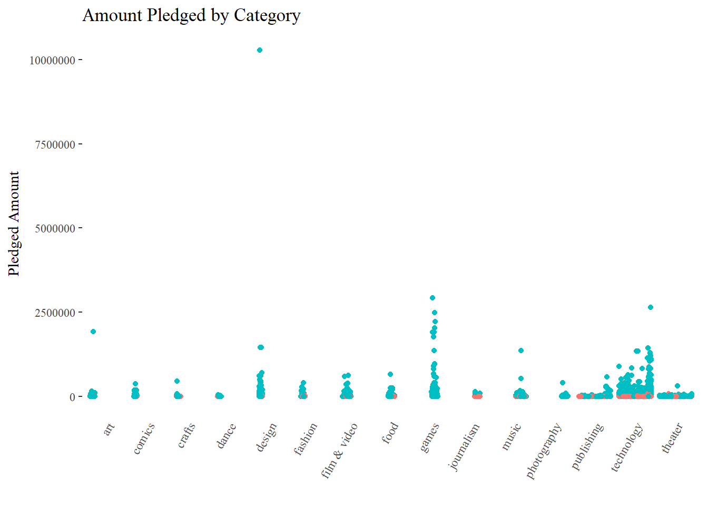<!-- -->

As can be seen from the plot aove, technology projects receive the most amount of money pledged among all the categories, followed by design and games. More artistic endeavors such as theater, dance and crafts do not have nearly as much money pledged, though this could be because the funding requirements for these projects are also lower.

Next I will look at the relationship between the number of backers and the project category.

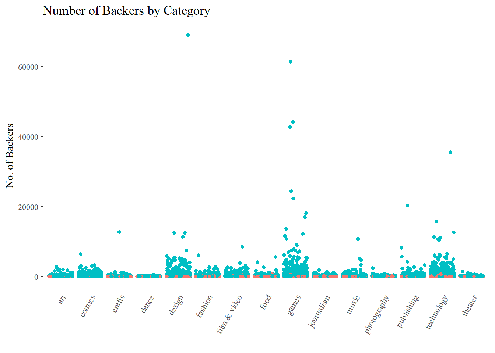<!-- -->


Again, the same pattern holds as with the amount pledged - technology, games and design receive the most backers, while theater, dance and other artistic projects receive considerably fewer backers.

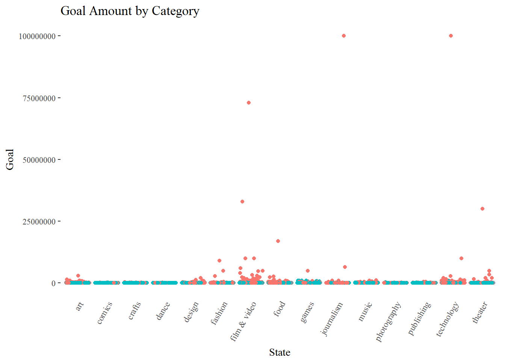<!-- -->


Unsurprisingly, projects with the highest goal amounts are the ones that fail, and this is consistent across all categories (as can be seen by the red dots being clustered at the top). 

<!-- -->

When we adjust the pledged amount by the goal to obtain the achivement ratio, we observe an almost uniform performance across all categories, with a few outliers in a few categories.

# Writing your success story

## 2a) Cleaning the Text and Word Cloud


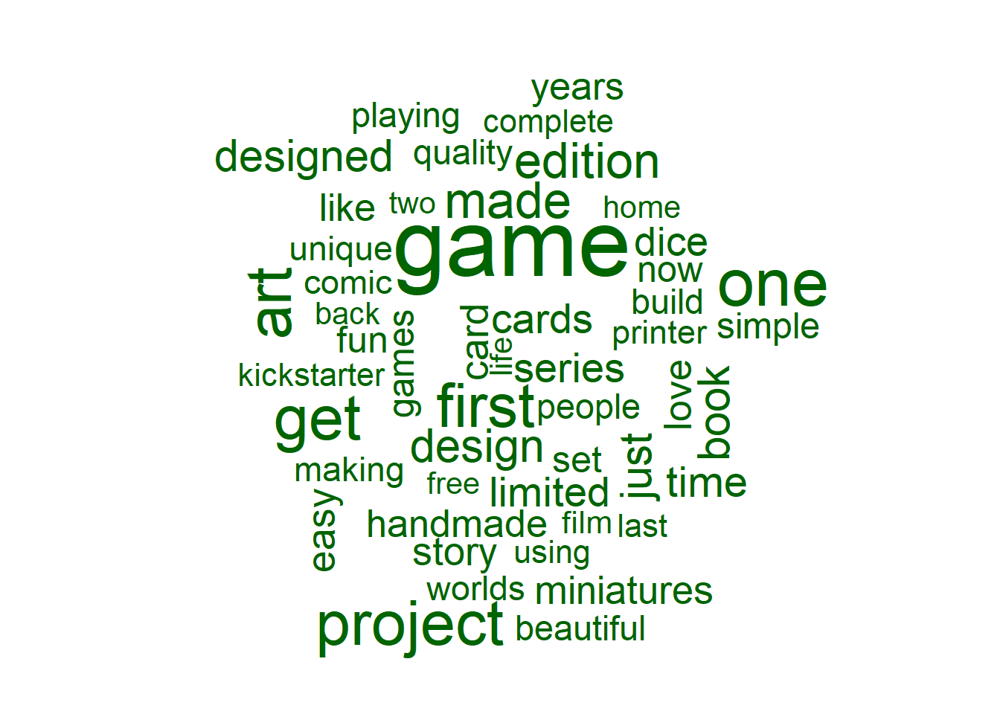<!-- -->

The wordcloud above shows the 50 most popular words that appear in successful blurbs.

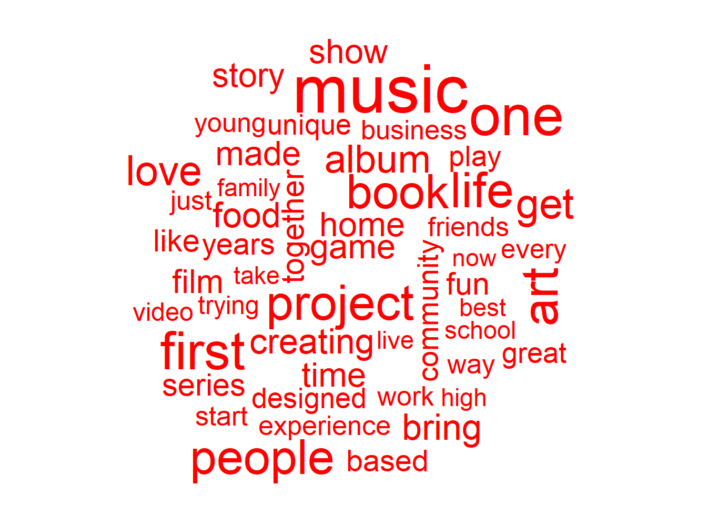<!-- -->

The wordcloud above shows the 50 most popular words that appear in unsuccessful blurbs. There does not seem to be much of a difference between the two word clouds, except that the unsuccessful blurbs seem to focus more on artistic endeavors.


## 2b) Success in words


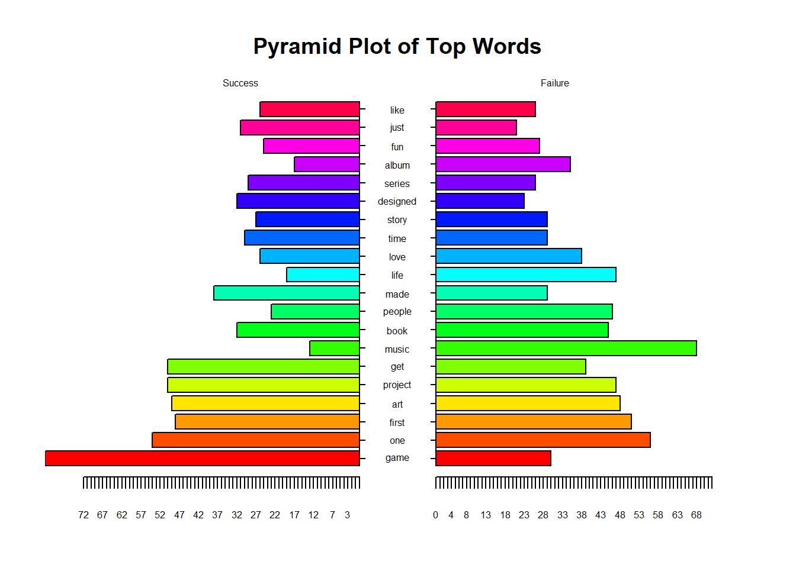<!-- -->

```
## [1] 5.1 4.1 4.1 2.1
```

The pyramid plot above shows the top 20 common words between successful and unsuccessful projects. Games seem to appear more frequently in the blurbs for successful projects, while blurbs for unsuccessful projects seem more oriented around artistic endeavors ('album', 'book', 'music'). This is congruent with our results from the wordclouds above.

## 2c) Simplicity as a virtue


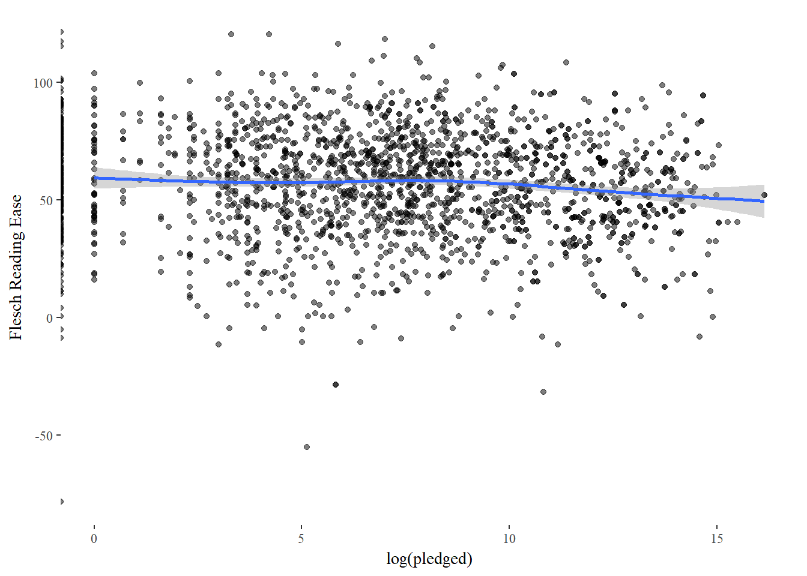<!-- -->

From the plot above there seems to be little relationship between reading ease and the amount of money pledged, especially if the outliers are ignored.

# Sentiment

## 3a) Stay positive


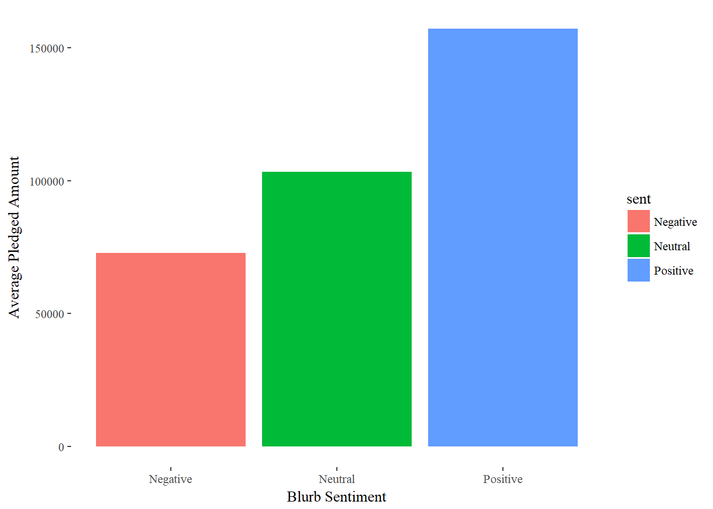<!-- -->

As seen in the bar graph above, positive blurbs receive more pledged money than neutral ones, which in turn receive more money than negative ones.

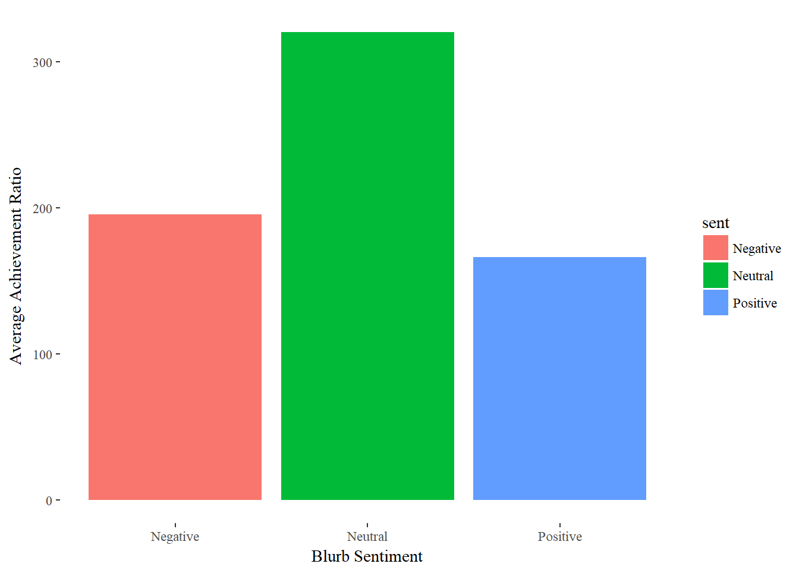<!-- -->

Strangely, there is no discernible pattern when looking at the achievement ratio (pledged/goal), but this is to be expected since we saw that the achievement ratio is an uninformative measure of success in 2c) above.

## 3b) Positive vs Negative
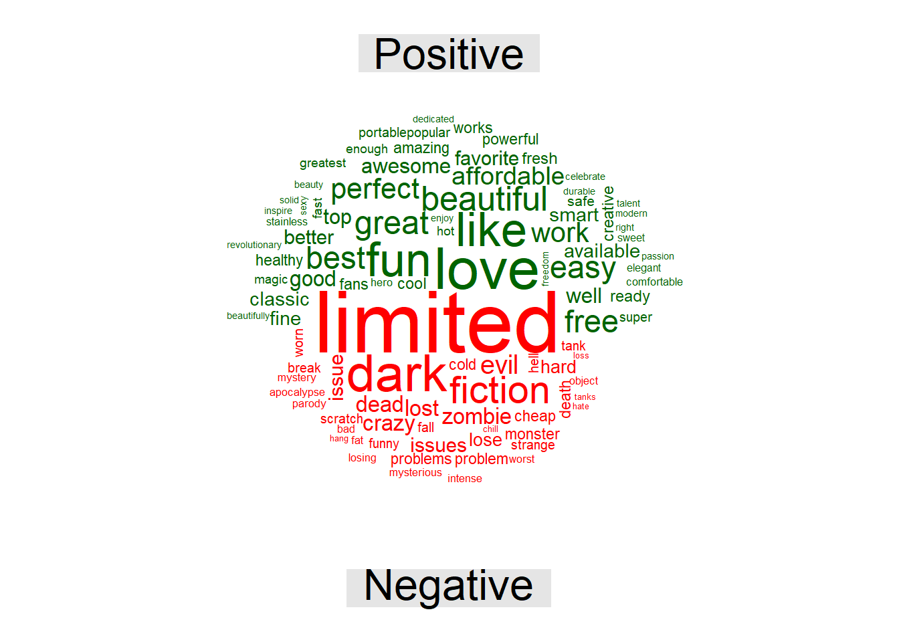<!-- -->

The word cloud above shows the most frequently used positive and negative words in the kickstarter blurbs.'Limited' seems to be the most popular negative word used, though it is questionable if this is truly negative in this context since it might simply denote exclusivity rather than some kind of impediment.

## 3c) Get in their mind


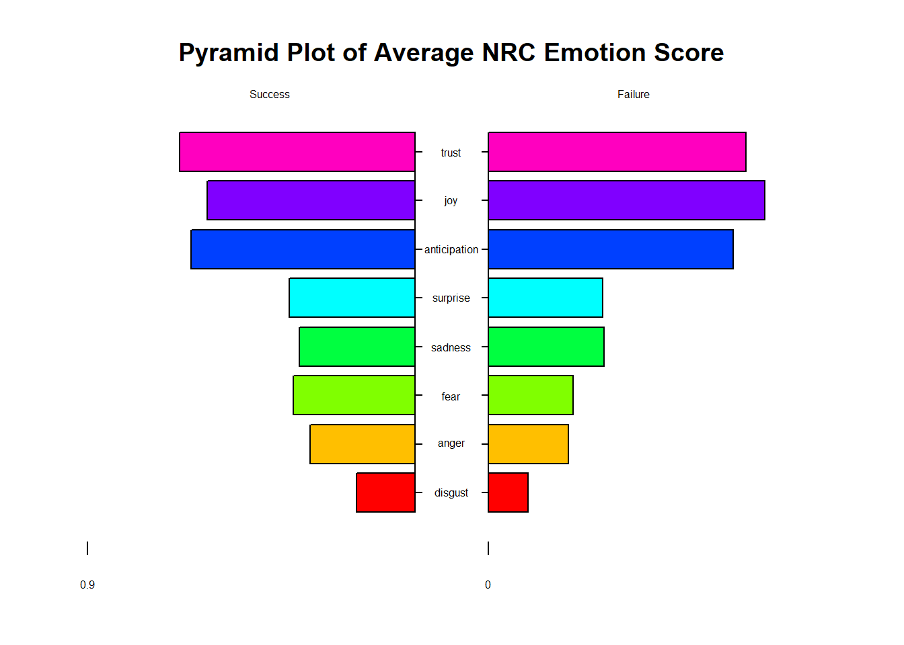<!-- -->

```
## [1] 5.1 4.1 4.1 2.1
```

The pyramid plot above shows the average NRC Word-Emotion Association Lexicon score for each emotion for successful and unsuccessful projects. Surprisingly, successful projects also had higher scores for fear, anger and disgust. This indicates to me that the main difference in the sentiments of successful and unsuccessful projects is that successful projects are simply more **emotive** -- but the emotions expressed are necessarily positive (as classified by the NRC).
