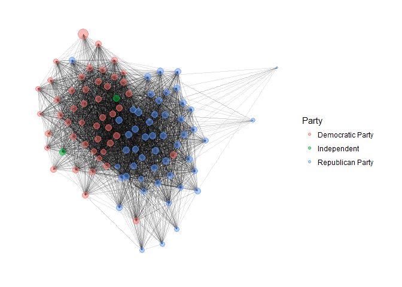
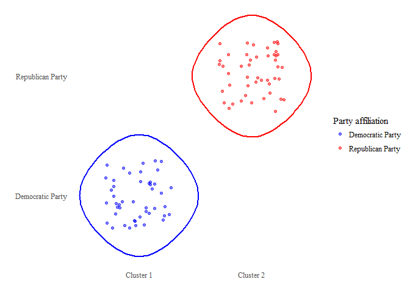
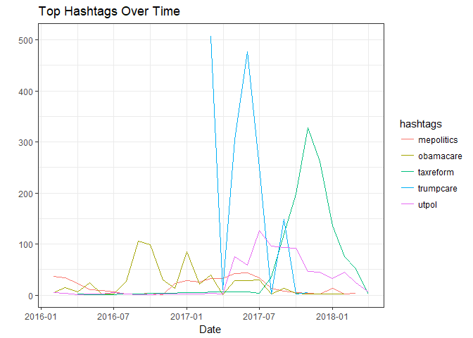
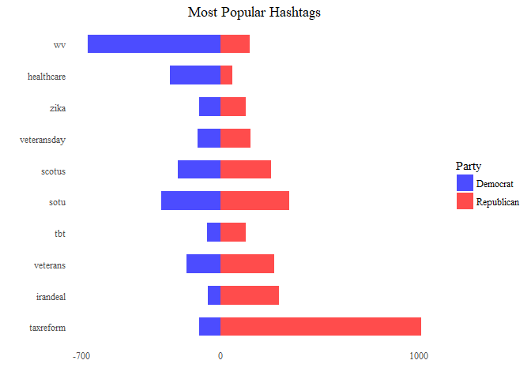
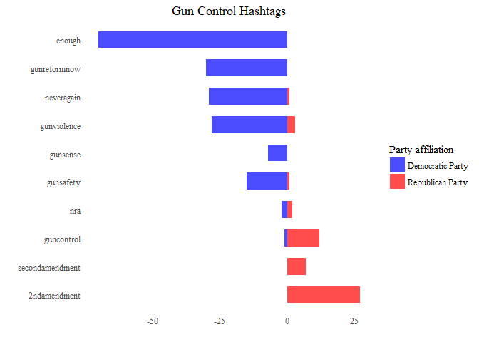
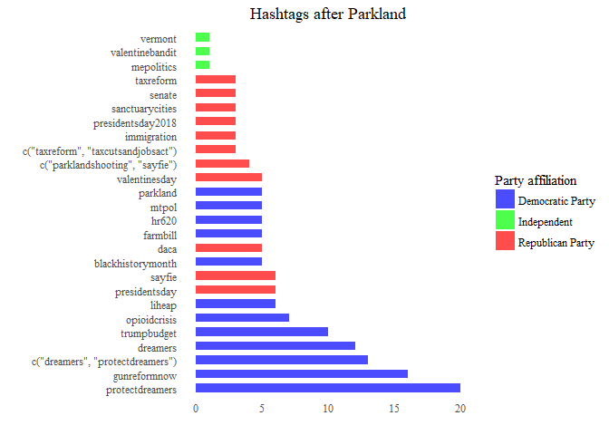
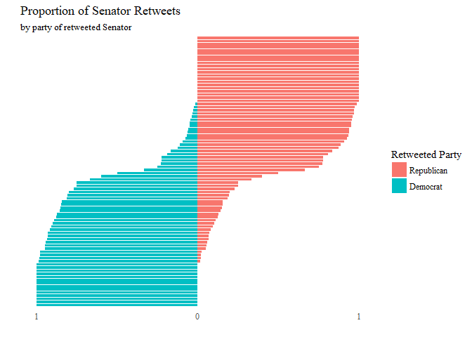
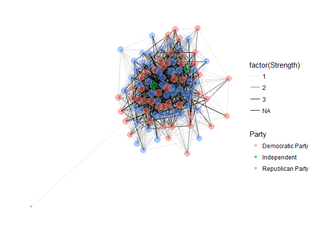

# 1 Who follows whom?

## 1a) Network of Followers


<!-- -->

The graph network seems very dense and a lot of the vertices seem to blend together, which indicates that most of the Senators follow each other and are followed back in turn. There seems to be a few outliers among which are represented by the nodes far from the center of the network. Based on the dataframe from which the graph was generated, we see that the four least central nodes in the graph represent Senators Bob Corker (R-TN), Joni Ernst (R-IA), Kamala Harris (D-CA) and Tina Smith (D-MN). It is understandable that Senators Harris and Smith would be outliers in the graph since they were only recently elected to the Senate (in 2016 and 2018 respectively) and so may not have had enough time to be connected with the other Senators.


```
##         Senator In_Degree
## 1 Kennedy, John        96
## 2    Markey, Ed        96
## 3 Merkley, Jeff        97
## 4    Kaine, Tim        96
```
The Senators with the highest in-degree in the network are listed in the table above. There is a 3-way tie for second place, which is why 4 Senators have been shown.


```
##           Senator Out_Degree
## 1 Murkowski, Lisa         76
## 2    McCain, John         79
## 3  Collins, Susan         82
```
The Senators with the highest out-degree are listed in the table above.


## 1b) Communities

```
## [1] "Democratic Party" "Republican Party"
```


```
## # A tibble: 2 x 2
##   `Party affiliation` Count
##   <fct>               <int>
## 1 Democratic Party       46
## 2 Republican Party       47
```

<!-- -->

As seen in the plot above, the two clusters generated by the **cluster_walktrap** command in the igraph package correspond perfectly to the two political parties. This implies that Senators from the same political party are more densely connected to each other in the twitter network.

# 2 What are they tweeting about?

## a) Most Common Topics over Time


<!-- -->

The line graph above shows the trends over time for the top 5 most-used hashtags in the dataset.*Trumpcare* and *taxreform* seems to have very high peaks, which coincide with the periods in which they were being debated in Congress. *Obamacare* is more of a perennial hashtag, with a sustained interest over a long period of time. *mepolitics* is an inscrutable hashtag, but appears to to be quite persistent over time, perhaps due to the self-centered solipsism of the Senators. Finally, *utpol* refers to the Utah Poll which tracks public sentiment for elections. 

## b) Democrats vs. Republicans


<!-- -->

The plot above shows the top 10 most popular hashtags in the dataset, sorted by party affiliation. It is clear that *tax reform* was the most important topic among Republican Senators by far, which probably refers to the recent *Tax Cuts and Jobs Act of 2017* passed by Congress and signed into law by President Trump in December of 2017.

The most popular hashtag among Democratic Senators is *WV* which presumably stands for West Virginia. All but one of the 818 tweets in the dataset with the WV hashtag can be attributed to the prodigious tweeting of West Virginia Senators Shelley Capito and Joe Manchin, with Senator Manchin's tweets comprising of a majority of the use cases for the hashtag. 

The next most popular hashtag which skewed primarily towards Democrats was *healthcare*, which is more understandable given the efforts of Democratic Senators to protect the Affordable Care Act (aka 'Obamacare') from being repealed by Republicans.


## c) Gun Control I - Dems vs. Reps


<!-- -->

In the plot above we see that Democrats tweet a lot more about gun control than do Republicans, with *enough* being the overwhelmingly most popular hashtag of choice. When Republicans do tweet about gun control, they tend to focus on the constitutional basis of gun rights rather than on a reaction to a specific incident, which can be seen in the exclusively-Republican hashtags regarding the Second Amendment. 


## d) Gun Control II - Parkland Shooting

<!-- -->

From the barplot above it seems like there was a muted response on twitter regarding the Parkland shooting in the week which followed the incident, save for the use of the *gunreformnow* and *parkland* hashtags used by Democratic Senators. The most popular theme during this period was about so-called 'Dreamers', i.e. beneficiaries of President Obama's DACA executive order.

# 3 Are you talking to me?

## a) Identifying Re-Tweets


<!-- -->

As we can see in the plot above, a substantial number of Senators retweet exclusively from their own party, and of those who do retweet from other parties only a minority do so for more than a trivial proportion of their retweets. This is indicative of the partisanship of the Senate even on twitter, with Senators largely remaining within their own ideological echo chambers in cyberspace.


## b) Identifying Mentions

<!-- -->

The undirected network graph above shows the links between retweets among Senators. The nodes are colored according to the Senators' parties and  the thickness of the edge links are shaded according to the strength of the relationship as measured by number of retweets. Again we see that Senators have weak connections to members of the other party, which is consistent with our findings from part 3a above.
