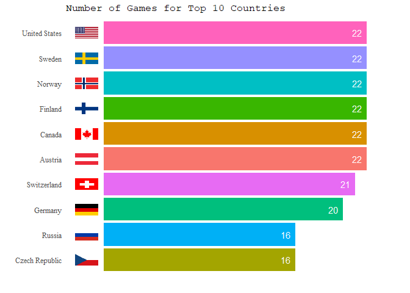
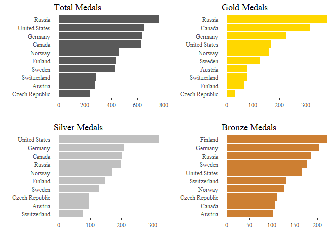
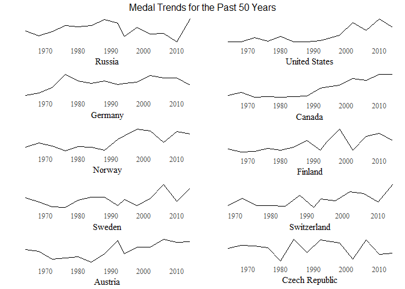
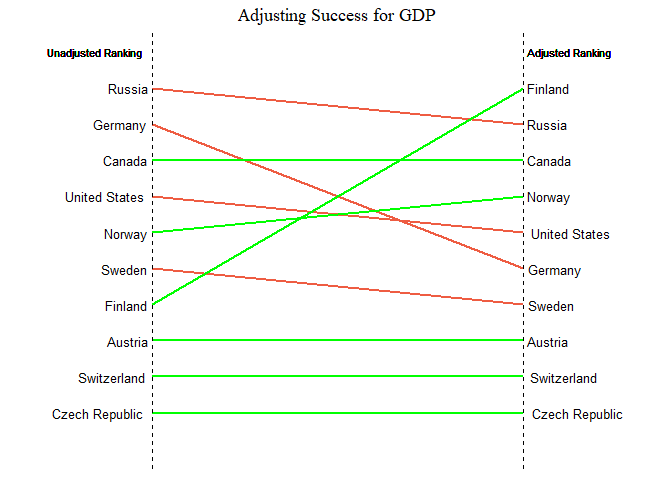
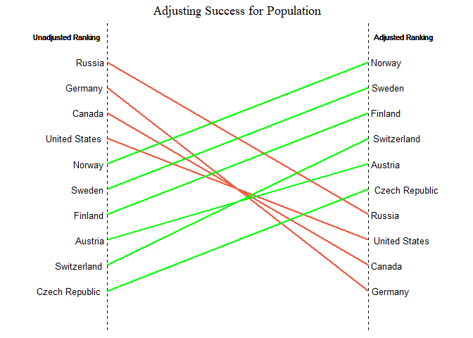
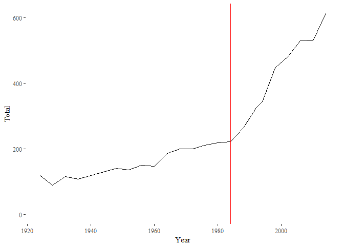
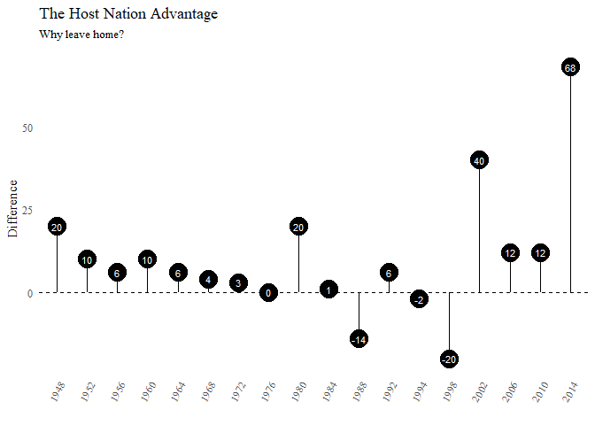
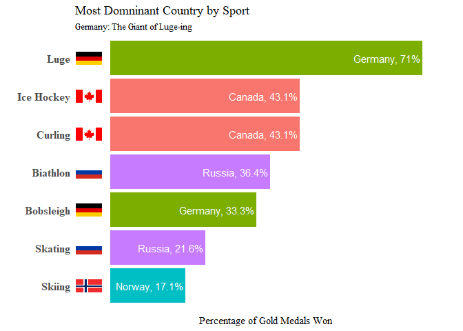
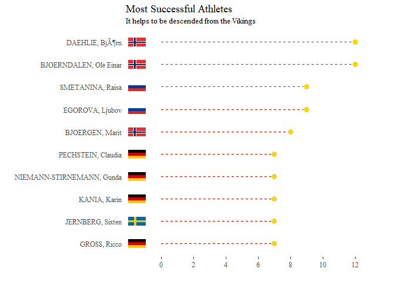

# Data Visualization Assignment 1 - Winter Olympics
Nicholas Wong  
February 15, 2018  

## 1. Medal Counts over Time

I decided to merge EUA, FRG and GDR into Germany, and EUN and URS into Russia for the purpose of this visualization exercise.

I focus only on the top 10 most successful countries by medal count for this question.

In the bar chart below I show how many winter games each of the top 10 most successful countries has participated in. The barplot makes it easy for the reader to make quick comparisons between countries.

<!-- -->

Next I show how many total medals each of these countries won in a barplot, with 3 further bar plots to show how the distribution changes for each category of medals. 

<!-- -->

Lastly, I use a series of sparklines to show the trends in total medal wins over time for each of these 10 countries. 

<!-- -->

## 2. Medal Counts adjusted by Population, GDP

I will use an points index in which gold medals are given 3 points, silver medals are given 2 points and bronze medals are given 1 point. I will use this index to make comparisons of success at the Olympics among countries.

In the following line graph, I show how the unadjusted country ranking of Olympic success changes after dividing by GDP per capita.

<!-- -->

As we can see from the graph, the bottom 3 countries (Austria, Switzerland and Czech Republic) do not change their positions in the rank after accounting for GDP per capita, but Germany and the United States fall significantly. Notice that the line is red when the change is negative and green otherwise.

In the next graph I will repeat the exercise except adjusting for population instead of GDP per capita.

<!-- -->
From the graph above we see that many high-performing countries such as Russia, the United States, Canada and Germany drop drastically in the rankings to the bottom half, which indicates that their success is primarily a factor of their large populations (and hence large talent pools). Smaller Scandinavian countries such as Norway and Sweden seem to perform well despite their low populations.

## 3. Host Country Advantage

For this question we run into the issue of the increasing number of medals that have been awarded in recent times. As we can see from the line graph below, the number of medals awarded at the Winter Olympics have steadily increased since the very first game, and the rate of increase has also accelerated since the 1984 Sarajevo games. This is possibly due to more events being added to the games which allows for more opportunities for countries to win medals.

<!-- -->

However, this presents a problem for calculating the host nation advantage since we can no longer simply compare the host nation's performance with its mean performance across all games, since any host advantage in the early years of the game will be outweighed by the effect of the increased number of medals given out in recent years and vice versa.

To overcome this problem, I use a **k=2 nearest neighbors** estimation for the expected value of the number of medals won for a specific year, and take the difference between this estimate and the actual number of medals won by the host in that year.

<!-- -->

As we can see from the lollipop graph above, there is generally a small host nation advantage, with the host nation outperforming the k=2 nearest neighbors estimate of its expected performance for most years except for Canada, Norway and Japan in 1988, 1994 and 1998 respectively. The host nation advantage was especially pronounced for the US an the 2002 games, and also for Russia in the 2014 games, though the latter may be directly attributable to the widespread cheating among Russian athletes (which resulted in a ban on the Russian team for the ongoing 2018 games).

## 4. Country success by sport / discipline / event

### As a last country level comparison, let's consider comparing countries' success by looking at particular sports, disciplines, and/or events. Make a choice of which kind of comparison reveals some interesting comparison here. Feel free to focus on a subset of data (say one specific sport), only look at a single country etc.

For this question I will look at whether each sport is dominated by a single country. To do this, I look at the share of gold medals won by a each country for each sport in the dataset, and then selecting the country with the highest share of gold medals for each sport. I then represent this in a bar graph for ease of comparison among sports.

<!-- -->

## 5. Most successful athletes

### Now, let's look at the most successful athletes. Provide a visual display of the most successful athletes of all time. Consider using other information on gender, sport, discipline, event, year, and country to make the display more informative.

<!-- -->

I used a dotplot to visualize the most successful athletes in the Winter Olympics by medal count, and made the dots look like mini gold medals.

## Interactivity

## 6. Make two plots interactive

### Choose 2 of the plots you created above and add interactivity. Briefly describe to the editor why interactivity in these visualization is particularly helpful for a reader.

I chose to make the two line plots interactive as it is difficult for the reader to read off the exact values of line graphs. By hovering the cursor over any point in the line graph, the interactive visualization will return information about the graph to the reader.

<!--html_preserve-->

<!--/html_preserve-->

<!--html_preserve-->

<!--/html_preserve-->

## 7. Data Table

I used the modified version of the table from Question 4 above to let readers explore the total medal performance of each country as well as its share of the total number of medals available for each sport.

<!--html_preserve-->

<!--/html_preserve-->

